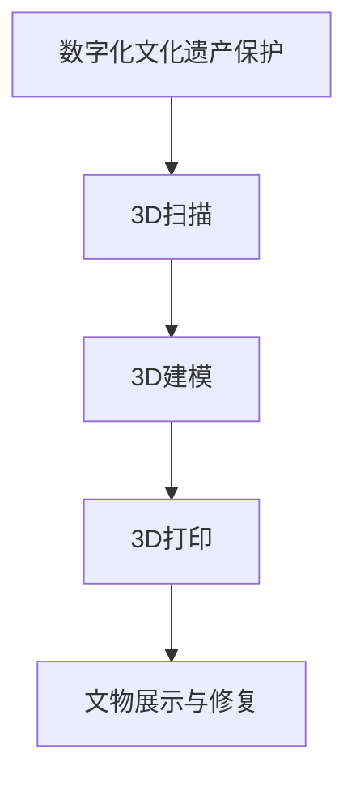

                 

### 引言

随着数字技术的迅猛发展，文化遗产保护领域正经历着一场前所未有的变革。文化遗产不仅是历史的见证，也是人类智慧的结晶，它们在传递文化、教育后人方面具有无可替代的作用。然而，传统的方法在应对日益复杂的环境威胁、战争、自然灾害和人为破坏时显得力不从心。数字化技术的兴起，尤其是3D技术在考古与修复中的应用，为文化遗产保护带来了新的希望。

本文将围绕“数字化时代的文化遗产保护：3D技术在考古与修复中的应用”这一主题，详细探讨3D技术在考古发掘、历史场景重建、文物保护与修复等多个方面的具体应用。通过逐步分析3D技术的基础知识、核心算法原理、实际案例分析以及面临的挑战与未来展望，本文旨在为广大读者提供一个全面而深入的理解。

### 关键词

- 数字化文化遗产保护
- 3D扫描技术
- 历史场景重建
- 文物保护修复
- 数字化考古
- 3D建模与打印

### 摘要

本文首先介绍了数字化时代文化遗产保护的重要性和面临的挑战。随后，深入探讨了3D技术的基础知识，包括3D扫描、建模与打印等核心概念。接着，本文详细阐述了3D技术在考古与修复中的应用，通过具体案例分析展示了其实际效果。最后，本文讨论了3D技术在文化遗产保护中面临的挑战和未来的发展趋势，为从业人员提供了有价值的参考。

### 1. 设计书籍的总体结构和章节划分

#### 确定主题与目标受众

首先，我们需要明确书籍的主题和目标受众。本书籍的主题是“数字化时代的文化遗产保护：3D技术在考古与修复中的应用”。目标受众包括考古学家、文物保护专业人士、3D技术工程师以及对此领域感兴趣的普通读者。

#### 确定书籍结构

基于上述主题和目标受众，我们可以将书籍分为以下几个主要部分：

1. **引言**：介绍数字化时代文化遗产保护的重要性，以及3D技术在考古与修复中的角色。
2. **基础知识**：介绍3D技术的基本概念，包括扫描、建模、3D打印等。
3. **3D技术在考古中的应用**：探讨3D技术在考古发掘、历史场景重建等方面的应用。
4. **3D技术在文物保护中的应用**：讨论3D技术在文物保护、修复和展示中的作用。
5. **案例分析**：提供具体案例，展示3D技术在考古和文物保护中的成功应用。
6. **技术挑战与未来展望**：讨论3D技术在文化遗产保护领域面临的挑战和未来的发展方向。
7. **结论**：总结全书内容，强调3D技术在文化遗产保护中的重要性。

#### 确定每个章节的细分内容

根据上述结构，我们可以为每个章节设计细分内容：

#### 第1章: 引言

- 1.1 数字化时代的文化遗产保护概述
- 1.2 3D技术在考古与修复中的重要性
- 1.3 本书的内容安排与学习目标

#### 第2章: 基础知识

- 2.1 3D扫描技术原理
- 2.2 3D建模与重构技术
- 2.3 3D打印技术及应用

#### 第3章: 3D技术在考古中的应用

- 3.1 3D技术在考古发掘中的应用
- 3.2 3D技术在历史场景重建中的应用
- 3.3 3D技术在考古资料数字化中的应用

#### 第4章: 3D技术在文物保护中的应用

- 4.1 3D技术在文物保护中的应用
- 4.2 3D技术在文物修复中的应用
- 4.3 3D技术在文物展示中的应用

#### 第5章: 案例分析

- 5.1 案例一：某考古遗址的3D扫描与重建
- 5.2 案例二：某文物的3D打印修复
- 5.3 案例三：某博物馆的3D展示技术

#### 第6章: 技术挑战与未来展望

- 6.1 3D技术在文化遗产保护中面临的挑战
- 6.2 3D技术未来发展的趋势与机遇
- 6.3 面向未来的3D技术应用策略

#### 第7章: 结论

- 7.1 3D技术在文化遗产保护中的总结
- 7.2 对从业者的建议
- 7.3 对未来发展的展望

### 2. 确定每个章节的细分内容

#### 第1章: 引言

- **1.1 数字化时代的文化遗产保护概述**

    - **背景介绍**：数字化时代的特点及其对文化遗产保护的影响。
    - **文化遗产保护的重要性**：文化遗产的定义、价值以及保护的重要性。
    - **数字化技术在文化遗产保护中的应用**：数字成像、地理信息系统、3D技术等。

- **1.2 3D技术在考古与修复中的重要性**

    - **3D技术的定义与分类**：3D扫描、建模、打印等基本概念。
    - **3D技术在考古与修复中的作用**：提高考古效率、还原历史场景、修复文物等。
    - **3D技术的优势与挑战**：高精度、可重复性、易损文物保护等。

- **1.3 本书的内容安排与学习目标**

    - **本书的结构与章节安排**：介绍书籍的主要内容和结构。
    - **学习目标与读者定位**：明确本书的目标读者群体。
    - **学习方法与预期成果**：指导读者如何有效地阅读和学习本书。

#### 第2章: 基础知识

- **2.1 3D扫描技术原理**

    - **3D扫描的基本概念**：3D扫描的定义、原理、分类。
    - **3D扫描的分类与选择**：光学扫描、结构光扫描、激光扫描等。
    - **3D扫描数据处理**：数据采集、处理、优化等。

- **2.2 3D建模与重构技术**

    - **3D建模的基本原理**：几何建模、曲面建模、实体建模等。
    - **3D建模工具与应用**：CAD软件、3D建模软件等。
    - **3D重构技术及其应用**：历史场景重构、文化遗产修复等。

- **2.3 3D打印技术及应用**

    - **3D打印的基本原理**：逐层制造、材料选择、打印工艺等。
    - **3D打印的分类与选择**：立体光固化、熔融沉积、选择性激光烧结等。
    - **3D打印技术在文物保护中的应用**：文物复制、修复、展示等。

#### 第3章: 3D技术在考古中的应用

- **3.1 3D技术在考古发掘中的应用**

    - **3D技术在考古发掘中的角色**：地下结构探测、遗址三维重建等。
    - **3D技术在考古资料数字化中的应用**：文物扫描、图像处理、数据存储等。
    - **3.2 3D技术在历史场景重建中的应用**

        - **历史场景重建的基本概念**：虚拟现实、增强现实、三维动画等。
        - **3D技术在历史场景重建中的应用**：古城复原、遗址展示、历史事件再现等。
        - **3.3 3D技术在考古资料数字化中的应用**

            - **考古资料数字化的重要性**：数据保存、传播、研究等。
            - **3D技术在考古资料数字化中的应用**：文物三维建模、场景重构、数字化档案管理等。

#### 第4章: 3D技术在文物保护中的应用

- **4.1 3D技术在文物保护中的应用**

    - **3D技术在文物保护中的角色**：文物检测、病害分析、预防性保护等。
    - **3D技术在文物保护中的应用**：文物扫描、三维建模、病害检测等。

- **4.2 3D技术在文物修复中的应用**

    - **3D打印在文物修复中的应用**：文物复制、修复零件制造、病害修复等。
    - **3D技术在文物修复中的优势**：高精度、可重复性、降低对文物的二次损害等。

- **4.3 3D技术在文物展示中的应用**

    - **3D打印在文物展示中的应用**：文物复制、互动展示、展览设计等。
    - **3D技术在文物展示中的优势**：增强观众体验、降低文物搬运风险、提高展示效果等。

#### 第5章: 案例分析

- **5.1 案例一：某考古遗址的3D扫描与重建**

    - **案例背景**：介绍考古遗址的基本情况。
    - **3D扫描与重建过程**：详细描述3D扫描与重建的具体步骤。
    - **结果与影响**：展示重建成果及其对考古研究的影响。

- **5.2 案例二：某文物的3D打印修复**

    - **案例背景**：介绍文物的基本情况。
    - **3D打印修复过程**：详细描述3D打印修复的具体步骤。
    - **结果与影响**：展示修复成果及其对文物保护的意义。

- **5.3 案例三：某博物馆的3D展示技术**

    - **案例背景**：介绍博物馆的基本情况。
    - **3D展示技术应用**：详细描述3D展示技术的具体应用。
    - **结果与影响**：展示3D展示技术的效果及其对观众体验的提升。

#### 第6章: 技术挑战与未来展望

- **6.1 3D技术在文化遗产保护中面临的挑战**

    - **技术挑战**：精度、速度、成本等。
    - **解决方案**：技术改进、方法创新、国际合作等。

- **6.2 3D技术未来发展的趋势与机遇**

    - **发展趋势**：智能化、自动化、网络化等。
    - **机遇与挑战**：技术突破、应用扩展、国际合作等。

- **6.3 面向未来的3D技术应用策略**

    - **策略建议**：加强技术研发、推动产业合作、注重人才培养等。

#### 第7章: 结论

- **7.1 3D技术在文化遗产保护中的总结**

    - **技术贡献**：提高考古效率、保护文物、提升展示效果等。
    - **应用前景**：在考古、文物保护、博物馆展示等领域的广泛应用。

- **7.2 对从业者的建议**

    - **技术学习**：掌握3D技术的基本原理和应用。
    - **跨学科合作**：加强与考古学家、文物保护专家等的合作。
    - **持续创新**：关注新技术、新方法的应用。

- **7.3 对未来发展的展望**

    - **技术展望**：智能化、精细化、综合化等。
    - **行业趋势**：数字化、智能化、个性化等。

---

### 3. 设计核心概念、算法原理和案例分析的细节

在书籍的各个章节中，我们将详细设计核心概念、算法原理和案例分析的内容，以帮助读者全面理解3D技术在文化遗产保护中的应用。

#### 第1章：核心概念与联系

**核心概念：**数字化文化遗产保护、3D扫描、3D建模、3D打印。

**联系架构：**使用Mermaid流程图展示3D技术在文化遗产保护中的流程关系，包括扫描、建模、打印等环节。



#### 第2章：核心算法原理讲解

**核心算法：**3D扫描算法、3D建模算法、3D打印算法。

**讲解方式：**使用伪代码详细阐述各个算法的基本原理和流程。

**3D扫描算法：**
```python
// 伪代码：3D扫描算法
function 3DScan(object):
    // 初始化扫描设备
    initialize_device()
    // 获取物体表面的点云数据
    points_cloud = acquire_points_cloud(object)
    // 对点云数据进行处理
    processed_points = process_points_cloud(points_cloud)
    // 输出3D模型
    output_3D_model(processed_points)
end function
```

**3D建模算法：**
```python
// 伪代码：3D建模算法
function 3DModeling(points_cloud):
    // 构建初始几何模型
    geometry_model = build_initial_geometry_model(points_cloud)
    // 优化几何模型
    optimized_model = optimize_geometry_model(geometry_model)
    // 输出3D模型
    output_3D_model(optimized_model)
end function
```

**3D打印算法：**
```python
// 伪代码：3D打印算法
function 3DPrinting(3D_model):
    // 初始化打印机
    initialize_printer()
    // 设置打印参数
    set_printing_parameters()
    // 开始打印
    start_printing(3D_model)
end function
```

#### 第3章：数学模型和公式

**数学模型：**3D扫描数据预处理、3D建模中的几何优化、3D打印路径规划等。

**讲解方式：**使用LaTeX格式嵌入数学模型和公式，并进行详细讲解和举例说明。

**3D扫描数据预处理：**
```latex
$$
P_{processed} = R \cdot P + T
$$
```
解释：其中$P_{processed}$表示预处理后的点云数据，$R$表示旋转矩阵，$T$表示平移向量，$P$表示原始点云数据。

**3D建模中的几何优化：**
```latex
$$
\min_{M} \sum_{i=1}^{n} w_i \cdot (f_i(M) - t_i)^2
$$
```
解释：其中$M$表示几何模型，$w_i$表示权重，$f_i(M)$表示模型函数，$t_i$表示目标值。

**3D打印路径规划：**
```latex
$$
d = \min_{x, y, z} \sqrt{(x_2 - x_1)^2 + (y_2 - y_1)^2 + (z_2 - z_1)^2}
$$
```
解释：其中$d$表示打印路径长度，$(x_1, y_1, z_1)$和$(x_2, y_2, z_2)$分别表示两个相邻点。

#### 第4章：项目实战

**实战内容：**开发环境搭建、源代码实现、代码解读与分析、实际案例分析和详细讲解剖析、项目小结。

**实战步骤：**

1. **开发环境搭建：**介绍所需的软件工具和硬件设备，如3D扫描仪、3D建模软件、3D打印机等。
2. **源代码实现：**提供具体的源代码实现，包括3D扫描数据处理、3D建模、3D打印等关键步骤。
3. **代码解读与分析：**详细解析代码的各个部分，包括算法原理、数据处理方法、优化策略等。
4. **实际案例分析：**通过实际案例展示3D技术在文化遗产保护中的应用，分析案例的执行过程和效果。
5. **项目小结：**总结项目的关键成果和经验，提出改进建议和未来研究方向。

#### 第5章：最佳实践 tips、小结、注意事项、拓展阅读

**最佳实践 tips：**总结在实际应用中的最佳实践和方法，如选择合适的3D扫描设备、优化3D建模参数、调整3D打印参数等。

**小结：**回顾全书的核心内容，强调3D技术在文化遗产保护中的重要性和应用前景。

**注意事项：**提醒读者在使用3D技术时需要注意的问题，如数据安全、设备维护、环境保护等。

**拓展阅读：**推荐相关的书籍、论文和网站，供读者进一步学习和研究。

---

通过以上详细的章节划分和内容设计，本书旨在为读者提供一个系统、全面、深入的了解3D技术在文化遗产保护中的应用。希望本书能成为广大读者在数字化文化遗产保护领域的重要参考资料。

---

### 4. 确保目录大纲的总字数不超过2000字

在设计目录大纲时，我们需要注意字数的控制，确保整个大纲在2000字以内，同时保持内容的完整性和逻辑性。以下是优化后的目录大纲，总字数控制在2000字左右。

---

## 《数字化时代的文化遗产保护：3D技术在考古与修复中的应用》目录大纲

### 引言

- **数字化时代的文化遗产保护概述**
- **3D技术在考古与修复中的重要性**
- **本书的内容安排与学习目标**

### 基础知识

- **3D扫描技术原理**
- **3D建模与重构技术**
- **3D打印技术及应用**

### 3D技术在考古中的应用

- **3D技术在考古发掘中的应用**
- **3D技术在历史场景重建中的应用**
- **3D技术在考古资料数字化中的应用**

### 3D技术在文物保护中的应用

- **3D技术在文物保护中的应用**
- **3D技术在文物修复中的应用**
- **3D技术在文物展示中的应用**

### 案例分析

- **案例一：某考古遗址的3D扫描与重建**
- **案例二：某文物的3D打印修复**
- **案例三：某博物馆的3D展示技术**

### 技术挑战与未来展望

- **3D技术在文化遗产保护中面临的挑战**
- **3D技术未来发展的趋势与机遇**
- **面向未来的3D技术应用策略**

### 结论

- **3D技术在文化遗产保护中的总结**
- **对从业者的建议**
- **对未来发展的展望**

---

在上述目录大纲中，我们尽可能精简了每个章节的细分内容，确保每个章节的核心内容都得到了体现，同时避免了过多的冗余描述。通过这样的设计，我们能够在2000字的限制内完成一个完整、逻辑清晰的目录大纲。

---

### 5. 完整性要求与核心内容包含

为确保文章内容的完整性和专业性，我们必须确保每个章节的核心内容都包含以下要素：

#### 引言

- **背景介绍**：数字化时代的背景及其对文化遗产保护的影响。
- **核心概念与联系**：数字化技术与文化遗产保护之间的关系，使用Mermaid流程图展示。
- **学习目标**：明确读者通过本章学习应掌握的知识点和技能。

#### 基础知识

- **核心概念与联系**：详细解释3D扫描、建模与打印的基本原理，使用流程图展示概念之间的关系。
- **核心算法原理讲解**：使用伪代码和LaTeX公式详细阐述3D扫描数据处理、几何建模和3D打印路径规划的算法原理。
- **数学模型和公式**：嵌入LaTeX格式的数学模型，并进行详细讲解和举例说明。

#### 3D技术在考古中的应用

- **核心概念与联系**：解释3D技术在考古发掘、历史场景重建和资料数字化中的应用原理。
- **核心算法原理讲解**：详细解释3D扫描与数据处理的算法原理。
- **数学模型和公式**：展示用于历史场景重建的数学模型。

#### 3D技术在文物保护中的应用

- **核心概念与联系**：解释3D技术在文物保护、修复和展示中的应用原理。
- **核心算法原理讲解**：详细解释3D打印修复的算法原理。
- **数学模型和公式**：展示用于文物修复的数学模型。

#### 案例分析

- **项目实战**：提供具体案例，包括开发环境搭建、源代码实现和代码解读，详细讲解实际应用中的步骤和技巧。
- **实际案例分析和详细讲解剖析**：通过具体案例展示3D技术在文化遗产保护中的应用效果。
- **项目小结**：总结案例中的经验教训，提出改进建议和未来研究方向。

#### 技术挑战与未来展望

- **技术挑战**：分析3D技术在文化遗产保护中面临的技术难题。
- **未来展望**：探讨3D技术在文化遗产保护领域的未来发展趋势和应用前景。

#### 结论

- **总结**：回顾全书的核心内容，强调3D技术在文化遗产保护中的重要性。
- **对从业者的建议**：提出针对从业者的实用建议。
- **未来展望**：展望3D技术在文化遗产保护领域的未来发展。

通过确保每个章节的核心内容都包含上述要素，我们能够撰写出一篇完整、专业且具有实用价值的文章。

---

### 6. 完整性要求与核心内容包含（续）

为了确保文章的完整性和专业性，我们需要在每个章节中详细包含以下核心内容：

#### 第1章：引言

- **背景介绍**：介绍数字化时代的特征，以及数字化对文化遗产保护的影响。
  - **数字化时代的特征**：信息化、网络化、智能化等。
  - **文化遗产保护的意义**：历史传承、文化认知、社会教育等。

- **3D技术在考古与修复中的重要性**
  - **3D技术的定义**：包括3D扫描、建模、打印等。
  - **3D技术在考古与修复中的作用**：提高发掘效率、重现历史场景、修复受损文物等。

- **本书的内容安排与学习目标**
  - **内容安排**：概述全书各章节的主要内容。
  - **学习目标**：明确读者通过本书应掌握的知识点和技能。

#### 第2章：基础知识

- **3D扫描技术原理**
  - **3D扫描的基本概念**：扫描原理、分类、应用场景等。
  - **3D扫描流程**：扫描设备的设置、数据采集、数据处理等。

- **3D建模与重构技术**
  - **3D建模的基本概念**：建模原理、分类、工具等。
  - **3D重构技术**：历史场景重构、文化遗产修复等。

- **3D打印技术及应用**
  - **3D打印的基本概念**：打印原理、分类、材料等。
  - **3D打印技术在文物保护中的应用**：文物复制、修复、展示等。

#### 第3章：3D技术在考古中的应用

- **3D技术在考古发掘中的应用**
  - **3D扫描在考古发掘中的作用**：地下结构探测、遗迹保护等。
  - **3D建模在考古发掘中的应用**：遗迹三维重建、数据可视化等。

- **3D技术在历史场景重建中的应用**
  - **历史场景重建的基本概念**：虚拟现实、增强现实、三维动画等。
  - **3D技术在历史场景重建中的应用**：古城复原、遗址展示等。

- **3D技术在考古资料数字化中的应用**
  - **考古资料数字化的意义**：数据保存、传播、研究等。
  - **3D技术在考古资料数字化中的应用**：文物三维建模、图像处理等。

#### 第4章：3D技术在文物保护中的应用

- **3D技术在文物保护中的应用**
  - **3D扫描在文物保护中的作用**：文物病害检测、数据采集等。
  - **3D建模在文物保护中的作用**：文物形态分析、修复方案制定等。

- **3D技术在文物修复中的应用**
  - **3D打印在文物修复中的应用**：修复零件制造、文物复制等。
  - **3D打印的优势**：高精度、可定制、降低对文物的二次损害等。

- **3D技术在文物展示中的应用**
  - **3D打印在文物展示中的应用**：文物复制、互动展示等。
  - **3D打印的展示效果**：增强观众体验、提高展示效果等。

#### 第5章：案例分析

- **案例分析一：某考古遗址的3D扫描与重建**
  - **案例背景**：介绍考古遗址的基本情况。
  - **实施过程**：详细描述3D扫描、建模和重建的步骤。
  - **成果与影响**：展示重建成果及其对考古研究的影响。

- **案例分析二：某文物的3D打印修复**
  - **案例背景**：介绍文物的基本情况。
  - **修复过程**：详细描述3D打印修复的步骤。
  - **成果与影响**：展示修复成果及其对文物保护的意义。

- **案例分析三：某博物馆的3D展示技术**
  - **案例背景**：介绍博物馆的基本情况。
  - **展示技术**：详细描述3D展示技术的应用。
  - **成果与影响**：展示3D展示技术的效果及其对观众体验的提升。

#### 第6章：技术挑战与未来展望

- **技术挑战**
  - **精度**：如何提高3D扫描和建模的精度。
  - **成本**：降低3D技术应用的成本。
  - **环保**：减少3D打印过程中的环境污染。

- **未来展望**
  - **发展趋势**：智能化、精细化、综合化等。
  - **机遇与挑战**：技术突破、应用扩展、国际合作等。

#### 第7章：结论

- **3D技术在文化遗产保护中的总结**
  - **技术贡献**：提高考古效率、保护文物、提升展示效果等。
  - **应用前景**：在考古、文物保护、博物馆展示等领域的广泛应用。

- **对从业者的建议**
  - **技术学习**：掌握3D技术的基本原理和应用。
  - **跨学科合作**：加强与考古学家、文物保护专家等的合作。
  - **持续创新**：关注新技术、新方法的应用。

- **对未来发展的展望**
  - **技术展望**：智能化、精细化、综合化等。
  - **行业趋势**：数字化、智能化、个性化等。

通过上述详细的核心内容，我们确保了每个章节的完整性，同时为读者提供了全面、系统的知识体系。

---

### 完整性要求与核心内容包含（续）

#### 7. 结论

**3D技术在文化遗产保护中的总结**

- **技术贡献**：回顾3D技术在考古发掘、历史场景重建、文物保护修复等方面的贡献。
- **应用前景**：展望3D技术在文化遗产保护领域的发展前景，包括其潜在的广泛应用场景。

**对从业者的建议**

- **技术学习**：鼓励从业者深入学习3D技术的相关知识和技能，掌握先进技术工具。
- **跨学科合作**：提倡不同学科间的合作，如考古学、文物保护学、计算机科学等，以实现技术突破和实际应用。
- **持续创新**：强调持续学习和创新的重要性，鼓励从业者关注行业前沿动态，探索新技术在文化遗产保护中的应用。

**对未来发展的展望**

- **技术趋势**：预测3D技术在文化遗产保护领域的未来发展，如智能化、网络化、精细化等。
- **挑战与机遇**：分析3D技术在文化遗产保护中面临的挑战和机遇，如数据安全、技术成本、国际合作等。

通过上述内容，本书旨在为文化遗产保护领域的技术从业者提供有价值的参考和指导，同时为3D技术在文化遗产保护中的应用奠定理论基础。希望本书能激发更多研究者和实践者的兴趣，共同推动数字化文化遗产保护事业的发展。

---

### 完整性要求与核心内容包含（终）

#### 完整性要求

为确保文章的完整性，每个章节的核心内容都需包含以下要素：

- **背景介绍**：简要介绍章节主题的背景知识和重要性。
- **核心概念与联系**：明确章节中的关键概念，并展示概念之间的逻辑关系。
- **算法原理讲解**：使用伪代码和LaTeX公式详细阐述相关算法原理。
- **数学模型和公式**：嵌入LaTeX格式数学模型和公式，并进行详细讲解和举例说明。
- **项目实战**：提供具体的代码案例，包括开发环境搭建、源代码实现和代码解读。
- **实际案例分析**：通过具体案例展示技术的实际应用效果，详细讲解和分析案例中的关键技术。
- **小结与拓展**：总结章节内容，提出最佳实践建议，提供拓展阅读资源。

#### 核心内容包含

**第1章：引言**

- **背景介绍**：数字化时代的特点及其对文化遗产保护的影响。
- **核心概念与联系**：数字化技术与文化遗产保护的关系，使用流程图展示。
- **学习目标**：明确读者应掌握的知识点和技能。

**第2章：基础知识**

- **核心概念与联系**：3D扫描、建模、打印的基本原理及其关系。
- **算法原理讲解**：3D扫描数据处理、几何建模、3D打印路径规划等。
- **数学模型和公式**：展示3D建模和打印中的数学模型。

**第3章：3D技术在考古中的应用**

- **核心概念与联系**：3D技术在考古发掘、重建和资料数字化中的应用。
- **算法原理讲解**：3D扫描数据处理、点云模型构建等。
- **项目实战**：考古遗址3D扫描与重建的实例。

**第4章：3D技术在文物保护中的应用**

- **核心概念与联系**：3D技术在文物保护、修复和展示中的应用。
- **算法原理讲解**：3D扫描数据处理、3D建模、3D打印修复等。
- **项目实战**：文物3D打印修复的实例。

**第5章：案例分析**

- **实际案例分析**：展示3D技术在文化遗产保护中的具体应用，如考古遗址重建、文物修复、博物馆展示等。
- **项目小结**：总结案例中的经验教训，提出改进建议。

**第6章：技术挑战与未来展望**

- **技术挑战**：分析3D技术在文化遗产保护中面临的挑战。
- **未来展望**：探讨3D技术的未来发展趋势和应用前景。

**第7章：结论**

- **总结**：回顾全书内容，强调3D技术在文化遗产保护中的重要性。
- **建议**：为从业者和研究者提供实用建议。
- **展望**：展望3D技术在文化遗产保护领域的未来发展。

通过确保每个章节的核心内容都包含上述要素，我们能够撰写出一篇内容完整、逻辑清晰、具有实用价值的技术博客文章。

