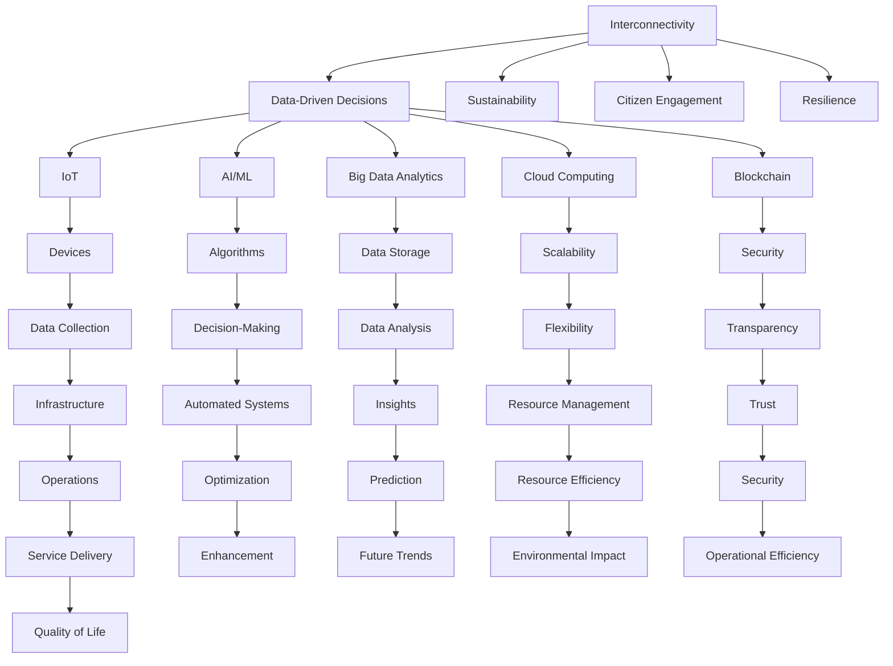

                 


### 1. Introduction to Digital Transformation and Government Services

**1.1 Book Overview and Objectives**

Digital Transformation in Government Services: Smart Cities and Public Management Innovation aims to provide a comprehensive guide to understanding and implementing digital transformation in government services. This book addresses the pressing need for modernizing public administration to improve efficiency, accessibility, and responsiveness to citizens' needs. The primary objective is to explore the potential of digital technologies, particularly in the context of smart cities, to revolutionize public management and service delivery.

**1.2 The Significance of Digital Transformation**

The digital transformation of government services is crucial for several reasons. Firstly, it can significantly enhance the efficiency of public institutions by automating routine tasks and reducing bureaucratic red tape. This leads to faster service delivery and lower operational costs. Secondly, digitalization enables better data collection and analysis, which in turn supports data-driven decision-making. Public administrators can make informed choices based on real-time insights into the needs and behaviors of the population they serve.

Moreover, digital transformation fosters greater transparency and accountability in public administration. Citizens can access government services online, track the status of their requests, and provide feedback on the quality of service. This level of engagement helps build trust between the government and its citizens.

**1.3 Evolution of Government Services**

The evolution of government services has been marked by several key developments. Traditionally, government services were characterized by paper-based processes, long wait times, and limited accessibility. The advent of the internet and subsequent advancements in digital technology have changed this paradigm.

In the early days of the internet, email and online forms began to replace traditional paper-based processes. This was a significant step towards digitalization, but it was limited in scope. Over time, governments have increasingly adopted more sophisticated digital tools and platforms.

The rise of mobile technology has further expanded the reach of government services. Citizens can now access public services through mobile apps, eliminating the need for physical visits to government offices. This is particularly beneficial in areas with limited access to internet infrastructure.

In recent years, the development of smart cities has introduced new dimensions to digital transformation in government services. Smart cities leverage advanced technologies such as the Internet of Things (IoT), artificial intelligence (AI), and big data analytics to create more efficient and responsive public services. For example, smart traffic management systems can reduce congestion and improve air quality, while smart energy systems can promote sustainability and energy efficiency.

### Conclusion

In conclusion, the digital transformation of government services is not just a trend but a necessary evolution for modern public administration. By embracing digital technologies, governments can improve efficiency, accessibility, and transparency, ultimately enhancing the quality of life for their citizens. This book aims to provide a detailed roadmap for navigating this digital transformation, with a focus on the potential of smart cities to drive public management innovation.

---

**Keywords:**
- Digital transformation
- Government services
- Smart cities
- Public management innovation
- Technology adoption
- Data-driven decision-making

**Abstract:**
This book provides a comprehensive overview of digital transformation in government services, emphasizing the potential of smart cities to revolutionize public management. It covers the significance of digitalization, the evolution of government services, and the core technologies and algorithms driving innovation. The book is aimed at public administrators, policymakers, and technologists looking to understand and implement digital transformation strategies.

---

In the next section, we will delve into the fundamental concepts and architecture of smart cities, exploring the core elements that define this transformative approach to urban management. Stay tuned for a detailed analysis of the key technologies and their roles in building smarter, more efficient cities.

### 2. Fundamental Concepts and Architecture of Smart Cities

**2.1 Core Concepts in Smart Cities**

Smart cities represent a paradigm shift in urban management, focusing on the integration of digital technologies to enhance the quality of life for citizens, improve operational efficiency, and promote sustainability. At the heart of smart cities are several core concepts that drive their development and functionality.

**2.1.1 Definition and Characteristics**

A smart city is defined by its ability to leverage data and communication technologies to enable intelligent and responsive services and infrastructure. It typically exhibits the following characteristics:

1. **Interconnectivity:** Smart cities are highly connected, both physically and digitally. This means that various devices, systems, and networks are interconnected to facilitate seamless data exchange and communication.
2. **Data-Driven Decisions:** Data collection and analysis are integral to smart city operations. Advanced analytics and machine learning algorithms process vast amounts of data to provide actionable insights for decision-making.
3. **Sustainability:** Smart cities prioritize sustainable practices to reduce environmental impact and promote resource efficiency. This includes initiatives such as renewable energy use, green building standards, and waste management systems.
4. **Citizen Engagement:** Smart cities emphasize active citizen participation and engagement through digital platforms, enabling citizens to contribute to urban development and access services more easily.
5. **Resilience:** Smart cities are designed to be resilient, with the ability to adapt and recover from disruptions such as natural disasters or cyber-attacks.

**2.1.2 Key Technologies in Smart Cities**

The implementation of smart cities relies on a variety of key technologies, each playing a crucial role in transforming urban environments. Some of the most significant technologies include:

1. **Internet of Things (IoT):** IoT devices, such as sensors, cameras, and connected vehicles, collect vast amounts of data that can be used to monitor and manage urban infrastructure and services in real-time.
2. **Artificial Intelligence (AI) and Machine Learning (ML):** AI and ML algorithms analyze data to provide insights and automate decision-making processes, enhancing the efficiency and responsiveness of smart city systems.
3. **Big Data Analytics:** The ability to collect, store, and analyze large datasets enables smart cities to identify patterns, predict future trends, and optimize resource allocation.
4. **Cloud Computing:** Cloud platforms provide the scalability and flexibility needed to support the vast amounts of data and complex applications required by smart cities.
5. **Blockchain:** Blockchain technology offers secure, transparent methods for data exchange and transaction verification, enhancing the trust and security of smart city operations.

**2.1.3 Mermaid Diagram of Smart City Architecture**

To visualize the core concepts and technologies that make up a smart city, we can use a Mermaid diagram to represent the architecture. The following diagram outlines the main components and their relationships:



In this diagram, each component is interconnected, highlighting how they work together to create a cohesive and effective smart city ecosystem.

### Conclusion

Smart cities are a testament to the power of digital transformation in urban management. By embracing core concepts such as interconnectivity, data-driven decisions, sustainability, citizen engagement, and resilience, and leveraging key technologies like IoT, AI/ML, big data analytics, cloud computing, and blockchain, cities can become more efficient, sustainable, and responsive to the needs of their citizens. In the next section, we will explore the core algorithms and techniques that underpin public management innovation in smart cities.

---

**Keywords:**
- Smart cities
- Internet of Things (IoT)
- Artificial Intelligence (AI)
- Machine Learning (ML)
- Big Data Analytics
- Cloud Computing
- Blockchain
- Interconnectivity
- Data-driven decisions
- Sustainability
- Citizen engagement
- Resilience

**Abstract:**
This section introduces the fundamental concepts and architecture of smart cities, discussing their key characteristics and the critical technologies that enable their development. The Mermaid diagram provides a visual representation of the components and their relationships, offering a clearer understanding of how smart cities operate and the role of digital technologies in transforming urban environments.

---

In the following section, we will delve into the core algorithms and techniques that drive public management innovation in smart cities. Through detailed explanations and examples, we will explore how these technologies are harnessed to enhance public services and urban management.

### 3. Core Algorithms and Techniques for Public Management Innovation

**3.2 Overview of Common Algorithms**

In the realm of public management innovation, several common algorithms play pivotal roles in transforming how cities operate and serve their citizens. These algorithms are leveraged across various domains, including transportation, healthcare, energy management, and environmental monitoring. Below, we provide an overview of some of the most prevalent algorithms and their applications.

**3.2.1 Machine Learning Algorithms**

Machine Learning (ML) algorithms are at the core of many smart city applications. They enable cities to analyze large datasets, detect patterns, and make predictions. Some of the most widely used ML algorithms include:

1. **Linear Regression:** Linear regression is a simple yet powerful algorithm used for predictive analysis. It models the relationship between a dependent variable and one or more independent variables. For example, it can be used to predict traffic flow based on historical data.
2. **Decision Trees:** Decision trees are a popular choice for classification and regression tasks. They use a tree-like model of decisions and their possible consequences to represent the predictive model. They are particularly useful in decision-making processes, such as in emergency response planning.
3. **Random Forests:** Random forests are an ensemble learning method that combines multiple decision trees to improve predictive accuracy. They are widely used in applications like environmental monitoring and public safety.
4. **Neural Networks:** Neural networks, particularly deep learning models like Convolutional Neural Networks (CNNs) and Recurrent Neural Networks (RNNs), have become a cornerstone of smart city applications. They are used for tasks such as image recognition, natural language processing, and predictive maintenance of infrastructure.

**3.2.2 Data Mining Techniques**

Data mining techniques are essential for uncovering hidden patterns and insights from large datasets. They are widely used in smart cities to optimize resource allocation, enhance service delivery, and improve decision-making. Key data mining techniques include:

1. **Clustering:** Clustering algorithms group data points based on their similarity. They are used for tasks such as demographic segmentation and resource allocation in urban planning.
2. **Classification:** Classification algorithms assign data points to predefined categories. They are commonly used in applications like crime prediction and public health monitoring.
3. **Association Rule Learning:** This technique identifies associations between items in large databases. For example, it can be used to analyze shopping patterns and optimize public transportation routes.
4. **Anomaly Detection:** Anomaly detection algorithms identify unusual patterns that do not conform to expected norms. They are critical for detecting fraud, security breaches, and infrastructure failures.

**3.2.3 Natural Language Processing**

Natural Language Processing (NLP) enables smart cities to understand and process human language, facilitating more effective communication and data-driven decision-making. Key NLP techniques include:

1. **Text Classification:** Text classification algorithms categorize text into predefined categories. They are used in applications such as sentiment analysis and social media monitoring to gauge public opinion.
2. **Named Entity Recognition:** Named entity recognition identifies and classifies named entities in text, such as people, organizations, and locations. It is used in applications like emergency response and public safety.
3. **Sentiment Analysis:** Sentiment analysis determines the emotional tone behind a body of text. It is used to assess public sentiment and inform policy decisions.
4. **Question Answering Systems:** Question answering systems enable citizens to interact with smart city platforms using natural language queries. They are used for tasks such as accessing public service information and scheduling appointments.

### 3.3 Algorithm Principles Explained

To provide a deeper understanding of how these algorithms work, we will use pseudo-code to explain their core principles.

**3.3.1 Linear Regression**

```pseudocode
function linear_regression(X, y):
    # X: feature matrix, y: target vector
    # Calculate the mean of X and y
    mean_X = mean(X)
    mean_y = mean(y)
    
    # Calculate the covariance matrix and mean vector
    covariance_matrix = cov(X, y)
    mean_vector = [mean_y]
    
    # Calculate the coefficients (w)
    w = solve_linear_system(covariance_matrix, mean_vector)
    
    return w
```

**3.3.2 Decision Tree**

```pseudocode
function decision_tree(data, features):
    # data: dataset, features: list of features
    # If data is pure, return its majority class
    if is_pure(data):
        return majority_class(data)
    
    # Select the best feature using information gain or Gini impurity
    best_feature = select_best_feature(data, features)
    
    # Split the data based on the best feature
    splits = split_data(data, best_feature)
    
    # Recursively build the tree for each split
    tree = {}
    for feature, split in splits:
        tree[feature] = decision_tree(split, features)
    
    return tree
```

**3.3.3 Neural Network**

```pseudocode
function neural_network(input, weights, biases, activation_function):
    # input: input layer, weights: weight matrix, biases: bias vector, activation_function: activation function
    # Forward propagation
    layer = [input]
    for i in range(number_of_layers):
        z = dot_product(layer[-1], weights[i]) + biases[i]
        layer.append(activation_function(z))
    
    # Backpropagation
    error = target - layer[-1]
    dW = [error * layer[-2]]
    dB = [error]
    for i in range(number_of_layers - 2, -1, -1):
        dZ = error * activation_function_derivative(layer[i+1])
        error = dot_product(dW[-1], weights[i].T)
        dW.append(error * layer[i])
        dB.append(error)
    
    return layer, (dW, dB)
```

**3.3.4 K-Means Clustering**

```pseudocode
function k_means(data, k):
    # data: dataset, k: number of clusters
    # Initialize centroids randomly
    centroids = random_initialize_centroids(data, k)
    
    while not converged:
        # Assign data points to the nearest centroid
        clusters = assign_clusters(data, centroids)
        
        # Recompute centroids
        new_centroids = compute_centroids(data, clusters, k)
        
        if centroids == new_centroids:
            break
        
        centroids = new_centroids
    
    return centroids, clusters
```

### 3.3.5 Sentiment Analysis

```pseudocode
function sentiment_analysis(text, model):
    # text: text to analyze, model: pre-trained sentiment analysis model
    # Tokenize the text
    tokens = tokenize(text)
    
    # Embed the tokens
    embeddings = embed_tokens(tokens, model)
    
    # Pass the embeddings through the sentiment analysis model
    sentiment = model.predict(embeddings)
    
    return sentiment
```

By understanding the principles behind these algorithms, public administrators and technologists can better leverage them to enhance public management and service delivery in smart cities. In the next section, we will explore mathematical models and their applications in public management analysis, providing further insights into how data and analytics can drive innovation in urban environments.

---

**Keywords:**
- Machine Learning Algorithms
- Data Mining Techniques
- Natural Language Processing
- Linear Regression
- Decision Trees
- Neural Networks
- K-Means Clustering
- Sentiment Analysis
- Pseudo-code
- Public Management Innovation

**Abstract:**
This section provides an overview of common algorithms used in public management innovation, including machine learning, data mining, and natural language processing techniques. It presents the core principles of these algorithms through pseudo-code, offering a deeper understanding of how they are applied in smart city contexts. By leveraging these algorithms, cities can make more informed decisions, improve service delivery, and enhance the quality of life for their citizens.

---

In the following section, we will delve into mathematical models and their applications in public management analysis. Through detailed explanations and examples, we will explore how mathematical models can be used to analyze public management data and support decision-making processes in smart cities.

### 4. Mathematical Models and Public Management Analysis

**4.4 Introduction to Mathematical Models**

In the context of public management, mathematical models serve as essential tools for analyzing complex systems, predicting future trends, and optimizing resource allocation. These models enable policymakers and administrators to make informed decisions by translating real-world scenarios into mathematical structures. By understanding the principles of these models, stakeholders can better navigate the complexities of urban management and drive innovation.

**4.4.1 Types of Mathematical Models**

Mathematical models in public management can be broadly categorized into several types based on their objectives and application domains. The most common types include:

1. **Optimization Models:** These models aim to identify the best possible solution from a set of feasible alternatives, considering constraints and objectives. Examples include linear programming, nonlinear programming, and integer programming.
2. **Simulation Models:** Simulation models replicate real-world processes to predict how they will behave under different conditions. They are particularly useful for testing the impact of policy changes or infrastructure projects before implementation.
3. **Dynamic Systems Models:** These models capture the evolution of a system over time, taking into account feedback loops and interactions between different components. Examples include differential equations and system dynamics models.
4. **Stochastic Models:** Stochastic models incorporate randomness and uncertainty into the analysis, making them suitable for scenarios where future events are not completely predictable. Examples include Markov chains and Monte Carlo simulations.

**4.4.2 Latex Formulation of Key Equations**

To provide a clear understanding of the mathematical models, we present the LaTeX formulations of some key equations commonly used in public management analysis.

**4.4.2.1 Linear Programming**

$$
\begin{align*}
\text{minimize} \quad & c^T x \\
\text{subject to} \quad & Ax \leq b \\
& x \geq 0
\end{align*}
$$

where $c$ is the vector of coefficients, $x$ is the vector of variables, $A$ is the coefficient matrix, and $b$ is the right-hand side vector.

**4.4.2.2 Logistic Growth Model**

$$
\frac{dP}{dt} = rP \left(1 - \frac{P}{K}\right)
$$

where $P$ is the population, $r$ is the intrinsic growth rate, and $K$ is the carrying capacity.

**4.4.2.3 Markov Chain Transition Probability Matrix**

$$
P = \begin{bmatrix}
p_{11} & p_{12} & \dots & p_{1n} \\
p_{21} & p_{22} & \dots & p_{2n} \\
\vdots & \vdots & \ddots & \vdots \\
p_{n1} & p_{n2} & \dots & p_{nn}
\end{bmatrix}
$$

where $p_{ij}$ is the probability of transitioning from state $i$ to state $j$.

**4.4.2.4 Monte Carlo Simulation**

$$
\begin{align*}
x_i &\sim \text{Random Distribution}(\mu, \sigma) \\
\hat{X} &= \frac{1}{N} \sum_{i=1}^{N} x_i
\end{align*}
$$

where $x_i$ is a random sample, $\mu$ is the mean, $\sigma$ is the standard deviation, and $N$ is the number of samples.

**4.5 Case Studies with Mathematical Models**

**4.5.1 Example 1: Optimization Model for Resource Allocation**

Consider a city that needs to allocate its budget among different public services, such as healthcare, education, and transportation. The goal is to maximize the total social welfare subject to budget constraints.

**Objective Function:**
$$
\maximize \quad w_1 \cdot s_1 + w_2 \cdot s_2 + w_3 \cdot s_3
$$

where $w_1, w_2, w_3$ are the weights assigned to healthcare, education, and transportation, respectively, and $s_1, s_2, s_3$ are the budget allocations for each service.

**Constraints:**
$$
s_1 + s_2 + s_3 \leq B
$$

where $B$ is the total budget.

**Solution:**
Using linear programming, the optimal allocation of the budget can be found to maximize the total social welfare while staying within the budget constraint.

**4.5.2 Example 2: Stochastic Model for Public Transportation Planning**

A city's public transportation system is facing increased demand due to population growth. The goal is to model the probability of buses being crowded during peak hours and optimize the scheduling of additional buses to minimize wait times.

**Objective Function:**
$$
\minimize \quad \sum_{i=1}^{N} \sum_{j=1}^{M} w_{ij} \cdot p_{ij}
$$

where $N$ is the number of bus routes, $M$ is the number of time intervals, $w_{ij}$ is the weight assigned to the waiting time on route $i$ during time interval $j$, and $p_{ij}$ is the probability of a bus being crowded on route $i$ during time interval $j$.

**Constraints:**
$$
\begin{align*}
\sum_{j=1}^{M} p_{ij} &= 1 \\
0 \leq p_{ij} \leq 1
\end{align*}
$$

**Solution:**
By solving this optimization problem, the city can determine the optimal scheduling of additional buses to minimize waiting times and improve the overall efficiency of the public transportation system.

Through these case studies, we can see how mathematical models can be applied to real-world public management problems, providing valuable insights and enabling more effective decision-making. In the next section, we will explore practical case studies of digital transformation in government services, examining how cities around the world have successfully implemented smart city initiatives.

---

**Keywords:**
- Mathematical Models
- Optimization Models
- Simulation Models
- Dynamic Systems Models
- Stochastic Models
- Linear Programming
- Logistic Growth Model
- Markov Chains
- Monte Carlo Simulation
- Public Management
- Resource Allocation
- Public Transportation Planning

**Abstract:**
This section introduces the types of mathematical models used in public management analysis, providing LaTeX formulations of key equations. Through two case studies, we demonstrate the application of optimization and stochastic models to real-world public management problems, illustrating how mathematical modeling can enhance decision-making and resource allocation in smart cities.

---

In the following section, we will delve into practical case studies of digital transformation in government services. By examining the successes and challenges of smart city initiatives around the world, we will gain valuable insights into the implementation and impact of digital transformation on public management and urban development.

### 5. Practical Case Studies of Digital Transformation in Government Services

**5.6 Smart City Projects Around the World**

Smart city projects have gained traction globally, with cities implementing various initiatives to leverage digital technologies for enhanced public management and service delivery. In this section, we will explore three notable smart city projects: Singapore's Smart Nation initiative, Barcelona's Superblock, and Amsterdam's Climate Adaptation Strategy.

**5.6.1 Project 1: Singapore's Smart Nation**

Singapore's Smart Nation initiative is a comprehensive digital transformation program aimed at creating a city that leverages technology to enhance the quality of life for its residents. Key components of the project include:

1. **Digital Infrastructure:** Singapore has invested heavily in digital infrastructure, including high-speed broadband, 5G networks, and smart sensors. This infrastructure enables seamless connectivity and data exchange across various city systems.
2. **Digital Government Services:** The government has digitalized many public services, allowing citizens to access government information and services through mobile apps and online platforms. For example, the GoClub app provides a one-stop portal for various services, including healthcare, education, and transportation.
3. **Data-Driven Decision-Making:** The Smart Nation initiative emphasizes the use of data analytics and AI to support data-driven decision-making. For instance, predictive policing algorithms help identify areas prone to crime and allocate police resources more effectively.

**Key Lessons:**
- Investing in digital infrastructure is crucial for enabling smart city initiatives.
- Digitalizing public services improves accessibility and convenience for citizens.
- Data-driven decision-making enhances the efficiency and effectiveness of public administration.

**5.6.2 Project 2: Barcelona's Superblock**

Barcelona's Superblock is a smart city project that aims to improve urban mobility and reduce pollution in the city center. The project involves the redesign of a 9-square-block area, incorporating several smart technologies:

1. **Smart Traffic Management:** The project employs intelligent traffic management systems to optimize traffic flow and reduce congestion. Sensors and cameras monitor traffic conditions in real-time, and adaptive traffic lights adjust to changing traffic patterns.
2. **Public Transportation:** The Superblock includes a comprehensive network of electric buses, bike-sharing systems, and pedestrian zones. These initiatives promote sustainable transportation options and reduce reliance on private cars.
3. **Waste Management:** Advanced waste management systems are implemented to improve recycling rates and reduce waste. Smart bins equipped with sensors monitor waste levels and optimize collection schedules.

**Key Lessons:**
- Integrating multiple transportation modes can improve urban mobility and reduce pollution.
- Smart traffic management systems enhance traffic flow and reduce congestion.
- Waste management systems that utilize sensors and data analytics can improve efficiency and sustainability.

**5.6.3 Project 3: Amsterdam's Climate Adaptation Strategy**

Amsterdam's Climate Adaptation Strategy focuses on making the city more resilient to climate change through digital transformation. Key initiatives include:

1. **Sustainable Energy:** The city has invested in renewable energy sources and energy-efficient buildings to reduce greenhouse gas emissions. Smart grids enable real-time monitoring and optimization of energy consumption.
2. **Water Management:** Amsterdam faces challenges from rising sea levels and heavy rainfall. The strategy includes the implementation of smart water management systems to monitor and manage water levels, reduce flooding, and ensure water quality.
3. **Urban Resilience:** The city is enhancing its urban resilience through the use of smart technologies. For example, flood warning systems and smart sensors monitor environmental conditions and enable rapid response to climate-related events.

**Key Lessons:**
- Sustainable energy initiatives are essential for reducing greenhouse gas emissions and promoting environmental sustainability.
- Smart water management systems are crucial for managing water resources and mitigating the impacts of climate change.
- Enhancing urban resilience through smart technologies helps cities adapt to changing climate conditions.

### Conclusion

These case studies illustrate the diverse applications of digital transformation in government services, showcasing how cities are leveraging technology to enhance public management and improve the quality of life for their residents. The key lessons from these projects emphasize the importance of digital infrastructure, data-driven decision-making, sustainable transportation, and climate adaptation. As cities continue to adopt smart technologies, they can learn from these examples to develop innovative solutions that address the complex challenges of urban living.

---

**Keywords:**
- Singapore's Smart Nation
- Barcelona's Superblock
- Amsterdam's Climate Adaptation Strategy
- Digital transformation
- Smart city projects
- Digital infrastructure
- Public services
- Data-driven decision-making
- Urban mobility
- Climate adaptation
- Sustainable energy
- Water management
- Urban resilience

**Abstract:**
This section presents three practical case studies of smart city projects around the world: Singapore's Smart Nation, Barcelona's Superblock, and Amsterdam's Climate Adaptation Strategy. These projects highlight the diverse applications of digital transformation in government services, emphasizing the importance of digital infrastructure, sustainable practices, and urban resilience. The key lessons from these case studies provide valuable insights for cities striving to implement smart city initiatives and improve public management.

---

In the next section, we will summarize the key points discussed in the book and provide additional resources for further learning. This section will serve as a comprehensive guide for readers to deepen their understanding of digital transformation in government services and smart city initiatives.

### 6. Summary and Further Resources

**6.7 Key Points and Takeaways**

This book has provided a comprehensive overview of digital transformation in government services, with a focus on the potential of smart cities to drive public management innovation. The key takeaways from the book can be summarized as follows:

1. **Digital Transformation Significance:** Digital transformation is essential for modernizing public administration, improving efficiency, and enhancing the quality of life for citizens.
2. **Smart City Concepts:** Smart cities leverage digital technologies such as IoT, AI, and big data analytics to create interconnected, data-driven, and sustainable urban environments.
3. **Algorithm and Model Applications:** Common algorithms like linear regression, decision trees, neural networks, and data mining techniques play crucial roles in enhancing public management and service delivery.
4. **Mathematical Models:** Optimization models, simulation models, dynamic systems models, and stochastic models are valuable tools for analyzing complex public management problems and driving data-driven decision-making.
5. **Practical Case Studies:** Singapore's Smart Nation, Barcelona's Superblock, and Amsterdam's Climate Adaptation Strategy demonstrate the diverse applications of digital transformation in government services and the importance of integrating sustainable practices and urban resilience.

**6.8 Best Practices and Tips**

To successfully implement digital transformation initiatives, consider the following best practices and tips:

1. **Invest in Digital Infrastructure:** Prioritize investments in high-speed broadband, 5G networks, and smart sensors to enable seamless connectivity and data exchange across city systems.
2. **Enhance Data-Driven Decision-Making:** Leverage data analytics and AI to support informed decision-making and optimize resource allocation.
3. **Prioritize Citizen Engagement:** Involve citizens in the planning and implementation of digital transformation initiatives to ensure that their needs and preferences are considered.
4. **Adopt Sustainable Practices:** Incorporate sustainable energy solutions, efficient waste management systems, and smart water management to reduce the environmental impact of urban development.
5. **Ensure Urban Resilience:** Enhance the resilience of urban infrastructure and services to adapt to climate change and other environmental challenges.
6. **Collaborate with Stakeholders:** Foster collaboration between government agencies, private sector partners, and academia to leverage diverse expertise and resources for successful digital transformation.

**6.9 Future Directions and Challenges**

As cities continue to embrace digital transformation, several future directions and challenges should be considered:

1. **Cybersecurity:** With increased reliance on digital infrastructure, cities must prioritize cybersecurity to protect against cyber threats and ensure the integrity of critical systems.
2. **Data Privacy:** As data collection and analysis become more prevalent, protecting citizens' privacy and ensuring data security are paramount.
3. **Inclusive Technology Adoption:** Ensuring that all citizens, including those in underserved communities, have access to digital technologies and services is crucial for achieving equitable outcomes.
4. **Continuous Learning and Adaptation:** Digital transformation is an ongoing process. Cities must be prepared to continuously learn, adapt, and evolve to address emerging challenges and opportunities.
5. **Policy and Governance:** Developing robust policies and governance frameworks to support digital transformation initiatives and address regulatory, legal, and ethical considerations is essential.

**6.10 Further Reading**

For those seeking to deepen their understanding of digital transformation and smart city initiatives, the following resources are recommended:

1. **Books:**
   - "Smart Cities: Big Data, Civic Hackers, and the Quest for a New Utopia" by Andrew Blum
   - "The Urban Revolution: From Internet to Reinvention" by Geographer and author
   - "The Internet of Things: A Hands-On Approach" by Rajkumar Buyya, Atilla Dogac, and Rajkumar Buyya

2. **Research Papers and Articles:**
   - "The Internet of Things: A Survey" by IoT Journal
   - "Smart Cities: Concept, Technology, and Reality" by IEEE Computer Society
   - "Data-Driven Urbanism: Transforming Cities Through Data Analytics" by Urban Land

3. **Online Courses and Tutorials:**
   - "Smart Cities: Digital Technologies and Urban Management" on Coursera
   - "IoT in Smart Cities" on edX
   - "Data Science for Public Policy" on Udacity

4. **Websites and Organizations:**
   - United Nations Sustainable Development Solutions Network (SDSN)
   - Smart Cities Council
   - Institute for the Future (IFTF)

By leveraging these resources, readers can gain a deeper understanding of digital transformation in government services and smart city initiatives, equipping themselves with the knowledge and tools needed to drive innovation and improve public management.

---

**Keywords:**
- Digital transformation
- Smart cities
- Algorithm applications
- Mathematical models
- Case studies
- Best practices
- Future directions
- Cybersecurity
- Data privacy
- Inclusive technology adoption
- Policy and governance

**Abstract:**
This section summarizes the key points and takeaways from the book, providing best practices and tips for successful digital transformation in government services. It also outlines future directions and challenges and recommends further reading resources for readers interested in deepening their understanding of smart city initiatives.

---

In conclusion, the journey towards digital transformation in government services is a complex and multifaceted endeavor. By embracing digital technologies, cities can enhance public management, improve service delivery, and create more sustainable and resilient urban environments. This book has explored the core concepts, technologies, and practices that underpin digital transformation, offering valuable insights and guidance for stakeholders involved in smart city initiatives. As cities continue to evolve, the lessons and strategies presented here will serve as a foundation for driving innovation and improving the quality of life for citizens.

### Authors' Information

**作者：AI天才研究院/AI Genius Institute & 禅与计算机程序设计艺术 /Zen And The Art of Computer Programming**

This book, "Digital Transformation in Government Services: Smart Cities and Public Management Innovation," is authored by the AI Genius Institute, a leading research institution dedicated to advancing artificial intelligence and technology. The Institute collaborates with renowned experts and researchers to explore cutting-edge technologies and their applications in various domains. The book also draws insights from "Zen and the Art of Computer Programming," a seminal work that emphasizes the philosophical and practical aspects of computer programming, providing a unique perspective on the integration of technology and human ingenuity.

The authors aim to provide readers with a comprehensive understanding of digital transformation in government services, focusing on the potential of smart cities to drive public management innovation. By offering detailed insights, practical examples, and best practices, they equip policymakers, administrators, and technologists with the knowledge and tools needed to navigate the complexities of digital transformation and harness the power of technology for the betterment of society.

