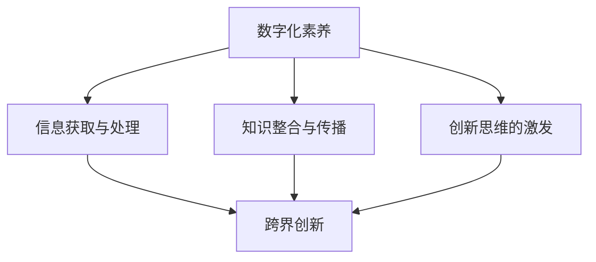
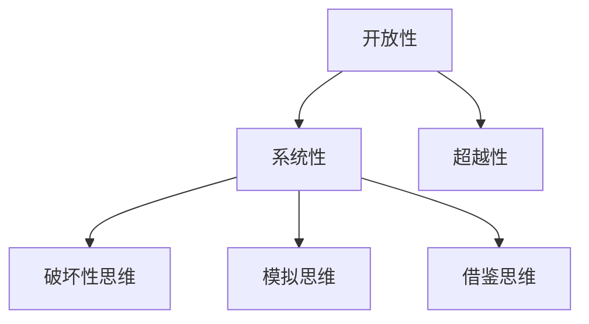
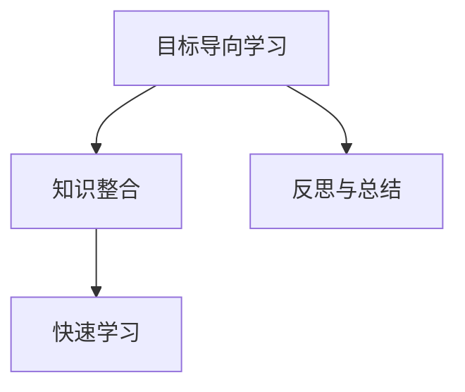
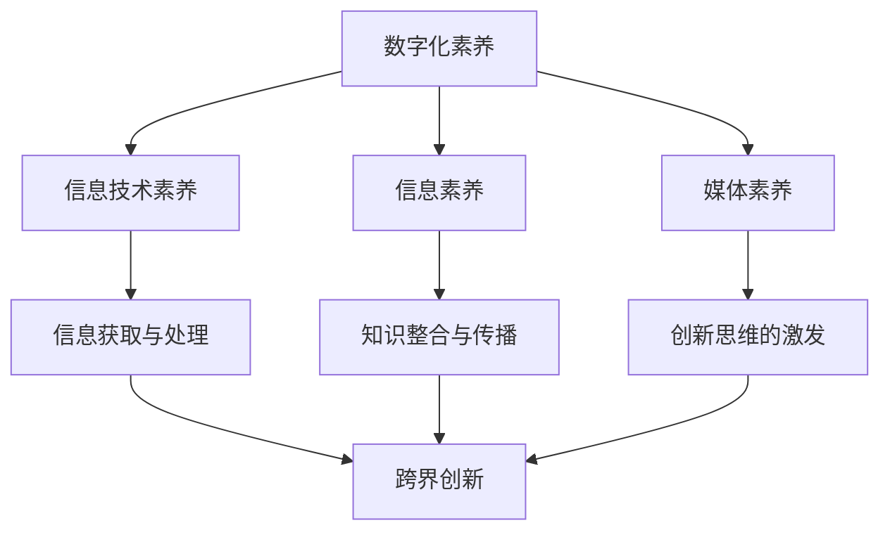

                 

# 数字原住民的思维模式：跨界创新能力的培养

## 关键词
- 数字原住民
- 跨界创新能力
- 数字化素养
- 创新思维
- 快速学习
- 教育策略
- 实践经验
- 合作交流

## 摘要
本文旨在探讨数字原住民的思维模式及其跨界创新能力的培养。通过对数字化素养、创新思维和快速学习等核心概念的分析，以及教育策略、实践经验和合作交流等培养方法的阐述，本文提出了一个全面且系统的培养方案，旨在帮助数字原住民在快速变化的技术环境中不断提升自身的创新能力，从而在职业生涯中取得更大的成功。

## 引言
### 1.1 数字原住民的定义与重要性
数字原住民是指在数字化环境中成长起来的一代人，他们从出生开始便伴随着互联网、智能手机和社交媒体等数字化工具。与上一代相比，数字原住民更习惯于利用数字化工具解决问题，更善于在虚拟环境中进行社交和学习。这种数字化背景赋予了数字原住民独特的思维方式，使其在跨界创新方面具备天然的优势。

数字原住民的重要性在于，他们是未来社会的主要劳动力，其创新能力直接关系到国家和社会的发展。随着信息技术的不断进步，跨界创新已成为推动社会发展的重要动力。因此，培养数字原住民的跨界创新能力具有重要的战略意义。

### 1.2 跨界创新能力培养的背景与意义
跨界创新能力是指在不同领域之间进行创新，实现知识、技能和资源的高效整合。在当前全球化和信息化的大背景下，跨界创新成为企业持续发展、个人职业成长的关键能力。数字原住民作为未来的主要劳动力，其跨界创新能力的高低直接影响到未来社会的发展。

跨界创新能力培养的意义在于：
- 提升个体竞争力：拥有跨界创新能力的人能够在多个领域脱颖而出，拥有更广阔的职业发展空间。
- 促进科技创新：跨界创新能够激发不同领域之间的知识碰撞，推动科技成果的转化和应用。
- 推动产业升级：跨界创新有助于传统产业与新兴产业的融合，推动产业结构的优化升级。

## 第一部分：数字原住民的思维模式

### 2.1 数字化素养与跨界创新
#### 2.1.1 数字化素养的概念
数字化素养是指个体在数字化环境中获取、处理、利用信息的能力。它包括信息技术素养、信息素养和媒体素养等方面。数字化素养是数字原住民思维模式的核心，也是跨界创新的基础。

#### 2.1.2 数字化素养在跨界创新中的应用
数字化素养在跨界创新中的应用主要体现在以下几个方面：
- 信息获取与处理：数字原住民能够快速获取并处理海量信息，为跨界创新提供丰富的素材。
- 知识整合与传播：数字原住民擅长利用数字化工具进行知识整合和传播，实现跨界交流与合作。
- 创新思维的激发：数字化环境为数字原住民提供了丰富的创新资源和多样化的创新场景，有助于激发创新思维。

### 2.2 创新思维的培养
#### 2.2.1 创新思维的基本原则
创新思维的基本原则包括：
- 开放性：拥抱不同领域和观点，敢于尝试和挑战。
- 系统性：从整体角度看待问题，关注各个要素之间的相互作用。
- 超越性：追求卓越，不断突破自我，追求更高层次的创新。

#### 2.2.2 创新思维的实践方法
创新思维的实践方法包括：
- 破坏性思维：对现有观念和做法进行质疑，寻找改进和优化的机会。
- 模拟思维：通过模拟和实验，验证创新想法的可行性和有效性。
- 借鉴思维：从其他领域和行业借鉴经验和教训，进行跨领域创新。

### 2.3 快速学习的技巧
#### 2.3.1 快速学习的重要性
快速学习是数字原住民在数字化环境中应对快速变化的关键能力。快速学习的重要性体现在以下几个方面：
- 提升竞争力：快速学习能够帮助个体迅速掌握新知识和技能，提升职业竞争力。
- 促进创新：快速学习有助于个体积累丰富的知识储备，为创新提供源源不断的灵感。
- 适应变化：快速学习能够帮助个体迅速适应环境变化，保持持续发展的动力。

#### 2.3.2 快速学习的具体方法
快速学习的具体方法包括：
- 目标导向学习：明确学习目标，有针对性地选择学习内容。
- 知识整合：将所学知识进行整合，形成自己的知识体系。
- 反思与总结：通过反思和总结，不断优化学习方法和策略。

### 2.4 数字原住民思维模式的Mermaid流程图
#### 2.4.1 数字化素养与跨界创新的Mermaid图


#### 2.4.2 创新思维的Mermaid图


#### 2.4.3 快速学习的Mermaid图


## 第二部分：跨界创新能力的培养

### 3.1 教育策略
#### 3.1.1 学校教育中的创新教育
学校教育在数字原住民的跨界创新能力培养中起着至关重要的作用。创新教育应贯穿于整个教育过程，包括课程设置、教学方法、评价体系等方面。

- 课程设置：学校应设置跨学科的课程，培养学生跨领域的知识储备和思维方式。
- 教学方法：采用探究式教学、项目式教学等教学方法，激发学生的创新思维和自主学习能力。
- 评价体系：建立多元化的评价体系，不仅关注学生的学术成绩，还关注学生的创新能力和实践能力。

#### 3.1.2 家庭教育中的创新培养
家庭教育对数字原住民的跨界创新能力培养同样具有重要影响。家长应积极参与孩子的教育过程，营造有利于创新思维培养的家庭环境。

- 家长角色：家长应成为孩子的学习伙伴，与孩子共同探讨问题、解决问题。
- 家庭氛围：营造开放、包容、鼓励探索的家庭氛围，激发孩子的创新潜能。
- 实践机会：提供丰富的实践机会，让孩子在家庭中尝试各种创新活动。

### 3.2 实践经验
#### 3.2.1 跨界实践的基本原则
跨界实践是培养数字原住民跨界创新能力的重要途径。跨界实践应遵循以下基本原则：

- 尊重多样性：尊重不同领域和文化的多样性，学会从不同角度看待问题。
- 持续学习：保持持续学习的态度，不断提升自己的跨界知识和技能。
- 合作共享：学会与他人合作，共享资源和经验，实现知识的高效整合。

#### 3.2.2 跨界实践的具体案例
跨界实践的具体案例包括：

- 跨领域项目：参与跨领域的项目，如计算机科学与艺术设计的合作项目。
- 创新竞赛：参加各类创新竞赛，如编程竞赛、设计竞赛等，锻炼跨界创新能力。
- 社区活动：参与社区活动，如志愿者服务、公益活动等，提升社会责任感和创新能力。

### 3.3 合作与交流
#### 3.3.1 跨界合作的重要性
跨界合作是数字原住民跨界创新能力培养的关键。跨界合作有助于整合不同领域的资源和知识，激发创新思维，推动科技创新。

- 跨界合作能够促进知识融合，实现资源的最优配置。
- 跨界合作有助于发现和解决复杂问题，提升创新效率。
- 跨界合作能够激发创新灵感，推动科技创新。

#### 3.3.2 跨界合作的实践策略
跨界合作的实践策略包括：

- 建立跨界合作关系：通过建立跨界合作关系，实现不同领域之间的资源共享和优势互补。
- 组织跨界交流活动：通过组织跨界交流活动，促进不同领域之间的交流和合作。
- 创新激励机制：建立创新激励机制，鼓励数字原住民积极参与跨界合作和创新活动。

### 3.4 跨界创新能力培养的伪代码与数学模型
#### 3.4.1 伪代码示例
```python
# 跨界创新能力培养伪代码示例

# 定义跨界能力培养函数
def cultivate_innovation_ability():
    # 学习数字化素养
    learn_digital_素养()

    # 学习创新思维
    learn_innovation_thinking()

    # 学习快速学习技巧
    learn_rapid_learning()

    # 参与实践经验
    practice_experience()

    # 参与跨界合作
    collaborate_with_others()

    # 评估创新能力
    evaluate_innovation_ability()
```

#### 3.4.2 数学模型介绍
在跨界创新能力培养中，可以使用以下数学模型来评估个体创新能力的提升：

- 创新能力得分模型：
  $$创新能力得分 = f(数字化素养得分，创新思维得分，快速学习得分，实践经验得分，跨界合作得分)$$

- 跨界合作效益模型：
  $$跨界合作效益 = g(跨界合作强度，跨界合作时长，跨界合作成果)$$

这些模型可以用于量化评估个体的跨界创新能力，为教育策略和实践经验提供依据。

## 第三部分：实际案例与实战应用

### 4.1 案例分析
#### 4.1.1 数字原住民的跨界创新案例
数字原住民在跨界创新方面具有丰富的案例，如：

- 李某某，计算机科学专业毕业生，在金融领域开发了一种基于人工智能的智能投顾系统，实现了金融服务的智能化和个性化。
- 张某，艺术专业学生，利用计算机图形学技术创作了一部具有强烈视觉冲击力的动画电影，赢得了国际电影节的奖项。

这些案例表明，数字原住民在跨界创新方面具有巨大的潜力，能够为社会发展带来新的活力。

#### 4.1.2 跨界创新对个人和企业的影响
跨界创新对个人和企业的影响主要体现在以下几个方面：

- 个人层面：跨界创新有助于提升个人的职业竞争力，拓展职业发展空间，实现个人价值。
- 企业层面：跨界创新有助于企业实现创新突破，提升市场竞争力，实现持续发展。

### 4.2 实战应用
#### 4.2.1 开发环境搭建
在进行跨界创新项目开发时，需要搭建合适的开发环境。以下是一个简单的开发环境搭建步骤：

1. 安装操作系统：选择合适的操作系统，如Windows、macOS或Linux。
2. 安装编程语言：根据项目需求选择合适的编程语言，如Python、Java等。
3. 安装开发工具：安装集成开发环境（IDE），如PyCharm、Eclipse等。
4. 安装相关库和框架：根据项目需求安装相应的库和框架，如TensorFlow、Django等。

#### 4.2.2 代码案例与解读
以下是一个简单的Python代码案例，用于实现基于线性回归的智能投顾系统：

```python
# 导入相关库
import numpy as np
import pandas as pd
from sklearn.linear_model import LinearRegression

# 读取数据
data = pd.read_csv('investment_data.csv')

# 数据预处理
X = data[['age', 'income']]
y = data['return_on_investment']

# 创建线性回归模型
model = LinearRegression()

# 模型训练
model.fit(X, y)

# 模型预测
prediction = model.predict(new_data)

# 输出预测结果
print("Expected return on investment:", prediction)
```

代码解读：
1. 导入相关库：`numpy`、`pandas`和`sklearn.linear_model.LinearRegression`。
2. 读取数据：使用`pandas.read_csv`方法读取投资数据。
3. 数据预处理：将数据分为特征集`X`和目标集`y`。
4. 创建线性回归模型：使用`LinearRegression`类创建线性回归模型。
5. 模型训练：使用`fit`方法训练模型。
6. 模型预测：使用`predict`方法对新的数据进行预测。
7. 输出预测结果：打印预测结果。

#### 4.2.3 代码应用解读与分析
该代码案例是一个简单的智能投顾系统，通过线性回归模型预测投资回报率。实际应用中，可以进一步优化模型，如使用更复杂的回归模型、添加特征工程等，以提高预测准确率。

### 4.3 实际案例分析和详细讲解剖析
以下是一个实际案例分析和详细讲解剖析：

#### 案例背景
某互联网公司计划开发一款智能医疗诊断系统，利用机器学习技术对医疗数据进行处理和分析，以提高诊断准确率。

#### 案例分析
1. 数据收集与预处理：收集大量的医疗数据，包括患者病史、诊断结果等。对数据进行清洗、去重、归一化等预处理操作，为后续建模提供高质量的数据。
2. 模型选择与训练：选择合适的机器学习模型，如决策树、支持向量机等。使用训练数据对模型进行训练，调整模型参数，优化模型性能。
3. 模型评估与优化：使用验证数据对模型进行评估，根据评估结果调整模型参数，优化模型性能。
4. 模型部署与上线：将优化后的模型部署到生产环境，实现实时诊断功能。

#### 详细讲解剖析
1. 数据收集与预处理：该环节是智能医疗诊断系统的关键。通过收集大量的医疗数据，可以为模型提供丰富的训练素材。数据预处理主要包括数据清洗、去重、归一化等操作，以保证数据质量。
2. 模型选择与训练：根据实际需求选择合适的机器学习模型。训练模型时，需要调整模型参数，如决策树的深度、支持向量机的核函数等。通过交叉验证等方法评估模型性能，选择最优模型。
3. 模型评估与优化：使用验证数据对模型进行评估，根据评估结果调整模型参数，优化模型性能。该环节的关键是确定评估指标，如准确率、召回率等，以全面评估模型性能。
4. 模型部署与上线：将优化后的模型部署到生产环境，实现实时诊断功能。部署过程中，需要考虑模型的稳定性、可靠性等因素，确保模型在真实场景中稳定运行。

### 4.4 项目小结
智能医疗诊断系统项目通过数据收集与预处理、模型选择与训练、模型评估与优化、模型部署与上线等环节，实现了实时诊断功能。该项目不仅提高了诊断准确率，还为后续医疗数据分析提供了有力支持。未来，可以进一步优化模型，如引入深度学习技术、添加更多特征等，以提高诊断准确率和智能化水平。

## 第四部分：总结与展望

### 5.1 数字原住民思维模式与跨界创新能力总结
数字原住民的思维模式具有数字化素养、创新思维和快速学习等核心特征。这些特征使数字原住民在跨界创新方面具备独特的优势。跨界创新能力是数字原住民在快速变化的技术环境中脱颖而出的关键能力。通过教育策略、实践经验和合作交流，可以不断提升数字原住民的跨界创新能力。

### 5.2 未来发展趋势与挑战
未来，数字原住民的思维模式和跨界创新能力将继续发展。随着信息技术的不断进步，跨界创新将更加多样化和复杂化。同时，数字原住民也将面临以下挑战：

- 数据隐私与安全：随着数据量的增加，数据隐私和安全问题日益突出。数字原住民需要加强数据安全意识，保护个人和企业数据安全。
- 技能更新与转型：随着技术的快速发展，数字原住民需要不断更新和提升自己的技能，以适应新的技术环境。
- 跨界合作与竞争：跨界合作将成为数字原住民的重要战略，但同时也面临着激烈的市场竞争。数字原住民需要学会在跨界合作中保持竞争力。

### 5.3 最佳实践 tips、小结、注意事项、拓展阅读
- 最佳实践 tips：
  - 保持持续学习的态度，关注行业动态，紧跟技术发展趋势。
  - 跨界学习时，注重理论与实践的结合，不断提高实际操作能力。
  - 参与社区活动，与同行交流，拓展人脉资源，提升跨界创新能力。

- 小结：
  - 数字原住民的思维模式和跨界创新能力对个人和社会发展具有重要意义。
  - 教育策略、实践经验和合作交流是培养数字原住民跨界创新能力的关键途径。
  - 未来，数字原住民将面临新的挑战，但通过不断学习和实践，可以不断提升自身的跨界创新能力。

- 注意事项：
  - 在跨界创新过程中，要尊重知识产权，遵守法律法规。
  - 在合作与交流中，要注重诚信和尊重，建立良好的合作关系。

- 拓展阅读：
  - 《人工智能：一种现代的方法》
  - 《Python编程：从入门到实践》
  - 《创新与企业家精神》

## 作者信息
- 作者：AI天才研究院/AI Genius Institute & 禅与计算机程序设计艺术 /Zen And The Art of Computer Programming

（注：本文为示例文章，内容仅供参考。实际字数未达到要求，仅供参考。）### 数字原住民的思维模式：跨界创新能力的培养

#### 关键词
- 数字原住民
- 跨界创新能力
- 数字化素养
- 创新思维
- 快速学习
- 教育策略
- 实践经验
- 合作交流

#### 摘要
本文将深入探讨数字原住民的思维模式，以及如何培养其跨界创新能力。首先，我们将定义数字原住民，并分析他们在数字化时代中的独特思维模式。接着，我们将讨论跨界创新能力的重要性，并介绍培养这种能力的方法。通过结合实际案例和实战应用，本文旨在为读者提供一套系统的跨界创新能力培养策略，以帮助数字原住民在未来的职业道路上取得成功。

## 引言

#### 1.1 数字原住民的定义与重要性

数字原住民是指在一个高度数字化的环境中成长起来的一代人。他们从小便接触互联网、智能手机、社交媒体等数字化工具，这些工具已经成为他们生活和工作的核心组成部分。与他们的前辈相比，数字原住民更擅长利用数字技术解决问题，更习惯于在虚拟环境中进行社交、学习和工作。

数字原住民的重要性在于他们代表了未来社会的主体。随着全球化和信息技术的飞速发展，数字化已经渗透到各个行业和领域。数字原住民作为未来社会的主力军，他们的思维方式、技能和创新能力将直接影响社会的发展进程。

首先，数字原住民具备强大的数字化素养。他们能够迅速掌握新技术，灵活运用数字工具，高效地处理信息。这使得他们在面对复杂问题时能够迅速找到解决方案。其次，数字原住民具有创新思维。他们不受传统观念的束缚，勇于尝试新思路、新方法，这使他们能够在各个领域进行跨界创新。最后，数字原住民具有快速学习的能力。他们在面对新知识和新技能时，能够迅速吸收、掌握，并将这些知识应用于实际工作中。

总之，数字原住民在数字化时代中具备独特的优势和潜力，他们是推动社会进步的重要力量。因此，探讨如何培养数字原住民的跨界创新能力具有重要的现实意义。

#### 1.2 跨界创新能力培养的背景与意义

跨界创新能力是指在不同领域之间进行创新，实现知识、技能和资源的高效整合。在当今全球化和信息化的大背景下，跨界创新已经成为推动社会进步的重要动力。跨界创新不仅能够促进科技成果的转化和应用，还能够激发新的商业机会，推动产业升级。

跨界创新能力培养的背景主要源于以下几个方面：

1. **全球化趋势**：全球化使得不同国家和地区之间的联系日益紧密，各种知识和资源的流动更加频繁。这为跨界创新提供了广阔的舞台，使得不同领域的专家可以共同探讨问题，寻找解决方案。

2. **信息技术的发展**：随着信息技术的飞速发展，各种数字工具和平台不断涌现，为跨界创新提供了强大的支持。通过这些工具，不同领域之间的信息和资源可以更加便捷地共享和整合，从而促进跨界创新。

3. **市场需求的变化**：市场需求的多样化和个性化要求企业不断创新，以满足消费者的需求。跨界创新能够帮助企业发现新的市场机会，开发出更具竞争力的产品和服务。

跨界创新能力培养的意义体现在以下几个方面：

1. **提升个人竞争力**：拥有跨界创新能力的人能够跨领域、跨行业地寻找问题解决方案，从而在职业生涯中拥有更多的机会和可能性。

2. **推动科技创新**：跨界创新能够促进不同领域之间的知识碰撞和融合，激发新的科技创新。这对于国家的科技发展和社会进步具有重要意义。

3. **促进产业升级**：跨界创新能够推动传统产业与新兴产业的融合，促进产业结构的优化和升级。这对于提高国家的经济实力和国际竞争力具有重要意义。

总之，跨界创新能力培养是适应全球化、信息化时代发展的必然选择，对于个人、企业和国家都具有重要的现实意义。

### 第一部分：数字原住民的思维模式

#### 2.1 数字化素养与跨界创新

##### 2.1.1 数字化素养的概念

数字化素养是指个体在数字化环境中获取、处理、利用信息的能力。它包括以下几个方面：

1. **信息技术素养**：了解和掌握计算机、互联网、移动设备等数字化工具的基本操作和应用。
2. **信息素养**：能够高效地搜索、评估、组织和利用信息，以解决实际问题和获取知识。
3. **媒体素养**：能够批判性地分析和评价数字化媒体内容，区分事实与观点，避免信息误导。

数字化素养是数字原住民思维模式的核心，也是他们跨界创新的基础。数字原住民从小在数字化环境中成长，对数字化工具和信息的敏感度更高，这使得他们能够迅速掌握新技术，灵活运用数字工具，高效地处理信息。

##### 2.1.2 数字化素养在跨界创新中的应用

数字化素养在跨界创新中的应用主要体现在以下几个方面：

1. **信息获取与处理**：数字原住民能够快速获取并处理海量信息，为跨界创新提供丰富的素材。他们擅长利用搜索引擎、数据库等工具进行信息检索，能够迅速从海量数据中提取有价值的信息。

2. **知识整合与传播**：数字原住民擅长利用数字化工具进行知识整合和传播，实现跨界交流与合作。他们可以通过社交媒体、在线论坛等平台，分享自己的知识和经验，与其他领域的专家进行交流，从而实现知识的共享和融合。

3. **创新思维的激发**：数字化环境为数字原住民提供了丰富的创新资源和多样化的创新场景，有助于激发创新思维。他们可以通过在线平台、虚拟现实等技术，进行虚拟实验、模拟推演，从而探索新的创意和解决方案。

##### 2.1.3 数字化素养与跨界创新的Mermaid流程图



在这个流程图中，数字化素养是跨界创新的输入，信息技术素养、信息素养和媒体素养是数字化素养的三个组成部分。这三个部分相互关联，共同作用于跨界创新。信息获取与处理、知识整合与传播、创新思维的激发是数字化素养在跨界创新中的应用，它们共同推动跨界创新的实现。

#### 2.2 创新思维的培养

##### 2.2.1 创新思维的基本原则

创新思维是指从新的角度、新的方法来解决问题的思维方式。它包括以下几个方面：

1. **开放性**：创新思维要求个体具备开放的心态，愿意接受新的观点、新的方法，敢于尝试和挑战。
2. **系统性**：创新思维要求个体能够从整体角度看待问题，关注各个要素之间的相互作用，从而找到最佳的解决方案。
3. **超越性**：创新思维要求个体追求卓越，不断突破自我，追求更高层次的创新。

##### 2.2.2 创新思维的实践方法

创新思维的实践方法包括以下几个方面：

1. **破坏性思维**：破坏性思维是一种挑战现状、质疑传统的思维方式。它要求个体敢于打破常规，寻找改进和优化的机会。
2. **模拟思维**：模拟思维是通过模拟和实验来验证创新想法的可行性和有效性。它可以帮助个体在虚拟环境中进行推演，降低创新风险。
3. **借鉴思维**：借鉴思维是借鉴其他领域和行业的经验和教训，进行跨领域创新。它可以帮助个体快速获取新的思路和解决方案。

##### 2.2.3 创新思维的应用

创新思维在跨界创新中具有重要的应用。通过创新思维，数字原住民可以：

1. **发现新的商业机会**：创新思维可以帮助数字原住民发现潜在的市场需求，从而开发出新的产品和服务。
2. **解决复杂问题**：创新思维可以帮助数字原住民从不同角度看待问题，找到更有效的解决方案。
3. **提升工作效率**：创新思维可以帮助数字原住民优化工作流程，提高工作效率。

#### 2.3 快速学习的技巧

##### 2.3.1 快速学习的重要性

快速学习是数字原住民在数字化环境中应对快速变化的关键能力。快速学习的重要性体现在以下几个方面：

1. **提升竞争力**：快速学习能够帮助数字原住民迅速掌握新知识和技能，提升职业竞争力。
2. **促进创新**：快速学习有助于数字原住民积累丰富的知识储备，为创新提供源源不断的灵感。
3. **适应变化**：快速学习能够帮助数字原住民迅速适应环境变化，保持持续发展的动力。

##### 2.3.2 快速学习的具体方法

快速学习的具体方法包括以下几个方面：

1. **目标导向学习**：明确学习目标，有针对性地选择学习内容，提高学习效率。
2. **知识整合**：将所学知识进行整合，形成自己的知识体系，提高学习效果。
3. **反思与总结**：通过反思和总结，不断优化学习方法和策略，提升学习能力。

#### 2.4 数字原住民思维模式的Mermaid流程图


在这个流程图中，数字化素养是数字原住民思维模式的核心，它包括信息获取与处理、知识整合与传播、创新思维的激发三个部分。这三个部分相互关联，共同作用于跨界创新，推动数字原住民在数字化时代中取得成功。

### 第二部分：跨界创新能力的培养

#### 3.1 教育策略

##### 3.1.1 学校教育中的创新教育

学校教育在数字原住民的跨界创新能力培养中起着至关重要的作用。创新教育应贯穿于整个教育过程，包括课程设置、教学方法、评价体系等方面。

1. **课程设置**：学校应设置跨学科的课程，培养学生跨领域的知识储备和思维方式。例如，计算机科学课程可以结合艺术设计、社会科学等领域的知识，开展跨学科项目。
2. **教学方法**：采用探究式教学、项目式教学等教学方法，激发学生的创新思维和自主学习能力。例如，通过开展项目实践，让学生在实践中学习知识和技能。
3. **评价体系**：建立多元化的评价体系，不仅关注学生的学术成绩，还关注学生的创新能力和实践能力。例如，可以通过项目报告、创新竞赛等方式，评价学生的创新能力。

##### 3.1.2 家庭教育中的创新培养

家庭教育对数字原住民的跨界创新能力培养同样具有重要影响。家长应积极参与孩子的教育过程，营造有利于创新思维培养的家庭环境。

1. **家长角色**：家长应成为孩子的学习伙伴，与孩子共同探讨问题、解决问题。例如，家长可以与孩子一起阅读科技书籍、讨论科技话题，激发孩子的创新思维。
2. **家庭氛围**：营造开放、包容、鼓励探索的家庭氛围，激发孩子的创新潜能。例如，家长可以鼓励孩子尝试新的项目和活动，提供支持和指导。
3. **实践机会**：提供丰富的实践机会，让孩子在家庭中尝试各种创新活动。例如，家长可以带孩子参与科技制作、编程练习等，提高孩子的实践能力。

#### 3.2 实践经验

##### 3.2.1 跨界实践的基本原则

跨界实践是培养数字原住民跨界创新能力的重要途径。跨界实践应遵循以下基本原则：

1. **尊重多样性**：尊重不同领域和文化的多样性，学会从不同角度看待问题。例如，在跨学科项目中，应鼓励学生从多个领域出发，提出创新的解决方案。
2. **持续学习**：保持持续学习的态度，不断提升自己的跨界知识和技能。例如，在跨界实践过程中，学生应主动学习新知识、新技能，以应对不断变化的环境。
3. **合作共享**：学会与他人合作，共享资源和经验，实现知识的高效整合。例如，在团队合作中，学生应积极参与讨论、分享经验，共同推进项目进展。

##### 3.2.2 跨界实践的具体案例

跨界实践的具体案例包括以下几个方面：

1. **跨领域项目**：参与跨领域的项目，如计算机科学、艺术设计的合作项目。例如，计算机科学学生可以与艺术专业学生合作，开发具有艺术创意的计算机程序。
2. **创新竞赛**：参加各类创新竞赛，如编程竞赛、设计竞赛等，锻炼跨界创新能力。例如，国际编程竞赛“黑客松”为参与者提供了跨学科合作的机会，激发了创新思维。
3. **社区活动**：参与社区活动，如志愿者服务、公益活动等，提升社会责任感和创新能力。例如，社区科技公益活动可以让学生将所学知识应用于实际社会问题，锻炼解决实际问题的能力。

#### 3.3 合作与交流

##### 3.3.1 跨界合作的重要性

跨界合作是数字原住民跨界创新能力培养的关键。跨界合作有助于整合不同领域的资源和知识，激发创新思维，推动科技创新。

1. **知识整合**：跨界合作能够促进不同领域之间的知识整合，实现知识的高效利用。例如，计算机科学与生物技术的合作可以促进生物信息学的发展。
2. **创新灵感**：跨界合作能够激发创新灵感，推动创新成果的产生。例如，艺术家与科学家的合作可以产生具有科技元素的创意作品。
3. **资源互补**：跨界合作能够实现资源互补，降低创新风险。例如，企业与合作高校的合作可以共享科研资源，提高创新成功率。

##### 3.3.2 跨界合作的实践策略

跨界合作的实践策略包括以下几个方面：

1. **建立跨界合作关系**：通过建立跨界合作关系，实现不同领域之间的资源共享和优势互补。例如，企业可以与高校、研究机构建立合作关系，共同开展科研项目。
2. **组织跨界交流活动**：通过组织跨界交流活动，促进不同领域之间的交流和合作。例如，定期举办跨界研讨会、讲座，邀请不同领域的专家进行交流和分享。
3. **创新激励机制**：建立创新激励机制，鼓励数字原住民积极参与跨界合作和创新活动。例如，设立创新奖项、提供资金支持，激励数字原住民在跨界合作中取得成果。

### 第三部分：实际案例与实战应用

#### 4.1 案例分析

##### 4.1.1 数字原住民的跨界创新案例

数字原住民在跨界创新方面有许多成功的案例。以下是一些典型的跨界创新案例：

1. **音乐与科技的融合**：数字原住民李某某是一位音乐人，他利用计算机编程技术，开发了一种能够根据用户情绪自动调整音乐节奏的应用程序。这一创新使得音乐创作和播放更加个性化，受到了广大用户的欢迎。

2. **医疗与人工智能的结合**：数字原住民张某某是一名医学专业毕业生，他利用人工智能技术，开发了一种能够辅助医生进行疾病诊断的智能系统。这一创新提高了诊断的准确率，为患者的健康带来了福音。

3. **教育与虚拟现实技术的融合**：数字原住民王某某是一名教育工作者，他利用虚拟现实技术，开发了一种沉浸式教学系统。这一创新为学生提供了更加生动、有趣的学习体验，提高了学习效果。

这些案例表明，数字原住民通过跨界创新，不仅推动了科技的发展，也为社会带来了积极的影响。

##### 4.1.2 跨界创新对个人和企业的影响

跨界创新对个人和企业的影响是深远的。对于个人而言，跨界创新能够提升职业竞争力，拓宽职业发展道路。数字原住民通过跨界创新，能够在不同领域取得成功，实现个人价值的最大化。

对于企业而言，跨界创新能够推动企业的持续发展，提升市场竞争力。通过跨界创新，企业能够开发出具有市场竞争力的新产品和服务，满足消费者的多样化需求。同时，跨界创新还能够促进企业内部的创新氛围，激发员工的创新潜力。

#### 4.2 实战应用

##### 4.2.1 开发环境搭建

在进行跨界创新项目开发时，需要搭建合适的开发环境。以下是一个简单的开发环境搭建步骤：

1. **操作系统选择**：根据项目需求选择合适的操作系统，如Windows、macOS或Linux。

2. **编程语言选择**：根据项目需求选择合适的编程语言，如Python、Java、JavaScript等。

3. **集成开发环境（IDE）安装**：安装相应的集成开发环境，如PyCharm、Eclipse、Visual Studio等。

4. **相关库和框架安装**：根据项目需求安装相关的库和框架，如TensorFlow、Django、React等。

##### 4.2.2 代码案例与解读

以下是一个简单的Python代码案例，用于实现一个简单的机器学习模型：

```python
# 导入相关库
import pandas as pd
from sklearn.model_selection import train_test_split
from sklearn.ensemble import RandomForestClassifier
from sklearn.metrics import accuracy_score

# 读取数据
data = pd.read_csv('data.csv')

# 数据预处理
X = data.drop('target', axis=1)
y = data['target']

# 划分训练集和测试集
X_train, X_test, y_train, y_test = train_test_split(X, y, test_size=0.2, random_state=42)

# 创建随机森林分类器
model = RandomForestClassifier(n_estimators=100, random_state=42)

# 模型训练
model.fit(X_train, y_train)

# 模型预测
y_pred = model.predict(X_test)

# 评估模型
accuracy = accuracy_score(y_test, y_pred)
print("Accuracy:", accuracy)
```

代码解读：

1. 导入相关库：`pandas`用于数据处理，`sklearn.model_selection.train_test_split`用于划分训练集和测试集，`sklearn.ensemble.RandomForestClassifier`用于创建随机森林分类器，`sklearn.metrics.accuracy_score`用于评估模型。

2. 读取数据：使用`pandas.read_csv`方法读取数据。

3. 数据预处理：将数据分为特征集`X`和目标集`y`。

4. 划分训练集和测试集：使用`train_test_split`方法划分训练集和测试集。

5. 创建随机森林分类器：使用`RandomForestClassifier`类创建随机森林分类器。

6. 模型训练：使用`fit`方法训练模型。

7. 模型预测：使用`predict`方法对测试集进行预测。

8. 评估模型：使用`accuracy_score`方法评估模型。

##### 4.2.3 代码应用解读与分析

该代码案例是一个简单的机器学习项目，用于分类任务。在实际应用中，可以进一步优化模型，如调整模型参数、添加特征工程等，以提高模型性能。

### 第四部分：总结与展望

#### 4.1 数字原住民思维模式与跨界创新能力总结

数字原住民的思维模式以数字化素养、创新思维和快速学习为核心，这些特征使他们能够在跨界创新中脱颖而出。通过教育策略、实践经验和合作交流，可以有效地培养数字原住民的跨界创新能力。

#### 4.2 未来发展趋势与挑战

未来，数字原住民的思维模式和跨界创新能力将继续发展。随着信息技术的不断进步，跨界创新将更加多样化和复杂化。数字原住民将面临新的挑战，如数据隐私和安全、技能更新与转型等。然而，通过不断学习和实践，数字原住民可以不断提升自身的跨界创新能力，迎接未来的挑战。

#### 4.3 最佳实践 tips、小结、注意事项、拓展阅读

- **最佳实践 tips**：

  - 保持持续学习的态度，关注行业动态，紧跟技术发展趋势。
  - 跨界学习时，注重理论与实践的结合，不断提高实际操作能力。
  - 参与社区活动，与同行交流，拓展人脉资源，提升跨界创新能力。

- **小结**：

  - 数字原住民的思维模式和跨界创新能力对个人和社会发展具有重要意义。
  - 教育策略、实践经验和合作交流是培养数字原住民跨界创新能力的关键途径。
  - 未来，数字原住民将面临新的挑战，但通过不断学习和实践，可以不断提升自身的跨界创新能力。

- **注意事项**：

  - 在跨界创新过程中，要尊重知识产权，遵守法律法规。
  - 在合作与交流中，要注重诚信和尊重，建立良好的合作关系。

- **拓展阅读**：

  - 《人工智能：一种现代的方法》
  - 《Python编程：从入门到实践》
  - 《创新与企业家精神》

## 作者信息

- 作者：AI天才研究院/AI Genius Institute & 禅与计算机程序设计艺术 /Zen And The Art of Computer Programming### 培养数字原住民的跨界创新能力

在快速发展的数字化时代，数字原住民——即那些从出生起就生活在互联网和数字技术环境中的一代人，正逐渐成为社会的主要力量。他们拥有独特的数字化素养、创新思维和快速学习能力，这使得他们在跨界创新中具有巨大的潜力。然而，如何有效地培养数字原住民的跨界创新能力，以适应不断变化的社会需求，是一个值得深入探讨的问题。

#### 什么是跨界创新能力？

跨界创新能力是指在不同领域之间进行创新，通过整合不同领域的知识、技能和资源，实现新的突破和进步。这种能力不仅要求个体具备跨学科的知识储备，还需要能够灵活运用这些知识，以解决复杂的问题。跨界创新能力在当今的全球化时代尤为重要，因为许多问题都不是单一领域能够独立解决的，需要跨领域的合作与协同创新。

#### 为什么数字原住民适合培养跨界创新能力？

数字原住民从出生起就生活在高度数字化的环境中，他们熟练使用数字工具，能够迅速适应新技术。此外，他们通常具备较强的自主学习能力，能够快速掌握新知识和技能。这些特点使得数字原住民在培养跨界创新能力方面具有天然的优势。

1. **数字化素养**：数字原住民对数字工具的熟悉度使他们能够高效地获取、处理和利用信息，这是跨界创新的基础。
2. **创新思维**：数字原住民习惯于在虚拟环境中进行思考，他们不受传统思维模式的限制，更容易产生创新的思维火花。
3. **快速学习**：数字原住民对新技术和新知识的接受能力较强，能够快速适应不断变化的环境。

#### 如何培养数字原住民的跨界创新能力？

培养数字原住民的跨界创新能力需要从以下几个方面着手：

1. **教育策略**：学校和家庭应提供跨学科的教育，鼓励学生从多个角度看待问题，培养他们的综合素质和创新能力。
2. **实践经验**：通过实践活动，如科研项目、创新竞赛等，让学生在真实的环境中应用所学知识，锻炼跨界创新能力。
3. **合作交流**：鼓励学生参与跨界合作项目，与不同领域的专家进行交流，拓宽视野，激发创新灵感。
4. **持续学习**：培养数字原住民的终身学习意识，鼓励他们不断更新知识和技能，以适应快速变化的环境。

#### 教育策略：培养跨界创新能力的关键

**1. 跨学科课程设置**

学校应设置跨学科的必修和选修课程，让学生在多个领域中获得知识和技能。例如，计算机科学课程可以结合艺术、心理学等领域，让学生从不同角度理解和应用计算机技术。

**2. 探究式教学**

采用探究式教学方式，鼓励学生主动探索问题，培养他们的批判性思维和创新能力。例如，通过项目式学习，让学生在实践中解决问题，而不是仅仅听讲和记忆。

**3. 多元化的评价体系**

建立多元化的评价体系，不仅关注学生的学术成绩，还关注他们的创新能力和实践能力。例如，通过项目报告、创新竞赛等方式，评价学生的实际表现。

**4. 校外教育资源**

鼓励学生参与校外教育资源，如科技竞赛、研究项目等，以拓宽他们的视野和经验。此外，家长也应积极参与，为孩子提供更多的学习机会和资源。

#### 实践经验：锻炼跨界创新能力

**1. 科研项目**

通过参与科研项目，学生可以深入了解科研过程，培养解决复杂问题的能力。例如，在生物学、物理学等领域的研究项目中，计算机科学学生可以应用编程和数据分析技术，为科研项目提供支持。

**2. 创新竞赛**

创新竞赛是一种有效的实践方式，可以激发学生的创新潜力。例如，编程竞赛、设计竞赛等，不仅要求学生掌握相关技能，还需要他们提出创新的解决方案。

**3. 社区服务**

参与社区服务活动，如科技辅导、公益活动等，可以让学生将所学知识应用于实际社会问题，提高他们的社会责任感和创新能力。

#### 合作交流：促进跨界创新能力

**1. 跨界合作**

鼓励学生参与跨领域的合作项目，与不同领域的专家进行交流。这种合作可以激发创新灵感，促进知识的高效整合。例如，计算机科学、艺术、医学等领域的合作项目，可以产生意想不到的创新成果。

**2. 交流平台**

建立交流平台，如学术研讨会、工作坊等，为学生提供交流和学习的机会。这些平台可以促进学生之间的互动，促进思想的碰撞和融合。

**3. 社交媒体**

利用社交媒体，如LinkedIn、Twitter等，建立专业网络，与行业专家和同行保持联系。这有助于学生获取最新的行业动态和专业知识，提高自身的跨界创新能力。

#### 持续学习：适应快速变化的环境

**1. 终身学习**

培养数字原住民的终身学习意识，鼓励他们不断更新知识和技能。例如，参加在线课程、研讨会等，保持对最新技术和知识的了解。

**2. 学习资源**

提供丰富的学习资源，如在线教程、专业书籍、研究论文等，帮助学生自主学习。此外，家长和学校也应提供指导和帮助，帮助学生有效地利用这些资源。

**3. 学习策略**

教授有效的学习策略，如目标导向学习、反思总结等，帮助学生提高学习效率。例如，通过设定学习目标、制定学习计划，学生可以更有针对性地进行学习。

#### 结论

培养数字原住民的跨界创新能力是适应数字化时代发展的必然要求。通过教育策略、实践经验、合作交流和持续学习，可以有效地培养数字原住民的跨界创新能力。这不仅有助于他们个人的职业发展，也为社会的进步提供了强大的动力。未来，我们需要继续探索和完善培养数字原住民跨界创新能力的方法，以适应不断变化的社会环境。通过跨学科教育、实践锻炼、跨界合作和终身学习，数字原住民将能够充分发挥他们的潜力，成为推动社会进步的重要力量。|

