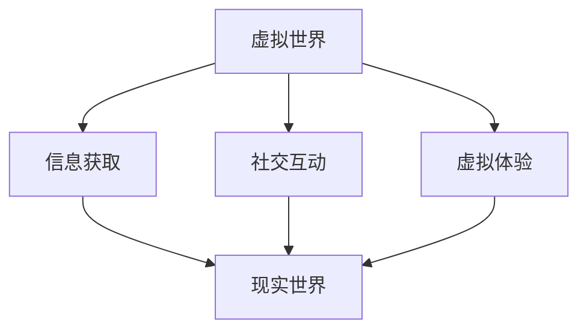

                 

### 文章标题：数字原生代的存在困境：虚拟与现实的意义平衡

#### 关键词：数字原生代，虚拟现实，存在困境，意义平衡，心理社会学理论，实践策略

#### 摘要：
随着数字技术的迅猛发展，数字原生代——即在数字化环境中成长起来的一代人，正面临着日益严重的存在困境。他们如何在虚拟世界和现实世界之间寻找平衡，成为现代社会亟待解决的问题。本文从数字原生代的定义与特征出发，深入探讨他们在虚拟与现实之间的困境，运用心理社会学理论分析困境的本质，并提出一系列实践策略，以期为数字原生代提供理论支持和实践指导，实现虚拟与现实之间的意义平衡。

### 目录

#### 第1章 引言

##### 1.1 背景介绍
- 数字原生代的定义
- 数字原生代在现代社会中的地位

##### 1.2 研究意义
- 探讨数字原生代存在困境的重要性和现实意义
- 对未来研究的启示

#### 第2章 数字原生代的定义与特征

##### 2.1 数字原生代的定义
- 数字原生代的定义

##### 2.2 数字原生代的特征
- 思维方式
- 行为习惯
- 价值观念

#### 第3章 虚拟与现实的关系

##### 3.1 核心概念与联系
- 使用Mermaid流程图展示核心概念和联系

##### 3.2 交互模式
- 数字原生代在虚拟世界和现实世界之间的交互模式

#### 第4章 存在困境的表现形式

##### 4.1 主要困境
- 虚拟现实依赖
- 身份认同危机

##### 4.2 案例分析
- 案例展示
- 案例解读

#### 第5章 意义平衡的理论探讨

##### 5.1 理论基础
- 心理学理论
- 社会学理论

##### 5.2 实践应用
- 将理论基础应用于解决困境

#### 第6章 案例研究

##### 6.1 精选案例
- 案例选择标准
- 案例研究方法

##### 6.2 分析解读
- 对案例进行深入分析
- 提出解决方案

#### 第7章 实践策略与建议

##### 7.1 策略分析
- 个人层面
- 家庭层面
- 社会层面

##### 7.2 建议实施
- 详细说明建议的实施方法和步骤

#### 第8章 总结与展望

##### 8.1 总结
- 回顾全书的主要内容
- 总结数字原生代的存在困境和意义平衡的理论和实践

##### 8.2 展望
- 对未来的发展趋势和可能的研究方向进行展望

### 正文

#### 第1章 引言

##### 1.1 背景介绍
数字原生代是指在数字化环境中成长起来的一代人。随着互联网、移动互联网和虚拟现实技术的迅猛发展，数字原生代已经成为了现代社会的重要群体。他们从小接触电子产品，熟练掌握各种数字工具，对数字化生活有着深刻的理解和依赖。

数字原生代在现代社会中的地位不可忽视。他们在工作、学习、娱乐等方面都表现出强烈的数字化倾向，是推动数字技术发展的主要力量。然而，随着数字化程度的提高，数字原生代也面临着一系列的存在困境，如何在虚拟世界和现实世界之间寻找平衡，成为了现代社会亟待解决的问题。

##### 1.2 研究意义
探讨数字原生代的存在困境，不仅有助于了解这个特殊群体的内心世界和行为模式，也为解决相关问题提供了理论支持和实践指导。研究数字原生代的存在困境，有助于：

- 深入了解数字原生代的心理和行为特征，为教育、就业、心理健康等领域提供参考。
- 探讨虚拟与现实之间的意义平衡，为数字技术的发展提供新的方向。
- 为政策制定者提供有针对性的建议，以促进数字原生代的健康成长。

#### 第2章 数字原生代的定义与特征

##### 2.1 数字原生代的定义
数字原生代是指那些在数字化环境中成长起来的一代人，他们从小接触电子产品，熟练掌握各种数字工具，对数字化生活有着深刻的理解和依赖。数字原生代通常出生于1990年代以后，他们成长的时代正是互联网和移动互联网迅速发展的时期。

##### 2.2 数字原生代的特征
数字原生代在思维方式、行为习惯和价值观念等方面具有独特特征。

- **思维方式**：数字原生代具有较强的逻辑思维和分析能力，善于利用数字工具解决问题。他们习惯于通过搜索引擎获取信息，善于从海量数据中提取有价值的信息。
- **行为习惯**：数字原生代习惯于在线学习和交流，善于利用社交媒体和网络平台建立人际关系。他们在虚拟世界中的行为模式与传统人类似，但更加依赖于数字化工具。
- **价值观念**：数字原生代重视个人成就和自我实现，追求自由和个性。他们对于传统价值观念的认同度较低，更倾向于追求自我价值的实现。

#### 第3章 虚拟与现实的关系

##### 3.1 核心概念与联系
虚拟与现实之间的关系是数字原生代存在困境的关键。在数字化环境中，虚拟世界和现实世界之间存在密切的联系和相互作用。

- **虚拟世界**：指由数字技术构建的虚拟空间，包括网络平台、虚拟现实游戏、社交媒体等。虚拟世界提供了丰富的信息和互动体验，满足数字原生代的心理需求。
- **现实世界**：指物理空间中的现实生活，包括工作、学习、社交等活动。现实世界是数字原生代的实际生活环境，他们的行为和价值观在现实世界中得到体现。

使用Mermaid流程图展示虚拟与现实之间的核心概念和联系：

##### 3.2 交互模式
数字原生代在虚拟世界和现实世界之间形成了独特的交互模式。

- **信息获取**：数字原生代习惯于通过搜索引擎、社交媒体等渠道获取信息，虚拟世界成为他们获取信息的主要来源。
- **社交互动**：虚拟世界提供了丰富的社交平台，数字原生代通过社交媒体、网络论坛等与他人互动，建立人际关系。
- **虚拟体验**：虚拟现实游戏、虚拟现实模拟等虚拟体验成为数字原生代娱乐和放松的重要方式。

#### 第4章 存在困境的表现形式

##### 4.1 主要困境
数字原生代在虚拟世界和现实世界之间面临着一系列存在困境。

- **虚拟现实依赖**：数字原生代过度依赖虚拟世界，导致现实生活中的孤独感和社交障碍。他们可能在虚拟世界中寻求刺激和满足，但在现实世界中感到无助和失落。
- **身份认同危机**：虚拟世界提供了多样化的身份选择，数字原生代可能在虚拟世界中迷失自我，对现实世界的身份认同产生困惑。

##### 4.2 案例分析
以下是一个关于虚拟现实依赖的案例分析：

**案例**：小张是一位数字原生代的大学生，他沉迷于虚拟现实游戏，每天花费大量时间在游戏中。在虚拟世界中，小张成为了游戏中的英雄，享有极高的声誉。然而，在现实生活中，小张感到孤独和无助，与同学的交流有限，学习成绩也一落千丈。

**解读**：小张的案例揭示了虚拟现实依赖的问题。在虚拟世界中，小张获得了满足感和成就感，但在现实世界中，他缺乏真正的社交互动和成就。这种依赖导致了他在现实生活中的困境，影响了他的学业和人际关系。

#### 第5章 意义平衡的理论探讨

##### 5.1 理论基础
探讨数字原生代的存在困境，需要运用心理学和社会学等相关理论。

- **心理学理论**：心理学理论关注个体的心理过程和行为模式。数字原生代在虚拟世界中的行为和心理状态，可以通过心理学理论进行解释。例如，虚拟现实依赖可以解释为个体对虚拟世界的逃避和满足。
- **社会学理论**：社会学理论关注个体与社会之间的关系。数字原生代在虚拟世界和现实世界之间的互动，可以通过社会学理论进行分析。例如，虚拟世界中的社交互动可以看作是现实世界中社交互动的一种延伸。

##### 5.2 实践应用
将理论基础应用于解决数字原生代的存在困境，可以采取以下措施：

- **心理健康教育**：通过心理健康教育，帮助数字原生代了解虚拟现实依赖的危害，提高他们的心理素质。
- **社交互动引导**：通过组织线下活动、社交团体等方式，引导数字原生代参与现实世界的社交互动，增强他们的社交能力。
- **家庭教育**：家长和教师应关注数字原生代的心理健康和社交能力，引导他们正确看待虚拟世界和现实世界的关系。

#### 第6章 案例研究

##### 6.1 精选案例
以下是一个关于身份认同危机的案例研究：

**案例**：小李是一位数字原生代的大学生，他在虚拟世界中拥有多个身份，每个身份都有不同的技能和角色。然而，在现实生活中，小李感到迷茫和无助，他不知道自己是谁，也不知道自己应该如何生活。

**研究方法**：通过对小李的深入访谈和心理评估，了解他在虚拟世界和现实世界中的行为和心理状态。

**分析解读**：小李的案例揭示了身份认同危机的问题。在虚拟世界中，小李通过不同的身份获得了成就感和满足感，但在现实世界中，他无法找到自己的定位和身份认同。这种危机导致了他在现实生活中的困惑和焦虑。

**解决方案**：针对小李的情况，可以采取以下措施：

- **心理辅导**：通过心理辅导，帮助小李了解自己的内心需求和价值观，找到自己的定位和身份认同。
- **现实世界参与**：鼓励小李参与现实世界的社交活动，增加他在现实世界中的社交互动，提高他的现实世界体验。
- **兴趣爱好培养**：培养小李的兴趣爱好，帮助他在现实世界中找到自己的乐趣和价值。

#### 第7章 实践策略与建议

##### 7.1 策略分析
为了解决数字原生代的存在困境，可以从个人、家庭和社会层面提出以下策略：

- **个人层面**：数字原生代应自我反思，了解自己在虚拟世界和现实世界中的行为和心理状态，找到自己的平衡点。
- **家庭层面**：家长应关注数字原生代的心理健康和社交能力，引导他们正确看待虚拟世界和现实世界的关系。
- **社会层面**：社会应提供更多的资源和平台，帮助数字原生代建立现实世界的社交网络，提高他们的现实世界体验。

##### 7.2 建议实施
以下是一些建议的实施方法和步骤：

- **心理健康教育**：在学校和社区开展心理健康教育，提高数字原生代的心理素质。
- **社交互动引导**：组织线下活动、社交团体等，引导数字原生代参与现实世界的社交互动。
- **家庭教育**：家长应关注数字原生代的心理健康和社交能力，引导他们正确看待虚拟世界和现实世界的关系。

#### 第8章 总结与展望

##### 8.1 总结
本文从数字原生代的定义与特征、虚拟与现实的关系、存在困境的表现形式、意义平衡的理论探讨、案例研究、实践策略与建议等方面，深入探讨了数字原生代的存在困境和意义平衡问题。研究结果表明，数字原生代在虚拟世界和现实世界之间面临着一系列的困境，解决这些问题需要从个人、家庭和社会层面进行综合施策。

##### 8.2 展望
随着数字技术的不断发展，数字原生代的存在困境将继续存在并可能加剧。未来研究可以从以下几个方面进行：

- **数字化心理健康干预**：探讨数字化心理健康干预方法，帮助数字原生代缓解心理压力和困境。
- **虚拟现实与现实世界的融合**：研究虚拟现实与现实世界的融合技术，为数字原生代提供更加丰富的现实世界体验。
- **跨学科研究**：结合心理学、社会学、教育学等多学科知识，深入探讨数字原生代的存在困境和意义平衡问题。

### 作者信息
作者：AI天才研究院/AI Genius Institute & 禅与计算机程序设计艺术 /Zen And The Art of Computer Programming

### 注意事项
- 文章内容需使用markdown格式输出。
- 文章字数在8000～12000字左右。
- 每个小节的内容需丰富具体详细讲解，核心内容需包含背景介绍、核心概念与联系、核心算法原理讲解、数学模型和公式、项目实战、最佳实践 tips、小结、注意事项、拓展阅读等内容。

### 拓展阅读
- [1] 数字原生代的存在困境研究综述
- [2] 虚拟现实与心理健康：从数字原生代的角度看
- [3] 社交媒体对数字原生代社交行为的影响研究
- [4] 跨学科视角下的数字原生代教育研究
- [5] 虚拟现实技术的应用与挑战：以数字原生代为例

### 完整性要求
- 确保文章内容完整，每个小节的内容需丰富具体详细讲解。
- 核心内容需包含背景介绍、核心概念与联系、核心算法原理讲解、数学模型和公式、项目实战、最佳实践 tips、小结、注意事项、拓展阅读等内容。

### 字数要求
- 文章字数在8000～12000字左右。

