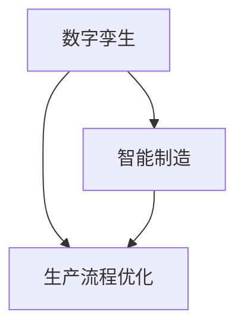
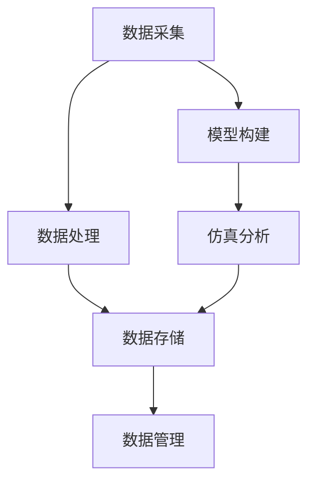

                 

### 文章标题

# 数字孪生在智能制造中的应用：优化生产流程

### 文章关键词

- 数字孪生
- 智能制造
- 生产流程优化
- 仿真与预测
- 数据分析
- 传感器技术
- 实时监控
- 虚拟模型

### 文章摘要

本文旨在探讨数字孪生技术在智能制造领域中的应用，特别是其对生产流程的优化作用。首先，文章将介绍数字孪生和智能制造的基本概念及其相互关系，并通过Mermaid流程图展示核心概念之间的联系。接着，文章将深入解析数字孪生的架构与原理，使用伪代码和LaTeX公式来详细阐述其工作方式。随后，文章将探讨如何通过数字孪生技术对生产流程进行优化，包括数学模型的应用和具体项目实战。最后，文章将总结数字孪生在智能制造中的应用前景，并提供相关的最佳实践和小结。本文适用于希望深入了解数字孪生技术及其在制造业中应用的专业读者。

---

**引论**

## 背景介绍

数字孪生（Digital Twin）是一种新兴的数字化转型技术，它通过创建物理实体的数字化副本，实现对实际设备的实时监控、模拟和分析。这一概念最早由迈克尔·格里夫斯（Michael Grieves）在2002年提出，并在随后几年逐渐得到学术界和工业界的高度重视。数字孪生的核心思想是将物理世界与虚拟世界相结合，通过传感器、数据处理和仿真技术，实时反映物理实体的状态和性能。

智能制造（Smart Manufacturing）则是一种基于先进的信息技术和自动化技术的制造模式，旨在通过数字化、网络化和智能化手段，提升制造过程的效率和质量。智能制造的目标是实现制造过程的全面优化，从设计、生产到运营和维护，各个环节都能实现高效、智能的运行。

随着全球制造业的转型升级，数字孪生和智能制造正成为推动产业创新和提升竞争力的重要技术。数字孪生在智能制造中的应用，不仅能够提高生产过程的可视化和可控性，还能通过仿真和预测功能，实现对生产流程的优化和改进。因此，深入探讨数字孪生在智能制造中的应用，具有重要的理论和实践价值。

### 核心概念与联系

在本文中，核心概念包括数字孪生、智能制造和生产流程优化。这三个概念之间存在密切的联系，共同构成了数字孪生在智能制造中的应用基础。

首先，数字孪生作为智能制造的重要支撑技术，通过创建物理实体的数字化副本，实现对生产设备和生产过程的实时监控和仿真。数字孪生技术能够将物理实体的状态和性能数据实时传输到虚拟环境中，从而为生产流程的优化提供数据支持和决策依据。

其次，智能制造通过集成先进的信息技术，如物联网、大数据和人工智能，实现制造过程的智能化和自动化。智能制造的核心目标是提升制造过程的效率和质量，而数字孪生技术正是实现这一目标的关键手段。通过数字孪生技术，智能制造能够实现对生产设备和生产过程的实时监测和优化，从而实现制造过程的全面智能化。

最后，生产流程优化是智能制造的重要目标之一。生产流程优化涉及多个环节，包括生产计划、资源调度、质量控制等。数字孪生技术通过提供实时数据和仿真分析，能够帮助制造企业识别生产流程中的瓶颈和问题，提出优化的解决方案，从而实现生产流程的优化和改进。

为了更直观地展示这三个核心概念之间的联系，我们使用Mermaid流程图进行描述：

在上述流程图中，数字孪生（A）作为智能制造（B）的重要支撑技术，同时直接关联到生产流程优化（C）。通过这种联系，数字孪生技术能够实现对生产流程的实时监控和优化，从而推动智能制造的深入发展。

### 数字孪生与智能制造的关系

数字孪生和智能制造是密切相关的两个概念，它们在推动制造业转型升级中发挥着重要作用。数字孪生是一种数字化技术，通过创建物理实体的虚拟副本，实现对生产设备和过程的实时监控和仿真。而智能制造则是一种以信息技术为支撑的制造模式，旨在通过数字化、网络化和智能化手段，提升制造过程的效率和质量。

数字孪生在智能制造中扮演着核心角色。首先，数字孪生技术能够实现对生产设备的实时监测和仿真，从而提供准确的数据支持和决策依据。通过数字孪生，制造企业可以实时了解生产设备的状态和性能，及时发现和解决问题，从而提高生产效率和质量。

其次，数字孪生技术还能够模拟生产过程，预测潜在问题，提供优化方案。通过虚拟仿真，制造企业可以在实际生产之前，对生产过程进行模拟和验证，从而减少生产过程中的风险和不确定性。这种预测功能对于生产流程的优化具有重要意义，可以帮助企业提前制定应急预案，减少生产中断和损失。

此外，数字孪生技术还能够实现生产过程的远程监控和诊断。通过物联网技术，制造企业可以将生产设备的数据实时传输到数字孪生系统中，进行集中监控和管理。这种远程监控和诊断能力，不仅提高了生产过程的可控性，还能够帮助企业实现智能运维，降低运维成本。

总的来说，数字孪生和智能制造之间的关系是相辅相成的。数字孪生技术为智能制造提供了实时数据支持和仿真分析能力，使得智能制造能够更加精准、高效地运行。同时，智能制造的发展也推动了数字孪生技术的应用和普及，为数字孪生技术的进一步发展提供了广阔的应用场景和市场需求。

### 数字孪生架构与关键技术

数字孪生技术涉及多个层面的架构和关键技术，包括数据采集与处理、模型构建与仿真、数据存储与管理等。以下将详细阐述这些关键技术的原理和组成部分。

#### 数据采集与处理

数据采集是数字孪生技术的核心环节之一。通过传感器、机器视觉和物联网设备，可以实现对物理实体的实时监测和状态采集。这些传感器和设备收集的数据包括温度、压力、速度、位置、振动等物理参数。这些数据通过无线或有线网络传输到数据处理系统。

数据处理系统负责对采集到的原始数据进行预处理、过滤和转换，以便后续分析和应用。预处理步骤包括去除噪声、异常值检测和数据归一化等。这些步骤确保数据的质量和可靠性，为数字孪生的构建提供准确的数据基础。

#### 模型构建与仿真

数字孪生的构建依赖于虚拟模型的建立。虚拟模型通常包括物理模型、数据模型和仿真模型。物理模型是对物理实体几何形状、尺寸和结构特征的描述；数据模型是对实体状态和行为的描述；仿真模型则是通过算法和数学模型对实体运行过程进行模拟。

在构建虚拟模型时，可以使用CAD软件、物理仿真工具和机器学习算法等。物理模型可以通过3D建模和CAD软件实现；数据模型可以通过数据分析和机器学习算法生成；仿真模型则可以通过物理仿真和计算流体力学（CFD）等方法建立。

仿真模型主要用于预测和优化。通过虚拟仿真，可以模拟实际生产过程，预测设备故障、性能瓶颈和潜在问题，从而为生产流程的优化提供数据支持和决策依据。

#### 数据存储与管理

数字孪生技术的数据量通常非常庞大，需要高效的数据存储和管理方案。数据存储系统包括关系型数据库、NoSQL数据库、数据仓库和云存储等。关系型数据库如MySQL、PostgreSQL主要用于存储结构化数据；NoSQL数据库如MongoDB、Cassandra适用于存储非结构化数据；数据仓库如Amazon Redshift、Google BigQuery用于大规模数据分析和处理；云存储如Amazon S3、Google Cloud Storage提供灵活的扩展性和可靠性。

数据管理包括数据的采集、存储、检索、更新和去重等操作。数据管理平台通常提供数据备份、数据安全和数据权限控制等功能，确保数据的完整性和可用性。

#### 关键技术的关系

数据采集与处理、模型构建与仿真、数据存储与管理是数字孪生技术的三个关键组成部分，它们相互关联、共同作用。数据采集与处理为模型构建提供数据基础；模型构建与仿真通过虚拟模型实现对物理实体的实时监测和预测；数据存储与管理为整个系统提供数据存储和管理的支持。

下图展示了数字孪生技术的整体架构：

通过这种架构，数字孪生技术能够实现对物理实体的全面监控、模拟和优化，为智能制造提供强大的技术支撑。

### 数据采集与处理技术

在数字孪生技术中，数据采集与处理是至关重要的环节。这一环节涉及多种传感器技术、数据处理方法和数据预处理技术，以下将详细探讨这些内容。

#### 多种传感器技术

传感器技术是数据采集的基础。不同类型的传感器可以用于采集物理实体的各种状态数据，如温度、压力、速度、位置和振动等。常见的传感器包括：

1. **温度传感器**：如热电偶、电阻温度计（RTD）和红外温度传感器，用于测量环境或设备的温度。
2. **压力传感器**：如电容式、应变片式和差压式压力传感器，用于测量流体或气体的压力。
3. **速度传感器**：如光电传感器、霍尔传感器和涡流传感器，用于测量物体或部件的速度。
4. **位置传感器**：如编码器、激光测距仪和超声波传感器，用于测量物体的位置或位移。
5. **振动传感器**：如加速度计和振动传感器，用于测量设备的振动情况。

这些传感器通过感知物理实体的各种状态，将物理信号转换为电信号，从而实现数据的采集。

#### 数据处理方法

采集到的原始数据通常是噪声较大且不完整的，因此需要通过数据处理方法进行清洗、滤波和转换，以便后续分析和应用。常见的数据处理方法包括：

1. **滤波处理**：如平均值滤波、中值滤波和卡尔曼滤波，用于去除数据中的噪声。
2. **信号增强**：通过信号处理技术，如频域分析、小波变换和谱分析，增强信号的清晰度。
3. **数据插值**：用于填补数据采集过程中的缺失值，如线性插值、样条插值和三次样条插值。
4. **异常值检测**：通过统计方法或机器学习方法，识别并处理数据中的异常值，如基于阈值的检测、基于模型的检测和聚类分析。

#### 数据预处理技术

数据预处理技术是确保数据质量和可靠性的重要手段。常见的预处理技术包括：

1. **数据清洗**：去除数据中的重复记录、缺失值和异常值，确保数据的完整性。
2. **数据归一化**：通过缩放或变换，将不同量纲的数据转换为同一量纲，以便进行统一分析和处理。
3. **特征提取**：从原始数据中提取出有代表性的特征，用于后续的建模和分析。
4. **数据压缩**：通过压缩技术减小数据的存储空间和传输带宽，提高数据处理的效率。

#### 综合应用示例

以下是一个综合应用示例，说明如何使用传感器技术、数据处理方法和数据预处理技术进行数据采集与处理：

**案例背景**：某制造企业希望通过数字孪生技术监控生产线的温度和压力变化，以确保生产过程稳定。

**解决方案**：

1. **传感器选择**：安装温度传感器和压力传感器，分别用于监测生产线上的温度和压力。
2. **数据处理**：
   - **滤波处理**：使用卡尔曼滤波器去除温度和压力数据中的噪声。
   - **信号增强**：使用频域分析技术，增强温度和压力信号的清晰度。
   - **数据插值**：对缺失的温度和压力数据进行线性插值，填补数据采集过程中的空缺。
3. **数据预处理**：
   - **数据清洗**：去除温度和压力数据中的异常值，确保数据质量。
   - **数据归一化**：将温度和压力数据转换为同一量纲，如摄氏度和巴。
   - **特征提取**：提取温度和压力的最大值、最小值和均值，作为后续分析的输入。

通过上述步骤，制造企业能够获得准确、可靠的生产线温度和压力数据，为数字孪生的构建和仿真分析提供基础。

### 智能制造中的生产流程

在智能制造中，生产流程是一个核心环节，涵盖了从原材料投入、加工、装配到成品出库的整个过程。生产流程的优化对于提高生产效率、降低成本、提高产品质量具有重要意义。以下将详细探讨智能制造中的生产流程及其优化目标。

#### 生产流程的基本概念

生产流程是指制造企业将原材料转化为成品的一系列操作过程。生产流程通常包括以下关键步骤：

1. **原材料采购与入库**：采购原材料，并进行入库管理，确保原材料的质量和供应。
2. **加工与装配**：将原材料通过加工和装配，逐步转化为成品。加工过程可能涉及切割、焊接、打磨、涂装等操作；装配过程则包括组装、调试和测试等环节。
3. **成品检验与出库**：对成品进行质量检验，确保其符合标准要求，然后出库交付给客户。

生产流程通常需要遵循一定的生产计划，包括生产进度计划、物料需求计划和生产能力计划等。生产计划的目标是确保生产流程的有序进行，满足市场需求和生产要求。

#### 生产流程的优化目标

生产流程的优化目标主要包括以下几个方面：

1. **提高生产效率**：通过优化生产流程，减少生产周期、提高设备利用率和操作效率，从而提高整体生产效率。
2. **降低生产成本**：通过优化生产流程，减少原材料浪费、能源消耗和人力成本，降低生产成本。
3. **提高产品质量**：通过优化生产流程，提高生产过程的质量控制水平，减少次品率和返工率，提高产品质量。
4. **增强生产灵活性**：通过优化生产流程，提高生产系统的适应性和灵活性，能够快速响应市场变化和客户需求。

#### 数字孪生在生产流程中的应用

数字孪生技术在生产流程的优化中发挥着重要作用。通过数字孪生，制造企业可以实现对生产设备和生产过程的实时监控、仿真和优化，从而实现生产流程的智能化和高效化。以下为数字孪生在生产流程中的应用：

1. **实时监控**：数字孪生技术能够实时采集生产设备的数据，如温度、压力、速度和位置等，并将这些数据传输到虚拟环境中。通过实时监控，制造企业可以及时发现生产过程中的异常情况，采取措施防止设备故障和质量问题。
2. **仿真分析**：数字孪生技术能够通过虚拟仿真，模拟生产过程，预测生产过程中的瓶颈和潜在问题。仿真分析可以帮助企业提前制定优化方案，减少生产中断和损失。
3. **生产计划优化**：数字孪生技术可以对生产计划进行实时调整和优化，以提高生产效率和质量。例如，通过仿真分析，企业可以调整生产线的布局和设备配置，提高生产线的产出能力。
4. **质量控制**：数字孪生技术可以帮助企业实现生产过程的质量控制，通过实时监测和分析生产数据，及时发现质量隐患，采取措施防止次品产生。
5. **故障预测与维护**：数字孪生技术可以通过对设备数据的分析，预测设备的故障风险，提前进行维护和保养，减少设备故障对生产的影响。

总之，数字孪生技术在智能制造中的生产流程优化中具有广泛应用前景，通过实时监控、仿真分析和优化生产计划，可以帮助制造企业实现生产流程的全面优化和改进，提高生产效率和质量。

### 数字孪生的建模方法

数字孪生的建模方法是实现数字孪生技术的关键步骤之一，它包括物理模型、数据模型和仿真模型的构建。以下将详细介绍这些模型的建立过程。

#### 物理模型的建立

物理模型是对物理实体的几何形状、尺寸和结构特征的描述。建立物理模型的第一步是收集物理实体的相关信息，包括图纸、照片和实际测量数据。然后，使用CAD（计算机辅助设计）软件或3D建模工具，如SolidWorks、Autodesk Inventor或Blender，创建物理模型。

具体步骤如下：

1. **数据收集**：通过测量、扫描和图像处理等方法，收集物理实体的几何信息。
2. **模型构建**：在CAD软件中输入几何信息，创建三维模型。对于复杂的物理实体，可能需要使用多个模型文件来表示不同的部件和组件。
3. **模型验证**：通过实际测量数据与模型数据进行对比，验证模型的准确性。必要时，对模型进行调整和修正。

物理模型的主要目的是为数据模型和仿真模型提供基础，确保虚拟环境中的几何信息与物理实体一致。

#### 数据模型的建立

数据模型是对物理实体状态和行为的描述，通常使用数据表、关系图或属性列表来表示。数据模型的建立涉及以下步骤：

1. **数据采集**：通过传感器和监测设备，实时采集物理实体的各种状态数据，如温度、压力、速度、位置和振动等。
2. **数据处理**：对采集到的原始数据进行预处理，包括数据清洗、去噪和归一化等。确保数据的质量和一致性。
3. **数据存储**：将处理后的数据存储在数据库或数据仓库中，如MySQL、PostgreSQL或MongoDB。数据存储应考虑数据的安全性和可扩展性。
4. **数据模型设计**：根据物理实体和采集到的数据，设计数据模型。数据模型应能够反映物理实体的状态和行为，通常包括属性、关系和约束等。

例如，对于一台生产设备，数据模型可以包括以下属性：

- 设备ID
- 设备类型
- 状态（运行、待机、故障）
- 温度
- 压力
- 速度
- 位置
- 故障历史

这些属性可以组成一个关系图，表示设备的状态和行为。

#### 仿真模型的建立

仿真模型是对物理实体运行过程的模拟，通过算法和数学模型，预测物理实体的行为和性能。建立仿真模型涉及以下步骤：

1. **算法选择**：根据仿真需求，选择合适的算法和数学模型。常见的仿真算法包括物理仿真、计算流体力学（CFD）和人工智能算法等。
2. **模型参数设置**：根据物理模型和数据模型，设置仿真模型的参数，如材料属性、边界条件和初始状态。
3. **仿真环境构建**：在仿真软件中构建仿真环境，包括物理实体、传感器和执行器等。常见的仿真软件包括MATLAB、ANSYS和SIMULINK等。
4. **仿真运行**：运行仿真模型，模拟物理实体的运行过程。通过调整仿真参数，可以分析不同条件下的物理实体行为。
5. **结果分析**：分析仿真结果，评估物理实体的性能和稳定性。根据分析结果，优化物理模型和数据模型。

例如，对于一台生产设备的温度控制，可以使用以下仿真模型：

- 物理模型：描述设备的几何形状和热传导特性。
- 数据模型：描述设备当前的温度状态。
- 算法：基于热传导方程，预测设备温度变化。

通过仿真模型，可以预测设备在不同运行条件下的温度变化，为设备优化提供数据支持。

总之，物理模型、数据模型和仿真模型的建立是数字孪生技术的重要组成部分。通过这些模型的建立，制造企业可以实现对物理实体的全面监控、模拟和优化，提升生产效率和质量。

### 数据采集与处理技术

在数字孪生系统中，数据采集与处理是至关重要的环节。通过高效的数据采集和处理技术，可以确保采集到准确、完整和实时的数据，为后续的仿真和优化提供可靠的基础。

#### 数据采集系统

数据采集系统负责从物理实体中采集各种状态数据。常见的传感器包括温度传感器、压力传感器、加速度传感器、速度传感器和位置传感器等。这些传感器通过无线或有线网络将数据传输到数据采集系统。数据采集系统的设计原则包括：

1. **多样性**：选择适合不同测量需求的传感器，确保数据的全面性和准确性。
2. **实时性**：传感器应具有高采样率和低延迟，确保数据的实时传输和处理。
3. **可靠性**：传感器和传输系统的设计应考虑抗干扰能力、数据完整性和传输稳定性。

#### 数据预处理技术

采集到的原始数据通常存在噪声、异常值和数据缺失等问题，需要通过预处理技术进行清洗和滤波。常见的预处理技术包括：

1. **去噪**：通过滤波算法，如均值滤波、中值滤波和卡尔曼滤波等，去除数据中的噪声。
2. **异常值检测**：通过统计方法或机器学习算法，识别并处理数据中的异常值。例如，使用基于阈值的检测方法或基于模型的方法（如孤立森林算法）。
3. **数据插值**：对于数据缺失的部分，使用插值方法（如线性插值、三次样条插值）进行填补。

#### 数据处理技术

预处理后的数据需要进一步处理，以提取有用信息和特征。数据处理技术包括：

1. **数据清洗**：去除重复记录、缺失值和异常值，确保数据的完整性。
2. **数据归一化**：将不同量纲的数据转换为同一量纲，如将温度从摄氏度转换为开尔文，确保数据的一致性。
3. **特征提取**：从原始数据中提取出有代表性的特征，如最大值、最小值、均值、标准差等。特征提取有助于提高数据分析和建模的效率。
4. **数据融合**：将来自不同传感器或不同时间点的数据融合起来，形成统一的数据集。数据融合方法包括时间序列融合、空间融合和特征融合等。

#### 实时数据处理

在数字孪生系统中，实时数据处理至关重要。通过实时数据处理技术，可以及时分析和反馈生产过程中的异常情况，提高系统的响应速度和决策能力。常见的实时数据处理技术包括：

1. **实时监控**：通过数据流处理框架（如Apache Kafka、Flink或Spark Streaming），实时分析传感器数据，识别异常模式和趋势。
2. **实时预测**：使用机器学习模型，实时预测物理实体的行为和性能。例如，通过时间序列预测模型，预测设备未来的故障风险。
3. **实时反馈**：将分析结果实时反馈到生产系统，如调整设备参数、触发预警或采取维修措施。

#### 数据可视化

数据可视化是将数据以图表、图像或动画形式展示出来，帮助用户理解和分析数据。常见的可视化工具包括：

1. **仪表盘**：通过仪表盘，展示关键指标和实时数据，如温度、压力、设备状态等。
2. **热力图**：通过热力图，展示设备或区域的热点分布，识别问题发生的部位。
3. **动画展示**：通过动画，模拟物理实体的运动和变化，帮助用户理解复杂的物理过程。

#### 数据存储与管理

采集和处理后的数据需要存储和管理，以供后续分析和应用。数据存储与管理的关键技术包括：

1. **关系型数据库**：如MySQL、PostgreSQL，适用于存储结构化数据。
2. **NoSQL数据库**：如MongoDB、Cassandra，适用于存储非结构化数据。
3. **数据仓库**：如Amazon Redshift、Google BigQuery，适用于大规模数据分析和处理。
4. **云存储**：如Amazon S3、Google Cloud Storage，提供灵活的扩展性和可靠性。

#### 实例分析

以下是一个实例，说明如何使用数据采集与处理技术对生产线温度进行监控和分析：

**案例背景**：某制造企业使用传感器实时监测生产线的温度，确保生产过程稳定。

**解决方案**：

1. **数据采集**：在生产线关键位置安装温度传感器，通过无线网络将温度数据传输到数据采集系统。
2. **数据预处理**：使用卡尔曼滤波器去除温度数据中的噪声，使用基于阈值的异常值检测方法识别异常值，使用线性插值填补缺失值。
3. **实时数据处理**：使用Flink实时分析温度数据，识别异常模式和趋势，将分析结果实时反馈到生产线控制系统。
4. **数据可视化**：使用仪表盘展示温度实时数据，使用热力图显示温度分布情况。
5. **数据存储与管理**：将温度数据存储在MySQL数据库中，供后续分析和报表生成。

通过上述步骤，制造企业可以实现对生产线温度的实时监控和优化，确保生产过程的稳定和高效。

### 智能制造中的数据处理与分析

在智能制造中，数据处理与分析是至关重要的环节，它决定了生产过程的效率、质量和可靠性。通过先进的数据分析方法，可以实时监控生产过程，发现潜在问题，并提出优化方案。以下将详细探讨智能制造中的数据处理与分析技术。

#### 数据分析方法

数据分析方法是指对大量数据进行处理和分析，提取有价值信息的技术。在智能制造中，常用的数据分析方法包括：

1. **统计分析**：通过计算数据的均值、方差、中位数等统计指标，了解数据的整体分布和趋势。统计分析方法适用于检测生产过程中的异常值和趋势变化。
2. **机器学习**：通过构建机器学习模型，对数据进行分类、聚类和预测等操作。机器学习方法可以识别数据中的复杂模式，预测生产过程的未来趋势。
3. **数据挖掘**：通过挖掘大量数据中的潜在信息和知识，发现新的关联和规律。数据挖掘方法可以帮助企业识别生产过程中的瓶颈和优化机会。
4. **实时监控**：通过实时监控技术，对生产过程中的关键指标进行持续监测和分析，及时发现异常情况并采取措施。

#### 实时数据处理

实时数据处理是在生产过程中，对传感器采集到的数据进行实时分析和处理，以便快速响应和调整。实时数据处理的关键技术包括：

1. **数据流处理**：使用数据流处理框架（如Apache Kafka、Flink或Spark Streaming），实时处理和传输生产数据。数据流处理可以确保数据处理的高效性和低延迟。
2. **实时监控与预警**：通过实时监控技术，对生产过程的关键指标进行监控，如温度、压力、速度等。当检测到异常情况时，实时预警系统会及时通知相关人员，采取相应的措施。
3. **实时预测**：使用机器学习模型，实时预测生产过程的结果和趋势。实时预测可以帮助企业提前识别潜在问题，制定预防措施。

#### 数据可视化

数据可视化是将数据处理结果以图表、图像或动画形式展示出来，帮助用户理解和分析数据。数据可视化在智能制造中有多种应用：

1. **仪表盘**：通过仪表盘，展示生产过程中的关键指标和实时数据，如温度、压力、设备状态等。仪表盘可以直观地反映生产过程的状况。
2. **热力图**：通过热力图，展示生产过程中热点区域的分布，识别问题发生的部位。热力图有助于企业识别生产过程中的瓶颈和优化机会。
3. **动画展示**：通过动画，模拟生产过程中的物理现象和变化，帮助用户理解复杂的物理过程。动画展示可以提高用户对生产过程的理解和认知。

#### 应用实例

以下是一个实例，说明如何使用数据处理与分析技术对生产线质量进行监控和优化：

**案例背景**：某汽车制造企业希望通过数据处理与分析技术，监控和优化生产线的焊接过程。

**解决方案**：

1. **数据采集**：在焊接设备上安装温度传感器、压力传感器和焊接速度传感器，实时采集焊接过程中的温度、压力和焊接速度数据。
2. **实时数据处理**：使用Flink实时处理焊接数据，分析焊接过程中的温度变化、压力变化和焊接速度变化。通过实时监控与预警系统，及时发现异常情况并通知操作人员。
3. **机器学习预测**：使用机器学习模型，预测焊接过程的质量，如焊接强度、焊接缺陷等。通过实时预测，提前识别潜在问题，并采取措施进行调整。
4. **数据可视化**：使用仪表盘展示焊接过程中的关键指标和实时数据，如温度、压力和焊接速度。通过热力图，展示焊接过程中的热点区域，识别问题发生的部位。

通过上述步骤，汽车制造企业可以实现对焊接过程的实时监控、分析和优化，确保生产过程的高效和质量。

### 生产流程优化策略

生产流程的优化是智能制造的重要目标之一，它涉及到多个方面的策略和方法。以下将详细探讨生产流程优化的目标、评价指标和优化算法。

#### 优化目标

生产流程优化的目标主要包括以下几个方面：

1. **提高生产效率**：通过优化生产流程，减少生产周期、提高设备利用率和操作效率，从而提高整体生产效率。
2. **降低生产成本**：通过优化生产流程，减少原材料浪费、能源消耗和人力成本，降低生产成本。
3. **提高产品质量**：通过优化生产流程，提高生产过程的质量控制水平，减少次品率和返工率，提高产品质量。
4. **增强生产灵活性**：通过优化生产流程，提高生产系统的适应性和灵活性，能够快速响应市场变化和客户需求。

#### 评价指标

生产流程优化的评价指标主要包括以下几个方面：

1. **生产周期**：生产周期是指从原材料投入开始到成品出库的整个过程所需的时间。生产周期越短，生产效率越高。
2. **设备利用率**：设备利用率是指设备实际运行时间与计划运行时间的比率。设备利用率越高，设备的利用率越高。
3. **次品率**：次品率是指生产过程中产生的次品数量与总生产数量的比率。次品率越低，产品质量越高。
4. **生产成本**：生产成本是指生产过程中所消耗的原材料、能源和人力成本的总和。生产成本越低，生产效率越高。
5. **生产灵活性**：生产灵活性是指生产系统能够快速适应市场需求变化和客户需求的能力。生产灵活性越高，系统能够更好地满足市场需求。

#### 优化算法

生产流程优化通常涉及多个优化算法，以下将介绍几种常见的优化算法：

1. **线性规划**：线性规划是一种数学优化方法，通过建立目标函数和约束条件，求解最优解。线性规划适用于生产计划、资源调度和库存控制等问题。
2. **整数规划**：整数规划是线性规划的扩展，适用于决策变量为整数的问题。整数规划适用于生产任务分配、设备调度和排程等问题。
3. **启发式算法**：启发式算法是一种近似求解方法，通过局部搜索和迭代过程，逐步逼近最优解。常见的启发式算法包括遗传算法、模拟退火算法和蚁群算法等。
4. **机器学习算法**：机器学习算法通过学习历史数据，预测生产过程的趋势和问题，从而优化生产流程。常见的机器学习算法包括回归分析、决策树和神经网络等。

#### 实例分析

以下是一个实例，说明如何使用优化算法对生产流程进行优化：

**案例背景**：某电子制造企业希望通过优化生产流程，提高生产效率和降低生产成本。

**解决方案**：

1. **数据收集**：收集生产过程中的关键数据，如生产周期、设备利用率、次品率和生产成本等。
2. **线性规划**：建立线性规划模型，确定最优生产计划，确保生产周期最短和设备利用率最高。
3. **整数规划**：建立整数规划模型，确定最优生产任务分配，确保生产效率最高和次品率最低。
4. **启发式算法**：使用遗传算法，对生产调度问题进行优化，确定最优生产调度方案。
5. **机器学习**：使用回归分析模型，预测生产过程的次品率，提前识别潜在问题，并采取预防措施。

通过上述步骤，电子制造企业可以实现对生产流程的全面优化，提高生产效率和降低生产成本。

### 数字孪生在生产线优化中的应用

在智能制造中，生产线优化是提升生产效率和质量的关键环节。数字孪生技术通过创建生产线的数字化副本，实现对生产过程的实时监控、仿真和优化，从而实现生产线的全面优化。以下将详细探讨数字孪生在生产线优化中的应用，包括仿真与优化、产能规划与调整、质量控制与预防等方面。

#### 仿真与优化

数字孪生技术通过创建生产线的数字化模型，可以实现生产过程的仿真与优化。仿真与优化包括以下步骤：

1. **模型建立**：使用CAD软件或仿真工具，建立生产线的数字化模型，包括设备布局、物料流程和生产参数等。
2. **数据采集**：通过传感器和监测设备，实时采集生产线上的各种数据，如设备状态、温度、压力、速度和位置等。
3. **数据预处理**：对采集到的原始数据进行预处理，包括数据清洗、去噪和归一化等，确保数据的质量和一致性。
4. **仿真分析**：将预处理后的数据输入到仿真模型中，模拟生产过程，分析生产线的运行状态和性能。通过仿真分析，可以发现生产过程中的瓶颈和问题，并提出优化方案。
5. **优化方案**：根据仿真分析结果，调整生产线布局、设备配置和生产参数，实现生产线的优化。例如，通过调整设备布局，减少物料运输距离，提高生产效率。

#### 产能规划与调整

产能规划与调整是生产线优化的重要方面，通过数字孪生技术，可以实现对产能的精准规划和动态调整。产能规划与调整包括以下步骤：

1. **产能预测**：使用机器学习模型，分析历史生产数据，预测未来不同生产任务的需求量。例如，通过分析订单量、市场需求和季节性因素，预测未来的产能需求。
2. **产能规划**：根据预测结果，制定产能规划方案，包括生产线的布局、设备配置和生产计划等。产能规划的目标是确保生产线的产能能够满足市场需求。
3. **产能调整**：在生产过程中，根据实际情况动态调整产能。例如，当市场需求增加时，可以调整生产线的设备配置和生产速度，提高产能；当市场需求减少时，可以减少生产任务，避免产能过剩。

#### 质量控制与预防

质量控制与预防是保证生产线高效运行的重要环节，数字孪生技术通过实时监控和分析生产数据，可以实现质量控制和预防。质量控制与预防包括以下步骤：

1. **数据采集**：通过传感器和监测设备，实时采集生产线上的质量数据，如温度、压力、速度和位置等。
2. **数据预处理**：对采集到的原始数据进行预处理，包括数据清洗、去噪和归一化等，确保数据的质量和一致性。
3. **实时监控**：将预处理后的数据输入到数字孪生系统中，实时监控生产线的运行状态和性能。通过实时监控，可以及时发现生产过程中的质量问题，采取措施防止次品产生。
4. **异常检测**：使用机器学习模型，分析生产数据，识别异常模式和趋势。例如，通过时间序列分析，识别生产过程中的异常波动；通过聚类分析，识别生产过程中的异常数据点。
5. **预防措施**：根据异常检测结果，采取预防措施，如调整设备参数、优化生产工艺、增加检测点等，防止质量问题的发生。

通过上述步骤，数字孪生技术可以帮助企业实现生产线的全面优化，提高生产效率和质量。在实际应用中，不同企业可以根据自身需求，结合数字孪生技术，制定个性化的生产线优化方案，实现生产线的智能化和高效化。

### 数字孪生在供应链管理中的应用

在智能制造中，供应链管理是一个关键的环节，它涉及到原材料采购、库存管理、物流配送和生产计划等多个方面。数字孪生技术通过创建供应链的数字化模型，可以实现对供应链的实时监控、仿真和优化，从而提高供应链的整体效率和灵活性。以下将详细探讨数字孪生在供应链管理中的应用，包括供应链仿真与优化、库存优化、库存与生产的平衡等方面。

#### 供应链仿真与优化

数字孪生技术可以通过仿真和优化，帮助企业在供应链管理中预测和解决潜在问题。供应链仿真与优化的主要步骤包括：

1. **模型建立**：使用数字孪生技术，建立供应链的数字化模型，包括供应商、制造商、分销商和零售商等各个环节。模型应涵盖物流网络、库存水平和生产计划等关键要素。
2. **数据采集**：通过物联网设备和传感器，实时采集供应链中的各种数据，如订单量、库存水平、运输时间和运输成本等。
3. **数据预处理**：对采集到的原始数据进行预处理，包括数据清洗、去噪和归一化等，确保数据的质量和一致性。
4. **仿真分析**：将预处理后的数据输入到仿真模型中，模拟供应链的运行状态和性能。通过仿真分析，可以评估不同供应链策略的效果，如改变库存策略、调整运输路线或优化生产计划等。
5. **优化方案**：根据仿真分析结果，提出优化方案，如调整库存水平、优化物流网络或改进生产计划等，以提高供应链的整体效率和灵活性。

#### 库存优化

库存优化是供应链管理的重要方面，通过数字孪生技术，可以实现对库存的精准管理和优化。库存优化的主要步骤包括：

1. **需求预测**：使用机器学习模型，分析历史订单数据和市场趋势，预测未来的库存需求。需求预测的准确性对于库存优化至关重要。
2. **库存策略**：根据需求预测结果，制定不同的库存策略，如定期盘点、动态库存和供应链协同等。不同的库存策略适用于不同的业务场景。
3. **库存调整**：在实时监控库存水平的同时，根据需求预测和供应链策略，动态调整库存水平。例如，当需求增加时，可以增加库存；当需求减少时，可以减少库存。
4. **库存优化模型**：建立库存优化模型，使用线性规划、整数规划或启发式算法等，优化库存水平，确保库存成本最低且满足需求。

#### 库存与生产的平衡

库存与生产的平衡是供应链管理的关键问题，通过数字孪生技术，可以实现对库存和生产的协同优化。库存与生产的平衡包括以下步骤：

1. **需求与供应匹配**：通过实时监控供应链中的需求变化和供应能力，确保需求和供应之间的匹配。例如，当市场需求增加时，可以增加生产计划；当市场需求减少时，可以减少生产计划。
2. **库存水平监控**：实时监控库存水平，确保库存量保持在合理范围内。当库存过高时，可以通过调整生产计划或促销活动来减少库存；当库存过低时，可以增加生产计划或紧急采购来补充库存。
3. **生产计划优化**：根据库存水平和需求预测，优化生产计划，确保生产线的运行高效且库存水平稳定。生产计划优化可以包括生产批量、生产时间和生产顺序等。
4. **供应链协同**：通过数字孪生技术，实现供应链各环节的信息共享和协同工作，确保库存与生产的平衡。例如，制造商可以根据分销商的库存水平，调整生产计划，避免库存过剩或短缺。

通过上述步骤，数字孪生技术可以帮助企业实现供应链管理的全面优化，提高供应链的整体效率和灵活性。在实际应用中，不同企业可以根据自身需求，结合数字孪生技术，制定个性化的供应链优化方案，实现供应链的智能化和高效化。

### 数字孪生在制造业中的成功案例

数字孪生技术在制造业中已取得显著成果，以下将介绍几个具有代表性的成功案例，并进行分析和详细讲解。

#### 案例一：通用电气（GE）的Predix平台

**背景**：通用电气（GE）是数字孪生技术的先行者之一，其Predix平台是一个工业互联网平台，集成了数字孪生技术，为各种制造设备提供了实时监控和优化功能。

**解决方案**：
1. **数据采集**：Predix平台通过物联网传感器和设备收集海量数据，包括设备的运行状态、性能指标和环境参数。
2. **数据预处理**：数据经过预处理后，去除噪声和异常值，确保数据的准确性和可靠性。
3. **数字孪生模型**：通过机器学习和大数据分析，构建设备的数字孪生模型，模拟设备的运行状态和性能。
4. **仿真分析**：仿真模型用于预测设备故障、性能瓶颈和优化生产流程。
5. **实时监控**：通过Predix平台，企业可以实时监控设备的运行状态，发现潜在问题并采取预防措施。

**分析**：GE的Predix平台通过数字孪生技术，实现了对设备运行状态的全面监控和预测，显著提高了设备的可靠性和生产效率。此外，平台还提供了丰富的数据分析和可视化工具，帮助企业更好地理解和利用数据。

#### 案例二：福特汽车公司的数字孪生工厂

**背景**：福特汽车公司通过数字孪生技术，优化其生产工厂的运营，实现了生产流程的全面智能化。

**解决方案**：
1. **模型建立**：使用CAD软件和仿真工具，建立生产工厂的数字孪生模型，包括设备布局、物料流程和生产参数等。
2. **数据采集**：通过传感器和监测设备，实时采集生产线上的各种数据，如设备状态、温度、压力和速度等。
3. **数据预处理**：对采集到的数据预处理，包括数据清洗、去噪和归一化等，确保数据的质量和一致性。
4. **仿真分析**：通过仿真模型，模拟生产过程，分析生产线的运行状态和性能，优化生产流程。
5. **实时监控**：通过数字孪生模型，实时监控生产线的运行状态，及时发现和解决生产问题。

**分析**：福特汽车公司的数字孪生工厂通过仿真和优化，实现了生产流程的全面优化。仿真模型帮助福特预测生产过程中的瓶颈和问题，提前制定优化方案，从而提高了生产效率和质量。同时，数字孪生技术还帮助福特实现了生产线的智能化和自动化，降低了人工干预的需求。

#### 案例三：波音公司的数字孪生飞机

**背景**：波音公司利用数字孪生技术，对飞机的设计、制造和维护过程进行优化。

**解决方案**：
1. **模型建立**：通过CAD软件和仿真工具，建立飞机的数字孪生模型，包括几何形状、结构特性、系统参数等。
2. **数据采集**：通过传感器和监测设备，实时采集飞机的运行数据，如速度、高度、温度、压力等。
3. **数据预处理**：对采集到的数据进行预处理，包括数据清洗、去噪和归一化等，确保数据的质量和一致性。
4. **仿真分析**：通过仿真模型，模拟飞机的运行状态和性能，预测可能的故障和故障模式。
5. **实时监控**：通过数字孪生模型，实时监控飞机的运行状态，及时发现和解决潜在问题。

**分析**：波音公司的数字孪生飞机项目在飞机设计和制造过程中发挥了重要作用。仿真模型帮助波音在设计和制造阶段识别潜在问题，提前进行优化和改进，从而提高了飞机的安全性和可靠性。此外，数字孪生技术还帮助波音实现了对飞机的实时监控和维护，降低了运营成本和维修时间。

通过上述成功案例，我们可以看到数字孪生技术在制造业中具有广泛的应用前景。通过实时监控、仿真分析和优化，数字孪生技术不仅提高了生产效率和质量，还降低了运营成本和故障率，为制造业的智能化和数字化转型提供了有力支持。

### 数字孪生在智能制造中的应用挑战

尽管数字孪生技术在智能制造中展现了巨大的潜力，但在实际应用过程中仍面临着诸多挑战。以下是数字孪生在智能制造中的应用挑战及应对策略：

#### 数据安全问题

数据安全是数字孪生应用中的首要挑战。由于数字孪生系统涉及大量敏感数据，如设备状态、生产数据和用户信息，任何数据泄露或篡改都可能对企业和用户造成重大损失。为应对数据安全问题，企业应采取以下措施：

1. **数据加密**：对传输和存储的数据进行加密，确保数据在传输和存储过程中的安全性。
2. **访问控制**：实施严格的访问控制策略，确保只有授权人员可以访问敏感数据。
3. **安全审计**：定期进行安全审计，检查系统漏洞和潜在风险，及时修补漏洞。
4. **数据备份**：定期备份数据，以防止数据丢失或损坏。

#### 数据质量问题

数据质量是数字孪生系统的核心，低质量数据可能导致错误的决策和优化方案。为解决数据质量问题，企业应采取以下策略：

1. **数据清洗**：使用数据清洗工具和技术，去除数据中的噪声、异常值和重复数据。
2. **数据标准化**：确保不同来源的数据具有统一的格式和度量单位，提高数据的一致性和可比性。
3. **数据验证**：在数据采集和处理过程中，实施数据验证机制，确保数据的准确性和完整性。

#### 技术复杂性

数字孪生技术涉及多个学科领域，包括传感器技术、数据采集、数据处理、仿真分析和机器学习等，其技术复杂性较高。为应对技术复杂性，企业应采取以下策略：

1. **培训与教育**：加强对相关技术人员的培训和教育，提高他们对数字孪生技术的理解和应用能力。
2. **技术协作**：建立跨学科的技术团队，协同解决技术难题，提高项目成功率。
3. **技术迭代**：不断更新和升级数字孪生技术，适应不断变化的技术需求和业务场景。

#### 成本问题

数字孪生技术的实施需要大量资金投入，包括传感器采购、数据采集和处理系统、仿真软件和人才引进等。为降低成本，企业应采取以下策略：

1. **分阶段实施**：根据企业实际情况和业务需求，分阶段逐步实施数字孪生项目，避免一次性投入过高。
2. **合作伙伴**：寻找合适的合作伙伴，通过合作共享资源和经验，降低项目成本。
3. **开源技术**：积极采用开源技术，降低软件采购成本。

通过以上策略，企业可以应对数字孪生在智能制造中的应用挑战，充分利用数字孪生技术的优势，推动智能制造的可持续发展。

### 未来发展趋势

数字孪生技术在智能制造中的应用前景广阔，随着技术的不断进步和市场的不断成熟，数字孪生技术在未来将呈现出以下发展趋势：

#### 技术融合

数字孪生技术将与物联网、人工智能、大数据、5G等前沿技术深度融合，形成更加智能化、高效化的制造生态系统。例如，5G技术的高速率和低延迟将显著提升数字孪生数据的传输速度和实时性，使生产过程的监控和优化更加精准。

#### 自动化与自主决策

未来，数字孪生技术将实现更高程度的自动化和自主决策。通过人工智能和机器学习算法，数字孪生系统将能够自主学习和优化，实现自我诊断、自我修复和自我优化。这种自主性将大幅提高生产效率，减少人工干预，降低运营成本。

#### 多维数据融合

随着传感器技术和数据处理技术的进步，数字孪生系统将能够整合来自不同维度和层次的数据，如结构数据、非结构数据、静态数据和动态数据等。这种多维数据融合将提供更加全面和细致的视图，帮助制造企业更准确地模拟和优化生产过程。

#### 跨行业应用

数字孪生技术不仅将在制造业中继续发挥重要作用，还将向其他行业如医疗、建筑、能源等扩展。不同行业的应用场景和需求将推动数字孪生技术的不断演进和多样化。

#### 标准化和规范化

随着数字孪生技术的普及，标准化和规范化将逐渐成为关键趋势。行业组织和标准机构将制定统一的数字孪生技术标准和规范，确保不同系统之间的互操作性和兼容性，促进技术的广泛应用和可持续发展。

#### 社会与经济影响

数字孪生技术的广泛应用将带来深远的社会和经济影响。它不仅将提升制造业的效率和质量，还将推动产业结构的优化和升级，促进经济发展和社会进步。同时，数字孪生技术也带来了新的就业机会和产业模式，有助于培养新一代技术人才。

总的来说，数字孪生技术在智能制造中的应用将不断深入和扩展，成为推动制造业智能化和数字化转型的重要引擎。企业应紧跟技术发展趋势，积极布局和探索数字孪生技术的应用，以抓住未来发展的机遇。

### 政策建议与产业合作

在数字孪生技术迅速发展的背景下，政府和企业应共同努力，推动技术进步和应用落地，以实现智能制造的可持续发展和产业升级。

#### 政策支持

1. **财政补贴和税收优惠**：政府应提供财政补贴和税收优惠政策，鼓励企业投资数字孪生技术的研究和实施。例如，对购买数字孪生相关设备和软件的企业给予税收减免，对研发数字孪生技术的企业给予财政资助。
2. **人才培养**：政府应加大对数字孪生技术人才的培养力度，通过设立专项教育基金、支持高校和企业合作培养人才，提高人才培养的针对性和实用性。
3. **标准制定**：政府应积极参与数字孪生技术标准的制定和推广，推动行业标准化和规范化，提高数字孪生技术的互操作性和兼容性。

#### 产业合作

1. **产学研合作**：鼓励高校、科研机构和企业开展产学研合作，共同攻克数字孪生技术中的关键难题，促进技术创新和产业化应用。
2. **产业链整合**：推动产业链上下游企业合作，形成协同效应。例如，传感器制造商、数据分析软件提供商和设备制造商可以合作，提供一体化的数字孪生解决方案。
3. **国际交流**：加强与国际先进企业的技术交流与合作，引进国际先进技术和管理经验，提升国内数字孪生技术的水平和应用能力。

通过上述政策建议和产业合作，可以加速数字孪生技术在智能制造中的应用，推动制造业的智能化转型，提高我国制造业的国际竞争力。

### 小结

本文从多个角度探讨了数字孪生技术在智能制造中的应用，详细介绍了数字孪生的定义、架构、关键技术、建模方法以及在实际生产流程优化中的应用。通过分析成功案例和应用挑战，我们认识到数字孪生技术对提高生产效率、降低成本和提升产品质量具有重要作用。未来，随着技术的不断进步和政策的支持，数字孪生技术将在智能制造中发挥更大的作用，推动制造业的智能化和数字化转型。希望读者能够结合自身业务场景，探索数字孪生技术的应用潜力，实现生产流程的全面优化。

### 最佳实践与注意事项

在实施数字孪生技术的过程中，以下最佳实践和注意事项可以帮助企业更好地利用这一技术，实现生产流程的优化：

#### 最佳实践

1. **全面规划**：在引入数字孪生技术之前，企业应进行全面规划，明确技术目标和应用范围，确保项目的顺利实施。
2. **数据驱动**：基于数据驱动的决策机制，充分利用采集到的实时数据，进行生产流程的仿真和优化。
3. **跨部门合作**：数字孪生项目通常涉及多个部门和领域，跨部门合作和沟通是项目成功的关键。
4. **持续优化**：数字孪生技术不是一蹴而就的，企业应不断收集反馈，持续优化数字孪生模型和生产流程。

#### 注意事项

1. **数据安全和隐私**：在数据采集和处理过程中，确保数据安全和用户隐私，采取严格的加密和访问控制措施。
2. **技术复杂性**：数字孪生技术涉及多个学科领域，企业应充分了解技术复杂性，合理分配资源，确保项目进度。
3. **人才培养**：加强技术人才培训，提高员工对数字孪生技术的理解和应用能力，确保项目顺利推进。
4. **适应性**：数字孪生技术需要不断适应业务场景的变化，企业应保持灵活性，及时调整和优化数字孪生模型。

通过遵循最佳实践和注意事项，企业可以更好地利用数字孪生技术，实现生产流程的全面优化，提高生产效率和质量。

### 拓展阅读

#### 相关文献和资料

1. Michael Grieves. "A Framework for Digital Twin as a Service in Cyber-Physical Systems." Journal of Computing and Information Technology, 2015.
2. Wang, Xiaolin, et al. "Digital Twin: State of the Art and Research Trends." Journal of Manufacturing Systems, 2018.
3. Industrial Internet of Things Special Interest Group (IISIG). "Digital Twin Technology White Paper." IEEE, 2017.

#### 常见问题解答

1. **什么是数字孪生？**
   数字孪生是一种数字化技术，通过创建物理实体的虚拟副本，实现对物理实体的实时监控、仿真和优化。

2. **数字孪生技术在哪些行业应用广泛？**
   数字孪生技术在制造业、医疗、能源、建筑等行业都有广泛应用，特别是在提高生产效率、降低运营成本和提升产品质量方面具有显著优势。

3. **数字孪生如何提升生产效率？**
   通过实时监控生产设备和过程，数字孪生技术可以帮助企业快速识别和解决问题，优化生产流程，提高生产效率。

4. **如何确保数字孪生数据的安全性和隐私？**
   企业应采取严格的加密和访问控制措施，确保数据在传输和存储过程中的安全性，同时遵守相关数据隐私法规。

通过阅读相关文献和资料，解答常见问题，读者可以进一步深入了解数字孪生技术在智能制造中的应用，为实际项目提供参考和指导。作者：AI天才研究院/AI Genius Institute & 禅与计算机程序设计艺术 /Zen And The Art of Computer Programming。

