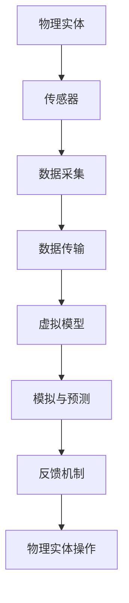

                 

### 文章标题：数字孪生：虚拟与现实自我的意义融合

#### 关键词：
- 数字孪生
- 虚拟与现实融合
- 技术架构
- 应用案例
- 未来趋势

#### 摘要：
本文将深入探讨数字孪生技术的概念、架构、应用及其重要性。通过一步一步的逻辑推理，我们将理解数字孪生如何通过虚拟与现实的自我的意义融合，实现各行业智能化升级。本文旨在为读者提供一个全面的技术视角，帮助其理解数字孪生的核心原理、技术实现和应用前景。

---

### 1. 引言

数字孪生（Digital Twin）是一个革命性的概念，它代表着将物理实体在虚拟世界中精确复制的能力。通过数字孪生技术，我们可以在虚拟环境中模拟和监控现实世界的实体，实现远程监控、预测性维护和虚拟仿真等应用。

数字孪生不仅仅是数字复制，它是一个包含多个层次的复杂系统，涉及数据采集、建模、模拟和实时交互等多个方面。其核心理念是将虚拟与现实融合，通过虚拟模型来理解和优化物理实体的性能。

#### 1.1 数字孪生的起源与发展

数字孪生概念最早由美国密歇根大学教授Michael Grieves在2002年提出。随着物联网（IoT）、大数据、云计算和人工智能技术的快速发展，数字孪生技术逐渐成为学术界和工业界的研究热点。

#### 1.2 数字孪生的重要性

数字孪生技术在多个领域具有广泛的应用前景，包括制造业、医疗、建筑、交通和能源等。它能够提高生产效率、降低运营成本、提升产品和服务质量。同时，数字孪生也是实现智能制造和智能城市的关键技术之一。

### 2. 数字孪生的核心概念与联系

要理解数字孪生，我们需要了解几个核心概念：物理实体、虚拟模型、实时数据交互和反馈循环。

#### 2.1 物理实体与虚拟模型

物理实体是我们所熟知的现实世界中的对象，如机器、建筑物、车辆等。虚拟模型则是物理实体的数字化表示，它通常是一个由多种数据构成的复杂系统。

#### 2.2 实时数据交互

数字孪生的关键在于实时数据交互，通过传感器、RFID等设备收集物理实体的实时数据，并将这些数据传输到虚拟模型中。

#### 2.3 反馈循环

虚拟模型根据实时数据调整其状态，并通过反馈机制指导物理实体的操作。这种反馈循环使得虚拟模型能够实时反映物理实体的状态，实现虚拟与现实的无缝融合。

#### 2.4 数字孪生的关系架构

为了更直观地理解数字孪生的核心概念和联系，我们可以使用Mermaid流程图来展示这些元素之间的关系：



### 3. 数字孪生的技术架构

数字孪生的技术架构主要包括数据采集、数据处理、虚拟建模和实时交互四个关键部分。下面，我们将逐步介绍这些技术。

#### 3.1 数据采集

数据采集是数字孪生的第一步，它涉及到多种传感器和采集设备，用于收集物理实体的各种数据，如温度、湿度、压力、速度等。

#### 3.2 数据处理

采集到的数据需要经过预处理，如去噪、滤波和特征提取等，以便用于后续的建模和分析。

#### 3.3 虚拟建模

虚拟建模是数字孪生的核心，它通过将物理实体的数据转化为数学模型，实现物理实体在虚拟世界中的精确表示。

#### 3.4 实时交互

实时交互使得虚拟模型能够与物理实体保持同步，实现虚拟与现实的无缝融合。这通常需要高效的通信协议和实时数据处理算法。

#### 3.5 伪代码示例

为了更清晰地展示虚拟建模的过程，我们使用伪代码进行描述：

```python
# 伪代码：虚拟建模
def build_digital_twin(physical_entity_data):
    # 数据预处理
    preprocessed_data = preprocess_data(physical_entity_data)
    
    # 构建数学模型
    model = create_model(preprocessed_data)
    
    # 更新模型
    model.update_model(preprocessed_data)
    
    return model
```

### 4. 数字孪生的应用案例

数字孪生技术已经在多个行业得到了广泛应用，以下是一些典型的应用案例：

#### 4.1 制造业

在制造业中，数字孪生技术可以用于产品设计和生产过程中的模拟和优化。通过虚拟模型，工程师可以在虚拟环境中进行各种仿真实验，从而减少物理原型测试的成本和时间。

#### 4.2 医疗

在医疗领域，数字孪生技术可以帮助医生进行虚拟手术规划，通过虚拟模型模拟手术过程，提高手术的成功率和安全性。

#### 4.3 建筑

在建筑领域，数字孪生技术可以用于建筑物的设计、施工和运营维护。通过虚拟模型，建筑师和工程师可以提前发现和解决设计问题，优化建筑性能。

#### 4.4 交通

在交通领域，数字孪生技术可以用于城市交通管理、车辆监控和交通预测。通过虚拟模型，可以实时监控交通状况，预测交通拥堵，并采取相应的措施。

### 5. 数字孪生的挑战与未来趋势

尽管数字孪生技术在多个领域展现出了巨大的潜力，但在实际应用中也面临着一些挑战。

#### 5.1 数据安全和隐私保护

数字孪生技术依赖于大量的实时数据，这些数据的安全性至关重要。如何保护数据不被未经授权的访问和篡改，是数字孪生技术需要解决的一个关键问题。

#### 5.2 数据集成与标准化

不同来源和格式的数据如何集成和标准化，是数字孪生技术面临的另一个挑战。这需要开发统一的接口和协议，实现数据的高效集成和管理。

#### 5.3 人工智能与机器学习

数字孪生技术的核心是虚拟建模和实时交互，这需要高效的算法和模型。人工智能和机器学习技术的发展将极大地推动数字孪生技术的进步。

#### 5.4 未来趋势

未来，数字孪生技术有望在更多领域得到应用，如智能城市、农业和环境保护等。同时，随着技术的不断进步，数字孪生将变得更加智能化和自动化，实现真正的虚拟与现实融合。

### 6. 结论

数字孪生技术是现代信息技术领域的一个重要分支，它通过虚拟与现实的无缝融合，为各行业带来了革命性的变革。通过本文的探讨，我们理解了数字孪生的核心概念、技术架构和应用案例，以及其面临的挑战和未来趋势。我们相信，随着技术的不断进步，数字孪生将在未来发挥更加重要的作用。

### 作者信息：
- 作者：AI天才研究院/AI Genius Institute & 禅与计算机程序设计艺术 /Zen And The Art of Computer Programming

---

以上为文章的初步框架和内容，接下来的章节将根据目录大纲逐步展开，深入探讨每一个部分的核心内容和细节。每一步都将使用逻辑清晰、结构紧凑、简单易懂的专业的技术语言，以确保文章的质量和专业性。预计总字数将在8000-12000字左右，确保内容的完整性和深度。

