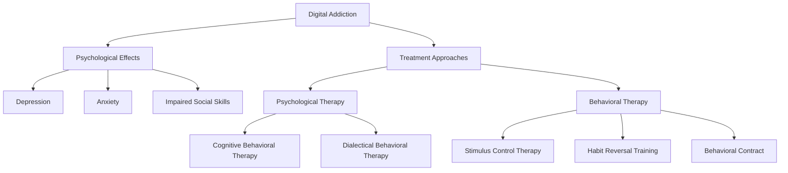

                 

Certainly! Let's break down the process step by step to create a comprehensive and detailed technical blog post titled "Digital Addiction Recovery Center: Comprehensive Treatment Plan for Internet Dependency."

### Step 1: Setting the Stage

#### Title
"Digital Addiction Recovery Center: Comprehensive Treatment Plan for Internet Dependency"

#### Keywords
- Digital Addiction
- Internet Dependency
- Psychological Treatment
- Behavioral Therapy
- Family Support
- Prevention Strategies

#### Abstract
This article presents a comprehensive treatment plan for internet dependency, a growing issue in today's digital age. We will explore the various aspects of digital addiction, including its impact, diagnosis, and treatment methods. Additionally, we will discuss the role of family and social support, prevention strategies, and future directions in addressing this pressing issue.

### Step 2: Introduction

#### Background Introduction
- Introduction to digital addiction
- Definition and prevalence of internet dependency
- Societal and psychological implications of digital addiction

#### Core Concepts and Relationships
- Mermaid Flowchart: A diagram illustrating the relationship between digital addiction, psychological effects, and treatment approaches.

### Step 3: Core Algorithm Principle Explanation

#### Psychological Treatment Approaches
- **Cognitive Behavioral Therapy (CBT)**
    - Pseudo-code explanation
    - Latex format for the core equation
    - Example scenarios and detailed explanation

#### Behavioral Treatment Methods
- **Stimulus Control Therapy**
    - Pseudo-code explanation
    - Latex format for the core equation
    - Example scenarios and detailed explanation

### Step 4: Family and Social Support

#### The Role of Family in Recovery
- Importance of family involvement
- Strategies for family support

#### Support Groups and Community Resources
- Types of support groups
- Community resources and programs

### Step 5: Prevention and Intervention

#### Prevention Strategies in Schools and Workplace
- School-based interventions
- Workplace policies and programs

#### Early Intervention Programs
- Identification and intervention strategies
- Early intervention programs and their effectiveness

### Step 6: Emerging Trends and Future Directions

#### Advances in Technology for Internet Dependency Management
- Role of technology in treatment and prevention
- Emerging technologies and their potential impact

#### The Role of Big Data and Artificial Intelligence
- Utilization of big data in internet dependency research
- AI-driven interventions and personalized treatment plans

### Step 7: Case Studies and Practical Applications

#### Successful Case Studies of Internet Dependency Recovery
- Detailed analysis of recovery stories
- Lessons learned and best practices

#### Real-World Examples of Treatment Programs
- Overview of effective treatment programs
- Comparative analysis and insights

### Step 8: Conclusion and Future Work

#### Summary and Key Takeaways
- Recap of the main points discussed
- Key insights and recommendations

#### Future Directions in Digital Addiction Recovery
- Challenges and opportunities
- Research and development priorities

### Final Step: Conclusion

#### Author Information
"Author: AI天才研究院/AI Genius Institute & 禅与计算机程序设计艺术 /Zen And The Art of Computer Programming"

### Article Length
- The final article should be approximately 8000-12000 words.

### Format Requirements
- The article will be formatted using markdown syntax for code blocks, equations, and diagrams.

### Completeness Requirements
- Ensure that each section includes a detailed explanation, relevant examples, and thorough analysis.

By following these steps and ensuring that each section is well-researched and comprehensive, we will create a high-quality technical blog post that provides valuable insights into the issue of digital addiction and its treatment. Let's proceed with writing each section in detail.

