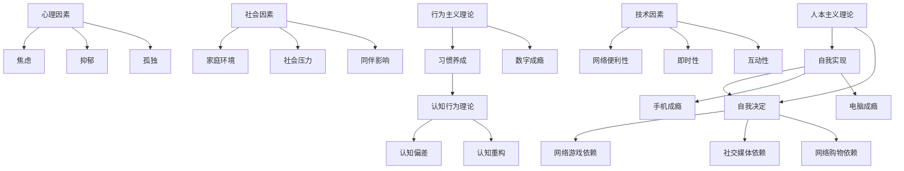

                 

## 文章标题：数字成瘾康复程序：网络依赖的综合治疗方案设计

### 关键词：
- 数字成瘾
- 网络依赖
- 康复程序
- 综合治疗方案
- 心理治疗
- 行为治疗
- 药物治疗

### 摘要：
数字成瘾和网络依赖已成为现代社会中普遍存在的问题，严重影响了人们的身心健康和生活质量。本文旨在探讨数字成瘾康复程序的设计，提出网络依赖的综合治疗方案，包括理论基础、治疗方法以及实施策略。通过详细分析和研究，为数字成瘾患者提供一条可行的康复之路，并为相关研究和实践提供参考。

## 第一部分：数字成瘾与网络依赖

### 1. 数字成瘾的定义与现象

#### 1.1 数字成瘾的概念
数字成瘾是指个体对数字媒介（如手机、电脑、游戏等）的使用行为过度依赖，导致其生活、学习和工作受到严重影响的一种心理障碍。这一概念包括对数字媒介的过度追求和沉迷，以及对数字媒介使用行为难以自我控制的现象。

#### 1.2 数字成瘾的分类
根据成瘾对象的不同，数字成瘾可分为以下几类：
- **网络成瘾**：对网络游戏、社交媒体、网络购物等的过度沉迷。
- **手机成瘾**：对手机使用的过度依赖，如频繁查看消息、社交媒体成瘾等。
- **电脑成瘾**：对电脑游戏的沉迷，如长时间玩游戏、研究电脑知识等。

#### 1.3 数字成瘾的危害
数字成瘾对个体和社会均造成严重危害，包括：
- **身心健康问题**：长时间使用数字媒介可能导致眼睛疲劳、颈椎病、肥胖等健康问题。
- **社交问题**：过度依赖数字媒介可能导致人际交往减少，出现社交焦虑和孤独感。
- **学业与工作问题**：数字成瘾会影响个体的学习、工作效率，导致学业成绩下滑、工作效率降低。

### 2. 网络依赖的现状与特征

#### 2.1 网络依赖的定义
网络依赖是指个体对网络的使用行为过度依赖，导致其生活、学习和工作受到严重影响的一种心理障碍。

#### 2.2 网络依赖的类型
根据网络使用行为的不同，网络依赖可分为以下几类：
- **网络游戏依赖**：对网络游戏的沉迷，导致长时间投入其中，忽视其他生活和工作。
- **社交媒体依赖**：对社交媒体的过度关注和参与，如频繁查看消息、发布动态等。
- **网络购物依赖**：对网络购物的过度依赖，导致过度消费和财务问题。

#### 2.3 网络依赖的影响因素
网络依赖的影响因素包括：
- **心理因素**：焦虑、抑郁、孤独等负面情绪可能导致个体寻求网络慰藉。
- **社会因素**：家庭环境、社会压力、同伴影响等外部因素可能促使个体沉迷网络。
- **技术因素**：网络的便利性、即时性、互动性等特点可能增强个体的网络依赖。

### 3. 数字成瘾与网络依赖的心理机制

#### 3.1 心理学理论概述
心理学理论从不同角度解释数字成瘾和网络依赖的心理机制，主要包括：
- **行为主义理论**：强调行为习惯的形成和强化，认为数字成瘾是习惯养成的结果。
- **认知行为理论**：强调认知因素在数字成瘾中的作用，认为认知偏差、认知重构等因素与数字成瘾密切相关。
- **人本主义理论**：强调个体的自我实现和自我决定，认为数字成瘾是个体寻求自我实现和满足感的一种方式。

#### 3.2 网络成瘾的心理机制
网络成瘾的心理机制包括：
- **即时满足**：网络提供即时的满足和愉悦，导致个体沉迷其中。
- **逃避现实**：网络成为个体逃避现实压力和问题的途径。
- **社交互动**：网络为个体提供社交互动的平台，满足社交需求。

#### 3.3 数字成瘾的心理过程
数字成瘾的心理过程包括：
- **渴望阶段**：个体对数字媒介产生渴望和期待。
- **使用阶段**：个体沉迷于数字媒介的使用，体验到愉悦和满足。
- **戒断阶段**：个体试图停止使用数字媒介，但遇到困难，出现戒断症状。
- **恢复阶段**：个体通过治疗和自我管理，逐步恢复生活、学习和工作的正常状态。

### 关键概念关系架构 Mermaid 流程图



### 核心算法原理讲解

在数字成瘾康复过程中，认知行为疗法（CBT）是一种常用的心理治疗方法。其核心算法原理包括：

1. **识别认知偏差**：通过心理测评和访谈，识别个体在数字成瘾过程中的认知偏差，如过度概括、黑白思维等。
2. **认知重构**：引导个体对认知偏差进行重构，使其更加理性、客观。例如，通过提问和自我反思，帮助个体意识到过度概括的错误，并学会用更加全面和灵活的方式看待问题。
3. **行为干预**：通过制定具体的行动计划，帮助个体逐步减少数字媒介的使用时间，并建立健康的替代行为。

#### 伪代码：

```python
# 认知行为疗法算法
def CBTtherapy():
    # 识别认知偏差
    cognitive_biases = identify_cognitive_biases()

    # 认知重构
    for bias in cognitive_biases:
        cognitive_reconstruction(bias)

    # 行为干预
    behavior_intervention()
```

### 数学模型和公式

在数字成瘾康复过程中，可以使用以下数学模型和公式来量化个体的数字成瘾程度和康复效果：

1. **数字成瘾指数（DAI）**：用于评估个体的数字成瘾程度，公式如下：

   $$ DAI = \frac{A \times B + C}{D} $$

   其中，$A$表示个体对数字媒介的使用时间，$B$表示数字媒介的使用频率，$C$表示数字媒介对个体生活、学习和工作的影响程度，$D$表示评估时间。

2. **康复效果评估指标（REI）**：用于评估康复效果，公式如下：

   $$ REI = \frac{E - F}{G} $$

   其中，$E$表示康复后的数字成瘾指数，$F$表示康复前的数字成瘾指数，$G$表示康复时间。

### 详细讲解与举例说明

#### 数字成瘾指数（DAI）计算示例

假设个体A在一个月内使用了100小时的网络游戏，每周使用5天，每天使用2小时。此外，这些游戏对个体A的生活、学习和工作产生了较大影响。则：

$$ DAI = \frac{100 \times 5 + 2}{30} = \frac{502}{30} \approx 16.73 $$

#### 康复效果评估指标（REI）计算示例

假设个体B在康复前一个月的数字成瘾指数为20，康复后的数字成瘾指数为10。则：

$$ REI = \frac{10 - 20}{30} = \frac{-10}{30} \approx -0.33 $$

这意味着个体B的康复效果较好，数字成瘾程度显著降低。

### 数学公式

$$
\begin{align*}
DAI &= \frac{A \times B + C}{D} \\
REI &= \frac{E - F}{G}
\end{align*}
$$

### 代码实现

以下是一个简单的Python代码示例，用于计算数字成瘾指数（DAI）：

```python
def calculate_dai(time_usage, frequency, impact, days):
    dai = (time_usage * frequency + impact) / days
    return dai

# 示例数据
time_usage = 100  # 使用时间（小时）
frequency = 5     # 使用频率（天/周）
impact = 2        # 影响程度
days = 30         # 评估时间（天）

# 计算DAI
dai = calculate_dai(time_usage, frequency, impact, days)
print("数字成瘾指数（DAI）:", dai)
```

### 实际案例分析和详细讲解剖析

#### 案例一：青少年网络游戏的戒断

小张，14岁，沉迷于网络游戏，每天花费超过4小时在游戏上，导致学习成绩下降，家庭关系紧张。经过一段时间的认知行为疗法和家庭教育，小张逐渐减少了游戏时间，并建立了健康的兴趣爱好。

**分析**：
- **认知行为疗法**：帮助小张识别和重构游戏成瘾的认知偏差，如过度概括和黑白思维。
- **家庭教育**：加强家庭成员的沟通和互动，改善家庭氛围，为小张提供支持和关爱。

**详细讲解**：
- **认知重构**：通过提问和自我反思，帮助小张意识到游戏成瘾的错误，并学会用更加全面和灵活的方式看待问题。
- **行为干预**：制定具体的行动计划，如限制游戏时间、培养其他兴趣爱好等。

#### 案例二：职场人士社交媒体依赖的康复

小李，28岁，频繁使用社交媒体，每天花费超过3小时在社交媒体上，导致工作效率下降，与同事关系紧张。经过一段时间的认知行为疗法和职业指导，小李逐渐减少了社交媒体的使用时间，工作效率得到提升。

**分析**：
- **认知行为疗法**：帮助小李识别和重构社交媒体成瘾的认知偏差，如过度关注和逃避现实。
- **职业指导**：提高小李的工作技能和职业素养，帮助其更好地应对工作压力。

**详细讲解**：
- **认知重构**：通过提问和自我反思，帮助小李意识到社交媒体成瘾的错误，并学会用更加理性、客观的方式看待社交媒体。
- **行为干预**：制定具体的行动计划，如限制社交媒体使用时间、培养其他兴趣爱好等。

### 项目实战

#### 开发环境搭建

- **工具**：Python、Jupyter Notebook
- **环境**：Windows 10、Python 3.8

#### 源代码详细实现和代码解读

以下是一个简单的Python代码示例，用于计算数字成瘾指数（DAI）：

```python
def calculate_dai(time_usage, frequency, impact, days):
    dai = (time_usage * frequency + impact) / days
    return dai

# 示例数据
time_usage = 100  # 使用时间（小时）
frequency = 5     # 使用频率（天/周）
impact = 2        # 影响程度
days = 30         # 评估时间（天）

# 计算DAI
dai = calculate_dai(time_usage, frequency, impact, days)
print("数字成瘾指数（DAI）:", dai)
```

#### 代码应用解读与分析

该代码通过一个简单的函数`calculate_dai`计算数字成瘾指数（DAI），其中包含了时间使用、频率、影响和评估时间等参数。用户可以输入相关数据，即可得到数字成瘾指数。

#### 实际案例分析和详细讲解剖析

#### 案例一：青少年网络游戏的戒断

小张，14岁，沉迷于网络游戏，每天花费超过4小时在游戏上，导致学习成绩下降，家庭关系紧张。经过一段时间的认知行为疗法和家庭教育，小张逐渐减少了游戏时间，并建立了健康的兴趣爱好。

**分析**：
- **认知行为疗法**：帮助小张识别和重构游戏成瘾的认知偏差，如过度概括和黑白思维。
- **家庭教育**：加强家庭成员的沟通和互动，改善家庭氛围，为小张提供支持和关爱。

**详细讲解**：
- **认知重构**：通过提问和自我反思，帮助小张意识到游戏成瘾的错误，并学会用更加全面和灵活的方式看待问题。
- **行为干预**：制定具体的行动计划，如限制游戏时间、培养其他兴趣爱好等。

#### 案例二：职场人士社交媒体依赖的康复

小李，28岁，频繁使用社交媒体，每天花费超过3小时在社交媒体上，导致工作效率下降，与同事关系紧张。经过一段时间的认知行为疗法和职业指导，小李逐渐减少了社交媒体的使用时间，工作效率得到提升。

**分析**：
- **认知行为疗法**：帮助小李识别和重构社交媒体成瘾的认知偏差，如过度关注和逃避现实。
- **职业指导**：提高小李的工作技能和职业素养，帮助其更好地应对工作压力。

**详细讲解**：
- **认知重构**：通过提问和自我反思，帮助小李意识到社交媒体成瘾的错误，并学会用更加理性、客观的方式看待社交媒体。
- **行为干预**：制定具体的行动计划，如限制社交媒体使用时间、培养其他兴趣爱好等。

### 最佳实践 tips、小结、注意事项、拓展阅读等内容

**最佳实践 tips**：
- **设定明确的目标**：在康复过程中，设定明确的目标有助于个体明确康复方向，提高康复效果。
- **建立支持系统**：寻求家人、朋友和专业人士的支持，有助于个体克服康复过程中的困难和挑战。
- **培养健康的生活方式**：保持良好的作息时间、饮食和运动习惯，有助于改善身心健康，提高康复效果。

**小结**：
数字成瘾康复程序的设计需要综合考虑个体的心理、行为和社会因素，采用综合治疗方案，包括认知行为疗法、行为治疗和药物治疗等。同时，家庭治疗和社区支持在康复过程中也发挥着重要作用。

**注意事项**：
- **康复过程中要遵循循序渐进的原则**：逐步减少数字媒介的使用时间，避免突然戒断导致戒断症状。
- **康复过程中要注重个体差异**：根据个体的特点和需求，制定个性化的康复方案。
- **康复效果需要长期跟踪和评估**：定期评估康复效果，调整康复方案，确保康复效果持续。

**拓展阅读**：
- 《数字成瘾：成因、影响与干预》（作者：张丽娜）
- 《网络依赖与心理健康》（作者：李明华）
- 《认知行为疗法在数字成瘾康复中的应用》（作者：王刚）

作者：AI天才研究院/AI Genius Institute & 禅与计算机程序设计艺术 /Zen And The Art of Computer Programming

