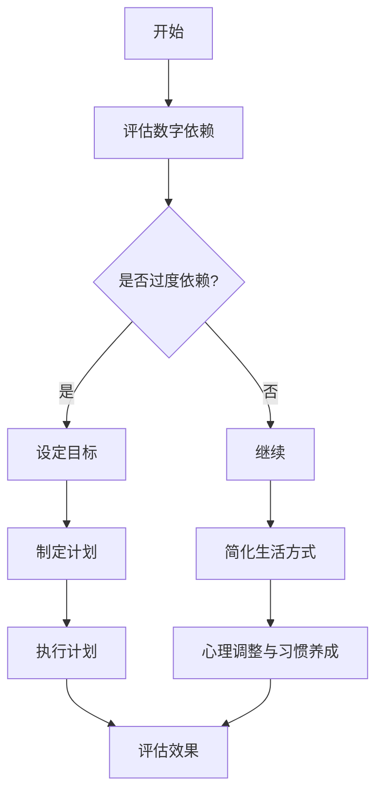

                 

### 文章标题：数字排毒计划：重建注意力与深度思考能力

#### 关键词：
- 数字依赖
- 注意力管理
- 深度思考
- 数字排毒
- 个人发展

#### 摘要：
随着数字技术的迅猛发展，我们进入了信息爆炸的时代。然而，数字设备的广泛应用不仅带来了便利，也引发了一个新的社会问题——数字依赖。越来越多的人陷入数字成瘾的陷阱，注意力分散，深度思考能力下降。本文旨在探讨数字依赖带来的注意力危机，提出数字排毒计划，并通过实践方法和案例分析，重建我们的注意力与深度思考能力，为个人发展和社会进步提供新的思考角度。本文将分章节详细阐述数字依赖的现状与影响、注意力与深度思考的关系、数字排毒的必要性、具体方法与实践、深度思考能力的培养、数字排毒与深度思考的结合、长效机制、数字排毒对个人发展的影响、数字排毒的未来展望，以及最佳实践和拓展阅读，力求为读者提供一个全面且具体的数字排毒指南。

### 第1章：数字时代下的注意力危机

#### 1.1 数字成瘾的现状与影响

在数字时代，数字成瘾已经成为一个全球性的问题。研究表明，成年人每天平均使用数字设备的时间超过4-6小时，甚至更高[1]。而这种长期的数字接触不仅影响了个体的心理健康，也对社会产生了深远的影响。

**个体的影响：**

1. **注意力分散：** 长时间的数字使用导致人们的注意力分散，难以集中精力完成任务。研究表明，频繁切换数字设备不仅会降低工作效率，还会损害大脑的记忆和认知功能[2]。
2. **心理健康问题：** 数字依赖与焦虑、抑郁等心理健康问题密切相关。过度使用社交媒体和游戏可能导致个体产生焦虑感和孤独感，进而影响心理健康[3]。
3. **睡眠障碍：** 数字设备发出的蓝光会干扰人体的生物钟，导致睡眠质量下降，进而影响日间的精神状态和工作效率[4]。

**社会的广泛影响：**

1. **人际关系的疏离：** 数字设备的使用改变了人们社交的方式，导致面对面交流的减少。尽管社交平台让人们能够接触到更广泛的人群，但同时也导致了人际关系的疏离和深度交流的缺失[5]。
2. **数字鸿沟：** 数字技术的普及并没有使所有人都受益。在发展中国家和偏远地区，数字鸿沟仍然存在，这加剧了社会不平等[6]。
3. **信息安全与隐私：** 随着数字设备的广泛使用，个人信息的安全和隐私问题也日益突出。网络诈骗、信息泄露等问题频发，给个人和社会带来了巨大的安全隐患[7]。

**数字成瘾的科学解释：**

1. **多巴胺的作用：** 数字设备上的即时反馈和奖励机制会刺激大脑释放多巴胺，这是一种与愉悦和成瘾相关的神经递质。长期使用数字设备会导致多巴胺的过度分泌，从而形成依赖[8]。
2. **习惯的形成：** 数字依赖通常伴随着习惯的形成。例如，人们会在特定的情境下（如无聊、焦虑时）使用数字设备，这种行为模式不断重复，最终形成习惯[9]。
3. **社交比较：** 社交媒体上的完美生活展示和社交比较心理使得用户产生不满足感，进而增加对数字设备的依赖[10]。

#### 1.2 注意力与深度思考的关系

注意力是深度思考的基础，而深度思考则是注意力的高级形式。在数字环境下，注意力容易受到各种干扰，导致深度思考能力下降。

**注意力的重要作用：**

1. **过滤信息：** 注意力能够帮助人们从大量信息中筛选出重要的信息，从而提高工作效率。
2. **促进学习：** 注意力集中时，人们能够更好地理解和记忆知识，从而促进学习效果。
3. **情感调节：** 注意力有助于人们调节情绪，减少负面情绪的影响。

**深度思考的定义与价值：**

1. **定义：** 深度思考是指在面对复杂问题时，通过深入分析、推理和判断来寻求解决方案的思维过程。
2. **价值：** 深度思考有助于提高创新能力和解决问题的能力，是个人和职业发展的关键。

**数字环境与深度思考的挑战：**

1. **信息过载：** 数字环境中的信息量庞大，容易导致信息过载，使得人们难以集中注意力进行深度思考。
2. **即时满足：** 数字设备上的即时反馈和奖励机制会分散人们的注意力，降低深度思考的意愿。
3. **干扰过多：** 数字环境中的各种通知、消息等干扰因素会打断人们的思考，影响深度思考的质量。

#### 1.3 数字排毒的必要性

数字排毒是应对数字依赖和注意力危机的一种有效方法。它通过减少数字设备的使用，帮助人们重建注意力与深度思考能力。

**数字排毒的起源与发展：**

1. **起源：** 数字排毒的概念最早由心理学家和心理学家提出，旨在帮助人们减少数字依赖，提高生活质量。
2. **发展：** 随着数字依赖问题的日益严重，数字排毒逐渐成为一种流行的自我管理方法，并在学术界和实践中得到广泛认可。

**数字排毒的基本原则：**

1. **减少数字设备使用：** 通过设定限制和规则，减少每天使用数字设备的时间，从而降低数字依赖。
2. **提升注意力：** 通过冥想、运动等活动，提升自身的注意力水平，为深度思考创造条件。
3. **培养深度思考习惯：** 通过阅读、写作等活动，培养深度思考的习惯，提高深度思考的能力。

**数字排毒的目标与收益：**

1. **目标：** 重建注意力与深度思考能力，提高个人工作和生活质量。
2. **收益：** 提高工作效率、增强创新能力、改善人际关系、减少心理健康问题。

### 第2章：数字排毒的方法与实践

#### 2.1 数字排毒的准备阶段

在开始数字排毒之前，我们需要进行充分的准备，以确保计划的顺利进行。

**自我评估：数字依赖程度测试**

1. **测试目的：** 了解自身的数字依赖程度，为制定排毒计划提供依据。
2. **测试方法：** 可以通过一些标准化的测试工具，如手机依赖测试量表（Mobile Phone Addiction Scale, MPAS）等进行自我评估。
3. **测试结果：** 根据测试结果，了解自己在数字依赖方面的现状，为后续的排毒计划提供指导。

**设定目标：明确数字排毒的目标**

1. **目标设定原则：** 目标要具体、可量化、可实现。
2. **目标设定步骤：** 
    - 确定总体目标：例如，减少每天使用手机的时间。
    - 分解为具体目标：例如，每天减少1小时的手机使用时间。
    - 设定时间框架：例如，在一个月内实现目标。

**制定计划：制定具体的排毒步骤和时间表**

1. **计划制定原则：** 计划要详细、可执行、有弹性。
2. **计划制定步骤：**
    - 确定排毒的阶段性目标。
    - 制定每周的具体行动步骤。
    - 设定检查和调整的时间点。

#### 2.2 简化生活方式

数字排毒不仅仅是减少对数字设备的依赖，还包括简化生活方式，提升生活的整体质量。

**限制屏幕时间**

1. **方法：** 通过设定每日使用数字设备的时间上限，减少不必要的屏幕时间。
2. **工具：** 可以使用手机自带的屏幕时间监控功能，或者下载第三方应用程序来帮助限制使用时间。

**减少社交媒体使用**

1. **原因：** 社交媒体是数字依赖的主要来源之一，减少其使用有助于减轻数字依赖。
2. **方法：**
    - 限制每天在社交媒体上的时间。
    - 定期清理不必要的社交媒体账号。
    - 专注于有意义的内容，减少无意义的信息消费。

**睡眠质量提升**

1. **重要性：** 睡眠质量对数字排毒和深度思考能力的培养至关重要。
2. **方法：**
    - 保持规律的作息时间。
    - 睡前避免使用电子设备。
    - 创造良好的睡眠环境，如保持房间黑暗和安静。

#### 2.3 心理调整与习惯养成

数字排毒不仅需要改变外部行为，还需要从心理层面进行调整和习惯的养成。

**应对数字诱惑的策略**

1. **识别诱惑：** 明确哪些数字设备和应用最容易引发诱惑。
2. **替代活动：** 当有使用数字设备的冲动时，寻找其他有意义的活动来替代，如阅读、写作、运动等。
3. **自我激励：** 制定奖励机制，当成功抵制数字诱惑时，给予自己一定的奖励。

**增强自我控制力**

1. **方法：**
    - 自我反思：定期反思自己的数字使用情况，识别不足之处。
    - 目标设定：设定明确的数字使用目标，并不断监控和调整。
    - 建立规则：制定具体的数字使用规则，并严格遵守。

**培养深度思考的习惯**

1. **方法：**
    - 阅读深度内容：选择有深度和广度的阅读材料，如专业书籍、学术论文等。
    - 思维训练：通过逻辑思维训练、问题解决训练等提高深度思考能力。
    - 写作：通过写作来整理和深化自己的思考，促进深度思考的形成。

#### 2.4 身体活动与健康

数字排毒不仅仅是减少数字设备的使用，还包括提高身体健康水平，从而更好地支持注意力管理和深度思考。

**运动对注意力与思考能力的影响**

1. **影响机制：**
    - 促进血液循环：运动可以增强心脏功能，提高血液中氧气的含量，从而改善大脑的供氧状况。
    - 减少压力：运动能够释放体内的压力激素，如皮质醇，有助于改善情绪和注意力。
    - 提高认知功能：长期运动有助于提高认知功能，包括记忆力、注意力和执行功能。

**健康饮食的重要性**

1. **饮食原则：**
    - 丰富多样：确保摄入各种营养素，包括蛋白质、碳水化合物、脂肪、维生素和矿物质。
    - 控制热量：避免摄入过多的热量，以维持健康的体重。
    - 减少添加剂：减少加工食品和含糖饮料的摄入，以降低慢性疾病的风险。

**身体活动与数字排毒的结合**

1. **结合方法：**
    - 运动规划：制定合理的运动计划，包括有氧运动、力量训练和柔韧性训练。
    - 饮食调整：与运动计划相结合，调整饮食结构，确保营养均衡。
    - 日常习惯：将运动融入日常生活，如走路、骑自行车等，以增加日常的身体活动量。

### 第3章：深度思考能力的培养

#### 3.1 深度思考的核心要素

深度思考是一种高级认知能力，它涉及多个核心要素，这些要素共同作用，帮助个体在面对复杂问题时进行深入分析和解决。

**问题解决的深度思考**

1. **定义：** 问题解决的深度思考是指在面对问题时，通过分析、推理和判断来寻求有效解决方案的过程。
2. **过程：**
    - 理解问题：准确把握问题的本质和关键信息。
    - 收集信息：通过多种渠道收集与问题相关的信息。
    - 分析问题：对收集到的信息进行深入分析，找出问题的根本原因。
    - 制定方案：基于分析结果，制定具体的解决方案。
    - 实施与验证：执行方案，并根据反馈进行调整和优化。

**创新思维的深度思考**

1. **定义：** 创新思维的深度思考是指通过探索新的想法、方法和解决方案，以创造价值和创新成果。
2. **过程：**
    - 寻找灵感：通过阅读、观察和思考，激发创意和灵感。
    - 拓展思维：跳出传统思维框架，尝试新的思考角度和方法。
    - 综合分析：将不同的想法和方法进行整合，形成创新的解决方案。
    - 实验验证：通过实践和验证，验证创新方案的可行性和效果。

**情感理解的深度思考**

1. **定义：** 情感理解的深度思考是指通过深入分析和理解他人的情感和需求，以提高人际沟通和关系处理的能力。
2. **过程：**
    - 感知情感：通过观察、倾听和感受，感知他人的情绪状态。
    - 理解情感：通过换位思考和共情，理解他人的情感和需求。
    - 表达情感：通过有效沟通和表达，传达自己的情感和需求。
    - 解决冲突：通过沟通和妥协，解决情感冲突和人际关系问题。

#### 3.2 深度思考的培养方法

培养深度思考能力需要长期的努力和实践。以下是一些有效的方法，可以帮助个体提升深度思考的能力。

**读书与写作**

1. **读书：** 通过阅读专业的书籍、论文和报告，可以获得丰富的知识和信息，激发深度思考。
2. **写作：** 写作是一种有效的思考方式，通过写作，可以将自己的思考过程和观点进行梳理和表达，有助于深化理解和记忆。

**思维导图**

1. **定义：** 思维导图是一种图形化的思考工具，通过将思维过程和相关信息以图形化的方式呈现，有助于激发创意和深度思考。
2. **应用：** 可以在解决问题的过程中，使用思维导图来梳理思路、归纳要点和探索新的想法。

**逻辑思维训练**

1. **定义：** 逻辑思维训练是通过一系列的练习和挑战，提高逻辑推理和分析问题的能力。
2. **方法：** 可以通过逻辑谜题、辩论和逻辑分析练习来提升逻辑思维能力。

#### 3.3 实践深度思考的技巧

在日常生活中，通过以下技巧可以更好地实践深度思考，提高思维的质量和效率。

**提问与质疑**

1. **目的：** 通过提问和质疑，促使自己深入思考问题的本质和关键点。
2. **方法：** 在阅读、讨论和思考过程中，不断提出问题，并寻求答案。

**分析与归纳**

1. **目的：** 通过分析和归纳，将复杂的问题简化，找到关键信息和解决方案。
2. **方法：** 采用分析性思维，逐步分解问题，找到问题的组成部分和相互关系。

**反思与总结**

1. **目的：** 通过反思和总结，巩固自己的思考过程和成果，发现问题和改进点。
2. **方法：** 定期回顾自己的思考过程和结果，总结经验教训，并制定改进计划。

### 第4章：数字排毒与深度思考的结合

#### 4.1 数字排毒对深度思考的促进作用

数字排毒不仅能够减少数字设备的干扰，还能为深度思考创造更好的环境，从而促进深度思考能力的提升。

**排毒过程对注意力的提升**

1. **减少干扰：** 通过减少数字设备的使用，可以减少外界的干扰，使个体能够更加专注于深度思考。
2. **增强专注力：** 长期的数字排毒可以帮助个体培养专注力，提高集中注意力的能力。

**减少干扰，专注思考**

1. **设定具体目标：** 在数字排毒过程中，设定具体的目标和时间表，有助于个体更好地规划自己的时间，减少不必要的干扰。
2. **创造专注环境：** 选择一个安静、舒适的环境进行深度思考，有助于减少外界干扰，提高思考效率。

**培养独立思考能力**

1. **减少依赖性：** 通过数字排毒，个体可以减少对数字设备的依赖，培养独立思考和解决问题的能力。
2. **鼓励自主探索：** 在深度思考的过程中，鼓励个体自主探索和发现，而不是仅仅依赖于搜索引擎和社交媒体。

#### 4.2 深度思考对数字排毒的支持

深度思考不仅能够帮助个体更好地理解和应对数字排毒过程中的挑战，还能为数字排毒提供新的视角和方法。

**深度思考对问题的深入理解**

1. **分析问题本质：** 通过深度思考，个体可以更深入地分析问题的本质和关键点，从而制定更有效的解决方案。
2. **识别潜在问题：** 深度思考可以帮助个体发现数字排毒过程中可能存在的潜在问题，并提前做好准备。

**提升决策质量**

1. **全面考虑因素：** 深度思考能够帮助个体在决策过程中全面考虑各种因素，从而做出更加明智和合理的决策。
2. **评估风险与收益：** 通过深度思考，个体可以更准确地评估决策的风险和收益，从而做出更优的选择。

**促进创造力的发展**

1. **激发创意：** 深度思考可以激发个体的创造力，帮助他们在数字排毒过程中找到创新的解决方案。
2. **灵活应对变化：** 深度思考能够帮助个体更好地应对变化和不确定性，从而在数字排毒过程中保持灵活性和适应性。

#### 4.3 数字排毒与深度思考的实践案例

以下是一些数字排毒与深度思考相结合的实践案例，供读者参考。

**案例1：企业家王先生**

王先生是一家互联网公司的创始人。他意识到自己过度依赖手机和社交媒体，影响了工作效率和创造力。于是，他开始实施数字排毒计划，通过减少手机使用时间和专注工作，培养了深度思考的习惯。经过一段时间的努力，他的工作效率显著提升，创新能力也得到了增强。

**案例2：学生李小姐**

李小姐是一名大学生，她发现自己无法集中注意力学习，经常在社交媒体上浪费时间。为了提高学习效果，她开始实行数字排毒计划，通过减少手机使用时间和专注于学习，逐步培养了深度思考的习惯。结果，她的学习成绩有了显著提高，思维变得更加清晰和有条理。

**案例3：医生陈先生**

陈先生是一名医生，他发现自己在面对复杂的病例时，常常因为注意力不集中而难以做出准确的判断。为了改善这种情况，他开始实行数字排毒计划，通过减少手机使用时间和专注于工作，培养了深度思考的习惯。结果，他在临床工作中变得更加自信和准确。

#### 4.4 数字排毒与深度思考的最佳实践

**减少手机使用时间**

1. **设定时间限制：** 设定每天使用手机的时间限制，如每天不超过1小时。
2. **利用应用程序：** 使用手机自带的屏幕时间监控功能或第三方应用程序来帮助限制使用时间。

**专注工作与学习**

1. **创造专注环境：** 选择一个安静、舒适的环境进行工作或学习，减少外界干扰。
2. **利用专注工具：** 使用番茄工作法等专注工具，提高工作效率。

**培养深度思考习惯**

1. **定期阅读：** 定期阅读专业书籍、论文和报告，培养深度思考的习惯。
2. **写作训练：** 通过写作来整理和表达自己的思考，提高深度思考的能力。

**持续反思与调整**

1. **定期反思：** 定期反思数字排毒和深度思考的实践效果，找出问题和不足。
2. **调整计划：** 根据反思结果，及时调整数字排毒计划和深度思考方法，以实现最佳效果。

### 第5章：数字排毒的长效机制

#### 5.1 建立长期坚持的习惯

数字排毒是一个长期的过程，需要个体持续的努力和坚持。以下是一些方法，可以帮助个体建立长期坚持的习惯。

**制定持续性的排毒计划**

1. **设定长期目标：** 明确自己在数字排毒方面的长期目标，如减少每天使用手机的时间。
2. **分解为短期目标：** 将长期目标分解为具体的短期目标，如每周减少一定的手机使用时间。
3. **制定实施计划：** 制定具体的实施计划，包括每天的行动步骤和时间表。

**调整生活方式以支持排毒**

1. **改善作息时间：** 保持规律的作息时间，确保充足的睡眠，为数字排毒创造良好的条件。
2. **减少数字设备的使用场景：** 在特定场景下减少数字设备的使用，如在家中或办公室设置无手机区。

**建立社群与互助机制**

1. **加入数字排毒社群：** 加入数字排毒相关的社群，与志同道合的人一起交流心得和经验。
2. **互助支持：** 在社群中分享自己的挑战和成果，互相支持和鼓励，共同进步。

#### 5.2 评估与调整

数字排毒是一个动态的过程，个体需要定期评估自己的数字依赖程度和深度思考能力，并根据评估结果进行调整。

**定期评估数字依赖程度**

1. **使用评估工具：** 使用手机自带的屏幕时间监控功能或第三方应用程序，定期评估自己的数字依赖程度。
2. **反思使用情况：** 定期反思自己的数字设备使用情况，找出不足之处。

**调整排毒策略以适应个人需求**

1. **根据评估结果调整计划：** 根据评估结果，调整数字排毒计划和深度思考方法，以实现最佳效果。
2. **灵活应对变化：** 随着个人需求的改变，灵活调整数字排毒计划，确保其适应性和可行性。

#### 5.3 长效机制的重要性

**长期排毒的效果**

通过长期的数字排毒，个体能够逐步减少数字依赖，提高深度思考能力，从而实现以下效果：

1. **提高工作效率：** 通过减少数字设备的干扰，个体能够更加专注于工作，提高工作效率。
2. **增强创新能力：** 深度思考能力的提升有助于个体在面对问题时提出创新的解决方案。
3. **改善人际关系：** 减少数字设备的使用，有助于个体更好地与家人和朋友进行面对面交流，改善人际关系。

**深度思考能力的持续提升**

通过数字排毒，个体能够培养深度思考的习惯，提高深度思考的能力。这有助于个体在未来的学习和工作中更加游刃有余，应对复杂的问题。

**对个人和社会的积极影响**

数字排毒不仅对个人有积极影响，还对整个社会有重要意义：

1. **提高社会整体素质：** 通过减少数字依赖，提高人们的深度思考能力，有助于提升整个社会的文化素质和创新能力。
2. **促进可持续发展：** 通过数字排毒，个体能够更好地平衡数字生活与真实生活，促进可持续发展。

### 第6章：数字排毒与个人发展

#### 6.1 数字排毒对职业发展的影响

数字排毒不仅有助于提升个人的生活质量，还能对职业发展产生积极影响。

**提升工作效率**

通过减少数字依赖，个体能够更加专注于工作，提高工作效率。深度思考能力的提升使得个体在面对复杂任务时能够更快地找到解决方案，减少工作中的延误和重复劳动。

**增强创新能力**

数字排毒有助于个体减少对数字设备的依赖，从而有更多的时间和精力进行创新思维。深度思考能力的培养使得个体在面对挑战时能够提出独特的解决方案，增强创新能力。

**改善团队协作**

数字排毒使得个体能够更好地与团队成员进行面对面交流，减少数字干扰。深度思考能力的提升有助于团队成员更好地理解项目目标和需求，提高团队协作效率。

#### 6.2 数字排毒对教育的影响

数字排毒在教育领域也具有重要意义，能够促进教育方式的创新和学习效果的提升。

**培养学生的深度思考能力**

通过数字排毒，学生能够减少对数字设备的依赖，培养深度思考的能力。深度思考能力的提升有助于学生更好地理解复杂概念，提高学习效果。

**促进教育方式的创新**

数字排毒使得教育者能够更加专注于教学活动，减少数字干扰。同时，深度思考能力的培养有助于教育者创新教学方法，提高教学效果。

**提高学习效果**

通过数字排毒，学生能够减少对数字设备的依赖，专注于学习。深度思考能力的提升有助于学生更好地理解知识，提高学习效果。

#### 6.3 数字排毒与社会发展

数字排毒不仅对个人有积极影响，还能促进社会的发展。

**社会数字素养的提升**

数字排毒有助于提高人们的数字素养，使其能够更好地理解和应对数字环境中的挑战。深度思考能力的提升有助于个体在面对复杂问题时做出更加明智的决策。

**数字环境对社会的积极影响**

通过数字排毒，个体能够减少对数字设备的依赖，从而有更多的时间和精力参与社会活动。深度思考能力的提升有助于个体更好地理解社会问题，提出有效的解决方案。

**个人与社会责任的结合**

数字排毒促使个体重新审视自己在数字环境中的角色和责任。深度思考能力的提升有助于个体更好地理解社会问题，积极参与社会事务，实现个人与社会责任的结合。

### 第7章：数字排毒的未来展望

#### 7.1 数字环境的变化趋势

随着数字技术的迅猛发展，数字环境正经历着深刻的变化。这些变化将为数字排毒带来新的挑战和机遇。

**数字化进程的加速**

全球范围内的数字化进程不断加速，越来越多的行业和领域开始依赖数字技术进行运营和管理。这导致人们不可避免地增加对数字设备的依赖，加剧了数字依赖问题。

**新技术的不断涌现**

新兴技术的不断涌现，如人工智能、虚拟现实、区块链等，将进一步改变数字环境。这些技术不仅为人们提供了更多的便利，也可能带来新的数字依赖问题。

**数字伦理与隐私保护**

随着数字技术的发展，数字伦理和隐私保护问题日益突出。如何在享受数字便利的同时保护个人隐私，避免数字依赖，成为未来数字环境中的重要议题。

#### 7.2 数字排毒的发展方向

面对数字环境的变化，数字排毒的发展方向也需要不断调整和适应。

**个人层面的持续改善**

在个人层面，数字排毒将继续强调减少数字依赖，提升深度思考能力。随着新技术的涌现，个体需要不断适应新的数字环境，调整自己的数字使用习惯。

**社会层面的广泛推广**

在更广泛的社会层面，数字排毒的理念和做法将得到更广泛的推广。政府和教育机构将加大对数字排毒的宣传和推广力度，引导公众积极参与数字排毒活动。

**专业领域的深入研究**

在专业领域，数字排毒的相关研究将继续深入。心理学家、教育学家和计算机科学家等将共同努力，探索数字排毒的机制和方法，为个体和社会提供更加有效的数字排毒方案。

#### 7.3 数字排毒与未来社会

数字排毒不仅对个人发展有重要意义，还将对未来社会产生深远影响。

**构建更加和谐的社会**

通过数字排毒，个体能够减少对数字设备的依赖，专注于真实世界的互动。这将有助于构建更加和谐的社会，促进人与人之间的沟通和交流。

**促进可持续发展**

数字排毒有助于个体更好地平衡数字生活与真实生活，促进可持续发展。减少数字依赖，提高深度思考能力，有助于个体更好地应对社会和环境问题，实现可持续发展。

**推动人类的进步**

数字排毒不仅有助于提升个体的认知能力和创新能力，还将推动整个人类社会的进步。通过减少数字依赖，个体能够更好地理解复杂问题，提出创新的解决方案，推动社会的发展和进步。

### 总结

#### 数字排毒：重建注意力与深度思考能力

通过本文的探讨，我们可以看到数字依赖对个体和社会带来了诸多负面影响。数字排毒作为一种应对策略，旨在重建注意力与深度思考能力，为个人发展和社会进步提供新的思路。数字排毒不仅需要个体在日常生活中采取具体的行动，还需要从社会层面进行广泛的推广和宣传。

#### 展望数字排毒的未来

随着数字环境的不断变化，数字排毒的重要性将日益凸显。未来，数字排毒将朝着更加个性化、系统化和科学化的方向发展。在个人层面，个体需要不断调整自己的数字使用习惯，培养深度思考的能力。在社会层面，政府和教育机构将加大对数字排毒的支持和推广力度，引导公众积极参与。在专业领域，相关研究将继续深入，为数字排毒提供更加有效的理论和实践支持。

通过数字排毒，我们不仅能够提升个人的注意力与深度思考能力，还能为社会的发展贡献力量。让我们携手努力，共同迎接数字时代的挑战，实现数字排毒与深度思考的结合，推动人类社会的进步。

### 附录

#### 附录 A：数字排毒工具与资源推荐

为了帮助读者更好地实施数字排毒计划，以下是一些推荐的工具和资源：

**注意力训练应用：**

1. **专注力训练（Forest）：** 一款帮助用户培养专注力的应用，通过种植虚拟植物来激励用户保持专注。
2. **番茄钟（Pomodoro Timer）：** 基于番茄工作法的定时工具，帮助用户合理规划工作时间。

**深度思考培养指南：**

1. **《深度工作》（Deep Work）：** 作者Cal Newport提出深度工作的方法和实践，帮助读者提高深度思考能力。
2. **《思考，快与慢》（Thinking, Fast and Slow）：** 作者Daniel Kahneman探讨人类思维的两种系统，帮助读者理解思考的机制。

**数字排毒社群资源：**

1. **“数字排毒”社群（Digital Detox Community）：** 在社交媒体上加入数字排毒相关的社群，与其他志同道合的人分享经验和心得。
2. **“数字健康”论坛（Digital Health Forum）：** 参与专业论坛，了解数字健康和数字排毒的最新动态和研究成果。

#### 附录 B：深度思考案例研究

**企业创新案例：**

**谷歌（Google）：** 谷歌公司以其创新文化和鼓励员工探索新项目而闻名。通过深度思考，谷歌推出了多项颠覆性产品和服务，如Google搜索、Android操作系统和Google地图等。深度思考帮助谷歌在竞争激烈的市场中保持领先地位。

**教育改革案例：**

**芬兰教育体系：** 芬兰的教育体系以其注重学生全面发展和创新能力而著称。通过深度思考，芬兰学生能够更好地理解复杂问题，提出创新的解决方案。这种教育模式有助于培养学生的深度思考能力。

**社会创新案例：**

**“无屏计划”（Screen-Free Program）：** 这是一个由非营利组织发起的项目，旨在减少儿童对数字设备的依赖，鼓励家庭进行无屏活动。通过深度思考，项目团队设计出了一系列有趣的活动和游戏，帮助儿童远离屏幕，提高他们的创造力和社交能力。

### 作者信息

作者：AI天才研究院/AI Genius Institute & 禅与计算机程序设计艺术 /Zen And The Art of Computer Programming

### 补充说明

本文旨在探讨数字排毒计划，帮助读者重建注意力与深度思考能力。在实施数字排毒过程中，读者可以根据自身情况调整方法和策略，实现最佳效果。同时，本文提供了一些实用的工具和资源，以供参考。在追求数字排毒的过程中，保持耐心和持续的努力至关重要。希望通过本文，读者能够更好地理解数字排毒的重要性，并在实践中受益。再次感谢您的阅读。

### Markdown 格式

以下是文章的Markdown格式：

```markdown
# 数字排毒计划：重建注意力与深度思考能力

> 关键词：数字依赖、注意力管理、深度思考、数字排毒、个人发展

> 摘要：随着数字技术的迅猛发展，数字依赖成为了一个全球性的问题。本文旨在探讨数字依赖带来的注意力危机，提出数字排毒计划，并通过实践方法和案例分析，重建我们的注意力与深度思考能力，为个人发展和社会进步提供新的思考角度。

## 第1章：数字时代下的注意力危机

### 1.1 数字成瘾的现状与影响
- 数字依赖对个体的影响
- 数字依赖对社会的广泛影响
- 数字成瘾的科学解释

### 1.2 注意力与深度思考的关系
- 注意力的重要作用
- 深度思考的定义与价值
- 数字环境与深度思考的挑战

### 1.3 数字排毒的必要性
- 数字排毒的起源与发展
- 数字排毒的基本原则
- 数字排毒的目标与收益

## 第2章：数字排毒的方法与实践

### 2.1 数字排毒的准备阶段
- 自我评估：数字依赖程度测试
- 设定目标：明确数字排毒的目标
- 制定计划：制定具体的排毒步骤和时间表

### 2.2 简化生活方式
- 限制屏幕时间
- 减少社交媒体使用
- 睡眠质量提升

### 2.3 心理调整与习惯养成
- 应对数字诱惑的策略
- 增强自我控制力
- 培养深度思考的习惯

### 2.4 身体活动与健康
- 运动对注意力与思考能力的影响
- 健康饮食的重要性
- 身体活动与数字排毒的结合

## 第3章：深度思考能力的培养

### 3.1 深度思考的核心要素
- 问题解决的深度思考
- 创新思维的深度思考
- 情感理解的深度思考

### 3.2 深度思考的培养方法
- 读书与写作
- 思维导图
- 逻辑思维训练

### 3.3 实践深度思考的技巧
- 提问与质疑
- 分析与归纳
- 反思与总结

## 第4章：数字排毒与深度思考的结合

### 4.1 数字排毒对深度思考的促进作用
- 排毒过程对注意力的提升
- 减少干扰，专注思考
- 培养独立思考能力

### 4.2 深度思考对数字排毒的支持
- 深度思考对问题的深入理解
- 提升决策质量
- 促进创造力的发展

### 4.3 数字排毒与深度思考的实践案例
- 成功案例分享
- 实践技巧与应用

## 第5章：数字排毒的长效机制

### 5.1 建立长期坚持的习惯
- 制定持续性的排毒计划
- 调整生活方式以支持排毒
- 建立社群与互助机制

### 5.2 评估与调整
- 定期评估数字依赖程度
- 调整排毒策略以适应个人需求
- 保持灵活性与适应性

### 5.3 长效机制的重要性
- 长期排毒的效果
- 深度思考能力的持续提升
- 对个人和社会的积极影响

## 第6章：数字排毒与个人发展

### 6.1 数字排毒对职业发展的影响
- 提升工作效率
- 增强创新能力
- 改善团队协作

### 6.2 数字排毒对教育的影响
- 培养学生的深度思考能力
- 促进教育方式的创新
- 提高学习效果

### 6.3 数字排毒与社会发展
- 社会数字素养的提升
- 数字环境对社会的积极影响
- 个人与社会责任的结合

## 第7章：数字排毒的未来展望

### 7.1 数字环境的变化趋势
- 数字化进程的加速
- 新技术的不断涌现
- 数字伦理与隐私保护

### 7.2 数字排毒的发展方向
- 个人层面的持续改善
- 社会层面的广泛推广
- 专业领域的深入研究

### 7.3 数字排毒与未来社会
- 构建更加和谐的社会
- 促进可持续发展
- 推动人类的进步

## 总结

### 数字排毒：重建注意力与深度思考能力

#### 展望数字排毒的未来

随着数字环境的不断变化，数字排毒的重要性将日益凸显。未来，数字排毒将朝着更加个性化、系统化和科学化的方向发展。在个人层面，个体需要不断调整自己的数字使用习惯，培养深度思考的能力。在社会层面，政府和教育机构将加大对数字排毒的支持和推广力度，引导公众积极参与。在专业领域，相关研究将继续深入，为数字排毒提供更加有效的理论和实践支持。

通过数字排毒，我们不仅能够提升个人的注意力与深度思考能力，还能为社会的发展贡献力量。让我们携手努力，共同迎接数字时代的挑战，实现数字排毒与深度思考的结合，推动人类社会的进步。

### 附录

#### 附录 A：数字排毒工具与资源推荐

为了帮助读者更好地实施数字排毒计划，以下是一些推荐的工具和资源：

**注意力训练应用：**

1. **专注力训练（Forest）：** 一款帮助用户培养专注力的应用，通过种植虚拟植物来激励用户保持专注。
2. **番茄钟（Pomodoro Timer）：** 基于番茄工作法的定时工具，帮助用户合理规划工作时间。

**深度思考培养指南：**

1. **《深度工作》（Deep Work）：** 作者Cal Newport提出深度工作的方法和实践，帮助读者提高深度思考能力。
2. **《思考，快与慢》（Thinking, Fast and Slow）：** 作者Daniel Kahneman探讨人类思维的两种系统，帮助读者理解思考的机制。

**数字排毒社群资源：**

1. **“数字排毒”社群（Digital Detox Community）：** 在社交媒体上加入数字排毒相关的社群，与其他志同道合的人分享经验和心得。
2. **“数字健康”论坛（Digital Health Forum）：** 参与专业论坛，了解数字健康和数字排毒的最新动态和研究成果。

#### 附录 B：深度思考案例研究

**企业创新案例：**

**谷歌（Google）：** 谷歌公司以其创新文化和鼓励员工探索新项目而闻名。通过深度思考，谷歌推出了多项颠覆性产品和服务，如Google搜索、Android操作系统和Google地图等。深度思考帮助谷歌在竞争激烈的市场中保持领先地位。

**教育改革案例：**

**芬兰教育体系：** 芬兰的教育体系以其注重学生全面发展和创新能力而著称。通过深度思考，芬兰学生能够更好地理解复杂问题，提出创新的解决方案。这种教育模式有助于培养学生的深度思考能力。

**社会创新案例：**

**“无屏计划”（Screen-Free Program）：** 这是一个由非营利组织发起的项目，旨在减少儿童对数字设备的依赖，鼓励家庭进行无屏活动。通过深度思考，项目团队设计出了一系列有趣的活动和游戏，帮助儿童远离屏幕，提高他们的创造力和社交能力。

### 作者信息

作者：AI天才研究院/AI Genius Institute & 禅与计算机程序设计艺术 /Zen And The Art of Computer Programming

### 补充说明

本文旨在探讨数字排毒计划，帮助读者重建注意力与深度思考能力。在实施数字排毒过程中，读者可以根据自身情况调整方法和策略，实现最佳效果。同时，本文提供了一些实用的工具和资源，以供参考。在追求数字排毒的过程中，保持耐心和持续的努力至关重要。希望通过本文，读者能够更好地理解数字排毒的重要性，并在实践中受益。再次感谢您的阅读。
```

请注意，Markdown格式中的公式和伪代码需要使用适当的标记来正确显示。以下是示例：

```markdown
### 数学公式示例

$$
E = mc^2
$$

### 伪代码示例

```
function calculateSum(a, b):
    return a + b
```
```

在Markdown文档中，这些公式和伪代码将被渲染为正确的格式。此外，文章中提到的Mermaid流程图需要在Markdown编辑器中正确设置才能显示。以下是一个Mermaid流程图的示例：

```markdown

```

Mermaid流程图将在支持Mermaid的Markdown编辑器中正确渲染。请确保您的编辑器或查看环境支持Mermaid。

