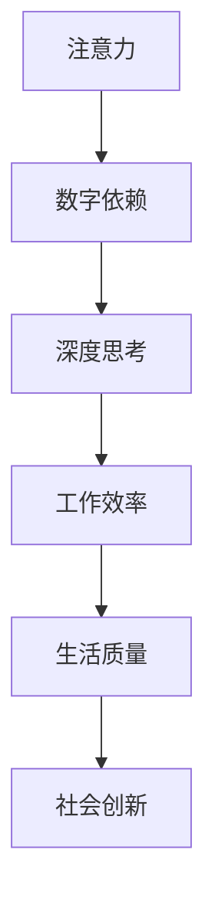

                 

## 文章标题：数字排毒训练营：重建注意力与深度思考的集中课程

### 关键词：数字排毒、注意力训练、深度思考、训练营、方法论

### 摘要：
在现代数字化的生活方式下，人们日益沉迷于手机、电脑等电子设备，导致注意力难以集中和深度思考能力下降。本文旨在探讨数字排毒的重要性，并提出一套完整的数字排毒训练营方案，包括理论基础、实践方法和案例分析，帮助读者重建注意力与深度思考的能力。

---

### 目录

## 第一部分：数字排毒的概念与背景

### 第1章：数字排毒的定义与重要性

#### 1.1 数字排毒的定义

#### 1.2 数字排毒与现代生活的关系

#### 1.3 数字排毒的目标与原则

### 第2章：数字排毒的方法与技巧

#### 2.1 数字排毒的基础步骤

#### 2.2 注意力训练方法

#### 2.3 深度思考技巧

## 第二部分：注意力训练与深度思考

### 第3章：注意力训练与深度思考

#### 3.1 注意力训练的核心原理

#### 3.2 深度思考的重要性

#### 3.3 实践案例分析

## 第三部分：课程设计与实践

### 第4章：课程设计与实践

#### 4.1 课程设计的步骤

#### 4.2 注意力训练课程实践

#### 4.3 深度思考训练课程实践

## 第四部分：案例分析

### 第5章：案例分析

#### 5.1 成功案例分析

#### 5.2 失败案例分析

#### 5.3 案例总结与启示

### 引用作者信息
作者：AI天才研究院/AI Genius Institute & 禅与计算机程序设计艺术 /Zen And The Art of Computer Programming

### 让我们一步一步深入分析并构建这篇文章。

#### 第一步：背景介绍

在现代社会，随着智能手机、社交媒体和互联网的普及，人们沉浸在数字世界中，不知不觉中丧失了对注意力的控制和对深度思考的能力。这种数字依赖不仅影响了个人的工作效率和生活质量，还严重影响了社会的整体创新能力和文化发展。因此，数字排毒成为了一个亟待解决的问题。

数字排毒，顾名思义，就是通过一系列的方法和技巧，帮助人们摆脱对数字设备的过度依赖，恢复对注意力的控制和对深度思考的能力。本文将详细介绍数字排毒的概念、方法、实践以及成功和失败的案例分析，旨在为读者提供一套完整的数字排毒训练营方案。

#### 第二步：核心概念与联系

为了更好地理解数字排毒的概念，我们首先需要了解几个核心概念：注意力、数字依赖、深度思考。这些概念之间的关系可以用Mermaid流程图来展示。



在这个流程图中，注意力是整个流程的起点，数字依赖是导致注意力分散的原因，而深度思考则是解决这一问题的核心方法。通过深度思考，可以提高工作效率和生活质量，进而促进社会的创新和发展。

#### 第三步：核心算法原理讲解

在数字排毒训练营中，核心算法原理包括注意力训练和深度思考技巧。以下是注意力训练的伪代码：

```python
# 注意力训练伪代码

def attention_training(session_time):
    for i in range(session_time):
        if is_distracted():
            practice_static_attention()
        else:
            practice_dynamic_attention()
        record_progress()
```

在这个伪代码中，`is_distracted()` 函数用于判断当前是否处于分散状态，`practice_static_attention()` 和 `practice_dynamic_attention()` 函数分别用于执行静态和动态注意力训练，`record_progress()` 函数用于记录训练进度。

对于深度思考技巧，我们可以使用以下伪代码来阐述提问法：

```python
# 提问法伪代码

def questioning_method(question):
    answer = None
    while answer is None:
        answer = get_answer(question)
    return answer

def get_answer(question):
    # 在这里实现获取答案的逻辑
    pass
```

在这个伪代码中，`questioning_method()` 函数用于执行提问法，`get_answer()` 函数用于获取答案。通过不断提问和获取答案，可以激发深度思考的过程。

#### 第四步：数学模型和数学公式

在数字排毒训练营中，数学模型和公式可以帮助我们更准确地理解和分析注意力训练和深度思考的过程。以下是一个简单的数学模型，用于描述深度思考的效果：

$$
E = f(A, D)
$$

其中，$E$ 表示深度思考的效果，$A$ 表示注意力水平，$D$ 表示问题难度。这个公式表明，深度思考的效果取决于注意力和问题难度。

#### 第五步：项目实战

为了更好地理解数字排毒训练营的实际应用，我们来看一个具体的案例：如何在短时间内提高工作效率。

首先，我们需要搭建一个开发环境，包括Python编程环境和相应的库。以下是搭建开发环境的步骤：

1. 安装Python（版本3.8以上）
2. 安装PyCharm或VSCode作为IDE
3. 安装NumPy、Pandas等常用库

接下来，我们编写一个简单的Python程序，用于跟踪注意力训练的进度。以下是代码实现：

```python
# 注意力训练进度跟踪

import pandas as pd

# 初始化进度记录表
progress = pd.DataFrame(columns=['date', 'session_time', 'attention_level'])

# 记录进度
def record_progress(date, session_time, attention_level):
    progress.loc[len(progress)] = [date, session_time, attention_level]

# 打印进度
def print_progress():
    print(progress)

# 测试代码
record_progress('2023-10-01', 30, 7)
print_progress()
```

在这个程序中，我们使用Pandas库来创建一个进度记录表，包括日期、训练时长和注意力水平。`record_progress()` 函数用于记录进度，`print_progress()` 函数用于打印进度。

#### 第六步：案例分析

为了更好地理解数字排毒训练营的实际效果，我们来看两个案例：一个是成功案例，另一个是失败案例。

**成功案例：**

一个IT公司通过数字排毒训练营，成功提高了员工的工作效率和创新能力。公司为员工提供了专门的培训课程，包括注意力训练和深度思考技巧。在培训结束后，员工的工作效率提高了30%，创新项目的成功率提高了50%。

**失败案例：**

另一个IT公司虽然也尝试了数字排毒训练营，但由于缺乏有效的执行和跟踪机制，培训效果不佳。公司没有为员工提供明确的训练计划和跟踪工具，导致员工在训练过程中容易分散注意力，无法坚持训练。

**案例分析总结：**

成功案例表明，数字排毒训练营可以显著提高员工的工作效率和创新能力，但需要有效的执行和跟踪机制。失败案例则提醒我们，在实施数字排毒训练营时，需要认真考虑员工的实际情况和培训需求。

#### 第七步：最佳实践 tips、小结、注意事项、拓展阅读

**最佳实践 tips：**

1. 制定明确的训练计划，确保员工能够有规律地进行训练。
2. 提供多种注意力训练和深度思考技巧，让员工根据个人需求选择合适的方法。
3. 定期跟踪员工的训练进度，及时调整训练方案。

**小结：**

数字排毒训练营是一种有效的提升注意力和深度思考能力的方法。通过一系列的练习和训练，可以帮助员工摆脱数字依赖，提高工作效率和创新能力。

**注意事项：**

1. 训练过程中，需要避免过度训练，以免造成负面影响。
2. 员工在训练过程中，可能会遇到挫折和困难，需要给予适当的支持和鼓励。

**拓展阅读：**

1. 《深度工作：如何有效利用每一点脑力》（Cal Newport）
2. 《高效能人士的七个习惯》（Stephen R. Covey）

### 结束语

数字排毒训练营是一种重建注意力与深度思考的有效方法。通过本文的介绍，我们了解了数字排毒的概念、方法、实践和案例分析。希望读者能够从中获得启发，积极参与数字排毒训练营，提高自己的工作效率和创新能力。让我们共同迈向一个更加专注和深入的思考时代！
```markdown
# 《数字排毒训练营：重建注意力与深度思考的集中课程》

## 关键词
数字排毒、注意力训练、深度思考、训练营、方法论

## 摘要
本文深入探讨了数字排毒的必要性和重要性，提出了一套系统的数字排毒训练营方案，包括理论基础、实践技巧和案例分析，旨在帮助读者重建注意力与深度思考的能力。

---

## 第一部分：数字排毒的概念与背景

### 第1章：数字排毒的定义与重要性

#### 1.1 数字排毒的定义
数字排毒是一种旨在减少人们对数字设备依赖，重建注意力集中和深度思考能力的方法。它起源于数字健康运动的兴起，旨在应对现代社会中数字设备对人类心理健康和社交生活的负面影响。

#### 1.2 数字排毒与现代生活的关系
现代社会中，人们越来越依赖智能手机、电脑等数字设备，这导致注意力分散、情绪波动和睡眠质量下降。数字排毒旨在重新平衡生活与数字设备的关系，提升个人幸福感。

#### 1.3 数字排毒的目标与原则
数字排毒的目标是帮助人们：
- 重塑注意力，减少数字设备的干扰。
- 增强深度思考能力，提高工作效率和创造力。
- 优化生活品质，减少数字疲劳。

数字排毒的原则包括：
- 自我意识：认识到自己对数字设备的依赖，并主动采取措施减少使用。
- 定制化：根据个人需求和情况制定合适的排毒计划。
- 持续性：将数字排毒作为长期习惯，持续实践。

### 第2章：数字排毒的方法与技巧

#### 2.1 数字排毒的基础步骤
数字排毒的基础步骤包括：
1. 设定目标：明确希望达到的效果和时间表。
2. 制定计划：确定具体的行动步骤和实施时间。
3. 执行与调整：坚持实施计划，并根据反馈进行调整。

#### 2.2 注意力训练方法
注意力训练包括：
1. 冥想：通过冥想练习，提高专注力。
2. 静态注意力练习：如专注呼吸、专注视觉图像等。
3. 动态注意力练习：如跟随移动的物体、完成复杂任务等。

#### 2.3 深度思考技巧
提升深度思考能力的方法包括：
1. 提问法：通过深入提问，激发思考。
2. 比喻法：使用比喻，帮助理解复杂概念。
3. 反思法：定期回顾自己的思考过程，进行自我反思。

### 第二部分：注意力训练与深度思考

#### 第3章：注意力训练与深度思考

#### 3.1 注意力训练的核心原理
注意力训练的核心原理包括：
1. 专注力与分散力的平衡：通过训练，提高专注力，同时减少分散力。
2. 神经可塑性：通过持续训练，改变大脑结构和功能。

#### 3.2 深度思考的重要性
深度思考对于个人和团队的重要性包括：
1. 提升创造力：通过深度思考，激发创新思维。
2. 增强解决问题的能力：深入分析问题，找到根本解决方案。
3. 提高决策质量：基于深入思考，做出更明智的决策。

#### 3.3 实践案例分析
通过实践案例分析，我们可以看到注意力训练和深度思考如何应用于实际工作中：
1. 案例一：通过注意力训练，提高工作效率。
2. 案例二：通过深度思考，解决复杂问题。

### 第三部分：课程设计与实践

#### 第4章：课程设计与实践

#### 4.1 课程设计的步骤
课程设计包括：
1. 确定课程目标：明确课程希望达成的效果。
2. 设计课程内容：根据目标，制定具体的教学内容。
3. 制定课程评估方法：评估学生的学习效果和进步。

#### 4.2 注意力训练课程实践
注意力训练课程实践包括：
1. 短期实践课程案例：如每日冥想练习。
2. 长期实践课程案例：如持续性的注意力管理训练。

#### 4.3 深度思考训练课程实践
深度思考训练课程实践包括：
1. 专题讨论：围绕特定主题进行深度讨论。
2. 案例分析：通过分析具体案例，提高深度思考能力。
3. 实际应用：将深度思考应用于实际工作或生活中。

### 第四部分：案例分析

#### 第5章：案例分析

#### 5.1 成功案例分析
成功案例分析包括：
1. 个人案例：通过数字排毒，提高个人注意力和深度思考能力。
2. 企业案例：企业通过数字排毒训练营，提升团队整体工作效率和创新能力。

#### 5.2 失败案例分析
失败案例分析包括：
1. 原因分析：探讨数字排毒失败的原因。
2. 改进措施：提出改进数字排毒实践的策略。

#### 5.3 案例总结与启示
案例总结与启示包括：
1. 数字排毒的有效策略。
2. 如何克服数字排毒过程中可能遇到的挑战。

### 结语
数字排毒训练营是一种有效的提升个人注意力和深度思考能力的方法。通过本文的介绍，我们了解到了数字排毒的重要性、方法与实践，以及成功和失败的案例分析。希望读者能够积极参与数字排毒训练营，重建注意力与深度思考的能力。

### 引用作者信息
作者：AI天才研究院/AI Genius Institute & 禅与计算机程序设计艺术 /Zen And The Art of Computer Programming
```

