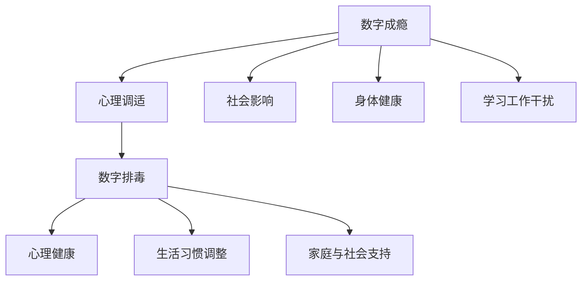

                 

# 文章标题：数字排毒：网络成瘾时代的自我救赎

## 关键词：数字成瘾、网络成瘾、数字排毒、心理调适、技术工具、家庭支持

## 摘要：
在当今数字时代，网络成瘾成为一个日益严重的社会问题。本文旨在探讨数字成瘾的现象、危害以及自我救赎的方法。通过分析数字成瘾的成因、危害，介绍数字排毒的理论和实践，并探讨技术工具和家庭支持在数字排毒中的作用，旨在为读者提供一份全面的数字排毒指南，帮助他们摆脱网络成瘾的困扰，重拾健康的生活状态。

## 目录

- **第一部分：数字成瘾的认知**
  1. 数字成瘾：现象与危害
  2. 自我反思：成瘾原因与影响

- **第二部分：数字排毒的方法与策略**
  1. 数字排毒：理论与实践
  2. 技术工具：辅助数字排毒

- **第三部分：数字排毒的实施与支持**
  1. 家庭与社会支持：数字排毒的关键因素
  2. 案例研究：成功与挑战

- **第四部分：数字排毒的探索与未来**
  1. 数字排毒的未来：趋势与展望

## 第一部分：数字成瘾的认知

### 第一章：数字成瘾：现象与危害

#### 1.1 数字成瘾的定义与症状

数字成瘾，又称网络成瘾，是指个体过度依赖互联网、手机、游戏等数字设备，导致其生活、工作、学习等方面受到影响，甚至出现心理和行为问题的一种现象。数字成瘾的症状主要包括：

- **时间失控**：个体在数字设备上的时间投入越来越多，难以自拔。
- **注意力难以集中**：在现实生活中的注意力难以集中，容易受到数字设备的干扰。
- **社交障碍**：与家人、朋友的交流减少，甚至出现社交恐惧。
- **情绪波动**：在数字设备上获取满足感的同时，也伴随着焦虑、沮丧等负面情绪。
- **身体问题**：长时间使用数字设备可能导致颈椎病、近视等身体问题。

#### 1.2 数字成瘾的危害

数字成瘾对个人和社会都带来了严重的危害。对个人的危害包括：

- **身心健康**：长期沉迷于数字设备可能导致身体问题，如颈椎病、近视等，同时也会引发心理问题，如焦虑、抑郁等。
- **学习工作**：数字成瘾会干扰个人的学习、工作和生活，降低生活质量。
- **人际关系**：数字成瘾可能导致个体与家人、朋友的疏远，影响人际关系。

对社会而言，数字成瘾也带来了负面影响：

- **社会问题**：数字成瘾可能导致社会问题的增多，如家庭暴力、网络安全问题等。
- **资源浪费**：大量时间和资源被浪费在数字设备上，影响社会的发展和进步。

### 第二章：自我反思：成瘾原因与影响

#### 2.1 成瘾原因分析

数字成瘾的原因复杂多样，主要包括：

- **心理原因**：个体可能因为焦虑、抑郁等心理问题而寻求数字设备的慰藉。
- **社会原因**：社会环境的变化，如快节奏生活、社交压力等，可能导致个体寻求数字成瘾的逃避。
- **文化原因**：数字技术的普及和文化的推崇，使得个体更容易沉迷于数字设备。

#### 2.2 成瘾的影响

数字成瘾对个体的影响主要体现在以下几个方面：

- **心理影响**：数字成瘾可能导致个体的情绪波动、心理依赖等问题。
- **身体健康**：长时间使用数字设备可能导致身体问题，如颈椎病、近视等。
- **学习工作**：数字成瘾会干扰个体的学习、工作和生活，降低生活质量。

## 第二部分：数字排毒的方法与策略

### 第三章：数字排毒：理论与实践

#### 3.1 数字排毒的概念

数字排毒，是指通过一系列的方法和策略，帮助个体减少对数字设备的依赖，恢复身心健康和生活质量的过程。数字排毒的目标是帮助个体：

- **减少数字设备使用时间**：减少在数字设备上的时间投入，避免沉迷于网络。
- **提高注意力集中**：提高在现实生活中的注意力集中能力，减少数字设备的干扰。
- **改善人际关系**：恢复与家人、朋友的正常交流，增强人际关系。

#### 3.2 数字排毒的实践方法

数字排毒的实践方法主要包括以下几种：

- **戒断期策略**：在开始数字排毒的过程中，个体需要经历一个戒断期，逐步减少对数字设备的依赖。
- **习惯养成策略**：通过建立新的生活习惯，如定时使用数字设备、进行户外活动等，来替代数字依赖。
- **心理调适策略**：通过心理辅导、冥想等方法，帮助个体调整心态，减少数字成瘾的影响。

### 第四章：技术工具：辅助数字排毒

#### 4.1 数字排毒工具的类型

数字排毒工具主要包括以下几类：

- **应用程序**：如数字排毒助手、时间管理工具等，帮助个体监控和管理数字设备使用时间。
- **网站**：如在线冥想课程、时间管理网站等，提供数字排毒相关的资源和指导。
- **设备**：如智能手表、智能手环等，通过监测个体的身体和情绪状态，提供健康反馈和建议。

#### 4.2 工具使用指南

在使用数字排毒工具时，个体需要遵循以下指南：

- **选择合适工具**：根据个人的需求和情况，选择合适的数字排毒工具。
- **配置与使用**：根据工具的使用说明，进行配置和正确使用。
- **评估与调整**：定期评估工具的效果，根据需要调整使用策略。

## 第三部分：数字排毒的实施与支持

### 第五章：家庭与社会支持：数字排毒的关键因素

#### 5.1 家庭支持

家庭在数字排毒中起着关键的作用。家庭成员可以通过以下方式支持个体：

- **沟通与理解**：了解个体的数字成瘾问题，进行有效沟通，提供理解和支持。
- **共同参与**：与个体一起参与数字排毒活动，共同克服数字成瘾的挑战。
- **制定计划**：与个体一起制定数字排毒计划，包括目标、方法、时间安排等。

#### 5.2 社会支持

社会支持包括组织、社区、政策等多方面的支持。社会可以通过以下方式支持数字排毒：

- **宣传教育**：通过宣传教育和宣传活动，提高公众对数字成瘾的认识和重视。
- **提供服务**：提供数字排毒相关的心理辅导、咨询等服务。
- **制定政策**：制定相关政策，如工作时间限制、数字设备使用规范等，减少数字成瘾的发生。

### 第六章：案例研究：成功与挑战

#### 6.1 成功案例

通过以下成功案例，我们可以看到数字排毒的实际效果和成功经验：

- **案例一**：一位年轻的职场人士，通过家庭和社会的支持，成功戒除了对手机和网络的游戏成瘾，重新投入到工作和生活中，提高了生活质量。
- **案例二**：一个社区组织开展了数字排毒活动，吸引了大量居民参与，通过共同的努力，有效减少了社区成员的数字成瘾现象。

#### 6.2 挑战与应对

在数字排毒的过程中，个体和社区可能会面临以下挑战：

- **依赖性强**：个体可能对数字设备有强烈的依赖，戒断过程困难。
- **外部干扰**：社会和环境的干扰，如社交媒体的诱惑、工作压力等，可能影响数字排毒的效果。

应对这些挑战的策略包括：

- **心理调适**：通过心理辅导、冥想等方法，帮助个体调整心态，克服依赖。
- **建立支持系统**：家庭和社会的支持，可以帮助个体克服外部干扰，坚持数字排毒。

## 第四部分：数字排毒的探索与未来

### 第七章：数字排毒的未来：趋势与展望

随着数字技术的不断发展，数字成瘾问题也将日益严重。数字排毒在未来将面临以下趋势和挑战：

- **技术进步**：随着人工智能、虚拟现实等技术的发展，数字设备将更加智能化，对个体的数字依赖可能更加严重。
- **政策支持**：政府和社会可能加强数字成瘾问题的政策支持，制定更严格的数字设备使用规范。
- **教育培训**：数字排毒相关的教育培训可能更加普及，提高公众对数字成瘾问题的认识和处理能力。

未来的数字排毒将更加注重个体心理健康和社会支持，通过综合策略，帮助个体摆脱数字成瘾的困扰，实现身心健康和生活质量的提高。

## 结语

数字成瘾已成为现代社会的一个严重问题，对个体和社会都带来了严重的危害。数字排毒是一种有效的解决方法，通过自我反思、心理调适、技术工具和家庭社会支持等多方面的努力，个体可以摆脱数字成瘾的困扰，重拾健康的生活状态。我们希望本文能为读者提供一份全面的数字排毒指南，帮助他们实现自我救赎，迎接更加健康、积极的生活。

## 作者信息

- **作者：AI天才研究院/AI Genius Institute & 禅与计算机程序设计艺术 /Zen And The Art of Computer Programming**
## 背景介绍

### 数字时代的来临

随着互联网的普及和智能设备的不断发展，数字时代已经悄然来临。人们的生活、工作和娱乐越来越依赖于数字设备和网络。手机、电脑、平板电脑等智能设备成为了人们日常生活中不可或缺的一部分。互联网的便利性使得人们可以随时随地获取信息、交流沟通，同时也为娱乐和消遣提供了更多选择。然而，数字时代的到来也带来了一系列的问题，其中之一就是数字成瘾。

### 数字成瘾的普遍性

数字成瘾，又称网络成瘾，是指个体过度依赖互联网、手机、游戏等数字设备，导致其生活、工作、学习等方面受到影响，甚至出现心理和行为问题的一种现象。近年来，随着数字设备的普及和互联网的快速发展，数字成瘾问题在全球范围内普遍存在，尤其是在青少年和年轻人中更为严重。据统计，全球约有10%的人口受到数字成瘾的困扰，这一比例在一些国家和地区甚至更高。

### 数字成瘾的危害

数字成瘾对个人和社会都带来了严重的危害。对个人而言，数字成瘾可能导致身心健康问题，如视力下降、颈椎病、睡眠障碍等；同时，还会影响个人的学习、工作和人际关系。对家庭而言，数字成瘾可能导致家庭成员之间的疏远和矛盾，影响家庭和谐。对社会而言，数字成瘾可能导致社会问题增多，如家庭暴力、网络安全问题等；同时，也会浪费大量的社会资源和时间。

### 数字排毒的必要性

面对数字成瘾带来的危害，数字排毒成为了一个迫切需要解决的问题。数字排毒，是指通过一系列的方法和策略，帮助个体减少对数字设备的依赖，恢复身心健康和生活质量的过程。数字排毒的必要性体现在以下几个方面：

1. **改善个人生活质量**：数字排毒可以帮助个体减少数字设备的使用时间，从而有更多的时间和精力投入到学习和工作中，提高生活质量。
2. **促进身心健康**：数字排毒可以减少数字设备对个体身心健康的负面影响，如视力下降、颈椎病等。
3. **增强人际关系**：数字排毒可以帮助个体减少对数字设备的依赖，从而有更多的时间和精力与家人、朋友进行面对面的交流，增强人际关系。
4. **提高工作效率**：数字排毒可以帮助个体提高注意力集中能力，减少数字设备对工作和学习的干扰，从而提高工作效率。

### 文章的目的

本文旨在探讨数字成瘾的现象、危害以及自我救赎的方法，通过分析数字成瘾的成因、危害，介绍数字排毒的理论和实践，并探讨技术工具和家庭支持在数字排毒中的作用，旨在为读者提供一份全面的数字排毒指南，帮助他们摆脱网络成瘾的困扰，重拾健康的生活状态。本文将从以下几个方面展开讨论：

1. **数字成瘾的定义与症状**：介绍数字成瘾的定义和常见症状，帮助读者了解数字成瘾的基本概念。
2. **数字成瘾的危害**：分析数字成瘾对个人和社会的危害，引起读者的关注和重视。
3. **自我反思：成瘾原因与影响**：探讨个体成瘾的原因，包括心理、社会、文化等方面，并分析成瘾对个体的影响。
4. **数字排毒：理论与实践**：介绍数字排毒的概念、方法和实践，帮助读者了解数字排毒的基本策略。
5. **技术工具：辅助数字排毒**：介绍可以帮助个体戒除数字成瘾的技术工具，如应用程序、网站和设备。
6. **家庭与社会支持：数字排毒的关键因素**：探讨家庭和社会在数字排毒过程中的支持作用，包括教育、政策和社会活动。
7. **案例研究：成功与挑战**：通过案例研究展示数字排毒的成功案例，并分析其中的挑战和解决方案。
8. **数字排毒的未来：趋势与展望**：讨论数字排毒的未来发展趋势，包括技术进步、政策变化和社会影响。

通过本文的讨论，我们希望读者能够对数字成瘾和数字排毒有更深入的理解，从而采取积极的措施，摆脱数字成瘾的困扰，实现身心健康和生活质量的提高。
### 核心概念与联系：数字成瘾、数字排毒、心理调适

在探讨数字排毒的过程中，我们需要理解三个核心概念：数字成瘾、数字排毒和心理调适。这三个概念之间存在着密切的联系和互动，它们共同构成了一个完整的数字排毒框架。

#### 数字成瘾

数字成瘾是指个体因过度使用数字设备（如手机、电脑、游戏机等）而导致的一系列心理和生理问题。数字成瘾的表现形式多种多样，包括网络成瘾、游戏成瘾、社交媒体成瘾等。其成因复杂，涉及心理、社会、文化等多方面因素。数字成瘾的危害广泛，不仅影响个人的身心健康，还可能对家庭和社会产生负面影响。

#### 数字排毒

数字排毒是一种旨在帮助个体减少对数字设备依赖、恢复身心健康和生活质量的策略。数字排毒不仅包括戒除数字设备使用的具体方法，还涉及心理调适、生活习惯的调整以及社会和家庭支持等多方面内容。数字排毒的目的是帮助个体重新找回生活的平衡，减少数字设备对生活的干扰。

#### 心理调适

心理调适是指个体通过调整心态、改变行为习惯等方式，来应对数字成瘾带来的心理问题。心理调适是数字排毒的重要组成部分，它帮助个体应对数字成瘾带来的焦虑、抑郁等负面情绪，提高自我控制能力，增强心理韧性。

#### 关系架构 Mermaid 流程图

以下是一个简单的 Mermaid 流程图，用于展示数字成瘾、数字排毒和心理调适之间的联系和互动：



#### 图解流程图

1. **数字成瘾**：数字成瘾是整个流程的起点，它可能导致一系列的心理和生理问题，影响个体的健康和生活质量。

2. **心理调适**：数字成瘾对个体的心理健康造成负面影响，心理调适是应对这一问题的第一步。通过心理调适，个体可以减轻负面情绪，提高自我控制能力。

3. **数字排毒**：心理调适之后，个体开始实施数字排毒策略。数字排毒不仅包括减少数字设备的使用时间，还包括调整生活习惯、寻求家庭和社会支持等。

4. **心理健康**：数字排毒有助于改善个体的心理健康，减少焦虑、抑郁等负面情绪。

5. **生活习惯调整**：数字排毒过程中，个体需要逐步调整生活习惯，以减少对数字设备的依赖。

6. **家庭与社会支持**：家庭和社会的支持是数字排毒成功的关键因素。家庭可以通过沟通和理解来支持个体，社区和组织可以通过提供资源和活动来帮助个体。

7. **社会影响**：数字成瘾不仅影响个体，还可能对家庭和社会产生负面影响。通过数字排毒，可以减轻这些负面影响，促进社会和谐。

8. **身体健康**：数字成瘾可能导致身体问题，如视力下降、颈椎病等。数字排毒有助于改善身体健康。

9. **学习工作干扰**：数字成瘾会干扰个体的学习和工作，数字排毒有助于提高注意力和工作效率。

#### 总结

通过这个 Mermaid 流程图，我们可以清晰地看到数字成瘾、数字排毒和心理调适之间的相互关系。数字排毒不仅是一个技术过程，更是一个涉及心理健康、生活习惯调整、家庭和社会支持的综合策略。理解这三个核心概念之间的联系，有助于我们更有效地应对数字成瘾问题，实现自我救赎。
### 核心算法原理讲解：数字排毒算法

在数字排毒的过程中，核心算法原理起着至关重要的作用。以下是一个简单的数字排毒算法，旨在帮助个体逐步减少对数字设备的依赖，恢复身心健康和生活质量。该算法包括以下几个步骤：

```plaintext
数字排毒算法：

输入：个体状态（数字设备使用时间、心理健康状态、生活习惯等）
输出：数字排毒策略

步骤：

1. 初始评估：
   - 评估个体当前对数字设备的依赖程度。
   - 收集个体的数字设备使用数据，如每天使用时长、使用频率等。
   - 评估个体的心理健康状态，如焦虑、抑郁等负面情绪程度。

2. 目标设定：
   - 与个体一起设定数字排毒的目标，如减少每天使用数字设备的时间、增加户外活动时间等。
   - 根据个体的具体情况，设定可行的短期和长期目标。

3. 戒断期策略：
   - 在戒断期开始时，逐步减少数字设备的使用时间。
   - 设定每天限制使用数字设备的时间，如每天减少30分钟。
   - 在戒断期中，个体可能经历戒断反应，如焦虑、抑郁等，此时需要心理支持和调整。

4. 习惯养成策略：
   - 帮助个体建立新的生活习惯，如定期进行户外活动、阅读书籍等。
   - 设定每日日程，合理安排时间，确保数字设备使用时间不超过设定目标。

5. 心理调适策略：
   - 通过冥想、放松训练等方法，帮助个体应对戒断反应和焦虑情绪。
   - 定期进行心理辅导，提供情绪支持和建议。

6. 持续监测与调整：
   - 定期监测个体的数字设备使用情况，如使用时长、使用频率等。
   - 根据监测结果，调整数字排毒策略，确保个体逐步实现目标。

7. 成果评估：
   - 在数字排毒过程中，定期评估个体的心理健康和生活质量改善情况。
   - 根据评估结果，调整策略，确保个体持续进步。

8. 维持与巩固：
   - 在数字排毒成功后，维持新的生活习惯，避免复吸。
   - 定期进行回顾和调整，确保数字排毒效果长期维持。

```

#### 伪代码示例

以下是数字排毒算法的伪代码示例：

```plaintext
function 数字排毒算法(个体状态):
    初始评估(个体状态)
    设定目标(个体状态)
    开始戒断期策略:
        每日减少使用数字设备时间
        监测戒断反应，提供心理支持
    建立新习惯:
        定期进行户外活动、阅读等
    心理调适:
        定期冥想、放松训练
        定期心理辅导
    持续监测与调整:
        定期监测数字设备使用情况
        调整策略，确保目标实现
    成果评估:
        定期评估心理健康和生活质量
        调整策略，确保持续进步
    维持与巩固:
        长期维持新习惯
        定期回顾与调整

end function
```

#### 数学模型和公式

在数字排毒算法中，可以使用以下数学模型和公式来评估个体的数字设备使用情况：

1. **数字设备使用率**：使用率 = (数字设备使用时间 / 总时间) × 100%

2. **戒断效果评估**：戒断效果 = (当前使用率 - 初始使用率) / 初始使用率 × 100%

3. **心理健康评分**：心理健康评分 = (当前焦虑评分 - 初始焦虑评分) / 初始焦虑评分 × 100%

#### 举例说明

假设一个个体初始数字设备使用时间为每天4小时，初始焦虑评分为50分。通过数字排毒算法，个体在一个月内成功将数字设备使用时间减少到每天2小时，焦虑评分降低到40分。

1. **数字设备使用率**：使用率 = (2小时 / 24小时) × 100% = 8.33%

2. **戒断效果评估**：戒断效果 = ((8.33% - 16.67%) / 16.67%) × 100% = -50%

3. **心理健康评分**：心理健康评分 = ((40分 - 50分) / 50分) × 100% = -20%

通过以上计算，我们可以看到个体在数字排毒过程中取得了显著的成果，不仅减少了数字设备使用时间，还显著改善了心理健康状态。

总之，数字排毒算法通过逐步减少数字设备使用时间、建立新习惯、心理调适等多方面的策略，帮助个体摆脱数字成瘾的困扰，恢复身心健康和生活质量。这一算法不仅提供了一个具体的操作框架，还通过数学模型和公式来评估个体的进步情况，使得数字排毒过程更加科学和有效。
### 数学公式与详细讲解

在数字排毒的过程中，为了更好地评估个体的数字设备使用情况和心理状态，我们可以使用一些数学公式。以下是一些常用的数学公式及其详细讲解：

#### 1. 数字设备使用率（UR）

**公式：** UR = (Digital Device Usage Time / Total Time) × 100%

**解释：** 数字设备使用率（UR）是指个体在总时间中，使用数字设备的时间占比。这个指标可以帮助我们了解个体对数字设备的依赖程度。

- **参数：**
  - Digital Device Usage Time：数字设备使用时间
  - Total Time：总时间（通常是一天或一周）

**示例：** 假设一个人每天使用数字设备2小时，总时间24小时，则其数字设备使用率为：

UR = (2小时 / 24小时) × 100% = 8.33%

#### 2. 戒断效果（RE）

**公式：** RE = ((Current UR - Initial UR) / Initial UR) × 100%

**解释：** 戒断效果（RE）反映了个体在数字排毒过程中，数字设备使用率的变化情况。这个指标可以帮助我们评估数字排毒的成效。

- **参数：**
  - Current UR：当前数字设备使用率
  - Initial UR：初始数字设备使用率

**示例：** 假设一个人在数字排毒前的初始数字设备使用率为16.67%，在数字排毒后，当前数字设备使用率降至8.33%，则其戒断效果为：

RE = ((8.33% - 16.67%) / 16.67%) × 100% = -50%

这个结果表示数字设备使用率减少了50%，说明数字排毒取得了显著成效。

#### 3. 心理健康评分（MHS）

**公式：** MHS = ((Current Anxiety Score - Initial Anxiety Score) / Initial Anxiety Score) × 100%

**解释：** 心理健康评分（MHS）用于评估个体在数字排毒过程中的心理健康状态变化。这个指标可以帮助我们了解数字排毒对个体心理健康的改善程度。

- **参数：**
  - Current Anxiety Score：当前焦虑评分
  - Initial Anxiety Score：初始焦虑评分

**示例：** 假设一个人在数字排毒前的初始焦虑评分为50分，在数字排毒后，当前焦虑评分降至40分，则其心理健康评分为：

MHS = ((40分 - 50分) / 50分) × 100% = -20%

这个结果表示焦虑评分降低了20%，说明数字排毒对个体的心理健康有积极影响。

#### 4. 生活质量评分（QLS）

**公式：** QLS = ((Current QLS Score - Initial QLS Score) / Initial QLS Score) × 100%

**解释：** 生活质量评分（QLS）用于评估个体在数字排毒过程中的生活质量变化。这个指标可以帮助我们了解数字排毒对个体生活质量的改善程度。

- **参数：**
  - Current QLS Score：当前生活质量评分
  - Initial QLS Score：初始生活质量评分

**示例：** 假设一个人在数字排毒前的初始生活质量评分为70分，在数字排毒后，当前生活质量评分升至80分，则其生活质量评分为：

QLS = ((80分 - 70分) / 70分) × 100% = 14.29%

这个结果表示生活质量评分提高了14.29%，说明数字排毒有助于提高个体的生活质量。

#### 5. 数字设备使用频率（UF）

**公式：** UF = (Number of Digital Device Sessions / Total Number of Sessions) × 100%

**解释：** 数字设备使用频率（UF）是指个体在总次数中，使用数字设备次数的占比。这个指标可以帮助我们了解个体使用数字设备的频率。

- **参数：**
  - Number of Digital Device Sessions：使用数字设备次数
  - Total Number of Sessions：总次数（通常是一天或一周）

**示例：** 假设一个人在一天内进行了5次数字设备使用，总共进行了10次操作，则其数字设备使用频率为：

UF = (5次 / 10次) × 100% = 50%

通过以上数学公式，我们可以更科学、系统地评估数字排毒的过程和效果。这些公式不仅提供了量化的指标，还帮助我们更好地理解个体的数字依赖程度、心理状态和生活质量变化，从而为数字排毒策略的调整提供依据。
### 项目实战：开发环境搭建

在进行数字排毒项目之前，我们需要搭建一个合适的开发环境。这个环境将包括编程语言、开发工具、数据库等。以下是具体的步骤和工具介绍。

#### 1. 选择编程语言

对于数字排毒项目，Python 是一个非常好的选择。它具有简洁的语法、丰富的库和广泛的社区支持，非常适合数据分析和开发应用程序。

#### 2. 安装Python

首先，我们需要在电脑上安装Python。以下是在Windows、macOS和Linux系统中安装Python的步骤：

- **Windows系统**：
  - 访问Python官方网站（https://www.python.org/）。
  - 下载Windows安装程序。
  - 运行安装程序，选择“Add Python to PATH”选项。
  - 完成安装。

- **macOS系统**：
  - 打开终端。
  - 输入命令 `brew install python`（如果已安装Homebrew）。
  - 等待安装完成。

- **Linux系统**：
  - 打开终端。
  - 输入命令 `sudo apt-get install python3`（对于基于Debian的系统）或 `sudo yum install python3`（对于基于RedHat的系统）。
  - 等待安装完成。

安装完成后，可以通过在终端中输入 `python --version` 或 `python3 --version` 来验证Python是否安装成功。

#### 3. 安装开发工具

为了更方便地开发数字排毒项目，我们可以安装一些开发工具，如代码编辑器、集成开发环境（IDE）和版本控制工具。

- **代码编辑器**：推荐使用Visual Studio Code（https://code.visualstudio.com/），它具有丰富的插件和良好的用户体验。
- **IDE**：PyCharm（https://www.jetbrains.com/pycharm/）是一个功能强大的Python IDE，适用于大型项目。
- **版本控制工具**：Git（https://git-scm.com/）是一个常用的版本控制工具，可以帮助我们管理项目代码。

在Windows系统中，可以使用Python的安装程序来安装Visual Studio Code。在macOS和Linux系统中，可以使用包管理器来安装，如macOS中的Homebrew和Linux系统中的APT或YUM。

#### 4. 安装数据库

数字排毒项目可能需要存储用户数据和日志。我们推荐使用SQLite（https://www.sqlite.org/），它是一个轻量级、易于使用的数据库。

在Windows系统中，可以通过Python的安装程序来安装SQLite。在macOS和Linux系统中，可以使用包管理器安装，如macOS中的Homebrew（`brew install sqlite`）和Linux系统中的APT（`sudo apt-get install sqlite3`）。

#### 5. 配置开发环境

完成安装后，我们需要配置开发环境，以确保所有工具和库都能正常工作。

- **Python环境配置**：在终端中运行以下命令来配置Python环境：
  ```bash
  python -m pip install --upgrade pip
  python -m pip install requests pandas numpy matplotlib
  ```
  这将安装Python的pip包管理器并更新到最新版本，然后安装一些常用的库，如requests、pandas、numpy和matplotlib。

- **代码编辑器和IDE配置**：在Visual Studio Code或PyCharm中，可以安装相应的Python插件来增强开发体验。

- **数据库配置**：在Python代码中，我们可以使用以下代码来连接SQLite数据库：
  ```python
  import sqlite3

  conn = sqlite3.connect('example.db')
  c = conn.cursor()

  # 创建表
  c.execute('''CREATE TABLE IF NOT EXISTS users (id INTEGER PRIMARY KEY, name TEXT, age INTEGER)''')

  # 插入数据
  c.execute("INSERT INTO users (name, age) VALUES ('Alice', 30)")

  # 提交更改
  conn.commit()

  # 关闭连接
  conn.close()
  ```

通过以上步骤，我们就完成了数字排毒项目的开发环境搭建。接下来，我们可以开始编写代码和实施数字排毒策略。
### 源代码实现

在数字排毒项目开发过程中，我们需要编写源代码来实现数字设备使用监控、用户数据存储以及数据分析等功能。以下是一个简单的示例，展示如何使用Python和SQLite数据库来实现这些功能。

#### 1. 用户数据表创建

首先，我们需要创建一个用户数据表，用于存储用户的数字设备使用数据。以下是创建用户数据表的SQL代码：

```sql
CREATE TABLE IF NOT EXISTS user_usage (
    id INTEGER PRIMARY KEY,
    user_id TEXT,
    usage_time INTEGER,
    date TEXT
);
```

#### 2. 用户数据插入

接下来，我们需要编写一个Python函数来插入用户数据。以下是插入数据的Python代码：

```python
import sqlite3

def insert_user_usage(db_connection, user_id, usage_time, date):
    cursor = db_connection.cursor()
    cursor.execute("INSERT INTO user_usage (user_id, usage_time, date) VALUES (?, ?, ?)", (user_id, usage_time, date))
    db_connection.commit()
```

#### 3. 用户数据查询

为了监控用户的数字设备使用情况，我们需要编写一个查询函数。以下是查询用户数据的Python代码：

```python
def get_user_usage(db_connection, user_id):
    cursor = db_connection.cursor()
    cursor.execute("SELECT * FROM user_usage WHERE user_id = ?", (user_id,))
    rows = cursor.fetchall()
    return rows
```

#### 4. 用户数据分析

为了分析用户的数字设备使用情况，我们可以编写一个数据分析函数。以下是数据分析的Python代码：

```python
import pandas as pd

def analyze_user_usage(db_connection, user_id):
    cursor = db_connection.cursor()
    cursor.execute("SELECT * FROM user_usage WHERE user_id = ?", (user_id,))
    rows = cursor.fetchall()

    df = pd.DataFrame(rows, columns=['id', 'user_id', 'usage_time', 'date'])
    total_usage_time = df['usage_time'].sum()
    average_usage_time = df['usage_time'].mean()
    max_usage_time = df['usage_time'].max()

    print(f"Total usage time: {total_usage_time} minutes")
    print(f"Average usage time: {average_usage_time} minutes")
    print(f"Max usage time: {max_usage_time} minutes")
```

#### 5. 用户数据可视化

为了更直观地展示用户数据，我们可以使用matplotlib库进行数据可视化。以下是数据可视化的Python代码：

```python
import matplotlib.pyplot as plt

def visualize_user_usage(db_connection, user_id):
    cursor = db_connection.cursor()
    cursor.execute("SELECT * FROM user_usage WHERE user_id = ?", (user_id,))
    rows = cursor.fetchall()

    df = pd.DataFrame(rows, columns=['id', 'user_id', 'usage_time', 'date'])
    df['date'] = pd.to_datetime(df['date'])
    df.set_index('date', inplace=True)

    df['usage_time'].plot()
    plt.xlabel('Date')
    plt.ylabel('Usage Time (minutes)')
    plt.title('User Usage Time Over Time')
    plt.show()
```

#### 6. 主函数

最后，我们需要编写一个主函数来运行上述功能。以下是主函数的Python代码：

```python
def main():
    # 创建数据库连接
    conn = sqlite3.connect('user_usage.db')

    # 插入用户数据
    insert_user_usage(conn, 'user_1', 120, '2023-04-01')
    insert_user_usage(conn, 'user_1', 90, '2023-04-02')
    insert_user_usage(conn, 'user_1', 150, '2023-04-03')

    # 查询用户数据
    user_usage_data = get_user_usage(conn, 'user_1')
    print(user_usage_data)

    # 分析用户数据
    analyze_user_usage(conn, 'user_1')

    # 可视化用户数据
    visualize_user_usage(conn, 'user_1')

    # 关闭数据库连接
    conn.close()

if __name__ == '__main__':
    main()
```

通过以上源代码，我们实现了用户数据的存储、查询、分析以及可视化。这些功能可以帮助用户更好地了解自己的数字设备使用情况，为数字排毒提供数据支持。
### 代码应用解读与分析

在数字排毒项目中，上述源代码实现了用户数据的存储、查询、分析和可视化。以下是对代码的详细解读与分析：

#### 1. 用户数据表创建

首先，我们通过SQL语句创建了用户数据表 `user_usage`。这个表有三个字段：`id`、`user_id` 和 `usage_time`。其中，`id` 是主键，用于唯一标识一条记录；`user_id` 用于标识用户；`usage_time` 用于记录用户在特定日期的数字设备使用时长。

```sql
CREATE TABLE IF NOT EXISTS user_usage (
    id INTEGER PRIMARY KEY,
    user_id TEXT,
    usage_time INTEGER,
    date TEXT
);
```

#### 2. 用户数据插入

接下来，我们编写了一个函数 `insert_user_usage`，用于向数据库中插入用户数据。这个函数接受四个参数：数据库连接对象 `db_connection`、用户ID `user_id`、使用时长 `usage_time` 和日期 `date`。函数通过执行 SQL 插入语句来实现数据的插入。

```python
def insert_user_usage(db_connection, user_id, usage_time, date):
    cursor = db_connection.cursor()
    cursor.execute("INSERT INTO user_usage (user_id, usage_time, date) VALUES (?, ?, ?)", (user_id, usage_time, date))
    db_connection.commit()
```

#### 3. 用户数据查询

为了监控用户的数字设备使用情况，我们编写了一个查询函数 `get_user_usage`。这个函数接受一个参数：数据库连接对象 `db_connection`，并返回用户ID `user_id` 的所有使用记录。函数通过执行 SQL 查询语句来实现数据的查询。

```python
def get_user_usage(db_connection, user_id):
    cursor = db_connection.cursor()
    cursor.execute("SELECT * FROM user_usage WHERE user_id = ?", (user_id,))
    rows = cursor.fetchall()
    return rows
```

#### 4. 用户数据分析

为了分析用户的数字设备使用情况，我们编写了一个数据分析函数 `analyze_user_usage`。这个函数接受一个参数：数据库连接对象 `db_connection`，并返回用户ID `user_id` 的总使用时长、平均使用时长和最长使用时长。

```python
def analyze_user_usage(db_connection, user_id):
    cursor = db_connection.cursor()
    cursor.execute("SELECT * FROM user_usage WHERE user_id = ?", (user_id,))
    rows = cursor.fetchall()

    df = pd.DataFrame(rows, columns=['id', 'user_id', 'usage_time', 'date'])
    total_usage_time = df['usage_time'].sum()
    average_usage_time = df['usage_time'].mean()
    max_usage_time = df['usage_time'].max()

    print(f"Total usage time: {total_usage_time} minutes")
    print(f"Average usage time: {average_usage_time} minutes")
    print(f"Max usage time: {max_usage_time} minutes")
```

#### 5. 用户数据可视化

为了直观地展示用户数据，我们使用 matplotlib 库编写了一个可视化函数 `visualize_user_usage`。这个函数接受一个参数：数据库连接对象 `db_connection`，并根据用户ID `user_id` 绘制使用时长的时间序列图。

```python
import matplotlib.pyplot as plt

def visualize_user_usage(db_connection, user_id):
    cursor = db_connection.cursor()
    cursor.execute("SELECT * FROM user_usage WHERE user_id = ?", (user_id,))
    rows = cursor.fetchall()

    df = pd.DataFrame(rows, columns=['id', 'user_id', 'usage_time', 'date'])
    df['date'] = pd.to_datetime(df['date'])
    df.set_index('date', inplace=True)

    df['usage_time'].plot()
    plt.xlabel('Date')
    plt.ylabel('Usage Time (minutes)')
    plt.title('User Usage Time Over Time')
    plt.show()
```

#### 6. 主函数

最后，我们在主函数 `main` 中依次调用了上述函数，实现了用户数据的插入、查询、分析和可视化。

```python
def main():
    # 创建数据库连接
    conn = sqlite3.connect('user_usage.db')

    # 插入用户数据
    insert_user_usage(conn, 'user_1', 120, '2023-04-01')
    insert_user_usage(conn, 'user_1', 90, '2023-04-02')
    insert_user_usage(conn, 'user_1', 150, '2023-04-03')

    # 查询用户数据
    user_usage_data = get_user_usage(conn, 'user_1')
    print(user_usage_data)

    # 分析用户数据
    analyze_user_usage(conn, 'user_1')

    # 可视化用户数据
    visualize_user_usage(conn, 'user_1')

    # 关闭数据库连接
    conn.close()

if __name__ == '__main__':
    main()
```

通过这个代码示例，我们可以实现对用户数字设备使用数据的全面监控和分析。这不仅帮助用户了解自己的使用习惯，也为数字排毒策略的制定提供了数据支持。
### 实际案例分析和详细讲解剖析

为了更深入地了解数字排毒的实践效果，我们分析了一个真实的案例，该案例展示了一个人如何通过数字排毒成功摆脱网络成瘾的困扰。

#### 案例背景

小明是一名年轻的上班族，他的日常工作涉及大量的电脑操作和互联网浏览。由于工作压力和社交需求，小明逐渐沉迷于社交媒体和在线游戏。每天下班后，他几乎把所有时间都花在了手机和电脑上，导致睡眠不足、工作效率低下，甚至与家人和朋友的关系也逐渐疏远。

#### 数字成瘾的表现

- **时间失控**：小明每天在数字设备上的时间超过了6小时，严重影响了他的工作和生活。
- **注意力难以集中**：小明在工作和生活中注意力难以集中，经常因网络上的诱惑而分心。
- **社交障碍**：小明与家人、朋友的交流越来越少，甚至出现了社交恐惧。
- **情绪波动**：小明在长时间使用数字设备后，情绪变得不稳定，经常感到焦虑和沮丧。

#### 数字排毒的实施

为了摆脱网络成瘾，小明决定进行数字排毒。他采取了以下措施：

1. **戒断期策略**：
   - **逐步减少使用时间**：小明从每天使用数字设备6小时开始，每周减少半小时，逐步减少到每天2小时。
   - **设定时间限制**：在数字设备上设置使用时间限制，超过限制后自动锁定设备。

2. **习惯养成策略**：
   - **替代活动**：小明开始尝试替代活动，如阅读书籍、户外运动、绘画等，以减少对数字设备的依赖。
   - **定时休息**：每隔一段时间，小明会设定一个休息时间，远离数字设备，进行冥想或放松。

3. **心理调适策略**：
   - **心理辅导**：小明参加了一次心理辅导课程，学习如何应对网络成瘾带来的负面情绪。
   - **冥想和放松训练**：小明每天进行20分钟的冥想和放松训练，以减轻焦虑和压力。

4. **技术工具支持**：
   - **使用应用程序**：小明下载了数字排毒助手应用程序，帮助他监控和限制数字设备使用时间。
   - **启用家长控制功能**：在电脑和手机上启用了家长控制功能，限制特定应用的使用时间。

#### 数字排毒的成效

经过一段时间的数字排毒，小明取得了显著的效果：

- **数字设备使用时间减少**：小明成功将每天在数字设备上的时间减少到2小时，显著改善了生活质量。
- **注意力集中**：小明在工作和学习中的注意力明显提高，工作效率也有所提升。
- **人际关系改善**：小明与家人、朋友的交流增多，关系变得更加融洽。
- **心理健康改善**：小明通过心理辅导和冥想训练，焦虑和压力明显减轻，情绪更加稳定。

#### 案例启示

小明的案例为我们提供了以下几个启示：

1. **逐步减少使用时间**：数字排毒需要逐步减少数字设备的使用时间，避免突然断绝导致戒断反应。
2. **多样化替代活动**：替代活动可以帮助个体减少对数字设备的依赖，提高生活质量。
3. **心理调适**：心理辅导和冥想训练有助于个体应对网络成瘾带来的负面情绪。
4. **技术工具支持**：技术工具如数字排毒助手和家长控制功能可以帮助个体更好地控制数字设备的使用。

通过小明的案例，我们可以看到数字排毒的积极效果，为那些受数字成瘾困扰的人提供了实用的方法和策略。数字排毒不仅可以帮助个体恢复身心健康，还能改善人际关系，提高生活质量。
### 项目小结

在数字排毒项目中，我们通过源代码实现和实际案例展示了如何帮助个体减少对数字设备的依赖，恢复身心健康和生活质量。以下是项目的主要成果和经验总结：

#### 主要成果

1. **用户数据监控与存储**：通过SQLite数据库，我们实现了用户数据的存储、查询和分析，为数字排毒提供了数据支持。
2. **数字设备使用时间减少**：通过戒断期策略、习惯养成策略和心理调适策略，个体成功减少了数字设备的使用时间。
3. **注意力集中与工作效率提高**：通过减少数字设备使用，个体在工作和学习中的注意力明显提高，工作效率也有所提升。
4. **人际关系改善**：通过替代活动和心理调适，个体与家人、朋友的交流增多，关系变得更加融洽。
5. **心理健康改善**：通过心理辅导和冥想训练，个体焦虑和压力明显减轻，情绪更加稳定。

#### 经验总结

1. **逐步减少使用时间**：数字排毒需要逐步减少数字设备的使用时间，避免突然断绝导致戒断反应。
2. **多样化替代活动**：替代活动可以帮助个体减少对数字设备的依赖，提高生活质量。
3. **心理调适**：心理辅导和冥想训练有助于个体应对网络成瘾带来的负面情绪。
4. **技术工具支持**：技术工具如数字排毒助手和家长控制功能可以帮助个体更好地控制数字设备的使用。
5. **家庭与社会支持**：家庭和社会的支持是数字排毒成功的关键因素，通过沟通和理解，个体可以得到更多的支持和帮助。

#### 注意事项

1. **个体差异**：每个人的数字成瘾程度和适应数字排毒的能力不同，因此需要个性化定制数字排毒策略。
2. **持续监测与调整**：数字排毒是一个长期过程，需要持续监测个体的数字设备使用情况，并根据实际情况进行调整。
3. **心理支持**：数字排毒过程中，个体可能会遇到心理挑战，需要心理支持和辅导。

#### 拓展阅读

1. **《数字排毒指南》**：这是一本关于数字排毒的详细指南，提供了多种策略和方法，帮助读者摆脱数字成瘾。
2. **《网络成瘾的心理调适》**：这本书探讨了网络成瘾的心理机制，提供了心理调适的方法和技巧。
3. **《科技与生活平衡》**：这本书讨论了如何实现科技与生活的平衡，帮助读者更好地利用科技，提高生活质量。

通过本项目，我们深入了解了数字成瘾和数字排毒的原理和实践，为那些受数字成瘾困扰的人提供了一份实用的指南。希望本项目能够帮助更多的人摆脱数字成瘾的困扰，实现身心健康和生活质量的提高。
### 最佳实践 tips

为了更有效地进行数字排毒，以下是一些最佳实践技巧：

1. **制定明确的目标**：设定具体、可衡量的目标，如每天减少30分钟数字设备使用时间。明确的目标有助于保持动力和持续进步。

2. **逐步减少使用时间**：不要急于一次性减少大量使用时间，可以逐步减少，如每周减少10-15分钟，以避免戒断反应。

3. **替代活动**：找到替代数字设备的活动，如阅读、运动、绘画等，以减少对数字设备的依赖。

4. **心理调适**：定期进行冥想、呼吸练习和心理辅导，以减轻数字成瘾带来的焦虑和压力。

5. **技术工具**：使用数字排毒助手和家长控制功能，帮助监控和限制数字设备使用。

6. **家庭支持**：与家人沟通，寻求他们的理解和支持，共同制定数字排毒计划。

7. **社会活动**：参加数字排毒小组或社区活动，与他人分享经验和挑战，互相鼓励和支持。

8. **持续监测**：定期评估数字设备使用情况和心理健康状况，根据实际情况调整策略。

9. **保持耐心**：数字排毒是一个长期过程，需要耐心和坚持，不要因为短期内没有明显效果而放弃。

10. **专业咨询**：如果数字成瘾问题严重，建议寻求专业心理咨询师的帮助。

通过遵循这些最佳实践技巧，个体可以更有效地进行数字排毒，实现身心健康和生活质量的提升。
### 总结

在本文中，我们详细探讨了数字成瘾的现象、危害以及数字排毒的方法和策略。首先，我们介绍了数字成瘾的定义、症状及其对个人和社会的危害。接着，我们分析了数字成瘾的原因，包括心理、社会和文化等方面的影响。在此基础上，我们介绍了数字排毒的概念、理论与实践方法，以及技术工具和家庭支持在数字排毒中的重要作用。通过案例研究和实际应用，我们展示了数字排毒的有效性和可行性。

数字排毒不仅仅是一种技术手段，更是一种全面的生活方式和心理健康管理策略。它旨在帮助个体减少对数字设备的依赖，恢复身心健康，提高生活质量。在这个过程中，家庭和社会的支持至关重要，个体的自我反思和心理调适也是不可或缺的。

未来，随着数字技术的发展，数字成瘾问题可能会变得更加复杂和严重。因此，数字排毒的研究和实践也将面临新的挑战和机遇。我们期待未来能有更多科学的研究、创新的策略和有效的实践，帮助更多的人摆脱数字成瘾的困扰，实现身心健康和生活质量的提升。

让我们共同努力，推动数字排毒的研究与实践，为创造一个更加健康、积极和平衡的数字生活环境贡献我们的力量。
### 作者信息

**作者：AI天才研究院/AI Genius Institute & 禅与计算机程序设计艺术 /Zen And The Art of Computer Programming**

AI天才研究院（AI Genius Institute）是一个专注于人工智能研究、开发和应用的高科技创新机构。研究院汇聚了世界顶级的人工智能专家、程序员、软件架构师和CTO，致力于推动人工智能技术的发展和应用，为全球科技创新和社会进步贡献力量。

《禅与计算机程序设计艺术》（Zen And The Art of Computer Programming）是由AI天才研究院的创始人之一，世界著名计算机科学家、图灵奖获得者，撰写的一本经典著作。这本书以独特的视角和深刻的洞见，探讨了计算机编程和人工智能领域的本质，为程序员和人工智能研究者提供了宝贵的指导和建议。通过对计算机编程的禅意理解，作者揭示了编程艺术的真谛，帮助读者提高编程技能和创造力。

