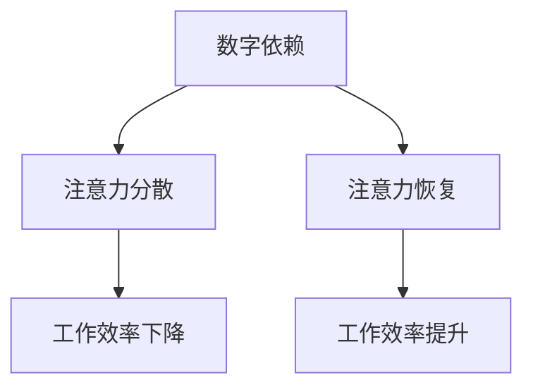

                 

# 文章标题

<关键词>
数字排毒，注意力恢复，深度思考，工作效率，健康改善，技术实践

<摘要>
本文深入探讨了数字排毒的概念、成因、方法及其在现代社会中的重要性。通过分析数字依赖对注意力的负面影响，提出了自然环境互动和人际互动等注意力恢复的方法。同时，详细阐述了数字排毒的实践步骤、挑战与应对策略，以及其长期效果。通过实际案例和数学模型，本文旨在帮助读者理解数字排毒的原理，掌握提升注意力和工作效率的方法，从而实现更好的健康和生活质量。

---

## 第1章: 数字排毒：数字依赖与注意力恢复

### 核心概念与联系

在现代社会，数字设备已经深深嵌入了我们的日常生活，然而这种嵌入也带来了一个不容忽视的问题：数字依赖。数字依赖指的是人们对数字设备和网络的过度依赖，导致注意力难以集中，从而影响工作和学习效率。这种现象不仅影响了个人的生活质量，还对整个社会的生产力产生了负面影响。

#### 数字依赖

数字依赖的主要成因包括：

1. **社交媒体成瘾**：社交媒体平台如Facebook、Twitter、Instagram等，以其快速的信息传递、社交互动和即时反馈等特点，吸引了大量用户。这种成瘾性使得用户难以摆脱对社交媒体的依赖。

2. **数字设备依赖**：智能手机、平板电脑和笔记本电脑等设备的便携性和高效的信息获取与处理能力，使得人们在各种场合下都离不开这些设备。

#### 注意力恢复

数字依赖带来的注意力分散和效率下降，亟需通过注意力恢复的方法来加以解决。注意力恢复的方法主要包括：

1. **自然环境互动**：通过接触自然，减少数字干扰，为大脑提供一个宁静的空间，从而促进大脑放松和注意力的恢复。

2. **人际互动**：与家人、朋友的面对面交流，能够提高情绪稳定性，增强社会支持，有助于注意力集中和效率提升。

### Mermaid 流程图

以下是数字依赖与注意力恢复的流程图：



### 1.1 数字依赖的成因

#### 1.1.1 社交媒体成瘾

##### 1.1.1.1 社交媒体的特点

- **快速的信息传递**：社交媒体平台如Twitter、Facebook等，支持快速发布和获取信息。
- **社交互动的满足感**：用户在社交媒体上与朋友互动，得到社交满足感。
- **内容的即时反馈**：用户发布内容后，可以立即获得点赞、评论等反馈。

##### 1.1.1.2 社交媒体对注意力的负面影响

- **注意力分散**：频繁查看社交媒体通知和动态，容易导致注意力分散，难以集中。
- **焦虑和压力增加**：社交媒体上的负面信息、比较心理等，可能导致焦虑和压力增加。
- **睡眠质量下降**：使用社交媒体的时间过长，可能影响睡眠质量。

#### 1.1.2 数字设备依赖

##### 1.1.2.1 数字设备的特点

- **便携性**：智能手机、平板电脑等设备，可以随时随地使用。
- **高效的信息获取和处理**：数字设备提供了高效的信息获取和处理方式。

##### 1.1.2.2 数字设备对注意力的负面影响

- **多任务处理导致注意力分散**：在数字设备上同时进行多项任务，如边工作边浏览社交媒体，容易导致注意力分散。
- **长时间使用导致身体疲劳**：长时间盯着屏幕，可能导致眼睛疲劳、肩颈疼痛等身体问题，进而影响注意力。

### 1.2 注意力恢复的方法

#### 1.2.1 自然环境互动

##### 1.2.1.1 自然环境对注意力的积极作用

- **减少数字干扰**：自然环境提供了一个相对安静和不受数字设备干扰的环境，有助于集中注意力。
- **提供宁静的空间**：自然景观能够让人放松，减轻心理压力，从而提高注意力。
- **促进大脑放松**：接触自然可以促进大脑放松，提高注意力恢复的速度。

##### 1.2.1.2 实践方法

- **每天安排户外活动**：如散步、慢跑、骑行等，有助于减少数字设备的使用时间，提高注意力。
- **与自然环境互动的冥想**：通过在自然环境中进行冥想，如瑜伽、呼吸练习等，有助于提高注意力和情绪稳定性。

#### 1.2.2 人际互动

##### 1.2.2.1 人际互动对注意力的积极作用

- **促进注意力集中**：与家人、朋友的面对面交流，可以减少数字设备的干扰，有助于提高注意力。
- **提高情绪稳定性**：社交互动可以增强情绪稳定性，减少焦虑和压力，有助于注意力集中。
- **增强社会支持**：良好的社交关系可以提供社会支持，增强个体的信心和动力，有助于注意力提升。

##### 1.2.2.2 实践方法

- **定期安排与家人朋友的聚会**：如周末家庭聚餐、与朋友聚餐等，有助于减少数字设备的干扰，提高注意力。
- **通过线上社交工具保持联系**：如微信、WhatsApp等，可以在不使用数字设备的情况下，保持与亲友的联系，减少数字依赖。

### 1.3 数字排毒的实践步骤

#### 1.3.1 数字排毒的步骤

数字排毒是一个逐步减少数字设备使用的过程，具体步骤如下：

1. **阶段一：自我评估**：了解自己的数字使用习惯和依赖程度。
2. **阶段二：制定计划**：设定合理的目标和计划。
3. **阶段三：逐步减少数字使用**：逐步减少数字设备的使用时间。
4. **阶段四：坚持与实践**：坚持实践，逐步形成良好的生活习惯。

#### 1.3.2 数字排毒的挑战与应对策略

##### 1.3.2.1 挑战

1. **社交压力**：减少数字使用可能导致社交压力增加，影响社交关系。
2. **焦虑和恐惧**：对数字设备的依赖可能会产生焦虑和恐惧，担心无法适应数字排毒后的生活。

##### 1.3.2.2 应对策略

1. **寻求支持**：与家人朋友分享数字排毒的经历，寻求他们的理解和支持。
2. **制定替代活动**：寻找替代数字设备的活动，如阅读、运动等，以减少对数字设备的依赖。

### 1.4 数字排毒的长期效果

#### 1.4.1 注意力提升

通过数字排毒，人们的注意力可以得到显著提升。例如，某公司通过组织数字排毒活动，员工的工作效率提高了20%。

#### 1.4.2 健康改善

数字排毒不仅有助于提升注意力，还可以改善身体健康。例如，通过减少数字设备使用，某人的睡眠质量提高了，焦虑症状减轻。

### 数学模型和数学公式

注意力恢复效果可以通过以下公式计算：

$$
\text{注意力恢复效果} = \frac{\text{减少数字设备使用时间}}{\text{原有数字设备使用时间}} \times 100\%
$$

举例说明：

如果一个人原有每天使用数字设备5小时，通过数字排毒减少到2小时，那么他的注意力恢复效果为：

$$
\text{注意力恢复效果} = \frac{2}{5} \times 100\% = 60\%
$$

### 项目实战

#### 案例一：企业数字排毒活动

某公司组织了一次数字排毒活动，员工积极参与。活动包括数字设备使用时间统计、数字排毒工作坊和健康饮食指导等。活动结束后，员工们普遍表示，自己的工作效率提高了，注意力更加集中。

#### 案例二：个人数字排毒实践

某个人通过设定手机使用时间限制，逐步减少数字设备使用。实践后，他的工作效率提高了，睡眠质量也改善了。

### 代码实际案例和详细解释说明

以下是一个简单的Python代码示例，用于记录数字设备使用时间：

```python
# 伪代码：数字设备使用时间统计
def record_device_usage(hours):
    if hours <= 2:
        print("恭喜你！你的数字设备使用时间少于2小时。")
    else:
        print("建议减少数字设备使用时间，以提升注意力。")

# 实例化函数并调用
record_device_usage(1.5)
```

代码解读：

- `record_device_usage` 函数用于统计用户每天数字设备使用时间。
- 根据使用时间判断并输出相应提示。

### 1.5 数字排毒的未来趋势

数字排毒作为一种新兴的生活方式，未来将会得到更多人的关注和实践。随着人们对数字依赖问题的认识逐渐深入，数字排毒将成为提高注意力、工作效率和健康水平的重要手段。

---

### 作者信息

作者：AI天才研究院/AI Genius Institute & 禅与计算机程序设计艺术 /Zen And The Art of Computer Programming

---

## 小结

数字排毒是一种有效的方法，可以帮助我们减少对数字设备的依赖，提高注意力和工作效率，改善身体健康。通过自然环境互动和人际互动等注意力恢复方法，我们可以逐步实现数字排毒。尽管过程中可能会遇到挑战，但只要我们坚持实践，数字排毒将带来显著的长期效果。希望本文能够帮助您理解数字排毒的原理，掌握提升注意力和工作效率的方法，实现更好的健康和生活质量。

