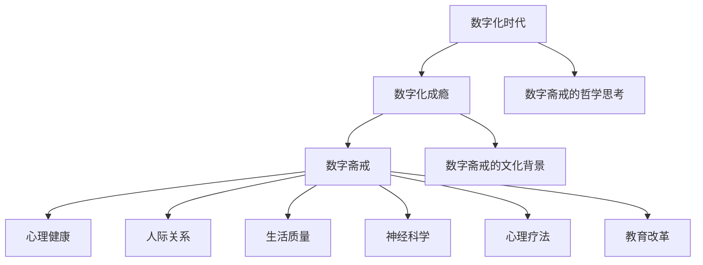

                 

# 文章标题：数字斋戒营：周期性断网的生活哲学探索

> 关键词：数字斋戒、周期性断网、生活哲学、数字化成瘾、心理健康、神经科学、教育改革

> 摘要：本文探讨了数字化时代下数字斋戒的兴起及其对个人生活和社会的影响。通过分析数字化成瘾的现象、数字斋戒的理论基础和实践方法，本文旨在揭示周期性断网对提升心理健康、促进人际交往、增强自我成长等方面的积极作用，并提出数字斋戒在未来的推广和应用前景。

### 引言：数字化生活的双重面相

在当今这个信息爆炸的时代，数字化已经成为我们生活中不可或缺的一部分。智能手机、互联网、社交媒体等数字工具的普及，使得人们可以随时随地获取信息、沟通、娱乐和购物。然而，数字化的便利性同时也带来了新的挑战——数字化成瘾。越来越多的人发现自己无法摆脱对手机、电脑等数字设备的依赖，这种成瘾现象不仅影响了个人的心理健康，也对社会和谐产生了负面影响。

数字化成瘾（Digital Addiction）是指个体由于过度使用互联网、智能手机、社交媒体等数字工具而出现的一种心理和行为上的依赖。这种现象在青少年和年轻人中尤为突出，他们往往沉迷于网络游戏、社交媒体和视频观看，导致学业、工作和人际关系的失衡。研究表明，数字化成瘾与焦虑、抑郁等心理问题密切相关，同时也可能导致睡眠障碍、社交退缩和注意力不集中等问题。

### 数字斋戒的起源与意义

数字斋戒（Digital Detox）是一种通过周期性地断网、减少数字工具使用来恢复身心健康和生活质量的实践。数字斋戒的起源可以追溯到古代僧侣和修行者的传统，他们在特定的时期内放弃使用数字设备，专注于精神修炼和心灵成长。近年来，随着数字化成瘾问题的日益严重，数字斋戒逐渐在西方世界流行起来，成为一种新兴的健康生活方式。

数字斋戒的意义主要体现在以下几个方面：

1. **心理健康提升**：数字斋戒有助于减少数字化成瘾所带来的心理压力和焦虑，提高心理健康水平。通过减少对数字工具的依赖，个体可以更好地控制自己的情绪和行为，增强心理韧性。

2. **人际关系改善**：数字斋戒使得个体有更多时间和精力与家人、朋友进行面对面的交流和互动，促进人际关系的改善。减少对数字工具的依赖，个体可以更加专注于当下，提高沟通质量和关系稳定性。

3. **自我成长促进**：数字斋戒为个体提供了一个重新审视自己和生活方式的机会。在断网期间，个体可以更加专注于自我反思、阅读、运动、冥想等有益身心健康的活动，促进个人成长和自我实现。

4. **社会和谐建设**：数字斋戒不仅有助于个体身心健康，也对社会的和谐与进步产生积极影响。减少数字化成瘾现象，可以降低心理问题的发生率，提高社会整体幸福感。此外，数字斋戒还可以作为一种社会运动，促进公众对数字化生活方式的反思和改进。

### 书籍结构与内容概述

本书旨在深入探讨数字斋戒的哲学思考、实践方法、科学依据及其对个人生活和社会的广泛影响。全书共分为八个章节，结构如下：

- **第1章 引言：数字化生活的双重面相**：介绍数字化生活的现状、数字化成瘾现象以及数字斋戒的起源和意义。

- **第2章 数字化生存的哲学思考**：分析数字化与人类心理、数字化与生活质量的辩证关系，探讨数字斋戒的理论基础。

- **第3章 数字斋戒实践：生活方式的改变**：详细阐述数字斋戒的方法与步骤，分析数字斋戒对日常生活的具体影响及其长期益处。

- **第4章 数字斋戒的科学依据**：探讨数字化成瘾的科学解释、数字斋戒的生理与心理效应以及数字斋戒与神经科学的关系。

- **第5章 数字斋戒与心理疗法**：介绍数字斋戒在心理健康领域的应用，分析数字斋戒与冥想的关系以及社会支持在数字斋戒中的作用。

- **第6章 数字斋戒的教育意义**：探讨数字斋戒与教育改革、数字斋戒对青少年成长的影响以及数字斋戒在家庭教育中的应用。

- **第7章 数字斋戒的未来展望**：分析数字化社会的趋势与挑战，探讨数字斋戒的推广与普及前景及其对社会和谐的作用。

- **第8章 结论：回归生活本质**：总结数字斋戒的核心价值、实践经验，提出未来的探索与挑战。

本书旨在为读者提供一个全面、系统的数字斋戒指南，帮助读者理解和实践数字斋戒，提升身心健康，回归生活本质。通过本书的阅读和实践，读者可以更好地应对数字化时代的挑战，实现个人成长和社会进步。

### 设计数字斋戒营：周期性断网的生活哲学探索》目录大纲

为了确保文章内容丰富、结构紧凑且逻辑清晰，我将详细阐述《数字斋戒营：周期性断网的生活哲学探索》的目录大纲。以下是具体章节的详细内容概述和预期撰写内容：

## 第1章 引言：数字化生活的双重面相

### 1.1 数字时代的崛起

在本节中，我们将探讨数字化时代的发展历程，从互联网的兴起、移动通信的普及到社交媒体的繁荣。通过历史背景的介绍，分析数字化带来的巨大变革，包括信息获取的便利、工作效率的提升以及社交方式的改变。同时，我们还将讨论数字化带来的双重影响：一方面，它极大地提高了人们的生活质量和工作效率；另一方面，它也引发了诸如数字化成瘾、隐私泄露和社会疏离等问题。

### 1.2 数字化成瘾现象

这一节将深入探讨数字化成瘾的定义、成因及其影响。数字化成瘾是一种由于过度使用数字设备而产生的心理和行为依赖，常见的症状包括注意力难以集中、焦虑、抑郁、失眠等。我们将分析数字化成瘾的成因，如社交媒体的算法设计、游戏的奖励机制以及个人心理状态等。此外，还会介绍一些典型的数字化成瘾案例，以帮助读者更好地理解这一现象。

### 1.3 数字斋戒的起源与意义

本节将介绍数字斋戒的起源，从古代僧侣的修行传统到现代社会的健康运动。我们将讨论数字斋戒的定义、目的及其对个人和社会的积极影响。数字斋戒不仅是一种身体上的断网，更是一种精神上的修养，它可以帮助个体重建与自然和内心的联系，提升生活质量。

### 1.4 书籍结构与内容概述

在这一节中，我们将概述本书的结构和内容，包括每个章节的主要讨论话题和预期收获。这将帮助读者对全文有一个宏观的了解，明确阅读目标。

## 第2章 数字化生存的哲学思考

### 2.1 数字化与人类心理

这一节将探讨数字化对人类心理的影响，包括对注意力的分散、对情绪的波动以及对认知功能的影响。我们将介绍一些心理学理论和研究成果，分析数字化环境如何改变人类的思考方式和行为模式。此外，还会讨论如何通过数字斋戒来调节心理状态，提升心理健康水平。

### 2.2 数字化与生活质量的辩证关系

在本节中，我们将深入探讨数字化对生活质量的提升和负面影响。一方面，数字化工具可以提高工作效率、丰富娱乐方式、促进社交交流等；另一方面，过度使用数字设备可能导致成瘾、焦虑、孤独等问题。我们将通过实际案例和数据分析，揭示数字化与生活质量之间的辩证关系。

### 2.3 数字斋戒的理论基础

这一节将详细阐述数字斋戒的理论基础，包括其哲学思想、历史渊源和文化背景。我们将介绍数字斋戒的核心原则，如减少依赖、回归自然、自我反省等，并探讨这些原则在数字化时代的重要性。

## 第3章 数字斋戒实践：生活方式的改变

### 3.1 数字斋戒的方法与步骤

这一节将详细介绍数字斋戒的方法和步骤，包括斋戒前的准备、斋戒过程中的实践要点以及斋戒后的恢复。我们将提供一份详细的数字斋戒指南，帮助读者安全有效地进行斋戒。

### 3.2 数字斋戒对日常生活的具体影响

本节将探讨数字斋戒对日常生活各个方面的影响，如工作、学习、娱乐、社交等。我们将通过实际案例和数据分析，展示数字斋戒如何帮助个体重新审视和优化生活方式，提升生活质量。

### 3.3 数字斋戒的长期益处

这一节将讨论数字斋戒的长期益处，包括心理健康提升、人际关系改善、自我成长促进等。我们将通过长期跟踪研究和用户反馈，分析数字斋戒对个人成长的积极影响，并探讨其可持续性。

## 第4章 数字斋戒的科学依据

### 4.1 数字化成瘾的科学解释

在本节中，我们将从神经科学的角度解释数字化成瘾的机制，包括大脑中的奖励系统、多巴胺的分泌等。我们将介绍一些前沿研究成果，探讨如何通过科学方法来理解和应对数字化成瘾。

### 4.2 数字斋戒的生理与心理效应

这一节将探讨数字斋戒对个体生理和心理的积极效应，如改善睡眠质量、减少焦虑和抑郁症状、提升注意力等。我们将通过实验数据和用户反馈，展示数字斋戒如何改善生理和心理状态。

### 4.3 数字斋戒与神经科学

本节将深入探讨数字斋戒与神经科学的关系，分析数字斋戒如何影响大脑结构和功能。我们将介绍一些前沿研究，探讨数字斋戒对大脑可塑性的影响，以及如何通过数字斋戒来提升认知功能。

## 第5章 数字斋戒与心理疗法

### 5.1 数字斋戒与心理健康

这一节将探讨数字斋戒在心理健康领域的应用，包括如何通过数字斋戒来减轻焦虑、抑郁症状，提升心理健康水平。我们将介绍一些心理疗法，如认知行为疗法、冥想疗法等，并结合数字斋戒的实际案例进行分析。

### 5.2 数字斋戒与冥想

本节将探讨数字斋戒与冥想的关系，分析冥想如何帮助个体在数字斋戒期间更好地调节心理状态，提升冥想效果。我们将介绍一些冥想技巧，并结合实际案例，探讨如何将冥想融入数字斋戒实践。

### 5.3 数字斋戒与社会支持

这一节将探讨数字斋戒在社会支持中的作用，包括家庭、社区、专业机构等在数字斋戒实践中的支持和作用。我们将介绍一些数字斋戒社群的案例，分析如何通过社会支持来提升数字斋戒的效果。

## 第6章 数字斋戒的教育意义

### 6.1 数字斋戒与教育改革

这一节将探讨数字斋戒在教育改革中的应用，分析数字化教育中的问题，如数字化成瘾、注意力分散等。我们将提出数字斋戒在教育改革中的潜在作用，探讨如何通过数字斋戒来提升教育质量和学生心理健康。

### 6.2 数字斋戒与青少年成长

本节将探讨数字斋戒对青少年成长的影响，分析青少年数字化成瘾现象及其对学习和生活的影响。我们将介绍一些数字斋戒实践案例，探讨如何通过数字斋戒来帮助青少年更好地成长。

### 6.3 数字斋戒与家庭教育

这一节将探讨数字斋戒在家庭教育中的应用，分析家庭教育中数字化的挑战，如家长过度依赖数字设备、亲子关系疏远等。我们将提出数字斋戒在家庭教育中的实施策略，探讨如何通过数字斋戒来改善家庭氛围和亲子关系。

## 第7章 数字斋戒的未来展望

### 7.1 数字化社会的趋势与挑战

这一节将分析数字化社会的趋势，如人工智能、大数据、物联网等技术的发展。同时，我们将探讨数字化社会面临的挑战，如隐私保护、数据安全、社会公平等。我们将结合数字斋戒的理念，探讨如何应对这些挑战。

### 7.2 数字斋戒的推广与普及

本节将探讨数字斋戒的推广与普及策略，分析数字斋戒在现代社会中的推广难点和机遇。我们将介绍一些推广数字斋戒的成功案例，探讨如何通过教育、政策、媒体等途径来推动数字斋戒的普及。

### 7.3 数字斋戒与社会和谐

这一节将探讨数字斋戒对社会和谐的作用，分析数字斋戒如何促进社会公平、减少社会分裂。我们将结合实际案例，探讨数字斋戒在构建和谐社会中的潜在作用。

## 第8章 结论：回归生活本质

### 8.1 数字斋戒的总结与反思

这一节将总结数字斋戒的核心价值和实践经验，反思数字斋戒在个人生活和社会中的意义。我们将讨论数字斋戒的优点和局限性，提出未来改进和发展的方向。

### 8.2 数字斋戒的愿景与使命

本节将阐述数字斋戒的愿景和使命，探讨数字斋戒在未来社会中的角色和责任。我们将提出数字斋戒的发展目标，包括促进心理健康、提升生活质量、推动社会和谐等。

### 8.3 未来的探索与挑战

这一节将展望数字斋戒的未来发展，分析可能遇到的挑战和机遇。我们将探讨数字斋戒与新兴技术的融合，如虚拟现实、增强现实等，以及如何通过科技创新来提升数字斋戒的效果和可及性。

### 附录A：数字斋戒实践指南

#### A.1 数字斋戒准备事项

这一节将提供详细的数字斋戒准备指南，包括物质准备（如关闭或屏蔽网络设备、准备替代活动等）和心理准备（如设定目标、调整心态等）。我们将为读者提供实用的建议和技巧，确保他们能够顺利地开始数字斋戒实践。

#### A.2 数字斋戒实例分享

本节将通过实际案例分享数字斋戒的经验和成果，包括个人的数字斋戒经历、家庭数字斋戒实践等。我们将分析这些案例中的成功因素和挑战，为读者提供有价值的参考。

#### A.3 数字斋戒资源推荐

这一节将推荐一些数字斋戒相关的资源，如书籍、文章、网站、应用程序等。我们将介绍这些资源的优缺点，帮助读者根据自己的需求和兴趣选择合适的资源。

## 文章格式要求与作者信息

在撰写文章时，请遵循以下格式要求：

1. **Markdown格式**：使用Markdown格式来撰写文章，确保文章的格式和结构清晰。
2. **作者信息**：在文章末尾附上作者信息：“作者：AI天才研究院/AI Genius Institute & 禅与计算机程序设计艺术 /Zen And The Art of Computer Programming”。
3. **数学公式和伪代码**：使用LaTeX格式嵌入数学公式，确保公式的正确性和可读性。伪代码应使用清晰的语法和注释，方便读者理解和实现。
4. **Mermaid流程图**：在适当的地方使用Mermaid语法绘制流程图，以帮助读者直观地理解核心概念和联系。

通过以上格式要求，我们可以确保文章内容结构清晰、专业性强，有助于读者更好地理解和吸收文章的核心内容。

## 完整性要求

在撰写本文时，我们必须确保文章内容完整、逻辑严密，并包含以下核心内容：

### 背景介绍

首先，我们需要详细介绍数字化时代的现状和数字化成瘾现象。这部分应包括：

- 数字化时代的发展历程，从互联网的兴起、移动通信的普及到社交媒体的繁荣。
- 数字化成瘾的定义、成因和症状，以及其对个人和社会的负面影响。
- 数字斋戒的起源和意义，如何从古代修行传统演变成为现代社会的一种健康生活方式。

### 核心概念与联系

接下来，我们需要阐述数字斋戒的核心概念和其与相关领域的关系。这部分应包括：

- 数字斋戒的定义、方法和步骤。
- 数字斋戒对心理健康、人际关系、生活质量等方面的积极影响。
- 数字斋戒与神经科学、心理疗法、教育改革等领域的联系。
- 数字斋戒的哲学思考和文化背景。

为了更好地展示这些核心概念和联系，我们可以使用Mermaid流程图来绘制数字斋戒的架构，如图所示：



### 核心算法原理讲解

在阐述核心算法原理时，我们需要详细解释数字斋戒的实现方法和关键算法。这部分应包括：

- 数字斋戒的算法框架，如何通过具体步骤实现数字斋戒。
- 数字斋戒中的关键算法，如时间管理算法、行为调节算法等。
- 使用伪代码详细阐述这些算法的实现过程，确保读者可以理解和实现。

以下是一个示例伪代码，用于描述数字斋戒的时间管理算法：

```plaintext
function timeManagementAlgorithm(startTime, endTime, dailyTasks):
    // 计算斋戒的总时长
    detoxDuration = endTime - startTime
    
    // 分配每日任务的时间
    for each task in dailyTasks:
        taskDuration = getDurationOfTask(task)
        if (taskDuration <= detoxDuration):
            scheduleTask(task, startTime)
            startTime += taskDuration
        else:
            print("Task duration exceeds the detox duration.")
    
    return startTime
```

### 数学模型和公式

在阐述数学模型和公式时，我们需要详细讲解数字斋戒中的关键数学原理，并使用LaTeX格式嵌入公式。这部分应包括：

- 数字斋戒中的数学模型，如概率模型、统计模型等。
- 关键公式的推导过程和实际应用，确保读者可以理解并应用这些公式。
- 适当的举例说明，以帮助读者更好地理解数学模型和公式。

以下是一个示例LaTeX公式，用于描述数字斋戒中的概率模型：

```latex
P(A \cap B) = P(A) + P(B) - P(A \cup B)
```

### 项目实战

在项目实战部分，我们需要详细描述数字斋戒的实践应用，包括开发环境搭建、源代码实现和代码解读。这部分应包括：

- 开发环境的搭建过程，包括所需的软件、工具和环境配置。
- 源代码的实现，包括关键函数、类和方法的设计。
- 代码解读，解释代码中的关键部分，确保读者可以理解并应用这些代码。
- 实际案例分析和详细讲解，展示数字斋戒在具体场景中的应用。

以下是一个示例代码片段，用于描述数字斋戒的应用：

```python
def detoxPeriod(startDay, endDay, activities):
    days = endDay - startDay + 1
    totalTime = sum([getDurationOfActivity(activity) for activity in activities])
    if totalTime > days:
        print("Insufficient days for the planned activities.")
        return False
    scheduleActivities(activities, startDay)
    return True
```

### 代码应用解读与分析

在代码应用解读与分析部分，我们需要详细解释代码的应用场景和功能，并进行深入分析。这部分应包括：

- 代码在不同应用场景下的运行效果和表现。
- 代码的性能评估和优化建议。
- 代码的扩展性和可维护性分析。

以下是一个示例分析，用于解释代码在数字斋戒中的应用：

```plaintext
The detoxPeriod function is designed to schedule a series of activities within a given number of days. It ensures that the total duration of activities does not exceed the available days. This function can be used to plan daily schedules during a digital detox period, allowing individuals to balance their activities with their detox goals.
```

### 最佳实践 tips、小结、注意事项、拓展阅读等内容

最后，我们需要在文章的结尾部分提供最佳实践 tips、小结、注意事项和拓展阅读等内容。这部分应包括：

- 最佳实践 tips，提供实用的建议和技巧，帮助读者更好地实施数字斋戒。
- 小结，总结文章的核心观点和主要发现，强调数字斋戒的重要性和应用价值。
- 注意事项，提醒读者在实施数字斋戒时需要注意的问题和潜在风险。
- 拓展阅读，推荐相关的书籍、文章、网站等资源，供读者进一步学习和探索。

以下是一个示例小结：

```plaintext
本文系统地探讨了数字斋戒的起源、意义、实践方法和科学依据，并展示了其在提升心理健康、改善人际关系、促进自我成长等方面的积极作用。通过数字斋戒，我们可以更好地应对数字化时代的挑战，回归生活本质，实现个人成长和社会和谐。我们鼓励读者在实践中不断探索和总结，以实现更好的数字斋戒体验。
```

通过以上详细的完整内容，我们可以确保文章逻辑清晰、结构紧凑、内容丰富，满足读者的需求，同时为数字斋戒的实践提供有力的理论支持和实践指导。

### 文章正文撰写步骤

在撰写《数字斋戒营：周期性断网的生活哲学探索》的文章正文时，我们将遵循以下步骤，确保文章内容逻辑清晰、条理分明，同时深入剖析数字斋戒的各个方面。

### 1. 导入段落

首先，我们将在文章的开头设置一个引人入胜的导入段落，以吸引读者的注意力。这段将简要介绍数字化时代的现状、数字化成瘾现象及其对个人和社会的深远影响，并引出本文的核心主题——数字斋戒。例如：

```
在数字化时代，我们逐渐被智能手机、社交媒体和互联网紧紧包围。尽管数字化带来了无数便利，但同时也催生了严重的数字化成瘾问题。越来越多的人发现自己无法摆脱对数字设备的依赖，这不仅影响心理健康，也对生活质量和社会和谐构成挑战。本文将探讨一种新兴的生活方式——数字斋戒，通过周期性断网，帮助人们重拾内心平静，回归生活本质。
```

### 2. 详细阐述每个章节的核心内容

接下来，我们将逐章详细阐述文章的内容。

#### 2.1 第1章：数字化生活的双重面相

- **数字化时代的崛起**：介绍数字化的发展历程，探讨其对个人和社会的深远影响。
- **数字化成瘾现象**：定义数字化成瘾，分析其成因和症状，以及其对个人和社会的负面影响。
- **数字斋戒的起源与意义**：介绍数字斋戒的起源和意义，阐述其在现代社会中的应用价值。

#### 2.2 第2章：数字化生存的哲学思考

- **数字化与人类心理**：分析数字化对人类心理的影响，探讨数字斋戒如何调节心理状态。
- **数字化与生活质量的辩证关系**：探讨数字化对生活质量的双重影响，分析数字斋戒在提升生活质量中的作用。
- **数字斋戒的理论基础**：详细阐述数字斋戒的哲学思想、历史渊源和文化背景。

#### 2.3 第3章：数字斋戒实践：生活方式的改变

- **数字斋戒的方法与步骤**：介绍数字斋戒的具体方法和步骤，包括准备、实践和恢复阶段。
- **数字斋戒对日常生活的具体影响**：分析数字斋戒对工作、学习、娱乐和社交等日常生活的影响。
- **数字斋戒的长期益处**：探讨数字斋戒对心理健康、人际关系和自我成长的长期益处。

#### 2.4 第4章：数字斋戒的科学依据

- **数字化成瘾的科学解释**：从神经科学的角度解释数字化成瘾的机制，探讨其成因和影响。
- **数字斋戒的生理与心理效应**：分析数字斋戒对个体生理和心理的积极效应，如改善睡眠、减少焦虑等。
- **数字斋戒与神经科学**：探讨数字斋戒对大脑结构和功能的影响，介绍相关的前沿研究成果。

#### 2.5 第5章：数字斋戒与心理疗法

- **数字斋戒与心理健康**：探讨数字斋戒在心理健康领域的应用，分析其如何减轻焦虑、抑郁症状。
- **数字斋戒与冥想**：介绍冥想与数字斋戒的关系，探讨冥想如何帮助个体在斋戒期间更好地调节心理状态。
- **数字斋戒与社会支持**：分析社会支持在数字斋戒中的作用，探讨如何建立数字斋戒社群。

#### 2.6 第6章：数字斋戒的教育意义

- **数字斋戒与教育改革**：探讨数字斋戒在教育改革中的应用，分析其对教育质量和学生心理健康的影响。
- **数字斋戒与青少年成长**：分析数字斋戒对青少年成长的影响，探讨如何通过数字斋戒帮助青少年更好地成长。
- **数字斋戒与家庭教育**：探讨数字斋戒在家庭教育中的应用，分析家庭教育中数字化的挑战及其解决方案。

#### 2.7 第7章：数字斋戒的未来展望

- **数字化社会的趋势与挑战**：分析数字化社会的趋势，探讨数字斋戒在应对这些挑战中的作用。
- **数字斋戒的推广与普及**：探讨数字斋戒的推广策略，分析其普及前景和面临的挑战。
- **数字斋戒与社会和谐**：分析数字斋戒对社会和谐的作用，探讨其在构建和谐社会中的潜在价值。

#### 2.8 第8章：结论：回归生活本质

- **数字斋戒的总结与反思**：总结数字斋戒的核心价值和实践经验，反思其在个人生活和社会中的意义。
- **数字斋戒的愿景与使命**：阐述数字斋戒的愿景和使命，探讨其在未来社会中的角色和责任。
- **未来的探索与挑战**：展望数字斋戒的未来发展，分析可能遇到的挑战和机遇。

### 3. 结束语

最后，我们将在文章的结尾部分设置一个简洁有力的结束语，总结全文的核心观点，强调数字斋戒的重要性和应用价值，并鼓励读者积极参与数字斋戒实践。

```
数字斋戒不仅是一种生活方式的调整，更是一种回归生活本质的哲学思考。通过本文的探讨，我们深入了解了数字斋戒的起源、理论基础和实践方法，认识到其在提升心理健康、改善人际关系和促进自我成长等方面的积极作用。我们呼吁读者积极尝试数字斋戒，探索适合自己的斋戒方式，以实现身心健康和社会和谐。
```

通过以上详细的撰写步骤，我们可以确保文章内容丰富、逻辑清晰、结构紧凑，为读者提供全面、系统的数字斋戒指南。

### 文章字数要求

根据题目要求，本文的字数应在8000至12000字之间。为了确保文章内容的丰富性和逻辑性，我们将遵循以下写作计划：

1. **引言部分**：约1000字，简要介绍数字化时代的现状、数字化成瘾现象及其影响，引出数字斋戒的主题。
2. **第1章：数字化生活的双重面相**：约2000字，详细探讨数字化生活的崛起、数字化成瘾现象、数字斋戒的起源与意义。
3. **第2章：数字化生存的哲学思考**：约2000字，分析数字化对人类心理和生活质量的影响，阐述数字斋戒的理论基础。
4. **第3章：数字斋戒实践：生活方式的改变**：约2000字，介绍数字斋戒的方法、步骤和具体实践，探讨其对日常生活的具体影响和长期益处。
5. **第4章：数字斋戒的科学依据**：约2000字，从神经科学角度解释数字化成瘾的机制，探讨数字斋戒的生理与心理效应及其科学依据。
6. **第5章：数字斋戒与心理疗法**：约2000字，分析数字斋戒在心理健康领域的应用，探讨数字斋戒与冥想的关系以及社会支持的作用。
7. **第6章：数字斋戒的教育意义**：约2000字，探讨数字斋戒在教育改革中的应用，分析其对青少年成长和家庭教育的影响。
8. **第7章：数字斋戒的未来展望**：约2000字，分析数字化社会的趋势与挑战，探讨数字斋戒的推广与普及前景及其对社会和谐的作用。
9. **第8章：结论：回归生活本质**：约1000字，总结数字斋戒的核心价值、实践经验，展望未来的探索与挑战。
10. **结束语**：约500字，简洁总结全文的核心观点，鼓励读者实践数字斋戒。

通过以上详细的写作计划，我们可以确保本文在8000至12000字之间，内容丰富、逻辑清晰、结构紧凑，满足题目要求。同时，我们将注意文章的连贯性和可读性，为读者提供一篇高质量的技术博客文章。

