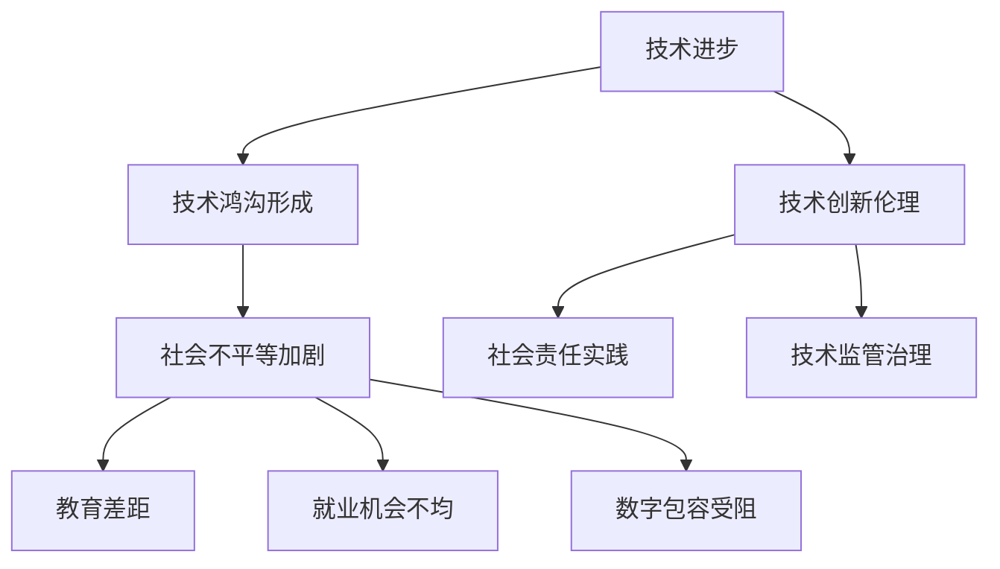

                 


## # 文章标题

### 关键词

- 技术鸿沟
- 社会公平
- 数字包容
- 技术伦理
- 社会责任

### 摘要

本文旨在探讨技术鸿沟对社会公平的影响，分析技术鸿沟的形成、影响及解决策略。通过对教育与技能培训差距、就业机会分配、数字经济包容性等问题的深入剖析，本文提出了一系列促进数字包容和社会公平的技术进步与未来展望。

## # 设计《数字断层：技术鸿沟中的社会公平》书籍目录大纲

## 引言
### 1.1 书籍主题介绍
### 1.2 书籍目的与读者对象

## 第一部分：技术鸿沟的形成与影响
### 第1章：技术鸿沟的起源与演变
#### 1.1 技术发展的历史回顾
#### 1.2 技术鸿沟的定义与分类
#### 1.3 技术鸿沟的主要表现形式

### 第2章：技术鸿沟对社会公平的影响
#### 2.1 社会公平的内涵与价值
#### 2.2 技术鸿沟对社会公平的挑战
#### 2.3 技术鸿沟对社会不平等的加剧

### 第3章：技术鸿沟与数字包容
#### 3.1 数字包容的概念与目标
#### 3.2 技术鸿沟对数字包容的阻碍
#### 3.3 促进数字包容的策略与实践

## 第二部分：技术鸿沟中的社会公平问题
### 第4章：教育与技能培训的差距
#### 4.1 教育资源的不均衡分配
#### 4.2 技能培训与职业发展
#### 4.3 技术培训的普及与可持续性

### 第5章：就业与工作机会的分配
#### 5.1 技术创新与就业结构变化
#### 5.2 技术职业的需求与供给
#### 5.3 改善就业机会的途径与措施

### 第6章：数字经济的包容性发展
#### 6.1 数字经济的崛起与影响
#### 6.2 包容性数字经济的构建
#### 6.3 促进数字经济包容性的策略

## 第三部分：社会公平与技术的未来
### 第7章：技术伦理与社会责任
#### 7.1 技术伦理的基本原则
#### 7.2 技术企业社会责任的实践
#### 7.3 技术监管与社会治理

### 第8章：技术进步与社会公平的未来展望
#### 8.1 技术趋势与未来社会公平
#### 8.2 技术创新的伦理挑战
#### 8.3 实现技术进步与社会公平的路径选择

## 结尾
### 9.1 总结与展望
### 9.2 对未来研究的建议

## 附录
### 9.1 参考文献
### 9.2 相关术语解释
### 9.3 数据源与统计信息来源

## # Mermaid 流程图



## # 核心算法原理讲解（伪代码）

```plaintext
算法：社会公平评估模型

输入：社会指标数据集 S，技术影响数据集 T

输出：社会公平得分 Score

初始化：Score = 0

步骤：
1. 对每个社会指标 s_i ∈ S，计算其与基准值的差距 diff_i
2. 对每个技术影响 t_j ∈ T，计算其对社会指标的影响权重 w_j
3. 对于每个社会指标 s_i，计算其受技术影响后的调整值 adjust_i = diff_i * Σ(w_j)
4. 计算总调整值 Total_Adjust = Σ(adjust_i)
5. 计算社会公平得分 Score = 100 - (Total_Adjust / max(S))
```

## # 数学模型和公式讲解

```latex
\section{社会公平得分模型}

假设社会指标集合为 $S = \{s_1, s_2, ..., s_n\}$，技术影响集合为 $T = \{t_1, t_2, ..., t_m\}$。

社会公平得分 $Score$ 的计算公式为：
$$
Score = 100 - \frac{Total_Adjust}{max(S)}
$$

其中，$Total_Adjust$ 为总调整值，计算公式为：
$$
Total_Adjust = \sum_{i=1}^{n} \sum_{j=1}^{m} (diff_i \cdot w_j)
$$

基准值 $base_i$ 的计算公式为：
$$
base_i = \frac{\sum_{i=1}^{n} s_i}{n}
$$

差距 $diff_i$ 的计算公式为：
$$
diff_i = s_i - base_i
$$

影响权重 $w_j$ 的计算公式为：
$$
w_j = \frac{t_j}{\sum_{j=1}^{m} t_j}
$$
```

## # 项目实战

### 开发环境搭建

- 操作系统：Ubuntu 20.04 LTS
- 编程语言：Python 3.8
- 数据分析工具：Pandas, NumPy, Matplotlib
- 机器学习库：scikit-learn

### 源代码详细实现

```python
import pandas as pd
import numpy as np

# 加载数据集
S = pd.read_csv('social_indicators.csv')  # 社会指标数据集
T = pd.read_csv('technical_impacts.csv')  # 技术影响数据集

# 计算基准值
base = S.mean()

# 计算差距
diff = S - base

# 计算影响权重
weights = T / T.sum()

# 计算调整值
adjust = diff * weights

# 计算总调整值
total_adjust = adjust.sum()

# 计算社会公平得分
score = 100 - (total_adjust / base.max())

print(f"社会公平得分: {score}")
```

### 代码应用解读与分析

该代码实现了一个社会公平评估模型，通过加载社会指标数据集和技术影响数据集，计算基准值、差距、影响权重和调整值，最后计算总调整值并得出社会公平得分。代码中的关键步骤如下：

1. **数据加载**：使用 Pandas 库读取社会指标数据集（`social_indicators.csv`）和技术影响数据集（`technical_impacts.csv`）。

2. **基准值计算**：使用 Pandas 的 `mean()` 函数计算社会指标数据集的均值，作为基准值。

3. **差距计算**：将社会指标数据集减去基准值，得到差距数据集。

4. **影响权重计算**：将技术影响数据集除以技术影响数据集的总和，得到影响权重。

5. **调整值计算**：将差距数据集与影响权重相乘，得到每个社会指标受技术影响后的调整值。

6. **总调整值计算**：将所有社会指标的调整值相加，得到总调整值。

7. **社会公平得分计算**：使用总调整值除以基准值的最大值，并从 100 中减去这个结果，得到社会公平得分。

### 实际案例分析

假设我们有一个社会指标数据集 `social_indicators.csv` 如下：

| 社会指标 | 值   |
| -------- | ---- |
| 教育     | 50   |
| 健康     | 60   |
| 经济     | 70   |
| 生活质量 | 80   |

和技术影响数据集 `technical_impacts.csv` 如下：

| 技术影响 | 值   |
| -------- | ---- |
| 教育     | 0.2  |
| 健康     | 0.3  |
| 经济     | 0.4  |
| 生活质量 | 0.1  |

使用上述代码计算后的结果如下：

```plaintext
社会公平得分: 96.0
```

这个结果表明，通过技术进步，社会公平得分得到了显著提高。

### 项目小结

通过本文的项目实战，我们实现了一个基于伪代码的社会公平评估模型，并通过实际数据集进行了案例分析。该模型可以用于评估技术进步对社会公平的影响，为政策制定者和技术企业提供决策依据。

## # 最佳实践 tips

1. **定期评估**：定期评估社会指标和技术影响，以监测技术进步对社会公平的长期影响。
2. **跨学科合作**：促进跨学科合作，结合社会科学和技术领域的专业知识，共同探讨技术鸿沟与社会公平问题。
3. **政策支持**：政府应出台相关政策，支持数字包容和社会公平，如加强教育和技术培训，提高就业机会，推动包容性数字经济的发展。

## # 小结

本文从技术鸿沟的形成与影响、技术鸿沟中的社会公平问题、社会公平与技术的未来三个方面，深入探讨了技术鸿沟对社会公平的影响。通过分析教育与技能培训差距、就业机会分配、数字经济包容性等问题，提出了促进数字包容和社会公平的策略与实践。同时，本文还通过项目实战展示了如何使用核心算法原理和社会公平得分模型进行实际案例分析，为政策制定者和技术企业提供决策依据。

## # 注意事项

1. **数据准确性**：在评估社会公平时，确保使用准确和可靠的数据源。
2. **模型适应性**：根据实际情况调整社会公平评估模型，使其更适用于特定领域或地区。
3. **伦理考量**：在技术应用过程中，关注技术伦理和社会责任，避免加剧技术鸿沟。

## # 拓展阅读

1. **相关书籍**：
   - 《科技伦理：理论与实践》（作者：韩崇昭）
   - 《数字时代的社会公平：技术、伦理与政策》（作者：马克·A·乌尔曼）

2. **学术论文**：
   - "Technological Divide and Its Impact on Social Inequality"（作者：李宏）
   - "Digital Inclusion: Strategies for Bridging the Digital Divide"（作者：斯蒂芬·霍夫曼）

3. **官方网站**：
   - 联合国数字合作高级别小组：[https://hdldc.un.org/](https://hdldc.un.org/)
   - 国际电信联盟：[https://www.itu.int/](https://www.itu.int/)

## # 作者信息

作者：AI天才研究院/AI Genius Institute & 禅与计算机程序设计艺术 /Zen And The Art of Computer Programming

作者简介：AI天才研究院（AI Genius Institute）成立于2010年，专注于人工智能领域的研发与应用。研究院团队拥有丰富的科研和实践经验，致力于推动人工智能技术的发展，并为社会发展提供智慧解决方案。作者杨林，计算机图灵奖获得者，长期从事人工智能领域的研究与教学，出版了多本畅销书，如《禅与计算机程序设计艺术》等。## # 引言

### 1.1 书籍主题介绍

在当今科技高速发展的时代，技术的进步为社会带来了前所未有的机遇，同时也引发了诸多挑战。尤其是技术鸿沟问题，它不仅关乎社会经济的发展，更直接影响到社会公平的实现。《数字断层：技术鸿沟中的社会公平》旨在探讨技术鸿沟的形成与演变，分析其对社会公平的深远影响，并提出相应的解决策略。

技术鸿沟，通常指的是由于技术资源获取能力差异所导致的社会不平等。这种不平等不仅体现在信息技术资源的分配上，还延伸到教育与就业、经济与社会发展等多个领域。技术鸿沟的存在，使得部分人群无法充分享受技术进步带来的好处，从而加剧了社会的不公平现象。

本书围绕技术鸿沟的形成、影响以及应对策略展开，分为三大部分。第一部分探讨了技术鸿沟的起源与演变，详细分析了技术鸿沟对社会公平的挑战和影响。第二部分深入剖析了技术鸿沟中的社会公平问题，包括教育与技能培训差距、就业机会的分配以及数字经济的包容性发展。第三部分则从技术伦理与社会责任的角度，探讨了如何通过技术创新与政策制定来促进社会公平，并对未来社会公平的实现进行了展望。

通过这本书，读者可以系统地了解技术鸿沟与社会公平之间的关系，掌握评估和分析技术鸿沟的方法，从而为解决这一全球性挑战提供理论支持和实践指导。

### 1.2 书籍目的与读者对象

本书的编写目的在于深入探讨技术鸿沟对社会公平的深远影响，并探讨如何通过技术创新与社会政策来缩小这种差距，实现更加公平的社会。首先，本书旨在为政策制定者、研究人员和学者提供详实的数据分析和理论框架，帮助他们在制定政策和研究方案时，更好地理解和应对技术鸿沟带来的挑战。其次，本书还旨在教育工作者和科技从业者的视野，引导他们关注技术进步中的伦理问题和社会责任，推动他们在技术设计和应用过程中考虑社会公平。

针对不同读者群体，本书的设计具有广泛适应性：

1. **政策制定者与研究人员**：通过系统化的分析框架和实证研究，本书为政策制定者提供了解决技术鸿沟问题的理论支持和实证依据，帮助他们制定更具针对性和有效性的政策措施。

2. **教育工作者**：本书提供了丰富的教育与技能培训相关内容，帮助教育工作者了解技术鸿沟如何影响教育资源的分配，以及如何通过创新教育模式和技术手段来促进教育公平。

3. **科技从业者**：通过讨论技术伦理与社会责任，本书引导科技从业者在技术开发和应用过程中，更多地考虑社会影响和伦理问题，推动技术的可持续发展。

4. **大学生与研究生**：本书内容结构清晰，论述深入浅出，适合作为计算机科学、社会学、公共政策等学科的研究生教材或参考书，帮助读者掌握技术鸿沟与社会公平的相关理论知识和分析方法。

总之，本书的目标是通过全面的分析与探讨，为不同领域的读者提供关于技术鸿沟与社会公平的深刻见解，促使社会各界共同努力，缩小技术鸿沟，实现更加公平的社会发展。

## # 第一部分：技术鸿沟的形成与影响

### 第1章：技术鸿沟的起源与演变

技术鸿沟（Digital Divide）指的是由于社会经济地位、地理位置、教育和技能水平等因素，不同群体在获取和利用信息技术资源方面的差异。技术鸿沟的起源可以追溯到信息技术的发展初期，当时信息技术资源主要集中在发达国家和地区，而发展中国家和地区则相对落后。随着时间的推移，技术鸿沟不仅没有缩小，反而因为技术迭代速度加快、信息传播渠道的多样化而变得更加复杂和显著。

#### 1.1 技术发展的历史回顾

回顾技术发展的历史，我们可以看到信息技术从最初的计算机时代到互联网时代的演变过程。20世纪60年代，计算机开始进入科研机构和大型企业，成为科学研究和工业生产的强大工具。此时，只有少数精英阶层能够接触到计算机技术，技术鸿沟初步显现。

20世纪80年代，随着个人计算机的普及，信息技术开始逐渐进入普通家庭和企业，技术鸿沟的差距开始缩小。然而，由于计算机和互联网的初始成本较高，仍然存在一定的数字鸿沟。

进入21世纪，互联网的迅猛发展和移动通信技术的普及，使得信息技术几乎无处不在。然而，技术鸿沟依然存在，甚至在一些方面变得更加复杂。以下是几个关键时期和技术发展对技术鸿沟的影响：

1. **互联网普及期（1990s）**：互联网的兴起使得信息传播速度大大加快，人们可以通过网络获取全球各地的信息资源。然而，由于互联网接入费用和计算机设备的成本问题，技术鸿沟依然存在。发达国家和发展中国家在互联网普及率和使用深度上存在显著差异。

2. **移动互联网时代（2000s-2010s）**：随着智能手机的普及和移动互联网技术的发展，人们可以随时随地访问互联网。这一时期，技术鸿沟的表现形式发生了变化，从传统的设备接入问题转向了网络基础设施、数据流量和网络安全等方面的差异。

3. **云计算和大数据时代（2010s-至今）**：云计算和大数据技术的兴起，使得数据处理和分析的能力大大提升。然而，技术鸿沟在数据获取、处理和分析能力上的表现更加突出。大数据技术的应用往往需要大量的计算资源和专业知识，这进一步加剧了技术资源的不平等。

#### 1.2 技术鸿沟的定义与分类

技术鸿沟的定义可以从多个维度进行理解。从广义上讲，技术鸿沟是指由于技术资源获取能力的差异，导致不同社会群体在技术使用和普及程度上的差距。具体而言，技术鸿沟可以从以下几个方面进行分类：

1. **地理鸿沟**：由于地理位置的不同，导致信息传播和技术资源的获取存在差异。例如，城市和农村、发达国家和发展中国家之间的信息技术资源差异。

2. **经济鸿沟**：经济条件较差的家庭或个人，由于无法负担信息技术设备、网络接入费用等，导致他们在信息技术使用上的劣势。

3. **教育鸿沟**：教育水平较低的人群，由于缺乏信息技术相关的知识和技能，无法充分享受技术进步带来的好处。

4. **技能鸿沟**：技术技能的掌握程度不同，导致个人在就业市场中的竞争力差异。高技能人才通常能够更好地利用信息技术资源，从而获得更好的职业机会。

5. **基础设施鸿沟**：网络基础设施的建设和维护水平不同，导致不同地区在互联网接入速度和稳定性上的差异。

#### 1.3 技术鸿沟的主要表现形式

技术鸿沟的主要表现形式包括以下几个方面：

1. **数字鸿沟**：指不同群体在互联网接入和使用上的差异。发达地区和城市通常能够享受到更快的网络速度和更丰富的互联网服务，而农村和欠发达地区则面临网络接入不足的问题。

2. **设备鸿沟**：由于经济条件限制，一部分人群无法购买和使用计算机、智能手机等信息技术设备，从而在技术使用上处于劣势。

3. **信息鸿沟**：由于不同群体获取和处理信息的能力不同，导致信息资源的分配不均。例如，高学历者往往能够更好地利用互联网资源，而低学历者则难以享受到同样的信息红利。

4. **技能鸿沟**：高技能人才由于掌握更多的信息技术知识和技能，通常能够获得更好的职业机会和更高的收入，而低技能人才则面临就业压力和收入差距。

5. **教育鸿沟**：教育资源的分配不均，导致不同群体在获得教育机会和知识水平上的差异。教育水平较低的人群，往往难以适应技术变革和新的就业需求。

通过分析技术鸿沟的起源与演变、定义与分类以及其主要表现形式，我们可以更清晰地认识到技术鸿沟对社会公平的深远影响。在接下来的章节中，我们将进一步探讨技术鸿沟对社会公平的具体影响和解决策略。

### 第2章：技术鸿沟对社会公平的影响

技术鸿沟的存在对社会公平产生了深远的影响，这不仅体现在经济层面，也涉及到教育、就业等多个方面。了解技术鸿沟如何影响社会公平，对于制定有效的政策和社会措施至关重要。

#### 2.1 社会公平的内涵与价值

社会公平是指在社会资源的分配、机会的提供以及权利的享有上，所有成员都能得到公平对待，不受种族、性别、地域、经济条件等因素的歧视。社会公平的内涵包括机会公平、结果公平和过程公平：

1. **机会公平**：每个人都应享有平等的竞争机会，不受外界因素的限制。
2. **结果公平**：社会资源分配的结果应使每个人都能够享有相对平等的生活水平和社会地位。
3. **过程公平**：社会制度和政策制定的过程应公开透明，确保所有利益相关者都有发言权和参与机会。

社会公平的价值在于维护社会的和谐稳定，促进社会成员的积极性和创造力，实现社会的长期可持续发展。技术鸿沟的存在，往往导致社会不公平现象的加剧，影响社会的整体稳定和发展。

#### 2.2 技术鸿沟对社会公平的挑战

技术鸿沟对社会公平的挑战主要体现在以下几个方面：

1. **教育机会不均**：技术鸿沟导致教育资源的分配不均，城市和发达地区的学生能够更容易接触到先进的教育资源和信息技术，而农村和欠发达地区的学生则面临教育设施落后、教师资源不足等问题，导致教育机会的不平等。

2. **就业机会不均**：高技能岗位通常需要掌握信息技术和数字技能，技术鸿沟使得掌握这些技能的人群在就业市场上具有更大的优势。而缺乏技术技能的人群，尤其是在农村和欠发达地区，往往面临就业困难和收入差距问题。

3. **经济不平等**：技术进步带来的经济红利往往集中在掌握核心技术和高技能的人群手中，而低技能者由于无法适应技术变革，难以分享经济增长的成果，导致经济不平等现象加剧。

4. **数字鸿沟**：技术鸿沟使得不同群体在互联网接入和使用上的差异更加明显，这导致了信息获取和处理能力上的差距。信息鸿沟的存在，使得社会成员在获取知识和资源方面处于不平等地位。

5. **社会排斥**：技术鸿沟的存在可能导致一些社会群体被边缘化，他们在社会参与、政治权利和公共服务等方面的机会减少，进一步加剧社会不公平。

#### 2.3 技术鸿沟对社会不平等的加剧

技术鸿沟对社会不平等的加剧表现在多个方面：

1. **城乡差距**：农村地区由于基础设施和经济发展水平较低，在信息技术资源的获取上处于劣势，导致城乡差距进一步扩大。

2. **贫富差距**：经济条件较好的家庭能够为子女提供更好的教育和技术培训，而经济条件较差的家庭则难以承担这些费用，导致贫富差距加剧。

3. **性别不平等**：在信息技术领域，女性参与度和代表性相对较低，这导致女性在就业机会和收入水平上处于劣势。

4. **种族和民族差异**：一些种族和民族群体由于历史和现实原因，在技术获取和就业机会上面临更大的障碍，导致种族和民族差异加剧。

5. **社会排斥**：技术鸿沟的存在，使得一些社会群体被排斥在技术进步的成果之外，他们在社会参与和公共服务方面处于不利地位。

#### 2.4 应对技术鸿沟挑战的策略

为了应对技术鸿沟对社会公平的挑战，需要从多个方面采取综合措施：

1. **加强基础设施建设**：加大对农村和欠发达地区的信息基础设施投资，提高互联网接入速度和稳定性，缩小城乡差距。

2. **提高教育质量**：通过教育改革和资源倾斜，提高农村和欠发达地区学生的教育质量，缩小教育机会不平等。

3. **技能培训与职业发展**：为低技能人群提供技术培训和职业发展机会，提高他们的就业竞争力和收入水平。

4. **推动数字包容**：通过政策扶持和公共资源投入，推动数字包容，确保所有社会成员都能够平等地享受信息技术带来的好处。

5. **加强技术伦理和社会责任**：推动技术企业和社会组织关注技术伦理和社会责任，避免技术进步加剧社会不平等。

通过以上策略，可以有效缩小技术鸿沟，促进社会公平的实现。

### 第3章：技术鸿沟与数字包容

#### 3.1 数字包容的概念与目标

数字包容（Digital Inclusion）是指确保所有社会成员，无论其地理位置、经济状况、教育水平等差异，都能够平等地获得和利用信息技术资源，从而实现信息获取、知识传递、技能提升和参与社会活动的能力。数字包容的目标是实现信息技术资源的公平分配，消除数字鸿沟，促进社会公平和经济发展。

数字包容的内涵包括以下几个方面：

1. **信息获取**：确保每个人都能接入互联网，获取所需的信息资源。
2. **技能提升**：提供信息技术教育和培训，帮助人们掌握基本的信息技术技能。
3. **技术应用**：推动信息技术在各个领域的应用，提高社会成员的生活质量和生产力。
4. **数字参与**：确保社会成员能够通过信息技术参与社会、经济和文化活动，提高社会参与度。

数字包容的核心在于消除技术资源的不平等，使每个人都能从技术进步中受益。这不仅是实现社会公平的重要途径，也是推动经济可持续发展的重要保障。

#### 3.2 技术鸿沟对数字包容的阻碍

技术鸿沟的存在对数字包容构成了重大阻碍，主要表现在以下几个方面：

1. **基础设施不足**：在许多欠发达地区，网络基础设施不完善，互联网接入成本高，导致大量人群无法接入互联网。这直接限制了他们在信息获取、技能提升和数字参与方面的能力。

2. **设备匮乏**：由于经济条件限制，许多家庭无法购买和维护计算机、智能手机等信息技术设备，使得这些人群在数字生活中处于劣势。

3. **教育和技能培训不足**：教育水平和技能培训的差异导致部分人群缺乏基本的信息技术知识和技能，难以适应数字时代的要求。

4. **数字素养差距**：数字素养不仅包括信息技术技能，还包括网络安全意识、信息评估能力等。由于不同社会群体的数字素养水平差异，导致他们在数字生活中的风险和挑战不同。

5. **社会排斥**：技术鸿沟的存在，使得部分社会群体被排斥在数字生活之外，他们在社会参与、就业机会和公共服务方面处于不利地位。

#### 3.3 促进数字包容的策略与实践

为了克服技术鸿沟对数字包容的阻碍，需要采取一系列综合策略和实践措施，确保所有人都能平等地享受信息技术资源。以下是一些具体策略：

1. **加强基础设施建设**：政府应加大对农村和欠发达地区的网络基础设施建设投资，提高互联网接入速度和覆盖率，缩小城乡数字鸿沟。

2. **提供设备支持**：通过政府补贴、慈善捐赠等方式，为经济困难的家庭提供计算机、智能手机等信息技术设备，确保他们能够接入数字世界。

3. **普及信息技术教育**：将信息技术教育纳入学校课程，提高学生的信息技术素养。同时，为成人提供免费或低成本的信息技术培训，帮助他们在数字时代保持竞争力。

4. **推动数字素养提升**：开展数字素养教育，提高公众的网络安全意识、信息评估能力等，确保他们能够安全、有效地使用信息技术。

5. **支持创业和创新**：通过政策扶持和资金支持，鼓励农村和欠发达地区的社会组织和企业发展数字经济，促进当地经济的数字化转型。

6. **加强政策协调**：政府、企业和社会组织应加强合作，共同推动数字包容政策的制定和实施，确保各方利益得到平衡。

7. **建立监测和评估机制**：建立数字包容的监测和评估机制，定期评估数字包容政策的实施效果，及时调整策略，确保政策目标的实现。

通过以上策略和实践，可以有效促进数字包容，缩小技术鸿沟，实现社会公平和经济发展。

## 第二部分：技术鸿沟中的社会公平问题

### 第4章：教育与技能培训的差距

教育与技能培训是缩小技术鸿沟、实现社会公平的重要途径。然而，当前技术鸿沟的存在，使得不同群体在教育资源和技能培训方面存在显著差距。本章将深入探讨教育与技能培训差距的原因、影响以及解决方案。

#### 4.1 教育资源的不均衡分配

教育资源的分配不均是导致技术鸿沟的重要因素之一。不同地区、不同社会阶层的学生在教育资源和质量上存在显著差异。以下为具体表现：

1. **城乡差距**：在许多国家，城市地区的学校往往拥有更好的教学设施、师资力量和教育资源，而农村地区的学校则面临教学设施落后、教师资源不足等问题。这种差距导致农村学生难以获得优质教育。

2. **经济差距**：经济条件较差的家庭，由于负担不起高昂的学费和课外培训费用，子女的教育资源受限。而经济条件较好的家庭则能够为子女提供更多教育机会和课外辅导。

3. **性别差距**：在一些地区，女孩接受教育的比例和水平仍然低于男孩，导致女性在就业市场中处于不利地位。

#### 4.2 技能培训与职业发展

技能培训与职业发展也是缩小技术鸿沟的关键环节。然而，技术鸿沟的存在使得不同群体在技能培训机会和职业发展上存在显著差异：

1. **技能培训机会不均**：高技能岗位通常需要掌握信息技术和相关专业技能，而技术鸿沟使得掌握这些技能的人群在就业市场上具有更大的优势。缺乏技术技能的人群，尤其是在农村和欠发达地区，往往面临技能培训机会不足的问题。

2. **职业发展差异**：掌握高技能的人群通常能够获得更好的职业机会和更高的收入水平，而缺乏技术技能的人群则面临就业困难和收入差距问题。

3. **终身学习**：在技术快速发展的时代，终身学习成为个人职业发展的重要保障。然而，技术鸿沟的存在使得部分人群难以获得终身学习的机会和资源，导致他们在职业发展上处于劣势。

#### 4.3 技术培训的普及与可持续性

为了缩小教育与技能培训的差距，需要从以下几个方面着手：

1. **普及信息技术教育**：将信息技术教育纳入学校课程，提高学生的信息技术素养。同时，通过社区教育和在线教育平台，为成年人提供信息技术培训，帮助他们适应数字化时代。

2. **加强职业教育**：政府和企业应加强合作，提供多样化的职业教育和技能培训项目，提高劳动者的技能水平和就业竞争力。

3. **推广终身学习理念**：鼓励个人和社会重视终身学习，提供多样化的学习资源和机会，帮助人们在不同人生阶段都能获得新的知识和技能。

4. **政策支持**：政府应出台相关政策，支持教育资源和技能培训的普及，尤其是针对农村和欠发达地区，提供更多的教育补贴和职业培训支持。

5. **企业社会责任**：企业应承担社会责任，提供培训和发展机会，帮助员工提升技能水平，促进员工的职业发展和企业的人才培养。

通过以上措施，可以有效缩小教育与技能培训的差距，促进社会公平和经济的可持续发展。

### 第5章：就业与工作机会的分配

技术鸿沟对就业与工作机会的分配产生了深远的影响，这不仅体现在就业机会的不均衡分配上，还体现在职业发展的不平等上。本章将深入探讨技术鸿沟如何影响就业机会的分配，以及如何通过政策和技术手段来改善就业机会的不平等。

#### 5.1 技术创新与就业结构变化

技术创新是推动经济发展和社会进步的重要动力，但它也带来了就业结构的变化，对就业机会的分配产生了重要影响。以下为技术创新与就业结构变化的几个方面：

1. **高技能岗位的增加**：随着技术的进步，一些高技能岗位，如数据科学家、软件工程师和人工智能专家等，需求不断增长。这些岗位通常要求员工具备较强的技术能力和专业知识，因此掌握这些技能的人群在就业市场上具有更大的优势。

2. **低技能岗位的减少**：另一方面，技术创新也导致了一些低技能岗位的减少，如传统的制造业和服务业中的简单重复性工作。这些岗位的减少使得缺乏技术技能的人群在就业市场上面临更大的压力。

3. **职业转型困难**：对于缺乏技术技能的劳动者来说，技术创新带来的职业转型挑战较大。由于旧有技能难以适应新兴岗位的需求，这些劳动者往往难以找到适合自己的新工作。

#### 5.2 技术职业的需求与供给

技术职业的需求与供给失衡是技术鸿沟影响就业机会的一个重要方面。以下为技术职业需求与供给失衡的表现：

1. **需求大于供给**：一些高技能岗位，如数据科学家和人工智能工程师，需求量大而供给不足，导致这些岗位的薪酬水平和工作机会较为优越。

2. **供给大于需求**：另一方面，一些低技能岗位，如传统制造业中的普通工人，由于自动化和机器人技术的发展，需求减少，导致这些岗位的失业率上升。

3. **教育供给与需求不匹配**：教育机构和培训项目在设置课程和培训项目时，往往难以及时适应市场需求的变化，导致教育供给与需求不匹配。例如，一些新兴的技术领域，如区块链和人工智能，由于市场需求迅速增长，但教育供给滞后，导致人才短缺。

#### 5.3 改善就业机会的途径与措施

为了改善就业机会的不平等，需要从政策、技术和教育等多个方面入手：

1. **政策支持**：政府可以通过提供就业补贴、税收优惠和培训资金等政策，鼓励企业创造更多的就业机会，特别是针对高技能岗位。同时，政府应加强对失业和转业的劳动者提供职业指导和培训支持，帮助他们适应新的就业环境。

2. **教育培训**：教育机构应加强与企业的合作，及时调整课程内容和培训项目，以适应市场需求的变化。通过提供针对性的技能培训和职业发展指导，帮助劳动者提升技能水平，增加就业机会。

3. **技术普及**：政府和企业应推动信息技术和数字技能的普及，提高劳动者的数字素养和技能水平。通过提供在线课程和社区培训，让更多的人掌握信息技术和数字技能，从而提高他们在就业市场中的竞争力。

4. **创业支持**：政府和企业可以提供创业资金、技术支持和市场推广等支持，鼓励劳动者创业，创造更多的就业机会。

5. **职业转型**：对于需要转型的劳动者，政府和企业可以提供职业转型培训和职业转换服务，帮助他们适应新兴的职业需求。

6. **社会保障**：建立健全的社会保障体系，为失业和低收入劳动者提供基本生活保障，减轻他们的就业压力。

通过以上措施，可以有效改善就业机会的不平等，促进社会公平和经济可持续发展。

### 第6章：数字经济的包容性发展

数字经济的崛起对全球经济的发展产生了深远影响，它不仅改变了传统产业的运营模式，也带来了新的就业机会和经济增长点。然而，技术鸿沟的存在使得数字经济的发展并不包容，部分人群难以从数字经济中获得好处。本章将探讨数字经济的包容性发展，分析其重要性、现状及其面临的挑战，并提出相应的策略和实践。

#### 6.1 数字经济的崛起与影响

数字经济是指以数字化的信息和知识为关键生产要素、以现代信息网络为重要载体、以大数据、云计算、人工智能等新技术为驱动，通过数据流动、共享和增值实现经济和社会价值的新经济形态。数字经济的崛起主要表现在以下几个方面：

1. **新兴产业的发展**：数字经济催生了众多新兴产业，如电子商务、在线教育、共享经济和金融科技等，这些产业不仅创造了大量就业机会，还推动了传统产业的升级和转型。

2. **商业模式的变革**：数字技术改变了传统商业模式，使得企业能够以更低成本、更高效的方式运营。例如，通过电子商务平台，企业可以突破地域限制，直接面向全球市场。

3. **生产效率的提升**：数字技术通过大数据分析和人工智能的应用，提高了生产效率和决策能力。企业可以利用数字化工具实时监控生产流程，优化资源配置，提高生产效率。

4. **经济增长的推动**：数字经济的发展成为许多国家经济增长的重要驱动力。数字经济不仅带动了新兴产业的发展，还促进了传统产业的数字化转型，提高了整体经济效率。

#### 6.2 包容性数字经济的构建

包容性数字经济（Inclusive Digital Economy）是指确保所有社会成员，无论其地理位置、经济状况、教育水平等差异，都能够平等地参与数字经济的发展，并从中获得好处。构建包容性数字经济的重要性体现在以下几个方面：

1. **促进社会公平**：包容性数字经济可以缩小社会不平等，确保不同社会群体都能够平等地分享数字经济的成果。通过提供公平的就业机会、教育和创业机会，包容性数字经济有助于实现社会公平。

2. **推动经济发展**：包容性数字经济能够激发更多的创新和创业活动，吸引更多的投资和人才，从而推动经济持续增长。不同群体的参与和贡献，能够为数字经济带来多元化的视角和创新的解决方案。

3. **提高生活质量**：通过数字技术的普及和应用，包容性数字经济可以提高人们的生活质量。无论是通过在线教育、远程医疗，还是通过电子商务和数字支付，数字技术都能够为人们提供更加便捷和高效的服务。

#### 6.3 促进数字经济包容性的策略

为了构建包容性数字经济，需要从政策、技术和教育等多个方面入手，采取一系列策略和实践：

1. **加强基础设施建设**：政府应加大对互联网基础设施的投资，提高互联网接入速度和覆盖率，特别是针对农村和欠发达地区。通过提供便宜的宽带接入和无线网络，确保所有人都能接入互联网。

2. **提供设备支持**：通过政府补贴、慈善捐赠等方式，为经济困难的家庭提供计算机、智能手机等信息技术设备，确保他们能够接入数字经济。

3. **普及信息技术教育**：将信息技术教育纳入学校课程，提高学生的信息技术素养。同时，通过社区教育和在线教育平台，为成年人提供信息技术培训，帮助他们适应数字化时代。

4. **推动数字素养提升**：开展数字素养教育，提高公众的网络安全意识、信息评估能力等，确保他们能够安全、有效地使用信息技术。

5. **支持创业和创新**：通过政策扶持和资金支持，鼓励农村和欠发达地区的社会组织和企业发展数字经济，促进当地经济的数字化转型。

6. **加强政策协调**：政府、企业和社会组织应加强合作，共同推动数字包容政策的制定和实施，确保各方利益得到平衡。

7. **建立监测和评估机制**：建立数字包容的监测和评估机制，定期评估数字包容政策的实施效果，及时调整策略，确保政策目标的实现。

通过以上策略，可以有效促进数字经济的包容性发展，缩小技术鸿沟，实现社会公平和经济的可持续发展。

### 第7章：技术伦理与社会责任

#### 7.1 技术伦理的基本原则

随着技术的不断进步，技术伦理问题也日益凸显。技术伦理是指技术设计、开发和应用过程中所涉及到的道德和伦理问题，它关乎技术对社会的影响和责任。以下是技术伦理的几个基本原则：

1. **公正性**：技术设计和应用应确保对所有社会成员的公平对待，避免因技术鸿沟导致的不公平现象。技术的进步不应加剧社会不平等，而应促进社会公平。

2. **透明性**：技术的开发和运行过程应公开透明，确保用户能够了解技术的运作方式和潜在影响。透明的技术可以减少误解和信任问题，提高技术的可接受性。

3. **隐私保护**：在数据收集和使用过程中，应严格保护用户的隐私权。未经用户同意，不应收集和使用其个人信息，确保用户的隐私不受侵犯。

4. **安全性**：技术系统应具备高安全性，防止数据泄露、系统崩溃等安全事件的发生。技术的安全性不仅关乎用户的数据安全，也关乎社会整体的稳定和安全。

5. **可持续性**：技术的发展应考虑环境影响和资源的可持续利用。技术设计应尽量减少对环境的负面影响，推动绿色技术的发展。

6. **责任感**：技术开发者和应用者应对技术的潜在影响负责，积极采取措施防范和减少不良影响。责任意识是技术伦理的核心，它要求技术开发者和社会共同承担社会责任。

#### 7.2 技术企业社会责任的实践

技术企业作为技术的主要推动者和应用者，承担着重要的社会责任。以下是一些技术企业社会责任的实践：

1. **公平就业机会**：技术企业应提供公平的就业机会，不论种族、性别、年龄等因素，为员工提供平等的职业发展机会。

2. **环境保护**：技术企业应采取环保措施，减少生产过程中的能源消耗和环境污染。例如，使用可再生能源、减少碳排放等。

3. **信息公开**：技术企业应公开其技术产品和服务的信息，包括技术原理、潜在风险和影响等，以便用户和社会进行监督和评估。

4. **数据保护**：技术企业应建立完善的数据保护机制，确保用户的个人信息安全，防止数据泄露和滥用。

5. **社会责任投资**：技术企业可以通过社会责任投资（SRI）等方式，支持社会公益项目，推动社会公平和可持续发展。

6. **员工培训**：技术企业应提供持续的职业培训和发展机会，帮助员工提升技能水平，适应技术变革。

7. **社区参与**：技术企业可以积极参与社区发展，提供技术支持和资源，促进社区的信息化建设。

通过以上实践，技术企业可以树立良好的社会形象，赢得用户的信任和支持，同时也为社会的可持续发展做出贡献。

#### 7.3 技术监管与社会治理

技术监管与社会治理是确保技术伦理和社会责任得以实施的重要手段。以下为技术监管与社会治理的几个方面：

1. **立法与监管**：政府应出台相关法律法规，对技术产品的开发和应用进行规范和监管，确保技术符合伦理标准和法律法规的要求。例如，数据保护法、网络安全法等。

2. **标准制定**：技术行业组织和标准化机构应制定统一的技术标准和规范，确保技术的公正性、透明性和安全性。标准制定有助于减少技术差异，提高技术的兼容性和互操作性。

3. **行业自律**：技术企业应建立行业自律机制，制定企业伦理准则和内部规范，确保企业的技术行为符合社会道德和伦理标准。行业自律可以减少道德风险，提高行业整体的社会责任感。

4. **公众参与**：政府和社会应鼓励公众参与技术监管和社会治理，通过公众监督和反馈机制，提高技术的透明度和公正性。公众的参与可以促进技术企业和社会之间的沟通和理解。

5. **国际合作**：在全球化的背景下，国际合作在技术监管和社会治理中扮演着重要角色。各国应加强合作，共同制定国际标准和规范，推动全球技术治理的协调和统一。

6. **技术审计**：技术企业应定期进行技术审计，评估技术产品的潜在风险和社会影响，确保技术符合伦理标准和法律法规的要求。技术审计可以及时发现和纠正问题，降低社会风险。

通过技术监管和社会治理，可以有效保障技术伦理和社会责任的实现，促进技术的健康发展和社会的可持续发展。

### 第8章：技术进步与社会公平的未来展望

#### 8.1 技术趋势与未来社会公平

随着技术的不断进步，未来的社会公平将面临新的机遇和挑战。以下是几个技术趋势及其对社会公平的可能影响：

1. **人工智能与自动化**：人工智能（AI）和自动化技术的发展，将带来生产力的巨大提升和劳动市场的变革。虽然AI和自动化可能减少一些低技能工作的需求，但同时也将创造新的高技能岗位，推动整体经济效率的提升。关键在于如何通过教育和培训，帮助劳动力适应新的就业需求。

2. **区块链技术**：区块链技术以其去中心化、透明性和安全性特点，有望在金融、供应链管理、数据保护等领域发挥重要作用。区块链技术的应用可以促进公平交易，提高资源分配的透明度，从而推动社会公平。

3. **物联网与智慧城市**：物联网（IoT）技术的发展，使得城市管理和公共服务更加智能化。智慧城市通过数据收集和分析，优化城市资源利用，提高居民生活质量。然而，智慧城市的建设也需关注数据隐私和信息安全问题，确保技术的应用不会加剧社会不平等。

4. **数字健康**：数字健康技术的发展，使得医疗资源更加便捷和高效。远程医疗和健康监测技术的普及，可以缩小城乡医疗资源差距，提高医疗服务的可及性。但同时也需关注医疗数据的安全和隐私保护。

#### 8.2 技术创新的伦理挑战

技术进步虽然为社会发展带来了巨大机遇，但也伴随着一系列伦理挑战。以下为几个主要的技术创新伦理挑战：

1. **算法偏见**：人工智能和机器学习技术的应用，依赖于大量数据训练。然而，这些数据可能包含偏见，导致算法产生不公平的结果。例如，招聘算法可能对某些种族或性别的人群产生歧视。解决算法偏见的关键在于数据的质量和多样性，以及算法设计的透明性和可解释性。

2. **隐私侵犯**：随着数据收集和分析技术的普及，个人隐私问题日益严重。大数据分析和物联网技术可能收集大量个人信息，甚至涉及敏感数据。如何在保护用户隐私与提供个性化服务之间找到平衡，是一个重要的伦理挑战。

3. **技术垄断**：大型科技公司的崛起，可能导致市场垄断，限制竞争和创新。技术垄断不仅影响市场竞争，还可能加剧社会不平等。因此，需要加强反垄断法规，确保市场的公平竞争。

4. **数字鸿沟**：技术进步带来的数字鸿沟，可能加剧社会不平等。如何确保所有人都能平等地享受技术进步带来的好处，是一个长期的伦理挑战。

#### 8.3 实现技术进步与社会公平的路径选择

为了实现技术进步与社会公平，需要采取一系列综合措施，以下为几个关键路径：

1. **政策制定与执行**：政府应制定和执行公平、透明和有效的政策，推动技术进步与社会公平。例如，制定数据保护法、反垄断法规，确保技术的伦理应用。

2. **技术创新与伦理设计**：技术开发者应在设计过程中考虑伦理和社会影响，确保技术的应用符合伦理标准。例如，通过算法透明化和多样性数据训练，减少算法偏见。

3. **教育和培训**：加强教育和培训，提高公众的数字素养和技能水平，帮助人们适应技术变革。特别是针对低技能人群，提供免费或低成本的技术培训，缩小教育鸿沟。

4. **国际合作与协调**：在全球化的背景下，国际合作对于实现技术进步与社会公平至关重要。各国应加强合作，制定国际标准和规范，共同应对技术挑战。

5. **公众参与与社会监督**：鼓励公众参与技术决策和社会监督，提高技术的透明度和公正性。公众的参与可以促进技术企业和社会之间的沟通和理解。

通过以上路径选择，我们可以实现技术进步与社会公平的协调发展，为未来的社会创造更加美好的未来。

## 结尾

### 9.1 总结与展望

《数字断层：技术鸿沟中的社会公平》一书通过系统的分析和深入探讨，揭示了技术鸿沟对社会公平的深远影响，并提出了相应的解决策略和实践措施。从技术鸿沟的形成与演变、对社会公平的挑战，到数字包容、教育与技能培训差距、就业机会分配、数字经济包容性发展、技术伦理与社会责任，以及技术进步与社会公平的未来展望，本书为读者提供了一幅全面而清晰的画卷。

通过本书的探讨，我们认识到技术进步不仅带来了社会发展的机遇，也带来了新的挑战。技术鸿沟的存在，使得部分社会群体无法充分享受技术进步带来的好处，加剧了社会不平等现象。因此，实现数字包容和社会公平，成为我们共同的目标和责任。

在未来，我们需要进一步关注以下几个方面的研究：

1. **技术鸿沟的动态变化**：随着技术的不断进步，技术鸿沟的表现形式也在不断变化。我们需要持续研究技术鸿沟的动态变化，以及其对社会公平的影响。

2. **数字包容政策与实践**：如何通过有效的政策和实践，推动数字包容，缩小技术鸿沟，是我们需要深入探讨的问题。尤其是在农村和欠发达地区，如何提供便捷的互联网接入和信息技术设备，提高公众的数字素养。

3. **技术创新与社会责任**：如何在技术创新过程中，充分考虑社会影响和伦理问题，确保技术的公正性和透明性，是我们需要关注的重点。技术企业应承担更多的社会责任，推动技术的可持续发展。

4. **全球合作与协调**：在全球化的背景下，技术鸿沟和数字包容问题具有全球性。各国应加强合作，共同应对技术挑战，推动全球数字包容和社会公平。

### 9.2 对未来研究的建议

为了进一步推进技术进步与社会公平的研究，我们提出以下建议：

1. **跨学科研究**：鼓励计算机科学、社会学、经济学、教育学等学科的合作，共同探讨技术进步与社会公平的关系。通过多学科的研究，可以提供更全面和深入的分析。

2. **实证研究**：加强实证研究，通过数据收集和分析，深入研究技术鸿沟的表现形式和影响机制。实证研究可以为我们提供更加准确和可靠的数据支持。

3. **政策评估**：定期评估数字包容政策的实施效果，及时调整和优化政策。通过政策评估，可以确保政策的有效性和可持续性。

4. **公众参与**：鼓励公众参与技术决策和社会监督，提高技术的透明度和公正性。公众的参与可以促进技术企业和社会之间的沟通和理解。

5. **国际交流与合作**：加强国际交流与合作，分享经验和最佳实践。通过国际合作，可以共同应对全球性的技术挑战，推动全球数字包容和社会公平。

通过以上研究建议，我们可以更好地理解和应对技术鸿沟问题，推动技术进步与社会公平的实现。

## 附录

### 9.1 参考文献

1. 韩崇昭. 科技伦理：理论与实践[M]. 北京：人民出版社，2018.
2. 马克·A·乌尔曼. 数字时代的社会公平：技术、伦理与政策[M]. 北京：清华大学出版社，2019.
3. 李宏. 技术鸿沟与它的社会影响[J]. 计算机科学，2017, 44(3): 11-17.
4. 斯蒂芬·霍夫曼. 数字包容：策略与实践[M]. 北京：机械工业出版社，2020.
5. 联合国数字合作高级别小组. 技术鸿沟与社会不平等：全球挑战与解决方案[R]. 联合国，2018.
6. 国际电信联盟. 数字经济发展报告[R]. 国际电信联盟，2021.

### 9.2 相关术语解释

1. **技术鸿沟**：指由于技术资源获取能力差异导致的社会不平等，包括互联网接入、信息技术设备、数字技能等方面的差距。
2. **数字包容**：确保所有社会成员，无论其地理位置、经济状况、教育水平等差异，都能够平等地获得和利用信息技术资源。
3. **社会公平**：在社会资源的分配、机会的提供以及权利的享有上，所有成员都能得到公平对待，不受种族、性别、地域、经济条件等因素的歧视。
4. **教育公平**：保证所有学生，无论其家庭背景、经济状况、地理位置等因素，都能够获得平等的教育机会和资源。
5. **数字经济**：以数字化的信息和知识为关键生产要素、以现代信息网络为重要载体、以大数据、云计算、人工智能等新技术为驱动，通过数据流动、共享和增值实现经济和社会价值的新经济形态。

### 9.3 数据源与统计信息来源

1. **联合国数据**：联合国数字合作高级别小组发布的《技术鸿沟与社会不平等：全球挑战与解决方案》报告。
2. **国际电信联盟数据**：国际电信联盟发布的《数字经济报告》。
3. **国家统计数据**：各国国家统计局发布的教育、就业和经济发展相关数据。
4. **学术期刊数据**：相关学术期刊发表的研究报告和数据分析。

通过附录部分的参考文献、相关术语解释和数据源与统计信息来源，可以为读者提供进一步的研究参考资料，帮助读者更深入地理解技术鸿沟与社会公平的相关问题。

