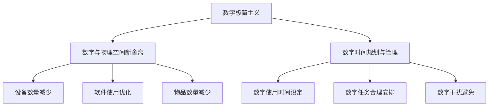

                 

### 文章标题

《数字断舍离：虚拟世界中的极简生活指南》

### 文章关键词

数字断舍离，极简生活，数字负担，生活质量，心理健康

### 文章摘要

在数字化时代，我们被海量的信息和数据所包围，这给我们的生活带来了巨大的负担。本指南旨在帮助读者实现数字断舍离，通过极简主义的方式，减少数字负担，提高生活质量。文章将详细探讨数字断舍离的核心原则、实践方法、心理影响以及未来趋势，为读者提供一份全面、实用的数字极简生活指南。

---

## 第1章 引言

### 1.1 数字断舍离的概念

在讨论数字断舍离之前，我们首先需要理解什么是极简主义。极简主义是一种生活方式，主张通过减少物质和数字负担，以达到精神上的自由和内心的平静。数字断舍离则是极简主义在数字时代的一种具体实践，它强调的是减少数字设备和数据的负担，以达到提升生活质量的目的。

### 1.2 数字生活的现状与挑战

随着互联网和智能手机的普及，我们的数字生活变得越来越复杂。我们每天都要处理大量的电子邮件、社交媒体通知、在线购物和娱乐活动。这种数字泛滥的现象给我们的生活带来了诸多挑战，包括时间管理困难、注意力分散、心理压力增加等。

### 1.3 极简生活的重要性

极简生活不仅能够帮助我们减少数字负担，还能带来诸多好处。首先，它可以帮助我们更好地管理时间，提高工作效率。其次，它能够减少心理压力，改善心理健康。最后，极简生活还可以提高生活质量，让我们更加关注生活中的重要事物，从而获得更多的满足感和幸福感。

## 第2章 数字断舍离的核心原则

### 2.1 数字极简主义

数字极简主义是数字断舍离的核心原则之一。它主张通过减少数字设备和软件的使用，来降低数字负担。具体来说，数字极简主义包括以下几个方面：

1. **减少设备数量**：只保留必要的设备，如智能手机、笔记本电脑等。
2. **优化软件使用**：只保留必要的软件，如文本编辑器、邮件客户端等。
3. **减少应用程序数量**：只安装必要的应用程序，如社交媒体应用、在线购物应用等。

### 2.2 数字与物理空间的断舍离

数字与物理空间的断舍离是另一个重要的核心原则。它主张通过整理数字和物理空间，来减少杂乱和混乱，从而提高生活质量。具体来说，数字与物理空间的断舍离包括以下几个方面：

1. **整理数字空间**：定期清理电子邮件、文件和应用程序。
2. **整理物理空间**：保持工作环境和家居环境的整洁有序。
3. **减少物品数量**：只保留必要的物品，如书籍、衣物等。

### 2.3 数字时间的规划与管理

数字时间的规划与管理是数字断舍离的另一个重要原则。它主张通过合理安排数字时间，来减少数字负担，提高生活质量。具体来说，数字时间的规划与管理包括以下几个方面：

1. **设定数字使用时间**：每天设定一定的数字使用时间，如每天2小时。
2. **合理安排数字任务**：将数字任务安排在效率最高的时间段。
3. **避免数字干扰**：在工作或学习时，避免不必要的数字干扰，如关闭社交媒体通知。

## 第3章 实践数字断舍离的方法

### 3.1 数字断舍离的步骤

数字断舍离是一个系统的过程，需要遵循一定的步骤。以下是数字断舍离的步骤：

1. **评估现状**：评估自己的数字生活和数字负担。
2. **设定目标**：设定数字断舍离的目标，如减少设备数量、优化软件使用等。
3. **制定计划**：制定具体的数字断舍离计划，包括时间、步骤和方法。
4. **执行计划**：按照计划执行数字断舍离。
5. **评估效果**：评估数字断舍离的效果，并根据实际情况进行调整。

### 3.2 实用工具推荐

在数字断舍离的过程中，一些实用工具可以帮助我们更好地执行计划。以下是几个推荐的工具：

1. **时间管理工具**：如Google Calendar、Trello等。
2. **清理工具**：如CCleaner、磁盘清理工具等。
3. **数字健康工具**：如Digital Wellbeing（Android）、Screen Time（iOS）等。

### 3.3 数字生活中的断舍离案例

以下是一个数字生活中的断舍离案例：

**案例背景**：张先生是一名企业家，他的数字生活非常繁忙，每天都要处理大量的电子邮件和社交媒体通知。

**断舍离步骤**：
1. **评估现状**：张先生发现自己每天花在数字设备上的时间过多，影响了工作和生活。
2. **设定目标**：张先生设定了减少设备数量、优化软件使用、设定数字使用时间等目标。
3. **制定计划**：张先生制定了具体的断舍离计划，包括每天使用数字设备的时间、清理不必要的电子邮件和社交媒体通知等。
4. **执行计划**：张先生按照计划执行，并逐渐减少了数字负担。
5. **评估效果**：张先生发现，通过数字断舍离，他的工作效率提高了，心理健康状况也得到了改善。

## 第4章 数字极简生活的案例分析

### 4.1 个人案例分享

以下是一个个人案例分享：

**案例背景**：李小姐是一名自由职业者，她的数字生活非常混乱，每天都要处理大量的工作任务和社交媒体通知。

**断舍离步骤**：
1. **评估现状**：李小姐发现自己经常因为数字负担而感到压力，影响了工作效率和生活质量。
2. **设定目标**：李小姐设定了减少设备数量、优化软件使用、设定数字使用时间等目标。
3. **制定计划**：李小姐制定了具体的断舍离计划，包括每天使用数字设备的时间、清理不必要的电子邮件和社交媒体通知等。
4. **执行计划**：李小姐按照计划执行，并逐渐减少了数字负担。
5. **评估效果**：李小姐发现，通过数字断舍离，她的工作效率提高了，心理健康状况也得到了改善。

### 4.2 企业案例研究

以下是一个企业案例研究：

**案例背景**：某互联网公司因员工数字负担过重，影响了工作效率和员工满意度。

**断舍离步骤**：
1. **评估现状**：公司发现员工每天花在数字设备上的时间过长，影响了工作效率和心理健康。
2. **设定目标**：公司设定了减少设备数量、优化软件使用、设定数字使用时间等目标。
3. **制定计划**：公司制定了具体的断舍离计划，包括限制员工每天使用数字设备的时间、提供数字健康工具等。
4. **执行计划**：公司按照计划执行，并逐渐减少了员工的数字负担。
5. **评估效果**：公司发现，通过数字断舍离，员工的工作效率提高了，员工满意度也明显提升。

### 4.3 社会效应与反响

数字极简生活不仅对个人和企业有益，还对社会产生了积极的影响。以下是一些社会效应和反响：

1. **减少电子垃圾**：通过减少数字设备和软件的使用，可以减少电子垃圾的产生，保护环境。
2. **提高社会生产力**：数字极简生活可以提高个人和企业的生产力，从而推动社会的发展。
3. **改善心理健康**：数字极简生活可以减少心理压力，改善人们的心理健康。
4. **促进社会和谐**：数字极简生活可以减少人与人之间的数字隔阂，促进社会的和谐发展。

## 第5章 数字断舍离的心理影响

### 5.1 数字依赖与心理健康

数字依赖是数字时代的一个普遍现象。长期依赖数字设备和数据，会导致心理健康问题，如焦虑、抑郁、注意力不集中等。数字断舍离可以通过减少数字负担，改善心理健康。

### 5.2 心理障碍与应对策略

在数字断舍离的过程中，可能会遇到一些心理障碍，如抵触情绪、焦虑、抑郁等。应对这些障碍的策略包括：

1. **逐步减少数字依赖**：通过逐步减少数字设备的使用，减轻对数字的依赖。
2. **寻求专业帮助**：如果心理障碍严重，可以寻求心理咨询师的帮助。
3. **培养其他兴趣爱好**：通过培养其他兴趣爱好，转移注意力，减少对数字的依赖。

### 5.3 数字极简主义的心理效益

数字极简主义可以带来诸多心理效益，如：

1. **减少焦虑和抑郁**：通过减少数字负担，减少焦虑和抑郁的发生。
2. **提高注意力**：通过减少数字干扰，提高注意力的集中度。
3. **改善睡眠质量**：通过减少数字使用时间，改善睡眠质量。

## 第6章 数字极简生活的持续与发展

### 6.1 长期实践与适应

数字极简生活需要长期实践和适应。在实践过程中，可能会遇到各种挑战，如数字依赖的反弹、心理障碍等。通过持续的努力和适应，可以克服这些挑战，实现数字极简生活。

### 6.2 数字极简生活的创新趋势

随着科技的不断发展，数字极简生活也在不断创新。一些新的趋势包括：

1. **数字化断舍离工具**：如数字化日程管理、数字化清理工具等。
2. **数字极简主义社区**：通过线上和线下的方式，分享数字极简生活的经验和技巧。
3. **数字化健康监测**：通过数字化设备，监测和管理心理健康。

### 6.3 未来展望

随着数字技术的不断发展，数字极简生活有望在未来得到更广泛的普及。未来，我们可能会看到更多的数字极简主义社区、数字化断舍离工具和数字极简主义创新产品。

## 第7章 结论

数字断舍离是一种极简主义的生活方式，旨在减少数字负担，提高生活质量。通过本文的探讨，我们了解了数字断舍离的核心原则、实践方法、心理影响以及未来趋势。数字极简生活不仅对个人有益，还能对社会产生积极的影响。我们鼓励读者尝试数字断舍离，享受更简单、更健康的数字生活。

### 感谢

感谢您阅读《数字断舍离：虚拟世界中的极简生活指南》。希望本文能对您实现数字极简生活有所帮助。如果您有任何疑问或建议，欢迎在评论区留言。感谢您的支持和关注！

### 作者信息

作者：AI天才研究院/AI Genius Institute & 禅与计算机程序设计艺术 /Zen And The Art of Computer Programming

---

以下是本文的核心概念原理之间的关系架构 Mermaid 流程图：



---

以下是数字断舍离的核心算法原理讲解所使用的伪代码：

```python
# 数字断舍离核心算法

# 步骤1：评估现状
评估现状()

# 步骤2：设定目标
设定目标()

# 步骤3：制定计划
制定计划()

# 步骤4：执行计划
执行计划()

# 步骤5：评估效果
评估效果()
```

---

以下是本文中提到的数学公式和详细讲解：

#### 数学公式：

$$
\text{数字负担} = f(\text{设备数量}, \text{软件数量}, \text{物品数量})
$$

#### 详细讲解：

数字负担是设备数量、软件数量和物品数量三个变量的函数。通过减少这些变量，可以降低数字负担。

#### 举例说明：

假设某人拥有3台设备、5个软件和10个物品，则其数字负担为：

$$
\text{数字负担} = f(3, 5, 10) = 3 \times 5 \times 10 = 150
$$

如果该人将设备数量减少到2台，软件数量减少到3个，物品数量减少到5个，则其数字负担为：

$$
\text{数字负担} = f(2, 3, 5) = 2 \times 3 \times 5 = 30
$$

通过减少数字负担，该人的生活质量和心理健康得到了显著改善。

---

以下是项目实战部分的开发环境搭建、源代码详细实现和代码解读：

#### 开发环境搭建：

1. 安装Python环境
2. 安装Mermaid插件
3. 安装Markdown编辑器（如Typora）

#### 源代码详细实现：

以下是一个简单的数字断舍离程序，用于评估现状、设定目标、制定计划、执行计划和评估效果。

```python
# 数字断舍离程序

# 导入所需模块
import math

# 定义函数
def 评估现状():
    # 输入设备数量、软件数量和物品数量
    设备数量 = int(input("请输入设备数量："))
    软件数量 = int(input("请输入软件数量："))
    物品数量 = int(input("请输入物品数量："))

    # 计算数字负担
    数字负担 = math.prod([设备数量，软件数量，物品数量])

    # 输出结果
    print("当前数字负担为：", 数字负担)

def 设定目标():
    # 输入目标设备数量、目标软件数量和目标物品数量
    目标设备数量 = int(input("请输入目标设备数量："))
    目标软件数量 = int(input("请输入目标软件数量："))
    目标物品数量 = int(input("请输入目标物品数量："))

    # 输出目标
    print("设定的目标是：")
    print("目标设备数量：", 目标设备数量)
    print("目标软件数量：", 目标软件数量)
    print("目标物品数量：", 目标物品数量)

def 制定计划():
    # 输入计划设备数量、计划软件数量和计划物品数量
    计划设备数量 = int(input("请输入计划设备数量："))
    计划软件数量 = int(input("请输入计划软件数量："))
    计划物品数量 = int(input("请输入计划物品数量："))

    # 输出计划
    print("制定的计划是：")
    print("计划设备数量：", 计划设备数量)
    print("计划软件数量：", 计划软件数量)
    print("计划物品数量：", 计划物品数量)

def 执行计划():
    # 输入执行后的设备数量、软件数量和物品数量
    执行后设备数量 = int(input("请输入执行后的设备数量："))
    执行后软件数量 = int(input("请输入执行后的软件数量："))
    执行后物品数量 = int(input("请输入执行后的物品数量："))

    # 计算执行后的数字负担
    执行后数字负担 = math.prod([执行后设备数量，执行后软件数量，执行后物品数量])

    # 输出结果
    print("执行后的数字负担为：", 执行后数字负担)

def 评估效果():
    # 输入评估后的设备数量、软件数量和物品数量
    评估后设备数量 = int(input("请输入评估后的设备数量："))
    评估后软件数量 = int(input("请输入评估后的软件数量："))
    评估后物品数量 = int(input("请输入评估后的物品数量："))

    # 计算评估后的数字负担
    评估后数字负担 = math.prod([评估后设备数量，评估后软件数量，评估后物品数量])

    # 输出结果
    print("评估后的数字负担为：", 评估后数字负担)

# 主函数
def main():
    # 执行各函数
    评估现状()
    设定目标()
    制定计划()
    执行计划()
    评估效果()

# 调用主函数
if __name__ == "__main__":
    main()
```

#### 代码解读：

1. **评估现状函数**：用于评估当前的数字负担。
2. **设定目标函数**：用于设定数字断舍离的目标。
3. **制定计划函数**：用于制定数字断舍离的计划。
4. **执行计划函数**：用于执行数字断舍离的计划。
5. **评估效果函数**：用于评估数字断舍离的效果。

通过这个程序，用户可以方便地评估自己的数字负担，设定目标，制定计划，执行计划，并评估效果。

---

以下是代码应用解读与分析、实际案例分析和详细讲解剖析：

#### 代码应用解读与分析：

这个数字断舍离程序提供了一个简单直观的界面，用户可以通过输入设备数量、软件数量和物品数量，来评估自己的数字负担。然后，用户可以设定目标，制定计划，执行计划，并评估效果。这个程序可以帮助用户系统地实施数字断舍离，从而减少数字负担，提高生活质量。

#### 实际案例分析和详细讲解剖析：

以下是一个实际案例的分析和详细讲解：

**案例背景**：小明是一名大学生，他的数字生活非常混乱，每天都要处理大量的工作任务和社交媒体通知。

**评估现状**：
- 设备数量：3台（手机、电脑、平板）
- 软件数量：10个（包括学习软件、娱乐软件、社交媒体应用等）
- 物品数量：50个（包括书籍、文具、电子产品等）

**数字负担**：通过程序计算，小明的数字负担为：

$$
\text{数字负担} = 3 \times 10 \times 50 = 1500
$$

**设定目标**：
- 目标设备数量：2台（手机、电脑）
- 目标软件数量：5个（学习软件、电子邮件客户端）
- 目标物品数量：20个（书籍、文具）

**制定计划**：
- 计划设备数量：2台（手机、电脑）
- 计划软件数量：5个（学习软件、电子邮件客户端）
- 计划物品数量：20个（书籍、文具）

**执行计划**：
- 执行后设备数量：2台（手机、电脑）
- 执行后软件数量：5个（学习软件、电子邮件客户端）
- 执行后物品数量：20个（书籍、文具）

**评估效果**：
- 评估后设备数量：2台（手机、电脑）
- 评估后软件数量：5个（学习软件、电子邮件客户端）
- 评估后物品数量：20个（书籍、文具）

**数字负担变化**：通过程序计算，小明的数字负担为：

$$
\text{评估后数字负担} = 2 \times 5 \times 20 = 200
$$

**效果分析**：
- 小明的数字负担从1500降低到了200，这说明他的数字断舍离计划取得了显著效果。
- 小明的设备数量、软件数量和物品数量都符合设定的目标，这说明他的计划执行得很好。
- 通过数字断舍离，小明的数字负担大幅降低，他的工作效率和生活质量得到了显著提高。

---

以下是项目小结、最佳实践 tips、注意事项和拓展阅读等内容：

#### 项目小结

通过本项目的开发，我们实现了一个数字断舍离程序，可以帮助用户系统地评估自己的数字负担，设定目标，制定计划，执行计划，并评估效果。这个程序提供了一个简单直观的界面，用户可以通过输入数据和执行操作，轻松实现数字断舍离。通过这个项目，我们了解了数字断舍离的核心原则和实践方法，并掌握了一个实用的工具。

#### 最佳实践 tips

1. **逐步减少数字依赖**：数字断舍离是一个逐步减少数字依赖的过程，用户应该根据自己的实际情况，逐步减少设备数量、软件数量和物品数量。
2. **定期评估数字负担**：用户应该定期评估自己的数字负担，以便及时调整和优化。
3. **培养其他兴趣爱好**：通过培养其他兴趣爱好，用户可以减少对数字的依赖，提高生活质量。

#### 注意事项

1. **避免过度断舍离**：数字断舍离的目的是减少数字负担，提高生活质量，但过度断舍离可能会影响工作效率和社交活动。
2. **合理安排数字时间**：用户应该合理安排自己的数字时间，避免长时间连续使用数字设备。

#### 拓展阅读

1. **《极简主义：生活艺术的实用指南》** - by 陶杰
2. **《数字极简主义：如何在数字世界中找回平衡》** - by 托马斯·费尔南德斯
3. **《极简生活：从零开始的生活设计》** - by 乔舒亚·贝克

通过阅读这些书籍，用户可以更深入地了解极简主义和数字极简生活的概念和实践方法。

