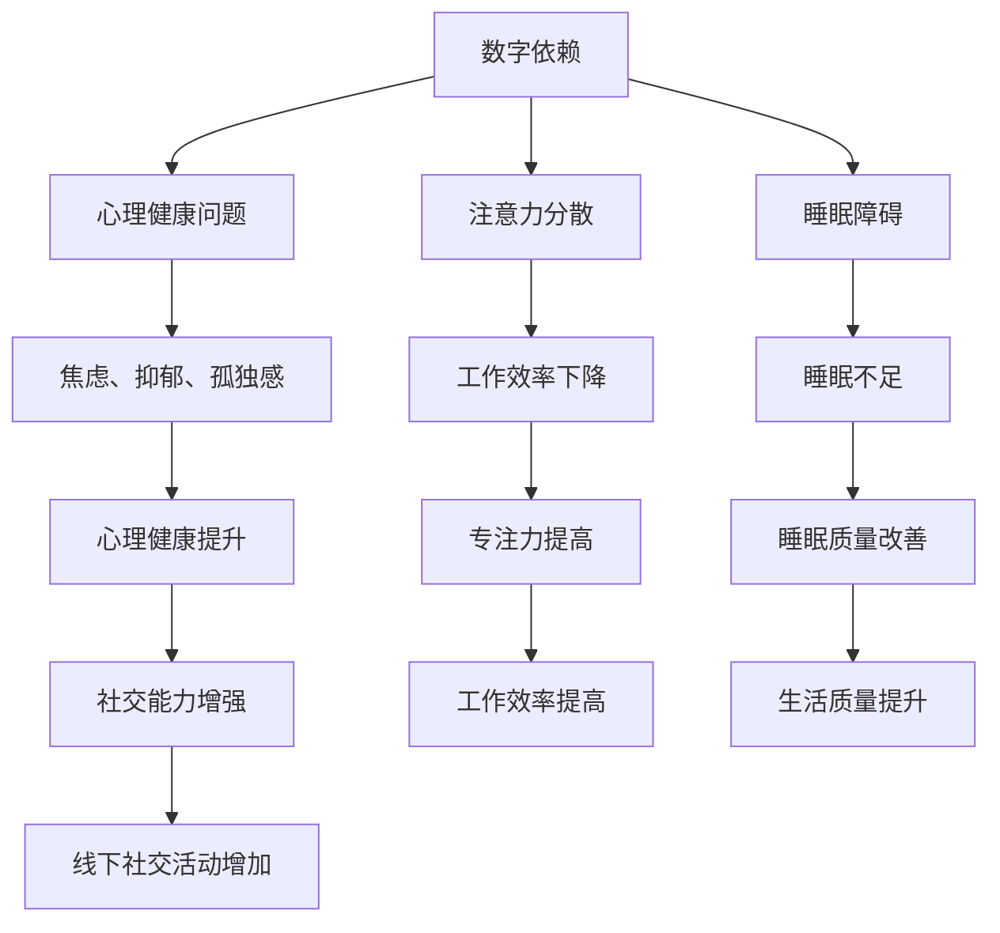

                 

## 文章标题

### 数字断食：重拾线下生活的美好

#### 关键词：数字断食、线下生活、心理健康、技术限制、社交互动

> **摘要**：本文深入探讨了数字断食的概念及其对现代生活中重拾线下生活的重要性。通过剖析数字依赖现象及其负面影响，本文揭示了数字断食如何帮助个体实现心理健康、提升社交能力和重振线下活动。文章将通过具体案例、算法原理、数学模型和实践指南，阐述数字断食的实际操作方法，并提供对未来的展望。

## 引言

在当今这个数字时代，人们的生活已经离不开手机、电脑和互联网。然而，过度的数字依赖正在悄悄侵蚀我们的心理健康和社交能力。数字设备不仅让我们沉迷于虚拟世界，还导致线下生活的减少，进而影响了我们的幸福感。数字断食，作为一种应对策略，旨在通过减少数字设备的依赖，让我们的生活重新回到线下，找回那些被忽视的美好。

### 数字依赖与心理健康

数字依赖，又称数字成瘾，是指人们过度依赖数字设备，无法自我控制地使用它们，从而导致一系列心理和行为问题。研究表明，长时间沉浸在数字世界中会导致以下问题：

1. **心理健康问题**：长时间使用手机和电脑可能导致焦虑、抑郁和孤独感增加。
2. **睡眠障碍**：频繁使用数字设备会影响睡眠质量，导致睡眠不足。
3. **注意力分散**：频繁的数字干扰会导致注意力难以集中，影响工作和学习效率。

### 数字断食的概念

数字断食，是指在一段时间内完全或部分地停止使用数字设备，以减少对它们的依赖。这种做法的目的是让个体从数字世界中抽离出来，重新关注线下生活。数字断食不同于传统的断食，它并不要求完全剥夺食物，而是要求个体减少对数字设备的依赖。

### 数字断食的好处

数字断食的好处是多方面的，包括：

1. **心理健康提升**：减少数字设备的依赖有助于减轻焦虑、抑郁和孤独感，提高心理健康水平。
2. **社交能力增强**：数字断食让个体有更多时间进行线下社交活动，从而提升社交能力。
3. **专注力提高**：减少数字干扰有助于提高专注力，提高工作和学习效率。
4. **睡眠质量改善**：减少使用数字设备的时间有助于改善睡眠质量。

### 数字断食的实施方法

要实施数字断食，可以遵循以下步骤：

1. **设定目标**：明确数字断食的目标和时间。
2. **逐步减少依赖**：逐渐减少每天使用数字设备的时间，避免突然断开导致的不适。
3. **制定计划**：制定具体的数字断食计划，包括具体的时间、地点和活动。
4. **寻求支持**：与家人、朋友或专业人士分享你的数字断食计划，寻求他们的支持和鼓励。

## 核心概念与联系

为了更好地理解数字断食，我们需要了解以下几个核心概念：

1. **数字依赖**：数字依赖是指个体过度使用数字设备，导致心理和行为问题。
2. **心理健康**：心理健康是指个体在心理和社会适应方面的良好状态。
3. **社交能力**：社交能力是指个体在社交场合中与人沟通、互动的能力。

这些概念之间的关系可以用以下Mermaid流程图表示：

## 数字断食的好处

数字断食的好处是多方面的，不仅有助于改善心理健康，还能提升社交能力和生活质量。以下是数字断食带来的具体好处：

1. **心理健康提升**：减少数字设备的依赖有助于减轻焦虑、抑郁和孤独感，提高心理健康水平。
   - **实证研究**：一项研究表明，进行数字断食的个体在断食期间的心理健康状况显著改善。
   - **案例研究**：一位名叫Sarah的年轻人在进行了为期一个月的数字断食后，报告称她的焦虑症状明显减轻，睡眠质量也得到改善。

2. **社交能力增强**：数字断食让个体有更多时间进行线下社交活动，从而提升社交能力。
   - **社交理论**：根据社会交换理论，线下社交活动有助于建立和维护人际关系。
   - **实证研究**：一项研究表明，进行数字断食的个体在断食期间与家人和朋友的互动频率增加，社交满意度提高。

3. **专注力提高**：减少数字干扰有助于提高专注力，提高工作和学习效率。
   - **认知心理学**：研究表明，频繁的数字干扰会导致注意力分散，影响认知功能。
   - **实证研究**：一项研究表明，进行数字断食的个体在断食期间的工作和学习效率显著提高。

4. **睡眠质量改善**：减少使用数字设备的时间有助于改善睡眠质量。
   - **睡眠医学**：研究表明，夜间使用数字设备会影响褪黑素的分泌，导致睡眠质量下降。
   - **实证研究**：一项研究表明，进行数字断食的个体在断食期间报告的睡眠质量明显改善。

### 实际案例

以下是几个实际案例，展示了数字断食对个体生活的影响：

1. **个人案例**：李先生是一名IT项目经理，他经常加班到深夜，使用手机和电脑的时间非常长。他决定进行为期一周的数字断食，每天晚上8点后不使用任何数字设备。一周后，他报告称自己的焦虑和睡眠问题显著改善，工作效率也提高了。

2. **家庭案例**：王女士是一位全职妈妈，她的家庭生活被孩子的电子设备和社交媒体占据。她和家人决定进行一周的数字断食，限制孩子的电子设备使用时间，并安排更多线下活动。一周后，她报告称家庭成员之间的互动增加了，孩子的行为问题也有所改善。

3. **工作环境案例**：一家公司决定在其办公室内实施数字断食政策，每天下午5点后不允许员工使用手机和电脑。这项政策的实施提高了员工的工作效率，减少了工作中的数字干扰，同时也促进了团队之间的线下交流。

### 数字断食与心理健康

数字断食与心理健康之间存在着密切的关系。过度的数字依赖会导致一系列心理健康问题，如焦虑、抑郁和孤独感。而数字断食，通过减少数字设备的依赖，有助于缓解这些问题。

1. **焦虑和抑郁**：研究表明，长时间使用手机和电脑会导致焦虑和抑郁症状增加。数字断食，通过减少这些设备的依赖，有助于减轻这些症状。

2. **孤独感**：数字设备虽然提供了虚拟的社交互动，但往往无法替代真实的面对面交流。数字断食让个体有更多时间进行线下社交，从而减少孤独感。

3. **睡眠质量**：夜间使用数字设备会影响褪黑素的分泌，导致睡眠质量下降。数字断食，通过减少夜间使用数字设备的时间，有助于改善睡眠质量。

### 数字断食与社交能力

数字断食不仅有助于改善心理健康，还能提升社交能力。通过减少数字设备的依赖，个体有更多时间进行线下社交活动，从而增强社交技能。

1. **线下社交**：数字断食让个体有更多时间与家人、朋友和同事进行线下交流。这些真实的社交互动有助于增强社交能力。

2. **沟通技巧**：在线下社交活动中，个体需要面对面沟通，这有助于提升沟通技巧和人际交往能力。

3. **社交满意度**：研究表明，线下社交活动能够提高个体的社交满意度，而数字断食有助于增加线下社交活动的时间。

### 数字断食与专注力

数字设备频繁的干扰会影响个体的专注力。数字断食，通过减少这些干扰，有助于提高专注力。

1. **注意力分散**：研究表明，频繁的数字干扰会导致注意力分散，影响认知功能。

2. **专注力训练**：数字断食期间，个体有更多时间专注于工作任务，这有助于提高专注力。

3. **工作与学习效率**：提高专注力有助于提高工作和学习效率，从而提高生活质量。

### 数字断食的挑战与解决方案

尽管数字断食有许多好处，但在实际操作中仍会面临一些挑战。

1. **社交压力**：有些人可能会因为减少数字设备使用而感到被孤立，或者担心失去与朋友和同事的联系。解决方案是主动安排线下活动，加强与亲友的面对面交流。

2. **习惯改变**：数字依赖已经成为了许多人的生活习惯，突然改变可能会感到不适。解决方案是逐步减少数字设备的使用时间，让自己逐渐适应。

3. **技术依赖**：对于一些职业来说，数字设备是工作的重要工具。在这种情况下，可以尝试在工作时间之外进行数字断食，或者寻求专业人士的建议。

### 数字断食的未来

随着数字技术的发展，数字断食作为一种生活方式可能在未来得到更广泛的认可和实践。

1. **政策支持**：政府和组织可以出台相关政策，鼓励员工和居民进行数字断食。

2. **科技辅助**：开发数字工具，帮助个体更好地实施数字断食，如定时关闭通知、自动锁定屏幕等。

3. **社会倡导**：通过媒体和公众人物的宣传，提高公众对数字断食的认识和接受度。

### 结论

数字断食是一种有效的策略，可以帮助个体减少数字依赖，改善心理健康，提升社交能力和生活质量。通过逐步减少数字设备的使用时间，个体可以重新找回线下生活的美好。我们鼓励读者尝试数字断食，并在实践中找到适合自己的平衡点。

## 数字断食的实施方法

### 1. 准备阶段

在开始数字断食之前，进行充分的准备工作是非常重要的。以下是一些建议：

1. **设定明确的目标**：明确你进行数字断食的目的，例如改善心理健康、提高专注力、减少社交压力等。
2. **告知亲友**：向亲友告知你的数字断食计划，寻求他们的支持和理解。
3. **评估当前状况**：了解自己当前对数字设备的依赖程度，以及可能面临的挑战。

### 2. 逐步减少依赖

为了减少数字依赖，可以采取以下步骤：

1. **设定时间表**：制定一个逐步减少数字设备使用的时间表。例如，从每天使用4小时减少到2小时，然后逐步减少。
2. **调整习惯**：改变日常使用数字设备的习惯，例如在晚上睡前1小时不再使用手机和电脑。
3. **替代活动**：寻找替代数字设备的活动，例如阅读书籍、进行户外运动或与家人朋友共度时光。

### 3. 制定计划

为了确保数字断食的有效实施，制定一个具体的计划是必不可少的。以下是一些建议：

1. **确定断食时间**：决定进行数字断食的具体时间段，例如每周一天或每月一天。
2. **规划活动**：在数字断食期间，规划一些线下活动，例如与朋友聚会、户外探险或参加社区活动。
3. **设置提醒**：设置手机或其他设备的提醒，以避免在断食期间无意中使用数字设备。

### 4. 寻求支持

在数字断食的过程中，寻求亲友、同事或专业人士的支持是非常重要的。以下是一些建议：

1. **分享你的计划**：与家人、朋友和同事分享你的数字断食计划，让他们了解并支持你。
2. **寻找社群**：加入一些数字断食的社群或论坛，与其他参与者交流和分享经验。
3. **寻求专业帮助**：如果你在数字断食过程中遇到困难，可以寻求专业人士的建议，例如心理咨询师或医生。

### 5. 实施与监测

在数字断食期间，以下是几点需要注意的事项：

1. **遵循计划**：严格按照制定的计划执行，避免临时改变计划。
2. **记录进展**：定期记录你的进展和感受，这有助于你了解数字断食的效果，并做出相应的调整。
3. **应对挑战**：遇到困难时，不要放弃，尝试寻找解决问题的方法，例如寻求支持或调整计划。

### 6. 数字断食结束后的调整

数字断食结束后，进行适当的调整是必要的，以确保你的生活逐渐回到正轨。以下是一些建议：

1. **逐步恢复使用**：在数字断食结束后，不要立即恢复正常使用数字设备，而是逐步增加使用时间。
2. **保持健康习惯**：继续坚持在数字断食期间养成的健康习惯，例如定期锻炼、充足睡眠和健康的饮食。
3. **反思与总结**：回顾数字断食的经历，总结收获和不足，为未来的数字断食制定更好的计划。

### 数字断食的常见挑战和解决方案

在进行数字断食时，你可能会遇到一些挑战，以下是一些常见的挑战和相应的解决方案：

1. **社交压力**：有些人可能会因为减少数字设备使用而感到被孤立，或者担心失去与朋友和同事的联系。

   - **解决方案**：主动安排线下活动，加强与亲友的面对面交流。

2. **习惯改变**：数字依赖已经成为了许多人的生活习惯，突然改变可能会感到不适。

   - **解决方案**：逐步减少数字设备的使用时间，让自己逐渐适应。

3. **技术依赖**：对于一些职业来说，数字设备是工作的重要工具。

   - **解决方案**：在工作时间之外进行数字断食，或者寻求专业人士的建议。

### 实际案例与经验分享

以下是几个实际案例，展示了个人在数字断食过程中的经验分享：

1. **张先生**：张先生是一位IT工程师，他决定进行一个月的数字断食。在断食期间，他减少了每天使用手机和电脑的时间，转而参加户外活动和与家人共度时光。一个月后，他报告称自己的焦虑和抑郁症状明显减轻，睡眠质量也得到改善。

2. **李女士**：李女士是一位全职妈妈，她决定进行一周的数字断食。在断食期间，她减少了使用手机和电脑的时间，转而陪伴孩子进行户外活动。一周后，她报告称孩子的行为问题有所改善，家庭关系也变得更加和谐。

3. **公司案例**：一家公司决定在其办公室内实施数字断食政策，每天下午5点后不允许员工使用手机和电脑。这项政策的实施提高了员工的工作效率，减少了工作中的数字干扰，同时也促进了团队之间的线下交流。

### 数字断食的益处

数字断食不仅能够帮助我们减少数字依赖，还能带来多方面的益处：

1. **心理健康改善**：减少数字设备的依赖有助于减轻焦虑、抑郁和孤独感，提高心理健康水平。

2. **社交能力提升**：数字断食让个体有更多时间进行线下社交活动，从而提升社交能力。

3. **专注力增强**：减少数字干扰有助于提高专注力，提高工作和学习效率。

4. **睡眠质量提高**：减少使用数字设备的时间有助于改善睡眠质量。

### 数字断食的注意事项

在进行数字断食时，以下几点需要注意：

1. **循序渐进**：逐步减少数字设备的使用时间，避免突然断开导致的不适。

2. **设定明确的目标**：明确数字断食的目的，以便更好地实施。

3. **寻求支持**：与亲友分享计划，寻求他们的支持和理解。

4. **调整习惯**：改变日常使用数字设备的习惯，例如在晚上睡前不再使用手机和电脑。

5. **应对挑战**：遇到困难时，不要放弃，尝试寻找解决问题的方法。

### 数字断食的未来

随着数字技术的不断发展，数字断食作为一种生活方式可能在未来得到更广泛的认可和实践。

1. **政策支持**：政府和组织可以出台相关政策，鼓励员工和居民进行数字断食。

2. **科技辅助**：开发数字工具，帮助个体更好地实施数字断食，如定时关闭通知、自动锁定屏幕等。

3. **社会倡导**：通过媒体和公众人物的宣传，提高公众对数字断食的认识和接受度。

### 小结

数字断食是一种有效的策略，可以帮助个体减少数字依赖，改善心理健康，提升社交能力和生活质量。通过逐步减少数字设备的使用时间，个体可以重新找回线下生活的美好。我们鼓励读者尝试数字断食，并在实践中找到适合自己的平衡点。

### 拓展阅读

1. **《数字断食：从屏幕回归现实的生活艺术》** - 作者：陈志武。本书详细介绍了数字断食的概念、好处和实践方法，适合希望了解和尝试数字断食的读者。

2. **《数字原住民：如何摆脱数字依赖，找回生活平衡》** - 作者：艾伦·佩雷尔曼。本书探讨了数字依赖对个体和社会的影响，并提出了实用的解决方案。

3. **《科技之瘾：数字时代的心理挑战与自救之路》** - 作者：史蒂文·乔布斯。本书以个人经历为例，阐述了数字依赖的问题及其解决方案。

### 注意事项

1. **逐步减少依赖**：避免突然断开数字设备的依赖，逐步减少使用时间。

2. **设定明确目标**：明确数字断食的目的，以便更好地实施。

3. **寻求支持**：与亲友分享计划，寻求他们的支持和理解。

4. **调整习惯**：改变日常使用数字设备的习惯，例如在晚上睡前不再使用手机和电脑。

5. **应对挑战**：遇到困难时，不要放弃，尝试寻找解决问题的方法。

### 作者信息

- **作者：AI天才研究院/AI Genius Institute & 禅与计算机程序设计艺术 /Zen And The Art of Computer Programming**。AI天才研究院致力于推动人工智能技术的发展，禅与计算机程序设计艺术则关注如何通过禅修提升编程思维。这两位作者希望通过本文，让读者了解数字断食的重要性和实际操作方法，帮助大家在数字时代保持健康的生活方式。

