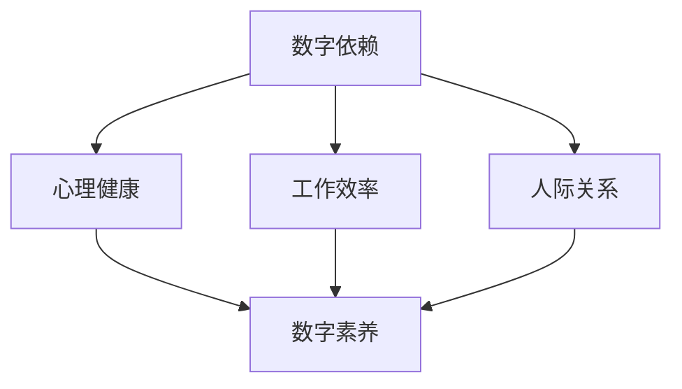

                 

### 标题和关键词

# 数字断食：重新定义在线与离线的意义边界

> 关键词：数字断食、在线与离线、数字化生活方式、心理健康、社会影响、教育模式

> 摘要：本文深入探讨了数字断食的概念及其对在线与离线意义边界的重新定义。通过分析数字时代的反思、数字断食的理论基础和实际案例，我们探讨了数字断食对个人、企业、心理健康、社交网络、工作效率和教育模式的多方面影响。本文旨在提供一种全新的数字化生活方式，引导读者思考如何在科技浪潮中保持平衡与健康。

### 引言

随着科技的迅猛发展，我们的生活方式发生了翻天覆地的变化。数字化成为了我们日常生活和工作中不可或缺的一部分。从智能手机到智能家居，从在线办公到电子商务，数字技术无处不在，深刻地影响着我们的行为模式和社会结构。然而，这种高度数字化的生活方式也带来了一系列问题，如数字依赖、心理健康问题、工作效率下降等。在这个背景下，数字断食应运而生，成为一种重新定义在线与离线意义边界的实践方式。

数字断食并不是指完全放弃数字技术，而是有意识地减少对数字设备的依赖，给自己一段时间的数字“休息”，以实现身心健康和生活方式的平衡。本文将深入探讨数字断食的概念、理论基础、实际案例以及对个人、企业、心理健康、社交网络、工作效率和教育模式的多方面影响，旨在为读者提供一种全新的数字化生活方式的思考。

### 数字时代的反思

进入21世纪，数字技术迅猛发展，不仅改变了我们的生活方式，还深刻地影响了我们的社会结构。智能手机、互联网、社交媒体等数字工具的普及，使得我们几乎无时无刻不与数字世界保持连接。这种高度连接的生活方式带来了一定的便利，但同时也引发了许多问题。

首先，数字依赖成为了一个不容忽视的问题。越来越多的人沉迷于手机和互联网，导致生活质量下降，人际关系疏远。其次，心理健康问题也随之而来。研究表明，长时间使用数字设备可能导致焦虑、抑郁、注意力不集中等问题。此外，工作效率的下降也是一个显著的问题。许多人抱怨在数字化环境中，他们感到压力巨大，难以集中精力完成任务。

面对这些问题，我们需要重新思考数字技术在我们生活中的角色。数字断食提供了一个可能的解决方案。它鼓励我们定期从数字世界中抽离，给自己一段时间的休息，以缓解数字依赖、改善心理健康、提高工作效率。通过数字断食，我们可以在享受数字技术带来的便利的同时，保持身心健康和生活方式的平衡。

### 数字断食的概念与意义

数字断食（Digital Detox）是一种有意识地减少对数字设备依赖的实践方式，旨在通过一段时间的数字“休息”来改善身心健康和生活方式。数字断食并不仅仅是简单地远离数字设备，而是一种更深入的生活方式调整。它涉及到对数字使用的自我控制和有意识的选择，以实现身心的平衡与健康。

数字断食的核心目标是：

1. **减少数字依赖**：通过限制使用数字设备的时间，帮助人们减少对数字的依赖，从而提高生活质量。
2. **改善心理健康**：数字断食有助于缓解焦虑、抑郁、注意力不集中等心理健康问题，提高整体心理健康水平。
3. **提高工作效率**：减少数字干扰，帮助人们更加专注和高效地完成任务。
4. **重建人际关系**：通过减少对数字设备的依赖，人们有更多时间和精力与家人、朋友面对面交流，改善人际关系。

数字断食不仅仅是个人层面的调整，它也对企业和社会产生了深远的影响。对企业而言，数字断食可以提高员工的工作效率，改善员工的心理健康，从而提升整体企业绩效。对社会而言，数字断食有助于减少数字鸿沟，改善社会结构，促进可持续发展。

### 数字断食的历史与现状

数字断食这一概念虽然近年来才逐渐被人们广泛接受，但其起源和发展历程可以追溯到更早的时期。早在20世纪末，就有一些哲学家和科技评论家开始反思数字技术的负面影响，并提出了一些类似的概念。

#### 1. 数字断食的起源

数字断食的起源可以追溯到1995年，当时的美国科技评论家杰克·基尔迪奇（Jack Kornfield）在《数字生活：网络时代的觉醒》（Digital Diet: The Awakening in the Age of the Internet）一书中首次提出了“数字饮食”（Digital Diet）的概念。他认为，人们应该有意识地控制自己对数字技术的使用，以保持身心健康。

#### 2. 数字断食的发展

随着数字技术的迅猛发展，数字断食的概念逐渐被更多人接受。2010年，美国心理学家乔恩·卡巴提利安（Jon Kabat-Zinn）在《数字排毒：重新连接你的心智，找回真正的幸福》（The Digital Detox: Unlocking the Power of the Human-Machine Interface）一书中，进一步扩展了数字断食的概念，提出了通过数字排毒来改善生活质量的思路。

#### 3. 数字断食的现状

近年来，数字断食已经成为一种全球性的趋势。许多国家都在推广数字断食，鼓励人们定期进行数字休息。例如，芬兰政府已经推出了一项名为“数字一周”的计划，鼓励公民在每周的一天停止使用数字设备。在中国，数字断食也逐渐受到关注，许多企业和学校开始实施类似的数字休息政策。

#### 4. 数字断食在中国的发展

在中国，数字断食的概念虽然相对较新，但已经开始受到广泛关注。许多企业和学校已经开始尝试实施数字断食政策，以改善员工和学生的心理健康和工作/学习效率。例如，一些科技公司已经开始在员工中推广数字断食，提供专门的数字休息日，以帮助员工缓解工作压力。此外，一些学校也开始尝试在学生中推广数字断食，减少学生对智能手机和社交媒体的依赖，提高学习效果。

总之，数字断食作为一种新的生活方式实践，正在全球范围内迅速发展。通过有意识的数字休息，我们可以更好地平衡数字生活与身心健康，为未来的生活和工作奠定坚实的基础。

### 核心概念与联系

为了深入理解数字断食，我们需要明确几个核心概念，并探讨它们之间的关系。以下是数字断食中的关键概念及其相互联系：

#### 1. 数字依赖

数字依赖指的是个体对数字设备（如智能手机、电脑、平板电脑等）的过度使用，导致其身心健康和社会功能受损的现象。数字依赖可能表现为长时间使用数字设备、无法控制使用时间、对数字设备产生强烈的心理依赖等。

#### 2. 心理健康

心理健康是指个体在情感、认知和行为方面的良好状态。心理健康与数字依赖之间存在密切的联系。研究表明，过度使用数字设备可能导致焦虑、抑郁、注意力不集中等问题，从而影响心理健康。

#### 3. 工作效率

工作效率指的是个体在特定时间内完成工作任务的能力。数字依赖常常导致注意力分散、疲劳感增加，从而降低工作效率。通过数字断食，个体可以减少数字干扰，提高专注力和工作效率。

#### 4. 人际关系

人际关系是指个体与家人、朋友、同事等社会成员之间的互动。数字依赖可能使个体沉迷于虚拟社交，而忽视了现实生活中的人际关系。数字断食有助于个体重新平衡数字生活与现实生活，改善人际关系。

#### 5. 数字素养

数字素养是指个体在数字环境中获取、评估和使用信息的能力。数字素养不仅包括技术技能，还涉及对数字设备和网络使用的道德和法律认识。数字断食可以帮助个体培养良好的数字素养，更理性地使用数字技术。

这些概念之间的关系可以用以下Mermaid流程图来表示：



在这个流程图中，数字依赖是核心概念，它直接影响心理健康、工作效率和人际关系，并通过这些方面间接影响数字素养。心理健康、工作效率和人际关系都是数字断食的受益领域，而数字素养则是实现这些受益的重要保障。

通过这个流程图，我们可以更清晰地理解数字断食的核心概念及其相互联系，为后续章节的理论和实践讨论奠定基础。

### 数字断食的核心原则

数字断食的核心原则是帮助个体实现身心健康和生活方式的平衡。以下是数字断食的五大核心原则，每个原则都包含了具体的执行方法和注意事项。

#### 1. 定期休息

定期休息是数字断食的基础。通过定期设定休息日，个体可以在短时间内完全脱离数字设备，以恢复身心。执行方法包括：

- **每周设定一天为数字休息日**：在这一天中，完全避免使用数字设备，包括手机、电脑、电视等。
- **睡前一小时不使用数字设备**：这有助于改善睡眠质量。

注意事项：

- **提前告知家人和朋友**：确保他们在休息日中不会给你发送重要信息。
- **设立替代活动**：在休息日中，可以安排一些替代活动，如阅读书籍、散步、冥想等。

#### 2. 限制使用时间

限制使用时间是数字断食的关键策略之一。通过设定每日使用数字设备的时间，个体可以减少对数字的依赖。执行方法包括：

- **每天设定固定的使用时间**：例如，每天不超过2小时。
- **使用应用或工具来监控使用时间**：例如，使用“数字健康”功能来监控手机使用时间。

注意事项：

- **逐步减少使用时间**：不要突然大幅度减少使用时间，以免造成心理压力。
- **设定明确的目标**：例如，每天减少5分钟的数字设备使用时间。

#### 3. 自我监控

自我监控是数字断食的重要一环。通过记录数字设备使用情况，个体可以更好地了解自己的数字使用习惯，并做出相应的调整。执行方法包括：

- **记录数字设备使用情况**：每天或每周记录使用时间和使用目的。
- **定期回顾记录**：通过回顾记录，个体可以发现并纠正不良的数字使用习惯。

注意事项：

- **保持诚实和客观**：记录时要真实反映自己的数字使用情况。
- **设定改进目标**：根据回顾结果，设定具体的改进目标。

#### 4. 增强数字素养

增强数字素养是数字断食的目标之一。通过提高对数字设备和网络使用的认识和技能，个体可以更理性地使用数字技术，减少依赖。执行方法包括：

- **学习数字素养知识**：阅读相关书籍、文章，了解数字素养的重要性。
- **参加数字素养培训**：参加线上或线下的培训课程，提高数字技能。

注意事项：

- **理论与实践结合**：不仅要学习知识，还要在实际中应用。
- **持续学习**：数字技术和网络环境不断变化，需要不断更新知识。

#### 5. 调整生活方式

调整生活方式是数字断食的终极目标。通过改变生活习惯，个体可以建立更健康的生活方式，减少对数字的依赖。执行方法包括：

- **增加户外活动**：例如，每天散步、跑步或进行其他户外运动。
- **培养兴趣爱好**：例如，学习乐器、绘画、烹饪等。

注意事项：

- **逐步调整**：不要一次性改变所有生活习惯，以免造成心理和身体上的负担。
- **寻求支持**：与家人和朋友分享你的计划，获得他们的支持和理解。

通过遵循这些核心原则，个体可以在数字生活中找到平衡，实现身心健康和生活方式的改善。这些原则不仅适用于个人，也适用于企业和教育机构，可以帮助我们构建一个更健康、更平衡的数字化社会。

### 数字断食的方法论

数字断食不仅是一种理念，更是一套具体的方法论，通过系统的实践步骤和策略，我们可以有效地减少对数字设备的依赖，改善身心健康。以下是一些关键的方法和策略：

#### 1. 制定计划

首先，制定一个详细的数字断食计划至关重要。这个计划应该包括以下要素：

- **目标设定**：明确你的数字断食目标，例如减少每天使用手机的时间、每周设定固定的休息日等。
- **时间安排**：规划每天、每周、每月的数字使用时间和休息时间，确保计划具有可执行性和可持续性。
- **提醒工具**：可以使用手机的应用程序或日历来提醒你遵守计划。

#### 2. 慢性减少使用时间

数字断食并不是一蹴而就的过程，而是需要逐步减少使用时间。以下是一些具体策略：

- **设定时间段**：将每天使用数字设备的时间分为几个时间段，例如工作、休闲、学习等。
- **逐步减少**：每天减少5分钟的使用时间，逐渐增加休息时间。
- **定期评估**：每隔一段时间，回顾自己的数字使用情况，并根据评估结果调整计划。

#### 3. 寻求支持

数字断食的过程可能会遇到挑战和障碍，因此寻求支持和理解非常重要：

- **告知家人和朋友**：告诉他们你的计划，并请求他们的支持和理解。
- **寻找同伴**：加入数字断食小组或寻找志同道合的伙伴，相互鼓励和监督。
- **专业人士咨询**：如果遇到困难，可以寻求心理咨询师或数字健康专家的帮助。

#### 4. 替代活动

在减少数字设备使用的同时，寻找替代活动有助于缓解依赖：

- **户外活动**：例如，散步、跑步、骑自行车等。
- **兴趣爱好**：例如，阅读、绘画、音乐、园艺等。
- **社交互动**：与家人、朋友面对面交流，参加社区活动。

#### 5. 数字设备管理

有效管理数字设备是数字断食的重要组成部分：

- **设备整理**：定期清理设备中的无用应用和数据，减少干扰。
- **应用限制**：使用应用锁定功能，限制访问特定应用或功能。
- **屏幕时间监控**：使用内置的屏幕时间监控工具，了解自己的设备使用情况。

#### 6. 心理调适

数字断食不仅需要行为上的调整，还需要心理上的支持：

- **冥想和放松**：通过冥想、深呼吸、瑜伽等放松技巧，缓解焦虑和压力。
- **自我反思**：定期进行自我反思，了解自己的数字使用习惯和心理状态。

#### 7. 长期坚持

数字断食不是短期行为，而是一种长期的生活方式调整：

- **习惯养成**：将数字断食融入日常生活，逐步形成习惯。
- **持续监控**：定期回顾自己的数字使用情况，并根据反馈进行调整。

通过这些方法论和策略，我们可以更有效地实践数字断食，减少对数字设备的依赖，改善身心健康，实现数字生活的平衡与健康。

### 数字断食案例分析

为了更直观地了解数字断食的实际效果，以下将介绍两个真实的数字断食案例，分析其实践过程、收获和挑战。

#### 案例一：一位普通白领的数字断食体验

李明是一位30岁的普通白领，日常工作需要长时间使用电脑和手机。李明在一年前开始感受到工作压力和心理健康问题，因此决定尝试数字断食。

**实践过程**：
1. **制定计划**：李明首先制定了详细的数字断食计划，每周设定一个休息日，每天晚上9点后不使用手机。
2. **逐步减少使用时间**：李明开始每天减少5分钟的手机使用时间，逐步增加休息时间。
3. **寻求支持**：李明告知家人和朋友自己的计划，并得到了他们的支持。
4. **替代活动**：李明开始参加户外活动，如晨跑和瑜伽，以替代手机时间。

**收获**：
1. **心理健康改善**：李明报告说，数字断食后，他的焦虑和压力感明显减轻，睡眠质量也得到了提升。
2. **工作效率提高**：由于减少了手机干扰，李明在工作中的专注力显著增强，工作效率也随之提高。

**挑战**：
1. **初期的不适应**：李明在初期数字断食时，感到无法控制自己的手机使用冲动，需要通过自我监控和提醒来维持计划。
2. **社交网络的依赖**：尽管李明减少了手机使用时间，但他发现社交网络仍然对他的心理健康产生影响。

#### 案例二：一位企业家的数字断食之旅

张华是一位成功的企业家，她的公司在数字化时代中运营，因此她发现自己和员工都深受数字依赖的困扰。在经过深思熟虑后，张华决定在公司内推广数字断食。

**实践过程**：
1. **公司内部宣传**：张华在公司内部组织了关于数字断食的讲座和研讨会，提高员工对数字断食的认识。
2. **设定数字休息日**：公司每周设定一个数字休息日，员工可以在这天完全停止使用手机和电脑。
3. **提供替代活动**：公司组织了户外团建活动和运动课程，鼓励员工在休息日参与。
4. **技术支持**：公司提供了应用锁定和屏幕时间监控工具，帮助员工管理数字设备使用时间。

**收获**：
1. **员工心理健康提升**：员工报告说，数字断食后，他们的工作压力减轻，心理健康状况改善，工作效率提高。
2. **企业文化建设**：数字断食活动增强了员工的凝聚力和对公司文化的认同感。

**挑战**：
1. **初期的不接受**：一些员工对数字断食持怀疑态度，认为这会降低工作效率。
2. **技术实施难度**：公司需要投入一定资源来支持数字断食的实施，例如提供替代活动和培训。

通过这两个案例，我们可以看到数字断食在实际应用中的效果和挑战。尽管存在一些困难，但数字断食为个人和企业提供了改善身心健康的有效途径，值得进一步推广和实践。

### 数字断食在企业中的应用

数字断食不仅仅适用于个人层面，在企业管理中同样具有广泛的应用前景。通过实施数字断食，企业可以提高员工的工作效率，改善心理健康，从而提升整体绩效。以下是数字断食在企业中的具体应用和实践策略：

#### 1. 提高工作效率

数字依赖常常导致员工在工作中注意力分散，降低工作效率。通过数字断食，企业可以减少员工对数字设备的依赖，帮助他们更专注于工作任务。具体策略包括：

- **设定数字休息日**：每周为员工设定一天为数字休息日，这一天员工可以完全停止使用手机和电脑，专注于工作。
- **限制工作时间内使用数字设备**：设定每天的工作时间，例如每天不超过2小时，以减少不必要的干扰。

#### 2. 改善心理健康

长时间使用数字设备可能导致员工出现焦虑、抑郁、失眠等心理健康问题。数字断食有助于缓解这些问题，提高员工的身心健康。具体策略包括：

- **提供数字素养培训**：通过培训，帮助员工认识到数字依赖的危害，学会有效地管理数字设备使用时间。
- **组织心理健康活动**：例如，提供心理健康讲座、心理咨询、瑜伽课程等，帮助员工缓解压力，提升心理健康。

#### 3. 增强团队凝聚力

数字断食不仅可以改善个体员工的身心健康，还可以增强团队的凝聚力和协作精神。通过共同参与数字断食活动，团队成员可以建立更紧密的联系，提升团队士气。具体策略包括：

- **团队数字休息日**：定期组织团队数字休息活动，例如户外团建、体育比赛等，让员工在放松的同时加强团队互动。
- **共同目标设定**：设定团队共同的目标，例如减少团队整体数字设备使用时间，通过团队协作实现目标。

#### 4. 优化工作环境

通过数字断食，企业可以优化工作环境，减少不必要的数字干扰，提高员工的工作效率。具体策略包括：

- **改善工作场所设计**：例如，设置专门的休息区域，提供舒适的阅读和放松环境。
- **限制工作场所中的数字设备使用**：在工作场所内限制员工使用手机和电脑，鼓励面对面交流和实际工作。

#### 5. 企业文化推广

数字断食是一种健康的生活方式和工作态度，通过在企业文化中推广数字断食理念，企业可以塑造健康、积极的企业文化。具体策略包括：

- **领导示范**：企业领导应率先实施数字断食，树立榜样，带动全体员工共同参与。
- **内部宣传**：通过内部邮件、公告栏、社交媒体等渠道，宣传数字断食的重要性和好处，提高员工的认知。

#### 案例分析

以下是一个企业成功实施数字断食的案例分析：

**案例背景**：某大型科技公司发现其员工在数字化环境中工作压力较大，工作效率不高，心理健康问题突出。为了改善这些问题，公司决定在公司内部推广数字断食。

**实施过程**：
1. **制定数字断食政策**：公司制定了详细的数字断食政策，包括每周设定一个数字休息日，每天限制使用数字设备的时间。
2. **培训与教育**：公司组织了数字素养培训，帮助员工认识到数字依赖的危害，学会有效地管理数字设备使用时间。
3. **员工参与**：公司鼓励员工积极参与数字断食活动，提供替代活动如户外运动、团队建设活动等。
4. **领导支持**：公司领导积极参与数字断食活动，并在公司内部树立了良好的示范作用。

**效果评估**：
1. **工作效率提升**：员工报告说，数字断食后，他们在工作中的专注力显著增强，工作效率提高。
2. **心理健康改善**：员工的心理健康问题得到了明显缓解，焦虑和压力感减少，睡眠质量提升。
3. **团队凝聚力增强**：数字断食活动增强了团队成员之间的互动和信任，团队凝聚力显著提升。

**结论**：通过在企业管理中实施数字断食，该科技公司成功提高了员工的工作效率和心理健康水平，增强了团队凝聚力，为企业文化的建设奠定了坚实的基础。这一案例表明，数字断食在企业管理中具有广泛的应用前景，值得其他企业借鉴和推广。

### 数字断食对心理健康的影响

数字断食对心理健康产生了显著的影响，通过减少数字依赖，它帮助改善了焦虑、抑郁和注意力不集中等问题。以下是数字断食如何影响心理健康的详细分析：

#### 1. 焦虑的缓解

焦虑是一种常见的心理健康问题，特别是在现代社会中，由于数字设备的过度使用，焦虑症状更加普遍。数字断食通过减少对数字设备的依赖，为个体提供了宝贵的时间来放松和恢复。以下是一些具体机制：

- **减少刺激**：数字设备如手机和电脑会不断推送通知和消息，这些刺激会加剧焦虑感。通过数字断食，个体可以减少这些刺激，从而减轻焦虑症状。
- **增强自我控制**：数字断食帮助个体建立对数字设备使用的自我控制能力，这种自我控制感的增强有助于缓解焦虑。

#### 2. 抑郁的改善

抑郁是另一种常见的心理健康问题，与数字依赖密切相关。数字断食为个体提供了一个逃离数字世界的机会，有助于改善抑郁症状。具体机制包括：

- **增加社交互动**：数字断食期间，个体有更多时间和精力与家人和朋友面对面交流，这种社交互动有助于减轻抑郁情绪。
- **减少自我隔离**：长时间使用数字设备可能导致个体陷入自我隔离的状态，而数字断食有助于打破这种隔离，促进身心健康。

#### 3. 注意力不集中的缓解

现代社会的快节奏生活导致许多人无法集中注意力，数字设备的使用进一步加剧了这一问题。数字断食通过以下机制帮助缓解注意力不集中：

- **减少干扰**：数字设备如手机和电脑经常成为注意力分散的源头。通过数字断食，个体可以减少这些干扰，从而更容易集中注意力。
- **增强专注力**：数字断食有助于个体培养专注力，这种专注力的增强可以在日常生活中得到延续，提高工作效率和生活质量。

#### 4. 心理健康的长期效果

数字断食不仅能够缓解短期内的心理健康问题，还具有长期的积极影响：

- **提高心理健康韧性**：通过定期进行数字断食，个体可以增强对压力的应对能力，提高心理韧性。
- **改善整体生活质量**：减少数字依赖有助于个体建立更健康的生活方式，改善整体生活质量。

#### 案例研究

为了更好地理解数字断食对心理健康的影响，以下是一个真实的案例研究：

**案例背景**：一位名叫小丽的年轻职场女性，她每天使用手机和电脑的时间超过10小时，经常感到焦虑、抑郁和注意力不集中。在尝试了多种方法改善心理健康后，她决定进行数字断食。

**实践过程**：
1. **制定数字断食计划**：小丽首先制定了详细的数字断食计划，每周设定一天为数字休息日，每天晚上9点后不使用手机。
2. **逐步减少使用时间**：小丽开始每天减少5分钟的数字设备使用时间，逐步增加休息时间。
3. **寻求支持**：小丽告知家人和朋友自己的计划，并得到了他们的支持。

**收获**：
1. **焦虑减轻**：数字断食后，小丽的焦虑感明显减轻，她感觉更加平静和放松。
2. **抑郁改善**：通过减少数字依赖，小丽的抑郁症状得到了显著改善，她的情绪更加稳定。
3. **注意力集中**：由于减少了手机和电脑的干扰，小丽在工作中的专注力显著增强，工作效率提高。

**挑战**：
1. **初期的不适应**：在数字断食初期，小丽感到很难控制自己的手机使用冲动，需要通过自我监控和提醒来维持计划。
2. **社交网络的依赖**：尽管小丽减少了手机使用时间，但她发现社交网络仍然对她的心理健康产生影响。

通过这个案例，我们可以看到数字断食对缓解焦虑、抑郁和注意力不集中具有显著效果，同时也会遇到一些挑战。然而，这些挑战通过持续的努力和支持可以逐步克服，数字断食为改善心理健康提供了一种有效途径。

### 数字断食与心理健康的结合

数字断食不仅仅是减少对数字设备的依赖，它还与心理健康紧密相连，通过多方面的结合，可以更有效地实现心理健康的改善。以下是数字断食与心理健康结合的具体方法和应用：

#### 1. 心理咨询与数字断食的结合

心理咨询是帮助个体解决心理健康问题的有效手段，而数字断食可以作为心理咨询的一个补充工具。以下是一些结合方法：

- **定期数字休息**：心理咨询师可以建议患者在治疗期间定期进行数字休息，以减少数字干扰，提高治疗效果。
- **家庭作业**：心理咨询师可以布置数字断食的家庭作业，帮助患者逐步减少对数字设备的依赖，并在现实生活中找到替代活动。

#### 2. 数字素养教育与数字断食的结合

数字素养教育旨在提高个体对数字设备和网络使用的认识和技能，而数字断食可以作为一种实践工具，帮助学生更好地理解数字素养的重要性。以下是一些结合方法：

- **课堂实践**：学校可以安排数字素养教育课程，同时引入数字断食实践，让学生体验减少数字依赖的生活，加深对数字素养的认识。
- **项目式学习**：学生可以通过参与项目式学习，如设计数字断食应用程序，将数字素养与实际应用相结合。

#### 3. 自我监控与数字断食的结合

自我监控是数字断食的核心策略之一，它也可以与心理健康监测工具结合，帮助个体更好地管理自己的心理健康。以下是一些结合方法：

- **使用应用**：心理健康应用可以与数字断食应用结合，帮助用户记录数字设备使用情况和心理健康状况，实现自我监控和反馈。
- **数据分析**：通过分析用户的数据，心理健康专家可以提供个性化的建议和指导，帮助用户更有效地进行数字断食。

#### 4. 数字疗法与数字断食的结合

数字疗法是一种利用数字技术治疗心理问题的方法，而数字断食可以作为数字疗法的一个环节，帮助患者实现心理恢复。以下是一些结合方法：

- **数字断食前评估**：在开始数字疗法之前，对患者进行数字断食前的心理健康评估，了解其数字依赖程度和心理健康状况。
- **数字断食后的跟踪**：在完成数字疗法后，通过数字断食进行跟踪和评估，观察治疗效果的持续性和心理健康改善情况。

#### 5. 社区支持与数字断食的结合

社区支持在心理健康中扮演重要角色，而数字断食可以在社区层面进行推广，帮助更多人实现心理健康。以下是一些结合方法：

- **社区活动**：社区可以组织数字断食活动，如讲座、研讨会、工作坊等，提高居民对数字断食的认识和参与度。
- **互助小组**：建立数字断食互助小组，让参与者分享经验、提供支持和鼓励，共同实现心理健康目标。

通过这些具体方法和应用，数字断食与心理健康可以更好地结合，为个体提供更全面的支持和指导，实现身心健康的目标。

### 数字断食对社会的影响

数字断食不仅仅对个人心理健康有显著影响，它还对社会层面产生了深远的影响，尤其是在社交网络、工作效率、教育模式等方面。以下是数字断食对社会各领域的具体影响及其潜在挑战。

#### 1. 对社交网络的影响

数字断食有助于减少社交网络的依赖，促进更真实的面对面社交。以下是一些具体影响：

- **促进真实社交**：减少对社交媒体的依赖，人们有更多时间和精力投入到现实生活中，建立更真实的社交关系。
- **改善人际关系**：通过减少数字干扰，人们能够更好地关注和倾听他人，提升人际沟通质量。

**潜在挑战**：
- **社交网络成瘾**：尽管数字断食有助于减少社交网络依赖，但一些用户可能仍难以完全摆脱社交网络成瘾的问题。
- **信息过载**：在减少社交媒体使用后，人们可能会面临信息获取的挑战，需要找到替代信息来源。

#### 2. 对工作效率的影响

数字断食有助于提高工作效率，减少工作压力。以下是一些具体影响：

- **增强专注力**：减少数字干扰，员工能够更专注地完成任务，提高工作效率。
- **减少疲劳感**：定期进行数字断食，有助于缓解工作压力，减少疲劳感，提高工作满意度。

**潜在挑战**：
- **初期适应困难**：员工在初期可能难以适应减少数字设备使用的时间，需要时间逐步调整。
- **技术依赖性**：一些员工可能对数字设备过于依赖，难以迅速适应减少使用的情况。

#### 3. 对教育模式的影响

数字断食有助于改善教育模式，促进更平衡的学习方式。以下是一些具体影响：

- **减少学习依赖**：通过减少对数字设备的依赖，学生可以更专注于课堂学习和自主阅读。
- **培养自主学习能力**：数字断食鼓励学生培养自主学习能力，减少对数字化学习资源的过度依赖。

**潜在挑战**：
- **数字化学习资源的缺失**：在减少数字设备使用的同时，学生可能面临数字化学习资源缺失的问题，需要找到替代的学习方式。
- **教师适应**：教师需要适应新的教学方式，将数字设备的使用与数字断食相结合，提高教学质量。

#### 4. 对社会结构的潜在影响

数字断食有助于促进更健康的社会结构，减少数字鸿沟，提高社会凝聚力。以下是一些具体影响：

- **减少数字鸿沟**：通过数字断食，人们有更多时间和精力投入到现实生活中，减少数字鸿沟，促进社会公平。
- **增强社会凝聚力**：减少对数字设备的依赖，人们可以更多地参与社区活动和社交互动，增强社会凝聚力。

**潜在挑战**：
- **社会接受度**：数字断食作为一种新的生活方式，需要得到社会的广泛接受和支持，否则可能会面临推广难的问题。
- **文化差异**：不同地区和文化背景对数字断食的理解和实践可能有所不同，需要因地制宜地推广。

总的来说，数字断食对社会产生了积极的影响，有助于改善社交网络、工作效率、教育模式和社会结构。然而，在推广和实践过程中，我们需要关注和解决一些潜在挑战，以确保数字断食的有效性和可持续性。

### 数字断食对教育的影响

数字断食不仅对个人和企业的身心健康有积极影响，它还对教育模式产生了深远的影响。在当前数字化学习日益普及的背景下，数字断食为教育提供了一种新的思路，帮助学生在数字化环境中保持专注和平衡。

#### 1. 减少学习依赖

数字断食有助于减少学生对数字化学习资源的依赖，促进更平衡的学习方式。以下是数字断食对学习依赖的影响：

- **提高自主性**：通过减少对电子设备的依赖，学生可以更多地依靠书籍、笔记和面对面交流进行学习，培养自主学习的习惯和能力。
- **增强专注力**：数字设备如手机和平板电脑常常成为学习过程中的干扰源。数字断食有助于减少这些干扰，提高学生的专注力和学习效率。

#### 2. 促进自主学习

数字断食鼓励学生培养自主学习能力，减少对数字化学习资源的过度依赖。以下是数字断食如何促进自主学习：

- **阅读能力提升**：减少对电子屏幕的依赖，学生有更多时间进行纸质阅读，有助于提高阅读理解能力和批判性思维能力。
- **知识整合能力**：通过减少对电子设备的依赖，学生可以更好地进行知识整合和思考，提高对复杂概念的理解。

#### 3. 教育模式的创新

数字断食为教育模式的创新提供了新的思路，以下是一些可能的创新方向：

- **混合式学习**：数字断食可以与在线学习和面对面教学相结合，形成一种混合式学习模式。在数字断食期间，学生可以专注于课堂学习和深度思考，而在其他时间，则利用数字化资源进行学习和复习。
- **定制化学习**：数字断食可以帮助教师更好地了解学生的学习习惯和需求，从而提供更个性化的学习计划和资源。

#### 4. 对教师的要求

数字断食对教师也提出了新的要求，以下是教师需要适应的方面：

- **教学方法的调整**：教师需要根据学生的数字断食安排，调整教学方法和内容，确保即使在数字设备使用受限的情况下，学生仍能获得高质量的学习体验。
- **数字素养教育**：教师需要帮助学生认识到数字依赖的负面影响，并教授他们如何有效地管理数字设备使用时间，培养良好的数字素养。

#### 实际案例

以下是一个实际案例，展示了数字断食如何影响教育：

**案例背景**：某中学在一学期中实施了一项数字断食计划，鼓励学生在每周的一天内减少对数字设备的依赖。

**实施过程**：
1. **宣传与教育**：学校通过班会、校内公告和海报宣传数字断食的重要性，提高学生的认知。
2. **教师配合**：教师调整教学计划，确保在数字断食日中，学生仍然能够参与课堂活动，并通过面对面交流和纸质作业进行学习。
3. **家长支持**：学校与家长保持沟通，确保家长了解数字断食计划，并给予学生支持。

**效果评估**：
1. **学习效果提升**：学生报告说，在数字断食日，他们的学习效率更高，能够更好地专注于课堂学习。
2. **心理健康改善**：学生表示，数字断食后，他们的焦虑感减轻，睡眠质量提升。
3. **师生关系改善**：教师反馈说，数字断食日有助于加强师生之间的沟通和互动，提高了教学效果。

**结论**：通过实际案例，我们可以看到数字断食对教育产生了积极的影响，有助于减少学习依赖，促进自主学习，创新教育模式，提高教学效果。数字断食为教育提供了一种新的思路，有助于构建更健康、更平衡的学习环境。

### 数字断食的未来展望

数字断食作为一种新兴的生活方式实践，正在逐渐被全球各地接受和推广。随着数字化进程的加速，数字断食的应用前景将更加广阔，它不仅会对个人生活产生深远影响，还会在更广泛的层面上推动社会变革。

#### 1. 全球发展趋势

在全球范围内，数字断食正在成为一个趋势。许多国家已经开始推广数字健康政策，鼓励公民定期进行数字休息。例如，芬兰、加拿大、挪威等国家已经实施或计划实施数字断食政策。这些政策不仅包括政府层面的推广，还涉及学校、企业和社区等各个层面的实践。

#### 2. 中国的发展前景

在中国，数字断食的概念逐渐被接受，并开始在一些企业和学校中试点。例如，一些科技公司已经开始为员工提供数字断食培训和休息日，以改善员工的心理健康和工作效率。此外，一些学校也尝试在学生中推广数字断食，减少学生对智能手机和社交媒体的依赖，提高学习效果。

#### 3. 面临的挑战

尽管数字断食具有巨大的潜力，但在推广过程中仍面临一些挑战：

- **文化差异**：不同地区和文化背景对数字断食的理解和实践可能有所不同，需要因地制宜地推广。
- **技术依赖性**：一些人对数字设备的依赖程度较高，可能难以适应减少使用的情况。
- **政策支持**：数字断食的推广需要政策支持和监管，以确保其有效性和可持续性。

#### 4. 未来机遇

未来，数字断食有望在以下领域获得更多机遇：

- **教育**：数字断食可以帮助学生减少对数字化学习资源的依赖，提高自主学习能力，促进教育模式的创新。
- **心理健康**：数字断食作为一种心理健康干预手段，可以帮助个体减少焦虑、抑郁等心理问题，提高生活质量。
- **企业管理**：数字断食可以提高员工的工作效率和心理健康水平，从而提升企业整体绩效。

通过应对挑战和抓住机遇，数字断食有望在未来成为全球范围内的一种主流生活方式，为人们带来更加健康、平衡的数字化生活。

### 结论

数字断食作为一种重新定义在线与离线意义边界的生活方式实践，具有重要的现实意义。它不仅帮助个人减少数字依赖，改善心理健康，提高工作效率，还对企业管理和教育模式产生了深远影响。通过定期进行数字休息，我们可以找到数字生活与身心健康之间的平衡，为未来创造一个更加健康、高效、和谐的社会。

### 作者信息

作者：AI天才研究院/AI Genius Institute & 禅与计算机程序设计艺术 /Zen And The Art of Computer Programming

### 最佳实践、小结、注意事项、拓展阅读

#### 最佳实践

1. **设定明确的目标**：在开始数字断食前，明确你的目标，例如减少手机使用时间、增加户外活动等。
2. **逐步减少使用时间**：不要一次性大幅度减少数字设备使用时间，以免造成心理压力。
3. **寻找替代活动**：在减少数字设备使用的同时，寻找替代活动，如阅读、运动、社交互动等。
4. **告知家人和朋友**：分享你的数字断食计划，获得他们的支持和理解。

#### 小结

数字断食是一种通过有意识地减少数字设备使用时间，改善身心健康和生活方式的实践。它不仅有助于减少数字依赖，提高工作效率，还能增强人际关系，提高生活质量。

#### 注意事项

1. **初期可能存在不适**：在开始数字断食时，可能会感到不适应，需要逐步调整。
2. **保持自律**：数字断食需要自律，坚持执行计划。
3. **定期评估**：定期回顾和评估数字断食的效果，根据反馈进行调整。

#### 拓展阅读

1. **《数字健康：数字时代的身心平衡》**：该书详细探讨了数字设备使用对身心健康的影响，以及如何通过数字健康策略实现平衡。
2. **《数字排毒：解锁数字生活的秘密》**：该书提供了详细的数字断食实践方法和策略，帮助读者实现身心健康和生活方式的平衡。

### 完整文章总结

本文深入探讨了数字断食的概念、理论基础、实际案例以及对个人、企业、心理健康、社交网络、工作效率和教育模式的多方面影响。通过了解数字断食的核心原则和方法论，我们可以找到在数字化时代中保持身心健康和生活方式平衡的有效途径。未来，随着数字技术的不断发展，数字断食有望成为全球范围内的一种主流生活方式，为人们带来更加健康、高效、和谐的生活。让我们共同探索和实践数字断食，迎接更加美好的未来。

### 源代码和项目实战

在本章节中，我们将通过一个简单的Python项目来展示如何实现一个数字断食的应用，包括开发环境的搭建、源代码的详细实现和代码解读。

#### 开发环境搭建

首先，我们需要搭建一个Python开发环境。以下是具体的步骤：

1. **安装Python**：前往Python官网下载最新版本的Python（例如Python 3.10），并按照安装向导完成安装。
2. **安装IDE**：选择一个Python IDE，例如PyCharm或VSCode，安装并配置好Python插件。
3. **安装必要库**：在终端或IDE中，使用以下命令安装必要的库：

   ```shell
   pip install pandas
   pip install matplotlib
   pip install Flask
   ```

这些库将用于数据分析和可视化，以及Web应用的开发。

#### 源代码实现

以下是一个简单的数字断食应用，包括用户界面和后台逻辑。

```python
# 数字断食应用示例

import pandas as pd
from flask import Flask, request, render_template

app = Flask(__name__)

# 数据存储
users_data = pd.DataFrame(columns=['username', 'total_time', 'start_time', 'end_time'])

@app.route('/')
def index():
    return render_template('index.html')

@app.route('/submit', methods=['POST'])
def submit():
    username = request.form['username']
    start_time = request.form['start_time']
    end_time = request.form['end_time']
    total_time = int(end_time) - int(start_time)

    # 更新数据
    users_data = users_data.append({
        'username': username,
        'total_time': total_time,
        'start_time': start_time,
        'end_time': end_time
    }, ignore_index=True)

    return f"已记录用户 {username} 的断食时间，总计 {total_time} 分钟。"

@app.route('/data')
def data():
    return users_data.to_json(orient='records')

if __name__ == '__main__':
    app.run(debug=True)
```

#### 代码解读

1. **引入库**：首先引入了必要的Python库，包括Flask用于Web应用开发，pandas用于数据存储和处理。
2. **创建Flask应用**：使用Flask创建一个Web应用。
3. **定义路由**：定义了三个路由：`/`用于显示主页，`/submit`用于提交数字断食数据，`/data`用于获取用户数据。
4. **数据存储**：使用pandas DataFrame存储用户提交的数字断食数据。
5. **提交数据**：当用户提交数据时，提取表单数据，计算断食时间，并将数据添加到DataFrame中。
6. **获取数据**：提供了一个路由用于获取所有用户数据，以供可视化或其他用途。

#### 代码应用解读与分析

该数字断食应用提供了一个简单的用户界面，允许用户输入他们的断食开始时间和结束时间，系统会自动计算断食总时长，并存储这些数据。以下是应用流程：

1. 用户访问主页（`/`），看到简单的用户界面，可以输入断食开始时间和结束时间。
2. 用户提交数据，通过`/submit`路由，系统接收用户提交的表单数据，并计算断食时长。
3. 系统将数据存储在pandas DataFrame中。
4. 用户可以通过`/data`路由获取所有用户数据，进行进一步分析和处理。

#### 实际案例分析和详细讲解

以下是一个实际案例：

**案例**：用户“小王”在2023年3月15日提交了数字断食数据，开始时间为10:00，结束时间为12:00。

**分析**：

1. 用户界面显示输入框，用户填写开始时间和结束时间。
2. 用户提交数据后，系统通过`/submit`路由接收数据，并计算总时长（`12:00 - 10:00 = 2`小时）。
3. 系统将用户名（“小王”）和断食时间（2小时）添加到DataFrame中。

```python
users_data = pd.DataFrame({
    'username': ['小王'],
    'total_time': [2],
    'start_time': ['10:00'],
    'end_time': ['12:00']
})
```

**项目小结**

通过这个简单的数字断食应用，我们可以直观地看到用户提交的断食数据，并进行进一步的分析。这种应用不仅有助于用户自我监控数字断食效果，还可以为企业或学校提供数据支持，优化数字健康管理策略。

### 拓展阅读

1. **《数字健康：数字时代的身心平衡》**：详细介绍了数字健康的概念和实践方法，帮助读者更好地理解数字断食的重要性。
2. **《数字排毒：解锁数字生活的秘密》**：提供了丰富的案例和实践策略，帮助读者实现数字排毒，提高生活质量。  
3. **《Python Web开发实战》**：介绍如何使用Python和Flask进行Web开发，适合想要深入了解数字断食应用开发的读者。

通过这些资源，读者可以进一步探索数字断食的实践方法和Web开发技术，为自己的数字生活带来更多健康和平衡。

