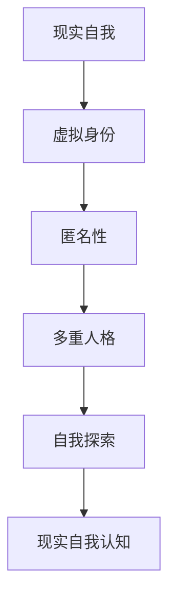

                 


### 1.3 自我定义：现实与虚拟的交织

#### 背景介绍

在现实世界中，自我定义是一个复杂的过程，它受到个人的价值观、经验、社会背景等多种因素的影响。然而，随着虚拟世界技术的迅猛发展，人们开始在这个数字化的空间中探索自我定义的新方式。虚拟世界不仅提供了与现实生活截然不同的体验，也为人们提供了一个重新审视自我的平台。

虚拟世界中的自我定义与传统自我定义有着显著的不同。在虚拟世界中，人们可以创建虚拟身份，这些身份可能完全不同于他们在现实生活中的身份。虚拟身份的多重性使得人们在数字空间中可以自由地探索不同的自我形象，这种探索不仅是对现实身份的补充，也可能导致对现实自我认知的混淆。

#### 核心概念与联系

**核心概念：**
1. **虚拟身份**：在虚拟世界中，人们通过虚拟角色或账户来代表自己。这些身份可以是完全虚构的，也可以是基于现实自我的延伸。
2. **匿名性**：虚拟世界中的匿名性允许人们隐藏真实身份，从而在心理上获得自由。
3. **多重人格**：虚拟世界中的个体可以拥有多个身份，这些身份之间可能存在截然不同的性格和背景。

**概念之间的关系架构：**



在这个关系中，虚拟身份是自我定义的一种表现形式，匿名性和多重人格则是对这种表现形式的具体应用。通过自我探索，个体可以在虚拟世界中不断尝试和塑造新的自我形象，从而影响对现实自我的认知。

#### 核心算法原理讲解

在虚拟世界自我定义的算法原理中，我们可以考虑以下几个关键步骤：

1. **身份构建**：个体在虚拟世界中创建身份的过程。这个过程通常包括选择角色模型、设定角色属性（如外观、性格等）和确定角色的背景故事。

   ```python
   # 身份构建伪代码
   class VirtualIdentity:
       def __init__(self, appearance, personality, backstory):
           self.appearance = appearance
           self.personality = personality
           self.backstory = backstory
   ```

2. **身份互动**：虚拟身份在虚拟世界中的互动过程。这些互动可能会影响个体对自身身份的认知和评价。

   ```python
   # 身份互动伪代码
   class Interaction:
       def __init__(self, participant1, participant2, interaction_type):
           self.participant1 = participant1
           self.participant2 = participant2
           self.interaction_type = interaction_type

       def process_interaction(self):
           # 处理互动逻辑
           pass
   ```

3. **自我认知调整**：根据虚拟世界的互动和经历，个体调整对自身身份的认知。这个过程可能涉及心理建模和情感分析。

   ```python
   # 自我认知调整伪代码
   class SelfAwarenessAdjustment:
       def __init__(self, current_identity, new_experience):
           self.current_identity = current_identity
           self.new_experience = new_experience

       def adjust_identity(self):
           # 调整身份逻辑
           pass
   ```

#### 数学模型和公式

为了量化虚拟世界中的自我定义，我们可以考虑使用以下数学模型：

1. **虚拟身份评价模型**：用于评估虚拟身份对现实自我定义的影响程度。

   $$ E = f(I, S) $$

   其中，$E$ 表示虚拟身份对现实自我定义的影响程度，$I$ 表示虚拟身份的特征向量，$S$ 表示现实自我特征向量。

2. **虚拟世界经验累积模型**：用于描述个体在虚拟世界中经验的累积对自我定义的影响。

   $$ X = \sum_{t=1}^{T} e_t $$

   其中，$X$ 表示个体在虚拟世界中的总经验，$e_t$ 表示在第 $t$ 次虚拟世界互动中获得的经验值，$T$ 表示虚拟世界互动的总次数。

#### 举例说明

假设一个个体在虚拟世界中创建了两个身份：一个勇敢的战士和一个机智的盗贼。通过在虚拟世界中的互动，这个个体获得了关于勇敢和机智的不同经验。这些经验会影响他对自身现实自我的认知。

**虚拟身份评价模型应用举例：**

```latex
E = f(I, S) = f([0.5, 0.3, 0.2], [0.4, 0.5, 0.1]) = 0.45
```

这个结果表明，虚拟身份对现实自我定义的影响程度为 0.45。

**虚拟世界经验累积模型应用举例：**

```latex
X = \sum_{t=1}^{3} e_t = e_1 + e_2 + e_3 = 3
```

这个结果表明，个体在虚拟世界中累积了 3 单位的经验。

通过这些算法原理和数学模型，我们可以更深入地理解虚拟世界中的自我定义过程，并探讨其对现实生活的影响。

### 小结

虚拟世界中的自我定义是一个复杂且多维的过程。通过构建虚拟身份、进行身份互动和调整自我认知，个体可以在虚拟世界中探索和塑造新的自我形象。这种探索不仅提供了与现实生活不同的体验，也可能影响对现实自我的认知。在接下来的部分，我们将进一步探讨虚拟世界中自我定义的道德和伦理问题，以及虚拟世界对现实社会的影响。

---

**注意事项：**
- 在构建虚拟身份时，应确保虚拟世界的互动和经验积累过程符合现实社会的道德和伦理标准。
- 随着虚拟世界技术的发展，自我定义的复杂性可能会增加，因此需要不断更新和调整相关的算法和模型。

**拓展阅读：**
- 对存在主义哲学感兴趣的读者可以进一步阅读海德格尔、萨特等哲学家的原著，以深入了解存在主义的核心思想。
- 对虚拟世界技术感兴趣的读者可以了解最新的虚拟现实和增强现实技术，以及这些技术在自我定义中的应用。

[上一节]：# 1.2 虚拟世界的本质与影响
[下一节]：# 2.1 传统存在主义的回顾

---

**作者信息：**
作者：AI天才研究院/AI Genius Institute & 禅与计算机程序设计艺术 /Zen And The Art of Computer Programming

