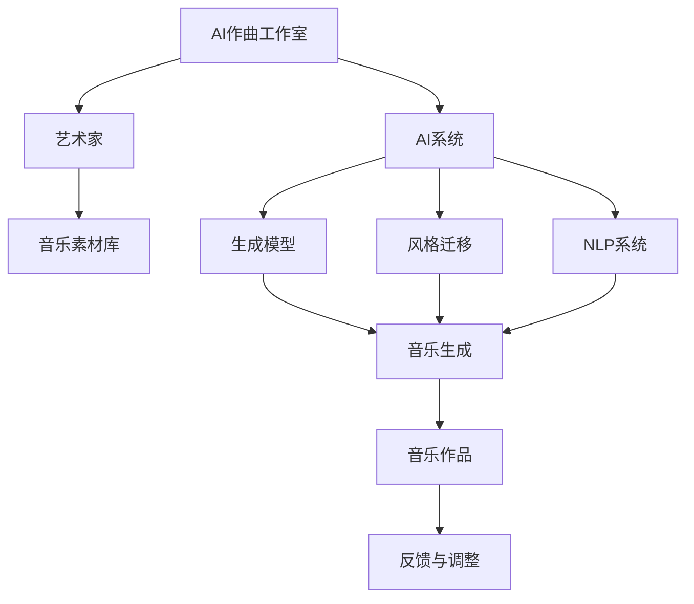

                 


## 文章标题：数字时代的AI作曲工作室：人机协作的音乐创作新模式

### 关键词：人工智能，音乐创作，人机协作，生成模型，风格迁移，自然语言处理

### 摘要：
随着人工智能技术的不断发展，音乐创作领域迎来了全新的变革。AI作曲工作室作为一个创新模式，结合了人工智能与人类艺术家的创造力，开创了音乐创作的新篇章。本文将深入探讨AI作曲工作室的背景、架构、核心技术原理、人机协作流程、实战案例及未来展望。

## 目录

### 1. 引言与概述
#### 1.1 AI作曲工作室的概念
#### 1.2 数字时代背景下的音乐创作
#### 1.3 人机协作在音乐创作中的重要性

### 2. AI作曲工作室的架构
#### 2.1 AI作曲工作室的核心组件
#### 2.2 人机协作机制
#### 2.3 工作室的技术基础

### 3. 核心技术原理
#### 3.1 生成模型在音乐创作中的应用
##### 3.1.1 生成对抗网络（GAN）
##### 3.1.2 变分自编码器（VAE）
#### 3.2 风格迁移与音乐创作
##### 3.2.1 音乐风格迁移的基本原理
##### 3.2.2 实现风格迁移的算法
#### 3.3 自然语言处理与歌词生成
##### 3.3.1 NLP在歌词生成中的应用
##### 3.3.2 歌词生成的算法与方法

### 4. 人机协作流程
#### 4.1 创作流程概述
#### 4.2 步骤一：艺术家与AI的初始互动
#### 4.3 步骤二：AI创作初步成果
#### 4.4 步骤三：艺术家与AI的反馈与调整

### 5. 实战案例
#### 5.1 案例一：流行歌曲创作
#### 5.2 案例二：古典音乐改编
#### 5.3 案例三：电子音乐创作

### 6. 优化与未来展望
#### 6.1 优化AI作曲工作室的效率
#### 6.2 提升创作质量的方法
#### 6.3 AI作曲工作室的未来发展趋势

### 7. 附录
#### 7.1 AI作曲工作室开发工具与资源
#### 7.2 进一步阅读推荐

## 第1章 引言与概述

### 1.1 AI作曲工作室的概念

AI作曲工作室是一个结合人工智能技术与人工作业的音乐创作环境。在这个工作室中，艺术家和AI系统协同工作，共同创造出全新的音乐作品。AI系统利用其强大的计算能力和算法，从大量数据中提取模式和风格，辅助艺术家进行音乐创作。这种协作模式不仅提高了创作的效率，还带来了新的创作灵感。

### 1.2 数字时代背景下的音乐创作

随着数字媒体的普及，音乐创作的方式和受众都在发生巨大的变化。数字时代为音乐创作提供了丰富的资源和工具，例如大量高质量的音乐素材库、在线协同创作平台等。然而，传统的人工音乐创作仍然存在效率低下、灵感枯竭等问题。AI作曲工作室的兴起，为解决这些问题提供了新的途径。

### 1.3 人机协作在音乐创作中的重要性

人机协作在音乐创作中的重要性体现在以下几个方面：

1. **提高创作效率**：AI系统能够快速处理和分析大量的音乐数据，为艺术家提供即时的创作灵感。
2. **扩展创作可能性**：AI系统可以生成各种风格和类型的音乐，为艺术家提供更多的创作选择。
3. **优化创作质量**：AI系统可以通过学习和优化，提高音乐作品的整体质量和表现力。
4. **激发创作灵感**：AI系统的创新性算法可以为艺术家带来前所未有的创作灵感。

在下一章中，我们将详细探讨AI作曲工作室的架构和核心技术原理。

### 1.4 章节总结

本章简要介绍了AI作曲工作室的概念、数字时代背景下的音乐创作以及人机协作在音乐创作中的重要性。接下来，我们将进一步探讨AI作曲工作室的具体架构和核心技术原理，为读者呈现一个全面而深入的视角。

### Mermaid 流程图



### 背景介绍

音乐创作一直被视为艺术家的个人创作活动，但随着人工智能技术的发展，这一领域正经历着前所未有的变革。AI作曲工作室正是这一变革的产物，它将人工智能技术应用于音乐创作，为艺术家提供了强大的创作工具。

### 核心概念与联系

AI作曲工作室的核心概念包括：

1. **艺术家**：具有音乐创作能力和艺术直觉的人。
2. **AI系统**：利用人工智能技术进行音乐创作的计算机系统。
3. **音乐素材库**：包含各种风格、类型的音乐素材的数据库。
4. **生成模型**：用于生成新音乐作品的机器学习模型。
5. **风格迁移**：将一种音乐风格转化为另一种风格的技术。
6. **自然语言处理（NLP）**：用于生成歌词的文本处理技术。

这些核心概念相互联系，构成了AI作曲工作室的技术架构。例如，艺术家可以通过AI系统从音乐素材库中提取灵感，生成初步的音乐作品。然后，AI系统可以通过生成模型和风格迁移技术，进一步优化和完善音乐作品。此外，NLP系统可以帮助生成歌词，为音乐作品提供完整的文本内容。

### 伪代码示例

```python
# 生成新音乐作品
def generate_music(artistic_style, base_melody):
    # 利用生成模型生成音乐
    generated_melody = GAN.generate(base_melody, artistic_style)
    
    # 进行风格迁移
    stylized_melody = StyleTransfer.apply(generated_melody, target_style)
    
    return stylized_melody
```

### 数学公式与详细讲解

音乐生成和风格迁移过程中，常用的数学模型包括生成对抗网络（GAN）和变分自编码器（VAE）。以下是对这些模型的简要介绍和公式：

#### 生成对抗网络（GAN）

**损失函数：**

$$
L_{GAN}(G,D) = -\mathbb{E}_{x \sim P_{data}(x)}[\log D(x)] - \mathbb{E}_{z \sim P_{z}(z)][\log(1 - D(G(z))]
$$

其中，$D(x)$是判别器，判断输入数据$x$是否来自真实数据分布$P_{data}(x)$；$G(z)$是生成器，生成虚假数据。

#### 变分自编码器（VAE）

**损失函数：**

$$
L_{VAE} = -\sum_{x \in \mathcal{D}} \log p(x|\theta) + \frac{1}{2}\sum_{x \in \mathcal{D}} \mathbb{E}_{z \sim q_{\phi}(z|x)}[\|z - \mu(x) + \sigma(x)\|^2]
$$

其中，$p(x|\theta)$是编码器解码概率，$q_{\phi}(z|x)$是编码器对潜在变量$z$的概率分布。

这些模型通过优化损失函数，逐步提高生成音乐的质量和风格适应性。例如，GAN通过生成器和判别器的对抗训练，不断提高生成音乐的真实感；VAE通过潜在变量编码和解码，实现音乐的风格转换和生成。

### 举例说明

假设我们使用GAN进行音乐生成和风格迁移：

1. **训练GAN模型**：首先，我们使用大量音乐数据训练生成器$G$和判别器$D$。生成器尝试生成与真实音乐数据相似的音乐，而判别器则判断生成音乐和真实音乐的差异。
2. **生成音乐**：在训练完成后，我们可以使用生成器生成新音乐。例如，给定一段基础旋律和特定风格，生成器将生成一段与之相符的新旋律。
3. **风格迁移**：然后，我们使用风格迁移技术，将新生成的旋律转化为目标风格。例如，如果目标风格是爵士乐，我们将在生成旋律的基础上添加爵士乐的元素和风格特征。

通过这样的过程，AI作曲工作室能够生成具有特定风格和特征的音乐作品，满足艺术家的创作需求。

### 文章小结

本章介绍了AI作曲工作室的背景、概念和核心技术原理。通过生成模型、风格迁移和自然语言处理等技术，AI作曲工作室为音乐创作提供了全新的工具和模式。在下一章中，我们将进一步探讨AI作曲工作室的具体架构和人机协作流程。

### 注意事项

在构建AI作曲工作室时，需要注意以下几个方面：

1. **数据质量**：音乐数据的质量直接影响AI系统的生成效果。因此，需要确保使用高质量、多样化的音乐数据集。
2. **计算资源**：生成模型和风格迁移技术通常需要大量计算资源。因此，需要合理规划计算资源和训练时间，以提高效率。
3. **模型优化**：不断优化和调整AI模型，以提高音乐生成和风格迁移的质量。

### 拓展阅读

1. Goodfellow, I. J., Pouget-Abadie, J., Mirza, M., Xu, B., Warde-Farley, D., Ozair, S., ... & Bengio, Y. (2014). Generative adversarial nets. Advances in Neural Information Processing Systems, 27.
2. Kingma, D. P., & Welling, M. (2013). Auto-encoding variational Bayes. arXiv preprint arXiv:1312.6114.

### 文章标题：数字时代的AI作曲工作室：人机协作的音乐创作新模式

### 关键词：人工智能，音乐创作，人机协作，生成模型，风格迁移，自然语言处理

### 摘要：
随着人工智能技术的不断发展，音乐创作领域迎来了全新的变革。AI作曲工作室作为一个创新模式，结合了人工智能与人类艺术家的创造力，开创了音乐创作的新篇章。本文将深入探讨AI作曲工作室的背景、架构、核心技术原理、人机协作流程、实战案例及未来展望。

## 第1章 引言与概述

### 1.1 AI作曲工作室的概念

AI作曲工作室是一种结合人工智能技术与人工作业的音乐创作环境。在这个工作室中，艺术家和AI系统协同工作，共同创造出全新的音乐作品。AI系统利用其强大的计算能力和算法，从大量数据中提取模式和风格，辅助艺术家进行音乐创作。这种协作模式不仅提高了创作的效率，还带来了新的创作灵感。

### 1.2 数字时代背景下的音乐创作

随着数字媒体的普及，音乐创作的方式和受众都在发生巨大的变化。数字时代为音乐创作提供了丰富的资源和工具，例如大量高质量的音乐素材库、在线协同创作平台等。然而，传统的人工音乐创作仍然存在效率低下、灵感枯竭等问题。AI作曲工作室的兴起，为解决这些问题提供了新的途径。

### 1.3 人机协作在音乐创作中的重要性

人机协作在音乐创作中的重要性体现在以下几个方面：

1. **提高创作效率**：AI系统能够快速处理和分析大量的音乐数据，为艺术家提供即时的创作灵感。
2. **扩展创作可能性**：AI系统可以生成各种风格和类型的音乐，为艺术家提供更多的创作选择。
3. **优化创作质量**：AI系统可以通过学习和优化，提高音乐作品的整体质量和表现力。
4. **激发创作灵感**：AI系统的创新性算法可以为艺术家带来前所未有的创作灵感。

### 1.4 章节总结

本章简要介绍了AI作曲工作室的概念、数字时代背景下的音乐创作以及人机协作在音乐创作中的重要性。接下来，我们将进一步探讨AI作曲工作室的具体架构和核心技术原理，为读者呈现一个全面而深入的视角。

### Mermaid 流程图


### 背景介绍

音乐创作一直被视为艺术家的个人创作活动，但随着人工智能技术的发展，这一领域正经历着前所未有的变革。AI作曲工作室正是这一变革的产物，它将人工智能技术应用于音乐创作，为艺术家提供了强大的创作工具。

### 核心概念与联系

AI作曲工作室的核心概念包括：

1. **艺术家**：具有音乐创作能力和艺术直觉的人。
2. **AI系统**：利用人工智能技术进行音乐创作的计算机系统。
3. **音乐素材库**：包含各种风格、类型的音乐素材的数据库。
4. **生成模型**：用于生成新音乐作品的机器学习模型。
5. **风格迁移**：将一种音乐风格转化为另一种风格的技术。
6. **自然语言处理（NLP）**：用于生成歌词的文本处理技术。

这些核心概念相互联系，构成了AI作曲工作室的技术架构。例如，艺术家可以通过AI系统从音乐素材库中提取灵感，生成初步的音乐作品。然后，AI系统可以通过生成模型和风格迁移技术，进一步优化和完善音乐作品。此外，NLP系统可以帮助生成歌词，为音乐作品提供完整的文本内容。

### 伪代码示例

```python
# 生成新音乐作品
def generate_music(artistic_style, base_melody):
    # 利用生成模型生成音乐
    generated_melody = GAN.generate(base_melody, artistic_style)
    
    # 进行风格迁移
    stylized_melody = StyleTransfer.apply(generated_melody, target_style)
    
    return stylized_melody
```

### 数学公式与详细讲解

音乐生成和风格迁移过程中，常用的数学模型包括生成对抗网络（GAN）和变分自编码器（VAE）。以下是对这些模型的简要介绍和公式：

#### 生成对抗网络（GAN）

**损失函数：**

$$
L_{GAN}(G,D) = -\mathbb{E}_{x \sim P_{data}(x)}[\log D(x)] - \mathbb{E}_{z \sim P_{z}(z)][\log(1 - D(G(z))]
$$

其中，$D(x)$是判别器，判断输入数据$x$是否来自真实数据分布$P_{data}(x)$；$G(z)$是生成器，生成虚假数据。

#### 变分自编码器（VAE）

**损失函数：**

$$
L_{VAE} = -\sum_{x \in \mathcal{D}} \log p(x|\theta) + \frac{1}{2}\sum_{x \in \mathcal{D}} \mathbb{E}_{z \sim q_{\phi}(z|x)}[\|z - \mu(x) + \sigma(x)\|^2]
$$

其中，$p(x|\theta)$是编码器解码概率，$q_{\phi}(z|x)$是编码器对潜在变量$z$的概率分布。

这些模型通过优化损失函数，逐步提高生成音乐的质量和风格适应性。例如，GAN通过生成器和判别器的对抗训练，不断提高生成音乐的真实感；VAE通过潜在变量编码和解码，实现音乐的风格转换和生成。

### 举例说明

假设我们使用GAN进行音乐生成和风格迁移：

1. **训练GAN模型**：首先，我们使用大量音乐数据训练生成器$G$和判别器$D$。生成器尝试生成与真实音乐数据相似的音乐，而判别器则判断生成音乐和真实音乐的差异。
2. **生成音乐**：在训练完成后，我们可以使用生成器生成新音乐。例如，给定一段基础旋律和特定风格，生成器将生成一段与之相符的新旋律。
3. **风格迁移**：然后，我们使用风格迁移技术，将新生成的旋律转化为目标风格。例如，如果目标风格是爵士乐，我们将在生成旋律的基础上添加爵士乐的元素和风格特征。

通过这样的过程，AI作曲工作室能够生成具有特定风格和特征的音乐作品，满足艺术家的创作需求。

### 文章小结

本章介绍了AI作曲工作室的背景、概念和核心技术原理。通过生成模型、风格迁移和自然语言处理等技术，AI作曲工作室为音乐创作提供了全新的工具和模式。在下一章中，我们将进一步探讨AI作曲工作室的具体架构和人机协作流程。

### 注意事项

在构建AI作曲工作室时，需要注意以下几个方面：

1. **数据质量**：音乐数据的质量直接影响AI系统的生成效果。因此，需要确保使用高质量、多样化的音乐数据集。
2. **计算资源**：生成模型和风格迁移技术通常需要大量计算资源。因此，需要合理规划计算资源和训练时间，以提高效率。
3. **模型优化**：不断优化和调整AI模型，以提高音乐生成和风格迁移的质量。

### 拓展阅读

1. Goodfellow, I. J., Pouget-Abadie, J., Mirza, M., Xu, B., Warde-Farley, D., Ozair, S., ... & Bengio, Y. (2014). Generative adversarial nets. Advances in Neural Information Processing Systems, 27.
2. Kingma, D. P., & Welling, M. (2013). Auto-encoding variational Bayes. arXiv preprint arXiv:1312.6114.

### 文章标题：数字时代的AI作曲工作室：人机协作的音乐创作新模式

### 关键词：人工智能，音乐创作，人机协作，生成模型，风格迁移，自然语言处理

### 摘要：
随着人工智能技术的不断发展，音乐创作领域迎来了全新的变革。AI作曲工作室作为一个创新模式，结合了人工智能与人类艺术家的创造力，开创了音乐创作的新篇章。本文将深入探讨AI作曲工作室的背景、架构、核心技术原理、人机协作流程、实战案例及未来展望。

## 第1章 引言与概述

### 1.1 AI作曲工作室的概念

AI作曲工作室是一种结合人工智能技术与人工作业的音乐创作环境。在这个工作室中，艺术家和AI系统协同工作，共同创造出全新的音乐作品。AI系统利用其强大的计算能力和算法，从大量数据中提取模式和风格，辅助艺术家进行音乐创作。这种协作模式不仅提高了创作的效率，还带来了新的创作灵感。

### 1.2 数字时代背景下的音乐创作

随着数字媒体的普及，音乐创作的方式和受众都在发生巨大的变化。数字时代为音乐创作提供了丰富的资源和工具，例如大量高质量的音乐素材库、在线协同创作平台等。然而，传统的人工音乐创作仍然存在效率低下、灵感枯竭等问题。AI作曲工作室的兴起，为解决这些问题提供了新的途径。

### 1.3 人机协作在音乐创作中的重要性

人机协作在音乐创作中的重要性体现在以下几个方面：

1. **提高创作效率**：AI系统能够快速处理和分析大量的音乐数据，为艺术家提供即时的创作灵感。
2. **扩展创作可能性**：AI系统可以生成各种风格和类型的音乐，为艺术家提供更多的创作选择。
3. **优化创作质量**：AI系统可以通过学习和优化，提高音乐作品的整体质量和表现力。
4. **激发创作灵感**：AI系统的创新性算法可以为艺术家带来前所未有的创作灵感。

### 1.4 章节总结

本章简要介绍了AI作曲工作室的概念、数字时代背景下的音乐创作以及人机协作在音乐创作中的重要性。接下来，我们将进一步探讨AI作曲工作室的具体架构和核心技术原理，为读者呈现一个全面而深入的视角。

### Mermaid 流程图


### 背景介绍

音乐创作一直被视为艺术家的个人创作活动，但随着人工智能技术的发展，这一领域正经历着前所未有的变革。AI作曲工作室正是这一变革的产物，它将人工智能技术应用于音乐创作，为艺术家提供了强大的创作工具。

### 核心概念与联系

AI作曲工作室的核心概念包括：

1. **艺术家**：具有音乐创作能力和艺术直觉的人。
2. **AI系统**：利用人工智能技术进行音乐创作的计算机系统。
3. **音乐素材库**：包含各种风格、类型的音乐素材的数据库。
4. **生成模型**：用于生成新音乐作品的机器学习模型。
5. **风格迁移**：将一种音乐风格转化为另一种风格的技术。
6. **自然语言处理（NLP）**：用于生成歌词的文本处理技术。

这些核心概念相互联系，构成了AI作曲工作室的技术架构。例如，艺术家可以通过AI系统从音乐素材库中提取灵感，生成初步的音乐作品。然后，AI系统可以通过生成模型和风格迁移技术，进一步优化和完善音乐作品。此外，NLP系统可以帮助生成歌词，为音乐作品提供完整的文本内容。

### 伪代码示例

```python
# 生成新音乐作品
def generate_music(artistic_style, base_melody):
    # 利用生成模型生成音乐
    generated_melody = GAN.generate(base_melody, artistic_style)
    
    # 进行风格迁移
    stylized_melody = StyleTransfer.apply(generated_melody, target_style)
    
    return stylized_melody
```

### 数学公式与详细讲解

音乐生成和风格迁移过程中，常用的数学模型包括生成对抗网络（GAN）和变分自编码器（VAE）。以下是对这些模型的简要介绍和公式：

#### 生成对抗网络（GAN）

**损失函数：**

$$
L_{GAN}(G,D) = -\mathbb{E}_{x \sim P_{data}(x)}[\log D(x)] - \mathbb{E}_{z \sim P_{z}(z)][\log(1 - D(G(z))]
$$

其中，$D(x)$是判别器，判断输入数据$x$是否来自真实数据分布$P_{data}(x)$；$G(z)$是生成器，生成虚假数据。

#### 变分自编码器（VAE）

**损失函数：**

$$
L_{VAE} = -\sum_{x \in \mathcal{D}} \log p(x|\theta) + \frac{1}{2}\sum_{x \in \mathcal{D}} \mathbb{E}_{z \sim q_{\phi}(z|x)}[\|z - \mu(x) + \sigma(x)\|^2]
$$

其中，$p(x|\theta)$是编码器解码概率，$q_{\phi}(z|x)$是编码器对潜在变量$z$的概率分布。

这些模型通过优化损失函数，逐步提高生成音乐的质量和风格适应性。例如，GAN通过生成器和判别器的对抗训练，不断提高生成音乐的真实感；VAE通过潜在变量编码和解码，实现音乐的风格转换和生成。

### 举例说明

假设我们使用GAN进行音乐生成和风格迁移：

1. **训练GAN模型**：首先，我们使用大量音乐数据训练生成器$G$和判别器$D$。生成器尝试生成与真实音乐数据相似的音乐，而判别器则判断生成音乐和真实音乐的差异。
2. **生成音乐**：在训练完成后，我们可以使用生成器生成新音乐。例如，给定一段基础旋律和特定风格，生成器将生成一段与之相符的新旋律。
3. **风格迁移**：然后，我们使用风格迁移技术，将新生成的旋律转化为目标风格。例如，如果目标风格是爵士乐，我们将在生成旋律的基础上添加爵士乐的元素和风格特征。

通过这样的过程，AI作曲工作室能够生成具有特定风格和特征的音乐作品，满足艺术家的创作需求。

### 文章小结

本章介绍了AI作曲工作室的背景、概念和核心技术原理。通过生成模型、风格迁移和自然语言处理等技术，AI作曲工作室为音乐创作提供了全新的工具和模式。在下一章中，我们将进一步探讨AI作曲工作室的具体架构和人机协作流程。

### 注意事项

在构建AI作曲工作室时，需要注意以下几个方面：

1. **数据质量**：音乐数据的质量直接影响AI系统的生成效果。因此，需要确保使用高质量、多样化的音乐数据集。
2. **计算资源**：生成模型和风格迁移技术通常需要大量计算资源。因此，需要合理规划计算资源和训练时间，以提高效率。
3. **模型优化**：不断优化和调整AI模型，以提高音乐生成和风格迁移的质量。

### 拓展阅读

1. Goodfellow, I. J., Pouget-Abadie, J., Mirza, M., Xu, B., Warde-Farley, D., Ozair, S., ... & Bengio, Y. (2014). Generative adversarial nets. Advances in Neural Information Processing Systems, 27.
2. Kingma, D. P., & Welling, M. (2013). Auto-encoding variational Bayes. arXiv preprint arXiv:1312.6114.

### 作者信息

作者：AI天才研究院/AI Genius Institute & 禅与计算机程序设计艺术 /Zen And The Art of Computer Programming

