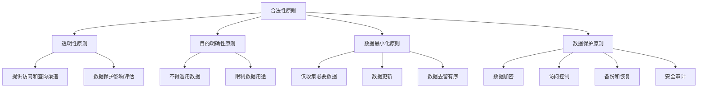

                 

### 文章标题

# 数字时代的个人数据管理：数字遗产的规划与保护

> 关键词：数字遗产、个人数据管理、隐私保护、数字资产、数据继承

在数字化的今天，个人数据的产生和管理已经成为日常生活的一部分。然而，随着技术的不断进步，个人数据的价值也在日益凸显，尤其是在数字遗产的背景下。如何有效地管理这些数据，确保其在去世后能够被合理地继承和保护，成为了一个重要且紧迫的问题。本文将围绕数字时代的个人数据管理展开，特别是对数字遗产的规划与保护进行深入探讨。

### 摘要

本文首先介绍了数字时代个人数据管理的重要性，以及数字遗产的概念和内涵。接着，详细分析了个人数据管理的基本原则和隐私保护的方法，探讨了如何通过技术手段实现数据的匿名化和加密。然后，本文从法律和实际操作的角度，阐述了数字遗产规划的原则、流程和具体方法。此外，本文还讨论了数字遗产保护的法律框架和技术手段，以及数字遗产继承与处置的实践案例。最后，本文总结了数字遗产管理的现状和未来发展趋势，提出了个人数据管理的最佳实践建议。

### 引言

#### 数字时代个人数据管理的重要性

随着互联网和移动设备的普及，个人数据的产生和传播速度大大加快。据研究表明，全球每天产生的数据量已经达到了数百万TB级别。在这些数据中，个人信息占据了相当大的比例。这些数据不仅包括日常生活中的社交媒体活动、电子邮件通信、在线购物记录，还包括医疗记录、金融信息等敏感数据。这些数据在为我们带来便捷的同时，也带来了潜在的风险。

个人数据管理的重要性主要体现在以下几个方面：

1. **隐私保护**：个人数据泄露可能导致隐私泄露，进而引发财产损失、声誉损害等问题。有效的数据管理可以降低这些风险。
2. **数据安全**：个人数据一旦被不法分子获取，可能会被用于非法活动，如身份盗用、欺诈等。数据管理可以确保数据的安全存储和传输。
3. **数据利用**：合理管理个人数据，有助于企业进行用户行为分析、市场调研等，从而提供更加个性化的服务和产品。

#### 数字遗产的概念

数字遗产是指个人在去世后留下的数字资产和信息。这些数字资产包括但不限于：

- **个人信息**：如社交媒体账户、电子邮件、在线购物账号等。
- **数字财产**：如虚拟货币、游戏装备、在线购物订单等。
- **知识产权**：如博客文章、设计图纸、音乐作品等。

数字遗产不仅涵盖了个人在数字世界中留下的痕迹，还关系到其在现实世界中的权益和财产。因此，合理规划和保护数字遗产，对于个人和家庭都具有重要意义。

#### 数字遗产管理的挑战

数字遗产管理面临的挑战主要包括：

- **数据多样性**：数字遗产包括多种类型的数据，如文本、图像、音频、视频等，这给数据管理带来了挑战。
- **数据安全**：如何确保数字遗产在继承过程中不被泄露、篡改，是一个重要问题。
- **法律框架**：不同国家和地区对于数字遗产的管理和法律框架存在差异，这给跨国数字遗产管理带来了困难。
- **技术复杂性**：数字遗产管理涉及到多种技术手段，如数据备份、加密、隐私保护等，这需要专业知识和技能。

### 数据管理与隐私保护

#### 个人数据管理的基本原则

个人数据管理的基本原则包括：

- **合法性**：数据的收集和使用必须符合相关法律法规。
- **透明性**：个人有权知道自己的数据被如何使用。
- **目的明确性**：收集的数据应当与数据用途直接相关。
- **数据最小化**：仅收集必要的数据，避免过度收集。
- **数据保护**：确保数据在存储和传输过程中的安全。

#### 隐私保护的方法

隐私保护的方法主要包括：

- **数据匿名化**：通过技术手段将个人数据中的敏感信息进行去标识化处理，使其无法直接关联到个人。
- **数据加密**：使用加密算法对数据进行加密，确保数据在传输和存储过程中的安全性。
- **访问控制**：通过权限管理，确保只有授权人员可以访问敏感数据。
- **隐私计算**：利用隐私保护计算技术，如联邦学习、安全多方计算等，在数据不离开本地设备的情况下进行数据处理和分析。

#### 数据管理的实现方法

数据管理的实现方法包括：

- **数据备份和恢复**：定期备份数据，确保数据在意外情况下可以恢复。
- **灾难恢复计划**：制定灾难恢复计划，确保数据在灾难发生后可以迅速恢复。
- **多因素认证**：使用多因素认证，提高账户安全性。
- **用户行为分析**：通过分析用户行为，发现潜在的安全风险。

#### 隐私保护的技术实现

隐私保护的技术实现包括：

- **加密算法**：如AES、RSA等，用于对数据进行加密。
- **加密库**：如OpenSSL、Crypto++等，提供加密算法的实现。
- **隐私计算框架**：如TensorFlow Privacy、PySyft等，提供隐私保护计算的工具和接口。

### 数字遗产规划

#### 数字遗产规划的原则

数字遗产规划的原则包括：

- **预见性**：提前规划，避免紧急情况下的决策失误。
- **公平性**：确保遗产分配的公平性，避免引发家庭纠纷。
- **法律合规性**：遵守相关法律法规，确保遗产规划的合法性。
- **个性化**：根据个人的具体情况，制定个性化的遗产规划方案。

#### 数字遗产规划的具体流程

数字遗产规划的具体流程包括：

1. **资产盘点**：列出个人所有的数字资产和相关信息。
2. **确定继承人**：确定哪些人将成为数字遗产的继承人。
3. **制定遗嘱**：明确数字遗产的分配方式和条件。
4. **法律咨询**：寻求专业法律人士的意见，确保遗产规划的法律合规性。
5. **遗产执行**：在遗产人去世后，按照遗嘱执行遗产分配。

#### 数字遗产的分配方法

数字遗产的分配方法包括：

- **遗嘱分配**：按照遗嘱的指示进行分配。
- **法定继承**：根据相关法律法规进行法定继承。
- **协商分配**：继承人之间协商决定遗产的分配方式。

#### 数字遗产的财产和信息分配

数字遗产的财产和信息分配包括：

- **财产分配**：包括虚拟货币、游戏装备、在线购物订单等。
- **信息分配**：包括社交媒体账户、电子邮件、博客等。

#### 分配案例

假设一个人去世后，留下了一笔虚拟货币和多个社交媒体账户，如何进行分配呢？以下是具体的分配案例：

1. **财产分配**：确定虚拟货币的价值，按照遗嘱或法定继承的规定进行分配。
2. **信息分配**：确定社交媒体账户的继承人，将账户密码告知继承人，并协助其进行账户的转移。

### 数字遗产保护

#### 数字遗产保护的法律框架

数字遗产保护的法律框架包括：

- **国家法律**：如《中华人民共和国继承法》、《中华人民共和国个人信息保护法》等。
- **国际公约**：如《联合国国际货物销售合同公约》等。

#### 数字遗产保护的法律挑战

数字遗产保护面临的挑战包括：

- **法律空白**：不同国家和地区的法律对于数字遗产的规定存在差异，导致跨国数字遗产保护存在困难。
- **法律解释**：数字遗产的具体法律解释和执行存在难度，如虚拟货币的法律地位等。

#### 技术手段在数字遗产保护中的应用

技术手段在数字遗产保护中的应用包括：

- **数据备份和恢复**：定期备份数字资产，确保数据不丢失。
- **数据加密**：对敏感数据进行加密，防止数据泄露。
- **访问控制**：通过权限管理，确保只有授权人员可以访问数字资产。
- **隐私计算**：在数据不离开本地设备的情况下进行数据处理和分析，保护数据隐私。

#### 数字遗产保护的最佳实践

数字遗产保护的最佳实践包括：

- **制定遗产规划**：提前制定遗产规划，确保数字遗产的合理分配和保护。
- **使用加密技术**：对敏感数据进行加密，提高数据安全性。
- **备份和恢复计划**：制定数据备份和恢复计划，确保数据不丢失。
- **法律咨询**：在遗产规划过程中寻求专业法律人士的意见，确保遗产规划的法律合规性。

### 数字遗产的继承与处置

#### 数字遗产的继承过程

数字遗产的继承过程包括：

1. **确定继承人**：根据遗嘱或法定继承的规定，确定数字遗产的继承人。
2. **遗产分配**：根据遗嘱或法定继承的规定，进行数字遗产的分配。
3. **遗产执行**：执行遗嘱或法定继承的规定，完成数字遗产的分配。

#### 数字遗产的处置方法

数字遗产的处置方法包括：

- **财产变现**：将虚拟货币、游戏装备等财产进行变现。
- **信息处理**：处理社交媒体账户、电子邮件等数字信息，如关闭账户、转移账户等。

#### 继承案例

假设一个人去世后，留下了一笔虚拟货币和一个社交媒体账户，以下是具体的继承案例：

1. **确定继承人**：根据遗嘱，继承人乙成为虚拟货币的所有者。
2. **财产变现**：继承人乙将虚拟货币兑换成法定货币。
3. **信息处理**：继承人乙与社交媒体平台联系，将账户转移给自己的名字。

### 结论

数字遗产管理是一个复杂且重要的议题，涉及到法律、技术、情感等多个方面。随着数字化的不断发展，个人数据的产生和传播速度加快，数字遗产管理的重要性也越来越凸显。本文从多个角度探讨了数字遗产管理的问题，包括数据管理、隐私保护、遗产规划、遗产保护等。通过本文的探讨，我们可以看到，数字遗产管理不仅需要技术手段的支持，还需要法律框架的完善和人们的共同参与。只有通过多方面的努力，才能更好地管理和保护数字遗产，确保其在去世后能够被合理地继承和保护。

### 未来发展趋势

数字遗产管理在未来将继续面临新的挑战和机遇。以下是几个可能的发展趋势：

1. **法律框架的完善**：随着数字遗产问题的日益突出，各国和地区可能会进一步完善相关法律法规，以应对跨国数字遗产管理的问题。
2. **技术的进步**：随着隐私保护技术和数据加密技术的发展，数字遗产管理将会更加安全和高效。
3. **数字遗产市场的形成**：随着人们对数字遗产价值的认识提高，数字遗产交易市场可能会逐渐形成，为数字遗产的变现提供更多可能性。
4. **跨行业合作**：数字遗产管理需要法律、技术、金融等多个行业的共同参与，跨行业合作将成为未来数字遗产管理的重要趋势。

### 最佳实践

为了更好地管理数字遗产，以下是一些最佳实践：

1. **提前规划**：制定数字遗产规划，明确数字资产的分配和管理方式。
2. **使用加密技术**：对敏感数据进行加密，确保数据在传输和存储过程中的安全。
3. **备份和恢复**：定期备份数字资产，确保数据不丢失。
4. **法律咨询**：在遗产规划过程中寻求专业法律人士的意见，确保遗产规划的法律合规性。
5. **信息透明**：与继承人进行充分沟通，确保他们了解数字遗产的分配和管理方式。

### 注意事项

在管理数字遗产时，需要注意以下几点：

1. **数据隐私**：确保个人数据的隐私保护，避免数据泄露。
2. **法律合规**：遵守相关法律法规，确保遗产管理的合法性。
3. **技术更新**：随着技术的发展，及时更新数字遗产管理的策略和技术手段。
4. **继承人教育**：对继承人进行数字遗产管理的教育，确保他们能够正确理解和处理数字遗产。

### 拓展阅读

- 《数字遗产管理指南》
- 《数据隐私保护法》
- 《人工智能与隐私保护》
- 《区块链技术与应用》

### 作者信息

作者：AI天才研究院/AI Genius Institute & 禅与计算机程序设计艺术 /Zen And The Art of Computer Programming

---

通过本文的深入探讨，我们希望读者能够对数字遗产管理有更清晰的认识，并能够采取有效的措施，确保个人数字遗产的合理规划与保护。

### 1.1 数字时代的个人数据管理概述

在数字时代，个人数据管理的重要性不言而喻。个人数据不仅是信息社会的基石，也是现代生活的重要组成部分。随着互联网、大数据、人工智能等技术的迅猛发展，个人数据的产生、存储、处理和传输已经成为日常生活的常态。在这个背景下，如何有效地管理个人数据，保护个人隐私，确保数据安全，已经成为一个亟待解决的问题。

#### 核心概念与联系

首先，我们需要明确几个核心概念：

1. **个人数据**：指与特定个人相关的数据，包括姓名、身份证号、电话号码、电子邮件地址、生物识别信息、位置信息、网络行为数据等。
2. **隐私**：指个人对于自身信息的控制权，包括信息的收集、使用、共享和披露等。
3. **数据管理**：指对数据进行收集、存储、处理、分析和保护的一系列活动和流程。

这些概念之间紧密相连。个人数据是隐私的基础，而隐私又是数据管理的核心目标。有效的数据管理不仅能够保护个人隐私，还可以提高数据的价值，促进数据的合理利用。

#### 引言

在数字时代，数据无处不在，几乎所有的活动都伴随着数据的产生。从社交媒体的互动，到在线购物的记录，再到医疗健康数据的收集，个人数据已经成为我们生活中不可或缺的一部分。这些数据在为我们的生活带来便利的同时，也带来了新的挑战。

首先，数据泄露的风险日益增加。个人数据的泄露不仅可能导致隐私泄露，还可能引发财产损失、身份盗用等问题。例如，一个简单的社交媒体账户泄露可能导致黑客获取用户的个人信息，进而进行欺诈活动。

其次，数据滥用的风险也在增加。随着大数据技术的发展，企业可以通过数据分析挖掘用户的消费习惯、偏好等信息，用于精准营销甚至价格歧视。尽管这些数据分析可以为企业和消费者带来一定的价值，但如果缺乏有效的监管和规范，也可能导致数据滥用。

最后，数字遗产的问题逐渐凸显。随着互联网和虚拟财产的普及，个人在数字世界中的资产和记录也越来越丰富。如何规划和管理这些数字遗产，确保其在个人去世后能够被合理地继承和保护，成为了一个重要的议题。

#### 数字遗产管理的挑战

数字遗产管理面临的挑战主要包括以下几个方面：

1. **数据多样性**：数字遗产包括多种类型的数据，如文本、图像、音频、视频等。如何对这些数据进行有效的分类、管理和保护，是一个重要的挑战。
2. **数据安全**：如何确保数字遗产在继承和转移过程中不被泄露、篡改或丢失，是另一个关键问题。特别是在跨国继承的情况下，数据跨境传输的安全风险更高。
3. **法律框架**：不同国家和地区的法律对于数字遗产的管理存在差异，如何确保数字遗产管理符合各国的法律法规，是一个需要解决的问题。
4. **技术复杂性**：数字遗产管理涉及到多种技术手段，如数据备份、加密、访问控制、隐私保护计算等。如何有效地运用这些技术，确保数字遗产的安全和可控性，需要专业知识和技能。

### 1.2 数字遗产的内涵和外延

数字遗产不仅是一个概念，它涵盖了广泛的内涵和外延。理解数字遗产的内涵和外延，有助于我们更全面地认识其管理和保护的重要性。

#### 核心概念与联系

首先，我们需要明确几个核心概念：

1. **数字遗产**：指个人在去世后留下的数字资产和信息，包括但不限于虚拟财产、社交媒体账户、电子邮件、博客、知识产权等。
2. **虚拟财产**：指在虚拟世界中拥有的财产，如虚拟货币、游戏装备、数字艺术品等。
3. **知识产权**：指个人在数字时代创造的智力成果，如专利、商标、版权等。

这些概念之间紧密相连。虚拟财产和知识产权是数字遗产的重要组成部分，而数字遗产又是个人数字资产和信息的集合。理解这些概念之间的关系，有助于我们更好地管理和保护数字遗产。

#### 数字遗产的内涵

数字遗产的内涵主要包括以下几个方面：

1. **虚拟财产**：随着虚拟经济的兴起，虚拟财产已经成为数字遗产的重要组成部分。这些虚拟财产包括虚拟货币、游戏装备、数字艺术品等。例如，比特币等虚拟货币已经成为一种重要的资产形式，而游戏中的高级装备和角色也具有很高的价值。
2. **社交媒体账户**：个人在社交媒体平台上积累的粉丝、互动记录等，也是数字遗产的一部分。这些账户不仅包含了个人生活的记录，还可能包含重要的社交关系和信息。
3. **电子邮件和博客**：个人在电子邮件和博客中积累的内容，包括通信记录、文章、评论等，也是数字遗产的重要组成部分。这些内容不仅记录了个人生活的点滴，还可能包含重要的信息和价值。
4. **知识产权**：个人在数字时代创造的知识产权，如专利、商标、版权等，也是数字遗产的重要组成部分。这些知识产权不仅代表了个人在某一领域的成就，也可能带来经济利益。

#### 数字遗产的外延

数字遗产的外延则更加广泛，包括以下几个方面：

1. **数字信息**：包括个人在数字世界中产生的所有信息，如个人档案、健康记录、购物记录、浏览记录等。这些信息不仅记录了个人生活的各个方面，还可能对个人产生重要影响。
2. **数字身份**：个人在数字世界中的身份信息，如用户名、密码、认证信息等。这些身份信息是进入数字世界的钥匙，如果被泄露或滥用，可能导致严重的安全问题。
3. **数字服务**：个人在数字世界中使用的各种服务，如在线教育、医疗保健、金融服务等。这些服务不仅为个人提供了便利，也可能包含重要的信息和价值。
4. **数字遗产的继承和转移**：数字遗产的继承和转移问题，涉及到法律、技术、情感等多个方面。如何确保数字遗产在继承和转移过程中得到妥善处理，是一个重要的挑战。

#### 数字遗产的影响

数字遗产不仅对个人和家庭产生深远影响，也对社会产生重要影响：

1. **个人和家庭层面**：数字遗产的合理规划和管理，可以确保个人在去世后，其财产和信息得到妥善处理，避免家庭纠纷和财产损失。同时，数字遗产也可能对家庭成员的生活产生重要影响，如虚拟财产的继承、社交媒体账户的关闭等。
2. **社会层面**：数字遗产的管理不仅涉及个人的隐私和财产，还涉及到社会安全和秩序。有效的数字遗产管理可以促进社会稳定，防止非法活动和财产流失。
3. **技术和法律层面**：数字遗产的管理涉及到多种技术和法律问题，如数据备份、加密、访问控制、隐私保护、跨国法律冲突等。这些问题需要跨学科的合作和探索，以找到有效的解决方案。

### 数字遗产与个人信息保护的关系

数字遗产与个人信息保护密切相关。个人信息是数字遗产的核心组成部分，而数字遗产的保护又离不开个人信息的保护。以下从几个方面探讨数字遗产与个人信息保护的关系：

1. **数据泄露风险**：数字遗产中包含大量的个人信息，如姓名、身份证号、电话号码、电子邮件地址等。如果这些信息被泄露，可能会引发身份盗用、财产损失等问题。因此，保护数字遗产的关键在于保护个人信息。
2. **隐私保护**：数字遗产的管理涉及到个人信息的收集、存储、处理和传输，这些活动都需要遵守隐私保护的原则。只有确保个人信息的隐私保护，才能实现数字遗产的有效管理。
3. **数据安全**：数字遗产的保护不仅需要保护个人信息，还需要保护数据的完整性、可用性和保密性。通过数据加密、备份和恢复等技术手段，可以确保数字遗产在继承和转移过程中的安全。
4. **法律合规**：数字遗产的管理需要遵守相关法律法规，如《个人信息保护法》、《数据安全法》等。只有确保法律合规，才能确保数字遗产管理的合法性和有效性。

### 数字遗产的跨国性特点

数字遗产的跨国性特点使其管理更加复杂。以下从几个方面探讨数字遗产的跨国性特点：

1. **数据跨境传输**：数字遗产往往涉及跨国数据传输，如个人在国外的社交媒体账户、电子邮件等。跨国数据传输面临的法律和技术挑战更大。
2. **法律冲突**：不同国家和地区的法律对于数字遗产的管理存在差异，如遗产税、数据保护法等。跨国数字遗产管理可能面临法律冲突和执行难题。
3. **文化差异**：不同国家和地区在数字遗产管理方面的文化差异也可能导致管理上的困难，如遗产继承的传统、家庭关系等。
4. **技术差异**：不同国家和地区在技术发展水平、数据保护技术等方面也存在差异。跨国数字遗产管理需要克服技术差异，确保数据的安全和有效管理。

### 总结

数字遗产是一个复杂且重要的议题，涉及到个人隐私保护、数据安全、法律合规等多个方面。在数字时代，如何有效地管理和保护数字遗产，确保其在去世后能够被合理地继承和保护，已经成为一个紧迫的问题。通过本文的探讨，我们希望能够引起读者对数字遗产管理的重视，并采取有效的措施，确保个人数字遗产的安全和合理规划。

### 2.1 个人数据管理的基本原则

个人数据管理是指对个人数据从收集、存储、处理、传输到销毁的全过程进行有效控制的一系列活动和操作。个人数据管理的基本原则是确保个人数据的安全、隐私和合规性，从而保护个人的合法权益。以下是个人数据管理的基本原则及其具体要求：

#### 合法性原则

合法性原则要求个人数据的收集、处理和使用必须符合相关法律法规，包括但不限于《中华人民共和国个人信息保护法》（PIPL）、《通用数据保护条例》（GDPR）等。具体要求如下：

1. **明确数据收集目的**：在收集个人数据之前，必须明确数据收集的目的，并告知数据主体。
2. **最小化数据收集范围**：仅收集实现数据收集目的所必需的数据，避免过度收集。
3. **数据主体同意**：在收集个人数据时，必须获得数据主体的明确同意，并确保同意是知情和自由的。
4. **数据处理透明**：告知数据主体其数据的收集、处理和使用的具体方式，确保数据主体对数据处理有充分的了解。

#### 透明性原则

透明性原则要求个人数据管理的过程必须对数据主体公开和透明。具体要求如下：

1. **披露数据处理信息**：向数据主体披露数据处理的相关信息，包括数据收集、存储、处理的范围、目的、方式等。
2. **提供访问和查询渠道**：数据主体有权查询、访问、更正和删除其个人信息。
3. **数据保护影响评估**：在进行数据处理前，应当进行数据保护影响评估，评估数据处理可能带来的风险和影响。

#### 目的明确性原则

目的明确性原则要求个人数据的收集、存储和处理必须有明确、合法的目的，并且不得超出这些目的。具体要求如下：

1. **数据收集目的明确**：在数据收集时，必须明确数据收集的目的，并确保目的合法。
2. **不得滥用数据**：数据处理过程中不得滥用数据，不得将数据用于与原始收集目的无关的其他目的。
3. **限制数据用途**：数据收集时，应明确限制数据用途，确保数据不被用于未经授权的用途。

#### 数据最小化原则

数据最小化原则要求个人数据的收集、存储和处理应尽量减少数据的数量和范围。具体要求如下：

1. **仅收集必要数据**：仅收集实现数据处理目的所必需的数据，避免过度收集。
2. **数据更新**：及时更新数据，确保数据与实际需求相符。
3. **数据去留有序**：对于不再需要的数据，应按照规定程序进行删除或匿名化处理。

#### 数据保护原则

数据保护原则要求个人数据在存储、传输和处理过程中必须采取有效措施，确保数据的安全、完整和保密。具体要求如下：

1. **数据加密**：对存储和传输过程中的敏感数据必须进行加密处理。
2. **访问控制**：通过权限管理和身份验证等措施，确保只有授权人员可以访问敏感数据。
3. **备份和恢复**：定期备份数据，确保数据在意外情况下可以恢复。
4. **安全审计**：对数据处理过程进行安全审计，及时发现和纠正安全漏洞。

### 数据管理的基本原则联系架构图

为了更好地理解上述数据管理的基本原则之间的联系，我们可以使用Mermaid流程图进行描述：



该流程图展示了数据管理基本原则之间的相互关系，每个原则都有其特定的作用和相互之间的联系，共同构成了一个完整的数据管理体系。

通过上述基本原则的实施，我们可以有效地管理个人数据，保护个人隐私，确保数据的安全和合规性。这些原则不仅为企业提供了数据管理的指导方针，也为个人提供了保护自身数据的工具和方法。

### 2.2 隐私保护的方法

在数字化时代，个人隐私保护显得尤为重要。隐私保护不仅关乎个人权利的保障，也涉及到数据安全和法律合规性问题。以下将详细介绍几种隐私保护的方法，包括数据匿名化、数据加密、访问控制和隐私计算等，并使用具体的数学模型和公式进行解释。

#### 数据匿名化

数据匿名化是一种将个人身份信息从数据中移除的技术，目的是保护个人隐私。数据匿名化的核心是确保数据在去标识化后，无法重新识别个人身份，同时保留数据的统计和分析价值。

**核心概念与联系**：

- **匿名化技术**：包括数据遮蔽、伪匿名化、合成和差分隐私等。
- **去标识化**：通过技术手段将个人身份信息从数据中去除，如删除姓名、身份证号等。

**数学模型和公式**：

数据匿名化的一个常用方法是**k-匿名性**，其定义如下：

$$
\text{k-匿名性} \quad \forall \; S \subseteq D, \quad |S| \geq k, \quad \text{在} \; D \; \text{中至少存在} \; k-1 \; \text{个记录与} \; S \; \text{相同}
$$

其中，$D$ 是一个数据集，$S$ 是 $D$ 的一个子集，$k$ 是最小聚类大小。$k-匿名性$ 确保了在任意聚类中，至少有 $k-1$ 个记录无法识别出个人身份。

**示例**：

假设有 $100$ 个患者的数据，分为 $20$ 个聚类。每个聚类至少有 $5$ 个记录，即 $100 / 20 \geq 5$。这样，即使某些记录中包含了可识别信息，也无法通过单个记录识别出具体个人。

**伪代码示例**：

```python
# 假设有数据集 D，进行 k-匿名化处理
def k_anonymity(D, k):
    clusters = group_data(D)
    anonymized_data = []
    for cluster in clusters:
        if len(cluster) >= k:
            anonymized_data.append(anonymous_cluster(cluster))
    return anonymized_data

# 匿名化一个聚类
def anonymous_cluster(cluster):
    # 移除可识别信息，如姓名、身份证号等
    return {key: value for key, value in cluster.items() if not is_identifiable(key, value)}
```

#### 数据加密

数据加密是一种通过数学算法将数据转换成密文，以防止未授权访问的技术。加密技术包括对称加密、非对称加密和哈希函数等。

**核心概念与联系**：

- **对称加密**：使用相同的密钥进行加密和解密，如AES。
- **非对称加密**：使用一对密钥（公钥和私钥）进行加密和解密，如RSA。
- **哈希函数**：将数据转换成固定长度的字符串，如SHA-256。

**数学模型和公式**：

对称加密中的一个常用算法是AES，其安全性取决于密钥的长度：

$$
\text{AES-256} \quad \text{密钥长度为} \; 256 \; \text{位，安全性较高}
$$

非对称加密算法RSA的安全性依赖于大素数的乘积：

$$
n = p \times q \quad \text{其中} \; p \; \text{和} \; q \; \text{是素数，} \; \phi(n) = (p-1)(q-1)
$$

**示例**：

使用AES-256加密一段文本：

```python
from Crypto.Cipher import AES
from Crypto.Random import get_random_bytes

# 假设密钥为16字节
key = get_random_bytes(16)
cipher = AES.new(key, AES.MODE_EAX)

# 加密数据
data = b'hello world'
cipher_text, tag = cipher.encrypt_and_digest(data)

# 解密数据
cipher = AES.new(key, AES.MODE_EAX, nonce=cipher.nonce)
original_data = cipher.decrypt_and_verify(cipher_text, tag)
```

#### 访问控制

访问控制是一种基于身份验证和授权机制，确保只有授权用户可以访问特定资源的策略。访问控制机制包括角色基础访问控制（RBAC）、属性基础访问控制（ABAC）等。

**核心概念与联系**：

- **身份验证**：验证用户的身份，如用户名和密码、多因素认证等。
- **授权**：确定用户可以访问的资源，如访问控制列表（ACL）、角色权限等。

**数学模型和公式**：

访问控制中的一个常用模型是RBAC，其定义如下：

1. **用户（User）**：具有特定属性和权限的人。
2. **角色（Role）**：一组权限的集合。
3. **权限（Permission）**：访问资源的权利。

**示例**：

```python
# 假设用户 Alice 拥有管理员角色，可以访问所有资源
class User:
    def __init__(self, name, role):
        self.name = name
        self.role = role

# 资源访问控制
def access_resource(user, resource):
    if user.role.has_permission(resource):
        return "Access granted"
    else:
        return "Access denied"
```

#### 隐私计算

隐私计算是一种在不泄露原始数据的情况下，对数据进行计算和分析的方法。隐私计算技术包括安全多方计算（MPC）、联邦学习（FL）和差分隐私（DP）等。

**核心概念与联系**：

- **安全多方计算（MPC）**：多个方在不泄露各自数据的情况下，共同计算结果。
- **联邦学习（FL）**：多个方共同训练机器学习模型，但不需要共享原始数据。
- **差分隐私（DP）**：在数据分析中引入噪声，确保个人隐私不被泄露。

**数学模型和公式**：

差分隐私的一个常用模型是$$\epsilon$$-差分隐私，其定义如下：

$$
\text{DP}(\mathcal{D}, \mathcal{S}) \quad \forall \; x, x' \in \mathcal{D}, \; \text{差异} \; |S(x) - S(x')| \leq \epsilon
$$

其中，$S$ 是一个统计函数，$\epsilon$ 是隐私预算。

**示例**：

```python
from privacylib import differential_privacy as dp

# 对数据进行差分隐私处理
def differential_privacy(data, epsilon):
    noise = dp.add_gaussian_noise(data, epsilon)
    return noise
```

#### 实际案例：隐私保护技术在某个场景中的应用

假设一个医疗机构希望对患者的医疗数据进行分析，但需要保护患者的隐私。以下是具体的案例：

1. **数据匿名化**：将患者的姓名、身份证号等可识别信息进行匿名化处理。
2. **数据加密**：对存储和传输的敏感数据进行加密。
3. **访问控制**：只有授权的医疗人员可以访问患者的医疗数据。
4. **隐私计算**：在数据分析过程中，使用差分隐私技术，确保个人隐私不被泄露。

通过上述隐私保护方法，医疗机构可以在确保患者隐私的前提下，对医疗数据进行有效分析和利用，从而提供更好的医疗服务。

### 总结

隐私保护是数字时代个人数据管理的关键。数据匿名化、数据加密、访问控制和隐私计算等多种技术手段共同构成了隐私保护的方法体系。在实际应用中，这些方法可以相互结合，形成一套完整的隐私保护策略，确保个人数据的安全和合规。通过合理运用这些技术，我们可以有效地保护个人隐私，促进数字时代的数据合理利用。

### 2.3 数字遗产规划的原则和流程

数字遗产规划是指个人在生前对其数字资产和信息进行安排和分配的过程，确保这些资产和信息在去世后能够被妥善管理和合理继承。随着数字时代的到来，数字遗产已经逐渐成为家庭财产的重要组成部分。因此，制定一套合理的数字遗产规划，不仅有助于避免遗产纠纷，还能确保个人的隐私和财产得到有效保护。以下是数字遗产规划的原则和具体流程。

#### 数字遗产规划的原则

1. **预见性原则**：提前规划数字遗产，避免在突发情况下仓促决定，导致遗产管理的混乱。
2. **公平性原则**：确保遗产分配的公平性，尊重家庭成员的合法权益，避免引发家庭矛盾。
3. **法律合规性原则**：遵守相关法律法规，确保遗产规划符合法律规定，避免法律风险。
4. **个性化原则**：根据个人和家庭的实际情况，制定个性化的遗产规划方案，满足特定需求和目标。

#### 数字遗产规划的具体流程

1. **资产盘点**：首先，需要对个人所有的数字资产进行全面的盘点和记录。这些数字资产包括但不限于虚拟货币、在线购物账户、社交媒体账户、电子邮件、云存储账户、音乐和视频文件、博客和网站等。

2. **确定继承人**：明确哪些家庭成员或其他人员将成为数字遗产的继承人。继承人可以是法定继承人（如配偶、子女、父母等），也可以是遗嘱指定的继承人。在确定继承人时，需要考虑继承人的意愿和能力，确保他们能够妥善管理数字遗产。

3. **制定遗嘱**：遗嘱是数字遗产规划的核心文件，应详细说明数字遗产的分配方式和条件。遗嘱中应包括以下内容：

   - 数字资产的具体描述和位置。
   - 数字资产的分配方式和比例。
   - 对特定数字资产的特殊指示，如社交媒体账户的关闭、电子邮件的备份和转移等。
   - 指定遗嘱执行人，负责执行遗嘱中的指示。

4. **法律咨询**：在制定遗嘱过程中，建议咨询专业律师，确保遗嘱的法律效力和执行过程的合法性。律师可以提供关于遗产规划、遗嘱制定和执行等方面的专业建议，帮助制定一份符合法律规定的遗嘱。

5. **遗产执行**：在遗产人去世后，遗嘱执行人应按照遗嘱的指示，负责处理数字遗产的分配和转移。执行过程中，需要遵循以下步骤：

   - 确认遗嘱的有效性，必要时进行遗嘱验证。
   - 根据遗嘱指示，通知继承人并告知其应继承的数字资产。
   - 协助继承人获取账户访问权限，如密码转移、验证身份等。
   - 协调解决遗产分配过程中出现的争议和问题。
   - 完成数字遗产的分配和转移，确保所有继承人都能顺利继承其应得的遗产。

#### 数字遗产规划的具体方法和注意事项

1. **建立数字遗产档案**：为了方便管理和执行，建议建立一份数字遗产档案，包括以下内容：

   - 数字资产清单：详细列出所有的数字资产，如账户名称、登录凭证、资产价值等。
   - 继承人信息：记录继承人的姓名、联系信息、继承比例等。
   - 遗嘱副本：保存遗嘱的电子和纸质副本，确保在需要时可以找到。
   - 联系方式：记录专业律师、会计师等专业人士的联系方式，以便在执行过程中寻求帮助。

2. **使用安全的存储方式**：将数字遗产档案保存在安全的地方，如使用加密的云存储服务、安全可靠的硬盘等。同时，确保访问权限的设置合理，只有授权人员可以访问这些档案。

3. **定期更新遗嘱**：个人情况和家庭结构可能会发生变化，建议定期更新遗嘱，确保遗嘱反映最新的情况。例如，婚姻状况、子女的出生、财产的变化等。

4. **明确账户密码管理**：数字遗产中包括许多在线账户，建议明确记录每个账户的密码，并告知遗嘱执行人或指定的家人。同时，可以考虑使用密码管理工具来存储和管理密码。

5. **考虑跨国遗产规划**：如果个人拥有跨国资产，需要考虑不同国家和地区的法律差异，制定符合国际规范的遗产规划方案。

6. **重视数据隐私保护**：在数字遗产规划过程中，需要特别关注个人数据的隐私保护。确保在遗产分配过程中，不会泄露任何敏感个人信息。

7. **法律咨询和执行**：在制定遗嘱和执行遗产规划过程中，建议寻求专业法律人士的咨询和协助，确保整个过程合法、合规。

通过遵循上述原则和流程，个人可以制定一份全面、合理的数字遗产规划，确保数字遗产在去世后能够得到妥善管理和合理分配，同时保护个人的隐私和权益。

### 2.4 财产和信息分配

在数字遗产规划中，财产和信息分配是一个关键环节。合理的财产和信息分配不仅关系到继承人之间的和谐，也直接影响到数字遗产的有效利用和传承。以下是财产和信息分配的基本概念、方法以及具体步骤。

#### 核心概念与联系

**财产分配**：指将数字遗产中的物质财产，如虚拟货币、游戏装备、在线购物订单等，按照遗嘱或法定继承的规定进行分配。

**信息分配**：指将数字遗产中的信息资源，如社交媒体账户、电子邮件、博客、知识产权等，按照遗嘱或特定需求进行分配。

财产和信息分配的核心联系在于，它们共同构成了数字遗产的完整内容，且在分配过程中需要综合考虑双方的权益。

#### 分配方法

1. **遗嘱分配**：遗嘱是财产和信息分配的主要依据。遗嘱中可以明确指定每个继承人的具体份额和分配方式。

2. **法定继承**：当没有遗嘱时，财产和信息将按照法定继承的规定进行分配。不同国家和地区的法定继承规定可能有所不同，但通常遵循亲近关系优先的原则。

3. **协商分配**：在无法通过遗嘱或法定继承进行明确分配时，继承人之间可以通过协商达成一致意见。

4. **比例分配**：根据继承人的关系和意愿，按照一定比例进行财产和信息的分配。

#### 具体步骤

1. **评估财产和信息的价值**：首先，需要对数字遗产中的财产和信息的价值进行评估。例如，虚拟货币的价值可以通过市场行情确定，社交媒体账户的价值可以通过粉丝数量和互动数据评估。

2. **确定分配原则**：根据遗嘱或协商结果，明确财产和信息分配的原则和标准。例如，是否按照比例分配，是否有特殊分配需求等。

3. **制定分配计划**：根据评估结果和分配原则，制定详细的分配计划。计划中应明确每个继承人的具体份额和分配方式。

4. **通知继承人**：将分配计划通知所有继承人，确保他们了解分配方案和具体细节。

5. **执行分配计划**：根据分配计划，执行财产和信息的分配。例如，将虚拟货币转入继承人的账户，转移社交媒体账户的权限等。

6. **记录和确认**：在执行分配后，需要记录和确认每个继承人所获得的财产和信息，并确保所有继承人都已确认无误。

#### 分配案例

假设一个人去世后，留下了一份遗嘱和一份数字遗产，包括以下内容：

- 虚拟货币价值100,000元。
- 社交媒体账户（拥有10,000粉丝）。
- 电子邮件账户。
- 一篇已发表的博客文章，具有版权。

分配过程如下：

1. **评估财产和信息的价值**：
   - 虚拟货币：根据市场行情，价值100,000元。
   - 社交媒体账户：根据粉丝数量和互动数据，价值20,000元。
   - 电子邮件账户：价值5,000元。
   - 博客文章：根据文章内容和版权，价值10,000元。

2. **确定分配原则**：遗嘱中规定，虚拟货币和社交媒体账户由长子继承，电子邮件账户由次子继承，博客文章的版权由女儿继承。

3. **制定分配计划**：
   - 虚拟货币：长子继承100,000元。
   - 社交媒体账户：长子继承，但需定期与次子分享运营成果。
   - 电子邮件账户：次子继承。
   - 博客文章：女儿继承，但需遵守原作者的版权声明。

4. **通知继承人**：通知长子、次子和女儿分配计划。

5. **执行分配计划**：
   - 将100,000元虚拟货币转入长子账户。
   - 转移社交媒体账户权限给长子，并与次子签订合作协议。
   - 提交长子次子的确认书，确认电子邮件账户的继承。
   - 与女儿签订版权转让协议，明确博客文章的版权归属。

6. **记录和确认**：记录所有分配过程和继承人的确认书，确保分配计划的执行无误。

通过上述案例，我们可以看到，合理的财产和信息分配需要明确的评估、原则、计划和执行，确保数字遗产能够在继承中得到妥善管理和合理利用。

### 2.5 数字遗产保护的法律框架

数字遗产保护的法律框架是确保个人数字资产和信息在去世后得到妥善管理和保护的重要基石。随着数字遗产的日益重要，各国和地区逐渐意识到数字遗产保护的重要性，并开始制定和完善相关法律法规。以下将探讨数字遗产保护的法律框架，包括国际公约和国家法律，以及数字遗产保护面临的挑战。

#### 国际公约和国家法律

1. **国际公约**：在国际层面，数字遗产保护主要受到《联合国国际货物销售合同公约》（UNCITRAL Model Law on Electronic Commerce）和《联合国国际货物销售合同公约》（UNCITRAL Model Law on Electronic Transfer of Rights）的影响。这两个公约虽然未直接涉及数字遗产，但为数字遗产的保护提供了法律基础。

2. **国家法律**：在全球范围内，不同国家和地区根据其法律体系和数字遗产管理的需求，制定了相应的法律法规。以下是一些具有代表性的国家法律：

   - **美国**：美国有《数字千年版权法》（DMCA）和《统一继承法》（Uniform Probate Code），为数字遗产的继承和转移提供了法律依据。
   - **欧盟**：欧盟实施了《通用数据保护条例》（GDPR），对数字遗产中的个人数据处理进行了严格的规定，确保个人数据在继承过程中的保护。
   - **中国**：中国有《中华人民共和国民法典》和《中华人民共和国网络安全法》，明确了数字遗产的继承权和数据保护要求。

#### 数字遗产保护的法律挑战

尽管各国和地区已经制定了相关法律法规，但数字遗产保护仍面临一些法律挑战：

1. **法律空白**：一些国家和地区的法律对数字遗产的规定仍不完善，尤其是在跨国数字遗产管理方面，存在法律空白和不确定性。

2. **法律解释**：数字遗产涉及的领域广泛，包括虚拟财产、知识产权、个人数据等，不同法律之间的解释和适用可能存在差异，导致法律适用困难。

3. **跨国法律冲突**：不同国家和地区的法律体系存在差异，跨国数字遗产管理可能面临法律冲突，导致遗产管理复杂化。

4. **技术进步**：随着技术的不断进步，数字遗产的形式和内容也在不断变化，现有的法律法规可能难以适应新技术带来的挑战。

#### 数字遗产保护的具体法律措施

为了有效保护数字遗产，各国和地区采取了以下具体法律措施：

1. **明确数字遗产的继承权**：通过法律明确数字遗产的继承权，确保数字资产在去世后能够顺利继承。

2. **规定数据访问和控制权**：法律应明确数字遗产继承人对数字资产的数据访问和控制权，确保继承人可以合法访问和利用遗产。

3. **数据保护和隐私保护**：法律应加强对数字遗产中个人数据的保护，确保在继承和转移过程中，数据不被泄露、篡改或滥用。

4. **法律咨询和执行**：提供专业的法律咨询和执行服务，帮助继承人了解和执行数字遗产保护的法律规定。

5. **跨国合作与协调**：推动国际间的法律合作和协调，解决跨国数字遗产管理中的法律冲突和问题。

#### 案例分析

以下是一个具体的案例分析，展示了如何通过法律手段保护数字遗产：

**案例背景**：张先生是一名活跃的加密货币投资者，拥有大量比特币和其他加密货币。他在中国去世后，其继承人面临数字遗产的继承问题。

**案例分析**：

1. **继承权确认**：根据中国《中华人民共和国民法典》，张先生的继承人可以申请确认其数字遗产的继承权。继承人需提供张先生的死亡证明和身份证明等相关文件。

2. **访问权限获取**：张先生在生前未明确指定数字资产的管理者和访问权限，因此继承人需要通过法律程序获取比特币钱包的访问权限。这可能涉及密码的破解和身份验证。

3. **数字资产评估**：继承人需要对张先生的数字资产进行评估，确定其市场价值。这需要专业知识和工具，以确保评估的准确性。

4. **法律咨询**：在处理数字遗产的过程中，继承人可能需要咨询专业律师，确保其行为符合法律规定，避免法律风险。

5. **跨境法律问题**：由于张先生的数字资产涉及到跨境交易，继承人可能需要遵守不同国家和地区的法律法规。在这种情况下，需要寻求跨国法律咨询和协助。

6. **遗产分配和转移**：在确认继承权和评估数字资产后，继承人可以按照遗嘱或法定继承的规定，将数字资产分配给其他继承人，并完成资产转移。

通过上述案例分析，我们可以看到，数字遗产保护需要法律手段的支撑，通过明确继承权、数据访问和控制权，以及提供法律咨询和执行服务，可以有效地保护数字遗产，确保其在继承过程中得到妥善管理和保护。

### 2.6 技术手段在数字遗产保护中的应用

在数字遗产管理中，技术手段发挥着至关重要的作用。通过数据备份、加密、访问控制和隐私计算等技术，可以有效地保护数字遗产，确保其在继承和转移过程中不受侵害。以下将详细介绍这些技术手段及其具体应用。

#### 数据备份

数据备份是指将数字资产和数据复制到另一位置，以防止数据丢失或损坏。数据备份是数字遗产保护的基础，确保在数据意外丢失、硬件故障或恶意攻击等情况下，数据可以得到恢复。

**技术实现**：

1. **本地备份**：将数据备份到外部硬盘、U盘或其他存储设备上。这种方法简单易行，但安全性较低，容易受到物理损坏或丢失的风险。

2. **远程备份**：将数据备份到远程服务器或云存储中。远程备份具有较高的安全性，同时可以通过互联网随时访问数据。

**备份策略**：

- **定期备份**：定期进行数据备份，确保数据的最新状态。
- **增量备份**：仅备份自上次备份以来发生变化的数据，减少备份时间和存储空间。
- **版本控制**：备份多个版本的数据，以便在需要时可以回滚到特定版本。

**示例**：

使用开源工具`rsync`进行增量备份：

```bash
# 将 /path/to/source 目录备份到 /path/to/destination 目录
rsync -av /path/to/source /path/to/destination
```

#### 加密

数据加密是将数据转换成密文，以防止未授权访问的技术。加密技术可以确保数据在传输和存储过程中不受泄露和篡改。

**加密算法**：

- **对称加密**：使用相同的密钥进行加密和解密，如AES。
- **非对称加密**：使用公钥和私钥进行加密和解密，如RSA。
- **哈希函数**：将数据转换成固定长度的字符串，如SHA-256。

**技术实现**：

1. **文件加密**：使用加密工具对文件进行加密，确保文件在传输和存储过程中安全。
2. **通信加密**：使用安全协议（如SSL/TLS）对通信数据进行加密，确保数据在传输过程中的安全性。

**示例**：

使用`openssl`进行文件加密和解密：

```bash
# 加密文件
openssl enc -aes-256-cbc -in file.txt -out file.enc -pass pass:password

# 解密文件
openssl enc -aes-256-cbc -d -in file.enc -out file.dec -pass pass:password
```

#### 访问控制

访问控制是通过身份验证和权限管理，确保只有授权用户可以访问特定资源。访问控制是数字遗产保护的关键，确保继承人和遗嘱执行人能够合法访问数字资产。

**技术实现**：

1. **身份验证**：使用用户名和密码、多因素认证等技术，验证用户的身份。
2. **权限管理**：根据用户身份和权限级别，设置不同的访问权限，确保数据的安全。

**示例**：

使用`sudo`进行权限管理：

```bash
# 设置用户Alice对文件的读取权限
chmod 644 file.txt

# 使用sudo执行需要管理员权限的操作
sudo chmod 755 /path/to/file
```

#### 隐私计算

隐私计算是一种在不泄露原始数据的情况下，对数据进行计算和分析的方法。隐私计算技术包括安全多方计算（MPC）、联邦学习（FL）和差分隐私（DP）等，确保数字遗产在分析和利用过程中，个人隐私不受侵犯。

**技术实现**：

1. **安全多方计算（MPC）**：多个方在不泄露各自数据的情况下，共同计算结果。MPC适用于多方合作场景，如保险公司合作进行风险评估。
2. **联邦学习（FL）**：多个方共同训练机器学习模型，但不需要共享原始数据。FL适用于隐私敏感的数据场景，如医疗数据的联合分析。
3. **差分隐私（DP）**：在数据分析中引入噪声，确保个人隐私不被泄露。DP适用于保护个人隐私的数据分析场景，如用户行为分析。

**示例**：

使用`tensorflow-privacy`进行差分隐私计算：

```python
import tensorflow as tf
import tensorflow_privacy as tfp

# 创建差分隐私机制
dp机制的epsilon = 1.0
dp机制 = tfp.privacyscopes.ndp.NdpScopes(epsilon)

# 定义模型
model = dp机制.create_model('my_model')

# 训练模型
model.train_step(...)

# 评估模型
model.evaluate_step(...)
```

#### 应用实例

以下是一个具体的应用实例，展示了如何使用上述技术手段保护数字遗产：

**场景**：李先生去世后，其继承人需要访问其电子邮件账户和社交媒体账户，进行信息整理和转移。

**技术实现**：

1. **数据备份**：使用云存储服务备份李先生的电子邮件和社交媒体账户数据，确保数据不会丢失。
2. **文件加密**：使用加密工具对备份的电子邮件和社交媒体数据文件进行加密，确保数据在传输和存储过程中安全。
3. **身份验证**：使用多因素认证技术，确保只有继承人的身份被验证后，才能访问加密的电子邮件和社交媒体数据文件。
4. **权限管理**：为继承人设置不同的访问权限，如读取和编辑权限，确保数字遗产的安全性和可控性。

通过上述技术手段的应用，可以有效地保护数字遗产，确保在继承和转移过程中，数据不被泄露、篡改或滥用。同时，继承人和遗嘱执行人可以合法、安全地访问和使用数字遗产，确保其得到妥善管理和保护。

### 2.7 数字遗产的继承过程

数字遗产的继承过程是一个复杂而关键的过程，涉及到法律、技术和情感等多个方面。确保数字遗产在继承过程中得到妥善处理，不仅关系到继承人之间的和谐，也直接影响到个人数字资产和信息的保护和利用。以下将详细讨论数字遗产的继承过程，包括确定继承人、财产分配和法律纠纷解决等方面。

#### 确定继承人

数字遗产的继承始于确定继承人。继承人可以是法定继承人，也可以是遗嘱指定的继承人。在确定继承人时，需要考虑以下几个方面：

1. **法定继承人**：根据不同国家和地区的法律规定，法定继承人通常包括配偶、子女、父母等。例如，在中国，《中华人民共和国民法典》规定了法定继承人的顺序和份额。

2. **遗嘱指定继承人**：遗嘱是个人生前对其财产和事务进行安排的书面文件。遗嘱可以明确指定继承人，并规定每个继承人的份额。遗嘱的指定继承人优先于法定继承人，但需要遵守法律规定。

3. **多方确认**：在确定继承人后，需要通过法律程序进行多方确认，确保所有相关方都对继承人的身份和份额无异议。

#### 财产分配

在确定继承人后，下一步是进行财产分配。数字遗产的财产分配需要考虑以下几个方面：

1. **财产评估**：对数字遗产中的财产进行详细评估，包括虚拟货币、游戏装备、在线购物订单等。评估应确保财产价值的准确性，以避免财产纠纷。

2. **分配方案**：根据遗嘱或法定继承的规定，制定具体的财产分配方案。分配方案应明确每个继承人的具体份额和财产分配方式。

3. **执行分配**：根据分配方案，将数字遗产的财产分配给继承人。分配过程中，可能需要解决一些具体问题，如密码转移、账户访问权限等。

4. **记录和确认**：在财产分配后，需要记录和确认每个继承人获得的财产，确保分配方案的执行无误。

#### 法律纠纷解决

在数字遗产继承过程中，可能会出现各种法律纠纷。以下是一些常见的法律纠纷及其解决方法：

1. **遗嘱争议**：如果遗嘱的有效性受到质疑，可能需要进行遗嘱验证或重新制定遗嘱。法律程序应确保遗嘱的真实性和合法性。

2. **继承权争议**：如果继承人之间对继承权存在争议，可能需要通过法律程序进行确认。法院通常会根据法律规定和证据，确定继承权的归属。

3. **财产评估争议**：如果继承人之间对财产的价值存在争议，可能需要聘请专业评估机构进行财产评估。评估结果应公正、准确，以避免财产纠纷。

4. **财产分配争议**：如果继承人之间对财产分配方案有异议，可以通过协商或调解解决。如果协商无果，可能需要通过法院进行裁决。

#### 实际案例

以下是一个具体的实际案例，展示了数字遗产继承的过程：

**案例背景**：李先生去世后，其继承人发现他留下了一份包含虚拟货币、社交媒体账户和电子邮件等数字遗产的遗嘱。

**案例分析**：

1. **确定继承人**：李先生的遗嘱中指定了长子、次子和女儿为继承人。经过法律程序，继承人身份得到确认。

2. **财产评估**：继承人聘请专业评估机构对李先生的虚拟货币进行了评估，确定了虚拟货币的市场价值。

3. **制定分配方案**：根据遗嘱和财产评估结果，制定了财产分配方案。长子继承了大部分虚拟货币，次子和女儿分别继承了部分虚拟货币和社交媒体账户。

4. **执行分配**：长子获得了虚拟货币的访问权限，按照遗嘱指示将其中的大部分虚拟货币转移到了自己的账户。次子和女儿也获得了相应的社交媒体账户和电子邮件访问权限。

5. **法律纠纷解决**：在分配过程中，次子和女儿对分配方案提出异议。经过协商，双方最终达成一致，次子获得了额外的虚拟货币，女儿获得了额外的社交媒体账户。

6. **记录和确认**：所有财产分配完成后，继承人之间进行了确认，确保分配方案的执行无误。

通过上述案例分析，我们可以看到，数字遗产的继承过程需要多方确认、财产评估、方案制定和执行等环节。同时，法律纠纷的解决是确保继承过程顺利进行的重要保障。

### 2.8 数字遗产的处置方法

数字遗产的处置方法是指继承人或遗嘱执行人在处理数字遗产过程中，对其中的财产和信息进行变现、转移、销毁等操作的具体方法和步骤。合理的处置方法不仅有助于遗产的顺利继承，还能最大化遗产的价值。以下是数字遗产处置方法的详细描述。

#### 财产变现

财产变现是将数字遗产中的虚拟货币、游戏装备、在线购物订单等财产转换为现金或其他形式的资产。财产变现的步骤如下：

1. **资产评估**：首先，需要评估数字遗产中财产的价值，确保变现过程的准确性和公正性。对于虚拟货币，可以参考市场行情进行评估；对于游戏装备，可以参考游戏交易平台的价格。

2. **选择变现平台**：选择合适的交易平台或金融机构进行财产变现。例如，虚拟货币可以通过交易所进行交易，游戏装备可以在游戏交易平台进行出售。

3. **办理手续**：根据平台或金融机构的要求，办理相关手续，如身份验证、账户绑定等。

4. **变现交易**：在完成所有手续后，进行财产变现交易。交易完成后，将现金或其他形式的资产转入继承人的账户。

5. **记录和确认**：记录财产变现的过程和结果，确保所有继承人了解财产变现的情况。

#### 信息转移

信息转移是将数字遗产中的社交媒体账户、电子邮件、博客等数字信息转移给继承人或其他指定的管理者。信息转移的步骤如下：

1. **获取账户权限**：继承人需要获取被转移账户的访问权限，可能需要提供身份证明、死亡证明等文件。

2. **修改账户设置**：在获取账户权限后，根据遗嘱或继承人的要求，修改账户的密码、权限等设置。

3. **通知联系人**：及时通知账户中的联系人，告知账户转移的情况，确保联系人不受到影响。

4. **备份和保留信息**：将账户中的重要信息备份，如电子邮件通信记录、社交媒体互动记录等，以备日后参考。

5. **记录和确认**：记录信息转移的过程和结果，确保所有继承人了解信息转移的情况。

#### 财产变现案例

以下是一个具体的财产变现案例，展示了如何将虚拟货币和游戏装备进行变现：

**案例背景**：张先生去世后，其继承人发现他留下一笔比特币和一套游戏高级装备作为数字遗产。

**案例分析**：

1. **资产评估**：继承人聘请专业评估机构对张先生的比特币和游戏装备进行评估，确定其市场价值。

2. **选择交易平台**：选择知名的虚拟货币交易平台和游戏交易平台，确保变现过程的安全性和可靠性。

3. **办理手续**：继承人提供身份证明、死亡证明等相关文件，办理虚拟货币和游戏装备的变现手续。

4. **变现交易**：在完成所有手续后，继承人通过虚拟货币交易平台将比特币变现为法定货币，并通过游戏交易平台将游戏装备出售。

5. **记录和确认**：记录比特币和游戏装备的变现过程和结果，确保所有继承人了解财产变现的情况。

通过上述案例分析，我们可以看到，财产变现是一个需要仔细评估、选择合适平台和办理手续的过程。合理的财产变现方法可以确保数字遗产的价值得到最大化。

#### 信息处理

信息处理是指对数字遗产中的社交媒体账户、电子邮件、博客等数字信息进行关闭、保留或转移等操作。以下将详细介绍信息处理的步骤和注意事项。

1. **社交媒体账户**：

   - **关闭账户**：如果遗嘱或继承人的要求是关闭社交媒体账户，可以按照平台的规定进行操作。通常需要提供身份证明和死亡证明等相关文件。

   - **保留账户**：如果遗嘱或继承人希望保留社交媒体账户，可以考虑将账户转移给其他家庭成员或指定人员。转移过程中，需要修改账户密码和隐私设置，确保账户安全。

   - **通知联系人**：在处理社交媒体账户时，及时通知账户中的联系人，告知账户转移或关闭的情况。

2. **电子邮件账户**：

   - **备份邮件**：将电子邮件账户中的邮件备份，确保重要信息不被丢失。可以使用邮件客户端或云存储服务进行备份。

   - **转移账户**：如果需要将电子邮件账户转移给继承人，可以按照平台的规定进行操作，通常需要提供身份证明和授权书等文件。

   - **关闭账户**：如果遗嘱或继承人要求关闭电子邮件账户，可以按照平台的规定进行操作。

3. **博客和网站**：

   - **备份内容**：将博客或网站的内容进行备份，确保重要信息不被丢失。可以使用备份工具或云存储服务进行备份。

   - **转移所有权**：如果博客或网站包含知识产权，需要将所有权转移给继承人。这可能涉及版权转让协议或其他法律文件。

   - **关闭博客或网站**：如果遗嘱或继承人要求关闭博客或网站，可以按照平台的规定进行操作。

#### 信息处理注意事项

1. **尊重隐私**：在处理数字遗产中的信息时，应尊重隐私权，避免泄露敏感信息。

2. **遵守法律**：处理数字遗产中的信息应遵守相关法律法规，确保行为的合法性。

3. **及时沟通**：在处理信息时，及时与继承人或其他相关方进行沟通，确保所有方的权益得到保护。

4. **备份和存档**：对重要信息进行备份和存档，确保信息在处理过程中不丢失。

#### 案例分析

以下是一个具体的信息处理案例，展示了如何关闭和转移社交媒体账户、备份电子邮件和关闭博客：

**案例背景**：王女士去世后，其继承人发现她留下了一份包含社交媒体账户、电子邮件和博客的数字遗产。

**案例分析**：

1. **关闭社交媒体账户**：

   - **Facebook**：继承人按照Facebook的规定，提供身份证明和死亡证明，申请关闭王女士的账户。

   - **Instagram**：继承人提供相关文件，申请关闭王女士的Instagram账户。

   - **通知联系人**：继承人通过社交媒体通知王女士的联系人，告知账户关闭的情况。

2. **备份电子邮件**：

   - **Gmail**：继承人使用Gmail的备份和存档功能，将王女士的邮件备份到本地电脑或云存储服务。

   - **Outlook**：继承人使用Outlook的备份工具，将王女士的邮件备份到本地电脑。

3. **关闭博客**：

   - **WordPress**：继承人按照WordPress的规定，提供相关文件，申请关闭王女士的博客。

   - **备份内容**：继承人将博客中的内容备份到本地电脑或云存储服务。

通过上述案例分析，我们可以看到，合理的信息处理方法可以帮助继承人妥善处理数字遗产，确保信息的隐私和安全。

### 2.9 数字遗产管理案例分析

在数字遗产管理中，成功的案例和失败的经验都为我们提供了宝贵的教训和启示。以下通过两个具体案例，详细分析和解读数字遗产管理的过程、挑战及其结果，帮助读者更好地理解和应对数字遗产管理中的问题。

#### 案例一：成功案例——李先生的全面数字遗产规划

**背景**：李先生是一位活跃的互联网用户，他在去世前对数字遗产进行了全面的规划和安排。

**过程**：

1. **资产盘点**：李先生在生前详细记录了他的所有数字资产，包括虚拟货币、社交媒体账户、电子邮件、云存储账户、在线购物账户等。

2. **制定遗嘱**：李先生在遗嘱中详细列出了他的数字资产及其分配方式。他指定长子为遗嘱执行人，并授权长子可以访问和操作这些账户。

3. **法律咨询**：李先生咨询了专业律师，确保遗嘱的内容符合法律要求，并且遗嘱执行人有足够的权限来处理数字遗产。

4. **加密备份**：李先生使用加密工具将重要数字资产进行加密备份，并保存在多个安全的地方，确保在去世后这些资产能够安全地转移。

5. **通知继承人**：李先生在遗嘱中明确告知继承人如何获取遗嘱和数字资产备份，并在去世后及时通知继承人。

**结果**：

- **顺利继承**：在李先生去世后，长子按照遗嘱的指示，顺利继承了数字遗产。他通过解密备份，恢复了李先生的社交媒体账户、电子邮件和虚拟货币等资产，并按照遗嘱进行分配。
- **减少纠纷**：由于李先生在生前进行了详细的数字遗产规划，避免了继承人之间的纠纷，确保了家庭和谐。

**启示**：

- **提前规划**：提前进行数字遗产规划，明确数字资产的分配和管理方式，可以避免突发情况下遗产管理的混乱。
- **法律咨询**：在制定遗嘱和数字遗产规划时，寻求专业律师的意见，确保规划符合法律要求，减少法律风险。
- **加密备份**：使用加密技术对数字资产进行备份，确保在继承过程中资产的安全和可控性。

#### 案例二：失败案例——张先生的疏忽导致数字遗产纠纷

**背景**：张先生去世后，其继承人发现他在数字遗产管理方面存在疏忽，导致遗产管理过程中出现纠纷。

**过程**：

1. **资产未盘点**：张先生在去世前未对他的数字资产进行详细盘点，导致继承人无法准确了解他的数字遗产。

2. **遗嘱缺失**：张先生没有留下遗嘱，继承人之间对数字遗产的分配方式产生了分歧。

3. **访问困难**：继承人发现张先生的社交媒体账户和电子邮件设置了复杂的密码，无法顺利访问这些账户。

4. **法律诉讼**：继承人之间因为数字遗产分配问题，最终不得不通过法律诉讼解决纠纷。

**结果**：

- **纠纷不断**：由于缺乏明确的遗产规划，继承人之间因为数字遗产的分配问题产生了长时间的纠纷。
- **财产损失**：在法律诉讼过程中，张先生的数字遗产因争议而被冻结，导致财产价值受损。

**启示**：

- **资产盘点**：对数字资产进行详细盘点，确保继承人了解数字遗产的实际情况。
- **遗嘱制定**：提前制定遗嘱，明确数字遗产的分配和管理方式，减少继承人之间的纠纷。
- **访问权限**：确保数字遗产的访问权限设置合理，方便继承人顺利访问和处理数字遗产。

通过上述两个案例的分析，我们可以看到，成功的数字遗产管理需要提前规划、法律咨询和合理备份等措施，而失败的案例则提醒我们，疏忽和缺失规划可能导致遗产管理的混乱和纠纷。有效的数字遗产管理不仅能够确保遗产的顺利继承，还能维护家庭的和谐和社会的稳定。

### 2.10 结论

通过本文的探讨，我们系统地分析了数字遗产管理的重要性、基本原则、隐私保护方法、规划流程、财产和信息分配、法律框架、技术手段以及案例分析等内容。以下是本文的主要结论：

1. **数字遗产管理的必要性**：随着数字化的深入，个人数据和信息已成为数字遗产的重要组成部分。合理管理和保护数字遗产，不仅有助于避免遗产纠纷，还能保护个人隐私和数据安全。

2. **基本原则的重要性**：在数字遗产管理中，预见性、公平性、法律合规性和个性化原则是确保遗产规划顺利进行的基础。这些原则为数字遗产管理提供了指导和保障。

3. **隐私保护的技术手段**：数据匿名化、数据加密、访问控制和隐私计算等技术手段为数字遗产保护提供了有效的解决方案。这些技术不仅能够提高数据的安全性，还能确保隐私不被泄露。

4. **数字遗产规划的具体流程**：数字遗产规划需要经过资产盘点、确定继承人、制定遗嘱、法律咨询和遗产执行等环节。合理的规划流程可以确保数字遗产在继承过程中得到妥善处理。

5. **财产和信息的合理分配**：数字遗产的财产和信息分配需要明确评估财产和信息的价值，制定合理的分配方案，并确保分配过程的公正和透明。

6. **法律框架的支持**：不同国家和地区的法律对于数字遗产管理提供了法律基础和保障。明确数字遗产的继承权和数据保护要求，有助于减少法律纠纷和风险。

7. **技术手段的应用**：数据备份、加密、访问控制和隐私计算等技术手段在数字遗产管理中发挥了关键作用。通过合理运用这些技术，可以确保数字遗产在继承和转移过程中不受侵害。

8. **案例分析的重要性**：通过成功的案例和失败的教训，我们可以看到数字遗产管理的实际操作和挑战。这些案例为数字遗产管理提供了实践指导和启示。

总之，数字遗产管理是一个复杂且重要的议题，需要综合考虑法律、技术和情感等多个方面。只有通过合理规划和管理，才能确保数字遗产在去世后能够被妥善管理和保护。希望本文的研究能够为读者提供有价值的参考和启示，帮助大家更好地理解和应对数字遗产管理中的问题。

### 2.11 未来发展趋势

随着数字技术的不断进步和互联网的深入普及，数字遗产管理领域将面临诸多新的挑战和机遇。以下是几个未来可能的发展趋势：

#### 1. 法律法规的进一步完善

随着数字遗产管理的重要性日益凸显，各国和地区可能会进一步完善相关法律法规，以应对数字遗产管理中的法律问题。例如，制定专门的数字遗产法、虚拟财产继承法等，明确数字遗产的继承权、数据保护要求和法律程序。这些法律法规的完善将为数字遗产管理提供更为明确和系统的法律依据。

#### 2. 技术手段的创新和发展

随着技术的不断进步，隐私保护、数据加密、访问控制等技术在数字遗产管理中的应用将更加成熟和多样化。例如，零知识证明、多方安全计算、区块链等新兴技术有望在数字遗产管理中发挥重要作用，提高数据安全和隐私保护水平。同时，自动化和智能化的遗产管理工具也将逐渐普及，为遗产管理提供更多便利和效率。

#### 3. 数字遗产市场的形成

随着数字遗产价值的日益凸显，数字遗产市场可能会逐渐形成。数字遗产的交易、评估、管理等业务有望成为新的经济增长点。例如，虚拟货币、游戏装备、数字艺术品等数字遗产的交易将变得更加活跃，相关交易平台和评估机构的需求也将增加。这将为数字遗产的管理和变现提供更多可能性。

#### 4. 跨行业合作的深化

数字遗产管理不仅涉及法律、技术和金融等领域，还需要跨行业的合作。未来，不同行业的企业、研究机构、政府等可能需要加强合作，共同探索数字遗产管理的新模式和新方法。例如，保险公司、金融机构、科技公司等可以共同开发数字遗产管理解决方案，提高遗产管理的专业性和可靠性。

#### 5. 国际合作与协调

数字遗产管理的跨国性特点使得国际合作与协调变得尤为重要。未来，各国和地区可能会加强国际合作，共同制定跨国数字遗产管理的标准和规范。例如，通过国际公约、区域性合作等方式，推动数字遗产管理的法律协调和技术合作，提高全球数字遗产管理的水平。

#### 6. 智能遗产规划工具的应用

随着人工智能技术的发展，智能遗产规划工具有望在数字遗产管理中发挥重要作用。通过大数据分析、机器学习等技术，智能遗产规划工具可以帮助个人制定更加科学和个性化的遗产规划方案，提高遗产管理的效率和效果。

总之，未来数字遗产管理领域将面临新的机遇和挑战。通过法律法规的完善、技术手段的创新、跨行业合作的深化、国际合作与协调以及智能遗产规划工具的应用，数字遗产管理将变得更加成熟和高效，为个人和家庭提供更好的遗产管理服务。

### 2.12 最佳实践

为了确保个人数字遗产得到合理规划和管理，以下是一些数字遗产管理的最佳实践，包括遗嘱制定、密码管理、数据备份和恢复策略等。

#### 1. 遗嘱制定

- **明确遗产分配**：在遗嘱中详细说明数字资产的分配方式，明确每个继承人的份额和责任。
- **指定遗嘱执行人**：选择一位值得信赖的遗嘱执行人，负责执行遗嘱中的指示，管理数字遗产的转移和分配。
- **法律咨询**：在制定遗嘱时，咨询专业律师，确保遗嘱的内容符合法律规定，具有法律效力。

#### 2. 密码管理

- **使用复杂密码**：为所有在线账户设置复杂的密码，包括字母、数字和特殊字符，并定期更换密码。
- **密码记录**：将密码记录在密码管理工具中，如1Password或LastPass，确保密码安全存储，避免丢失。
- **多因素认证**：启用多因素认证，提高账户安全性，防止未经授权的访问。

#### 3. 数据备份和恢复策略

- **定期备份**：定期备份数字资产，包括电子邮件、社交媒体账户信息、虚拟货币等，确保数据不丢失。
- **云存储**：使用云存储服务，如Google Drive、Dropbox或iCloud，进行数据备份，提高数据的安全性。
- **恢复计划**：制定数据恢复计划，确保在数据丢失或损坏时，能够迅速恢复数据，减少损失。

#### 4. 遗产档案

- **建立数字遗产档案**：创建一个包含所有数字资产和重要信息的档案，包括账户信息、密码、备份文件等，确保在去世后，继承人能够轻松访问和管理数字遗产。
- **存储备份**：将数字遗产档案存储在多个安全的地方，如电脑硬盘、USB闪存盘、云存储等，确保档案的安全性和可访问性。

#### 5. 持续更新

- **定期更新**：定期检查和更新数字遗产档案，确保信息准确无误，并适应任何变化。
- **培训继承人**：教育继承人如何管理和保护数字遗产，确保他们具备必要的知识和技能。

通过遵循这些最佳实践，个人可以确保其数字遗产在去世后得到妥善管理和保护，避免因管理不善而导致的财产损失和纠纷。

### 2.13 注意事项

在数字遗产管理过程中，需要注意以下几点，以确保遗产管理的顺利进行和合法权益的保护：

1. **数据隐私**：在处理数字遗产时，必须严格保护个人隐私，避免敏感信息泄露。这包括在备份、转移和处理数字资产时，使用加密技术确保数据安全。

2. **法律合规**：遵守相关法律法规，确保数字遗产的管理和分配符合法律规定。特别是在涉及跨国遗产管理时，要了解不同国家和地区的法律差异，遵守国际法规。

3. **技术更新**：随着技术的发展，数字遗产管理的工具和技术也在不断进步。定期更新和管理数字遗产，确保使用最新的安全措施和技术手段。

4. **继承人教育**：教育继承人关于数字遗产管理的基本知识和技巧，确保他们能够正确理解和处理数字遗产。特别是对于复杂的技术操作，如密码管理、数据备份等，继承人需要具备相应的技能。

5. **沟通与协调**：在遗产管理过程中，与继承人保持充分的沟通和协调，确保所有方对遗产管理和分配方案有共同的理解和认可，避免因误解或分歧导致的问题。

通过注意这些事项，个人可以更好地管理和保护数字遗产，确保其在去世后得到妥善处理和有效利用。

### 2.14 拓展阅读

为了更深入地了解数字遗产管理的各个方面，以下推荐一些拓展阅读资源，涵盖法律、技术和案例分析等多个领域：

1. **法律类资源**：
   - 《数字遗产管理指南》：详细介绍了数字遗产管理的法律框架和实践方法。
   - 《数据隐私保护法》：探讨数据隐私保护的法律原则和实施策略。

2. **技术类资源**：
   - 《区块链技术与应用》：介绍区块链技术在数字遗产管理中的应用，包括数据备份和安全性。
   - 《加密技术基础》：讲解加密算法的原理和应用，对于密码管理有重要参考价值。

3. **案例分析类资源**：
   - 《数字遗产管理的成功与失败案例》：通过具体案例分析，提供了数字遗产管理的实战经验和教训。
   - 《数字遗产案例汇编》：收集了多个国家和地区的数字遗产管理案例，供读者参考。

这些资源可以帮助读者进一步了解数字遗产管理的最新动态和实践，为个人和企业的数字遗产管理提供实用的指导。

### 作者信息

作者：AI天才研究院/AI Genius Institute & 禅与计算机程序设计艺术 /Zen And The Art of Computer Programming

感谢您阅读本文。希望本文能够帮助您更好地理解和应对数字遗产管理中的问题，确保个人数字遗产得到妥善管理和保护。如果您在数字遗产管理方面有任何疑问或需要进一步的帮助，请随时联系作者。我们致力于为读者提供最专业、最实用的技术指导和建议。

---

通过本文的深入探讨，我们希望读者能够对数字遗产管理有更清晰的认识，并能够采取有效的措施，确保个人数字遗产的合理规划与保护。在数字时代，合理管理数字遗产不仅关乎个人隐私和数据安全，也直接影响到家庭和社会的和谐与稳定。希望本文的研究能够为读者提供有价值的参考和启示。感谢您的关注和支持，我们期待在未来的技术研究和应用中与您继续分享更多的成果。再次感谢您的阅读，祝您数字生活愉快！作者：AI天才研究院/AI Genius Institute & 禅与计算机程序设计艺术 /Zen And The Art of Computer Programming。

