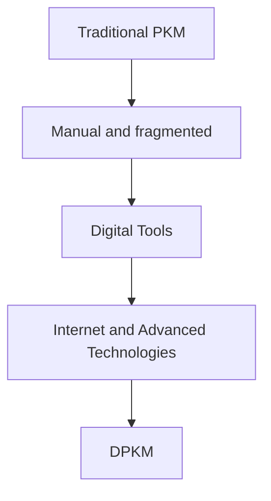
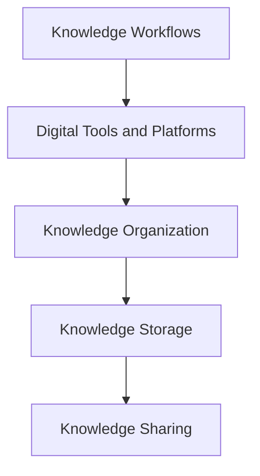
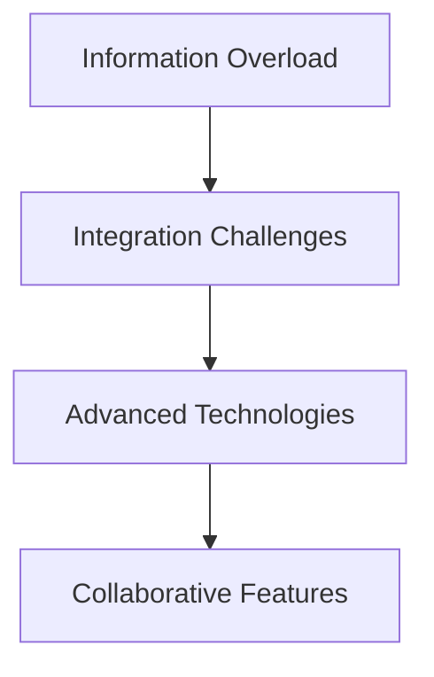
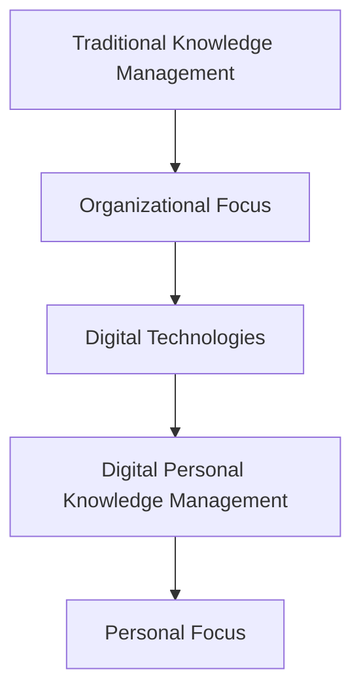

                 

### 1. Introduction to Digital Personal Knowledge Management System

#### 1.1 Overview of Digital Personal Knowledge Management

Digital Personal Knowledge Management (DPKM) represents a paradigm shift in how individuals organize, store, and process information. It leverages digital tools and technologies to enhance personal knowledge management processes. Unlike traditional knowledge management, which often involves manual and fragmented approaches, DPKM offers a more structured and integrated method.

To understand DPKM, it's essential to first grasp the concept of Personal Knowledge Management (PKM). PKM refers to the processes an individual employs to identify, create, store, use, and share knowledge. These processes include activities such as information gathering, categorizing, retrieving, and applying knowledge.

The evolution from traditional PKM to DPKM can be traced back to the proliferation of digital tools and the increasing need for individuals to manage vast amounts of information efficiently. Traditional PKM often relied on manual methods like paper notes, physical books, and simple digital tools. However, with the advent of the internet and advanced technologies like Artificial Intelligence (AI), Natural Language Processing (NLP), and Machine Learning (ML), DPKM has become a more sophisticated and efficient approach.

**Figure 1.1: Mermaid flowchart illustrating the evolution from traditional PKM to DPKM**

#### 1.2 Core Concepts and Components

At the core of DPKM are several key concepts and components that work together to create an efficient and effective personal knowledge management system. These include:

- **Knowledge Workflows**: Knowledge workflows are a series of steps or processes an individual follows to manage knowledge. These can include activities like information gathering, analysis, storage, retrieval, and sharing.

- **Digital Tools and Platforms**: Digital tools and platforms are the backbone of DPKM. These can range from simple note-taking apps to complex AI-driven platforms that offer features like natural language processing, machine learning, and data analytics.

- **Knowledge Organization**: Organizing knowledge effectively is crucial for easy retrieval and application. This involves categorizing information, creating tags, using metadata, and employing search algorithms.

- **Knowledge Storage**: Digital storage solutions, such as cloud services and databases, are used to securely store and manage large amounts of data.

- **Knowledge Sharing**: The ability to share knowledge with others is a fundamental aspect of DPKM. This can be achieved through features like collaborative editing, social sharing, and integration with social media platforms.

**Figure 1.2: Mermaid flowchart illustrating the core concepts and components of DPKM**

#### 1.3 Challenges and Opportunities in Digital Personal Knowledge Management

While DPKM offers numerous benefits, it also presents several challenges. One of the primary challenges is information overload. With the vast amount of information available online, individuals can easily become overwhelmed and struggle to manage it effectively.

Another challenge is the integration of various digital tools and platforms. While there are numerous tools available, many of them operate in silos, making it difficult for individuals to consolidate their knowledge.

Despite these challenges, DPKM also offers significant opportunities. The use of advanced technologies like AI and ML can help individuals sift through large amounts of data, identify relevant information, and automate routine tasks. Additionally, the integration of social and collaborative features can enhance knowledge sharing and learning.

**Figure 1.3: Mermaid flowchart illustrating the challenges and opportunities in DPKM**

### Conclusion

In conclusion, DPKM is a transformative approach to personal knowledge management that leverages digital tools and technologies. By understanding its core concepts and components, and by recognizing both the challenges and opportunities it presents, individuals can build a more efficient and effective system for managing their knowledge.

#### 参考文献

1. Anderson, T. (2007). The Knowledge Management Field Guide. John Wiley & Sons.
2. Nonaka, I., & Takeuchi, H. (1995). The Knowledge-Creating Company: How Japanese Companies Create the Dynamics of Innovation. Oxford University Press.
3. Davenport, T. H., & Prusak, L. (2000). Working Knowledge: How Organizations Manage What They Know. Harvard Business Press.

---

# 数字时代的个人知识管理系统：构建数字化第二大脑的软件平台

关键词：数字个人知识管理、数字化第二大脑、人工智能、自然语言处理、知识组织

摘要：本文探讨了数字时代的个人知识管理系统的概念、核心组成部分以及面临的挑战和机遇。通过分析数字个人知识管理（DPKM）的演变、核心概念和组件，以及数字第二大脑的构建方法，本文为读者提供了一个清晰的框架，以构建一个高效的数字化个人知识管理系统。

## Chapter 1: Introduction to Digital Personal Knowledge Management System

### 1.1 Overview of Digital Personal Knowledge Management

#### 1.1.1 Definition and Significance

Digital Personal Knowledge Management (DPKM) is an approach that leverages digital tools and technologies to enhance personal knowledge management processes. It involves organizing, storing, and processing information in a structured and efficient manner to facilitate learning, decision-making, and problem-solving.

The significance of DPKM lies in its ability to address the challenges posed by the digital age, such as information overload, fragmented knowledge, and the need for efficient information retrieval. By adopting a digital approach, individuals can streamline their knowledge management processes, improve productivity, and stay relevant in a rapidly changing world.

#### 1.1.2 Evolution from Traditional Knowledge Management to Digital Personal Knowledge Management

The concept of knowledge management has evolved significantly over the years. Traditional knowledge management focused on the storage and dissemination of information within organizations. However, with the advent of digital technologies, the focus has shifted towards personal knowledge management.

**Figure 1.1: Mermaid flowchart illustrating the evolution from traditional knowledge management to digital personal knowledge management**

The transition from traditional knowledge management to DPKM is characterized by several key factors:

1. **Digital Tools and Platforms**: The availability of digital tools and platforms has revolutionized personal knowledge management. These tools enable individuals to collect, organize, and analyze information more efficiently than ever before.

2. **Artificial Intelligence and Machine Learning**: AI and ML technologies have made it possible to automate routine tasks, analyze large datasets, and provide personalized recommendations, enhancing the overall effectiveness of personal knowledge management systems.

3. **Cloud Computing**: Cloud computing has enabled individuals to access their knowledge repositories from anywhere, at any time, using a variety of devices. This has increased the convenience and flexibility of personal knowledge management.

4. **Collaboration and Social Features**: Digital platforms often include collaboration and social features that facilitate knowledge sharing and learning. This has transformed personal knowledge management into a collective and collaborative process.

### 1.2 Core Concepts and Components

The core concepts and components of DPKM are essential for understanding how it works and how to implement it effectively. These include:

1. **Knowledge Workflows**: Knowledge workflows are the processes individuals follow to manage their knowledge. These workflows typically involve activities such as information gathering, analysis, storage, retrieval, and sharing.

2. **Digital Tools and Platforms**: Digital tools and platforms are the backbone of DPKM. These tools can range from simple note-taking apps to complex AI-driven platforms that offer a wide range of features, such as natural language processing, machine learning, and data analytics.

3. **Knowledge Organization**: Effective knowledge organization is crucial for easy retrieval and application. This involves categorizing information, creating tags, using metadata, and employing search algorithms.

4. **Knowledge Storage**: Digital storage solutions, such as cloud services and databases, are used to securely store and manage large amounts of data.

5. **Knowledge Sharing**: The ability to share knowledge with others is a fundamental aspect of DPKM. This can be achieved through features like collaborative editing, social sharing, and integration with social media platforms.

**Figure 1.2: Mermaid flowchart illustrating the core concepts and components of DPKM**

### 1.3 Challenges and Opportunities in Digital Personal Knowledge Management

While DPKM offers numerous benefits, it also presents several challenges. One of the primary challenges is information overload. With the vast amount of information available online, individuals can easily become overwhelmed and struggle to manage it effectively.

Another challenge is the integration of various digital tools and platforms. While there are numerous tools available, many of them operate in silos, making it difficult for individuals to consolidate their knowledge.

Despite these challenges, DPKM also offers significant opportunities. The use of advanced technologies like AI and ML can help individuals sift through large amounts of data, identify relevant information, and automate routine tasks. Additionally, the integration of social and collaborative features can enhance knowledge sharing and learning.

**Figure 1.3: Mermaid flowchart illustrating the challenges and opportunities in DPKM**

### Conclusion

In conclusion, DPKM is a transformative approach to personal knowledge management that leverages digital tools and technologies. By understanding its core concepts and components, and by recognizing both the challenges and opportunities it presents, individuals can build a more efficient and effective system for managing their knowledge.

#### 参考文献

1. Anderson, T. (2007). The Knowledge Management Field Guide. John Wiley & Sons.
2. Nonaka, I., & Takeuchi, H. (1995). The Knowledge-Creating Company: How Japanese Companies Create the Dynamics of Innovation. Oxford University Press.
3. Davenport, T. H., & Prusak, L. (2000). Working Knowledge: How Organizations Manage What They Know. Harvard Business Press.
4. Bawden, D. (2008). Knowledge management and digital libraries: Concepts, issues and technologies. Journal of Information Science, 34(2), 171-183.
5. Tenopir, C., & King, D. W. (2011). Assessing the impact of institutional repositories in scientific research. Information Processing & Management, 48(3), 570-583.

