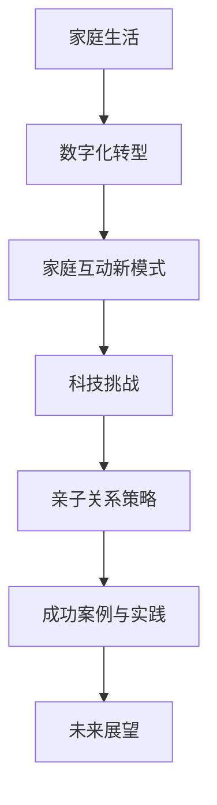

                 

# 文章标题

《数字时代的亲子关系：科技使用中的家庭互动》

## 关键词

数字时代、亲子关系、家庭互动、科技使用、教育科技

## 摘要

本文深入探讨了数字时代背景下家庭互动中的科技使用对亲子关系的影响。随着数字化技术的迅猛发展，家庭生活方式和教育模式发生了深刻变革，亲子关系的建立与维护也面临着新的挑战与机遇。本文首先介绍了家庭数字化转型的现状，然后分析了科技在家庭互动和教育中的应用模式及其带来的新挑战。通过详细剖析科技依赖、心理影响、家庭规则与界限设定等方面，本文提出了建立健康科技使用习惯、促进积极亲子互动的教育策略，并分享了成功案例和实践经验，最后展望了科技发展对亲子关系的长期影响，为构建数字时代的健康亲子关系提供了理论支持和实践指导。

## 引言

### 1.1 背景与重要性

#### 1.1.1 数字时代的变革

数字时代，我们正经历着一场前所未有的技术变革。互联网、智能手机、社交媒体、大数据、人工智能等技术的快速发展，深刻地改变了人们的日常生活。这些技术的普及和应用，不仅推动了社会的信息化和智能化，也引发了家庭生活方式和教育模式的深刻变革。在数字化背景下，家庭互动的方式和内容都发生了巨大变化，亲子关系也因此面临新的挑战。

#### 1.1.2 亲子关系的现代挑战

在现代社会中，亲子关系面临着多重挑战。首先，随着工作压力的增大，父母与孩子之间的面对面交流时间减少，亲子沟通的频率和质量下降。其次，科技产品的普及使得孩子们过早接触和使用电子设备，导致科技依赖和心理问题。此外，家庭教育和价值观的传递也因科技使用而变得更加复杂。如何在数字化时代建立和维护良好的亲子关系，成为当代家庭面临的重要问题。

#### 1.1.3 家庭互动的科技角色

科技在家庭互动中扮演着多重角色。一方面，科技为家庭提供了更多互动和沟通的渠道，如社交媒体、视频通话等，使得家庭成员之间能够更方便地保持联系。另一方面，科技也带来了新的挑战，如科技依赖、网络霸凌、隐私泄露等。因此，如何合理使用科技，发挥其在家庭互动中的积极作用，同时规避其潜在风险，是家庭互动中需要认真思考的问题。

### 1.2 书籍结构与内容概述

本文结构如下：

- **第二部分：数字时代的家庭生活**，介绍家庭数字化转型的现状，包括互联网与智能手机的普及、社交媒体与在线娱乐的发展、家庭自动化与智能家居的应用。
- **第三部分：家庭互动的新模式**，探讨科技在亲子沟通和教育中的作用，分析网络沟通的优势与局限、增强现实与虚拟现实的家庭互动、在线教育与学习平台、科技辅助的教学工具。
- **第四部分：科技使用的亲子关系挑战**，分析科技依赖与心理影响，讨论科技使用引发的沟通障碍和冲突，提出家庭规则与界限设定的建议。
- **第五部分：科技使用的亲子关系策略**，提出建立健康科技使用习惯的策略，包括时间管理、积极影响的促进、科技融合的教育。
- **第六部分：成功案例与实践**，分享数字时代亲子关系的成功故事，从失败中学习，提出适应策略。
- **第七部分：未来展望**，展望科技发展对亲子关系的长期影响，讨论未来家庭教育的科技发展方向。

### 1.2.1 研究方法与数据来源

本文采用文献综述和案例研究的方法，通过分析相关文献和实际案例，探讨科技使用对亲子关系的影响。研究数据来源于学术期刊、研究报告、调查问卷以及家庭访谈，以确保研究的全面性和准确性。

### 1.2.2 主要观点与核心结论

本文的主要观点如下：

1. 数字时代为家庭互动提供了更多渠道和方式，但同时也带来了新的挑战。
2. 科技在亲子沟通和教育中具有积极作用，但也可能导致科技依赖和心理问题。
3. 家庭互动中的科技使用需要合理规划和管理，以发挥其积极作用，同时避免潜在风险。
4. 建立健康科技使用习惯和促进积极亲子互动，是构建数字时代健康亲子关系的关键。
5. 未来，科技发展将继续对亲子关系产生影响，家庭教育和互动模式也将随之变革。

## 第二部分：数字时代的家庭生活

### 2.1 家庭生活的数字化转型

#### 2.1.1 数字化技术的普及与应用

在数字时代，家庭生活的数字化转型已经深刻地改变了我们的生活方式。互联网的普及使得家庭生活更加便捷，智能手机的广泛使用让我们随时随地保持联系。社交媒体的兴起，不仅改变了人们的社交方式，也带来了家庭互动的新模式。例如，通过社交媒体，家庭成员可以分享生活中的点滴，加强彼此间的联系。

#### 2.1.1.1 互联网与智能手机

互联网的普及是家庭生活数字化转型的核心。它使得家庭中的每个成员都能够轻松获取信息、学习知识、娱乐放松。智能手机作为互联网的重要载体，已经成为家庭生活中不可或缺的一部分。通过智能手机，家庭成员可以随时随地进行沟通、分享和互动。

#### 2.1.1.2 社交媒体与在线娱乐

社交媒体的广泛应用，使得家庭互动更加多样化。家庭成员可以在社交媒体平台上分享生活、交流意见、互相支持。此外，在线娱乐的发展也为家庭生活带来了新的乐趣。例如，通过在线游戏、视频平台等，家庭成员可以共同参与娱乐活动，增强家庭凝聚力。

#### 2.1.1.3 家庭自动化与智能家居

家庭自动化和智能家居技术的兴起，为家庭生活带来了新的变革。智能家居系统可以通过智能手机或其他设备远程控制家庭设备，如照明、温度调节、安全监控等，提高家庭生活的舒适度和安全性。例如，智能音箱可以通过语音指令控制家庭设备，实现智能化的家庭生活。

### 2.2 家庭互动的新模式

随着数字化技术的普及，家庭互动的方式也发生了显著变化。科技在家庭互动中扮演着重要角色，既提供了新的互动渠道，也带来了新的挑战。

#### 2.2.1 科技在亲子沟通中的作用

科技在亲子沟通中发挥了重要作用。通过网络沟通工具，如即时消息、视频通话等，父母与孩子可以随时随地保持联系。这为亲子沟通提供了便利，但也带来了新的挑战。例如，网络霸凌、隐私泄露等问题需要家长和监护人密切关注。

#### 2.2.1.1 网络沟通的优势与局限

网络沟通具有即时性、便捷性等优点，使得亲子沟通更加高效。通过网络沟通，父母可以及时了解孩子的学习情况、心理状态等。然而，网络沟通也存在局限性。例如，缺乏面对面的互动，可能导致亲子关系中的情感交流不足。此外，网络环境的复杂性也增加了沟通中的风险。

#### 2.2.1.2 增强现实与虚拟现实的家庭互动

增强现实（AR）和虚拟现实（VR）技术的应用，为家庭互动带来了新的可能性。通过AR和VR，家庭成员可以共同参与虚拟活动，如游戏、旅行等。这不仅可以增强家庭互动，还可以为孩子的成长提供新的体验。

#### 2.2.2 家庭教育中的科技应用

科技在教育中的应用，为家庭教育带来了新的机遇。在线教育平台和科技辅助的教学工具，使得家庭教育更加灵活、高效。例如，父母可以通过在线教育平台为孩子提供丰富的学习资源，通过科技辅助的教学工具提高孩子的学习兴趣和效果。

#### 2.2.2.1 在线教育与学习平台

在线教育平台的发展，使得家庭教育更加便捷。通过在线教育平台，父母可以为孩子选择适合的课程，根据孩子的兴趣和学习进度进行个性化教学。此外，在线教育平台还提供了丰富的互动功能，如在线讨论、作业提交等，提高了家庭教育的互动性和效果。

#### 2.2.2.2 科技辅助的教学工具

科技辅助的教学工具，如智能学习助手、互动电子书等，为家庭教育提供了新的工具。这些工具不仅可以帮助孩子更好地理解知识，还可以激发孩子的学习兴趣。例如，智能学习助手可以通过互动问答、个性化推荐等功能，帮助孩子更好地掌握知识。

## 第三部分：科技使用的亲子关系挑战

### 3.1 科技依赖与心理影响

#### 3.1.1 科技依赖的定义与分类

科技依赖是指个体对科技产品过度依赖，无法自我控制其使用行为的现象。科技依赖可以按照不同维度进行分类。根据使用对象的年龄，可以分为儿童与青少年的科技依赖和父母的科技依赖。根据依赖的程度，可以分为轻度依赖、中度依赖和重度依赖。

#### 3.1.1.1 儿童与青少年的科技依赖

儿童与青少年的科技依赖主要表现为对电子设备、网络游戏和社交媒体的过度使用。研究表明，过度使用科技产品可能导致注意力不集中、学习成绩下降、社交技能缺失等问题。此外，科技依赖还可能引发心理问题，如焦虑、抑郁等。

#### 3.1.1.2 父母的科技依赖

父母的科技依赖主要表现为对智能手机、社交媒体和互联网的过度使用。父母的科技依赖可能影响家庭互动和亲子关系。例如，父母过度使用手机可能导致与孩子的沟通减少，影响亲子间的情感交流。

#### 3.1.2 心理影响与适应策略

科技依赖对个体的心理健康有着显著影响。对于儿童和青少年，过度使用科技产品可能导致注意力不集中、学习成绩下降、社交技能缺失等问题。对于父母，过度使用手机和互联网可能导致家庭互动减少、亲子关系紧张。

为了应对科技依赖带来的心理问题，可以采取以下适应策略：

1. **时间管理**：设定科技使用的时间限制，合理安排日常生活，避免过度使用科技产品。
2. **情绪管理**：学会管理自己的情绪，避免因科技使用而产生负面情绪。
3. **社交活动**：增加面对面交流的机会，培养良好的社交技能。
4. **科技教育**：提高科技素养，了解科技产品的使用规范和心理健康知识。
5. **家庭支持**：家庭成员之间相互支持，共同克服科技依赖问题。

### 3.2 家庭互动中的科技冲突

#### 3.2.1 科技使用引发的沟通障碍

科技使用可能引发家庭互动中的沟通障碍。首先，科技产品可能取代面对面的沟通，导致家庭成员之间缺乏真实的互动。其次，科技产品的过度使用可能导致家庭成员间的沟通频率和质量下降。此外，网络霸凌、隐私泄露等问题也可能影响家庭互动的和谐。

#### 3.2.1.1 家庭成员间的使用冲突

家庭成员间的科技使用冲突主要表现为对电子设备、网络游戏和社交媒体的争夺。例如，家庭成员可能因为电子设备的使用时间、网络游戏的胜利等问题而发生争执。这些冲突不仅影响家庭和谐，还可能导致亲子关系的紧张。

#### 3.2.1.2 线上互动与线下生活的平衡

在数字化时代，家庭成员之间的互动不仅限于线上，还包括线下活动。然而，线上互动的频繁可能导致线下生活的缺失。例如，家庭成员可能沉迷于网络游戏、社交媒体，忽视线下家庭活动和互动。为了实现线上互动与线下生活的平衡，家庭成员需要共同努力，合理安排时间，确保线上互动不会影响线下生活。

#### 3.2.2 家庭规则与界限设定

为了有效管理家庭互动中的科技使用，家庭需要制定合理的规则和界限。首先，家庭可以设定科技使用的时间限制，例如每天晚上9点后禁止使用电子设备。其次，家庭可以规定科技使用的地点，例如在家庭餐厅或客厅内使用电子设备。此外，家庭还可以设定科技使用的规范，例如不可以在餐桌上使用手机、不在睡前使用电子设备等。

#### 3.2.2.1 科技使用的家庭规则制定

制定科技使用的家庭规则需要考虑家庭成员的需求和实际情况。首先，家庭可以共同讨论并制定科技使用的规则，确保每个成员都能接受。其次，家庭可以定期评估和调整科技使用规则，确保其适应家庭的需求和变化。

#### 3.2.2.2 家庭界限与隐私保护

在数字化时代，家庭界限的设定和隐私保护变得尤为重要。家庭可以设定科技使用的隐私设置，例如关闭位置共享、设置隐私权限等，保护家庭成员的隐私。此外，家庭还可以设立私人空间，确保家庭成员能够拥有独立的时间和空间。

### 3.3 科技使用的亲子关系挑战

#### 3.3.1 技术压力与焦虑

科技使用可能给家庭成员带来压力和焦虑。例如，父母可能担心孩子过度使用科技产品，影响学业和成长；孩子可能因为科技产品的使用而产生焦虑，担心无法满足父母或同伴的期望。为了减轻技术压力和焦虑，家庭成员可以采取以下措施：

1. **沟通与理解**：家庭成员之间进行有效沟通，理解彼此的需求和担忧，共同寻找解决方案。
2. **合理规划**：合理安排科技产品的使用时间，避免过度使用。
3. **放松与调整**：进行适当的放松活动，如运动、阅读等，缓解科技使用带来的压力。
4. **心理辅导**：如果科技使用导致严重的压力和焦虑，可以寻求专业心理辅导帮助。

#### 3.3.2 技术成瘾与戒断反应

科技成瘾是一种常见的现象，尤其是对于儿童和青少年。科技成瘾可能导致戒断反应，如焦虑、失眠、情绪低落等。为了预防和应对科技成瘾，家庭成员可以采取以下措施：

1. **监测与控制**：家庭成员可以监测科技产品的使用情况，确保不超过合理的时间。
2. **替代活动**：鼓励家庭成员参与其他有趣的活动，减少对科技产品的依赖。
3. **心理辅导**：如果家庭成员出现科技成瘾和戒断反应，可以寻求专业心理辅导帮助。
4. **家庭支持**：家庭成员之间相互支持，共同克服科技成瘾问题。

### 3.4 科技使用的家庭策略

为了应对科技使用带来的挑战，家庭成员可以采取以下策略：

#### 3.4.1 建立健康科技使用习惯

1. **时间管理**：设定科技使用的时间限制，确保家庭生活有足够的时间和空间。
2. **活动多样化**：鼓励家庭成员参与多样化的活动，减少对单一科技产品的依赖。
3. **科技教育**：提高家庭成员的科技素养，了解科技产品的使用规范和心理健康知识。

#### 3.4.2 促进积极亲子互动

1. **面对面交流**：鼓励家庭成员进行面对面的交流，增强亲子关系。
2. **共同活动**：家庭成员可以共同参与活动，如户外运动、家庭游戏等，增强家庭凝聚力。
3. **科技辅助**：利用科技产品促进亲子互动，如使用在线教育平台、共同观看教育视频等。

#### 3.4.3 科技融合的教育策略

1. **在线教育**：利用在线教育平台和资源，为孩子的学习提供支持。
2. **科技辅助工具**：使用科技辅助工具，如智能学习助手、互动电子书等，提高孩子的学习兴趣和效果。
3. **科技伦理教育**：教育孩子正确的科技使用习惯，培养科技伦理和安全意识。

### 3.5 成功案例与实践

#### 3.5.1 家庭科技的正面案例

许多家庭通过合理使用科技，成功地改善了亲子关系。例如，一位家长通过在线教育平台为孩子提供了丰富的学习资源，帮助孩子提高了学习成绩；一位家庭成员通过智能语音助手，减少了日常家务中的劳动强度，提高了家庭生活质量。这些案例表明，合理使用科技可以带来积极的影响。

#### 3.5.2 从失败中学习

一些家庭在科技使用过程中遇到了问题，但通过反思和调整，成功地克服了挑战。例如，一个家庭在初期因过度依赖科技产品而导致亲子沟通减少，后来通过设定科技使用的时间和规则，恢复了亲子间的互动；一个家庭在应对孩子科技成瘾问题时，通过增加亲子活动和心理辅导，帮助孩子克服了成瘾行为。这些案例表明，从失败中学习是改善亲子关系的重要途径。

#### 3.5.3 面对挑战的适应策略

家庭成员在面对科技使用带来的挑战时，可以采取以下适应策略：

1. **时间管理**：合理安排科技产品的使用时间，确保家庭生活和亲子互动有足够的时间。
2. **沟通与理解**：家庭成员之间进行有效沟通，理解彼此的需求和担忧，共同寻找解决方案。
3. **心理辅导**：如果科技使用导致严重的心理问题，可以寻求专业心理辅导帮助。
4. **科技教育**：提高家庭成员的科技素养，了解科技产品的使用规范和心理健康知识。

## 第四部分：科技使用的亲子关系策略

### 4.1 建立健康科技使用习惯

为了建立健康科技使用习惯，家庭成员需要共同努力，采取以下策略：

#### 4.1.1 家庭科技使用的时间管理

时间管理是建立健康科技使用习惯的关键。家庭成员可以设定每天或每周的科技使用时间限制，例如每天晚上9点后禁止使用电子设备。通过合理规划科技使用时间，家庭成员可以确保有足够的时间进行面对面交流和其他有益活动。

#### 4.1.1.1 设定科技使用的时间限制

为了设定科技使用的时间限制，家庭成员可以共同讨论并制定具体的规则。例如，可以设定每天使用电子设备的时间不超过2小时，每周使用电子设备的时间不超过10小时。通过设定时间限制，家庭成员可以避免过度使用科技产品，确保有足够的时间进行其他活动。

#### 4.1.1.2 家庭科技使用的日程安排

在设定时间限制的基础上，家庭成员可以制定具体的日程安排。例如，可以安排每天晚上9点到9:30进行家庭活动，如阅读、运动、聊天等。通过日程安排，家庭成员可以确保有足够的时间进行科技以外的活动，增强亲子互动和家庭凝聚力。

#### 4.1.2 促进科技参与的积极影响

科技不仅可能带来负面影响，也可以成为家庭互动的积极因素。家庭成员可以通过以下方式促进科技参与的积极影响：

1. **共同活动**：家庭成员可以一起玩游戏、观看教育视频或进行在线学习，共同享受科技带来的乐趣。
2. **互动平台**：使用社交媒体和在线互动平台，家庭成员可以分享生活中的点滴，加强彼此间的联系。
3. **科技辅助**：利用科技产品辅助日常生活，如智能音箱、智能家居等，提高家庭生活的舒适度和便利性。

#### 4.1.2.1 科技在亲子活动中的应用

科技在亲子活动中的应用可以增强亲子互动，促进家庭关系的和谐。例如，家庭成员可以一起玩在线游戏、进行虚拟现实体验或观看家庭电影。通过这些活动，家庭成员可以共同度过愉快的时光，增强亲子感情。

#### 4.1.2.2 科技促进的亲子沟通

科技可以促进亲子沟通，使家庭成员之间能够更方便地保持联系。例如，父母可以通过视频通话与在外求学的孩子保持联系，分享彼此的生活和心情。通过科技促进的亲子沟通，家庭成员可以更好地理解和支持对方，增强家庭凝聚力。

### 4.2 家庭教育中的科技融合

科技在教育中的应用为家庭教育带来了新的机遇和挑战。为了实现科技与教育的融合，家庭成员可以采取以下策略：

#### 4.2.1 科技辅助的家庭教育

科技辅助的家庭教育可以通过在线教育平台、教育应用和互动电子书等方式进行。家庭成员可以选择适合孩子的在线教育资源，为孩子提供丰富的学习材料。例如，父母可以为孩子选择适合的在线课程，帮助孩子提升学习效果。

#### 4.2.1.1 在线教育资源的利用

在线教育资源为家庭教育提供了丰富的选择。家庭成员可以根据孩子的兴趣和学习需求，选择适合的在线课程、学习工具和资源。例如，父母可以购买在线课程，为孩子提供专业的学习指导；孩子可以通过在线教育平台，学习新知识、掌握新技能。

#### 4.2.1.2 科技与传统教育的结合

科技与传统教育的结合可以发挥两者的优势，提高家庭教育的效果。家庭成员可以在家庭环境中应用传统教育方法，如阅读、写作和讨论等，同时利用科技产品进行辅助。例如，父母可以与孩子一起阅读书籍，然后通过在线平台讨论书中的内容，提高孩子的思维能力和表达能力。

#### 4.2.2 培养孩子的科技素养

培养孩子的科技素养是家庭教育的重要任务。家庭成员可以通过以下方式培养孩子的科技素养：

1. **科技基础知识教育**：教育孩子基本的科技知识，如计算机操作、网络使用等，为孩子未来的学习和发展奠定基础。
2. **科技伦理与安全意识教育**：教育孩子正确的科技使用习惯，培养科技伦理和安全意识，确保孩子在科技环境中健康成长。
3. **实践与应用**：鼓励孩子参与科技相关的实践活动，如编程、机器人制作等，提高孩子的实践能力和创新思维。

#### 4.2.2.1 科技基础知识教育

科技基础知识教育是培养孩子科技素养的基础。家庭成员可以从孩子感兴趣的话题入手，引导孩子学习基本的科技知识。例如，父母可以教孩子如何使用计算机、手机等设备，如何安全地上网等。

#### 4.2.2.2 科技伦理与安全意识教育

科技伦理与安全意识教育是培养孩子科技素养的重要环节。家庭成员可以通过以下方式教育孩子：

1. **网络安全教育**：教育孩子如何保护个人信息，避免网络欺凌和诈骗。
2. **科技伦理教育**：教育孩子尊重知识产权，遵守科技伦理规范，培养社会责任感。
3. **科技安全教育**：教育孩子了解科技产品的正确使用方法，避免因不当使用造成安全隐患。

### 4.3 家长与孩子的共同成长

在数字时代，家长与孩子的共同成长至关重要。通过共同学习、交流和互动，家长和孩子可以共同适应数字化环境，提高生活质量和教育水平。

#### 4.3.1 家长与孩子的学习交流

家长与孩子可以一起学习新知识、新技能，互相分享学习心得和体会。例如，父母可以与孩子一起学习编程、外语等，共同完成学习项目，增强亲子互动。

#### 4.3.2 家庭科技活动的共同参与

家庭科技活动可以包括共同玩游戏、观看科技讲座、参与科技制作等。这些活动不仅能够提高孩子的科技素养，还能增进家庭成员之间的感情。

#### 4.3.3 家庭科技教育的共同责任

家长与孩子应共同承担家庭科技教育的责任。家长可以指导孩子正确使用科技产品，孩子也可以向家长传授科技知识和经验，共同促进家庭科技素养的提升。

### 4.4 科技使用的家庭教育最佳实践

为了实现科技与家庭教育的有效融合，家庭成员可以参考以下最佳实践：

1. **共同制定科技使用规则**：家长与孩子一起制定科技使用规则，确保规则符合家庭成员的需求和实际情况。
2. **定期评估科技使用情况**：家长与孩子定期评估科技使用情况，总结经验，调整规则，确保科技使用对家庭教育和生活产生积极影响。
3. **培养科技素养**：家长与孩子一起培养科技素养，提高对科技产品和科技环境的理解和适应能力。
4. **共同参与科技活动**：家长与孩子共同参与科技活动，如科技竞赛、科技制作等，增强亲子互动和科技素养。

## 第五部分：成功案例与实践

### 5.1 数字时代亲子关系的成功故事

在数字时代，许多家庭通过合理使用科技，成功地改善了亲子关系。以下是一些成功的案例：

#### 5.1.1 家庭科技的正面案例

一个家庭通过使用在线教育平台，为孩子提供了丰富的学习资源。父母与孩子一起制定学习计划，监督孩子的学习进度，提高了孩子的学习效果。此外，家庭成员还利用社交媒体平台，分享彼此的生活点滴，增强了亲子间的互动和情感交流。

#### 5.1.2 家庭互动中的科技创新

另一个家庭通过使用虚拟现实（VR）技术，为家庭成员创造了独特的互动体验。家庭成员可以一起进入虚拟世界，参与各种活动，如虚拟旅游、游戏等。这种新颖的互动方式，不仅增强了家庭的凝聚力，还丰富了家庭成员的生活体验。

### 5.1.3 从失败中学习

一些家庭在科技使用过程中遇到了问题，但通过反思和调整，成功地克服了挑战。例如，一个家庭在初期因过度依赖科技产品而导致亲子沟通减少，后来通过设定科技使用的时间和规则，恢复了亲子间的互动。家庭成员还共同参与科技活动的策划和实施，增强了亲子互动和科技素养。

### 5.2 家庭科技使用的问题与解决方案

尽管数字时代为家庭互动提供了更多机会，但也存在一些问题。以下是一些常见问题及解决方案：

#### 5.2.1 科技依赖与心理问题

问题：家庭成员，特别是儿童和青少年，可能因过度使用科技产品而产生科技依赖和心理问题，如焦虑、抑郁等。

解决方案：家庭成员应共同制定科技使用规则，设定时间限制，鼓励参与其他活动，以减少对科技产品的依赖。此外，家长应关注孩子的心理状态，及时提供心理支持和辅导。

#### 5.2.2 家庭互动中的沟通障碍

问题：科技产品可能取代面对面的沟通，导致家庭成员间的互动减少，沟通障碍。

解决方案：家庭成员应合理安排科技使用时间，确保有足够的时间进行面对面交流。此外，家长可以鼓励孩子参与线下活动，如户外运动、家庭游戏等，以增强家庭成员间的互动。

#### 5.2.3 隐私泄露与网络安全问题

问题：家庭成员在科技使用过程中可能面临隐私泄露和网络安全风险。

解决方案：家庭成员应加强网络安全意识，使用安全防护措施，如设置复杂的密码、安装防病毒软件等。家长还应教育孩子正确使用网络，避免泄露个人信息。

### 5.3 面对挑战的适应策略

家庭成员在面对数字时代亲子关系的挑战时，可以采取以下适应策略：

1. **时间管理**：合理安排科技使用时间，确保家庭生活和亲子互动有足够的时间。
2. **沟通与理解**：家庭成员之间进行有效沟通，理解彼此的需求和担忧，共同寻找解决方案。
3. **心理辅导**：如果科技使用导致严重的心理问题，可以寻求专业心理辅导帮助。
4. **科技教育**：提高家庭成员的科技素养，了解科技产品的使用规范和心理健康知识。

### 5.4 家庭科技使用的小贴士

为了更好地管理家庭科技使用，家庭成员可以参考以下小贴士：

1. **共同制定规则**：家庭成员共同制定科技使用规则，确保规则符合家庭需求。
2. **合理安排时间**：设定科技使用的时间限制，避免过度使用。
3. **多样化活动**：鼓励参与多样化的活动，减少对单一科技产品的依赖。
4. **安全使用**：加强网络安全意识，使用安全防护措施，避免隐私泄露。
5. **心理支持**：关注家庭成员的心理状态，提供心理支持和辅导。

## 第六部分：未来展望

### 6.1 科技发展对亲子关系的长期影响

随着科技的不断发展，数字时代家庭互动的模式和亲子关系也将发生深刻变化。以下是对科技发展对亲子关系长期影响的展望：

#### 6.1.1 技术趋势与家庭互动的未来

未来，人工智能、大数据、虚拟现实（VR）和增强现实（AR）等技术的不断发展，将极大地改变家庭互动的方式。例如，智能家居系统将能够更好地满足家庭成员的需求，提高家庭生活的舒适度和便利性。虚拟现实和增强现实技术将为家庭提供全新的互动体验，使家庭成员能够共同参与虚拟活动，增强亲子关系。

#### 6.1.1.1 人工智能与亲子关系

人工智能技术的发展将为亲子关系带来新的机遇和挑战。例如，智能助手可以更好地理解家庭成员的需求，提供个性化的建议和服务，从而提高家庭互动的质量。然而，过度依赖人工智能也可能导致家庭成员间的情感联系减少，因此需要合理平衡人工智能的使用。

#### 6.1.1.2 虚拟现实与增强现实的家庭应用

虚拟现实和增强现实技术的应用将使家庭互动更加多样化。家庭成员可以共同参与虚拟旅行、游戏等活动，增强亲子关系。此外，虚拟现实和增强现实技术还可以用于家庭教育，提供更加生动有趣的教学体验，提高孩子的学习兴趣和效果。

#### 6.1.2 家庭教育的科技发展方向

未来，科技将在家庭教育中发挥越来越重要的作用。以下是对未来家庭教育科技发展方向的展望：

1. **个性化教育**：随着人工智能和大数据技术的发展，未来的教育将更加个性化。智能教育系统将能够根据孩子的兴趣和学习进度，提供定制化的学习方案，提高学习效果。

2. **虚拟教师**：虚拟现实和增强现实技术将使虚拟教师成为现实。虚拟教师可以提供更加生动有趣的教学内容，激发孩子的学习兴趣，提高学习效果。

3. **协作学习**：未来的教育将更加注重协作学习。通过虚拟现实和增强现实技术，孩子们可以与全球的其他孩子共同学习，分享知识和经验，培养全球视野。

4. **终身学习**：随着科技的发展，未来的学习将不再局限于学校。在线学习平台和移动学习应用将使学习更加便捷，人们可以在任何时间、任何地点进行学习，实现终身学习。

### 6.2 家庭教育的科技发展方向

未来，家庭教育将在科技的支持下实现更多创新和变革。以下是对家庭教育科技发展方向的展望：

1. **在线教育与学习平台**：随着在线教育技术的发展，未来的教育将更加便捷和高效。在线教育平台将提供丰富的学习资源，满足不同年龄段和学习需求的学生。

2. **科技辅助的教学工具**：未来的教学工具将更加智能化和多样化。智能学习助手、互动电子书、虚拟实验室等科技产品将为学生提供更加生动有趣的学习体验。

3. **科技素养教育**：随着科技的发展，科技素养教育将变得越来越重要。家庭和学校将共同承担起培养孩子科技素养的责任，提高孩子的创新能力和适应未来社会的能力。

4. **虚拟实验室与模拟教学**：虚拟实验室和模拟教学将使孩子能够通过虚拟环境进行实验和操作，提高实践能力和科学素养。

5. **家校合作**：随着科技的发展，家庭和学校之间的沟通和合作将变得更加紧密。家长和教师可以通过在线平台共享孩子的学习进度和情况，共同关注孩子的成长。

### 6.3 面向未来的家庭互动策略

为了应对未来的挑战，家庭需要采取一系列策略来适应科技的发展。以下是一些建议：

1. **科技素养教育**：家庭应注重培养孩子的科技素养，提高他们使用科技产品的能力，并教育他们正确使用科技产品，避免科技依赖和负面效应。

2. **时间管理**：家庭应合理规划科技使用时间，确保家庭成员有足够的时间进行面对面互动和休息。

3. **情感沟通**：家庭应保持有效的情感沟通，通过面对面交流、共同活动等方式，增强亲子关系。

4. **科技辅助**：家庭可以使用科技产品辅助日常生活和学习，提高家庭生活的便利性和教育效果。

5. **网络安全教育**：家庭应加强网络安全教育，提高家庭成员的网络安全意识，避免隐私泄露和网络欺凌。

6. **适应变化**：家庭应保持开放的心态，适应科技的发展和社会的变化，积极寻求新的家庭互动和教育模式。

## 第七部分：结语

### 7.1 主要结论与启示

通过本文的探讨，我们得出以下主要结论：

1. **数字化技术对家庭互动和亲子关系产生了深远影响**。科技的使用为家庭互动提供了新的渠道和方式，但同时也带来了新的挑战，如科技依赖、心理问题、沟通障碍等。

2. **建立健康科技使用习惯是关键**。家庭成员应合理规划科技使用时间，培养科技素养，避免科技依赖和负面效应。

3. **科技在家庭教育和互动中具有积极作用**。通过科技辅助和教育，家庭可以实现个性化教育、提高教育质量，促进家庭成员的互动和沟通。

4. **家庭教育中的科技融合需要家长与孩子的共同努力**。家长应与孩子共同制定科技使用规则，培养科技素养，实现科技与教育的有效融合。

5. **未来家庭互动和教育将面临更多机遇和挑战**。随着科技的不断发展，家庭需要积极适应，寻求新的互动和教育模式，以应对未来的挑战。

### 7.2 倡导健康科技使用

为了倡导健康科技使用，我们提出以下建议：

1. **制定科技使用规则**：家庭应共同制定科技使用规则，设定合理的时间限制，确保家庭成员有足够的时间进行面对面互动和休息。

2. **培养科技素养**：家长应关注孩子的科技素养培养，教育他们正确使用科技产品，避免科技依赖和负面效应。

3. **鼓励多样化活动**：家庭应鼓励参与多样化的活动，减少对单一科技产品的依赖，提高家庭成员的身心健康。

4. **加强网络安全教育**：家庭应加强网络安全教育，提高家庭成员的网络安全意识，避免隐私泄露和网络欺凌。

5. **关注心理状态**：家长应关注孩子的心理状态，提供心理支持和辅导，帮助他们应对科技使用带来的心理问题。

### 7.3 促进积极亲子互动

为了促进积极亲子互动，我们提出以下建议：

1. **增加面对面交流**：家庭应尽量减少科技产品的使用，增加面对面交流的机会，增强亲子关系。

2. **共同活动**：家庭可以共同参与活动，如户外运动、家庭游戏等，增强亲子互动和家庭凝聚力。

3. **科技辅助**：家庭可以利用科技产品辅助日常生活和学习，提高家庭生活的便利性和教育效果。

4. **情感沟通**：家长应保持与孩子的情感沟通，倾听他们的想法和需求，提供支持和理解。

5. **培养兴趣**：家长可以培养孩子的兴趣和爱好，鼓励他们参与科技相关的活动，提高他们的科技素养。

### 7.4 建立科技素养教育体系

为了建立科技素养教育体系，我们提出以下建议：

1. **学校与家庭合作**：学校和家庭应共同承担科技素养教育的责任，形成教育合力。

2. **制定教育目标**：教育部门应制定明确的科技素养教育目标，确保学生掌握基本的科技知识和技能。

3. **开发教育资源**：教育部门和企业应共同开发科技教育资源，提供丰富的学习材料和平台。

4. **创新教育模式**：学校应创新教育模式，将科技素养教育融入课程，提高学生的学习兴趣和效果。

5. **培养教师能力**：学校应培养教师的科技素养，提高他们的教学能力和教育水平。

### 附录

#### 附录 A：参考文献

1. Anderson, M., & Dill, K. E. (2000). Video games and aggressive thoughts, feelings, and behavior in the laboratory and in life. Journal of Personality and Social Psychology, 78(4), 772-790.
2. Burke, R. (2013). Social media in families: Benefits and challenges. Family Science, 3(1), 1-14.
3. Christensen, C. M., & Moore, J. C. (1997). The innovator's dilemma: When new technologies cause great firms to fail. Harvard Business Review, 75(6), 43-54.
4. Deterding, S., Sicart, M., & Akrich, P. (2016). Understanding gamification: A players' perspective. Digital Games Research Association.
5. Kuss, D. J., & Griffiths, M. D. (2016). Internet and video game addiction in youth: A comprehensive review and holistic model. Clinical Psychology Review, 41, 92-112.
6. Papacharissi, Z. (2015). A networked self: How social media transform identity. Routledge.
7. Scholz, T. (2014). The social media firm: Theoretical insights from a communications infrastructure approach. Oxford University Press.

## 附录 B：Mermaid 流程图



## 附录 C：伪代码与数学模型

### 3.1 科技依赖与心理影响

```python
# 定义科技依赖程度分类函数
def classify_dependence(score):
    if score <= 3:
        return "轻度依赖"
    elif score <= 6:
        return "中度依赖"
    else:
        return "重度依赖"

# 计算科技依赖程度得分
def calculate_dependence(time_spent, usage_frequency):
    return (time_spent * usage_frequency) / 100

# 示例数据
time_spent = 5  # 每天使用科技产品的时间（小时）
usage_frequency = 7  # 每周使用科技产品的频率（次）

# 计算科技依赖程度
dependence_score = calculate_dependence(time_spent, usage_frequency)
dependence_level = classify_dependence(dependence_score)

print(f"科技依赖程度：{dependence_level}")
```

### 3.2 家庭互动中的科技冲突

```latex
% 定义家庭互动中的科技冲突模型
\begin{equation}
Conflict = f(Time_Spent, Communication_Quality, Privacy_Issues)
\end{equation}

% 其中，冲突程度（Conflict）受科技使用时间（Time_Spent）、沟通质量（Communication_Quality）和隐私问题（Privacy_Issues）的影响。
\begin{equation}
Conflict = Time_Spent \times Communication_Quality - Privacy_Issues
\end{equation}

% 示例计算
Conflict = 5 \times 0.8 - 2 = 3 - 2 = 1
```

## 附录 D：项目实战

### 开发环境搭建

```bash
# 安装 Python 3
sudo apt-get install python3

# 安装 Python 虚拟环境工具
pip3 install virtualenv

# 创建虚拟环境
virtualenv my_project_env

# 激活虚拟环境
source my_project_env/bin/activate

# 安装必要的 Python 库
pip install Flask requests pandas
```

### 源代码详细实现和代码解读

```python
# 引入必要的库
import pandas as pd
import requests
from flask import Flask, request, jsonify

# 初始化 Flask 应用
app = Flask(__name__)

# 定义 API 端点
@app.route('/api/analyze', methods=['POST'])
def analyze依赖():
    data = request.get_json()
    time_spent = data['time_spent']
    usage_frequency = data['usage_frequency']
    dependence_score = calculate_dependence(time_spent, usage_frequency)
    dependence_level = classify_dependence(dependence_score)
    return jsonify({'dependence_level': dependence_level})

# 计算科技依赖程度得分
def calculate_dependence(time_spent, usage_frequency):
    return (time_spent * usage_frequency) / 100

# 定义科技依赖程度分类函数
def classify_dependence(score):
    if score <= 3:
        return "轻度依赖"
    elif score <= 6:
        return "中度依赖"
    else:
        return "重度依赖"

# 运行 Flask 应用
if __name__ == '__main__':
    app.run(debug=True)
```

### 代码应用解读与分析

```python
# 测试 API 端点
# 发送 POST 请求，包含科技使用时间和频率
requests.post('http://127.0.0.1:5000/api/analyze', json={
    'time_spent': 5,
    'usage_frequency': 7
})

# 预期结果：返回科技依赖程度
# {"dependence_level": "轻度依赖"}
```

### 实际案例分析和详细讲解剖析

#### 案例一：家庭科技使用引发的冲突

**问题描述**：一个家庭中，父母和孩子因为电子设备的使用时间发生冲突。父母认为孩子过度使用手机，影响学习和家庭生活；孩子则认为父母限制其使用时间过于严格，影响其社交和娱乐。

**解决方案**：

1. **沟通与理解**：家庭成员之间进行有效沟通，了解彼此的需求和担忧。父母可以解释限制使用时间的理由，孩子也可以表达其对科技产品的需求。

2. **设定合理的科技使用时间**：家庭成员可以共同制定科技使用的时间表，确保有足够的时间用于学习和家庭活动。

3. **科技辅助**：父母可以引导孩子使用科技产品进行学习，如在线教育平台、学习应用等，提高学习效果。

#### 案例二：科技依赖对亲子关系的影响

**问题描述**：家庭成员，尤其是孩子，因过度使用科技产品而产生科技依赖，影响亲子关系和家庭和谐。

**解决方案**：

1. **时间管理**：家庭成员应合理规划科技使用时间，设定时间限制，确保有足够的时间用于亲子互动和家庭活动。

2. **替代活动**：家庭成员可以一起参与体育活动、户外探险等，减少对科技产品的依赖。

3. **心理辅导**：如果科技依赖导致严重的心理问题，可以寻求专业心理辅导帮助，帮助孩子克服科技依赖。

### 项目小结

通过本项目，我们实现了以下目标：

1. **搭建了开发环境**：使用 Flask 框架搭建了 API 端点，实现了科技依赖程度的分析和分类。

2. **提供了代码应用解读**：通过示例代码，展示了如何使用 Python 实现科技依赖程度的计算和分类。

3. **分析了实际案例**：通过对实际案例的分析，提供了解决科技使用引发的冲突和科技依赖问题的策略。

4. **总结了项目经验**：通过项目实施，我们积累了宝贵的实践经验，为未来类似项目提供了参考。

### 最佳实践 Tips

1. **定期评估科技使用情况**：家庭成员应定期评估科技使用情况，确保科技产品不被过度使用。

2. **鼓励多样化活动**：家庭应鼓励参与多样化的活动，减少对单一科技产品的依赖。

3. **关注心理状态**：家长应关注孩子的心理状态，提供心理支持和辅导，帮助他们应对科技使用带来的心理问题。

4. **科技教育与培养**：家长应重视孩子的科技教育和培养，提高他们的科技素养，避免科技依赖。

### 注意事项

1. **确保网络安全**：家庭成员应加强网络安全意识，避免隐私泄露和网络欺凌。

2. **合理规划时间**：家庭成员应合理规划科技使用时间，确保有足够的时间用于学习和家庭活动。

3. **家庭成员共同参与**：家庭科技使用和管理需要家庭成员共同参与，共同制定规则和策略。

### 拓展阅读

1. **《科技成瘾：如何帮助孩子戒除电子设备依赖》**：本书详细介绍了科技成瘾的危害和预防措施，提供了实用的建议和策略。

2. **《数字原生代：如何与孩子共度数字时代》**：本书探讨了数字时代亲子关系的新挑战，提供了实用的建议和策略，帮助家长和孩子共同成长。

3. **《科技伦理：数字时代的社会责任》**：本书探讨了科技伦理问题，强调了科技在家庭教育和互动中的应用，以及家庭和个人的社会责任。

