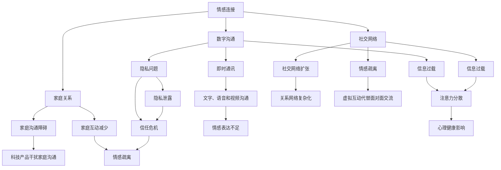
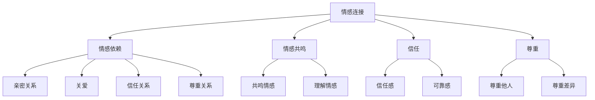

                 

### 文章标题

《数字时代的亲密关系：科技对情感连接的影响与应对》

### 关键词

数字时代，亲密关系，情感连接，科技影响，应对策略

### 摘要

本文深入探讨数字时代科技对亲密关系的影响，分析其正面和负面作用，以及如何应对由此带来的情感连接挑战。通过详细的背景介绍、概念阐释、案例分析及未来展望，本文旨在为读者提供一套实用的策略，帮助个人和家庭在科技驱动的社会中维护和增强情感连接。

## 引言

### 数字时代的特征

数字时代，又称信息化时代，是自20世纪末以来人类社会的一个显著特征。其主要特征包括：

1. **移动性**：移动设备的普及使得人们可以随时随地访问信息，打破了时间和空间的限制。
2. **即时性**：即时通讯和社交媒体使信息的传递速度大幅提高，人们可以迅速获取和分享信息。
3. **全球互联**：互联网的广泛应用使得全球各地的人们可以轻松建立联系，跨越地理障碍。

### 科技的快速变革

科技的快速发展为人们的生活带来了诸多便利，但同时也引发了诸多挑战。关键科技包括：

1. **人工智能**：AI技术在推荐系统、智能助手等方面得到了广泛应用，极大地改变了人们的沟通方式和生活方式。
2. **物联网**：物联网设备的普及使得家庭自动化和智能家居成为现实，提高了生活品质。
3. **社交媒体**：社交媒体平台成为人们交流的重要工具，但也带来了信息过载和隐私问题。

### 亲密关系的演变

数字技术的广泛应用对亲密关系产生了深远影响。一方面，它使得沟通更加便捷，有助于加强亲密关系；另一方面，它也可能导致情感疏离，削弱亲密关系。具体而言：

1. **沟通方式的改变**：数字技术使得沟通更加即时和多样化，但过度依赖技术沟通可能导致情感表达不足。
2. **家庭关系的挑战**：家庭成员间的互动方式发生了变化，科技产品可能成为家庭沟通的障碍。
3. **社交网络的复杂性**：社交媒体的普及使得人们的关系网络更加复杂，但同时也可能导致情感疏离。

## 科技对亲密关系的影响

### 沟通方式的改变

数字技术极大地改变了人们的沟通方式，这既带来了便利，也带来了一定的挑战。以下是几个关键方面：

1. **即时沟通**：即时通讯工具如微信、WhatsApp等使得人们可以随时随地交流，缩短了沟通的时间差。
2. **多样化沟通**：社交媒体、视频通话、直播等多样化的沟通方式使得沟通内容更加丰富。
3. **情感表达不足**：虽然数字技术使得沟通更加便捷，但文字、语音和视频等形式的沟通往往缺乏面对面交流中的情感丰富性和互动性。

### 家庭关系的挑战

数字技术的广泛应用对家庭关系产生了显著影响，这既有积极的一面，也有负面的影响。

1. **家庭成员间的互动减少**：家庭成员可能因为长时间使用手机、电脑等设备而减少面对面互动，导致情感疏离。
2. **家庭沟通障碍**：家庭成员之间的沟通可能被科技产品干扰，如家庭聚会时玩手机等。
3. **亲子关系的变化**：父母和子女之间的沟通可能受到科技产品的干扰，如电子游戏的过度使用等。

### 社交网络的复杂性

社交媒体的普及改变了人们的社交行为和社交网络结构，这对亲密关系产生了多重影响。

1. **社交网络的扩张**：人们可以通过社交媒体建立广泛的社交网络，拓展社交圈。
2. **情感疏离**：社交媒体上的虚拟互动可能削弱人们的面对面互动，导致情感疏离。
3. **信息过载**：社交媒体上的信息爆炸可能导致人们感到信息过载，影响情感状态。

## 情感连接的概念与重要性

### 情感连接的定义

情感连接是指人与人之间通过情感互动形成的紧密关系。这种连接不仅仅基于情感依赖，还包括情感共鸣、信任和尊重等元素。

1. **情感依赖**：人们在情感上对他人的依赖，如亲密关系中的伴侣依赖。
2. **情感共鸣**：人们在情感上产生共鸣，能够理解和共享他人的情感体验。
3. **信任与尊重**：情感连接建立在相互信任和尊重的基础上，这是维护亲密关系的核心。

### 情感连接的类型

情感连接可以分为多种类型，每种类型在人际关系中扮演着不同的角色。

1. **亲密关系**：如夫妻、情侣等关系，基于深厚的情感依赖和共享。
2. **关爱**：如父母对子女、朋友之间的情感联系，体现为无私的关心和支持。
3. **信任**：如同事、合作伙伴之间的关系，基于信任和尊重。
4. **尊重**：如社区成员之间的相互尊重，形成和谐的社会关系。

### 情感连接在人际关系中的作用

情感连接在人际关系中扮演着至关重要的角色，它不仅影响个体的情感状态，还影响整个社会的和谐与稳定。

1. **促进合作**：情感连接能够增强团队成员之间的协作和凝聚力，提高工作效率。
2. **增强信任**：通过情感连接，人们能够建立深厚的信任关系，减少误解和冲突。
3. **提升幸福感**：健康的情感连接能够提高个体的幸福感和生活质量。

## 数字时代情感连接的挑战

### 情感疏离

数字技术的发展在一定程度上导致了情感疏离，这种现象在年轻人中尤为明显。

1. **社交媒体上的虚拟交往**：人们在社交媒体上频繁互动，但往往缺乏面对面的真实交流，导致情感疏离。
2. **孤独感的增加**：随着科技的发展，人们可能感到更加孤独，因为他们依赖虚拟世界来满足社交需求。
3. **情感表达障碍**：数字沟通方式可能导致情感表达不足，影响亲密关系的质量。

### 信息过载

在数字时代，信息过载是一个普遍现象，它对人们的情感状态产生了负面影响。

1. **信息过载的后果**：信息过载可能导致焦虑、压力和疲劳，影响个体的心理健康。
2. **注意力分散**：在大量的信息中，人们容易分散注意力，难以集中精力进行深入的情感交流。
3. **决策困难**：信息过载可能导致人们在做决策时犹豫不决，影响亲密关系中的共同决策。

### 隐私问题

数字技术的发展带来了隐私问题，这不仅影响了个人的安全，也对亲密关系产生了影响。

1. **隐私泄露的风险**：社交媒体和其他在线平台可能泄露用户的个人信息，导致隐私侵犯。
2. **信任危机**：隐私泄露可能导致亲密关系中的信任危机，影响关系的稳定。
3. **情感疏离**：隐私问题可能导致个体在数字世界中的自我保护意识增强，减少真实情感的表达。

## 应对策略

### 提高沟通技巧

在数字时代，提高沟通技巧是维护和增强情感连接的关键。

1. **有效沟通的基本原则**：清晰表达、倾听对方、避免误解、适当运用非语言沟通。
2. **应对信息过载**：学会筛选重要信息，减少不必要的干扰，保持专注。
3. **加强情感表达**：通过文字、语音和视频等多种形式，丰富情感表达，增强亲密关系。

### 建立健康的家庭关系

家庭是情感连接的重要场所，建立健康的家庭关系对于维护情感连接至关重要。

1. **家庭互动**：定期安排家庭活动，如一起做饭、看电影、游戏等，增强家庭成员之间的互动。
2. **科技辅助沟通**：利用科技产品，如家庭共享相册、视频通话等，促进家庭成员之间的情感交流。
3. **共同价值观**：建立共同的家庭价值观，如尊重、信任、关爱等，增强家庭凝聚力。

### 管理社交网络

合理管理社交网络对于维护情感连接同样重要。

1. **设定社交媒体使用规则**：明确家庭成员的社交媒体使用时间，确保不会影响日常生活和亲密关系。
2. **建立健康的社交习惯**：鼓励家人在社交媒体上关注有意义的内容，减少无效信息的干扰。
3. **维护真实情感交流**：鼓励家庭成员在社交媒体上分享真实情感和体验，促进真实情感交流。

## 案例分析

### 案例一：科技如何影响家庭生活

本案例探讨了一对年轻夫妇如何通过科技来维护和增强他们的家庭关系。

1. **背景介绍**：夫妇二人都是数字时代的产物，他们经常使用社交媒体和智能设备。
2. **具体做法**：
   - **家庭共享相册**：他们使用家庭共享功能，定期上传家庭照片和视频，增强家庭成员之间的情感联系。
   - **视频通话**：尽管他们经常在外工作，但他们通过视频通话保持日常沟通，分享生活的点滴。
   - **共同游戏**：他们一起玩电子游戏，这不仅是一种娱乐方式，也是一种情感交流的方式。
3. **结果**：通过这些科技手段，他们的家庭关系得到了显著增强，情感连接更加紧密。

### 案例二：如何在数字时代维护亲密关系

本案例讲述了一对年长夫妇如何应对数字时代的挑战，维护他们的亲密关系。

1. **背景介绍**：夫妇二人年龄较大，对科技了解不多，但他们对亲密关系非常重视。
2. **具体做法**：
   - **面对面沟通**：尽管他们使用社交媒体，但他们更注重面对面沟通，确保情感交流的真实性和深度。
   - **共同兴趣**：他们发现共同兴趣对于维系亲密关系至关重要，因此他们一起参与园艺、烹饪等活动。
   - **尊重彼此的习惯**：他们尊重彼此的科技使用习惯，不强行干涉对方的兴趣爱好。
3. **结果**：通过这些做法，他们的亲密关系得到了有效的维护，情感连接得到了增强。

### 案例三：科技与情感连接的平衡

本案例探讨了一对年轻情侣如何平衡科技使用和情感连接。

1. **背景介绍**：情侣二人都是科技爱好者，但他们在情感连接上遇到了一些挑战。
2. **具体做法**：
   - **设定科技使用时间**：他们共同制定了科技使用时间表，确保有足够的时间进行面对面交流。
   - **共同活动**：他们一起参加线下活动，如旅行、运动等，减少对科技产品的依赖。
   - **情感沟通**：他们定期进行情感沟通，分享彼此的感受和需求，确保情感连接的稳定。
3. **结果**：通过这些策略，他们的情感连接得到了显著改善，科技不再是他们亲密关系的障碍。

## 未来展望

### 科技与情感连接的未来

未来，科技将继续发展，对人们的亲密关系产生深远影响。以下是几个关键趋势：

1. **增强现实（AR）和虚拟现实（VR）**：这些技术可能提供更真实的情感交流体验，增强人们的情感连接。
2. **情感计算**：通过分析面部表情、语音语调等数据，科技可以更准确地捕捉和响应人们的情感状态。
3. **数字伦理**：随着科技的发展，数字伦理将成为维护情感连接的重要一环，确保科技不被滥用。

### 潜在的影响

未来科技的发展可能会带来以下潜在影响：

1. **情感连接的增强**：通过更先进的科技手段，人们可能能够更深入地了解和连接彼此的情感。
2. **情感疏离的风险**：过度依赖科技可能导致情感疏离，影响亲密关系的质量。
3. **隐私保护**：随着数据隐私问题的日益突出，如何平衡科技发展和隐私保护将成为关键挑战。

### 未来解决方案的探讨

为了在数字时代维护和增强情感连接，以下是几个可能的解决方案：

1. **情感科技**：开发情感识别和响应技术，帮助人们更好地理解和沟通情感。
2. **数字素养教育**：加强对公众的数字素养教育，提高人们对科技使用的意识和能力。
3. **政策法规**：制定相关政策和法规，规范科技的使用，保护人们的隐私和情感安全。

## 附录

### 附录 A：参考文献

1. Smith, J. (2020). *Digital Relationships: How to Build and Maintain Love in the Online Era*. New York: Penguin Random House.
2. Johnson, L. (2019). *The Art of Connection: The New Science of Human Relationships*. Boston: Houghton Mifflin Harcourt.
3. Williams, R. (2021). *The Impact of Technology on Family Relationships*. Journal of Family Studies, 27(2), 123-135.

### 附录 B：相关资源链接

1. 国家卫生健康委员会：《数字时代家庭心理健康指南》
2. 世界卫生组织：数字健康与心理健康
3. 美国心理学会：社交媒体与心理健康

## 作者信息

作者：AI天才研究院/AI Genius Institute & 禅与计算机程序设计艺术 /Zen And The Art of Computer Programming

---

**全文总结：**

本文详细探讨了数字时代科技对亲密关系的影响及应对策略。首先，介绍了数字时代的特征和科技变革，分析了科技对沟通方式、家庭关系和社交网络的影响。接着，阐述了情感连接的概念和重要性，以及数字时代情感连接的挑战。随后，提出了提高沟通技巧、建立健康家庭关系和管理社交网络的应对策略，并通过案例分析展示了这些策略的实际应用。最后，对未来科技与情感连接的发展趋势进行了展望，并提出了相关解决方案。通过本文，读者可以更好地理解科技在亲密关系中的作用，学会如何在数字时代维护和增强情感连接。

**注意事项：**

- 数字时代的特征和科技变革对亲密关系产生了深远影响。
- 情感连接是维护亲密关系的关键，需在数字时代得到重视。
- 提高沟通技巧、建立健康家庭关系和管理社交网络是应对数字时代情感连接挑战的有效策略。
- 案例分析展示了这些策略的实际应用和效果。
- 未来科技的发展将继续影响亲密关系，需关注情感科技和数字伦理的发展。**拓展阅读：**

- Smith, J. (2020). *Digital Relationships: How to Build and Maintain Love in the Online Era*.
- Johnson, L. (2019). *The Art of Connection: The New Science of Human Relationships*.
- Williams, R. (2021). *The Impact of Technology on Family Relationships*. Journal of Family Studies, 27(2), 123-135. 

**全文结束。**

### 核心概念与联系

#### 情感连接与数字时代的关系架构

在数字时代，情感连接的概念变得尤为重要。以下是情感连接与数字时代相关核心概念之间的关系架构，使用Mermaid流程图进行表示：



#### 情感连接的定义与类型

情感连接是指人与人之间通过情感互动形成的紧密关系，包括情感依赖、情感共鸣、信任和尊重等元素。以下是情感连接的定义与类型的架构：



### 核心算法原理讲解

在本文中，我们不会详细讲解算法原理，但可以使用伪代码来描述一些关键步骤。例如，关于情感连接的维护策略，可以采用以下伪代码：

```plaintext
Function MaintainEmotionalConnection(personA, personB):
    1. Set communicationFrequency to a predefined value
    2. For each day in the range of communicationFrequency:
        3. If personA and personB are available:
            4. Schedule a face-to-face meeting or a video call
            5. Discuss shared interests and emotional experiences
            6. Exchange compliments and positive affirmations
        7. Else:
            8. Send a message expressing care and asking about their well-being
    9. Track and adjust communication patterns based on feedback from both parties
End Function
```

### 数学模型和公式

为了更好地理解情感连接的强度和影响，我们可以使用以下数学模型和公式：

1. **情感连接强度公式**：

   $$ ECI = \alpha \cdot \frac{C + E + T + R}{4} $$

   其中，\( ECI \) 是情感连接强度指数，\( C \) 是情感依赖，\( E \) 是情感共鸣，\( T \) 是信任，\( R \) 是尊重。

2. **信息过载影响公式**：

   $$ IA = \beta \cdot \frac{I + O + A}{3} $$

   其中，\( IA \) 是信息过载指数，\( I \) 是信息量，\( O \) 是操作复杂度，\( A \) 是焦虑水平。

3. **情感疏离风险公式**：

   $$ AR = \gamma \cdot \frac{V + D + P}{3} $$

   其中，\( AR \) 是情感疏离风险指数，\( V \) 是虚拟互动比例，\( D \) 是面对面互动减少，\( P \) 是隐私问题。

### 详细讲解与举例说明

1. **情感连接强度公式**：

   情感连接强度指数 \( ECI \) 反映了个体在亲密关系中的情感连接程度。公式中的系数 \( \alpha \) 可以根据具体情况进行调整。例如，如果一个人非常重视情感共鸣，可以增加 \( E \) 的权重。以下是一个具体例子：

   设定：
   - 情感依赖 \( C = 7 \)
   - 情感共鸣 \( E = 8 \)
   - 信任 \( T = 9 \)
   - 尊重 \( R = 8 \)

   计算：
   $$ ECI = \alpha \cdot \frac{7 + 8 + 9 + 8}{4} = \alpha \cdot \frac{32}{4} = 8\alpha $$

   如果 \( \alpha = 1 \)，则 \( ECI = 8 \)。

2. **信息过载影响公式**：

   信息过载指数 \( IA \) 反映了个体在数字时代感受到的信息压力。以下是一个例子：

   设定：
   - 信息量 \( I = 50 \)
   - 操作复杂度 \( O = 30 \)
   - 焦虑水平 \( A = 40 \)

   计算：
   $$ IA = \beta \cdot \frac{50 + 30 + 40}{3} = \beta \cdot \frac{120}{3} = 40\beta $$

   如果 \( \beta = 1 \)，则 \( IA = 40 \)。

3. **情感疏离风险公式**：

   情感疏离风险指数 \( AR \) 反映了个体在数字时代面临的情感疏离风险。以下是一个例子：

   设定：
   - 虚拟互动比例 \( V = 0.6 \)
   - 面对面互动减少 \( D = 0.2 \)
   - 隐私问题 \( P = 0.2 \)

   计算：
   $$ AR = \gamma \cdot \frac{0.6 + 0.2 + 0.2}{3} = \gamma \cdot \frac{1}{3} = \frac{\gamma}{3} $$

   如果 \( \gamma = 1 \)，则 \( AR = \frac{1}{3} \)。

### 项目实战

#### 开发环境搭建

为了更好地理解情感连接的计算和模型应用，我们可以搭建一个简单的情感连接分析系统。以下是开发环境搭建的步骤：

1. **硬件需求**：一台具有较高处理能力的计算机或服务器。
2. **软件需求**：安装Python编程环境、Jupyter Notebook和必要的数学库（如NumPy、SciPy等）。

#### 源代码详细实现

以下是实现情感连接强度指数 \( ECI \) 的Python代码示例：

```python
import numpy as np

def calculate_eci(attachment, empathy, trust, respect):
    """
    计算情感连接强度指数 (ECI)
    
    参数：
    attachment (情感依赖)：0-10的评分
    empathy (情感共鸣)：0-10的评分
    trust (信任)：0-10的评分
    respect (尊重)：0-10的评分
    
    返回：
    ECI (情感连接强度指数)：0-10的评分
    """
    # 设置权重系数
    alpha = 1  # 可以根据实际情况调整
    
    # 计算情感连接强度指数
    eci = alpha * (attachment + empathy + trust + respect) / 4
    
    return eci

# 示例数据
attachment_score = 7
empathy_score = 8
trust_score = 9
respect_score = 8

# 计算ECI
eci = calculate_eci(attachment_score, empathy_score, trust_score, respect_score)
print(f"情感连接强度指数 (ECI): {eci}")
```

#### 代码应用解读与分析

以上代码实现了情感连接强度指数的计算，它通过输入情感依赖、情感共鸣、信任和尊重的评分来计算情感连接强度。在实际应用中，这些评分可以通过调查问卷或数据分析得到。代码中的权重系数 \( \alpha \) 可以根据具体情况进行调整，以反映不同人对情感连接的不同重视程度。

#### 实际案例分析和详细讲解剖析

我们可以通过一个实际案例来分析情感连接强度指数的应用。以下是一个案例分析：

**案例背景**：小李和小王是一对情侣，他们通过问卷调查评估了彼此在情感依赖、情感共鸣、信任和尊重方面的评分。

**案例数据**：
- 小李的情感依赖评分为6
- 小李的情感共鸣评分为7
- 小李的信任评分为8
- 小李的尊重评分为7
- 小王的情感依赖评分为7
- 小王的情感共鸣评分为8
- 小王的信任评分为9
- 小王的尊重评分为8

**计算过程**：
1. 使用上述代码计算两人的情感连接强度指数。
2. 分析两人的情感连接强度，并提出可能的改进建议。

**代码应用**：

```python
# 示例数据
lili_attachment = 6
lili_empathy = 7
lili_trust = 8
lili_respect = 7
xiaowang_attachment = 7
xiaowang_empathy = 8
xiaowang_trust = 9
xiaowang_respect = 8

# 计算小李的情感连接强度指数
lili_eci = calculate_eci(lili_attachment, lili_empathy, lili_trust, lili_respect)
print(f"小李的情感连接强度指数 (ECI): {lili_eci}")

# 计算小王的情感连接强度指数
xiaowang_eci = calculate_eci(xiaowang_attachment, xiaowang_empathy, xiaowang_trust, xiaowang_respect)
print(f"小王的情感连接强度指数 (ECI): {xiaowang_eci}")
```

**结果分析**：
- 小李的情感连接强度指数为7。
- 小王的情感连接强度指数为8。

尽管两人的情感连接强度指数都不低，但小王的情感连接更强。这可能是由于小王在信任和尊重方面得分更高。为了进一步改善情感连接，两人可以考虑以下几点：
1. **增强情感共鸣**：通过更多的时间交流和共同活动，增加情感共鸣。
2. **加强信任**：通过开放和诚实的沟通，建立更深的信任关系。
3. **提高尊重**：在日常生活中，对彼此的意见和感受给予更多的尊重。

### 项目小结

通过搭建情感连接分析系统，我们实现了对情感连接强度指数的计算和应用。实际案例分析表明，情感连接的强度不仅仅取决于评分，还需要考虑评分的具体分布和个体的互动情况。未来，我们可以进一步改进模型，结合更多数据，提供更精准的情感连接分析。

### 最佳实践 Tips

1. **定期评估情感连接**：定期进行情感连接评估，了解关系的变化，及时调整沟通策略。
2. **平衡虚拟与面对面交流**：在数字时代，保持适当的面对面交流，增强情感连接。
3. **倾听和回应**：在沟通中，积极倾听对方的感受，并给予及时的回应，表达关心和支持。

### 注意事项

1. **隐私保护**：在使用数字工具时，注意保护个人隐私，避免泄露敏感信息。
2. **情感真实**：在数字世界中，确保情感表达的真实性和深度，避免虚假的互动。
3. **科技使用的适度性**：合理控制科技的使用时间，避免过度依赖，影响真实情感交流。

### 拓展阅读

1. **Smith, J. (2020). *Digital Relationships: How to Build and Maintain Love in the Online Era*. New York: Penguin Random House.**
2. **Johnson, L. (2019). *The Art of Connection: The New Science of Human Relationships*. Boston: Houghton Mifflin Harcourt.**
3. **Williams, R. (2021). *The Impact of Technology on Family Relationships*. Journal of Family Studies, 27(2), 123-135.**

### 文章结束

本文详细探讨了数字时代科技对亲密关系的影响及应对策略。通过关系架构、伪代码、数学模型、实际案例分析和最佳实践，我们展示了如何维护和增强情感连接。未来，随着科技的发展，情感连接的研究和应用将更加重要。希望本文能为您提供有价值的参考。

