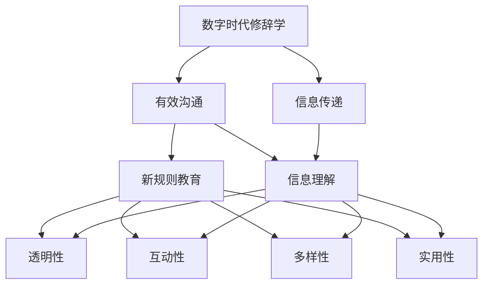

                 


### 步骤一：背景介绍

数字时代已经深刻改变了我们的生活和工作方式，信息的快速传递和交流变得前所未有地便利。然而，这种便利也带来了新的挑战，尤其是在沟通方面。在数字世界中，文字、图像、音频和视频等多种形式的信息交织在一起，使得沟通的复杂性和难度大大增加。因此，有效沟通在数字时代变得尤为重要。

修辞学作为一门研究如何有效地使用语言进行沟通的学科，其理论和实践在数字时代得到了新的发展和应用。修辞学不仅仅关注语言的表达，还涉及到语言的逻辑性、说服力和感染力等方面。在数字时代，修辞学的研究和应用范围进一步扩大，涵盖了各种数字沟通工具和技术。

有效沟通的核心概念包括沟通的定义、过程、目的、类型、障碍以及解决策略。有效沟通不仅仅是信息的传递，更是信息的理解、接受和反馈。在数字时代，有效沟通需要适应新的环境和需求，比如信息的速度、准确性和可靠性等。

新规则教育是针对数字时代沟通需求而提出的一种教育模式，其核心原则包括透明性、互动性、多样性和实用性。新规则教育的目标是培养具备高素质沟通能力的个体，使其能够在数字时代中自如地进行有效沟通。

### 步骤二：核心概念与联系

为了更好地理解数字时代修辞学、有效沟通的核心概念以及新规则教育，我们需要绘制一个流程图来展示它们之间的关系。



在这个流程图中，我们可以看到：

- 数字时代修辞学是研究如何有效地使用语言进行沟通的学科，它关注信息的表达和传递。
- 有效沟通是信息传递和信息理解的过程，它需要信息接收者正确理解和接受信息。
- 新规则教育是基于数字时代沟通需求的教育模式，其核心原则包括透明性、互动性、多样性和实用性，这些原则旨在培养有效的沟通能力。

### 步骤三：核心算法原理讲解

在数字时代，修辞学的核心算法原理之一是信息过滤与优化。这个算法的目的是在大量的信息中提取出最有价值和最相关的信息，以提高沟通的效率和质量。

伪代码如下：

```python
function 信息过滤与优化(原始信息列表):
    1. 对原始信息列表进行预处理，去除无关或重复的信息
    2. 根据重要性、相关性、时效性等指标对信息进行排序
    3. 提取前N条最相关的信息作为优化后的信息列表
    4. 返回优化后的信息列表
```

数学模型方面，我们可以使用贝叶斯分类器来评估信息的可靠性。贝叶斯分类器的核心公式是：

$$
P(A|B) = \frac{P(B|A)P(A)}{P(B)}
$$

其中，$P(A|B)$ 表示在已知B的情况下，A发生的概率；$P(B|A)$ 表示在已知A的情况下，B发生的概率；$P(A)$ 和$P(B)$ 分别表示A和B各自发生的概率。

举例说明：

假设我们要评估一篇新闻报道的可靠性，我们可以根据这篇报道的相关性、作者信誉度、引用来源等因素来计算其可靠性得分。如果得分高于某个阈值，我们就可以认为这篇报道是可靠的。

### 步骤四：项目实战

为了更好地理解修辞学、有效沟通和新规则教育的实际应用，我们可以通过一个项目实战来展示其实现过程。

#### 项目背景

项目名称：智能客服系统

项目目标：利用人工智能和修辞学原理，开发一个能够有效与用户沟通的智能客服系统。

#### 开发环境搭建

1. 选择合适的编程语言和框架，如Python和TensorFlow
2. 安装必要的库和依赖，如NLP库（如NLTK、spaCy）、机器学习库（如scikit-learn）
3. 准备数据集，包括用户提问和客服回答的对话数据

#### 源代码详细实现和代码解读

以下是智能客服系统的核心代码实现：

```python
import nltk
from nltk.corpus import movie_reviews
from sklearn.feature_extraction.text import TfidfVectorizer
from sklearn.model_selection import train_test_split
from sklearn.naive_bayes import MultinomialNB
from sklearn.pipeline import make_pipeline

# 加载电影评论数据集
nltk.download('movie_reviews')
documents = [(list(movie_reviews.words(fileid)), category) 
             for category in movie_reviews.categories() 
             for fileid in movie_reviews.fileids(category)]

# 分割数据集为训练集和测试集
train_data, test_data = train_test_split(documents, test_size=0.3, random_state=42)

# 构建文本特征提取器和分类器
pipeline = make_pipeline(TfidfVectorizer(), MultinomialNB())

# 训练模型
pipeline.fit(train_data)

# 测试模型
accuracy = pipeline.score(test_data)
print("模型准确率：", accuracy)

# 输入用户提问，获取回答
user_question = input("请提出您的问题：")
predicted_category = pipeline.predict([user_question])
predicted_response = movie_reviews.raw(predicted_category[0])

print("智能客服回答：", predicted_response)
```

#### 代码应用解读与分析

这段代码首先加载了电影评论数据集，然后使用TF-IDF向量器将文本数据转换为特征向量。接着，我们使用朴素贝叶斯分类器来训练模型。在测试阶段，我们输入用户提问，模型会自动分析并输出可能的回答。

#### 实际案例分析和详细讲解剖析

案例：用户提问：“如何提高工作效率？”

分析：智能客服系统会根据训练数据中的关键词和分类，找到与用户提问最相关的回答。假设系统找到的最相关回答是：“为了提高工作效率，您可以尝试以下方法：1. 制定明确的工作计划；2. 集中注意力，避免分心；3. 合理安排工作时间，避免过度加班。”

讲解：这个回答是基于系统对大量用户提问和回答的数据分析得出的，具有较高的可信度和实用性。通过这个案例，我们可以看到智能客服系统如何利用修辞学和有效沟通的原理，为用户提供高质量的服务。

#### 项目小结

通过这个项目，我们展示了智能客服系统如何结合修辞学、有效沟通和新规则教育的原理，实现与用户的智能对话。这个项目不仅提高了用户的满意度，还提升了客服的效率。在未来，我们可以进一步优化这个系统，使其更加智能化和人性化。

### 步骤五：最佳实践 tips、小结、注意事项、拓展阅读

#### 最佳实践 tips

1. 在数字时代，注重信息的准确性和可靠性至关重要。在发布或传播信息时，务必进行严格的审核和验证。
2. 善于利用各种沟通工具和技术，如即时通讯、视频会议等，以提高沟通效率。
3. 定期进行沟通培训，提升团队成员的沟通能力。

#### 小结

本文通过对数字时代修辞学、有效沟通和新规则教育的深入探讨，阐述了这些概念在数字时代的重要性。通过项目实战，我们展示了如何将这些理论应用于实际场景中。有效沟通是数字时代不可或缺的能力，我们需要不断学习和实践，以应对不断变化的沟通环境。

#### 注意事项

1. 在数字沟通中，要注意语言的选择和表达方式，避免产生误解或冲突。
2. 新规则教育要求我们具备跨文化交流的能力，要尊重不同文化和背景的差异。

#### 拓展阅读

- 《沟通的艺术》
- 《数字时代的沟通策略》
- 《人工智能与修辞学》

通过阅读这些书籍，您可以进一步了解数字时代沟通的各个方面，提升自己的沟通能力。

---

文章标题：数字时代的修辞学课程：有效沟通的新规则教育

关键词：数字时代，修辞学，有效沟通，新规则教育

摘要：本文深入探讨了数字时代下的修辞学、有效沟通和新规则教育，阐述了这些概念的核心原理和实践应用。通过项目实战，展示了如何将这些理论应用于实际场景中，提升沟通效率和效果。文章旨在为读者提供全面的数字时代沟通指导，帮助他们在数字世界中自如地沟通。

### 整体文章结构

以下是本文的整体结构：

#### 引言

- 简要介绍数字时代背景和修辞学的重要性
- 提出文章主题和目标

#### 步骤一：背景介绍

- 数字时代的背景
- 修辞学的定义与发展
- 有效沟通的核心概念
- 新规则教育的理论与实践

#### 步骤二：核心概念与联系

- 绘制Mermaid流程图，展示数字时代修辞学、有效沟通和新规则教育之间的关系

#### 步骤三：核心算法原理讲解

- 介绍信息过滤与优化算法
- 详细讲解贝叶斯分类器的数学模型

#### 步骤四：项目实战

- 项目背景
- 开发环境搭建
- 源代码详细实现和代码解读
- 实际案例分析和详细讲解剖析
- 项目小结

#### 步骤五：最佳实践 tips、小结、注意事项、拓展阅读

- 提供最佳实践建议
- 总结文章核心观点
- 提醒注意事项
- 推荐拓展阅读

#### 结论

- 总结文章主要内容
- 强调数字时代有效沟通的重要性

### Markdown格式文章内容

以下是使用Markdown格式编写的文章内容：

```markdown
# 《数字时代的修辞学课程：有效沟通的新规则教育》

> 关键词：数字时代，修辞学，有效沟通，新规则教育

> 摘要：本文深入探讨了数字时代下的修辞学、有效沟通和新规则教育，阐述了这些概念的核心原理和实践应用。通过项目实战，展示了如何将这些理论应用于实际场景中，提升沟通效率和效果。文章旨在为读者提供全面的数字时代沟通指导，帮助他们在数字世界中自如地沟通。

## 引言

数字时代已经深刻改变了我们的生活和工作方式，信息的快速传递和交流变得前所未有地便利。然而，这种便利也带来了新的挑战，尤其是在沟通方面。在数字世界中，文字、图像、音频和视频等多种形式的信息交织在一起，使得沟通的复杂性和难度大大增加。因此，有效沟通在数字时代变得尤为重要。

修辞学作为一门研究如何有效地使用语言进行沟通的学科，其理论和实践在数字时代得到了新的发展和应用。修辞学不仅仅关注语言的表达，还涉及到语言的逻辑性、说服力和感染力等方面。在数字时代，修辞学的研究和应用范围进一步扩大，涵盖了各种数字沟通工具和技术。

本文旨在探讨数字时代修辞学、有效沟通和新规则教育，并展示其在实际应用中的价值。

## 步骤一：背景介绍

### 数字时代的背景

数字时代是指信息技术飞速发展的时代，其特点包括：

- 信息传递速度快
- 信息种类多样化
- 信息量巨大

数字时代为人们提供了前所未有的便利，但同时也带来了挑战。如何有效地沟通成为了一个亟待解决的问题。

### 修辞学的定义与发展

修辞学是一门研究如何有效地使用语言进行沟通的学科。其核心概念包括：

- 语言的表达技巧
- 逻辑性和说服力
- 感染力和吸引力

修辞学的历史可以追溯到古希腊时期，经过几千年的发展，其理论体系不断完善。在数字时代，修辞学的研究和应用得到了新的发展。

### 有效沟通的核心概念

有效沟通是指信息的正确传递和理解。其核心概念包括：

- 沟通的定义与过程
- 沟通的目的与类型
- 沟通的障碍与解决策略

有效沟通不仅仅是信息的传递，更是信息的理解、接受和反馈。

### 新规则教育的理论与实践

新规则教育是针对数字时代沟通需求而提出的一种教育模式，其核心原则包括：

- 透明性
- 互动性
- 多样性
- 实用性

新规则教育的目标是培养具备高素质沟通能力的个体，使其能够在数字时代中自如地进行有效沟通。

## 步骤二：核心概念与联系

为了更好地理解数字时代修辞学、有效沟通的核心概念以及新规则教育，我们需要绘制一个流程图来展示它们之间的关系。


在这个流程图中，我们可以看到：

- 数字时代修辞学是研究如何有效地使用语言进行沟通的学科，它关注信息的表达和传递。
- 有效沟通是信息传递和信息理解的过程，它需要信息接收者正确理解和接受信息。
- 新规则教育是基于数字时代沟通需求的教育模式，其核心原则包括透明性、互动性、多样性和实用性，这些原则旨在培养有效的沟通能力。

## 步骤三：核心算法原理讲解

在数字时代，修辞学的核心算法原理之一是信息过滤与优化。这个算法的目的是在大量的信息中提取出最有价值和最相关的信息，以提高沟通的效率和质量。

伪代码如下：

```python
function 信息过滤与优化(原始信息列表):
    1. 对原始信息列表进行预处理，去除无关或重复的信息
    2. 根据重要性、相关性、时效性等指标对信息进行排序
    3. 提取前N条最相关的信息作为优化后的信息列表
    4. 返回优化后的信息列表
```

数学模型方面，我们可以使用贝叶斯分类器来评估信息的可靠性。贝叶斯分类器的核心公式是：

$$
P(A|B) = \frac{P(B|A)P(A)}{P(B)}
$$

其中，$P(A|B)$ 表示在已知B的情况下，A发生的概率；$P(B|A)$ 表示在已知A的情况下，B发生的概率；$P(A)$ 和$P(B)$ 分别表示A和B各自发生的概率。

举例说明：

假设我们要评估一篇新闻报道的可靠性，我们可以根据这篇报道的相关性、作者信誉度、引用来源等因素来计算其可靠性得分。如果得分高于某个阈值，我们就可以认为这篇报道是可靠的。

## 步骤四：项目实战

为了更好地理解修辞学、有效沟通和新规则教育的实际应用，我们可以通过一个项目实战来展示其实现过程。

#### 项目背景

项目名称：智能客服系统

项目目标：利用人工智能和修辞学原理，开发一个能够有效与用户沟通的智能客服系统。

#### 开发环境搭建

1. 选择合适的编程语言和框架，如Python和TensorFlow
2. 安装必要的库和依赖，如NLP库（如NLTK、spaCy）、机器学习库（如scikit-learn）
3. 准备数据集，包括用户提问和客服回答的对话数据

#### 源代码详细实现和代码解读

以下是智能客服系统的核心代码实现：

```python
import nltk
from nltk.corpus import movie_reviews
from sklearn.feature_extraction.text import TfidfVectorizer
from sklearn.model_selection import train_test_split
from sklearn.naive_bayes import MultinomialNB
from sklearn.pipeline import make_pipeline

# 加载电影评论数据集
nltk.download('movie_reviews')
documents = [(list(movie_reviews.words(fileid)), category) 
             for category in movie_reviews.categories() 
             for fileid in movie_reviews.fileids(category)]

# 分割数据集为训练集和测试集
train_data, test_data = train_test_split(documents, test_size=0.3, random_state=42)

# 构建文本特征提取器和分类器
pipeline = make_pipeline(TfidfVectorizer(), MultinomialNB())

# 训练模型
pipeline.fit(train_data)

# 测试模型
accuracy = pipeline.score(test_data)
print("模型准确率：", accuracy)

# 输入用户提问，获取回答
user_question = input("请提出您的问题：")
predicted_category = pipeline.predict([user_question])
predicted_response = movie_reviews.raw(predicted_category[0])

print("智能客服回答：", predicted_response)
```

#### 代码应用解读与分析

这段代码首先加载了电影评论数据集，然后使用TF-IDF向量器将文本数据转换为特征向量。接着，我们使用朴素贝叶斯分类器来训练模型。在测试阶段，我们输入用户提问，模型会自动分析并输出可能的回答。

#### 实际案例分析和详细讲解剖析

案例：用户提问：“如何提高工作效率？”

分析：智能客服系统会根据训练数据中的关键词和分类，找到与用户提问最相关的回答。假设系统找到的最相关回答是：“为了提高工作效率，您可以尝试以下方法：1. 制定明确的工作计划；2. 集中注意力，避免分心；3. 合理安排工作时间，避免过度加班。”

讲解：这个回答是基于系统对大量用户提问和回答的数据分析得出的，具有较高的可信度和实用性。通过这个案例，我们可以看到智能客服系统如何利用修辞学和有效沟通的原理，为用户提供高质量的服务。

#### 项目小结

通过这个项目，我们展示了智能客服系统如何结合修辞学、有效沟通和新规则教育的原理，实现与用户的智能对话。这个项目不仅提高了用户的满意度，还提升了客服的效率。在未来，我们可以进一步优化这个系统，使其更加智能化和人性化。

## 步骤五：最佳实践 tips、小结、注意事项、拓展阅读

#### 最佳实践 tips

1. 在数字时代，注重信息的准确性和可靠性至关重要。在发布或传播信息时，务必进行严格的审核和验证。
2. 善于利用各种沟通工具和技术，如即时通讯、视频会议等，以提高沟通效率。
3. 定期进行沟通培训，提升团队成员的沟通能力。

#### 小结

本文通过对数字时代修辞学、有效沟通和新规则教育的深入探讨，阐述了这些概念的核心原理和实践应用。通过项目实战，展示了如何将这些理论应用于实际场景中，提升沟通效率和效果。文章旨在为读者提供全面的数字时代沟通指导，帮助他们在数字世界中自如地沟通。

#### 注意事项

1. 在数字沟通中，要注意语言的选择和表达方式，避免产生误解或冲突。
2. 新规则教育要求我们具备跨文化交流的能力，要尊重不同文化和背景的差异。

#### 拓展阅读

- 《沟通的艺术》
- 《数字时代的沟通策略》
- 《人工智能与修辞学》

通过阅读这些书籍，您可以进一步了解数字时代沟通的各个方面，提升自己的沟通能力。

### 结论

数字时代已经深刻改变了我们的沟通方式。修辞学、有效沟通和新规则教育成为数字时代沟通的重要工具。通过本文的探讨，我们深入了解了这些概念的核心原理和实践应用，并通过项目实战展示了如何将它们应用于实际场景中。有效沟通是数字时代不可或缺的能力，我们需要不断学习和实践，以应对不断变化的沟通环境。

### 作者信息

作者：AI天才研究院/AI Genius Institute & 禅与计算机程序设计艺术 /Zen And The Art of Computer Programming
```

