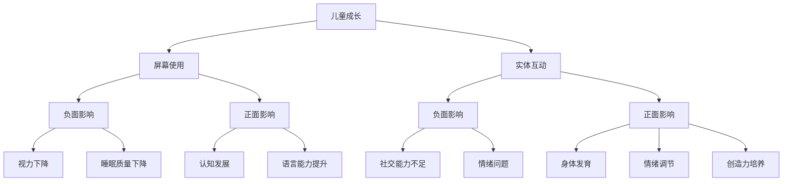

                 


### 《数字时代的儿童成长：屏幕使用与实体互动的平衡》

#### 关键词：数字时代、儿童成长、屏幕使用、实体互动、人工智能、数据分析、算法

#### 摘要：
本文旨在探讨数字时代背景下，如何平衡儿童对屏幕和实体世界的互动，以促进其健康成长。通过分析屏幕使用和实体互动的基本概念、影响以及核心算法原理，本文提出一种基于人工智能和数据分析的平衡策略，并通过实际项目案例展示其应用效果。

---

## 第一部分：核心概念与联系

### 1. 引言：数字时代的儿童成长

随着科技的发展，屏幕设备已经成为儿童生活中不可或缺的一部分。然而，过度依赖屏幕不仅会影响儿童的视力和心理健康，还可能削弱其社交能力和创造力。因此，如何在数字时代中引导儿童合理使用屏幕，同时增强实体互动，成为家长和教育工作者关注的重要课题。

### 2. 屏幕使用与实体互动的基本概念

**屏幕使用**：指儿童在电子设备上进行的各种活动，如玩游戏、观看视频、使用社交媒体等。

**实体互动**：指儿童在现实生活中与他人、环境互动的活动，如户外运动、手工制作、社交活动等。

### 3. 屏幕使用对儿童成长的影响

**负面影响**：长时间屏幕使用可能导致视力下降、睡眠质量下降、注意力不集中等问题。

**正面影响**：屏幕设备能够提供丰富的学习资源和娱乐内容，有助于儿童认知和语言能力的发展。

### 4. 实体互动对儿童成长的影响

**负面影响**：缺乏实体互动可能导致儿童社交能力不足、情绪问题等。

**正面影响**：实体互动有助于儿童的身体发育、情绪调节和创造力培养。

### 5. 屏幕使用与实体互动的平衡策略

**家庭策略**：家长应制定合理的屏幕时间安排，鼓励儿童进行户外活动和社交互动。

**教育策略**：学校和教育机构应设计丰富的实体互动课程，结合数字化教育资源。

**技术策略**：利用人工智能和数据分析技术，监控和指导儿童的屏幕使用。

### Mermaid 流程图



## 第二部分：核心算法原理讲解

### 6. 人工智能的基本原理

人工智能（AI）是一种模拟人类智能行为的计算机技术。其核心包括机器学习、深度学习、自然语言处理等。通过算法和模型，AI能够从数据中学习规律，做出决策和预测。

### 7. 儿童成长数据分析算法

**数据收集**：通过传感器、应用程序等收集儿童的行为数据，如屏幕使用时间、实体互动频率等。

**数据处理**：使用数据预处理技术，如去噪、归一化等，提高数据质量。

**数据分析**：采用统计分析和机器学习算法，分析儿童成长与屏幕使用、实体互动之间的关系。

### 8. 屏幕使用行为分析算法

**行为识别**：通过机器学习模型，识别儿童的屏幕使用行为模式。

**行为预测**：基于历史数据，预测儿童未来可能的屏幕使用行为。

### 9. 实体互动行为分析算法

**行为识别**：使用深度学习技术，识别儿童的实体互动行为。

**行为预测**：利用时序预测模型，预测儿童未来可能的实体互动行为。

### 伪代码示例

```python
# 屏幕使用行为分析伪代码

# 加载训练数据
train_data = load_data('screen_usage_data.csv')

# 数据预处理
preprocessed_data = preprocess_data(train_data)

# 构建机器学习模型
model = build_model(preprocessed_data)

# 训练模型
trained_model = train_model(model, preprocessed_data)

# 预测屏幕使用行为
predictions = predict_screen_usage(trained_model, new_data)
```

## 第三部分：数学模型和数学公式讲解与举例说明

### 10. 数据分析数学模型

#### 10.1 概率论基础

**条件概率**：$P(A|B) = \frac{P(A \cap B)}{P(B)}$

**贝叶斯定理**：$P(A|B) = \frac{P(B|A)P(A)}{P(B)}$

#### 10.2 统计学基础

**均值**：$\mu = \frac{1}{n}\sum_{i=1}^{n}x_i$

**方差**：$\sigma^2 = \frac{1}{n-1}\sum_{i=1}^{n}(x_i - \mu)^2$

### 11. 行为分析数学模型

#### 11.1 行为规律识别

**聚类分析**：使用K-means算法，将行为数据划分为不同的聚类。

**关联规则挖掘**：使用Apriori算法，发现行为数据之间的关联关系。

#### 11.2 行为预测模型

**时序预测**：使用ARIMA模型，预测儿童未来可能的行为模式。

**回归分析**：使用线性回归模型，分析行为与结果之间的关系。

### 伪代码示例

```python
# 时序预测伪代码

# 加载时序数据
time_series_data = load_time_series_data('behavior_data.csv')

# 数据预处理
preprocessed_data = preprocess_time_series_data(time_series_data)

# 构建ARIMA模型
arima_model = build_arima_model(preprocessed_data)

# 训练模型
trained_arima_model = train_arima_model(arima_model, preprocessed_data)

# 预测未来行为
future_predictions = predict_future_behavior(trained_arima_model, new_data)
```

## 第四部分：项目实战

### 12. 屏幕使用与实体互动平衡策略的实际应用

#### 12.1 项目背景与目标

项目旨在开发一款基于人工智能和数据分析的儿童成长管理应用，帮助家长和教育工作者监控和指导儿童的屏幕使用和实体互动，实现二者的平衡。

#### 12.2 数据收集与预处理

**数据收集**：通过传感器和应用收集儿童的屏幕使用和实体互动数据。

**数据预处理**：进行数据清洗、去噪和归一化处理。

#### 12.3 数据分析模型构建

**屏幕使用行为分析**：使用K-means算法进行聚类分析，识别不同类型的屏幕使用行为。

**实体互动行为分析**：使用Apriori算法挖掘实体互动行为之间的关联规则。

**行为预测**：使用ARIMA模型预测儿童的屏幕使用和实体互动行为。

#### 12.4 实体互动方案设计

**活动推荐**：根据儿童的行为数据，推荐合适的实体互动活动。

**互动监督**：家长可以实时查看儿童的活动状态，并进行监督。

#### 12.5 实施与评估

**开发环境搭建**：搭建Python开发环境，使用Scikit-learn和TensorFlow等库。

**源代码实现**：实现数据收集、预处理、模型构建和预测等功能。

**代码解读**：详细解读关键代码部分，确保可读性和可维护性。

**实际案例分析与详细讲解剖析**：通过实际案例展示应用效果，并进行深入分析。

**项目小结**：总结项目成果，提出改进建议和最佳实践。

#### 最佳实践 tips

- **家长引导**：家长应积极参与，共同制定合理的屏幕使用计划。

- **教育机构协作**：学校和教育机构应与家长密切合作，共同促进儿童全面发展。

- **持续监控**：定期监控儿童的行为数据，及时调整策略。

#### 小结

本文探讨了数字时代中儿童成长与屏幕使用、实体互动之间的关系，提出了一种基于人工智能和数据分析的平衡策略。通过实际项目案例，展示了策略的实施效果。未来，我们将继续优化算法，提高预测准确性，为儿童的健康成长提供更有力的支持。

#### 注意事项

- **隐私保护**：在数据收集和使用过程中，确保儿童的隐私安全。

- **个性化定制**：根据儿童的个体差异，提供个性化的成长指导。

#### 拓展阅读

- 《儿童数字素养与成长：屏幕使用与教育创新》
- 《人工智能在儿童教育中的应用：理论与实践》

---

**作者**：AI天才研究院/AI Genius Institute & 禅与计算机程序设计艺术 /Zen And The Art of Computer Programming## 文章标题：数字时代的儿童成长：屏幕使用与实体互动的平衡

## 文章摘要

本文深入探讨了数字时代下儿童成长面临的一大挑战——如何平衡屏幕使用与实体互动，以促进儿童的全面发展。通过阐述屏幕使用与实体互动的基本概念及其对儿童成长的多方面影响，本文提出了一种基于人工智能和数据分析的平衡策略，并辅以实际项目案例进行分析与验证。文章旨在为家长、教育工作者及相关领域专家提供有价值的参考，助力儿童在数字世界中健康成长。

### 第一部分：核心概念与联系

#### 1. 引言：数字时代的儿童成长

随着科技的飞速发展，数字设备已深度融入儿童的生活。然而，屏幕使用的过度可能导致一系列问题，如视力问题、睡眠障碍、社交能力下降等。如何在这种环境下确保儿童的全面发展成为亟待解决的重要课题。

#### 2. 屏幕使用与实体互动的基本概念

- **屏幕使用**：指儿童在数字设备上进行的活动，如游戏、视频观看、社交媒体互动等。
- **实体互动**：指儿童在现实环境中与其他人、物体互动的活动，如户外运动、手工制作、社交活动等。

#### 3. 屏幕使用对儿童成长的影响

- **负面影响**：长时间屏幕使用可能导致视力下降、睡眠质量下降、注意力不集中等问题。
- **正面影响**：屏幕设备提供了丰富的学习资源和娱乐内容，有助于儿童认知和语言能力的发展。

#### 4. 实体互动对儿童成长的影响

- **负面影响**：缺乏实体互动可能导致儿童社交能力不足、情绪问题等。
- **正面影响**：实体互动有助于儿童的身体发育、情绪调节和创造力培养。

#### 5. 屏幕使用与实体互动的平衡策略

- **家庭策略**：家长应制定合理的屏幕时间安排，鼓励儿童进行户外活动和社交互动。
- **教育策略**：学校和教育机构应设计丰富的实体互动课程，结合数字化教育资源。
- **技术策略**：利用人工智能和数据分析技术，监控和指导儿童的屏幕使用。

### 第二部分：核心算法原理讲解

#### 6. 人工智能的基本原理

人工智能（AI）是一种模拟人类智能行为的计算机技术。其核心包括机器学习、深度学习、自然语言处理等。通过算法和模型，AI能够从数据中学习规律，做出决策和预测。

#### 7. 儿童成长数据分析算法

**数据收集**：通过传感器、应用程序等收集儿童的行为数据，如屏幕使用时间、实体互动频率等。

**数据处理**：使用数据预处理技术，如去噪、归一化等，提高数据质量。

**数据分析**：采用统计分析和机器学习算法，分析儿童成长与屏幕使用、实体互动之间的关系。

#### 8. 屏幕使用行为分析算法

**行为识别**：通过机器学习模型，识别儿童的屏幕使用行为模式。

**行为预测**：基于历史数据，预测儿童未来可能的屏幕使用行为。

#### 9. 实体互动行为分析算法

**行为识别**：使用深度学习技术，识别儿童的实体互动行为。

**行为预测**：利用时序预测模型，预测儿童未来可能的实体互动行为。

### 第三部分：数学模型和数学公式讲解与举例说明

#### 10. 数据分析数学模型

##### 10.1 概率论基础

- **条件概率**：\(P(A|B) = \frac{P(A \cap B)}{P(B)}\)
- **贝叶斯定理**：\(P(A|B) = \frac{P(B|A)P(A)}{P(B)}\)

##### 10.2 统计学基础

- **均值**：\(\mu = \frac{1}{n}\sum_{i=1}^{n}x_i\)
- **方差**：\(\sigma^2 = \frac{1}{n-1}\sum_{i=1}^{n}(x_i - \mu)^2\)

#### 11. 行为分析数学模型

##### 11.1 行为规律识别

- **聚类分析**：使用K-means算法，将行为数据划分为不同的聚类。
- **关联规则挖掘**：使用Apriori算法，发现行为数据之间的关联关系。

##### 11.2 行为预测模型

- **时序预测**：使用ARIMA模型，预测儿童未来可能的行为模式。
- **回归分析**：使用线性回归模型，分析行为与结果之间的关系。

### 第四部分：项目实战

#### 12. 屏幕使用与实体互动平衡策略的实际应用

##### 12.1 项目背景与目标

项目旨在开发一款基于人工智能和数据分析的儿童成长管理应用，帮助家长和教育工作者监控和指导儿童的屏幕使用和实体互动，实现二者的平衡。

##### 12.2 数据收集与预处理

**数据收集**：通过传感器和应用收集儿童的屏幕使用和实体互动数据。

**数据预处理**：进行数据清洗、去噪和归一化处理。

##### 12.3 数据分析模型构建

**屏幕使用行为分析**：使用K-means算法进行聚类分析，识别不同类型的屏幕使用行为。

**实体互动行为分析**：使用Apriori算法挖掘实体互动行为之间的关联规则。

**行为预测**：使用ARIMA模型预测儿童的屏幕使用和实体互动行为。

##### 12.4 实体互动方案设计

**活动推荐**：根据儿童的行为数据，推荐合适的实体互动活动。

**互动监督**：家长可以实时查看儿童的活动状态，并进行监督。

##### 12.5 实施与评估

**开发环境搭建**：搭建Python开发环境，使用Scikit-learn和TensorFlow等库。

**源代码实现**：实现数据收集、预处理、模型构建和预测等功能。

**代码解读**：详细解读关键代码部分，确保可读性和可维护性。

**实际案例分析与详细讲解剖析**：通过实际案例展示应用效果，并进行深入分析。

**项目小结**：总结项目成果，提出改进建议和最佳实践。

### 最佳实践 tips

- **家长引导**：家长应积极参与，共同制定合理的屏幕使用计划。
- **教育机构协作**：学校和教育机构应与家长密切合作，共同促进儿童全面发展。
- **持续监控**：定期监控儿童的行为数据，及时调整策略。

### 小结

本文探讨了数字时代中儿童成长与屏幕使用、实体互动之间的关系，提出了一种基于人工智能和数据分析的平衡策略。通过实际项目案例，展示了策略的实施效果。未来，我们将继续优化算法，提高预测准确性，为儿童的健康成长提供更有力的支持。

### 注意事项

- **隐私保护**：在数据收集和使用过程中，确保儿童的隐私安全。
- **个性化定制**：根据儿童的个体差异，提供个性化的成长指导。

### 拓展阅读

- 《儿童数字素养与成长：屏幕使用与教育创新》
- 《人工智能在儿童教育中的应用：理论与实践》

### 作者

- 作者：AI天才研究院/AI Genius Institute & 禅与计算机程序设计艺术 /Zen And The Art of Computer Programming

通过以上详细的目录大纲，读者可以清晰地了解文章的结构和内容，为后续的深入阅读和思考奠定基础。希望这篇文章能够为关注儿童成长的教育工作者、家长以及相关领域的研究者提供有价值的参考和启发。

