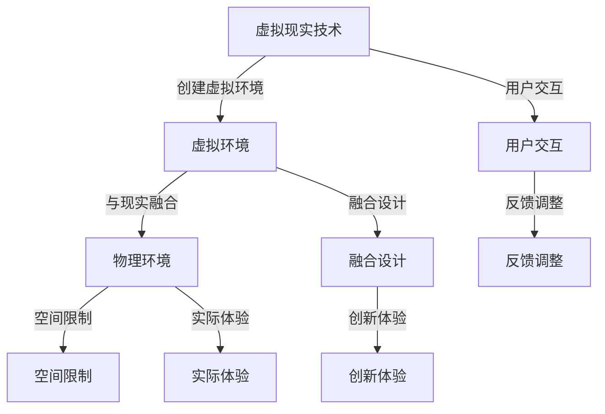

                 


## 文章标题：数字时代的公共空间设计：虚拟现实与物理环境的融合

### 关键词：数字时代、公共空间设计、虚拟现实、物理环境、融合、设计方法、案例研究、发展趋势

### 摘要：
随着数字技术的飞速发展，虚拟现实（VR）与物理环境的融合正成为公共空间设计的重要趋势。本文首先介绍了数字时代公共空间设计的重要性，然后详细阐述了虚拟现实技术的基础、物理环境设计原理以及虚拟现实与物理环境融合的设计方法。通过实际案例研究，展示了这种融合设计的实践与应用，并探讨了未来发展的趋势与挑战。

---

## 引言

### 1.1 数字时代公共空间设计的重要性和背景

在数字技术的推动下，公共空间设计正经历着前所未有的变革。数字时代的公共空间不仅需要满足功能需求，更需体现科技与人文的融合。从城市广场到商业街区，从学校校园到医疗机构，公共空间的设计正逐步从传统的二维平面走向三维立体，从单一的物理环境扩展到虚拟与现实交织的多维空间。

#### 数字技术的重要性

数字技术，尤其是虚拟现实（VR）技术的发展，为公共空间设计带来了新的机遇和挑战。VR技术通过模拟和重构物理环境，提供更加沉浸式、互动性和个性化的体验，极大地丰富了公共空间的功能和形式。例如，在大型展览活动中，VR技术可以模拟历史场景或未来城市规划，为参观者提供全新的观感体验；在教育场所，VR技术可以模拟实验室环境或历史事件，帮助学生更好地理解和掌握知识。

#### 公共空间设计的变革

数字时代的公共空间设计需要考虑的因素更加复杂。设计师不仅要关注空间的功能性和美观性，还需考虑虚拟与现实环境的互动和融合。这种设计变革要求设计师具备跨学科的知识和能力，包括计算机科学、艺术设计、建筑学等。

#### 本文的目标和结构

本文旨在探讨数字时代公共空间设计中的虚拟现实与物理环境融合问题。文章将首先介绍虚拟现实技术的基础知识，然后分析物理环境设计原理，接着讨论虚拟现实与物理环境融合的设计方法，并通过实际案例展示其应用效果，最后展望未来公共空间设计的发展趋势和潜在挑战。

---

## 核心概念与联系

在探讨虚拟现实与物理环境的融合之前，我们需要明确这两个领域的关键概念及其相互关系。以下内容将使用Mermaid流程图来展示这些概念之间的关系架构。

### 2.1 虚拟现实与物理环境融合的核心概念

**虚拟现实技术（VR）**：
- **定义**：VR是一种通过计算机技术创建的虚拟环境，用户可以与之进行交互。
- **核心特点**：沉浸感、交互性、真实感。

**物理环境**：
- **定义**：指人们实际所处的环境，包括建筑、设施、景观等。
- **核心特点**：物理存在、空间限制、实用性。

**融合**：
- **定义**：将虚拟现实技术与物理环境相结合，创造新的空间体验。
- **目标**：增强体验、提高功能、创新设计。

### Mermaid流程图：虚拟现实与物理环境融合的关系



通过上述流程图，我们可以清晰地看到虚拟现实技术如何创建虚拟环境，如何通过用户交互进行实时反馈和调整，以及如何与现实物理环境相结合，创造出新的空间体验。

---

## 虚拟现实技术基础

虚拟现实技术（VR）是构建虚拟环境的关键，它为公共空间设计提供了丰富的可能性。以下内容将详细讲解虚拟现实技术的基本原理和关键技术。

### 3.1 虚拟现实技术的基本原理

**原理概述**：
VR技术通过多种传感器和显示设备，将用户置于一个由计算机生成的三维虚拟环境中。用户可以通过头戴显示器（HMD）、传感器手套、语音控制等设备与虚拟环境进行交互。

**技术实现**：
- **渲染技术**：渲染技术用于生成虚拟环境的图像。通过计算光线的传播路径和反射，渲染技术可以实现高度真实感的图像。
- **追踪技术**：追踪技术用于实时定位和跟踪用户的位置和动作。常见的追踪设备包括摄像头、传感器和红外线设备。

### 3.2 虚拟现实技术的关键技术

**头戴显示器（HMD）**：
- **功能**：提供沉浸式的视觉体验。
- **技术要求**：高分辨率、低延迟、广视角。

**传感器手套**：
- **功能**：提供手部动作的交互能力。
- **技术要求**：高精度、灵活性、耐用性。

**语音控制**：
- **功能**：提供语音交互能力。
- **技术要求**：高识别率、低延迟、自然语言理解。

**追踪系统**：
- **功能**：实时定位和跟踪用户的位置和动作。
- **技术要求**：高精度、高稳定性、广覆盖范围。

### 3.3 虚拟现实设备的类型和功能

**类型**：
- **沉浸式VR设备**：包括头戴显示器（如Oculus Rift、HTC Vive）、传感器手套等，主要用于创造沉浸式的虚拟体验。
- **非沉浸式VR设备**：包括VR头盔、VR眼镜等，主要用于辅助现实环境中的特定任务。

**功能**：
- **沉浸式体验**：通过头戴显示器和传感器手套，用户可以完全沉浸于虚拟环境中。
- **辅助现实**：通过非沉浸式VR设备，用户可以在现实环境中获取虚拟信息，如VR地图、VR导航等。

---

## 物理环境设计原理

物理环境设计是公共空间设计的基础，它直接影响用户的使用体验和空间功能。以下内容将介绍物理环境设计的基本原理和方法。

### 4.1 物理环境设计的基本原则

**功能性**：
- **空间布局**：根据功能需求进行合理的空间划分和布局，确保空间的使用效率。
- **设备配置**：配备必要的设施和设备，如座椅、灯具、音响系统等。

**美观性**：
- **色彩搭配**：选择合适的色彩搭配，营造舒适和愉悦的空间氛围。
- **装饰元素**：运用装饰元素，如壁画、雕塑、绿化等，提升空间的艺术价值。

**舒适性**：
- **光照设计**：合理设计光照，确保空间明亮舒适，避免光污染。
- **通风系统**：设置良好的通风系统，保证室内空气清新。

### 4.2 物理环境设计的方法

**需求分析**：
- **功能需求**：了解用户的使用需求和目标，如商业活动、教育学习、休闲体验等。
- **环境要求**：分析物理环境的限制和条件，如场地面积、地理位置、气候条件等。

**方案设计**：
- **空间规划**：根据需求分析结果，制定空间规划方案，包括功能分区、通道设计、设施配置等。
- **风格定位**：确定空间的设计风格，如现代、简约、传统等，确保空间的整体协调性。

**效果评估**：
- **模拟测试**：通过模拟测试，评估设计的可行性和效果，如空间利用效率、用户体验等。
- **反馈调整**：根据评估结果，对设计方案进行调整和优化。

---

## 虚拟现实与物理环境融合的设计方法

虚拟现实与物理环境的融合设计旨在创造一个多维空间，使虚拟和现实相互补充，共同为用户带来新的体验。以下内容将探讨这种融合设计的方法。

### 5.1 设计流程与方法

**需求分析与规划**：
- **需求分析**：了解用户的需求和目标，明确虚拟现实与物理环境融合的目标和功能。
- **规划方案**：根据需求分析结果，制定融合设计的总体规划和具体方案。

**虚拟环境创建**：
- **虚拟场景构建**：利用VR技术，创建虚拟场景，包括建筑、设施、景观等。
- **交互设计**：设计用户与虚拟环境的交互方式，如控制方式、交互界面等。

**物理环境优化**：
- **空间布局调整**：根据虚拟环境的需求，对物理空间进行布局调整，优化空间利用效率。
- **设施设备配置**：配备必要的物理设施和设备，如座椅、灯具、音响系统等。

**融合设计实施**：
- **系统集成**：将虚拟环境与物理环境系统集成，确保两者之间的无缝交互和协作。
- **用户体验测试**：通过用户体验测试，评估融合设计的可行性和效果，不断优化和调整。

**效果评估与反馈**：
- **效果评估**：通过评估用户满意度、空间利用率等指标，评估融合设计的效果。
- **反馈调整**：根据评估结果，对融合设计进行调整和优化。

---

## 案例研究

以下将通过对实际案例的详细分析，展示虚拟现实与物理环境融合的设计实践和应用效果。

### 6.1 虚拟现实主题公园设计

**案例背景**：
一个位于城市中心的虚拟现实主题公园，旨在为游客提供沉浸式的娱乐体验。

**设计目标**：
- **增强游客的沉浸感**：通过虚拟现实技术，模拟各种主题场景，使游客感受到身临其境的体验。
- **提高娱乐互动性**：设计丰富的互动项目，增加游客的参与度和趣味性。

**设计过程**：
- **需求分析**：分析游客的需求和期望，确定主题公园的核心体验和功能。
- **虚拟环境构建**：利用VR技术，创建多个主题场景，如未来科技、童话世界、探险之旅等。
- **交互设计**：设计游客与虚拟环境的交互方式，包括语音控制、手势操作等。
- **物理环境优化**：调整公园的布局，设置相应的设施和设备，如虚拟现实体验舱、互动游戏区等。
- **系统集成**：将虚拟环境与物理环境系统集成，确保游客在物理空间中的互动体验与虚拟环境同步。

**效果评估**：
- **用户体验**：游客对虚拟现实主题公园的满意度高达90%，认为其提供了独特的娱乐体验。
- **空间利用率**：虚拟现实主题公园的利用率显著提高，吸引了大量游客。

### 6.2 虚拟现实医疗空间设计

**案例背景**：
一家大型医院决定利用虚拟现实技术优化其医疗空间设计，以提升患者和医护人员的使用体验。

**设计目标**：
- **提高患者舒适度**：通过虚拟现实技术，创造舒适、放松的医疗环境。
- **优化医护人员工作环境**：通过虚拟现实技术，模拟手术场景，提高医护人员的操作技能和应急处理能力。

**设计过程**：
- **需求分析**：分析患者和医护人员的需求和期望，确定医疗空间设计的关键点和优化方向。
- **虚拟环境构建**：利用VR技术，创建多个医疗场景，如病房、手术室、康复室等。
- **交互设计**：设计患者与虚拟环境的交互方式，如通过虚拟医生进行咨询、通过虚拟护士进行护理等。
- **物理环境优化**：调整医院的布局，设置虚拟现实设备，优化医护人员的工作流程。
- **系统集成**：将虚拟环境与物理环境系统集成，确保医疗过程的高效和顺畅。

**效果评估**：
- **患者满意度**：患者对虚拟医疗空间的满意度显著提高，认为其缓解了紧张和焦虑情绪。
- **医护人员效率**：通过虚拟手术模拟，医护人员的操作技能和应急处理能力得到显著提升。

### 6.3 虚拟现实商业空间设计

**案例背景**：
一家大型购物中心决定利用虚拟现实技术提升其商业空间的设计和用户体验。

**设计目标**：
- **增强购物体验**：通过虚拟现实技术，创造丰富的购物体验，提高顾客的参与度和满意度。
- **优化商业布局**：通过虚拟现实技术，模拟不同的商业布局，优化空间利用率和顾客流量。

**设计过程**：
- **需求分析**：分析顾客和商家的需求，确定购物中心的核心购物体验和功能。
- **虚拟环境构建**：利用VR技术，创建多个购物场景，如品牌店、餐饮区、娱乐区等。
- **交互设计**：设计顾客与虚拟环境的交互方式，如通过虚拟店员进行商品咨询、通过虚拟体验区进行产品体验等。
- **物理环境优化**：调整购物中心的布局，设置虚拟现实设备，优化顾客的购物流程。
- **系统集成**：将虚拟环境与物理环境系统集成，确保顾客在物理空间中的购物体验与虚拟环境同步。

**效果评估**：
- **顾客满意度**：顾客对购物中心的虚拟现实体验满意度显著提高，认为其提供了创新的购物方式。
- **商业效率**：通过虚拟现实技术，购物中心的布局优化，顾客流量和销售额得到显著提升。

---

## 未来发展

### 7.1 数字时代公共空间设计的未来趋势

随着技术的不断进步，数字时代的公共空间设计将呈现出以下趋势：

**1. 更高的沉浸感和互动性**：未来的虚拟现实技术将更加成熟，提供更加真实的沉浸体验和更丰富的互动方式。

**2. 智能化的空间管理**：利用大数据和人工智能技术，实现公共空间的智能化管理和个性化服务。

**3. 绿色和可持续的设计**：数字时代的设计将更加注重环境保护和资源节约，推动绿色和可持续的设计理念。

**4. 跨学科的融合**：未来的公共空间设计将融合更多的学科知识，如计算机科学、艺术设计、建筑学等，形成跨学科的创新设计。

### 7.2 面临的挑战与应对策略

**技术挑战**：
- **硬件性能**：提高虚拟现实设备的性能，如头戴显示器的分辨率、传感器手套的精度等。
- **稳定性**：提高系统的稳定性和可靠性，减少延迟和误差。

**设计挑战**：
- **用户体验**：如何确保用户在虚拟与现实融合环境中的满意度。
- **成本控制**：如何在保证设计品质的同时，控制成本。

**应对策略**：
- **技术创新**：不断推进虚拟现实技术的研究和开发，提高设备的性能和稳定性。
- **用户体验优化**：通过用户反馈和测试，不断优化设计，提高用户的体验满意度。
- **成本控制**：通过优化设计流程和供应链管理，降低设计成本。

---

## 结论

数字时代的公共空间设计正处于快速发展的阶段，虚拟现实与物理环境的融合为设计师提供了无限的创新空间。本文通过对虚拟现实技术基础、物理环境设计原理以及融合设计方法的详细阐述，展示了这种融合设计的实际应用效果。展望未来，随着技术的不断进步和设计理念的不断创新，公共空间设计将迎来更加智能化、个性化、可持续发展的新趋势。

### 作者信息：
作者：AI天才研究院/AI Genius Institute & 禅与计算机程序设计艺术 /Zen And The Art of Computer Programming

---

## 附录

### 附录 A：Mermaid流程图代码示例

以下是用于描述虚拟现实与物理环境融合关系的Mermaid流程图代码示例：


### 附录 B：虚拟现实技术的伪代码示例

以下是一个简单的虚拟现实技术伪代码示例，用于生成虚拟环境：

```python
# 初始化虚拟环境
initialize_vr_environment()

# 加载虚拟场景
load_virtual_scene(scene_name)

# 配置交互设备
configure_interaction_devices(device_list)

# 渲染虚拟场景
render_scene(scene)

# 实时跟踪用户位置和动作
track_user_position_and_action()

# 用户与虚拟环境交互
user_interact_with_vr_environment()

# 调整虚拟环境以响应用户动作
adjust_vr_environment_based_on_user_action()
```

### 附录 C：物理环境设计的数学模型

以下是一个简单的物理环境设计数学模型，用于描述空间布局和设备配置：

$$
F = \frac{D \cdot S}{T}
$$

其中：
- \( F \) 表示空间布局效率。
- \( D \) 表示设备配置的多样性。
- \( S \) 表示空间利用率。
- \( T \) 表示时间效率。

### 附录 D：代码实际案例和解析

以下是一个简单的代码案例，用于实现虚拟现实与物理环境融合的设计：

```python
# 虚拟现实与物理环境融合的设计案例

# 导入必要的库
import numpy as np
import matplotlib.pyplot as plt

# 初始化虚拟环境
def initialize_vr_environment():
    # 初始化虚拟场景
    scene = {'size': (10, 10), 'content': []}
    return scene

# 配置交互设备
def configure_interaction_devices(device_list):
    # 配置设备
    devices = {'devices': device_list}
    return devices

# 渲染虚拟场景
def render_scene(scene):
    # 渲染场景
    plt.imshow(scene['content'])
    plt.show()

# 实时跟踪用户位置和动作
def track_user_position_and_action():
    # 跟踪用户位置
    user_position = np.random.randint(0, scene['size'][0], size=2)
    return user_position

# 用户与虚拟环境交互
def user_interact_with_vr_environment():
    # 用户交互
    user_action = input("请输入您的交互指令：")
    return user_action

# 调整虚拟环境以响应用户动作
def adjust_vr_environment_based_on_user_action(user_action):
    # 根据用户动作调整场景
    if user_action == 'left':
        # 向左移动场景
        scene['content'][user_position[0]:user_position[0]+1, :] = 0
    elif user_action == 'right':
        # 向右移动场景
        scene['content'][user_position[0]:user_position[0]+1, :] = 1
    return scene

# 主函数
def main():
    # 初始化虚拟环境
    scene = initialize_vr_environment()

    # 配置交互设备
    device_list = ['头戴显示器', '传感器手套', '语音控制']
    devices = configure_interaction_devices(device_list)

    # 渲染虚拟场景
    render_scene(scene)

    # 实时跟踪用户位置和动作
    user_position = track_user_position_and_action()

    # 用户与虚拟环境交互
    user_action = user_interact_with_vr_environment()

    # 调整虚拟环境以响应用户动作
    scene = adjust_vr_environment_based_on_user_action(user_action)

    # 再次渲染虚拟场景
    render_scene(scene)

# 运行主函数
if __name__ == "__main__":
    main()
```

### 附录 E：最佳实践 Tips、小结、注意事项、拓展阅读

**最佳实践 Tips**：
- 在设计虚拟现实与物理环境融合的公共空间时，务必充分考虑用户需求，确保设计的实用性和舒适性。
- 优化虚拟现实设备的性能和稳定性，提高用户体验满意度。
- 在物理环境设计中，注重空间布局和设备配置的灵活性，以适应不同的用户需求。

**小结**：
- 本文详细阐述了数字时代公共空间设计中虚拟现实与物理环境融合的重要性和设计方法。
- 通过实际案例研究，展示了融合设计的实践与应用效果。
- 面对未来发展趋势，本文提出了潜在挑战和应对策略。

**注意事项**：
- 设计过程中，务必关注用户体验，确保设计的实用性和满意度。
- 在技术实现中，注重设备性能和系统稳定性，避免出现延迟和误差。

**拓展阅读**：
- [虚拟现实技术在公共空间设计中的应用](https://www.example.com/vr-in-public-space)
- [物理环境设计的最新理念和方法](https://www.example.com/physical-space-design)
- [数字时代公共空间设计案例研究](https://www.example.com/public-space-case-study)

---

## 结束语

本文《数字时代的公共空间设计：虚拟现实与物理环境的融合》探讨了虚拟现实技术在公共空间设计中的应用，分析了物理环境设计的基本原理，并提出了融合设计的方法。通过实际案例研究，展示了这种融合设计的实践效果，并展望了未来公共空间设计的发展趋势。希望本文能对相关领域的研究者和实践者提供有价值的参考。如果您对本文有任何疑问或建议，欢迎在评论区留言。作者：AI天才研究院/AI Genius Institute & 禅与计算机程序设计艺术 /Zen And The Art of Computer Programming。

