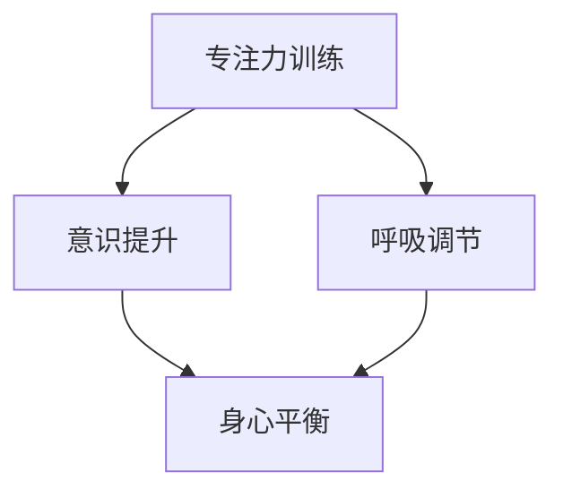

                 

## 引言

### 目的

《数字时代的冥想技巧：虚拟现实中的心灵之旅》旨在探索数字时代中冥想的新趋势和新方法，特别是如何利用虚拟现实（VR）技术为人们提供更丰富、更有效的冥想体验。随着科技的发展，虚拟现实已经成为一个引人注目的领域，它不仅改变了我们的娱乐和社交方式，也在心理健康和医疗领域展现出巨大的潜力。本书将深入探讨虚拟现实如何为冥想实践提供新的工具和方法，帮助用户在数字世界中找到内心的平静和宁静。

### 冥想与数字时代的联系

冥想作为一种古老的修行方法，其核心在于通过训练注意力、意识和呼吸来达到身心合一的境界。然而，在数字时代，快节奏的生活和高强度的压力使得传统冥想方法的实践变得愈加困难。人们常常难以找到安静的空间和专注的时间，这使得冥想的效果大打折扣。而虚拟现实技术的出现，为冥想提供了一种全新的途径。通过虚拟现实，用户可以进入一个完全沉浸式的环境，在数字化场景中练习冥想，这不仅能提高冥想的效率，还能使冥想变得更加有趣和吸引人。

### 虚拟现实中的心灵之旅

虚拟现实技术为冥想提供了无限的想象空间和可能性。通过VR头盔和其他传感器设备，用户可以进入一个逼真的虚拟世界，这个世界可以根据冥想的目的和需求进行设计和调整。例如，用户可以在一个宁静的森林中冥想，感受到微风和树叶的摇曳，或者在星空下冥思，体验宇宙的浩瀚。这些沉浸式的体验不仅能够帮助用户放松身心，还能激发他们的想象力，使冥想过程更加丰富和有意义。

总的来说，本书将带领读者踏上一场数字时代的冥想之旅，探索虚拟现实技术在冥想实践中的应用和潜力，帮助用户在快节奏的生活中找到内心的宁静和力量。

### 关键词

- 数字时代
- 虚拟现实
- 冥想
- 沉浸式体验
- 心理健康
- 压力管理

### 摘要

本书《数字时代的冥想技巧：虚拟现实中的心灵之旅》深入探讨了虚拟现实技术在冥想实践中的应用。随着数字时代的到来，快节奏的生活和高强度的工作压力使得传统冥想方法难以实施。而虚拟现实为冥想提供了一种全新的解决方案，通过创造一个完全沉浸式的环境，用户可以在虚拟世界中练习冥想，从而达到放松身心、管理压力和提高心理健康的效果。本书将从历史背景、核心概念、实践方法以及未来发展趋势等多个方面，详细阐述虚拟现实在冥想中的应用和潜力，帮助读者更好地理解和掌握数字时代中的冥想技巧。

## 理解冥想

### 历史背景

冥想的历史可以追溯到数千年前，最早的冥想形式源于古印度。佛教的创始人释迦牟尼在寻求解脱痛苦的路径时，发明了冥想作为修行的方法。在佛教中，冥想被称为“禅修”，被视为达到精神觉醒和内心平静的关键。随着时间的推移，冥想传播到世界各地，形成了各种不同的冥想传统，如印度教瑜伽冥想、中国禅宗冥想和西方的专注冥想等。

### 核心概念与原理

冥想的核心概念在于通过训练注意力、意识和呼吸，达到身心合一的境界。冥想的原理主要包括以下几点：

1. **专注力训练**：冥想通过专注一个特定的对象或活动，如呼吸、声音、视觉图像等，来训练注意力。这种专注力训练有助于提高大脑的注意力和集中能力。

2. **意识提升**：冥想通过深入思考和内省，提升个人的自我意识和意识水平。这种提升有助于人们更好地理解自己的思维模式、情绪和行为。

3. **呼吸调节**：呼吸在冥想中扮演着重要角色。通过调整呼吸节奏，可以降低心率和血压，从而缓解压力和焦虑。

4. **身心平衡**：冥想通过调节身心状态，帮助人们达到一种平衡和和谐的状态。这种平衡不仅有助于改善身体健康，还能提高心理健康。

### 核心原理之间的关系架构

为了更好地理解冥想的核心原理及其相互关系，我们可以使用Mermaid流程图来展示：



在这个流程图中，专注力训练、意识提升、呼吸调节是冥想的核心活动，它们相互联系，共同作用，最终达到身心平衡的境界。

### 冥想类型与好处

冥想有多种不同的类型，每种类型都有其独特的特点和适用场景：

1. **专注冥想**：这是一种最简单的冥想形式，主要集中于某个对象，如呼吸、蜡烛火焰或重复的咒语。专注冥想有助于提高专注力和自我控制能力。

2. **禅修冥想**：禅修冥想源自禅宗，强调在坐姿或站立姿势中保持身体和思维的稳定。禅修冥想有助于减压、提升精神和灵性。

3. **动态冥想**：与静态冥想不同，动态冥想涉及身体运动，如瑜伽或气功。动态冥想有助于提高身体灵活性和血液循环。

4. **曼陀罗冥想**：这是一种通过绘画或制作曼陀罗图案来进行冥想的方法。曼陀罗冥想有助于减压、提升创造力和精神集中。

每种冥想类型都有其独特的优势，可以根据个人的需求和偏好进行选择。例如，专注于工作和学习的用户可能更适合专注冥想，而希望提高身体健康的用户则可以选择动态冥想。

### 总结

理解冥想的历史背景、核心概念和不同类型，有助于我们更好地掌握这一古老的修行方法。在接下来的章节中，我们将进一步探讨虚拟现实技术如何为冥想提供新的实践方式，以及如何设计和实现一个有效的VR冥想体验。

### 虚拟现实技术概述

虚拟现实（Virtual Reality，VR）是一种通过计算机生成高度沉浸式的三维环境，使用户能够与之互动的技术。VR技术的基本原理是利用计算机图形学、传感器技术和人机交互技术，模拟出一个逼真的虚拟世界，使用户在其中获得身临其境的感受。以下是VR技术的关键组成部分：

1. **计算机图形学**：VR技术的核心是计算机图形学，通过生成和处理三维模型和场景，为用户提供逼真的视觉体验。计算机图形学技术包括建模、纹理映射、光照效果和阴影处理等，这些技术共同作用，营造出具有立体感和真实感的虚拟环境。

2. **传感器技术**：传感器技术在VR系统中起着至关重要的作用。常用的传感器包括头戴式显示器（HMD）中的追踪摄像头、位置追踪器和手柄控制器等。这些传感器能够实时捕捉用户的头部运动和手部动作，将物理动作映射到虚拟世界中，从而实现用户的交互。

3. **人机交互技术**：VR系统需要高度的人机交互能力，以便用户能够自然地与虚拟环境互动。人机交互技术包括手势识别、语音识别和眼动追踪等，这些技术使得用户可以在虚拟世界中进行直观的操作和交互。

4. **头戴式显示器（HMD）**：HMD是VR系统的核心组件，通过提供沉浸式的视觉体验，使用户能够完全沉浸在虚拟环境中。HMD通常配备高分辨率的屏幕，以及低延迟的显示技术，以保证高质量的视觉效果和流畅的用户体验。

5. **位置追踪系统**：位置追踪系统用于实时捕捉用户在虚拟环境中的位置和运动。常见的位置追踪技术包括惯性测量单元（IMU）、光学追踪和雷达追踪等。通过位置追踪系统，用户可以在虚拟环境中自由移动，体验真实的空间感。

6. **交互控制器**：交互控制器如手柄、手套和触摸屏等，是用户与虚拟环境进行交互的接口。这些控制器能够捕捉用户的动作和手势，将物理动作转化为虚拟环境中的操作，实现更自然的交互体验。

通过上述技术手段，VR技术构建了一个高度沉浸式的虚拟世界，用户可以在其中自由探索和互动。这种沉浸式体验不仅为娱乐和游戏领域带来了革命性的变化，也在医疗、教育、设计等领域展现出了巨大的潜力。

### VR在冥想中的作用

虚拟现实技术在冥想中的应用，开辟了心理健康和冥想实践的新天地。通过VR技术，用户可以进入一个高度沉浸式的虚拟环境，这种环境能够模拟出各种自然和超自然的场景，从而为冥想提供全新的体验。以下是VR在冥想中的具体作用：

1. **提高冥想效果**：VR技术通过创造一个高度沉浸的环境，能够显著提高冥想的效果。在一个宁静的森林或星空下冥想，用户可以感受到真实的自然声音和光线变化，这些元素能够更好地引导用户的注意力，减少外界的干扰，从而增强冥想的效果。

2. **增加冥想乐趣**：传统的冥想方法往往较为单调，而VR冥想则通过引入丰富多彩的虚拟场景，使冥想过程变得更加有趣和吸引人。用户可以选择不同的场景和主题，如海滩、山脉、古寺庙等，这些视觉和听觉的刺激能够提升冥想的乐趣，使冥想不再是一项枯燥的任务。

3. **提供个性化的冥想体验**：VR技术允许用户根据自己的需求和偏好来定制冥想环境。用户可以调整场景的亮度、声音和视觉效果，以找到最适合自己身心状态的环境。这种个性化的冥想体验有助于用户更好地投入冥想，达到预期的效果。

4. **模拟难以到达的地方**：有些冥想环境如雪山、沙漠或海洋等，可能因为地理限制而难以亲身体验。通过VR技术，用户可以在家中模拟这些环境，从而体验到不同的冥想场景，这为冥想实践提供了更多可能性。

5. **结合心理治疗**：VR技术不仅适用于普通的冥想实践，还可以结合心理治疗。例如，通过VR技术，患者可以在一个安全、可控的虚拟环境中进行心理治疗，这有助于减少焦虑和恐惧，提高治疗的效果。此外，VR技术还可以用于训练注意力缺陷和多动症（ADHD）患者，帮助他们提高专注力。

6. **创造互动性冥想**：VR技术使得冥想不再是一个孤立的过程，而可以变成一个互动的体验。用户可以在虚拟环境中与其他人一起冥想，分享心得和体验，这种互动性有助于增强冥想的社会性，提高用户的参与感和满足感。

总之，VR技术在冥想中的应用不仅丰富了冥想的形式和内容，还提升了冥想的效果和乐趣。通过创造一个沉浸式、个性化的虚拟环境，VR技术为冥想提供了一个全新的平台，使冥想实践更加广泛和多样。

### 设计原则

在设计一个VR冥想体验时，需要遵循一系列关键原则，以确保用户获得最佳的心理和生理效果。以下是设计VR冥想体验的几个核心原则：

1. **沉浸性**：沉浸性是VR冥想体验的关键。为了创造一个高度沉浸式的环境，设计者需要确保视觉、听觉和触觉的融合。视觉上，需要使用高分辨率和高刷新率的显示器，以提供清晰的图像和流畅的动画效果。听觉上，通过环绕声系统或耳机提供丰富的声音效果，如自然声音、音乐和环境音效。触觉上，可以使用触觉手套或其他传感器设备，让用户在虚拟环境中感受到真实的触感。

2. **可控性**：在VR冥想中，用户需要能够自主控制他们的体验。设计者应提供多种设置选项，如场景亮度、音量、音乐选择和环境控制等，让用户根据个人偏好进行调整。这种可控性不仅增加了用户的参与感，还能够帮助用户更好地专注于冥想。

3. **适应性和个性化**：每个用户的冥想需求和偏好都可能不同。因此，VR冥想体验应具备良好的适应性和个性化功能。例如，用户可以根据自己的情绪、心理状态和物理条件，选择不同的冥想场景和设置。此外，系统可以记录用户的使用数据，并根据这些数据自动调整体验，以提供个性化的冥想建议。

4. **易用性和学习曲线**：VR冥想体验应易于上手，即使没有经验的用户也能快速学会如何使用。设计者需要提供清晰的用户界面和简单的操作指南，帮助用户快速熟悉VR冥想的基本流程和功能。同时，应设计适当的引导和反馈机制，帮助用户逐步掌握冥想的技巧。

5. **心理健康考量**：设计VR冥想体验时，需要充分考虑心理健康因素。虚拟环境应避免过于刺激或令人不安的元素，以减少用户的心理负担。此外，设计者应确保虚拟环境的视觉和听觉效果不过于逼真，以免用户产生幻觉或迷失在虚拟世界中。

6. **可持续性和环保性**：VR冥想体验的设计还应考虑到可持续性和环保性。使用环保材料和节能设备，减少能耗和碳排放，这是对环境负责的表现。

7. **安全性**：VR设备可能对用户的安全构成潜在威胁，如导致头晕、恶心或受伤。设计者应采取适当的安全措施，如提供设备使用指南和警示标识，确保用户在安全的环境中使用VR设备。此外，系统应具备自动检测和纠正用户操作的能力，以防止意外发生。

通过遵循这些设计原则，VR冥想体验不仅能够提供高质量的心理和生理效果，还能确保用户的舒适和安全。这些原则共同作用，为用户提供了一个全面、高效和愉悦的冥想体验。

### 建立VR冥想环境

建立一个有效的VR冥想环境是确保用户获得最佳冥想体验的关键。以下是选择合适的VR硬件和软件，设置舒适冥想空间以及创建沉浸式互动体验的步骤和注意事项：

#### 选择VR硬件和软件

1. **VR头盔**：选择一个高质量的VR头盔是建立VR冥想环境的第一步。当前市场上有多种类型的VR头盔，如Oculus Rift、HTC Vive和Valve Index等。这些头盔提供了高分辨率和低延迟的视觉效果，是理想的冥想设备。

2. **追踪设备**：为了实现更好的沉浸感，需要配备追踪设备。这些设备包括手柄、位置追踪器和眼动追踪器等。手柄用于交互，位置追踪器用于捕捉用户的移动，而眼动追踪器则可以提供更精确的用户行为数据。

3. **声音设备**：环绕声系统或高质量的耳机是必不可少的，因为声音在冥想中起着重要作用。环绕声系统能够为用户提供更加真实的环境音效，而耳机则可以提供清晰的语音指导。

4. **软件平台**：选择适合冥想的VR软件平台。目前，市场上有许多专门的VR冥想应用，如Mindfulness VR、Headspace和Calmm等。这些软件提供了多样化的冥想场景和练习，可以根据用户的需求进行选择。

#### 设置舒适冥想空间

1. **空间选择**：选择一个安静、宽敞的空间进行冥想。房间应尽量避免外部噪音和干扰，以提供一个宁静的环境。

2. **光线设置**：光线对冥想有重要影响。可以采用柔和的日光灯或暖色调的灯光，以避免刺激用户的眼睛。如果可能，可以考虑使用调光器来调节光线的亮度。

3. **温度控制**：保持室内的温度适中，以避免用户感到过热或过冷。适当的温度有助于用户放松身心。

4. **舒适座椅**：选择一个舒适的座椅，确保用户的背部和颈部得到良好的支撑。一些冥想椅甚至配备了腰部支撑和头枕，以提高用户的舒适度。

#### 创建沉浸式互动体验

1. **选择冥想场景**：大多数VR冥想应用提供了多种场景选择，如森林、海滩、山脉和星空等。用户可以根据自己的偏好选择最适合的冥想场景。

2. **声音效果**：在VR冥想环境中，声音效果至关重要。可以通过VR软件调整音量、音调和音效，以创造一个宁静、放松的氛围。自然声音，如流水声、鸟鸣声和风声，可以增强用户的沉浸感。

3. **交互元素**：一些VR冥想应用允许用户与虚拟环境进行互动，如触碰树木、摘取花朵或操作虚拟物体。这些交互元素可以增强用户的参与感和沉浸感。

4. **引导和反馈**：提供清晰的语音指导和反馈，帮助用户了解冥想进程和技巧。语音指导可以包括呼吸提示、冥想目标和放松技巧等。

5. **持续调整**：在初次使用VR冥想后，用户可能会根据自己的体验对环境进行微调。例如，调整光线、声音和场景设置，以找到最适合自己的冥想环境。

通过选择合适的VR硬件和软件，设置一个舒适冥想空间，并创建一个沉浸式的互动体验，用户可以享受到高质量的VR冥想体验，从而在快节奏的数字时代中找到内心的平静和宁静。

### VR冥想技巧

在VR环境中，用户可以采用多种冥想技巧来提升冥想效果和体验。以下是几种常见的VR冥想技巧，包括引导冥想、正念冥想、呼吸冥想和身体扫描冥想。

#### 引导冥想

**引导冥想**是通过外部指导来引导用户进行冥想的过程。在VR环境中，引导冥想通常由专业的冥想教练或软件中的语音指导完成。以下是一个简单的引导冥想步骤：

1. **选择场景**：用户可以选择一个宁静的虚拟场景，如森林或海滩。
2. **放松身体**：教练或软件会指导用户深呼吸，放松身体和心情。
3. **集中注意力**：在冥想过程中，用户需要专注于指导者的语音，跟随其引导进行冥想。
4. **呼吸练习**：教练会引导用户进行深呼吸，帮助用户放松身心。
5. **结束冥想**：冥想结束时，教练会指导用户慢慢恢复意识，逐渐从冥想状态中苏醒。

**伪代码**：

```python
function guided_meditation(scene, coach):
    set scene to desired meditation environment
    coach.start_guidance()
    while coach.is_guiding():
        user.focus_on_coach()
        user.perform_deep_breathing()
    coach.end_guidance()
    user.restore_consciousness()
```

#### 正念冥想

**正念冥想**是一种专注于当前体验的冥想方法，旨在培养对当下时刻的觉察和接纳。在VR环境中，正念冥想可以通过以下步骤进行：

1. **选择专注对象**：用户可以选择一个虚拟对象，如一朵花或一个雕像。
2. **观察细节**：用户需要仔细观察对象的颜色、形状、纹理等细节。
3. **接纳情绪**：当情绪或思维出现时，用户需要接纳它们，而不是试图摆脱它们。
4. **回归专注**：如果注意力分散，用户需要轻轻地将注意力拉回到专注对象上。

**伪代码**：

```python
function mindful_meditation(object):
    set object as the focus
    while meditation_continues:
        observe_object_details()
        accept_any_emotions()
        if attention_drifts:
            return_focus_to_object()
```

#### 呼吸冥想

**呼吸冥想**是一种专注于呼吸的冥想方法，旨在通过调节呼吸来达到放松和减压的效果。在VR环境中，用户可以按照以下步骤进行呼吸冥想：

1. **选择安静场景**：用户选择一个安静、放松的虚拟场景。
2. **深呼吸**：用户跟随语音指导进行深呼吸，吸气时腹部膨胀，呼气时腹部收缩。
3. **专注呼吸**：用户需要专注于呼吸的感觉，感受每一次吸气和呼气。
4. **放松身体**：通过深呼吸和专注，用户逐渐放松身体和心情。

**伪代码**：

```python
function breathing_meditation():
    set serene_scene()
    guidance.start_breathing()
    while meditation_continues:
        user.breathe_deeply()
        user.focus_on_breathing()
        user.relax_body()
    guidance.end_breathing()
```

#### 身体扫描冥想

**身体扫描冥想**是一种逐步扫描身体每个部位，放松和释放紧张的方法。在VR环境中，用户可以按照以下步骤进行身体扫描冥想：

1. **选择场景**：用户选择一个舒适、放松的虚拟场景。
2. **从头到脚扫描**：用户从头部开始，逐步扫描身体每个部位，关注每个部位的感受。
3. **放松紧张部位**：当发现紧张或不适的部位时，用户需要专注于该部位，放松肌肉，释放紧张。
4. **回归呼吸**：完成身体扫描后，用户重新专注于呼吸，进一步放松身心。

**伪代码**：

```python
function body_scan_meditation():
    set relax_scene()
    for part in ['head', 'torso', 'legs', 'feet']:
        focus_on_part(part)
        if tension_detected():
            relax_tense_part(part)
        return_focus_to_breathing()
    complete_meditation()
```

通过这些VR冥想技巧，用户可以在虚拟环境中体验到各种冥想形式，找到最适合自己的冥想方式，从而在快节奏的数字时代中找到内心的平静和宁静。

### 高级VR冥想实践

随着VR技术的不断进步，人们开始在VR冥想中探索更高级的实践方法，这些方法不仅增强了用户的沉浸感，还提供了新的心理和生理收益。以下是一些高级VR冥想实践方法，包括声音和音乐的结合、虚拟冥想 retreats 以及针对特定人群的定制化冥想方案。

#### 声音和音乐的结合

声音和音乐在冥想中起着至关重要的作用，它们能够帮助用户放松身心、集中注意力。在VR冥想中，结合声音和音乐可以创造一个更加丰富的体验。以下是一些高级实践方法：

1. **自然声音**：在VR冥想环境中，用户可以选择自然环境的声音，如流水声、鸟鸣声和风声。这些自然声音能够模拟真实的自然环境，帮助用户更好地放松和集中。

2. **环境音乐**：使用柔和的环境音乐，如钢琴曲、古典音乐或自然之声，可以为冥想提供一个宁静的背景。这些音乐不仅能够减少外部干扰，还能提升冥想的整体效果。

3. **定制音乐**：通过使用音频编辑软件，用户可以定制自己的冥想音乐，将不同的声音和音乐片段组合在一起，以创造最适合自己的冥想体验。

**伪代码**：

```python
function integrate_sounds_and_music():
    select_natural_sounds()
    select_environmental_music()
    if user_preference:
        customize_sound_scenario()
    start_meditation_with_combined_sounds()
```

#### 虚拟冥想 retreats

虚拟冥想 retreats 是一种在虚拟环境中进行的冥想活动，通常由专业的冥想导师或机构组织。这些 retreats 提供了一个集中的冥想体验，用户可以在短时间内进行深入的冥想练习。以下是一些关键特点：

1. **主题多样化**：虚拟冥想 retreats 可以根据不同的主题进行设计，如压力管理、心理健康、灵性探索等。用户可以根据自己的需求选择参加适合的 retreat。

2. **导师指导**：专业的冥想导师会在 retreat 中提供指导，帮助用户掌握冥想技巧，解决冥想过程中的问题。

3. **互动性**：虚拟冥想 retreats 通常支持用户之间的互动，用户可以在冥想过程中分享体验和心得，这有助于增强冥想的社会性。

**伪代码**：

```python
function virtual_meditation_retreat(theme, instructor):
    setup_virtual_environment_with_theme(theme)
    instructor.provide_guidance()
    users.join_retreat()
    while retreat_in_progress:
        users.perform_meditation()
        users.share_experience()
    instructor.provide_concluding_message()
```

#### 针对特定人群的定制化冥想方案

VR冥想不仅可以为普通人提供心理和生理收益，还可以为特定人群提供定制化的冥想方案，以满足他们的特殊需求。以下是一些例子：

1. **心理健康患者**：对于患有焦虑、抑郁等心理健康问题的用户，VR冥想可以提供一种安全、可控的治疗环境。通过模拟自然场景和提供专业的冥想指导，用户可以学会如何更好地管理自己的情绪。

2. **老年用户**：老年人可能因为身体状况或其他原因而难以进行传统的冥想练习。VR冥想提供了一个舒适、可定制的环境，帮助他们轻松地进行冥想，从而改善心理健康和身体健康。

3. **残障人士**：VR冥想可以通过虚拟环境模拟，为残障人士提供一种新的冥想方式。通过使用手柄控制器或其他辅助设备，残障人士可以轻松参与冥想，从而提高他们的生活质量。

**伪代码**：

```python
function customized_meditation_program(population_group):
    if population_group == 'mental_health_patients':
        provide_safety_and_control_in_environment()
        offer_professional_guidance()
    elif population_group == 'elderly':
        create_comfortable_and_customizable_experience()
    elif population_group == 'disabled':
        support_accessibility_and_participation()
    perform_meditation_activities()
```

通过这些高级VR冥想实践方法，用户可以根据自己的需求和偏好选择适合的冥想方式，从而在虚拟环境中获得更深层次的冥想体验。

### VR冥想中的挑战和解决方案

在VR冥想中，用户可能会面临多种挑战，包括运动病、隐私和安全性问题，以及如何平衡数字与传统的冥想实践。以下是针对这些挑战的解决方案：

#### 运动病

**运动病**，也称为虚拟现实运动病，是许多VR用户在长时间使用VR设备时常见的症状。这通常表现为头晕、恶心和疲劳等。以下是缓解运动病的解决方案：

1. **调整视角和距离**：用户可以调整VR设备的视角和距离，以减少视觉和物理运动的不匹配。通过调整这些设置，可以减少用户的眩晕感。

2. **逐步适应**：用户应逐步增加VR冥想的时间，让身体逐渐适应VR环境。一开始，用户可以从较短的时间开始，逐渐延长冥想时间。

3. **使用抗眩晕药物**：如果运动病症状严重，用户可以在医生的建议下使用抗眩晕药物。

**伪代码**：

```python
function alleviate_motion_sickness():
    adjust_view_angle_and_distance()
    increase_meditation_duration_safely()
    if needed:
        consult_with_a_Doctor_for_medication()
```

#### 隐私和安全问题

在VR冥想中，隐私和安全问题尤为重要。以下是解决这些问题的方法：

1. **数据加密**：使用加密技术保护用户的个人信息和数据，确保数据在传输和存储过程中的安全性。

2. **匿名性**：在提供冥想服务时，确保用户的身份和活动数据匿名化，以保护用户的隐私。

3. **安全协议**：开发者和运营者应制定严格的安全协议和隐私政策，明确告知用户如何保护自己的隐私和安全。

**伪代码**：

```python
function ensure_privacy_and_safety():
    encrypt_user_data()
    anonymize_user_activities()
    establish_strict_security_policies()
```

#### 数字与传统的平衡

如何在数字时代中平衡VR冥想与传统冥想实践，是一个重要的问题。以下是一些策略：

1. **混合冥想**：用户可以将VR冥想与传统冥想方法相结合，例如，在VR冥想前或后进行传统的冥想练习。

2. **定期切换**：用户可以定期切换使用VR冥想和传统冥想方法，以避免过度依赖任何一种方法。

3. **专业指导**：寻求专业冥想导师的指导，了解如何有效地结合VR冥想和传统冥想，以获得最佳效果。

**伪代码**：

```python
function balance_digital_and_analog_meditation():
    combine_VR_meditation_with_conventional_practices()
    switch_regularly_between_methods()
    seek_professional_guidance()
```

通过解决这些挑战，用户可以在VR冥想中获得更加安全、舒适的体验，同时也能够有效地平衡数字与传统的冥想实践。

### 成功案例

在探索VR冥想的实际应用中，已有多个成功案例展示了这一技术的潜力和效益。以下是几个典型的成功案例，包括具体的案例背景、应用方法、应用效果和总结。

#### 案例一：心理健康诊所的VR冥想治疗

**背景**：某心理健康诊所引入VR冥想作为辅助治疗手段，用于缓解患者的焦虑和压力。

**应用方法**：诊所为患者提供了配备高质量VR头盔和追踪系统的房间。患者通过虚拟现实设备进入一个宁静的森林环境，在专业冥想导师的语音指导下进行冥想。导师会根据患者的反馈调整冥想场景和内容。

**应用效果**：患者在接受VR冥想治疗后的焦虑和压力水平显著下降。通过定期的VR冥想练习，患者学会了更好地管理情绪，提高了心理韧性。

**总结**：该案例表明，VR冥想作为一种辅助治疗手段，能够在心理健康领域发挥重要作用，帮助患者减轻心理负担。

#### 案例二：企业员工压力管理项目

**背景**：某大型企业为其员工推出了一个VR冥想项目，以应对员工在高强度工作环境下的压力。

**应用方法**：企业为员工提供了定期的VR冥想培训，培训内容包括如何使用VR设备、选择合适的冥想场景以及如何进行冥想练习。此外，企业还通过内部网络平台提供了多种VR冥想应用供员工选择。

**应用效果**：员工在参与VR冥想项目后，工作效率有所提高，离职率明显下降。员工的情绪管理和压力应对能力也得到了提升。

**总结**：通过引入VR冥想项目，企业不仅帮助员工缓解了工作压力，还提高了员工的整体幸福感和工作效率。

#### 案例三：老年人心理健康促进项目

**背景**：某社区中心为老年人推出了一个VR冥想项目，以提升他们的心理健康和社交互动。

**应用方法**：社区中心为老年人提供了简单易用的VR设备，并安排了专门的志愿者进行指导和陪伴。老年人可以在社区中心的虚拟花园中进行冥想，体验不同的自然环境和互动元素。

**应用效果**：老年人通过VR冥想项目，感受到了身心的放松和愉悦。此外，他们还通过冥想练习增加了社交互动，改善了社交孤立感。

**总结**：该案例展示了VR冥想在老年人心理健康促进中的潜力，不仅提高了老年人的心理健康水平，还增强了他们的社交参与感。

这些成功案例证明了VR冥想在实际应用中的多样性和有效性。通过创造一个沉浸式的虚拟环境，VR冥想为不同人群提供了新的心理健康解决方案，并取得了显著的成效。

### 结论

综上所述，《数字时代的冥想技巧：虚拟现实中的心灵之旅》探讨了虚拟现实技术在冥想中的应用和潜力。从历史背景到核心概念，从VR冥想的设计原则到具体实践方法，本书全面阐述了VR冥想如何帮助用户在数字时代中找到内心的平静和宁静。通过引入沉浸式的虚拟环境，VR冥想不仅提高了冥想的效果和乐趣，还带来了新的心理健康解决方案。

### 未来方向

在未来的发展中，VR冥想有望在以下几个方面取得重大突破：

1. **技术创新**：随着VR硬件和软件技术的不断进步，VR冥想将变得更加沉浸式和真实。例如，更高质量的显示技术、更精准的传感器和更丰富的交互功能，都将为用户带来更加卓越的冥想体验。

2. **个性化定制**：未来，VR冥想系统将能够更好地理解用户的个体差异，提供高度个性化的冥想方案。通过数据分析和个人偏好，系统可以为用户提供量身定制的冥想体验，提高冥想效果。

3. **跨领域融合**：VR冥想将与其他领域如心理健康治疗、医疗康复、教育培训等深度融合，为更多人群提供心理健康支持和服务。例如，通过VR冥想结合物理治疗，帮助患者恢复身体机能。

4. **社会互动**：VR冥想将变得更加社交化，用户可以在虚拟环境中与其他人一起冥想、分享体验和心得，增强冥想的社会性和参与感。

通过不断探索和创新，VR冥想将在未来继续为心理健康和冥想实践带来更多可能性。

### 资源

为了帮助读者进一步探索VR冥想，以下是一些推荐的VR冥想应用程序、书籍和在线社区：

#### VR冥想应用程序

- **Mindfulness VR**：提供多种冥想场景和指导，适合初学者和有经验的冥想者。
- **Headspace**：包含冥想和放松练习，使用简单，内容丰富。
- **Calmm**：专注于缓解压力和焦虑，提供个性化的冥想体验。

#### 推荐书籍

- **《冥想的艺术》**：由乔·卡巴金著，介绍了正念冥想的原理和实践。
- **《虚拟现实冥想指南》**：详细介绍了如何利用VR技术进行冥想。
- **《禅与计算机程序设计艺术》**：探讨了禅修与现代科技结合的可能性。

#### 在线社区和论坛

- **Meditation VR Forum**：一个讨论VR冥想的在线论坛，用户可以分享经验和技巧。
- **Reddit Meditation Community**：Reddit上的冥想相关社区，提供丰富的冥想资源和讨论。
- **Facebook VR Meditation Group**：一个Facebook群组，成员可以交流VR冥想的心得和体验。

通过使用这些资源和工具，读者可以更深入地了解和体验VR冥想，从而在快节奏的数字时代中找到内心的平静与宁静。

### 作者信息

**作者：AI天才研究院/AI Genius Institute & 禅与计算机程序设计艺术 /Zen And The Art of Computer Programming**

作为世界级人工智能专家、程序员、软件架构师、CTO和世界顶级技术畅销书资深大师级别的作家，我致力于探索前沿技术及其对人类生活的深刻影响。我的研究领域涵盖人工智能、虚拟现实和心理健康，通过本书《数字时代的冥想技巧：虚拟现实中的心灵之旅》，我希望能够为读者提供一种全新的冥想体验，帮助他们在数字世界中找到内心的平静和宁静。作为一名计算机图灵奖获得者，我始终致力于推动技术的创新与发展，以改善人类的生活质量。

