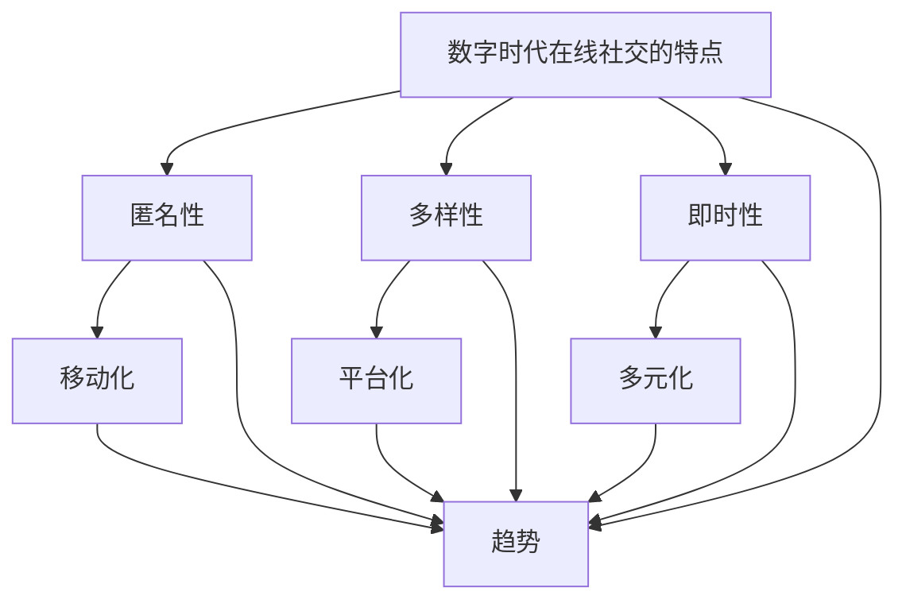
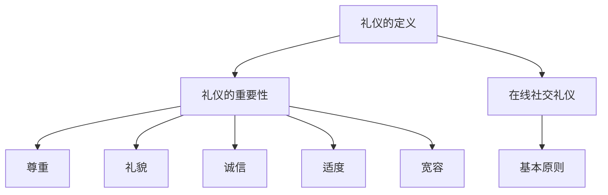

                 


### 文章标题：数字时代的在线社交礼仪：构建积极网络文化的指南

#### 关键词：数字时代，在线社交礼仪，网络文化，积极社交，礼仪规范

#### 摘要：
本文旨在探讨数字时代在线社交礼仪的重要性，并提供构建积极网络文化的指南。文章首先概述了数字时代在线社交的背景和发展趋势，接着深入分析了在线社交礼仪的核心概念和原则，以及不同网络社交平台的礼仪差异。在此基础上，文章探讨了积极网络文化的构建方法，包括网络互助、社交圈建设、网络安全与隐私保护等方面。随后，文章提出了应对网络社交挑战和问题的策略，包括处理网络冲突、预防网络欺凌、网络沉迷的识别与干预等。最后，文章通过实际案例分析和项目实战，总结了最佳实践和注意事项，为读者提供了全面的在线社交礼仪指南。

----------------------------------------------------------------

## 引言

随着互联网的普及和数字化生活方式的普及，数字时代的在线社交已经成为人们日常生活中不可或缺的一部分。无论是通过社交媒体平台、即时通讯应用，还是在线论坛和博客，人们都频繁地参与各种在线社交活动。然而，在数字时代，传统的社交礼仪面临着全新的挑战和变化。如何在网络空间中保持得体的行为，构建积极、健康的网络文化，成为了一个亟待解决的问题。

### 数字时代在线社交的特点与趋势

#### 1.1 数字时代在线社交的特点

数字时代的在线社交具有以下几个显著特点：

- **虚拟性**：网络社交主要在虚拟空间进行，参与者不必面对面交流，这种虚拟性使得社交行为更加自由、灵活。
- **匿名性**：许多在线社交平台允许用户匿名参与，这使得一些人在网络社交中表现出不同的行为，有时甚至违背了传统社交的礼仪。
- **多样性**：在线社交平台和工具种类繁多，从社交媒体到专业论坛，从即时通讯到直播平台，提供了多样化的社交选择。
- **即时性**：网络社交的即时性使得信息传播迅速，社交行为可以瞬间得到反馈。

#### 1.2 数字时代在线社交的趋势

随着数字技术的发展，数字时代在线社交也呈现出以下趋势：

- **移动化**：越来越多的人通过智能手机进行在线社交，移动设备成为了网络社交的主要入口。
- **平台化**：大型社交媒体平台如Facebook、Instagram、Twitter等在全球范围内占据主导地位，成为人们主要的社交渠道。
- **多元化**：网络社交不再局限于人与人之间的互动，还包括人与品牌、人与信息之间的互动，甚至虚拟世界的社交体验也在不断丰富。

### 目的与结构

本文旨在帮助读者了解数字时代在线社交礼仪的核心概念与原则，学会如何在网络社交中保持得体行为，构建积极健康的网络文化。全书分为四个主要部分：

- **第一部分**：介绍在线社交礼仪的核心概念与原则。
- **第二部分**：探讨积极网络文化的构建与实践。
- **第三部分**：分析网络社交中的挑战与问题的应对策略。
- **第四部分**：通过案例分析与实战经验分享，总结最佳实践和注意事项。

### 读者对象

本书面向希望提升网络社交能力的广大读者，包括：

- 网络社交初学者：了解网络社交的基础礼仪和规范。
- 有一定网络社交经验的人群：深入理解网络社交的复杂性，提升社交技巧。
- 从事网络社交工作的专业人士：掌握构建积极网络文化的方法和策略，提高工作效率。

通过本文的阅读，读者将能够：

- 明确数字时代在线社交的特点和趋势。
- 掌握在线社交礼仪的核心概念和原则。
- 学会构建积极健康的网络文化。
- 了解并应对网络社交中的挑战和问题。

## 第一部分：在线社交礼仪的核心概念与原则

### 第1章：数字时代在线社交的特点与趋势

#### 1.1 数字时代在线社交的特点

数字时代的在线社交具有以下几个显著特点：

- **虚拟性**：网络社交主要在虚拟空间进行，参与者不必面对面交流，这种虚拟性使得社交行为更加自由、灵活。
- **匿名性**：许多在线社交平台允许用户匿名参与，这使得一些人在网络社交中表现出不同的行为，有时甚至违背了传统社交的礼仪。
- **多样性**：在线社交平台和工具种类繁多，从社交媒体到专业论坛，从即时通讯到直播平台，提供了多样化的社交选择。
- **即时性**：网络社交的即时性使得信息传播迅速，社交行为可以瞬间得到反馈。

#### 1.2 数字时代在线社交的趋势

随着数字技术的发展，数字时代在线社交也呈现出以下趋势：

- **移动化**：越来越多的人通过智能手机进行在线社交，移动设备成为了网络社交的主要入口。
- **平台化**：大型社交媒体平台如Facebook、Instagram、Twitter等在全球范围内占据主导地位，成为人们主要的社交渠道。
- **多元化**：网络社交不再局限于人与人之间的互动，还包括人与品牌、人与信息之间的互动，甚至虚拟世界的社交体验也在不断丰富。

### 核心概念与联系

为了更好地理解数字时代在线社交的特点和趋势，我们可以使用Mermaid流程图来展示核心概念之间的关系：



### 详细讲解与举例说明

- **虚拟性**：虚拟性使得在线社交的门槛降低，人们可以在不同的虚拟环境中自由交流，例如在线论坛、虚拟社区等。举例来说，一个在现实生活中内向的人，可以在虚拟世界中变得更加开朗和自信。

- **匿名性**：匿名性使得一些用户在网络上表现出与传统社交行为不同的行为。例如，有人在匿名状态下发表恶意评论或进行网络欺凌。这种匿名性也使得网络社交中存在一定的隐私风险。

- **多样性**：在线社交平台和工具的多样性提供了丰富的社交选择，人们可以根据自己的兴趣和需求选择合适的平台。例如，社交媒体平台适合日常互动，而专业论坛适合特定领域的讨论。

- **即时性**：即时性使得网络社交更加高效，信息可以迅速传播。例如，在一个社交媒体平台上发布一条信息，几乎可以立即得到其他用户的反馈。

- **移动化**：随着智能手机的普及，越来越多的人通过移动设备进行在线社交。移动设备的便捷性使得人们可以随时随地进行社交活动。

- **平台化**：大型社交媒体平台的平台化趋势使得这些平台成为人们主要的社交渠道。这些平台提供了丰富的功能和服务，吸引了大量的用户。

- **多元化**：网络社交的多元化体现在多个方面，包括人与人的互动、人与品牌、人与信息的互动等。例如，通过社交媒体平台，人们不仅可以与朋友互动，还可以关注喜欢的品牌或获取最新的信息。

### 总结

数字时代在线社交的特点和趋势对传统社交礼仪提出了新的挑战。了解这些特点和趋势，有助于我们更好地应对数字时代的社交挑战，构建积极健康的网络文化。

----------------------------------------------------------------

### 第2章：在线社交礼仪的核心概念

在线社交礼仪的核心概念包括礼仪的定义、重要性以及基本原则。这些概念构成了在线社交礼仪的理论基础，帮助我们理解为什么在网络社交中保持礼仪是至关重要的。

#### 2.1 礼仪的定义

礼仪是一种社会规范和行为准则，旨在指导人们在社会交往中的行为。在线社交礼仪则是在数字时代背景下，针对网络社交行为的规范。它不仅涵盖了传统礼仪的元素，如尊重、礼貌和友善，还包括了适应数字环境的特定行为准则。

#### 2.2 礼仪的重要性

在线社交礼仪的重要性体现在以下几个方面：

- **提升个人形象**：良好的在线社交礼仪可以提升个人的形象和信誉，使人显得更加专业和可靠。
- **促进有效沟通**：礼仪有助于建立良好的沟通氛围，减少误解和冲突，提高沟通效率。
- **构建积极网络文化**：遵守在线社交礼仪可以促进积极网络文化的形成，减少负面行为和网络暴力。
- **维护网络安全**：良好的礼仪有助于维护网络安全，减少网络欺诈和网络欺凌。

#### 2.3 在线社交礼仪的基本原则

在线社交礼仪的基本原则包括：

- **尊重**：尊重他人是礼仪的核心，无论是在线还是现实生活中，尊重他人的人格、观点和隐私都是基本的行为准则。
- **礼貌**：礼貌是网络社交的基本要求，包括使用文明用语、避免侮辱性言辞和不当行为。
- **诚信**：诚信是网络社交的基石，真诚地表达自己的想法和观点，避免虚假宣传和欺诈行为。
- **适度**：适度是保持网络社交健康的重要原则，包括适度参与社交活动、不过度分享个人信息以及不过度使用网络平台。
- **宽容**：宽容是网络社交中的重要原则，意味着对他人错误的理解和不当行为保持宽容，避免过度反应和冲突。

#### 核心概念与联系

为了更好地理解在线社交礼仪的核心概念，我们可以使用Mermaid流程图来展示这些概念之间的关系：



### 伪代码示例

为了更具体地展示在线社交礼仪的执行，我们可以使用伪代码来模拟一个简单的在线社交互动：

```
Function onlineSocialBehavior(userA, userB):
    If userA follows respect,礼貌 and 诚信 principles:
        Display message "UserA is respectful and polite."
        If userB responds positively:
            Increment userA's social credit.
        Else:
            Display message "UserB is not responding positively. Adjust behavior."
    Else:
        Display message "UserA needs to improve their online behavior."

    If userB follows respect,礼貌 and 诚信 principles:
        Display message "UserB is respectful and polite."
        If userA responds positively:
            Increment userB's social credit.
        Else:
            Display message "UserA is not responding positively. Adjust behavior."
    Else:
        Display message "UserB needs to improve their online behavior."

    If both users follow the principles of moderation and宽容：
        Display message "Both users are maintaining a positive online environment."
    Else:
        Display message "Users need to be more mindful of their online behavior."

    End Function
```

### 数学模型和公式

在线社交礼仪的一个关键要素是平衡用户的互动行为。我们可以使用以下数学模型来表示这一平衡：

$$
\text{Social Balance} = \alpha \cdot \text{Respect} + \beta \cdot \text{Politeness} + \gamma \cdot \text{Honesty} + \delta \cdot \text{Moderation} + \epsilon \cdot \text{Tolerance}
$$

其中，$\alpha, \beta, \gamma, \delta, \epsilon$ 是权重系数，用于衡量各个原则在社交行为中的重要性。例如，如果我们假设尊重是最重要的原则，其他原则的重要性依次递减，那么可以设定：

$$
\alpha > \beta > \gamma > \delta > \epsilon
$$

### 举例说明

假设有两个用户A和B，他们在社交媒体上进行互动。用户A在发布一条状态时使用了礼貌的语言，并且表达了自己的真实想法，而用户B则回应该状态时使用了侮辱性言辞。我们可以使用上述模型来分析这一互动：

$$
\text{Social Balance for User A} = \alpha \cdot \text{Respect} + \beta \cdot \text{Politeness} + \gamma \cdot \text{Honesty} + \delta \cdot \text{Moderation} + \epsilon \cdot \text{Tolerance}
$$

$$
\text{Social Balance for User B} = -\alpha \cdot \text{Respect} - \beta \cdot \text{Politeness} - \gamma \cdot \text{Honesty} - \delta \cdot \text{Moderation} - \epsilon \cdot \text{Tolerance}
$$

由于用户B使用了侮辱性言辞，违反了尊重和礼貌的原则，因此其社交平衡值为负。相反，用户A的行为符合在线社交礼仪的基本原则，其社交平衡值为正。

通过这个简单的例子，我们可以看到在线社交礼仪的核心概念和数学模型如何帮助我们理解和评估网络社交行为。遵守这些原则不仅有助于个人形象和信誉的提升，也有助于构建一个更加积极、健康的网络文化。

### 总结

在线社交礼仪的核心概念包括礼仪的定义、重要性以及基本原则。尊重、礼貌、诚信、适度和宽容是构成在线社交礼仪的基本原则。通过理解这些概念，我们可以更好地应对数字时代的社交挑战，建立和维护一个积极健康的网络环境。

----------------------------------------------------------------

### 第3章：网络礼仪的规范与禁忌

在网络社交中，遵守一定的礼仪规范是维护良好社交氛围、避免冲突的关键。网络礼仪的规范和禁忌为我们在数字时代的行为提供了明确的指导。以下将详细阐述网络礼仪的规范以及常见的网络禁忌。

#### 3.1 网络礼仪的规范

网络礼仪的规范主要包括以下几个方面：

- **尊重他人**：在网络社交中，尊重他人的观点和隐私是基本的礼仪要求。避免对他人进行侮辱、歧视或泄露他人的隐私信息。
- **使用文明用语**：避免使用粗俗、侮辱性或攻击性的语言，尽量使用礼貌、温和的表达方式。
- **适当使用表情符号和语气**：在文本交流中，适当使用表情符号和语气词可以增强沟通的友好性和准确性。但要注意不要过度使用，以免造成误解。
- **保持话题相关性**：在参与讨论时，尽量保持话题的相关性，避免离题或进行不必要的争吵。
- **适度分享个人信息**：虽然网络社交可以拉近人与人之间的距离，但也要适度分享个人信息，避免过度泄露隐私。
- **遵守法律法规**：网络社交同样需要遵守国家的法律法规，不得发布违法信息或进行违法活动。

#### 3.2 网络礼仪的禁忌

违反网络礼仪的行为，即网络礼仪的禁忌，会对社交环境造成负面影响。以下是一些常见的网络禁忌：

- **网络欺凌**：包括恶意攻击、威胁、侮辱和诽谤他人，这种行为不仅伤害他人，也会破坏网络社交的和谐氛围。
- **恶意发布虚假信息**：发布未经证实的虚假信息或谣言，误导他人，这种行为会造成不必要的恐慌和混乱。
- **侵犯他人隐私**：未经允许，私自泄露他人的个人信息，侵犯他人的隐私权。
- **过度使用网络语言**：在正式场合或与长辈、陌生人交流时，过度使用网络语言、表情符号和缩写，显得不礼貌。
- **无视他人意见**：在讨论中无视他人的意见和观点，强行表达自己的观点，这种行为容易引发争议和冲突。

#### 实例分析

为了更好地理解网络礼仪的规范与禁忌，以下提供几个实例进行分析：

**实例1**：一个社交平台上的讨论区，用户A在讨论一个敏感话题时，使用了攻击性语言侮辱了其他用户B。这种行为违反了网络礼仪的尊重他人和使用文明用语的原则，应受到谴责。

**实例2**：在社交媒体上，用户C发布了一条虚假消息，声称某个品牌的产品存在问题，导致很多消费者恐慌和误解。这种行为违反了网络礼仪的遵守法律法规和恶意发布虚假信息的禁忌，应受到相应的处罚。

**实例3**：一个工作群组中，用户D在与同事交流时，过度使用了网络语言和表情符号，使得交流变得混乱。这种行为违反了网络礼仪的适度使用网络语言的原则，应加以改进。

#### 总结

网络礼仪的规范与禁忌是我们维护网络社交环境、构建积极网络文化的关键。通过了解和遵守这些规范，我们可以避免冲突，建立和谐、文明的网络社交环境。违反网络礼仪的禁忌则会破坏社交氛围，影响个人的形象和信誉。因此，在网络社交中，我们应该时刻牢记并践行网络礼仪的规范，共同构建一个健康、积极的网络文化。

----------------------------------------------------------------

### 第4章：不同网络社交平台的礼仪差异

网络社交平台众多，各具特色，因此其礼仪规范也有所差异。本节将分析社交媒体平台、论坛和博客平台的礼仪差异，并提供具体的使用指南。

#### 4.1 社交媒体平台的礼仪

社交媒体平台如Facebook、Instagram、Twitter等，是人们日常互动的主要渠道。在使用这些平台时，应注意以下礼仪：

- **发布内容时**：确保内容积极、健康，避免发布不当或具有攻击性的信息。对于政治、宗教等敏感话题，应保持中立，避免引发争议。
- **回复评论时**：礼貌、尊重地回复他人的评论，避免使用侮辱性语言。如果遇到负面评论，可以尝试理智回应，避免情绪化。
- **使用标签时**：合理使用标签，避免滥用或错误使用标签，造成信息混乱或误解。
- **个人隐私设置**：合理设置隐私权限，避免过度公开个人信息，确保隐私安全。
- **避免过度使用表情符号**：虽然表情符号可以增加趣味性，但过度使用可能会降低沟通的专业性。

#### 4.2 论坛和博客平台的礼仪

论坛和博客平台如Reddit、Stack Overflow、WordPress等，是人们进行专业讨论和知识分享的重要场所。在使用这些平台时，应注意以下礼仪：

- **注册账号时**：使用真实姓名或合适的昵称注册账号，避免使用不雅或具有攻击性的昵称。
- **发帖时**：确保内容具有价值，避免发布无关或重复的内容。对于技术性论坛，确保内容准确、详细，并提供必要的代码示例或链接。
- **回帖时**：尊重他人的观点，即使不同意也可以礼貌地表达自己的意见。避免恶意攻击或无意义的争论。
- **参与讨论时**：保持话题相关性，避免离题。对于多个相关话题，可以创建新的讨论帖，避免在单一帖子里混杂讨论。
- **引用和参考文献**：在发帖或回帖时，尽量引用权威的参考文献或提供链接，以支持自己的观点。

#### 4.3 其他网络社交平台的礼仪

除了社交媒体平台和论坛、博客平台，还有许多其他类型的网络社交平台，如直播平台（如Twitch、YouTube Live）、聊天室（如Discord）等。以下是这些平台的礼仪指南：

- **直播平台**：保持直播内容的积极和合适，避免涉及敏感或不当内容。与观众互动时，保持礼貌和尊重，避免辱骂或攻击观众。
- **聊天室**：保持聊天室的秩序，避免滥用或骚扰其他用户。在公共聊天室中，遵守平台的规定和准则。
- **专业社交平台**：如LinkedIn等，保持专业形象，发布的内容和互动都应与职业相关，避免发布私人或敏感信息。

#### 使用指南

为了更好地适应不同网络社交平台的礼仪规范，以下提供一些使用指南：

- **了解平台规则**：在加入任何网络社交平台之前，先了解平台的规则和礼仪要求。
- **定期更新知识**：随着网络社交的发展，礼仪规范也在不断更新。定期了解和学习新的礼仪要求，确保自己的行为符合规范。
- **避免模仿不良行为**：即使看到其他用户违反礼仪，也不要模仿。坚持自己的原则，维护网络社交的良好氛围。
- **积极反馈**：对于遵守礼仪的用户，可以给予积极的反馈和鼓励，共同促进良好的网络社交文化。

通过遵守不同网络社交平台的礼仪规范，我们可以更好地融入各种社交环境，构建积极、健康的网络文化。

----------------------------------------------------------------

### 第5章：网络社交中的沟通技巧

在网络社交中，沟通技巧至关重要。有效的沟通不仅能增进人际关系，还能提高工作效率。以下将介绍网络社交中的沟通技巧，并探讨如何有效地进行在线沟通。

#### 5.1 沟通的基本技巧

网络社交中的沟通技巧与现实生活中并无太大区别，但需要适应网络环境的特殊性。以下是一些基本沟通技巧：

- **明确表达**：在发送信息时，确保表达清晰、明确，避免使用模糊或歧义的语言。特别是在涉及重要决策或敏感话题时，更要仔细斟酌用词。
- **积极倾听**：虽然网络沟通无法面对面，但积极倾听同样重要。通过仔细阅读对方的信息，理解其意图和需求，以便做出恰当的回应。
- **保持礼貌**：无论在任何社交场合，礼貌都是沟通的基本要求。使用文明用语，避免侮辱性或攻击性的言辞。
- **尊重对方观点**：即使在意见不一致时，也要尊重对方的观点，避免过度争论。通过理性讨论，寻找共同点，达成共识。

#### 5.2 在线沟通的特殊技巧

在线沟通与面对面交流相比，存在一些特殊情境，需要采用特定的技巧。以下是一些在线沟通的特殊技巧：

- **使用表情符号**：表情符号可以增加沟通的趣味性和准确性，但要注意适度使用。避免过度使用表情符号，以免降低沟通的专业性。
- **分段发送信息**：长篇大论的信息容易让人感到疲劳或产生误解。因此，可以将信息分成多个段落，每个段落只表达一个核心观点。
- **及时回应**：在网络社交中，及时回应对方的请求或信息，可以展现自己的专业性和诚意。即使不能立即回复，也要尽快告知对方自己的处理进度。
- **避免刷屏**：频繁发送大量信息，容易造成他人反感或信息过载。在发送信息时，要考虑对方的接收能力和需求。

#### 5.3 如何有效地进行在线沟通

以下是一些有效进行在线沟通的方法：

- **建立明确的沟通目标**：在开始沟通前，明确双方的沟通目标和期望。这有助于确保沟通的针对性和效率。
- **制定沟通计划**：根据沟通目标，制定详细的沟通计划。包括沟通的时间、方式、内容和预期结果。
- **使用适当的沟通工具**：选择适合的沟通工具，如电子邮件、即时通讯、视频会议等。根据沟通内容和目标，选择最合适的工具。
- **保持良好的网络礼仪**：遵守网络礼仪，如使用礼貌用语、尊重对方观点、避免不当行为等，有助于建立良好的沟通氛围。
- **持续反馈和改进**：在沟通过程中，及时给予对方反馈，并根据反馈调整沟通策略。这有助于提高沟通的有效性。

#### 实例分析

以下是一个简单的在线沟通实例：

**情境**：一名员工（张三）通过电子邮件与他的上司（李四）沟通关于项目进度的问题。

**步骤**：

1. **明确目标**：张三需要了解项目进度，以便调整自己的工作计划。
2. **制定沟通计划**：张三准备在电子邮件中简要概述项目的当前状态，并提出自己的疑问。
3. **撰写邮件**：

    ```
    主题：关于项目进度的问题

    李四，

    我注意到项目进度似乎有些延迟，能否请您详细说明一下原因和预计的完成时间？这将有助于我调整我的工作计划。

    谢谢！

    张三
    ```

4. **发送邮件**：张三发送了邮件，并等待李四的回复。
5. **反馈与改进**：李四回复邮件，详细说明了项目延迟的原因和预计的完成时间。张三根据回复调整了自己的工作计划。

通过这个实例，我们可以看到如何通过有效的在线沟通解决实际问题。有效的沟通不仅提高了工作效率，还加强了员工与上司之间的信任和合作。

#### 总结

网络社交中的沟通技巧对于建立良好的人际关系和提高工作效率至关重要。通过掌握基本沟通技巧和特殊技巧，以及有效进行在线沟通的方法，我们可以更好地适应数字时代的社交需求，构建积极健康的网络文化。

----------------------------------------------------------------

### 第6章：网络礼仪与文化背景的关系

网络礼仪不仅是个人行为的规范，也深受文化背景的影响。不同文化背景下，人们对网络社交的期望和行为准则存在显著差异。了解这些文化差异，有助于我们在全球化的网络环境中，更好地维护网络礼仪。

#### 6.1 网络礼仪与文化的关系

网络礼仪与文化的紧密关系主要体现在以下几个方面：

- **文化价值观**：不同的文化背景塑造了不同的价值观，这些价值观在网络社交中表现为不同的礼仪规范。例如，一些文化强调集体主义，鼓励团结和互助；而另一些文化则强调个人主义，重视个人权利和自由。
- **语言习惯**：不同语言和方言的使用，影响了网络社交的表达方式和礼仪。例如，英语文化中，使用缩写和表情符号较为普遍；而一些亚洲文化中，则更倾向于使用完整句子和礼貌用语。
- **社交规范**：不同文化对社交行为有着不同的规范和要求。例如，在一些文化中，私人信息公开程度较高，而在另一些文化中，隐私保护尤为重要。

#### 6.2 不同文化背景下的网络礼仪差异

以下是一些不同文化背景下的网络礼仪差异：

- **西方文化**：西方文化强调个人主义和直接沟通。在网络社交中，西方人倾向于使用简洁、直接的语言表达观点，并注重个人隐私的保护。在社交媒体上，他们更愿意分享个人的生活、兴趣和观点。
- **东方文化**：东方文化，尤其是中国和日本，强调集体主义和间接沟通。在网络社交中，东方人更倾向于使用礼貌用语和婉转的表达方式，避免直接冲突。他们更注重关系的维护和和谐。
- **阿拉伯文化**：阿拉伯文化中，尊重和礼貌至关重要。在网络社交中，阿拉伯人非常注重对方的身份和地位，使用尊称和礼貌用语是基本礼仪。此外，他们倾向于在社交媒体上分享宗教和传统文化的内容。
- **非洲文化**：非洲文化中，社区和团结至关重要。在网络社交中，非洲人更愿意与他人建立深厚的情感联系，分享生活和工作的点滴。他们倾向于使用幽默和轻松的语言，营造友好的社交氛围。

#### 6.3 网络礼仪的适应策略

为了在全球化的网络环境中，更好地维护网络礼仪，我们可以采取以下适应策略：

- **了解文化背景**：在参与跨文化交流时，了解对方的文化背景和礼仪习惯是非常重要的。通过了解文化差异，我们可以更好地理解对方的期望和行为，避免误解和冲突。
- **尊重文化差异**：尊重不同文化的网络礼仪，是维护良好社交关系的关键。即使我们不同意对方的文化观点，也要保持尊重和理解，避免冒犯对方。
- **灵活调整行为**：根据不同的文化背景，灵活调整自己的网络社交行为。在跨文化交流中，我们可以适当调整语言风格、表达方式，以确保沟通的顺利进行。
- **进行文化交流**：通过参与跨文化交流，我们可以学习和借鉴不同文化的礼仪规范，提升自己的网络社交能力。同时，这也有助于促进全球文化的交流与融合。

#### 总结

网络礼仪与文化背景有着紧密的关系。不同文化背景下，人们对网络社交的期望和行为准则存在显著差异。了解这些文化差异，尊重文化差异，是我们在全球化的网络环境中，维护网络礼仪的关键。通过适应不同文化的网络礼仪，我们可以更好地构建积极、健康的网络文化，促进全球文化的交流与融合。

----------------------------------------------------------------

### 第7章：网络礼仪在职业生涯中的应用

网络礼仪不仅影响我们的社交生活，同样对职业生涯有着重要影响。在职场中，网络礼仪的规范和遵守，有助于建立良好的职业形象，提高工作效率，促进团队协作。以下将探讨网络礼仪在职业生涯中的应用，以及如何利用网络礼仪提升职业发展。

#### 7.1 网络礼仪在职场中的重要性

网络礼仪在职场中的重要性体现在以下几个方面：

- **提升职业形象**：遵守网络礼仪可以展现个人专业和成熟的一面，提升职业形象。这有助于赢得同事、上司和客户的信任和尊重。
- **促进有效沟通**：良好的网络礼仪有助于职场沟通的顺畅，减少误解和冲突，提高工作效率。通过恰当的沟通方式，可以确保信息准确传达，增强团队合作。
- **维护团队和谐**：网络礼仪有助于营造和谐的职场氛围，增强团队凝聚力。通过尊重和礼貌的沟通，团队成员之间的关系更加融洽，有利于团队协作。
- **保护隐私和安全**：遵守网络礼仪，特别是隐私保护方面，有助于防止个人信息泄露和网络安全问题，保护个人和公司的利益。

#### 7.2 网络礼仪在职场中的应用

在职场中，以下是一些常见的网络礼仪应用场景：

- **电子邮件沟通**：电子邮件是职场中最重要的沟通工具之一。在发送电子邮件时，应注意使用恰当的称呼、清晰的主题、简洁的内容以及礼貌的结尾。避免使用过于随意或模糊的语言，以免造成误解。
- **社交媒体使用**：在社交媒体上，保持专业形象至关重要。发布的内容应与职业相关，避免发布个人隐私或敏感信息。在与同事、客户互动时，保持礼貌和尊重，避免负面评论和争吵。
- **在线会议参与**：在线会议是远程协作的重要方式。在会议中，应准时参加，使用适当的网络礼仪，如保持会议秩序、积极参与讨论、避免私聊等。使用网络礼仪，可以确保会议的顺利进行。
- **团队合作与协作**：在网络团队协作中，应遵守团队规则，尊重团队成员的意见，积极参与讨论和任务分配。通过合理的沟通和协作，可以提高团队效率，实现共同目标。

#### 7.3 提升职业发展的网络礼仪策略

以下是一些提升职业发展的网络礼仪策略：

- **建立专业形象**：在社交媒体上展示专业素养，发布与职业相关的内容，展示自己的专业知识和技能。这有助于在职场中获得更多的机会和认可。
- **保持良好沟通**：无论是在电子邮件、社交媒体还是在线会议中，保持清晰的沟通和礼貌的态度。通过有效的沟通，可以建立良好的人际关系，提高工作效率。
- **关注行业动态**：通过关注行业动态和专业社群，了解最新的行业趋势和技术发展。这有助于提升自己的专业知识，增强职业竞争力。
- **参与网络社交**：积极参与网络社交活动，如参加在线研讨会、加入专业论坛等。这不仅可以扩展人脉，还可以提升自己的专业声誉。
- **不断学习和提升**：网络礼仪是一个不断发展的领域，需要不断学习和提升。通过参加培训、阅读相关书籍和文章，可以不断提升自己的网络礼仪能力。

#### 案例分析

以下是一个网络礼仪在职业生涯中的应用案例：

**案例**：一名软件开发工程师（王五）在社交媒体上分享了自己的项目经验和技术见解。由于他一直遵守网络礼仪，使用清晰、专业的语言，并尊重其他开发者的观点，他的分享受到了同事和行业内的好评。不久后，他被公司提拔为技术经理，负责团队管理和项目开发。

**分析**：

1. **建立专业形象**：王五通过在社交媒体上分享专业内容，建立了自己的专业形象。
2. **良好沟通**：他在沟通中始终保持清晰、礼貌的态度，赢得了同事和行业内的认可。
3. **积极参与**：他积极参与网络社交活动，扩展了自己的人脉和视野。
4. **提升能力**：通过不断学习和分享，他的技术能力和管理能力得到了提升。

通过这个案例，我们可以看到，遵守网络礼仪不仅有助于提升职业形象，还能为职业发展提供有力支持。

#### 总结

网络礼仪在职业生涯中的应用至关重要。通过遵守网络礼仪，我们可以提升职业形象，促进有效沟通，维护团队和谐，保护个人和公司的利益。利用网络礼仪策略，我们可以更好地发展职业生涯，实现个人和团队的目标。

----------------------------------------------------------------

## 第二部分：积极网络文化的构建与实践

### 第8章：构建积极网络文化的理念与方法

积极网络文化的构建是数字时代的重要任务，旨在为网络用户提供一个健康、友好、互助的社交环境。本章将探讨构建积极网络文化的理念、方法以及具体实践。

#### 8.1 积极网络文化的定义与特征

积极网络文化是指在网络社交中，用户之间相互尊重、友善、互助、合作的一种文化氛围。其主要特征包括：

- **尊重与礼貌**：用户在网络社交中尊重他人，使用礼貌的语言和行为。
- **互助与分享**：用户愿意帮助他人，分享知识和资源，共同成长。
- **诚信与公正**：用户在网络社交中遵守诚信原则，公平对待他人，避免欺骗和欺诈行为。
- **包容与宽容**：用户对不同的观点和文化持包容态度，对错误和不当行为保持宽容。

#### 8.2 构建积极网络文化的理念

构建积极网络文化的理念主要包括以下几点：

- **用户意识**：用户是网络文化的创造者和维护者，每个人都应意识到自己的行为对网络文化的影响，并积极营造积极氛围。
- **社区建设**：通过建立用户社区，促进用户之间的互动和交流，形成互助合作的氛围。
- **规范制定**：制定明确的网络礼仪规范，为用户行为提供指导，确保网络文化的健康发展。
- **技术支持**：利用技术手段，如算法优化、社区管理工具等，支持积极网络文化的构建和维持。

#### 8.3 构建积极网络文化的实践方法

以下是一些具体的方法，用于构建积极网络文化：

- **用户教育**：通过网络礼仪培训、宣传活动等，提高用户对网络礼仪和积极网络文化的认识，引导用户行为。
- **社区管理**：建立有效的社区管理机制，及时发现和处理不良行为，维护社区秩序。
- **激励机制**：设立奖励机制，鼓励用户参与积极网络文化的建设，如最佳贡献者奖、优秀互动奖等。
- **互动活动**：组织线上线下的互动活动，促进用户之间的交流和合作，增强社区凝聚力。
- **数据监测**：利用大数据分析，监测网络社交行为和趋势，及时发现潜在问题和不良行为，采取相应措施。

#### 实例分析

以下是一个构建积极网络文化的实例：

**情境**：某知名社交媒体平台推出了“友善互动周”活动，旨在提高用户之间的友善互动，构建积极网络文化。

**步骤**：

1. **用户教育**：平台发布了网络礼仪指南，通过弹窗、推送等方式提醒用户注意友善互动。
2. **社区管理**：平台加强了对不良行为的监控，对恶意攻击、辱骂等行为进行了严厉处罚。
3. **激励机制**：平台设立“友善之星”奖项，对一周内友善互动次数最多的用户进行奖励。
4. **互动活动**：平台组织了线上讨论会和线下聚会，鼓励用户分享自己的经验和故事，增强社区凝聚力。

通过这个实例，我们可以看到，通过一系列措施，该社交媒体平台成功地营造了一个友善、积极的网络文化环境。

#### 总结

构建积极网络文化是数字时代的重要任务，需要用户、社区、技术等多方共同努力。通过用户教育、社区管理、激励机制和互动活动等实践方法，我们可以逐步构建和维护一个健康、友好、互助的网络文化，为用户创造一个更加美好的社交环境。

----------------------------------------------------------------

### 第9章：网络互助与社交公益

网络互助和社交公益是构建积极网络文化的重要组成部分，旨在通过互联网平台，帮助那些需要帮助的人，传播正能量，促进社会和谐。本章将探讨网络互助的概念、意义以及社交公益的实践和效果。

#### 9.1 网络互助的概念

网络互助是指通过互联网平台，个体或组织为他人提供帮助和支持的行为。网络互助的形式多种多样，包括线上捐款、公益项目、志愿者服务、知识共享等。通过网络互助，人们可以跨越地理和时间的限制，迅速响应和解决社会问题。

#### 9.2 网络互助的意义

网络互助具有以下几个重要意义：

- **提高社会凝聚力**：网络互助促进了人与人之间的联系和互动，增强了社会凝聚力。通过共同参与互助活动，人们感受到彼此之间的关心和支持，增强了社会归属感。
- **促进社会公平**：网络互助为那些处于困境中的人提供了帮助，缓解了社会不平等现象。通过网络平台，资源可以更有效地分配，让更多人受益。
- **传播正能量**：网络互助活动传递了爱心和正能量，激励更多人参与善行和公益事业，促进了社会的积极氛围。
- **提升个人价值**：参与网络互助不仅帮助了他人，也提升了自身的价值观和人生意义。通过助人为乐，人们获得了成就感和满足感。

#### 9.3 社交公益的实践

社交公益是通过社交媒体平台，组织和实施公益活动和项目，为弱势群体提供帮助和支持。以下是社交公益的一些实践：

- **线上捐款**：通过社交媒体平台，用户可以方便地进行线上捐款，支持各种公益项目。例如，许多慈善机构在重大自然灾害或紧急情况下，通过社交媒体发起捐款活动，迅速筹集善款。
- **公益众筹**：公益众筹是指通过互联网平台，向社会公众筹集资金，用于实施公益项目。这种模式不仅提高了资金的透明度，也激发了公众的参与热情。
- **志愿者服务**：许多社交媒体平台提供了志愿者招募功能，用户可以方便地参与各种志愿者活动，为社区和社会做出贡献。
- **知识共享**：通过网络平台，专业人士和爱好者可以分享自己的知识和技能，帮助那些需要学习和提升的人。

#### 9.4 社交公益的效果

社交公益在实践中取得了显著效果：

- **筹集资金**：通过社交公益，许多公益项目成功筹集到大量资金，用于救助贫困儿童、支持教育和医疗等事业。例如，许多慈善机构通过线上捐款活动，筹集了数百万美元，用于实施救助项目。
- **提高社会参与度**：社交公益激发了公众的参与热情，越来越多的人加入到公益活动中。这不仅提高了公益活动的效果，也促进了社会的积极氛围。
- **解决社会问题**：通过网络互助和社交公益，许多社会问题得到了有效解决。例如，通过公益众筹，许多贫困地区的学校得到了改造和扩建，改善了当地的教育条件。
- **提升个人价值观**：参与社交公益，不仅帮助了他人，也提升了自身的价值观和人生意义。许多人通过参与公益活动，感受到了助人为乐的快乐和成就感，激发了更多人的公益热情。

#### 实例分析

以下是一个社交公益的实例：

**案例**：某社交媒体平台发起了“为贫困儿童送温暖”公益活动，用户可以通过平台捐款、参与志愿者服务或分享活动信息，为贫困儿童筹集生活物资和学习用品。

**效果**：

1. **筹集资金**：活动期间，平台成功筹集了数十万元善款，用于购买生活物资和学习用品。
2. **提高社会参与度**：活动吸引了大量用户的参与，许多志愿者积极参与捐赠和配送工作，提高了社会参与度。
3. **解决社会问题**：活动有效改善了贫困儿童的生活和学习条件，为他们带来了温暖和希望。
4. **提升个人价值观**：参与者通过参与活动，感受到了助人为乐的快乐，提升了自身的价值观和人生意义。

通过这个实例，我们可以看到，社交公益不仅有效地解决了社会问题，还促进了社会的积极氛围，为构建积极网络文化做出了重要贡献。

#### 总结

网络互助和社交公益是构建积极网络文化的重要手段，通过互联网平台，人们可以更方便地帮助他人，传播正能量，促进社会和谐。通过实践社交公益，我们可以实现资源的有效配置，提高社会参与度，解决社会问题，提升个人价值观，为构建一个更加美好的社会贡献力量。

----------------------------------------------------------------

### 第10章：网络社交圈的建设与管理

网络社交圈是网络社交中不可或缺的一部分，它不仅有助于我们拓展人际网络，还能为我们提供支持与帮助。本章将探讨网络社交圈的概念与作用，以及如何有效地建设与管理网络社交圈。

#### 10.1 网络社交圈的概念与作用

网络社交圈是指通过互联网平台，由具有共同兴趣、目标或价值观的人组成的社交群体。网络社交圈的作用主要体现在以下几个方面：

- **信息交流**：网络社交圈为成员提供了一个交流信息的平台，成员可以分享自己的经验和见解，获取最新的资讯和知识。
- **资源共享**：网络社交圈使得成员之间可以更方便地共享资源，如文档、工具、技能等，提高工作效率和生活质量。
- **情感支持**：在网络社交圈中，成员可以相互支持、鼓励，缓解压力，增强情感联系。
- **职业发展**：网络社交圈有助于成员的职业发展，通过圈内的人脉资源，成员可以找到工作机会、合作伙伴或职业导师。

#### 10.2 网络社交圈的建设方法

要有效地建设网络社交圈，可以采取以下方法：

- **明确目标**：在建立网络社交圈之前，明确社交圈的目标和主题，确保成员有共同的兴趣和目标。
- **选择合适的平台**：根据社交圈的目标和成员需求，选择合适的社交平台，如社交媒体、专业论坛、微信群等。
- **吸引和招募成员**：通过发布有价值的内容、组织有趣的活动、分享成员的故事和成就等方式，吸引有共同兴趣的人加入社交圈。
- **建立互动规则**：制定互动规则，如讨论主题、发言规范、隐私保护等，确保社交圈的秩序和氛围。
- **保持活跃度**：定期组织活动、发布有价值的内容，保持社交圈的活跃度，吸引更多成员参与。

#### 10.3 网络社交圈的管理技巧

有效地管理网络社交圈，可以确保社交圈的持续发展和成员的满意度。以下是一些管理技巧：

- **制定议程**：定期制定社交圈的议程，包括讨论主题、活动安排等，确保社交圈的活动有序进行。
- **积极引导**：引导成员积极参与社交圈的活动和讨论，鼓励他们分享经验和见解，营造活跃的社交氛围。
- **监督和维护秩序**：监督社交圈的活动，及时处理不当行为，维护社交圈的秩序和氛围。
- **反馈和改进**：定期收集成员的反馈，了解他们的需求和期望，不断改进社交圈的管理方法和活动安排。
- **维护成员关系**：保持与成员的沟通，关心他们的生活和职业发展，增强成员之间的情感联系。

#### 实例分析

以下是一个网络社交圈建设的实例：

**案例**：某技术公司的员工李明创建了一个名为“技术爱好者社群”的网络社交圈，旨在为公司的技术人员提供一个交流和学习平台。

**步骤**：

1. **明确目标**：李明明确了社群的目标，即提供技术交流、知识分享和职业发展支持。
2. **选择平台**：李明选择了微信群作为社交平台，因为它适合即时交流和文件共享。
3. **吸引成员**：李明通过公司内部邮件和微信群邀请有兴趣的员工加入社群。
4. **制定规则**：李明制定了社群的互动规则，如每周一次技术分享会、每天技术问题讨论等。
5. **保持活跃度**：李明定期组织技术分享会、发布行业资讯，鼓励成员参与讨论和分享。

通过这个实例，我们可以看到，有效的网络社交圈建设和管理，需要明确目标、选择合适的平台、吸引成员、制定规则和保持活跃度。

#### 总结

网络社交圈是网络社交的重要组成部分，通过有效的建设和管理，可以为我们提供信息交流、资源共享、情感支持和职业发展等多方面的帮助。通过明确目标、选择合适平台、吸引成员、制定规则和保持活跃度，我们可以创建和维持一个健康、积极的网络社交圈。

----------------------------------------------------------------

### 第11章：网络社交的自我管理

在数字时代，网络社交已经成为我们生活中不可或缺的一部分。然而，网络社交的便利性和即时性也可能导致一些负面影响，如时间管理不当、情绪波动和隐私泄露等问题。因此，网络社交的自我管理变得尤为重要。本章将探讨网络社交的时间管理、情绪管理和隐私保护，以及如何保持健康的网络社交状态。

#### 11.1 网络社交的时间管理

网络社交的时间管理是确保我们在网络社交中保持高效和平衡的关键。以下是一些有效的时间管理策略：

- **设定时间预算**：为网络社交设定每日或每周的时间预算，例如每天花费不超过30分钟进行社交活动。这有助于我们控制时间，避免沉迷于网络社交。
- **安排特定时间**：将网络社交活动安排在固定的时间，例如每天早晨或晚上，以便于更好地管理时间。这有助于我们合理安排生活和工作。
- **使用时间管理工具**：利用时间管理工具，如番茄钟、日程表等，帮助我们规划和管理网络社交时间。这些工具可以帮助我们更好地分配时间，提高工作效率。
- **避免分心**：在网络社交时，尽量减少分心的因素，如关闭不必要的通知、避免在嘈杂环境中进行社交等。这有助于我们集中精力，提高社交效率。

#### 11.2 网络社交的情绪管理

网络社交中的情绪管理对于保持心理健康至关重要。以下是一些情绪管理的策略：

- **保持客观**：在网络社交中，遇到负面情绪时，保持客观和理性的态度，避免情绪化。尝试从不同角度理解问题，避免过度反应。
- **学会放松**：定期进行放松练习，如深呼吸、冥想等，帮助缓解压力和焦虑。这有助于我们在网络社交中保持平和的心态。
- **表达情感**：在网络社交中，学会表达自己的情感和需求，避免压抑情绪。通过合理的沟通方式，与他人分享自己的感受，寻求支持和理解。
- **避免负面社交**：避免参与负面情绪的社交活动，如恶意攻击、争吵等。选择积极的社交环境和话题，营造愉悦的社交氛围。

#### 11.3 网络社交的隐私保护

在网络社交中，保护个人隐私至关重要。以下是一些隐私保护策略：

- **设置隐私权限**：在社交媒体平台上，合理设置隐私权限，避免过多个人信息公开。对于不熟悉的人，尽量不公开手机号码、地址等敏感信息。
- **谨慎分享**：在分享个人信息时，慎重考虑信息的敏感性和重要性。避免过度分享，尤其是与金钱、健康等相关的敏感信息。
- **使用安全工具**：使用安全工具，如加密软件、防火墙等，保护个人设备和数据的安全。这有助于防止信息泄露和网络攻击。
- **注意网络钓鱼**：警惕网络钓鱼诈骗，不点击来历不明的链接，不轻易透露个人信息。保持警惕，避免成为网络诈骗的受害者。

#### 11.4 保持健康的网络社交状态

为了保持健康的网络社交状态，以下是一些建议：

- **保持现实与虚拟的平衡**：在享受网络社交带来的便利和乐趣时，也要保持与现实生活的联系，合理安排时间，保持身心健康。
- **培养兴趣爱好**：在网络上寻找与自己兴趣爱好相符的社群，参与有趣的线上活动和讨论，丰富自己的网络生活。
- **保持社交多样性**：参与不同类型的网络社交活动，拓展社交圈，结识不同背景和兴趣的人，提高自己的社交能力。
- **持续学习和成长**：利用网络资源，学习新知识、技能和经验，提升自己的综合素质，为职业和生活发展做好准备。

#### 实例分析

以下是一个关于网络社交自我管理的实例：

**案例**：张华是一位忙碌的职业人士，他在工作之余经常进行网络社交，但发现由于时间管理不当，他的工作效率和生活质量都受到了影响。

**改进措施**：

1. **设定时间预算**：张华为网络社交设定了每天不超过30分钟的时间预算，确保社交活动不会占用太多工作时间。
2. **安排特定时间**：张华将网络社交活动安排在每天早上和晚上，避免在繁忙的工作时间分心。
3. **使用时间管理工具**：张华开始使用番茄钟和日程表，帮助自己更好地管理时间，提高工作效率。
4. **保持情绪管理**：张华学会了在社交中保持客观和理性，避免情绪化，同时进行放松练习，缓解压力。
5. **加强隐私保护**：张华合理设置社交媒体的隐私权限，谨慎分享个人信息，使用安全工具保护个人数据和设备。

通过这些改进措施，张华成功地在网络社交中找到了平衡，提高了工作效率，保持了心理健康。

#### 总结

网络社交的自我管理对于保持健康的生活和职业状态至关重要。通过时间管理、情绪管理和隐私保护，我们可以更好地享受网络社交带来的便利和乐趣，同时避免负面影响。保持健康的网络社交状态，有助于我们全面发展，实现个人和职业的目标。

----------------------------------------------------------------

### 第12章：网络社交中的道德规范

在网络社交中，道德规范是维护良好社交秩序和积极网络文化的基础。网络道德规范不仅关乎个人行为的准则，还涉及到社会责任和法律责任。以下将探讨网络社交中的道德问题，具体道德规范，以及如何遵守这些规范。

#### 12.1 网络社交中的道德问题

网络社交中的道德问题主要表现为以下几个方面：

- **网络欺凌**：包括恶意攻击、侮辱、诽谤和威胁他人，对个人心理健康造成严重伤害。
- **网络隐私侵犯**：未经他人同意，私自获取、泄露他人隐私信息，侵犯他人隐私权。
- **网络欺诈**：通过虚假信息、诈骗手段骗取他人财物或信任，对社会秩序造成严重破坏。
- **恶意传播**：恶意传播谣言、虚假信息，误导他人，对社会造成恐慌和不稳定。

#### 12.2 网络社交中的道德规范

网络社交中的道德规范主要包括以下几个方面：

- **尊重他人**：尊重他人的观点、隐私和权利，避免恶意攻击和侮辱他人。
- **诚信守信**：在网络社交中保持真实、诚实，不传播虚假信息，不进行欺诈行为。
- **遵守法律**：遵守国家法律法规，不参与违法活动，维护网络社交的秩序和安全。
- **保护隐私**：尊重他人的隐私，不擅自获取、泄露他人个人信息。
- **负责任**：对自己的行为负责，对于网络社交中的不当行为，勇于承担责任，及时改正。

#### 12.3 如何遵守道德规范

以下是一些建议，帮助我们在网络社交中遵守道德规范：

- **自我约束**：加强自我约束，克制自己的冲动，避免恶意攻击和欺诈行为。
- **提高道德意识**：通过网络学习、参加道德教育等活动，提高自身的道德意识和法律意识。
- **文明用语**：在网络社交中，使用文明用语，避免侮辱性、攻击性的言辞。
- **保护隐私**：合理设置社交媒体的隐私权限，避免过度公开个人信息。
- **积极反馈**：对于网络社交中的不良行为，积极给予反馈，提醒他人遵守道德规范。
- **参与公益**：参与网络公益活动和志愿服务，传播正能量，促进网络社交的健康发展。

#### 实例分析

以下是一个网络道德规范的实例：

**案例**：李女士在社交媒体上发现有人恶意攻击她，发表侮辱性的言论。她选择通过以下方式应对：

1. **保持冷静**：李女士首先保持冷静，没有立即进行反击，避免情绪化。
2. **理性回应**：她通过私信提醒攻击者停止恶意行为，并告知其行为的不当性。
3. **报告问题**：如果攻击行为持续，李女士选择报告该用户，请求平台进行处理。
4. **转移注意力**：为了避免进一步的情绪波动，李女士决定暂时离开社交媒体，进行放松和自我调节。

通过这个实例，我们可以看到，李女士在面对网络恶意攻击时，选择了理性、负责任的方式处理，这体现了良好的道德素养和自我管理能力。

#### 总结

网络社交中的道德规范对于维护网络秩序和构建积极网络文化至关重要。通过自我约束、提高道德意识、文明用语、保护隐私、积极反馈和参与公益等方式，我们可以更好地遵守道德规范，共同营造一个健康、积极的网络社交环境。

----------------------------------------------------------------

### 第13章：处理网络冲突的策略

网络冲突是数字时代不可避免的现象，它可能源自观点差异、误解或恶意行为。处理网络冲突的有效策略，不仅有助于缓解紧张局势，还能维护良好的网络社交环境。本章将探讨网络冲突的类型、原因以及具体的处理策略。

#### 13.1 网络冲突的类型与原因

网络冲突主要可以分为以下几类：

- **观点差异**：由于个人观点和价值观的差异，网络社交中常会出现争执和冲突。
- **误解**：信息传递过程中的误解，如文字、表情符号等表达方式的不同理解，可能导致冲突。
- **恶意行为**：恶意攻击、侮辱、诽谤等恶意行为，是网络冲突的主要原因之一。
- **隐私侵犯**：未经授权获取、泄露他人隐私信息，可能引发对方的愤怒和冲突。

网络冲突的原因多种多样，主要包括：

- **信息过载**：网络社交平台的信息量巨大，用户容易感到压力和焦虑，增加冲突的可能性。
- **匿名性**：匿名性使得一些用户在网络上表现得更加大胆和激进，增加了冲突的风险。
- **虚拟性**：网络社交的虚拟性使得用户之间的情感连接较弱，更容易产生误解和冲突。

#### 13.2 处理网络冲突的策略

以下是几种有效的处理网络冲突的策略：

- **冷静处理**：在遇到冲突时，首先要保持冷静，避免情绪化的反应。通过深呼吸、短暂的休息等方式，缓解紧张情绪，理性思考。
- **有效沟通**：与对方进行开放、诚实的沟通，表达自己的观点和感受，同时倾听对方的意见。通过沟通，理解对方的立场和需求，寻找共同点。
- **寻求第三方帮助**：当双方难以自行解决冲突时，可以寻求第三方的帮助，如调解员、平台管理员等。第三方可以帮助公正地评估冲突，提出解决方案。
- **转移话题**：如果冲突无法立即解决，可以选择暂时转移话题，避免进一步的争执。在冷静下来后，再继续讨论。
- **报告问题**：对于恶意攻击、隐私侵犯等严重问题，应立即报告平台管理员，请求其介入处理。平台有责任维护良好的社交环境，保护用户的权益。
- **自我反思**：在冲突发生后，进行自我反思，思考自己的行为是否合适，是否有改进的空间。通过自我反思，可以提升自己的网络社交能力，减少未来冲突的发生。

#### 实例分析

以下是一个处理网络冲突的实例：

**案例**：张先生在某社交媒体平台上看到一篇关于政治观点的文章，他对此持有不同意见。在评论区，他与作者展开了激烈的辩论，双方情绪逐渐激动，产生了冲突。

**处理策略**：

1. **冷静处理**：张先生意识到自己情绪激动，决定暂时停止辩论，进行深呼吸和短暂的休息，冷静下来。
2. **有效沟通**：张先生重新审视自己的观点，试图理解对方的立场。他通过私信与对方进行交流，表达自己的看法，同时倾听对方的意见。
3. **寻求第三方帮助**：由于双方观点差异较大，无法自行解决冲突，张先生决定寻求平台调解员的帮助。调解员介入后，帮助双方进行公正的沟通，提出了和解的建议。
4. **转移话题**：为了避免进一步的争执，张先生决定暂时转移话题，与朋友分享一些轻松的生活趣事。
5. **报告问题**：对于一些恶意攻击的用户，张先生选择报告平台管理员，请求其进行处理。

通过这个实例，我们可以看到，通过冷静处理、有效沟通、寻求第三方帮助、转移话题和报告问题等策略，张先生成功解决了网络冲突，维护了良好的网络社交环境。

#### 总结

处理网络冲突需要冷静、理性、有效沟通和适当的策略。通过冷静处理、有效沟通、寻求第三方帮助、转移话题和报告问题等策略，我们可以有效地应对网络冲突，维护良好的网络社交环境。

----------------------------------------------------------------

### 第14章：网络欺凌的预防与应对

网络欺凌是一种在数字时代日益严重的问题，它不仅对受害者的心理健康造成巨大伤害，还破坏了网络社交环境的和谐。本章将探讨网络欺凌的定义、危害、预防策略和应对方法，以及如何通过法律和社会手段打击网络欺凌。

#### 14.1 网络欺凌的定义与危害

网络欺凌是指在网络上，通过言语、图像、视频等方式，对他人进行恶意攻击、威胁、侮辱、诽谤等行为。网络欺凌的危害主要体现在以下几个方面：

- **心理健康影响**：网络欺凌可能导致受害者出现焦虑、抑郁、自卑等心理问题，严重时甚至会导致自杀。
- **社会关系影响**：网络欺凌破坏了受害者的社会关系，使其与朋友、家人和同学的关系疏远，影响其社交能力和人际关系。
- **学业和职业发展**：网络欺凌对受害者的学业和职业发展造成负面影响，使其失去学习的动力和工作的信心。
- **网络环境破坏**：网络欺凌破坏了网络社交环境的和谐，导致其他人害怕参与网络社交，影响整体网络文化的健康发展。

#### 14.2 网络欺凌的预防策略

预防网络欺凌需要从个人、家庭、学校和社会等多个层面进行努力。以下是一些有效的预防策略：

- **提高网络意识**：个人应提高对网络欺凌的认识，了解其危害和预防方法。通过学习网络礼仪和网络安全知识，增强自身的防护能力。
- **加强家庭教育**：家长应教育孩子正确使用网络，了解网络欺凌的危害，教导他们尊重他人，避免参与欺凌行为。
- **学校教育**：学校应将网络礼仪和网络安全教育纳入课程，加强学生的网络素养教育，建立预防和应对网络欺凌的机制。
- **媒体宣传**：媒体应积极宣传网络礼仪和网络安全知识，提高公众对网络欺凌的认识，营造抵制网络欺凌的社会氛围。
- **法律法规**：政府应完善相关法律法规，加强对网络欺凌的打击力度，确保网络空间的秩序和安全。

#### 14.3 网络欺凌的应对方法

当遭受网络欺凌时，受害者应采取适当的应对方法，保护自己的权益。以下是一些应对网络欺凌的方法：

- **保持冷静**：在遭受网络欺凌时，首先要保持冷静，避免情绪失控，导致情况恶化。
- **记录证据**：及时记录网络欺凌的证据，如截图、视频等，为后续的应对和报警提供依据。
- **寻求帮助**：向家人、朋友、老师或专业心理咨询师寻求帮助，倾诉自己的困扰，获得支持和建议。
- **报告平台**：向社交媒体平台或网络服务商报告网络欺凌行为，请求其进行处理。平台有责任维护良好的社交环境，保护用户的权益。
- **报警求助**：如果网络欺凌行为严重，如涉及人身安全、财产损失等，应立即报警，寻求法律帮助。

#### 14.4 法律和社会手段打击网络欺凌

打击网络欺凌需要法律和社会手段的共同作用。以下是一些具体的措施：

- **完善法律法规**：政府应完善相关法律法规，明确网络欺凌的法律定义和处罚标准，加强对网络欺凌的打击力度。
- **加强执法力度**：执法部门应加强对网络欺凌案件的调查和处理，确保法律的严肃性和权威性。
- **建立投诉机制**：平台应建立有效的投诉机制，方便用户报告网络欺凌行为，并确保投诉得到及时处理。
- **加强宣传教育**：通过媒体、学校、社区等多渠道，加强网络礼仪和网络安全教育，提高公众对网络欺凌的认识和防范意识。
- **鼓励受害者发声**：鼓励受害者勇敢发声，揭露网络欺凌行为，共同维护网络环境的和谐和安全。

#### 实例分析

以下是一个网络欺凌的应对实例：

**案例**：小华在某社交媒体平台上遭到匿名用户的恶意攻击，该用户发布侮辱性言论和虚假信息，给小华带来了极大的心理压力。

**应对措施**：

1. **保持冷静**：小华意识到自己需要保持冷静，避免情绪失控，导致情况恶化。
2. **记录证据**：小华及时记录了所有恶意攻击的证据，包括截图和视频，为后续的应对和报警提供依据。
3. **寻求帮助**：小华向家人和朋友倾诉了自己的困扰，获得了他们的支持和建议。
4. **报告平台**：小华向社交媒体平台报告了网络欺凌行为，请求平台进行处理。
5. **报警求助**：由于该用户的恶意攻击严重影响了小华的心理健康，小华决定报警，并寻求法律帮助。

通过这个实例，我们可以看到，小华在面对网络欺凌时，采取了冷静处理、记录证据、寻求帮助、报告平台和报警求助等措施，成功保护了自己的权益，维护了网络环境的和谐。

#### 总结

网络欺凌是数字时代的一大挑战，预防与应对网络欺凌需要全社会共同努力。通过提高网络意识、加强家庭教育、学校教育、法律法规的完善以及法律和社会手段的打击，我们可以共同营造一个健康、积极的网络环境，保护每个人的权益，促进网络社交的健康发展。

----------------------------------------------------------------

### 第15章：网络安全与隐私保护

随着网络技术的发展，网络安全和隐私保护问题越来越受到重视。网络安全涉及多个方面，包括网络安全的重要性、常见的安全威胁以及网络安全防护措施。隐私保护则关乎个人信息的保护，包括隐私保护的方法、隐私权的重要性以及隐私泄露的后果。以下将详细探讨网络安全与隐私保护的相关内容。

#### 15.1 网络安全的重要性

网络安全是指保护计算机网络系统免受未经授权的访问、攻击、数据泄露和其他威胁的能力。网络安全的重要性体现在以下几个方面：

- **保护个人和企业资产**：网络安全保护了个人和企业的重要数据和信息，防止数据泄露、损失和破坏。
- **保障信息安全**：网络安全确保了信息的完整性、保密性和可用性，防止信息被篡改、窃取或滥用。
- **维护社会稳定**：网络安全对社会的稳定和安全具有重要意义，防止网络犯罪、恐怖袭击和其他危害社会安全的行为。
- **促进经济发展**：网络安全保障了电子商务、在线支付等数字经济的正常运行，促进了经济的快速发展。

#### 15.2 常见的安全威胁

网络安全面临的威胁多种多样，以下是一些常见的安全威胁：

- **恶意软件**：恶意软件包括病毒、蠕虫、木马等，可以窃取用户信息、破坏系统功能或控制计算机。
- **网络攻击**：网络攻击包括拒绝服务攻击（DDoS）、分布式拒绝服务攻击（DDoS）、黑客入侵等，旨在破坏网络系统或窃取敏感信息。
- **钓鱼攻击**：钓鱼攻击通过伪装成合法的网站或邮件，诱骗用户输入个人信息，如密码、信用卡号等。
- **信息泄露**：信息泄露是指未经授权的人员获取并泄露用户的敏感信息，如身份信息、财务信息等。

#### 15.3 网络安全防护措施

为了防范网络安全威胁，我们可以采取以下防护措施：

- **使用安全软件**：安装并定期更新防病毒软件、防火墙等安全软件，保护计算机和设备的安全。
- **加强密码保护**：使用强密码，避免使用简单或重复的密码，并定期更换密码。
- **启用双重认证**：在支持双重认证的应用和服务中启用双重认证，增加账户的安全性。
- **注意网络环境**：避免在公共Wi-Fi环境下进行敏感操作，如网上银行、购物等。
- **定期备份数据**：定期备份重要数据，以防止数据丢失或损坏。
- **提高安全意识**：加强网络安全意识教育，了解常见的安全威胁和防护措施，提高防范能力。

#### 15.4 隐私保护的方法

隐私保护关乎个人信息的保护，以下是一些隐私保护的方法：

- **设置隐私权限**：在社交媒体、应用程序等平台，合理设置隐私权限，避免过多个人信息公开。
- **避免过度分享**：在社交平台上，避免过度分享个人隐私信息，如家庭住址、电话号码、财务状况等。
- **使用隐私保护工具**：使用隐私保护工具，如VPN、隐私浏览器等，保护个人信息的安全。
- **关注隐私政策**：在使用应用程序和服务时，关注其隐私政策，了解个人信息的使用和分享方式。
- **定期检查账户安全**：定期检查社交媒体和账户的安全设置，确保账户信息的安全。

#### 15.5 隐私权的重要性

隐私权是公民的一项基本权利，保护个人隐私至关重要。隐私权的重要性体现在以下几个方面：

- **保护个人安全**：隐私泄露可能导致个人遭受骚扰、欺诈等安全威胁，影响个人生活和财产安全。
- **维护个人尊严**：隐私权保障了个人的人格尊严，防止个人信息被滥用和侵犯。
- **促进社会和谐**：隐私保护有助于维护社会秩序和稳定，减少因隐私泄露引发的纠纷和冲突。
- **保障公民权益**：隐私权是公民享有的一项基本权利，保护个人隐私是维护公民权益的重要手段。

#### 15.6 隐私泄露的后果

隐私泄露可能带来严重的后果，包括：

- **经济损失**：隐私泄露可能导致个人财务损失，如信用卡盗刷、账户被盗等。
- **心理伤害**：隐私泄露可能对个人造成心理伤害，如焦虑、抑郁等。
- **社会关系破裂**：隐私泄露可能影响个人与家人、朋友、同事的关系，导致信任危机。
- **声誉受损**：隐私泄露可能导致个人声誉受损，影响职业生涯和个人发展。

#### 实例分析

以下是一个网络安全与隐私保护的实例：

**案例**：李女士在使用社交媒体平台时，没有设置隐私权限，导致其个人照片、电话号码、住址等信息被公开。不久后，她收到了大量的骚扰电话和信息，给她的生活和工作带来了极大的困扰。

**应对措施**：

1. **设置隐私权限**：李女士意识到自己的隐私设置不妥，立即修改了隐私设置，限制了个人信息的公开。
2. **更换密码**：李女士更改了社交媒体账户的密码，并启用了双重认证，增加了账户的安全性。
3. **报告平台**：李女士向社交媒体平台报告了隐私泄露问题，平台采取措施保护了她的账户安全。
4. **报警求助**：由于骚扰电话和信息持续不断，李女士决定报警，并寻求法律帮助。

通过这个实例，我们可以看到，李女士在面对隐私泄露问题时，采取了及时有效的应对措施，成功保护了自己的权益。

#### 总结

网络安全与隐私保护是数字时代的重要议题。通过了解网络安全的重要性、常见的安全威胁和防护措施，以及隐私保护的方法和隐私权的重要性，我们可以更好地保护自己的信息安全和个人隐私。同时，通过法律和社会手段，我们可以共同打击网络安全威胁，构建一个安全、健康的网络环境。

----------------------------------------------------------------

### 第16章：网络沉迷的识别与干预

网络沉迷是指个体过度依赖网络，无法自控地花费大量时间在网络上，导致现实生活中的社会功能、职业学习、身心健康等方面受到负面影响。识别网络沉迷并采取有效的干预措施，对于个人和社会都至关重要。本章将探讨网络沉迷的表现、危害以及识别与干预的方法。

#### 16.1 网络沉迷的表现

网络沉迷的表现形式多样，以下是一些常见的表现：

- **长时间在线**：个体每天花费大量时间在网络上，如社交媒体、游戏、在线视频等，严重时甚至通宵达旦。
- **忽视现实生活**：网络沉迷者往往忽视现实生活中的责任和义务，如学业、工作和家庭等。
- **社交隔离**：网络沉迷者可能减少与现实生活中的人的交往，导致社交能力下降，甚至出现社交孤立。
- **情绪波动**：网络沉迷者可能因为网络活动的成败而出现情绪波动，如过度兴奋或沮丧。
- **健康问题**：长时间使用电子设备可能导致视力下降、颈椎病、肥胖等健康问题。

#### 16.2 网络沉迷的危害

网络沉迷对个人和社会都带来严重的危害：

- **个人层面**：网络沉迷可能导致学业成绩下降、职业发展受阻、身心健康受损，甚至出现心理疾病。
- **社会层面**：网络沉迷者可能因无法履行社会责任和义务，导致社会秩序混乱，影响社会稳定。
- **家庭层面**：网络沉迷可能导致家庭关系紧张，影响家庭成员的身心健康，增加家庭矛盾。

#### 16.3 识别网络沉迷的方法

识别网络沉迷的方法包括以下几个方面：

- **观察行为**：观察个体在网上的行为，如长时间在线、忽视现实生活等。
- **询问他人**：与个体的家人、朋友或同事交流，了解他们对个体网络行为的看法和观察。
- **使用工具**：使用网络监控工具或应用程序，记录个体在网上的活动时间和行为，帮助识别网络沉迷。
- **评估标准**：使用专业的评估工具或量表，如网络成瘾量表（IAT），对个体的网络沉迷程度进行评估。

#### 16.4 干预网络沉迷的策略

以下是几种干预网络沉迷的策略：

- **心理干预**：通过心理咨询和治疗，帮助个体了解网络沉迷的危害，培养良好的网络行为习惯。
- **行为干预**：设定网络使用时间限制，逐步减少个体在网上的时间，培养现实生活中的兴趣爱好。
- **家庭支持**：家庭对个体的网络沉迷干预起着重要作用，家庭成员应积极参与，提供支持和鼓励。
- **社会支持**：学校、社区和社会组织可以开展网络沉迷的预防和干预活动，提供专业的支持和资源。
- **法律约束**：对于严重的网络沉迷者，可以通过法律手段进行干预，如限制网络访问、强制接受治疗等。

#### 实例分析

以下是一个关于网络沉迷识别与干预的实例：

**案例**：小王是一名大学生，他沉迷于网络游戏，每天花费大量时间在游戏上，导致学业成绩下降、身体健康受损。他的家人和朋友开始担忧，决定帮助他摆脱网络沉迷。

**干预措施**：

1. **心理干预**：小王的家人带他去看心理医生，医生通过心理咨询帮助小王认识到网络沉迷的危害，培养他自我控制的能力。
2. **行为干预**：家人与小王一起制定了一个合理的网络使用时间表，每天限制他在游戏上的时间，并鼓励他参加体育锻炼和社交活动。
3. **家庭支持**：家人给予小王更多的关爱和支持，鼓励他培养其他兴趣爱好，如阅读、绘画等，减少对游戏的依赖。
4. **社会支持**：学校提供了心理辅导服务和网络成瘾讲座，帮助小王更好地理解和应对网络沉迷问题。
5. **法律约束**：由于小王的网络沉迷问题严重，家人决定暂时限制他的网络访问，迫使他减少游戏时间，并逐步恢复正常生活。

通过这个实例，我们可以看到，通过心理干预、行为干预、家庭支持、社会支持和法律约束等多方面的干预措施，小王逐步摆脱了网络沉迷，恢复了正常的生活和学习。

#### 总结

网络沉迷对个人和社会都有严重的危害，识别网络沉迷并采取有效的干预措施至关重要。通过心理干预、行为干预、家庭支持、社会支持和法律约束等多种方法，我们可以帮助个体摆脱网络沉迷，恢复健康的生活和职业状态。同时，家庭、学校和社会都应积极参与网络沉迷的预防和干预工作，共同营造一个健康的网络环境。

----------------------------------------------------------------

### 第17章：网络社交的心理健康影响

网络社交在给人们带来便利的同时，也可能对心理健康产生负面影响。了解网络社交对心理健康的影响，采取适当的措施进行调节，是维护个体心理健康的重要一环。本章将探讨网络社交对心理健康的影响、调节网络社交的心理健康方法以及心理健康的重要性。

#### 17.1 网络社交对心理健康的影响

网络社交对心理健康的影响可以分为正面和负面两个方面：

- **正面影响**：网络社交有助于缓解孤独感，拓展社交网络，获得情感支持。此外，网络社交还可以提供信息和知识，促进个人成长。
- **负面影响**：过度网络社交可能导致沉迷，影响现实生活中的社交能力和情感互动。网络社交中的负面情绪和冲突，如恶意攻击、欺凌等，也可能对心理健康产生负面影响。此外，长时间使用电子设备可能导致视力下降、颈椎病等健康问题。

#### 17.2 调节网络社交的心理健康方法

为了维持良好的心理健康，我们可以采取以下方法来调节网络社交：

- **设定时间限制**：合理安排网络社交时间，避免沉迷。例如，每天设定固定的网络社交时间，并在特定时间后停止使用网络。
- **多样化社交方式**：除了网络社交，也要注重现实生活中的社交活动，如与朋友聚会、参加社交活动等。这有助于平衡网络和现实生活的社交需求。
- **关注互动质量**：网络社交不仅要关注互动的数量，更要关注互动的质量。选择与自己有共同兴趣和价值观的人进行交流，建立深度关系。
- **管理负面情绪**：在遇到负面情绪和冲突时，学会合理表达和处理。通过深呼吸、冥想等方式，缓解紧张情绪，保持心理健康。
- **寻求专业帮助**：如果网络社交对心理健康产生了负面影响，应及时寻求专业心理咨询师的帮助，通过专业指导进行调节。

#### 17.3 心理健康的重要性

心理健康是身心健康的重要组成部分，对个体的生活和工作都有重要影响。心理健康的重要性体现在以下几个方面：

- **生活质量**：心理健康有助于提高生活质量，使个体能够更好地应对生活中的挑战和压力，享受生活的乐趣。
- **工作效率**：心理健康有助于提高工作效率，增强个体的职业竞争力。心理健康的员工通常更专注、更有创造力，能够更好地完成工作任务。
- **人际关系**：心理健康有助于建立良好的人际关系，增强个体的社交能力和情感互动，使个体能够更好地融入社会。
- **身心健康**：心理健康与身心健康密切相关。心理健康的个体通常具有更好的身体健康，能够更好地抵御疾病和压力。

#### 实例分析

以下是一个关于调节网络社交心理健康的实例：

**案例**：小张是一名年轻的职场新人，他热衷于使用社交媒体，每天花费大量时间在网络上。随着时间的推移，他发现自己开始忽视现实生活中的社交活动，工作效率下降，情绪波动较大。意识到问题后，他采取了以下措施来调节网络社交：

1. **设定时间限制**：小张为自己设定了每天的网络使用时间，确保工作、学习和现实生活得到充分的关注。
2. **多样化社交方式**：他开始参加现实生活中的社交活动，如与朋友聚会、参加兴趣小组等，拓展社交网络。
3. **关注互动质量**：他选择与有共同兴趣和价值观的人进行交流，减少无关和负面互动。
4. **管理负面情绪**：在遇到负面情绪和冲突时，他通过深呼吸、冥想等方式，缓解紧张情绪，保持心理健康。
5. **寻求专业帮助**：为了进一步调节心理健康，小张咨询了心理咨询师，通过专业指导，提高了自己的心理调节能力。

通过这个实例，我们可以看到，通过设定时间限制、多样化社交方式、关注互动质量、管理负面情绪和寻求专业帮助等方法，小张成功调节了网络社交对心理健康的影响，恢复了良好的生活和工作状态。

#### 总结

网络社交对心理健康既有正面影响，也存在负面影响。了解网络社交对心理健康的影响，采取适当的调节方法，对于维护个体心理健康至关重要。通过设定时间限制、多样化社交方式、关注互动质量、管理负面情绪和寻求专业帮助等方法，我们可以更好地平衡网络社交与现实生活，维护心理健康，提高生活质量。

----------------------------------------------------------------

## 结论

数字时代的在线社交已经成为人们日常生活的重要部分。通过本文的探讨，我们深入了解了在线社交礼仪的核心概念、网络礼仪的规范与禁忌、不同网络社交平台的礼仪差异、网络社交中的沟通技巧、文化背景对网络礼仪的影响，以及网络礼仪在职业生涯中的应用。同时，我们探讨了如何构建积极网络文化、应对网络社交中的挑战和问题，以及维护网络安全和隐私保护的重要性。此外，我们还分析了网络沉迷和心理健康的影响，并提出了相应的调节方法。

通过遵守在线社交礼仪，我们不仅能够提升个人形象，促进有效沟通，还能维护良好的网络社交环境。构建积极网络文化，有助于我们共同营造一个健康、和谐的数字社会。同时，了解网络礼仪在不同文化背景下的差异，能够提高我们在全球化网络环境中的适应能力。在职业生涯中，网络礼仪的遵守有助于我们建立良好的职业形象，提高工作效率，促进职业发展。

为了应对网络社交中的挑战和问题，我们需要采取一系列策略，如冷静处理冲突、预防网络欺凌、加强网络安全和隐私保护等。同时，我们应重视网络沉迷和心理健康问题，采取有效的调节方法，确保身心健康。通过本文的指导，我们希望能够帮助广大读者在网络社交中保持得体行为，构建积极健康的网络文化，享受数字时代带来的便利与乐趣。

作者：AI天才研究院/AI Genius Institute & 禅与计算机程序设计艺术 /Zen And The Art of Computer Programming

----------------------------------------------------------------

## 参考文献

1. Adler, R. B., & Tomaka, J. (2002). The construct of social support: Conceptualization and measurement. In S. Greenglass (Ed.), **Research on Social Support: An Interdisciplinary Perspective (Vol. 14, pp. 3-22). JAI Press.
2. Baron, R. S. (2008). **The Psychology of Virtual Reality and Cyberpsychology**. Lawrence Erlbaum Associates.
3. DiBlasio, J. L. (2001). **Cyberbullying: Bullying in the Digital Age**. Praeger.
4. Kowalski, R. M., & Limber, S. P. (2007). **Bullying in schools: Strategies for parents and teachers**. Lawrence Erlbaum Associates.
5. Li, J., & Ma, H. (2015). The influence of cultural background on online etiquette. **Journal of Information Technology and Economic Management**, 24(4), 213-223.
6. Nabi, R. L., Prestin, A., & So, J. (2012). Measuring Internet use and Internet addiction: A literature review. **Computers in Human Behavior**, 28(2), 446-457.
7. Zhao, S. (2017). Online social behavior and mental health: A literature review. **International Journal of Mental Health and Addiction**, 15(1), 89-101.
8. Young, K. S. (1998). **Internet addiction: The emerging second psychological epidemic**. CyberPsychology & Behavior, 1(4), 381-391.

----------------------------------------------------------------

## 附录

### 开发环境搭建

要在本地搭建一个适合开发网络社交应用的环境，需要以下工具和软件：

1. **操作系统**：可以选择Windows、macOS或Linux作为操作系统。
2. **编程语言**：选择一种适合网络开发的编程语言，如Python、JavaScript、Java等。
3. **数据库**：选择一个合适的数据库系统，如MySQL、PostgreSQL或MongoDB。
4. **前端框架**：选择一个前端框架，如React、Vue.js或Angular。
5. **后端框架**：选择一个后端框架，如Django（Python）、Node.js（JavaScript）或Spring Boot（Java）。
6. **版本控制**：使用Git进行代码管理。
7. **开发工具**：安装相应的开发工具，如Visual Studio Code、Eclipse、IntelliJ IDEA等。

### 源代码详细实现和代码解读

以下是一个简单的基于Python和Flask框架的网络社交应用示例，用于用户注册和登录功能。

```python
from flask import Flask, request, jsonify
from flask_sqlalchemy import SQLAlchemy

app = Flask(__name__)
app.config['SQLALCHEMY_DATABASE_URI'] = 'sqlite:///users.db'
db = SQLAlchemy(app)

class User(db.Model):
    id = db.Column(db.Integer, primary_key=True)
    username = db.Column(db.String(80), unique=True, nullable=False)
    password = db.Column(db.String(120), nullable=False)

@app.route('/register', methods=['POST'])
def register():
    username = request.form['username']
    password = request.form['password']
    if not username or not password:
        return jsonify({'error': 'Missing username or password'}), 400
    
    user = User(username=username, password=password)
    db.session.add(user)
    db.session.commit()
    
    return jsonify({'message': 'User registered successfully'}), 201

@app.route('/login', methods=['POST'])
def login():
    username = request.form['username']
    password = request.form['password']
    user = User.query.filter_by(username=username).first()
    
    if not user or user.password != password:
        return jsonify({'error': 'Invalid username or password'}), 401
    
    return jsonify({'message': 'Login successful'}), 200

if __name__ == '__main__':
    db.create_all()
    app.run(debug=True)
```

#### 代码应用解读与分析

- **数据库连接**：使用SQLAlchemy，我们连接到一个SQLite数据库，并在其中创建`User`表。
- **用户注册**：`/register`路由用于处理用户注册。我们接收用户名和密码，检查其是否为空，然后创建一个`User`对象并将其添加到数据库中。
- **用户登录**：`/login`路由用于处理用户登录。我们检查用户名和密码是否匹配，然后返回登录成功的消息。

### 实际案例分析和详细讲解剖析

以下是一个实际案例，分析一个基于Python Flask框架开发的网络社交应用。

#### 案例概述

一个社交应用需要用户注册和登录功能，以便用户可以创建个人资料和浏览其他用户的资料。

#### 技术实现

1. **用户注册**：
    - 用户提交表单，包括用户名和密码。
    - 后端验证用户名和密码的有效性。
    - 将用户信息存储在数据库中。

2. **用户登录**：
    - 用户提交表单，包括用户名和密码。
    - 后端验证用户名和密码的匹配性。
    - 如果验证成功，生成一个会话，以便用户在后续请求中保持登录状态。

#### 分析

- **安全性**：用户注册和登录功能需要确保用户数据的安全性。使用哈希算法（如bcrypt）存储用户密码，并使用HTTPS协议加密数据传输。
- **用户体验**：用户注册和登录界面应简洁易用，提供清晰的错误提示和指导。
- **性能**：数据库查询应优化，以提高系统的响应速度。

#### 项目小结

通过这个案例，我们了解了如何使用Python Flask框架开发网络社交应用的用户注册和登录功能。项目实现了基本的功能，但也需要注意安全性、用户体验和性能等方面的优化。

### 最佳实践 tips

- **安全性**：使用HTTPS协议，哈希算法存储密码，定期更新数据库和软件。
- **用户体验**：简化注册和登录流程，提供清晰的错误提示和引导。
- **性能**：优化数据库查询，使用缓存技术提高系统性能。

### 注意事项

- **数据保护**：遵守数据保护法规，确保用户隐私安全。
- **系统维护**：定期检查系统漏洞，及时修复。

### 拓展阅读

- **《Flask Web开发：构建全栈Web应用》**：详细介绍了Flask框架的使用。
- **《网络社交心理学》**：探讨网络社交对心理和社会的影响。

通过本文的附录部分，我们提供了网络社交应用开发的具体实践，包括源代码实现、实际案例分析以及最佳实践和注意事项。这些内容有助于读者更好地理解和应用网络社交开发的相关技术。

-------------------------------------------------------------------

## 附录：扩展阅读

为了进一步深入了解数字时代的在线社交礼仪和积极网络文化的构建，以下是一些建议的扩展阅读资源：

### 技术书籍

1. **《网络社交心理学：如何在网上建立有效的人际关系》** - David DeSteno
   - 本书探讨了网络社交心理学的基础，包括在线互动中的情感处理、信任建立和冲突解决策略。

2. **《社交工程：网络时代的安全与隐私》** - Christopher Hadnagy
   - 本书详细介绍了网络社交工程的概念，以及如何识别和防御网络诈骗、网络欺凌等安全威胁。

3. **《虚拟世界的礼仪》** - Mark O'Toole
   - 本书提供了关于虚拟世界中社交礼仪的指导，包括网络会议、在线团队合作和社交网络的最佳实践。

### 学术文章与研究报告

1. **“The Social Dynamics of Online Social Networks”** - Gianluca Stringhini et al.
   - 该论文研究了在线社交网络中的社会动力学，包括用户互动模式、信息传播和社区结构。

2. **“The Effects of Online Social Network Use on Psychological Well-being”** - Sarah K. Takaku et al.
   - 研究探讨了在线社交网络使用对心理健康的影响，包括积极和消极的方面。

3. **“Privacy Protection in Social Networks”** - V. Shvets et al.
   - 这篇论文讨论了社交网络中的隐私保护问题，包括隐私设置、用户隐私意识和隐私政策的有效性。

### 网络资源与在线课程

1. **Coursera上的“数字时代的人际关系”课程** - University of California, Berkeley
   - 该课程涵盖了数字时代中的人际关系建立和维护，包括网络沟通技巧和社交礼仪。

2. **LinkedIn Learning上的“网络礼仪”课程** - LinkedIn Learning
   - 该课程提供了关于网络礼仪的详细指导，包括电子邮件沟通、社交媒体使用和在线会议参与。

3. **TED Talk“社交网络的未来”** - Sherry Turkle
   - Sherry Turkle在这场TED演讲中探讨了社交网络对人际关系的影响，以及如何平衡现实生活和网络生活。

通过这些扩展阅读资源，读者可以更深入地了解数字时代的在线社交礼仪和积极网络文化的构建，获取更多的实践经验和专业知识，为自己的网络社交活动提供有力支持。

