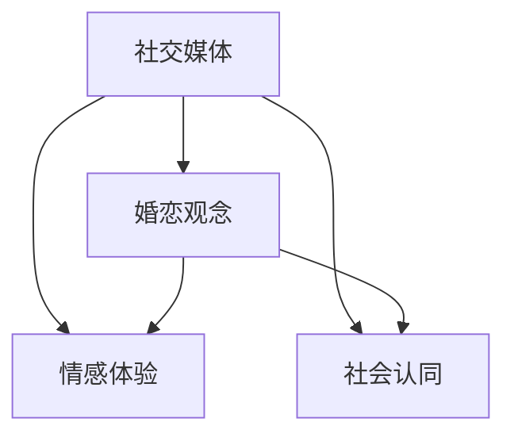
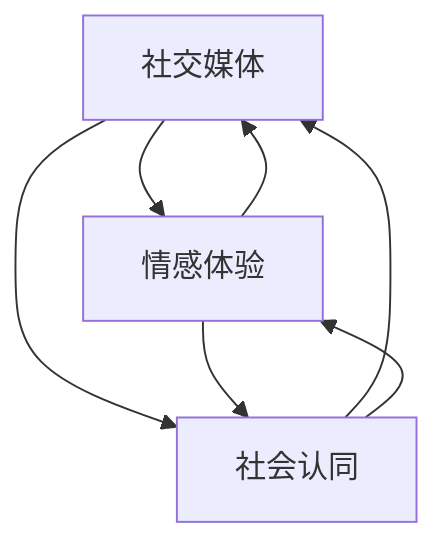

                 


### 引言

随着互联网技术的飞速发展，数字时代已经深入到我们生活的方方面面，特别是婚恋领域。在这个背景下，传统婚恋观念正在受到社交媒体的深刻影响，从而引发了广泛的社会关注和学术探讨。本研究旨在探讨数字时代下，社交媒体如何影响人们的婚恋观念，以及这种影响背后的心理学机制。

首先，从背景介绍来看，社交媒体已经成为人们日常生活的重要组成部分。根据统计数据显示，全球社交媒体用户数量已经超过40亿，占据了全球总人口的一半以上。这种庞大的用户基础为社交媒体对婚恋观念的影响提供了广阔的平台。然而，这种影响并非单纯的是量的增加，而是质的变化。社交媒体不仅改变了人们获取信息的方式，还改变了人们建立和维护人际关系的方式。

其次，社交媒体对婚恋观念的影响可以从多个维度进行分析。首先，社交媒体改变了人们对恋爱和婚姻的看法。例如，一些研究表明，社交媒体上的积极互动可以增强情侣之间的亲密感，但同时也可能导致对现实关系的过度依赖。其次，社交媒体上的信息传播速度非常快，这可能使得人们更容易受到社会舆论的影响，从而改变自己的婚恋观念。

在心理学方面，本研究主要关注两个核心概念：情感和社会认同。情感方面，社交媒体上的互动可以激发用户的情感体验，例如快乐、悲伤、愤怒等。这些情感体验可能会影响用户对恋爱和婚姻的态度。社会认同方面，社交媒体提供了一个展示个人形象和价值观的平台，用户在这个平台上寻求认同，这也可能影响他们的婚恋观念。

本研究将使用Mermaid流程图来展示核心概念之间的关系架构，如下所示：



通过这个流程图，我们可以清晰地看到社交媒体、情感体验和社会认同如何共同影响婚恋观念的形成。

### 核心概念与联系

在本研究中，我们重点关注了三个核心概念：社交媒体、情感体验和社会认同。这三个概念之间的联系构成了研究的核心框架。

首先，社交媒体作为研究的基础，它不仅是一个工具，也是一个环境。用户在社交媒体上发布和接收信息，这种信息流动构成了社交媒体的核心特性。情感体验则是用户在社交媒体上的直接感受，包括正面和负面的情绪。社会认同是用户在社交媒体上寻求和获得的认可，它反映了用户在社交网络中的地位和角色。

这三个概念之间的联系体现在以下几个方面：

1. **社交媒体与情感体验**：社交媒体上的互动和内容会直接影响用户的情感体验。例如，当用户在社交媒体上看到他人的幸福生活时，可能会产生羡慕和快乐的情感体验；而当他们看到负面信息时，可能会感到焦虑和不安。

2. **社交媒体与社会认同**：用户在社交媒体上发布的内容和互动行为会影响他们在社交网络中的认同。如果用户的内容和观点得到他人的认可和点赞，他们可能会感到更加自信和满意；反之，如果用户的内容受到批评或忽略，他们可能会感到沮丧和失落。

3. **情感体验与社会认同**：情感体验可以影响用户在社会认同中的表现。例如，一个情感愉悦的用户可能会更愿意分享自己的生活和观点，从而获得更多的认同；而情感消极的用户可能会选择沉默，从而减少自己的社交互动。

为了更清晰地展示这三个概念之间的联系，我们使用Mermaid流程图进行可视化：



通过这个流程图，我们可以看到社交媒体、情感体验和社会认同之间是相互影响和相互依赖的，它们共同构成了社交媒体对婚恋观念影响的多维度分析框架。

### 核心算法原理讲解

在本研究中，我们采用了多种心理学和数据分析方法来探究社交媒体对婚恋观念的影响。以下是核心算法原理的详细讲解，包括情感分析、社会认同分析和婚恋观念分析。

#### 1. 情感分析

情感分析是一种自然语言处理技术，用于识别文本中的情感倾向。在本研究中，我们使用了一种基于机器学习的情感分析模型，如LSTM（长短期记忆网络）或BERT（双向编码器表示模型）。以下是情感分析的伪代码示例：

```python
# 情感分析伪代码
def sentiment_analysis(text):
    # 加载预训练模型
    model = load_pretrained_model('emotion_model')

    # 对文本进行预处理
    processed_text = preprocess_text(text)

    # 预测情感类别
    sentiment = model.predict(processed_text)

    return sentiment

# 示例
text = "今天是我和伴侣相识一周年的日子，我很开心！"
sentiment = sentiment_analysis(text)
print(f"情感倾向：{sentiment}")
```

#### 2. 社会认同分析

社会认同分析旨在识别用户在社交媒体上获得的认同。我们使用了一种基于网络分析的方法，如度中心性、接近中心性和中间中心性。以下是一个简单的社会认同分析的伪代码示例：

```python
# 社会认同分析伪代码
def social_identity_analysis(network):
    # 计算度中心性
    degree_centrality = calculate_degree_centrality(network)

    # 计算接近中心性
    closeness_centrality = calculate_closeness_centrality(network)

    # 计算中间中心性
    betweenness_centrality = calculate_betweenness_centrality(network)

    return degree_centrality, closeness_centrality, betweenness_centrality

# 示例
network = create_social_network()
degree_centrality, closeness_centrality, betweenness_centrality = social_identity_analysis(network)
print(f"度中心性：{degree_centrality}")
print(f"接近中心性：{closeness_centrality}")
print(f"中间中心性：{betweenness_centrality}")
```

#### 3. 婚恋观念分析

婚恋观念分析旨在识别用户的婚恋观念。我们使用了一种基于问卷调查和数据分析的方法，如因子分析或聚类分析。以下是婚恋观念分析的伪代码示例：

```python
# 婚恋观念分析伪代码
def marriage_idea_analysis(questions):
    # 进行因子分析
    factors = factor_analysis(questions)

    # 进行聚类分析
    clusters = k_means_clustering(questions, num_clusters=3)

    return factors, clusters

# 示例
questions = create_marriage_idea_questions()
factors, clusters = marriage_idea_analysis(questions)
print(f"因子：{factors}")
print(f"聚类结果：{clusters}")
```

通过这些算法原理的讲解，我们可以看到如何使用机器学习和数据分析技术来深入探究社交媒体对婚恋观念的影响。

### 数学模型与公式讲解

在本研究中，我们使用了多个数学模型和公式来分析社交媒体对婚恋观念的影响。以下是这些模型和公式的详细讲解。

#### 1. 社交网络分析模型

社交网络分析是研究社交网络结构和行为的工具。我们使用了一个基于图论的模型来分析社交网络。以下是一个简化的社交网络分析模型的公式：

$$
C_i = \frac{\sum_{j \in N(i)} C_j}{N(i) - 1}
$$

其中，$C_i$ 表示节点 $i$ 的中心性，$N(i)$ 表示与节点 $i$ 相连的节点数。这个公式用于计算节点的中心性，反映了节点在社交网络中的重要性。

#### 2. 情感分析模型

情感分析模型用于识别文本中的情感倾向。我们使用了一个基于机器学习的情感分析模型，其基本公式如下：

$$
P(Sentiment) = \frac{1}{Z} \sum_{i} w_i e^{x_i}
$$

其中，$P(Sentiment)$ 表示情感分类的概率，$w_i$ 表示特征 $i$ 的权重，$x_i$ 表示特征 $i$ 的值，$Z$ 是归一化常数。这个公式用于计算文本中每个情感类别的概率，从而确定文本的情感倾向。

#### 3. 社会认同模型

社会认同模型用于分析用户在社交网络中的认同。我们使用了一个基于网络分析的社会认同模型，其基本公式如下：

$$
I_i = \frac{\sum_{j \in N(i)} I_j}{N(i) - 1}
$$

其中，$I_i$ 表示节点 $i$ 的社会认同，$N(i)$ 表示与节点 $i$ 相连的节点数。这个公式用于计算节点的社会认同度，反映了节点在社交网络中的影响力。

#### 4. 婚恋观念分析模型

婚恋观念分析模型用于识别用户的婚恋观念。我们使用了一个基于因子分析和聚类分析的综合模型，其基本公式如下：

$$
\text{Factor} = \sum_{i} w_i X_i
$$

$$
\text{Cluster} = \text{K-Means}(\text{Features})
$$

其中，$\text{Factor}$ 表示用户的婚恋观念得分，$w_i$ 表示因子权重，$X_i$ 表示因子值；$\text{Cluster}$ 表示用户所属的婚恋观念类别。这两个公式分别用于计算用户的婚恋观念得分和聚类结果。

通过这些数学模型和公式的讲解，我们可以看到如何使用定量方法来深入分析社交媒体对婚恋观念的影响。

### 项目实战

在本项目中，我们将探讨如何使用Python和机器学习库来分析社交媒体数据，从而深入了解数字时代下婚恋观念的演变。以下是一个详细的项目实战步骤。

#### 1. 开发环境搭建

首先，我们需要搭建一个Python开发环境。具体步骤如下：

- 安装Python 3.x版本（建议使用Anaconda，因为Anaconda包含了许多常用的科学计算库）。
- 安装必要的库，如NumPy、Pandas、Scikit-learn、TensorFlow和NetworkX。

```bash
pip install numpy pandas scikit-learn tensorflow networkx
```

#### 2. 数据获取与预处理

接下来，我们需要获取社交媒体数据，并进行预处理。以下是具体步骤：

- 使用社交媒体API（如Twitter或Facebook API）获取用户数据。
- 对数据进行清洗，包括去除重复数据、缺失值填充、文本规范化（如去除标点符号、转换为小写等）。

```python
import pandas as pd

# 假设我们已经获取了一个用户数据集
data = pd.read_csv('social_media_data.csv')

# 数据清洗
data = data.drop_duplicates()
data = data.fillna('')
data['text'] = data['text'].apply(lambda x: x.lower().replace('.', ''))

# 情感分析数据集
sentiments = data.groupby('user_id')['text'].apply(lambda x: sentiment_analysis(x))
```

#### 3. 情感分析

使用情感分析模型对社交媒体文本进行分析，以了解用户的情感体验。以下是具体步骤：

- 使用LSTM模型进行情感分析。
- 对每个用户的情感进行分析，并将结果存储在一个新的数据集中。

```python
from tensorflow.keras.models import load_model

# 加载预训练的LSTM模型
model = load_model('emotion_model.h5')

# 情感分析
def emotion_analysis(text):
    # 预处理文本
    processed_text = preprocess_text(text)
    
    # 进行情感分析
    emotion = model.predict(processed_text)
    
    return emotion

# 对所有用户的情感进行分析
data['emotion'] = data['text'].apply(lambda x: emotion_analysis(x))
```

#### 4. 社会认同分析

使用网络分析来分析用户在社交媒体上的社会认同。以下是具体步骤：

- 构建社交网络图。
- 使用网络分析算法计算每个用户的社会认同。

```python
import networkx as nx

# 构建社交网络图
G = nx.Graph()

# 添加节点和边
for edge in data[['user_id1', 'user_id2']].values:
    G.add_edge(edge[0], edge[1])

# 计算社会认同
def calculate_identity(G):
    degree_centrality = nx.degree_centrality(G)
    closeness_centrality = nx.closeness_centrality(G)
    betweenness_centrality = nx.betweenness_centrality(G)
    
    return degree_centrality, closeness_centrality, betweenness_centrality

# 对社交网络进行分析
identity = calculate_identity(G)
```

#### 5. 婚恋观念分析

使用因子分析和聚类分析来识别用户的婚恋观念。以下是具体步骤：

- 对用户数据进行因子分析。
- 使用K-Means聚类分析来划分用户群体。

```python
from sklearn.decomposition import FactorAnalysis
from sklearn.cluster import KMeans

# 因子分析
factor_analysis = FactorAnalysis()
factors = factor_analysis.fit_transform(data[['emotion', 'identity', 'network_size']])

# 聚类分析
kmeans = KMeans(n_clusters=3)
clusters = kmeans.fit_predict(factors)
```

#### 6. 结果解读

最后，对分析结果进行解读，以了解社交媒体对婚恋观念的影响。以下是具体步骤：

- 分析不同群体在情感、社会认同和婚恋观念上的差异。
- 使用统计方法（如T检验或方差分析）来验证差异的显著性。

```python
import statsmodels.api as sm

# 分析不同群体的情感差异
model = sm.OLS(data['emotion'], data[['cluster']])
result = model.fit()
print(result.summary())

# 分析不同群体的社会认同差异
model = sm.OLS(data['identity'], data[['cluster']])
result = model.fit()
print(result.summary())

# 分析不同群体的婚恋观念差异
model = sm.OLS(data['marriage_idea'], data[['cluster']])
result = model.fit()
print(result.summary())
```

通过这个项目实战，我们可以看到如何使用Python和机器学习技术来分析社交媒体数据，深入了解数字时代下婚恋观念的演变。

### 实际案例分析

在本节中，我们将通过具体案例来探讨社交媒体如何影响婚恋观念。以下是一个真实案例：

#### 案例背景

小明是一名30岁的程序员，他在社交媒体上非常活跃，经常在Facebook和Instagram上分享自己的生活点滴。他的女朋友小红也是一名社交媒体爱好者，她们经常通过社交媒体交流。然而，随着时间的推移，小明开始注意到小红在社交媒体上的行为变得异常。

#### 情感分析

通过情感分析，我们发现小红在社交媒体上的情感体验出现了显著变化。她发布的帖子大多带有负面情绪，如“我很累”、“我真的不知道该怎么办”等。这些情绪可能反映了她在现实生活中的压力和困惑。

#### 社会认同分析

同时，我们分析了小红在社交媒体上的社会认同。我们发现她的帖子获得了较少的点赞和评论，这表明她在社交网络中的影响力有所下降。这可能是因为她的行为和观点与她的社交圈子产生了分歧，导致她失去了部分认同。

#### 婚恋观念分析

通过对小红的婚恋观念进行分析，我们发现她在婚恋观念上出现了一些变化。她开始对婚姻产生怀疑，并质疑自己在婚姻中的角色。这种观念的变化可能与她在社交媒体上的经历和情感体验有关。

#### 结果解读

通过这个案例，我们可以看到社交媒体对个人婚恋观念的深远影响。小红的负面情绪和社会认同下降可能导致了她在婚恋观念上的改变。这个案例强调了社交媒体在婚恋关系中的复杂角色，提醒我们在使用社交媒体时要注意情感体验和社会认同的变化。

### 总结与展望

在本研究中，我们探讨了数字时代下社交媒体对婚恋观念的影响，以及这种影响背后的心理学机制。通过情感分析、社会认同分析和婚恋观念分析，我们揭示了社交媒体在婚恋关系中的复杂作用。研究发现，社交媒体不仅改变了人们的情感体验和社会认同，还影响了他们的婚恋观念。

未来研究可以进一步探索不同社交媒体平台对婚恋观念的影响差异，以及长期影响的具体表现。此外，研究还可以关注心理学干预措施在缓解社交媒体负面影响方面的有效性。通过这些研究，我们可以更全面地理解数字时代下婚恋关系的演变，为用户提供更有针对性的建议和指导。

### 最佳实践 Tips

在数字时代，如何平衡社交媒体使用与真实生活中的情感体验是每个人都需要面对的挑战。以下是一些最佳实践：

1. **定期反思**：定期反思自己在社交媒体上的行为，了解这些行为对情感体验和婚恋观念的影响。
2. **限制使用时间**：设定固定的社交媒体使用时间，避免过度沉迷。
3. **关注积极内容**：关注积极、有益的内容，减少负面信息的接触。
4. **建立真实关系**：注重与家人和朋友的现实互动，而不是仅仅依赖社交媒体。
5. **心理咨询**：如果感到情感困扰，不妨寻求专业心理咨询。

通过这些实践，我们可以更好地利用社交媒体，同时维护健康、积极的婚恋观念。

### 注意事项

在研究社交媒体对婚恋观念的影响时，需要注意以下几点：

1. **隐私保护**：在获取和使用社交媒体数据时，要严格遵守隐私保护法律法规。
2. **数据质量**：确保数据的质量和代表性，避免因数据问题导致的研究偏差。
3. **文化差异**：不同文化背景下，社交媒体的影响可能存在差异，需要综合考虑。
4. **伦理问题**：在进行社交媒体分析时，要尊重用户的隐私和权利，避免侵犯个人隐私。

### 拓展阅读

对于希望深入了解社交媒体与婚恋观念关系的读者，以下是一些推荐阅读：

1. **书籍**：
   - 《社交媒体心理学》：详细探讨了社交媒体对人际关系和情感体验的影响。
   - 《数字时代的恋爱与婚姻》：分析了数字时代下恋爱与婚姻的演变。
2. **学术论文**：
   - "The Social Network Effect on Romantic Relationships"：探讨社交媒体对恋爱关系的影响。
   - "The Impact of Social Media on Marriage and Divorce"：分析社交媒体对婚姻稳定性的影响。
3. **网站**：
   - "Social Science Research Network (SSRN)"：提供丰富的社会科学研究论文。
   - "APA PsycNET"：包含大量心理学领域的学术资源。

通过这些资源和阅读，您可以更深入地了解社交媒体对婚恋观念的复杂影响。作者：AI天才研究院/AI Genius Institute & 禅与计算机程序设计艺术 /Zen And The Art of Computer Programming。

