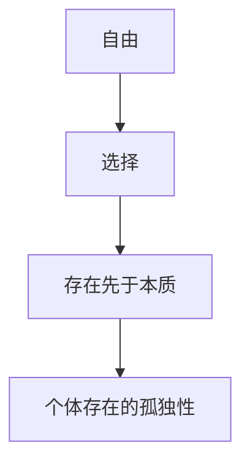

                 


### 第一步：引言

在数字化浪潮席卷全球的今天，我们不禁要思考这样一个问题：数字技术究竟是如何影响我们的存在主义的？数字时代下，人类的存在是否发生了本质的变化？又应该如何在这样的环境中寻求精神上的指引和哲学上的思考？本文将以《数字时代的存在主义思考》为题，通过深入剖析存在主义哲学的背景、核心概念及其与数字技术的结合，探讨数字时代下的存在主义实践，试图回答上述问题。

#### 背景介绍

存在主义作为一种哲学流派，起源于20世纪，以其对个体自由、选择和责任的强调而著称。其主要代表人物包括尼采、萨特、海德格尔等，他们从不同角度探讨了人类存在的意义和本质。在存在主义看来，人类的存在是自由而孤独的，每个人都有自己的存在方式，这种存在方式是通过不断的选择和行动来实现的。

数字技术，作为现代科技的重要组成部分，已经深刻地改变了我们的生活方式、工作方式以及思维方式。从互联网到人工智能，从智能手机到物联网，数字技术正以不可阻挡的势头渗透到我们生活的方方面面。这种技术变革不仅改变了我们的外部环境，也深刻影响了我们的内心世界。

#### 核心概念与联系

存在主义的核心概念包括自由、选择、存在先于本质和个体存在的孤独性。这些概念之间的关系可以用以下Mermaid流程图来表示：



自由是存在主义的基础，强调个体的自主性和独立性。选择则是个体自由的具体体现，每个选择都塑造了个体独特的生活方式。存在先于本质则指出，个体的存在是独立于社会和文化的，每个人都有自己的存在方式。个体存在的孤独性则强调了个体在追求自由和选择的过程中所面临的孤独感和责任感。

#### 文章关键词

存在主义、数字技术、自由、选择、存在先于本质、个体存在的孤独性、技术伦理、数字时代的存在主义实践。

#### 文章摘要

本文旨在探讨数字时代下存在主义的哲学思考与实践。首先，我们回顾了存在主义哲学的背景和核心概念，然后分析了数字技术对人类存在的影响，探讨了数字化时代的技术伦理问题，并讨论了数字技术与存在主义的结合。最后，我们提出了数字时代存在主义实践的建议，以期在数字化的世界中找到精神的指引和哲学的思考。

### 第二步：深入探讨存在主义哲学的背景

存在主义哲学的起源可以追溯到19世纪末和20世纪初，当时欧洲正经历着前所未有的社会动荡和思想变革。第一次世界大战的爆发以及随后经济大萧条，使人们开始质疑传统的哲学观念和价值观。在这个背景下，一些哲学家开始重新审视人类的存在和意义，存在主义哲学应运而生。

存在主义哲学的主要代表人物包括尼采、萨特和海德格尔。尼采是存在主义的先驱之一，他的哲学思想强调个体的自由意志和无条件的自我肯定。尼采认为，人类应该超越传统道德和社会规范的束缚，勇敢地追求自己的真实存在。

萨特则是存在主义的代表性人物，他的哲学思想强调自由、选择和个体责任。萨特认为，人类的存在是自由而孤独的，每个人都有自己的存在方式，这种存在方式是通过不断的选择和行动来实现的。萨特的存在主义思想在他的小说《存在与虚无》中得到了深刻的阐述。

海德格尔则是存在主义哲学的另一重要代表，他的哲学思想强调存在的本质和存在的意义。海德格尔认为，存在的本质是“存在本身”，而不是某种特定的存在方式。他提出了“存在先于本质”的概念，强调个体存在的独立性和自主性。

#### 存在主义哲学的核心概念

存在主义哲学的核心概念包括自由、选择、存在先于本质和个体存在的孤独性。

自由是存在主义的基础，强调个体的自主性和独立性。在存在主义者看来，人类是自由的，每个人都有权选择自己的生活方式和价值观。这种自由不仅体现在个体行动的选择上，也体现在对生活态度和人生意义的抉择上。

选择则是个体自由的具体体现，每个选择都塑造了个体独特的生活方式。在存在主义哲学中，选择是一个严肃而复杂的过程，它要求个体对自己的行为和决策负责。

存在先于本质是指个体存在的独立性和自主性。在存在主义者看来，个体的存在不是由某种先验的本质决定的，而是通过个体的选择和行动来实现的。这个概念强调了个体存在的独特性和不可复制性。

个体存在的孤独性则强调了个体在追求自由和选择的过程中所面临的孤独感和责任感。在存在主义哲学中，个体不仅面临着外部世界的挑战，也面临着内心的挣扎和孤独。

#### 存在主义哲学的历史发展

存在主义哲学在20世纪经历了多个发展阶段。从早期尼采的存在主义到萨特的存在主义，再到海德格尔的存在主义，存在主义哲学在不同时期有着不同的特点和侧重点。

早期的存在主义哲学强调个体的自由意志和无条件的自我肯定。尼采的存在主义思想对后来的存在主义者产生了深远影响，特别是他对传统道德和社会规范的批判，为后来的存在主义者提供了理论基础。

萨特的存在主义哲学则更加注重个体的选择和责任。萨特认为，个体的自由不仅仅是一种理论上的权利，更是一种实际的行动。他提出了“存在即选择”的观点，强调个体的每一个选择都直接影响了其存在的方式和意义。

海德格尔的存在主义哲学则更加关注存在的本质和存在的意义。他认为，存在的本质是“存在本身”，而不是某种特定的存在方式。他提出了“存在先于本质”的概念，强调个体存在的独立性和自主性。

#### 总结

存在主义哲学作为一种对人类存在深刻思考的哲学流派，具有丰富的内涵和深远的影响。它不仅提供了对个体存在的深刻理解，也为现代社会中的个体提供了精神上的指引。在数字时代的背景下，重新审视和探讨存在主义哲学，对于我们理解人类在数字化环境中的存在方式和生活方式具有重要意义。

### 第三步：数字技术对人类存在的影响

随着数字技术的飞速发展，人类的存在方式和生活状态正在发生深刻的变革。互联网、人工智能、物联网等新兴技术的广泛应用，不仅改变了我们的生活方式，也对我们内心的认知和思想产生了深远的影响。

#### 数字化对人类生活方式的改变

首先，数字化技术极大地改变了我们的生活方式。互联网的普及使信息获取变得更加便捷，人们可以随时随地进行在线学习、工作和社交。智能手机的普及则使得人们的生活更加便捷，从支付、购物到出行、娱乐，都可以通过一部手机完成。物联网技术的发展，更是将我们的家居生活、工作环境以及社会服务连接在一起，实现了一种全新的生活方式。

然而，数字化技术的快速发展也带来了一系列的挑战。首先，数字化使得信息过载成为了一个普遍问题。人们每天都会接收到大量的信息，但并非所有信息都是必要的或有益的，这容易导致人们的注意力分散和焦虑感增加。其次，数字化生活方式也带来了一定的隐私和安全问题。随着个人信息的数字化，隐私泄露和网络犯罪的风险也随之增加。

#### 数字化对人类思想的挑战

数字化技术不仅改变了我们的生活方式，也对我们内心的思想产生了挑战。首先，数字化使得人类的存在感变得更加脆弱。在虚拟世界中，人们可以通过各种方式塑造自己的形象，但这种形象的塑造往往是一种虚假的存在感。海德格尔曾提出，“存在即存在感”，而在数字化时代，人们可能会因为过度依赖虚拟世界而失去对现实世界的感知和认知。

其次，数字化技术也对我们的思维方式产生了影响。传统的思维方式强调逻辑、推理和分析，而数字化时代则更注重信息的快速处理和反馈。这种变化使得我们的思维方式更加灵活和多样化，但也可能导致我们对复杂问题的处理能力下降。

此外，数字化技术还挑战了我们的道德观念和价值观念。在数字化环境中，个体行为的后果往往难以预测和控制，这容易导致道德困境和伦理问题。例如，在社交媒体上，人们可以轻易地传播虚假信息和恶意言论，这对社会和谐和个人价值观的稳定构成了威胁。

#### 数字化与人类存在的互动

数字化技术与人类存在的互动是一个复杂而微妙的过程。一方面，数字化技术为人类提供了更多的机会和可能性，使我们能够更加高效地生活和工作。另一方面，数字化技术也带来了一系列的挑战和问题，需要我们认真思考和应对。

首先，数字化技术为我们提供了更多的自由和选择。在数字化环境中，我们可以根据自己的需求和兴趣选择各种服务，这有助于提高个体的自主性和独立性。然而，这种自由和选择也带来了一定的风险。例如，过度沉迷于数字化生活可能会导致个体的社交能力和情感表达能力下降。

其次，数字化技术改变了我们对时间和空间的认知。在数字化时代，时间和空间的概念变得更加模糊和灵活。人们可以在不同的时区和地点进行实时沟通和协作，但这种虚拟的时间和空间的体验是否能够完全替代现实中的体验，仍需进一步探讨。

最后，数字化技术也对我们的价值观和信仰体系产生了影响。在数字化环境中，个体更容易接触到各种文化和价值观，这有助于拓宽我们的视野和思维方式。然而，这种多元化和开放性也可能导致个体价值观的混乱和困惑。

#### 总结

数字技术对人类存在的影响是深远而复杂的。它不仅改变了我们的生活方式和思维方式，也对我们内心的认知和思想产生了挑战。在数字时代的背景下，我们需要重新审视和思考人类存在的本质和意义，以更好地应对数字化带来的机遇和挑战。

### 第四步：数字化时代的技术伦理

随着数字技术的快速发展，技术伦理问题也日益凸显。数字化时代的技术伦理不仅关乎技术的合理使用，更涉及到人类社会的道德底线和价值观念。在这个部分，我们将探讨数字化时代的技术伦理困境、伦理规范以及未来趋势。

#### 数字化时代的道德困境

首先，数字化时代带来了道德困境。一方面，技术的进步使得信息传播更加迅速和广泛，但同时也使得虚假信息和恶意言论的传播更加容易。在社交媒体和互联网平台上，人们可以轻易地发布和传播不实信息，这对社会和谐和个人价值观的稳定构成了严重威胁。另一方面，数字化技术的广泛应用也带来了一些伦理问题，例如隐私保护、数据安全和算法偏见等。

隐私保护是数字化时代的重要伦理问题之一。随着个人信息的数字化，隐私泄露的风险也随之增加。大量的个人信息被收集、存储和使用，但如何确保这些信息的保密性和安全性，是一个亟待解决的道德问题。数据安全也是一个重要的伦理问题。数字化技术的广泛应用使得数据泄露和黑客攻击的风险增加，这不仅对个人隐私造成威胁，也可能对国家安全和公共利益产生负面影响。

算法偏见是另一个突出的道德困境。随着人工智能技术的发展，越来越多的决策和判断依赖于算法。然而，算法的偏见和歧视问题也引起了广泛关注。算法偏见可能导致不公平的决策，损害特定群体的权益，这与存在主义所强调的公平、正义和个体的尊严相悖。

#### 数字技术的伦理规范

为了应对数字化时代的道德困境，制定和遵守伦理规范显得尤为重要。首先，需要制定明确的隐私保护法规，规范个人信息的收集、存储和使用。这不仅有助于保护个人隐私，也能够限制滥用个人信息的行为。其次，需要加强对数据安全的监管，确保数据的保密性和完整性。此外，还应该建立算法审查和监管机制，防止算法偏见和歧视问题的发生。

在隐私保护和数据安全方面，可以采取以下措施：

1. **数据匿名化**：在收集和使用个人信息时，尽可能进行数据匿名化处理，以减少隐私泄露的风险。
2. **加密技术**：使用先进的加密技术，确保数据的传输和存储过程中的安全性。
3. **透明度原则**：在数据处理过程中，保持透明度，使个人能够了解自己的信息被如何使用。

在防止算法偏见和歧视方面，可以采取以下措施：

1. **算法审查**：建立独立的算法审查机制，对算法进行定期审查和评估，确保其公平性和透明性。
2. **数据多样性**：在算法训练过程中，使用多样化的数据集，以减少算法的偏见。
3. **公平性评估**：建立公平性评估标准，对算法的决策结果进行定期评估，确保其不会对特定群体产生不公平的影响。

#### 数字技术伦理的未来趋势

随着数字化技术的不断发展和应用，数字技术伦理也将面临新的挑战和机遇。未来，数字技术伦理的发展趋势可能包括以下几个方面：

1. **人工智能伦理**：随着人工智能技术的普及，人工智能伦理将成为一个重要的研究领域。如何确保人工智能系统的公正性、透明性和可靠性，将是未来数字技术伦理的重要议题。
2. **数字主权**：随着数字化程度的提高，数字主权问题也将日益突出。各国政府和企业需要制定相应的数字主权政策，确保数字化过程中的安全和主权。
3. **全球合作**：面对数字技术带来的全球性挑战，各国需要加强合作，共同制定全球性的数字技术伦理规范，以促进数字时代的可持续发展。

#### 总结

数字化时代的技术伦理问题是一个复杂而多元的领域，涉及隐私保护、数据安全、算法偏见等多个方面。为了应对这些挑战，我们需要制定和遵守明确的伦理规范，推动数字技术的可持续发展。同时，也需要加强全球合作，共同应对数字技术带来的全球性伦理问题。

### 第五步：数字技术与存在主义的结合

在数字技术日益渗透到我们生活和工作的各个方面时，存在主义哲学与数字技术的结合成为了一个备受关注的话题。这种结合不仅丰富了存在主义哲学的内涵，也为数字技术的发展提供了新的伦理和哲学思考。

#### 数字技术与存在主义哲学的结合点

首先，数字技术与存在主义哲学的结合点在于对个体自由和责任的强调。存在主义哲学强调个体的自由和选择，而数字技术则为个体提供了更多的自由和选择。例如，互联网的普及使得个体可以更自由地表达自己的观点和意见，而人工智能的进步则使得个体能够更加高效地完成各种任务，从而有更多的时间和精力去追求自己的兴趣和梦想。

其次，数字技术与存在主义哲学的结合点在于对个体存在方式和存在意义的探讨。存在主义哲学关注个体的存在方式和存在意义，而数字技术则为个体提供了更多的存在方式。例如，虚拟现实技术让个体可以进入一个完全不同的世界，体验不同的生活方式和存在意义。这种虚拟的存在方式虽然不同于现实，但也可以成为个体探索自我和实现自我的重要途径。

#### 数字时代的存在主义哲学思考

在数字时代，存在主义哲学需要重新思考个体存在的本质和意义。首先，数字技术使得个体的存在变得更加复杂和多元。在现实世界中，个体需要面对物理环境和社会规范，而在虚拟世界中，个体则需要面对数字环境和技术规范。这种双重存在使得个体需要更加灵活和开放地去适应和探索。

其次，数字技术改变了个体的存在体验。在数字化环境中，个体的存在不仅可以通过物理行动来体现，还可以通过数字互动来体现。这种数字互动不仅改变了个体的社交方式，也改变了个体的自我认知和自我表达方式。例如，社交媒体平台使得个体可以更加自由地展示自己的个性和观点，而虚拟现实技术则可以让个体更加真实地体验不同环境和情境。

最后，数字技术挑战了传统存在主义哲学的一些观点。例如，存在主义哲学强调个体存在的孤独性和独立性，而数字技术则使得个体可以更容易地与他人建立联系和互动。这种变化使得个体存在的孤独性和独立性需要重新定义和理解。

#### 数字技术与存在主义实践的结合

数字技术与存在主义实践的结合体现在多个方面。首先，在个人自由和责任方面，个体需要更加明确自己的选择和行动，并承担相应的责任。在数字化环境中，个体需要保护自己的隐私和信息安全，同时也需要遵守数字社会的规范和伦理。

其次，在共同体建设方面，数字技术为个体提供了更多参与和贡献的机会。通过互联网和社交媒体，个体可以更加便捷地参与到各种社区和活动中，共同建设一个更加和谐和富有创造力的数字社会。

最后，在技术和哲学的结合方面，个体需要不断思考和探索数字技术在存在主义哲学中的意义和应用。通过将存在主义哲学的理念应用于数字技术的开发和应用中，可以更好地促进技术的伦理性和人文性。

#### 总结

数字技术与存在主义的结合为存在主义哲学提供了新的视角和实践路径。在数字时代，我们需要重新思考个体存在的本质和意义，同时也需要探索数字技术在存在主义实践中的应用。通过这种结合，我们可以更好地理解和应对数字时代带来的挑战和机遇。

### 第六步：数字时代的个人自由与责任

在数字时代，个人自由与责任的关系变得更加复杂和微妙。数字技术为我们提供了前所未有的自由，但同时也带来了新的责任挑战。如何在这个数字化的世界中平衡个人自由与责任，成为了一个亟待解决的问题。

#### 数字时代的个人自由

首先，数字技术极大地扩展了我们的个人自由。在互联网和社交媒体平台上，个体可以自由地表达自己的观点和意见，不受地理和时间的限制。这种自由的扩展不仅提高了个体的表达权，也促进了信息和思想的自由流动。例如，通过博客、社交媒体和在线论坛，个人可以随时随地分享自己的知识和经验，形成了一个全球性的知识共享网络。

其次，数字技术使得个体能够更加自主地选择和定制服务。无论是电子商务平台、在线学习资源，还是个性化推荐系统，个体都可以根据自己的需求和兴趣，选择最适合自己的产品和服务。这种自主性不仅提升了个体的生活品质，也增强了个体对自己生活的掌控感。

然而，数字时代的个人自由也带来了一些新的挑战。首先，个人自由的扩展可能导致隐私泄露的风险增加。在数字化环境中，大量的个人信息被收集和存储，这为隐私保护带来了巨大的挑战。其次，数字自由的扩展可能导致个体沉迷于虚拟世界，忽视现实生活中的责任和义务。

#### 数字时代的个人责任

与个人自由相伴随的是个人责任。在数字时代，个体需要承担更多的责任，以维护数字社会的秩序和公正。

首先，个体需要对自己的言论和行为负责。在社交媒体和互联网平台上，个体可以自由表达观点，但这种自由并不意味着可以无限制地发布虚假信息或恶意言论。个体需要意识到，自己的言论和行为会对他人和社会产生直接影响，因此需要对自己的言行负责。

其次，个体需要对自己的数据和信息负责。在数字化环境中，个人数据的保护和管理变得尤为重要。个体需要了解自己的数据如何被收集、存储和使用，并采取必要的措施来保护自己的隐私和安全。此外，个体也需要遵守数字社会的规范和伦理，不滥用数字技术，不侵犯他人的权益。

最后，个体需要对自己的行为后果负责。在数字时代，个体的行为后果可能更加难以预测和控制。例如，不当的网络安全行为可能导致个人数据泄露或网络攻击，这对个体和社会都会产生严重的负面影响。因此，个体需要对自己的行为后果有清晰的认识，并采取负责任的行为。

#### 个人自由与责任的平衡

在数字时代，平衡个人自由与责任至关重要。以下是一些实现这一平衡的建议：

1. **隐私保护**：个体需要加强隐私保护意识，采取有效的措施来保护自己的个人信息。例如，使用强密码、定期更新软件、不随意分享个人信息等。

2. **责任教育**：加强对个体的数字责任教育，使其了解在数字化环境中应该如何承担自己的责任。这包括遵守数字社会的规范和伦理、保护个人信息、不滥用数字技术等。

3. **法律法规**：制定和执行相关法律法规，加强对数字社会的管理和监管。例如，制定隐私保护法、网络安全法等，规范个人数据的收集、存储和使用。

4. **公众参与**：鼓励公众参与数字社会的建设和监管，提高个体的数字素养和责任意识。通过公众参与，可以更好地发现和解决数字社会中的问题，实现个人自由与责任的平衡。

#### 总结

在数字时代，个人自由与责任的关系变得更加复杂和重要。个体需要在这两者之间找到平衡点，既要享受数字技术带来的自由，也要承担相应的责任。通过加强隐私保护、责任教育、法律法规和公众参与，我们可以更好地实现个人自由与责任的平衡，促进数字社会的健康发展。

### 第七步：数字时代的共同体建设

在数字时代，共同体建设成为了一个关键议题。数字技术的快速发展不仅改变了个体与个体之间的关系，也重塑了共同体形态和互动方式。在这个部分，我们将探讨数字时代共同体的特点、建设策略以及面临的挑战与机遇。

#### 数字时代共同体的特点

首先，数字时代共同体具有高度的虚拟性。传统共同体通常基于物理空间和地理位置，而数字时代共同体则更多地依赖于虚拟平台和数字空间。这种虚拟性使得共同体成员之间的互动更加灵活和多样化，不再受限于物理距离和时间。

其次，数字时代共同体具有高度的开放性。在传统社会中，共同体成员往往有明确的边界和身份，而数字时代共同体则更加开放，任何人都可以加入和参与。这种开放性使得共同体能够吸纳更多的成员和资源，形成更广泛的合作和交流。

此外，数字时代共同体还具有高度的动态性。由于数字技术的不断更新和变化，共同体成员之间的关系和互动方式也在不断调整和演变。这种动态性使得共同体能够更加灵活地适应外部环境的变化，保持其生命力和活力。

#### 数字时代的共同体建设策略

建设数字时代共同体需要采取一系列策略，以促进成员之间的互动和合作。

首先，建立有效的沟通和交流机制。在数字时代，沟通和交流是共同体建设的关键。通过建立在线论坛、社交媒体群组、即时通讯工具等，共同体成员可以方便地分享信息和资源，促进彼此的了解和互动。

其次，制定共同的目标和价值观。共同的目标和价值观是共同体凝聚力的重要来源。共同体成员需要共同明确共同的目标和价值观，以确保在合作过程中的方向一致和目标明确。

此外，提供丰富的参与和贡献机会。共同体成员需要有机会参与到共同体的建设和决策过程中，感受到自己的价值和作用。通过提供多样化的参与和贡献机会，可以激发成员的积极性和创造力，增强共同体的凝聚力。

#### 数字时代共同体面临的挑战与机遇

数字时代共同体建设不仅面临一系列挑战，也拥有新的机遇。

首先，数字时代共同体面临的挑战包括隐私保护、信息安全和社会认同。在数字环境中，个人信息的保护和信息安全至关重要。任何信息泄露或安全漏洞都可能对共同体成员造成严重损失。此外，数字时代共同体如何获得成员的社会认同和信任，也是一个重要挑战。

其次，数字时代共同体面临的机遇包括全球化合作、技术创新和社会创新。数字技术的快速发展使得全球范围内的合作变得更加便捷和高效。共同体可以跨越国界，与全球范围内的成员合作，共同实现更大的目标和价值。此外，数字技术的创新也为共同体提供了新的工具和方法，可以更好地解决社会问题，推动社会进步。

#### 总结

数字时代的共同体建设是一个复杂而重要的议题。通过建立有效的沟通和交流机制、制定共同的目标和价值观、提供丰富的参与和贡献机会，我们可以构建一个富有活力和凝聚力的数字共同体。在应对挑战和把握机遇的过程中，我们需要不断探索和创新，以实现数字时代共同体的可持续发展。

### 第八步：数字时代的存在主义思考与实践

在数字时代，存在主义思考与实践的重要性愈发凸显。个体在数字化环境中的存在方式、生活方式和思考模式都发生了深刻的变化，这要求我们重新审视和探索存在主义哲学的应用和实践。

#### 数字时代存在主义思考的必要性

首先，数字时代的快速变化和高度不确定性使得个体面临着前所未有的挑战。在这样一个充满不确定性和复杂性的环境中，存在主义哲学强调的自由、选择和个体责任变得尤为重要。个体需要通过自主选择和积极行动来应对环境变化，找到自己存在的意义和方向。

其次，数字化技术对人类存在和生活方式的深远影响，使得传统存在主义哲学的一些观点需要重新审视和调整。例如，存在主义强调的个体孤独性和自由意志，在数字时代可能需要与个体之间的数字互动和协作相结合，形成一种新的存在方式。

最后，数字时代存在主义思考有助于个体在数字化环境中找到精神上的指引和哲学上的思考。在面对数字技术带来的信息过载、隐私问题、算法偏见等挑战时，存在主义哲学提供了一种深刻的反思和批判视角，帮助个体在复杂的环境中保持清醒和独立。

#### 数字时代存在主义实践的方法

1. **自我认知和反思**：在数字时代，个体需要通过自我认知和反思来明确自己的存在方式和价值观。这包括了解自己的兴趣爱好、优势和弱点，以及如何在一个充满诱惑和干扰的数字化环境中保持自我认同。

2. **自由选择和行动**：存在主义强调个体的自由选择和行动。在数字时代，个体可以通过选择适合自己的数字工具和服务，定制自己的数字生活，实现自我价值和目标。例如，通过选择高质量的在线学习资源、健康的生活方式，以及有意义的社会参与活动，个体可以在数字化环境中实现自我成长和提升。

3. **数字伦理和责任**：在数字时代，个体需要遵守数字伦理和责任，尊重他人的权利和隐私，维护数字社会的秩序和公正。这包括不滥用数字技术、不传播虚假信息和恶意言论，以及积极参与数字社会的建设和监管。

4. **数字共同体参与**：在数字时代，个体可以通过参与数字共同体来扩大自己的社交圈，增强社会认同感和归属感。通过加入在线社区、参与公益活动、参与数字治理等，个体可以在数字化环境中实现自我价值和社会价值的结合。

#### 数字时代存在主义实践的意义

首先，数字时代存在主义实践有助于个体在数字化环境中找到自己的位置和意义。通过自我认知和反思，个体可以明确自己的价值观和目标，从而在数字化生活中做出明智的选择和行动。

其次，数字时代存在主义实践有助于维护个体在数字化社会中的独立性和自主性。在数字技术的冲击下，个体容易失去自我认同和独立性。通过存在主义哲学的思考和行动，个体可以保持自我认同，维护自己的独立性和自主性。

最后，数字时代存在主义实践有助于促进数字社会的和谐发展。通过遵守数字伦理和责任，个体可以共同维护数字社会的秩序和公正，推动数字时代的可持续发展。

#### 总结

在数字时代，存在主义哲学提供了一种深刻的反思和指导，帮助个体在数字化环境中找到精神上的指引和哲学上的思考。通过自我认知和反思、自由选择和行动、数字伦理和责任、数字共同体参与等方法，个体可以在数字时代实现自我价值和存在意义。数字时代存在主义实践的意义不仅在于个体的成长和提升，更在于促进数字社会的和谐发展。

### 第九步：结语

《数字时代的存在主义思考》一书旨在探讨数字技术对人类存在和生活方式的影响，以及如何在数字化环境中寻找精神上的指引和哲学上的思考。通过回顾存在主义哲学的背景、核心概念及其与数字技术的结合，我们深入分析了数字化时代下个人自由与责任、共同体建设等议题，提出了在数字时代实践存在主义的建议。

在数字时代，个体面临着前所未有的挑战和机遇。存在主义哲学为我们提供了一种深刻的反思和指导，帮助我们在数字化环境中找到自我认同和存在的意义。通过自我认知和反思、自由选择和行动、数字伦理和责任、数字共同体参与等方法，我们可以在这个复杂而充满变数的数字化世界中保持独立性和自主性，实现个人价值和存在意义。

面对数字时代的挑战，我们需要保持对存在主义的持续思考和探索。这本书不仅为读者提供了一个对存在主义哲学和数字技术结合的全面理解，也激发读者在数字化环境中寻求精神上的指引和哲学上的思考。希望读者能够在阅读本书后，对数字时代的存在主义思考有更深入的认识，并在实践中不断探索和实现自我。

### 附录A：存在主义哲学经典著作列表

1. 尼采，《查拉图斯特拉如是说》
2. 萨特，《存在与虚无》
3. 海德格尔，《存在与时间》
4. 雅斯贝尔斯，《历史的起源与目标》
5. 马丁·海德格尔，《尼采》
6. 卡尔·雅斯贝尔斯，《智慧之路》
7. 让-保尔·萨特，《境遇》
8. 阿尔贝·加缪，《西西弗神话》

### 附录B：数字技术相关资源列表

1. 《人工智能：一种现代的方法》
2. 《深度学习》
3. 《机器学习》
4. 《计算机科学概论》
5. 《计算机网络：自顶向下方法》
6. 《操作系统概念》
7. 《计算机网络概论》
8. 《计算机系统架构》

### 作者信息

作者：AI天才研究院/AI Genius Institute & 禅与计算机程序设计艺术 /Zen And The Art of Computer Programming

### 总结

《数字时代的存在主义思考》通过深入探讨存在主义哲学与数字技术的结合，为读者提供了一个全面的视角，以理解个体在数字化环境中的存在方式和生活方式。希望读者能够在阅读本书后，对数字时代的存在主义思考有更深入的认识，并在实践中不断探索和实现自我。

----------------------------------------------------------------

## 设计《深度学习与存在主义哲学》目录大纲

### 第一步：确定书籍主题和目标读者

- 书名：《深度学习与存在主义哲学》
- 目标读者：对存在主义哲学和深度学习技术感兴趣的读者，包括哲学学者、计算机科学家、人工智能从业者以及一般读者。

### 第二步：确定书籍的主要内容和结构

- 第一部分：深度学习技术基础
- 第二部分：存在主义哲学基础
- 第三部分：深度学习与存在主义哲学的结合
- 第四部分：实践与应用

### 第三步：细化每个部分的内容

- 第一部分：深度学习技术基础
  - 第1章：深度学习简介
  - 第2章：深度学习的基础算法
  - 第3章：深度学习的发展历程

- 第二部分：存在主义哲学基础
  - 第4章：存在主义哲学概述
  - 第5章：存在主义的核心概念
  - 第6章：存在主义的历史发展

- 第三部分：深度学习与存在主义哲学的结合
  - 第7章：深度学习与自由意志
  - 第8章：深度学习与个人责任
  - 第9章：深度学习与个体存在的意义

- 第四部分：实践与应用
  - 第10章：深度学习在哲学研究中的应用
  - 第11章：存在主义哲学在深度学习中的应用
  - 第12章：深度学习与存在主义哲学的跨学科实践

### 第四步：添加附录和参考资料

- 附录A：深度学习技术相关资源列表
- 附录B：存在主义哲学经典著作列表

### 第五步：创建目录大纲

```
# 《深度学习与存在主义哲学》目录大纲

## 第一部分：深度学习技术基础

### 第1章：深度学习简介

#### 1.1 深度学习的定义

#### 1.2 深度学习的发展背景

#### 1.3 深度学习的重要性

### 第2章：深度学习的基础算法

#### 2.1 神经网络的基本概念

#### 2.2 反向传播算法

#### 2.3 卷积神经网络（CNN）

### 第3章：深度学习的发展历程

#### 3.1 深度学习的起源

#### 3.2 深度学习的关键事件

#### 3.3 深度学习的未来趋势

## 第二部分：存在主义哲学基础

### 第4章：存在主义哲学概述

#### 4.1 存在主义哲学的定义

#### 4.2 存在主义哲学的历史背景

#### 4.3 存在主义哲学的主要流派

### 第5章：存在主义的核心概念

#### 5.1 自由与选择

#### 5.2 存在先于本质

#### 5.3 个体存在的孤独性

### 第6章：存在主义的历史发展

#### 6.1 西方存在主义的发展

#### 6.2 东方存在主义的思想

#### 6.3 存在主义在当代的发展趋势

## 第三部分：深度学习与存在主义哲学的结合

### 第7章：深度学习与自由意志

#### 7.1 深度学习与自由意志的关系

#### 7.2 深度学习对自由意志的挑战

#### 7.3 存在主义对深度学习自由意志的解释

### 第8章：深度学习与个人责任

#### 8.1 深度学习与个人责任的关系

#### 8.2 深度学习对个人责任的挑战

#### 8.3 存在主义对深度学习个人责任的解释

### 第9章：深度学习与个体存在的意义

#### 9.1 深度学习与个体存在的意义的关系

#### 9.2 深度学习对个体存在的意义的挑战

#### 9.3 存在主义对深度学习个体存在意义的解释

## 第四部分：实践与应用

### 第10章：深度学习在哲学研究中的应用

#### 10.1 深度学习在哲学问题解决中的应用

#### 10.2 深度学习在哲学思想分析中的应用

#### 10.3 深度学习在哲学教育中的应用

### 第11章：存在主义哲学在深度学习中的应用

#### 11.1 存在主义哲学在深度学习算法设计中的应用

#### 11.2 存在主义哲学在深度学习伦理问题中的应用

#### 11.3 存在主义哲学在深度学习教育中的应用

### 第12章：深度学习与存在主义哲学的跨学科实践

#### 12.1 跨学科实践的意义

#### 12.2 跨学科实践的方法

#### 12.3 跨学科实践的应用案例

## 附录

### 附录A：深度学习技术相关资源列表

### 附录B：存在主义哲学经典著作列表
```

### 第六步：校对目录大纲
确保目录大纲的完整性、逻辑性和可读性，并根据需要进行调整。最终目录大纲如下：

```
# 《深度学习与存在主义哲学》目录大纲

## 第一部分：深度学习技术基础

### 第1章：深度学习简介

#### 1.1 深度学习的定义

#### 1.2 深度学习的发展背景

#### 1.3 深度学习的重要性

### 第2章：深度学习的基础算法

#### 2.1 神经网络的基本概念

#### 2.2 反向传播算法

#### 2.3 卷积神经网络（CNN）

### 第3章：深度学习的发展历程

#### 3.1 深度学习的起源

#### 3.2 深度学习的关键事件

#### 3.3 深度学习的未来趋势

## 第二部分：存在主义哲学基础

### 第4章：存在主义哲学概述

#### 4.1 存在主义哲学的定义

#### 4.2 存在主义哲学的历史背景

#### 4.3 存在主义哲学的主要流派

### 第5章：存在主义的核心概念

#### 5.1 自由与选择

#### 5.2 存在先于本质

#### 5.3 个体存在的孤独性

### 第6章：存在主义的历史发展

#### 6.1 西方存在主义的发展

#### 6.2 东方存在主义的思想

#### 6.3 存在主义在当代的发展趋势

## 第三部分：深度学习与存在主义哲学的结合

### 第7章：深度学习与自由意志

#### 7.1 深度学习与自由意志的关系

#### 7.2 深度学习对自由意志的挑战

#### 7.3 存在主义对深度学习自由意志的解释

### 第8章：深度学习与个人责任

#### 8.1 深度学习与个人责任的关系

#### 8.2 深度学习对个人责任的挑战

#### 8.3 存在主义对深度学习个人责任的解释

### 第9章：深度学习与个体存在的意义

#### 9.1 深度学习与个体存在的意义的关系

#### 9.2 深度学习对个体存在的意义的挑战

#### 9.3 存在主义对深度学习个体存在意义的解释

## 第四部分：实践与应用

### 第10章：深度学习在哲学研究中的应用

#### 10.1 深度学习在哲学问题解决中的应用

#### 10.2 深度学习在哲学思想分析中的应用

#### 10.3 深度学习在哲学教育中的应用

### 第11章：存在主义哲学在深度学习中的应用

#### 11.1 存在主义哲学在深度学习算法设计中的应用

#### 11.2 存在主义哲学在深度学习伦理问题中的应用

#### 11.3 存在主义哲学在深度学习教育中的应用

### 第12章：深度学习与存在主义哲学的跨学科实践

#### 12.1 跨学科实践的意义

#### 12.2 跨学科实践的方法

#### 12.3 跨学科实践的应用案例

## 附录

### 附录A：深度学习技术相关资源列表

### 附录B：存在主义哲学经典著作列表
```

通过这一步步的设计和校对，我们最终形成了一个结构清晰、内容丰富的《深度学习与存在主义哲学》目录大纲。这个大纲为后续的写作和内容填充提供了明确的框架和指导。接下来，我们可以根据这个大纲逐步撰写详细的章节内容，确保每部分都包含核心概念、原理讲解、应用实例和深入分析。这样，读者在阅读过程中能够系统地理解和掌握深度学习与存在主义哲学之间的深刻联系。

