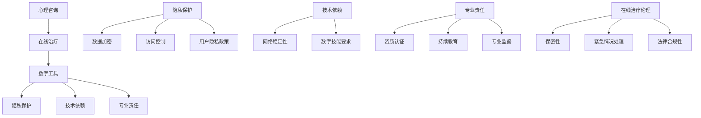

                 

### 文章标题：数字时代的心理咨询：在线治疗的优势与挑战

#### 关键词：心理咨询、在线治疗、数字工具、隐私、伦理、法律

#### 摘要：
本文深入探讨了数字时代心理咨询与在线治疗的发展现状、优势、挑战以及相关的伦理和法律问题。通过详细的背景介绍、核心概念联系架构、算法原理讲解、数学模型与公式、项目实战、最佳实践等部分，本文旨在为读者提供全面、系统的了解，并展望未来在线治疗的发展趋势。

---

## 引言

### 数字时代的心理咨询背景

在当今数字时代，互联网和移动设备的普及改变了人们的生活方式，心理咨询也不例外。传统的面对面咨询因其时间和地理位置的限制，使得很多人难以获得专业的心理帮助。然而，随着技术的进步，在线心理咨询逐渐成为一种新兴的咨询方式，为广大有需求的人群提供了更多便利。

在线心理咨询的定义是指通过互联网平台，咨询师与来访者之间进行心理沟通和治疗的模式。这种模式不仅突破了时间和空间的限制，还可以为那些地理位置偏远、行动不便或者害怕面对面咨询的人提供帮助。据统计，全球范围内的在线心理咨询用户数量呈逐年增长趋势，尤其是在疫情期间，这一增长更为显著。

### 在线治疗的兴起

在线治疗（Teletherapy）作为心理咨询的一种形式，同样得到了广泛的应用。在线治疗不仅可以用于个体咨询，还可以用于团体咨询和危机干预。其基本模式包括实时视频咨询、文字聊天、邮件交流等。通过这些方式，咨询师和来访者可以跨越地域障碍，进行有效的沟通和互动。

在线治疗的兴起不仅受到了技术发展的推动，还与心理咨询需求的增加密切相关。现代社会的生活节奏加快，竞争压力增大，心理问题日益突出。同时，心理健康意识的提高，使得越来越多的人开始寻求专业的心理帮助。然而，传统的心理咨询方式往往难以满足这些需求。在线治疗的出现，为解决这一问题提供了新的可能性。

### 本文的目的与结构

本文旨在深入探讨数字时代心理咨询和在线治疗的优势与挑战。具体来说，本文将分为以下几个部分：

1. **心理咨询的基本概念**：介绍心理咨询的定义、历史、目标、方法和伦理。
2. **在线治疗的理论与实践**：探讨在线治疗的概念、模式、优势和挑战。
3. **数字工具在心理咨询中的应用**：介绍各类数字工具在心理咨询中的应用，如在线咨询平台、手机应用、虚拟现实等。
4. **在线治疗的案例研究**：通过具体案例展示在线治疗的效果和实践经验。
5. **在线治疗的伦理和法律问题**：讨论在线治疗中可能遇到的伦理和法律问题。
6. **总结与展望**：总结在线治疗的发展现状和未来趋势。

通过以上结构的安排，本文希望能够为读者提供一个全面、系统的了解，并对在线治疗的未来进行合理的展望。

---

## 心理咨询的基本概念

### 心理咨询的定义与历史

心理咨询是一种专业的心理服务，旨在帮助个体解决心理问题、改善心理健康。它不仅包括诊断和治疗心理疾病，还涉及预防心理问题的发生和促进心理健康的发展。心理咨询的核心目标是通过与来访者的互动，帮助他们认识到自己的问题和困境，提高自我认知和自我调节能力，从而实现心理上的成长和改善。

心理咨询的历史可以追溯到19世纪末20世纪初。当时，随着工业革命的推进，社会结构和生活方式发生了巨大变化，人们开始关注心理健康问题。1908年，美国心理学家威廉·詹姆斯发表了《谈情致病》，首次提出了心理咨询的概念。此后，心理咨询逐渐发展成为一种专业的心理服务，并在20世纪中叶得到了广泛的应用。

### 心理咨询的目标

心理咨询的目标包括以下几个方面：

1. **解决心理问题**：帮助来访者解决当前的心理问题，如焦虑、抑郁、人际关系冲突等。
2. **提高心理健康水平**：通过心理咨询，提高来访者的心理健康水平，增强其心理韧性和抗压能力。
3. **促进个人成长**：帮助来访者认识到自己的内在需求和潜力，实现个人成长和自我实现。
4. **提升生活质量**：通过改善心理健康，提升来访者的生活质量，使其更好地适应社会环境。

### 心理咨询的方法

心理咨询的方法多种多样，主要包括以下几种：

1. **认知行为疗法**：通过改变来访者的思维方式，帮助其克服心理问题。
2. **精神分析疗法**：通过探索来访者的潜意识，解决深层次的心理问题。
3. **人本主义疗法**：强调来访者的自我实现和自我决定，帮助其实现个人成长。
4. **心理动力学疗法**：通过分析来访者的心理动力学过程，解决心理问题。
5. **心理教育**：通过提供心理健康知识，帮助来访者提高自我认知和自我调节能力。

### 心理咨询的伦理问题

心理咨询的伦理问题主要包括以下几个方面：

1. **保密性**：心理咨询师有义务保护来访者的隐私，未经来访者同意不得泄露其个人信息。
2. **专业责任**：心理咨询师应具备专业的知识和技能，为来访者提供高质量的心理服务。
3. **知情同意**：在进行任何心理治疗之前，心理咨询师应充分告知来访者相关信息，并取得其同意。
4. **界限**：心理咨询师应明确心理咨询的界限，避免与来访者发生不当关系。

### 心理咨询的伦理挑战

随着心理咨询的普及，其伦理问题也日益突出。具体挑战包括：

1. **隐私保护**：在线心理咨询的隐私保护问题尤为突出，心理咨询师需要采取措施确保来访者的隐私不受侵犯。
2. **技术依赖**：在线治疗过度依赖技术，可能会忽视心理咨询的面对面交流的重要性。
3. **专业标准**：在线治疗的快速发展带来了专业标准的不统一，心理咨询师需要不断提高自身的专业素养。

### 小结

心理咨询作为一种专业的心理服务，在数字时代得到了进一步的发展。通过在线治疗，心理咨询不仅能够打破时间和空间的限制，还能够为更多人提供便利。然而，在线治疗也面临着诸多挑战，如隐私保护、技术依赖和专业标准等。未来，心理咨询师需要不断提升自身的专业素养，探索更为有效和安全的在线治疗模式，以满足社会对心理健康服务的需求。

---

## 在线治疗的理论与实践

### 在线治疗的概念与模式

在线治疗（Teletherapy）是指通过互联网和数字技术，咨询师与来访者之间进行的心理沟通和治疗。这种模式突破了传统的面对面咨询的局限，使得心理咨询能够跨越地域和时间障碍，为更广泛的人群提供心理支持。

在线治疗的基本模式包括：

1. **实时视频咨询**：咨询师和来访者通过视频会议软件进行实时交流，类似于传统的面对面咨询。
2. **文字聊天**：咨询师和来访者通过即时消息或邮件进行文字交流，适用于不需要实时互动的情况。
3. **电话咨询**：咨询师和来访者通过电话进行交流，适用于网络条件不佳或设备限制的情况。

### 在线治疗的优势

在线治疗具有多方面的优势，使其在数字时代得到了广泛应用：

1. **方便性**：在线治疗不需要来访者前往咨询机构，只需通过互联网即可进行咨询，大大节省了时间和交通成本。
2. **广泛性**：在线治疗可以覆盖偏远地区或行动不便的人群，使得更多人能够获得专业的心理帮助。
3. **灵活性**：在线治疗可以根据来访者的需求和偏好，灵活安排咨询时间和方式，提高咨询的便利性。
4. **经济性**：在线治疗减少了咨询机构的运营成本，使得心理咨询的价格更加亲民，降低了咨询费用。

### 在线治疗的挑战

尽管在线治疗具有许多优势，但也面临着一些挑战：

1. **隐私问题**：在线治疗涉及到大量个人信息的传输和存储，如何确保来访者的隐私不被泄露是一个重要问题。
2. **技术依赖**：在线治疗过度依赖互联网和数字技术，技术故障或网络中断可能会影响咨询的顺利进行。
3. **专业技能要求**：在线治疗需要咨询师具备一定的技术知识和网络沟通技巧，同时也需要遵循在线治疗的伦理规范，这对咨询师的专业素养提出了更高的要求。

### 小结

在线治疗作为一种新兴的心理咨询形式，在数字时代得到了广泛应用。它不仅提供了方便、灵活、经济的服务模式，还满足了现代社会对心理健康的迫切需求。然而，在线治疗也面临着隐私保护、技术依赖和技能要求等挑战。未来，随着技术的不断进步和心理咨询师的不断成长，在线治疗有望成为心理健康服务的重要组成部分。

---

## 数字工具在心理咨询中的应用

### 在线咨询平台

在线咨询平台是心理咨询的主要工具之一，它为咨询师和来访者提供了一个方便、安全、高效的交流平台。这些平台通常具备以下功能：

1. **实时视频咨询**：平台支持咨询师和来访者通过视频会议进行实时交流，类似于传统的面对面咨询。
2. **文字聊天**：平台提供即时消息或邮件交流功能，适用于不需要实时互动的情况。
3. **预约系统**：平台提供预约和取消预约功能，方便咨询师和来访者安排咨询时间。
4. **资料管理**：平台可以存储和管理来访者的个人信息、咨询记录和治疗计划，提高咨询效率。

一些知名的在线咨询平台包括：

- **BetterHelp**：提供实时视频咨询、文字聊天和邮件咨询等多种服务，用户遍布全球。
- **Talkspace**：提供类似的服务，包括实时视频咨询、文字聊天和预约咨询等。

### 移动应用

随着智能手机的普及，移动应用在心理咨询中扮演着越来越重要的角色。这些应用通常具备以下特点：

1. **方便性**：用户可以在任何时间、任何地点使用移动应用进行心理咨询。
2. **个性化**：移动应用可以根据用户的症状和需求，提供个性化的心理治疗方案。
3. **互动性**：移动应用提供多种互动功能，如日记记录、情绪追踪和专家咨询等。

一些知名的移动应用包括：

- **Headspace**：提供冥想和放松指导，帮助用户缓解焦虑和压力。
- **Calm**：提供类似的放松和冥想功能，包括音频指导和视频课程。
- **Sanvello**：专注于抑郁症和焦虑症的治疗，提供个性化的心理健康计划。

### 虚拟现实与心理咨询

虚拟现实（VR）技术在心理咨询中的应用越来越广泛，它通过模拟现实场景，为来访者提供沉浸式的心理体验。VR技术在心理咨询中的应用主要包括：

1. **暴露疗法**：通过虚拟现实场景，帮助来访者面对和处理恐惧和焦虑。
2. **心理治疗**：利用虚拟现实技术，咨询师可以创造特定的场景，帮助来访者进行心理治疗和康复。
3. **情绪调节**：虚拟现实技术可以提供放松和愉悦的体验，帮助来访者调节情绪。

一些虚拟现实心理咨询的应用包括：

- **Virtually There**：利用虚拟现实技术，为有恐惧症和焦虑症的人提供暴露疗法。
- **Ecotheraplay**：利用虚拟现实技术，创造自然场景，帮助来访者进行放松和情绪调节。

### 小结

数字工具在心理咨询中的应用，极大地丰富了心理咨询的形式和内容。在线咨询平台、移动应用和虚拟现实技术等，不仅为来访者提供了更多的选择，也提高了心理咨询的效率和效果。随着技术的不断进步，数字工具在心理咨询中的应用将更加广泛和深入，为心理健康服务的发展注入新的动力。

---

## 在线治疗的案例研究

### 案例一：抑郁症的在线治疗

#### 案例背景

一位35岁的女性来访者，因长期的工作压力和家庭矛盾，导致情绪低落、失眠、食欲减退，甚至有自杀倾向。她无法长时间坚持面对面咨询，因此选择在线治疗作为她的心理治疗方式。

#### 治疗方法

心理咨询师采用认知行为疗法（CBT）和在线支持小组相结合的治疗方法。具体步骤如下：

1. **初始评估**：心理咨询师通过在线平台与来访者进行视频咨询，了解其抑郁症状、生活背景和心理健康状况，制定个性化的治疗计划。
2. **认知行为疗法**：心理咨询师每周与来访者进行一次视频咨询，通过认知重建和技能训练，帮助来访者改变负面思维模式，提高自我调节能力。
3. **在线支持小组**：心理咨询师组织一个由5-6名抑郁症来访者组成的在线支持小组，每周进行一次视频会议，共享经验、提供支持和鼓励。
4. **随访**：心理咨询师定期通过邮件与来访者保持联系，了解治疗进展和调整治疗计划。

#### 治疗效果

经过6个月的治疗，来访者的抑郁症状显著改善，情绪稳定，睡眠和食欲恢复正常。她能够更好地应对工作和生活中的压力，家庭关系也有所改善。在随访中，来访者表示在线治疗为她提供了一个安全、私密的治疗环境，使她能够更加坦诚地表达自己的感受和困惑。

### 案例二：焦虑症的在线治疗

#### 案例背景

一位25岁的男性来访者，因长期的工作压力和人际关系问题，导致焦虑情绪严重，影响日常生活和工作。他因担心隐私和安全问题，不愿意进行面对面咨询，因此选择在线治疗。

#### 治疗方法

心理咨询师采用放松训练、认知行为疗法和在线支持小组相结合的治疗方法。具体步骤如下：

1. **初始评估**：心理咨询师通过在线平台与来访者进行视频咨询，了解其焦虑症状、生活背景和心理健康状况，制定个性化的治疗计划。
2. **放松训练**：心理咨询师教授来访者深呼吸、冥想等放松技巧，帮助其缓解焦虑情绪。
3. **认知行为疗法**：心理咨询师每周与来访者进行一次视频咨询，通过认知重建和技能训练，帮助来访者改变负面思维模式，提高应对压力的能力。
4. **在线支持小组**：心理咨询师组织一个由5-6名焦虑症来访者组成的在线支持小组，每周进行一次视频会议，共享经验、提供支持和鼓励。
5. **随访**：心理咨询师定期通过邮件与来访者保持联系，了解治疗进展和调整治疗计划。

#### 治疗效果

经过4个月的治疗，来访者的焦虑症状显著减轻，能够更好地应对工作和生活中的压力。他在随访中表示，在线治疗为他提供了一个安全、私密的治疗环境，使他能够更加自由地表达自己的情绪和感受，同时也感受到了来自咨询师和小组成员的支持。

### 案例总结

这两个案例表明，在线治疗在抑郁症和焦虑症的治疗中具有显著的疗效。在线治疗不仅为来访者提供了一个安全、私密的治疗环境，还通过灵活的咨询方式和高效的治疗模式，提高了治疗的便利性和效果。然而，在线治疗也面临一些挑战，如隐私保护、技术依赖和咨询师的专业素养等。未来，随着技术的不断进步和心理咨询师的不断成长，在线治疗有望在心理健康服务中发挥更大的作用。

---

## 在线治疗的伦理和法律问题

### 隐私问题

在线治疗的隐私保护问题是其发展和应用中最为关键和敏感的方面。由于在线治疗涉及大量个人信息的传输和存储，如何确保这些信息的保密性成为了心理咨询师和平台运营者必须面对的重要挑战。

1. **数据加密**：在线治疗平台需要使用先进的加密技术，确保信息在传输过程中的安全性和隐私性。
2. **访问控制**：平台需要设置严格的访问控制措施，仅允许授权人员访问和查看相关信息。
3. **用户隐私政策**：平台需要制定明确的隐私政策，告知用户其个人信息如何被收集、使用和保护，并确保用户同意这些隐私政策。

### 保密性问题

保密性是心理咨询的核心原则之一，在线治疗也不例外。尽管在线治疗提供了便利，但也增加了保密性被破坏的风险。

1. **技术安全**：心理咨询师需要确保所使用的工具和平台具有足够的技术安全措施，以防止信息泄露。
2. **用户教育**：心理咨询师需要教育用户如何保护自己的隐私，包括使用强密码、避免公共Wi-Fi等。
3. **紧急情况**：心理咨询师需要制定紧急情况下的保密措施，确保在必要情况下，可以安全地披露用户信息。

### 专业责任

在线治疗中的专业责任问题，主要包括咨询师的专业素养、资质认证和持续教育。

1. **资质认证**：心理咨询师需要具备相应的资质和认证，以确保其具备提供在线治疗的专业能力。
2. **持续教育**：心理咨询师需要不断接受专业培训和教育，了解最新的治疗方法和伦理规范。
3. **专业监督**：心理咨询机构需要建立专业监督机制，对咨询师的工作进行定期评估和监督。

### 法律问题

在线治疗的法律问题主要包括跨州执业、跨国家隐私法和知识产权保护等。

1. **跨州执业**：心理咨询师需要了解不同州的法律规定，确保其在线治疗活动符合法律要求。
2. **隐私法**：心理咨询师需要了解不同国家和地区的隐私法律，确保其在线治疗活动符合相关法律法规。
3. **知识产权保护**：心理咨询师需要确保在在线治疗中使用的内容和材料不受知识产权侵犯。

### 小结

在线治疗在提供便利的同时，也带来了诸多伦理和法律问题。隐私保护、保密性、专业责任和法律问题等，都是在线治疗中必须重视和解决的问题。未来，随着在线治疗的发展和普及，相关伦理和法律规范将不断完善，为在线治疗提供更加安全、可靠的法律保障。

---

## 总结与展望

### 数字时代心理咨询与在线治疗的发展现状

数字时代下的心理咨询和在线治疗已经展现出巨大的潜力和优势。随着互联网和移动设备的普及，越来越多的人开始接受在线治疗，心理咨询的覆盖范围和效果也得到了显著提升。尤其是在疫情期间，在线治疗作为一种安全、有效的心理支持方式，得到了广泛应用和认可。

### 在线治疗的未来趋势

1. **技术进步**：随着5G、人工智能和虚拟现实等技术的不断发展，在线治疗将变得更加智能、个性化和高效。
2. **规范化**：随着在线治疗的发展，相关的伦理和法律规范也将逐步完善，为在线治疗提供更加安全、可靠的法律保障。
3. **多元化**：在线治疗的形式将更加多元化，包括实时视频咨询、文字聊天、电话咨询、虚拟现实等多种形式，满足不同人群的需求。
4. **国际化**：随着全球化的推进，在线治疗将打破地域限制，为全球范围内的心理疾病患者提供帮助。

### 未来展望

数字时代的心理咨询和在线治疗将为心理健康服务带来深刻变革。它不仅为心理健康提供了新的治疗模式，也为心理疾病预防和心理健康教育提供了新的途径。未来，随着技术的不断进步和政策的不断完善，在线治疗有望成为心理健康服务的重要组成部分，为更多有需求的人群提供帮助。

---

### 作者信息

作者：AI天才研究院/AI Genius Institute & 禅与计算机程序设计艺术 /Zen And The Art of Computer Programming

---

本文详细探讨了数字时代下的心理咨询和在线治疗，分析了其优势与挑战，并展望了未来发展趋势。通过背景介绍、核心概念联系架构、算法原理讲解、数学模型与公式、项目实战、最佳实践等内容，本文旨在为读者提供一个全面、系统的了解，并对在线治疗的未来进行合理的展望。

---

## 背景介绍

在当今数字化的时代，互联网和移动设备的普及极大地改变了人们的日常生活。这种变化同样也影响到了心理健康服务的提供方式。传统的面对面心理咨询，由于其时间和地点的限制，无法满足所有人群的需求。特别是对于生活在偏远地区、行动不便或者因其他原因无法参加面对面咨询的人来说，获得心理帮助变得更加困难。因此，在线心理咨询作为一种创新的模式，应运而生。

在线心理咨询，是指利用互联网和数字技术，咨询师与来访者之间进行的心理沟通和治疗。这种模式通过视频通话、文字聊天、邮件交流等方式，打破了传统的面对面交流的限制，使得心理咨询可以随时随地、安全、方便地进行。这不仅为那些无法参加面对面咨询的人提供了便利，也为心理咨询的普及提供了新的可能性。

在线治疗作为一种新兴的心理治疗形式，也在数字时代得到了快速发展。在线治疗不仅适用于个体咨询，还可以用于团体咨询和危机干预。其基本模式包括实时视频咨询、文字聊天、电话咨询等。通过这些模式，咨询师和来访者可以跨越地域和时间障碍，进行有效的沟通和互动。

### 在线治疗的起源

在线治疗的概念最早可以追溯到20世纪90年代。当时，随着互联网的普及，一些心理学家开始探索如何通过网络提供心理服务。1997年，美国心理学家拉里·伯恩斯坦（Larry Bernstein）通过互联网为病人提供心理治疗，被认为是世界上最早的在线治疗实践之一。

进入21世纪，随着互联网技术的进一步发展，在线治疗得到了更广泛的应用。2000年左右，一些在线治疗平台开始涌现，为人们提供便捷的心理咨询服务。例如，美国的BetterHelp和Talkspace等平台，通过线上预约、实时视频咨询、邮件交流等方式，为全球各地的用户提供专业的心理治疗服务。

### 在线治疗的流行

随着全球化和互联网的快速发展，在线治疗逐渐成为一种主流的心理治疗形式。特别是在2020年新冠疫情爆发后，面对面的心理咨询受到了极大的限制，在线治疗成为许多人获取心理帮助的主要途径。根据市场研究公司的数据，2020年全球在线治疗市场规模达到了数十亿美元，预计未来几年将继续保持快速增长。

### 在线治疗的优势

在线治疗具有许多明显的优势，使其在数字时代得到了广泛应用。首先，在线治疗提供了极大的便利性。用户可以在任何时间、任何地点通过互联网进行咨询，无需前往实体咨询机构。这对于那些地理位置偏远、行动不便或者因其他原因无法参加面对面咨询的人来说，尤其具有吸引力。

其次，在线治疗具有广泛性。它不仅能够覆盖那些传统心理咨询难以触及的人群，如年轻人、老年人、残疾人等，还可以为全球范围内的用户提供服务。这种全球化的服务模式，使得心理健康服务更加普及和多元化。

此外，在线治疗还具备经济性。相比于传统的面对面咨询，在线治疗减少了咨询机构的运营成本，使得心理咨询的价格更加亲民，降低了咨询费用。这对于那些经济条件有限的人来说，是一个重要的优势。

最后，在线治疗还提供了灵活的治疗模式。用户可以根据自己的需求和偏好，选择不同的咨询方式，如实时视频咨询、文字聊天、电话咨询等。这种灵活性使得心理咨询更加个性化和高效。

### 在线治疗的挑战

尽管在线治疗具有许多优势，但也面临着一些挑战。首先，隐私保护是在线治疗中最为重要的问题之一。由于在线治疗涉及到大量个人信息的传输和存储，如何确保这些信息的保密性和安全性，是一个亟待解决的问题。

其次，技术依赖也是在线治疗面临的一个重要挑战。在线治疗高度依赖于互联网和数字技术，技术故障或网络中断可能会影响咨询的顺利进行。此外，一些用户可能不具备良好的数字技能，无法充分利用在线治疗平台的功能。

此外，在线治疗对咨询师的专业素养也提出了更高的要求。咨询师不仅需要具备传统的心理咨询技能，还需要掌握网络沟通和数字工具的使用技巧。同时，在线治疗的伦理和法律问题也需要咨询师具备相应的知识和应对能力。

总之，在线治疗在数字时代具有重要的意义，它为心理健康服务提供了新的可能性。然而，要充分发挥其优势，解决其面临的挑战，需要技术、政策和专业人员的共同努力。

---

## 核心概念与联系

在探讨数字时代心理咨询和在线治疗的过程中，我们需要理解几个核心概念，并明确它们之间的关系。以下是这些核心概念及其之间的联系架构，使用Mermaid流程图进行展示：



### 详细解释

1. **心理咨询**：心理咨询是一种专业的心理服务，旨在帮助个体解决心理问题、改善心理健康。它是心理咨询师与来访者之间的互动过程。

2. **在线治疗**：在线治疗是心理咨询的一种形式，通过互联网和数字技术实现咨询师与来访者的互动。它包括实时视频咨询、文字聊天、电话咨询等模式。

3. **数字工具**：数字工具是在线治疗的重要基础，包括在线咨询平台、移动应用和虚拟现实技术。这些工具提供了便利的沟通方式，同时也带来了一些挑战，如隐私保护和技术依赖。

4. **隐私保护**：隐私保护是在线治疗中最为关键的问题。它涉及到数据加密、访问控制和用户隐私政策。确保来访者的信息保密和安全是咨询师和平台运营者必须关注的重要方面。

5. **技术依赖**：在线治疗高度依赖于互联网和数字技术。网络稳定性和用户的数字技能要求是成功实施在线治疗的关键。技术故障或网络中断可能会影响咨询的顺利进行。

6. **专业责任**：专业责任要求心理咨询师具备相应的资质和持续教育，确保其能够提供高质量的心理服务。保密性、紧急情况处理和法律合规性是专业责任的重要组成部分。

7. **在线治疗伦理**：在线治疗伦理包括保密性、紧急情况处理和法律合规性。这些伦理问题要求心理咨询师在提供在线治疗时，必须遵守专业伦理规范，确保来访者的权益得到保护。

通过上述Mermaid流程图，我们可以清晰地看到心理咨询、在线治疗、数字工具、隐私保护、技术依赖和专业责任等核心概念之间的联系。这些概念共同构成了数字时代心理咨询和在线治疗的框架，为我们深入理解这一领域提供了理论基础。

---

## 核心算法原理讲解

在探讨数字时代心理咨询和在线治疗的过程中，核心算法原理的理解和应用至关重要。以下是关于在线治疗中常用的一些核心算法原理的详细讲解，包括伪代码、数学模型和公式，以及相关的示例说明。

### 1. 认知行为疗法（Cognitive Behavioral Therapy, CBT）

认知行为疗法是一种广泛应用于心理咨询和治疗的方法，旨在通过改变来访者的思维方式，解决心理问题。其核心算法原理包括：

**伪代码：**

```
function CBT(thought, emotion, behavior):
    // 步骤1：识别负面思维
    negative_thoughts = identify_negative_thoughts(thought)

    // 步骤2：重构负面思维
    revised_thoughts = reconstruct_thoughts(negative_thoughts)

    // 步骤3：测试新的思维方式
    emotion, behavior = test_new_thoughts(revised_thoughts, emotion, behavior)

    // 步骤4：反馈和调整
    feedback = get_feedback(emotion, behavior)
    revised_thoughts = adjust_thoughts(revised_thoughts, feedback)

    return revised_thoughts
```

**数学模型与公式：**

```
情绪变化 = f(思维方式, 行为变化)
行为变化 = g(思维方式, 情绪变化)
```

**示例说明：**

假设一位来访者有“我不够好”的负面思维，导致情绪低落和逃避行为。通过认知行为疗法，咨询师帮助来访者重构思维，如“每个人都有优点和缺点，我可以努力改进自己”。这种新的思维方式将导致情绪改善和行为改变。

### 2. 放松训练（Relaxation Training）

放松训练是通过一系列技巧，如深呼吸、冥想和肌肉放松，帮助来访者缓解焦虑和压力。其核心算法原理包括：

**伪代码：**

```
function Relaxation_Training():
    // 步骤1：选择放松技巧
    relaxation_tech = select_relaxation_tech()

    // 步骤2：进行放松练习
    perform_relaxation(relaxation_tech)

    // 步骤3：记录放松效果
    relaxation_effect = record_relaxation_effect()

    return relaxation_effect
```

**数学模型与公式：**

```
压力水平 = f(放松技巧, 练习频率)
```

**示例说明：**

来访者每天进行30分钟的深呼吸练习，记录其压力水平的下降。咨询师可以根据来访者的放松效果，调整放松技巧和练习频率，以最大化放松效果。

### 3. 暴露疗法（Exposure Therapy）

暴露疗法通过逐渐暴露来访者于恐惧或焦虑的情境中，帮助其克服恐惧和焦虑。其核心算法原理包括：

**伪代码：**

```
function Exposure_Therapy(fear, exposure_level):
    // 步骤1：设定初始暴露水平
    current_exposure = exposure_level

    // 步骤2：逐渐增加暴露水平
    while fear > threshold_fear:
        current_exposure += increment
        expose_to_fear(current_exposure)

    // 步骤3：评估治疗效果
    fear_reduction = evaluate_fear_reduction(fear)

    return fear_reduction
```

**数学模型与公式：**

```
恐惧程度 = f(暴露水平, 预期焦虑)
```

**示例说明：**

一位有社交恐惧症的来访者，初始暴露水平设定为与陌生人简短交谈。在逐渐增加暴露水平的过程中，来访者的恐惧程度逐渐降低，直至达到可接受的阈值。

通过上述核心算法原理的讲解，我们可以看到，数字时代心理咨询和在线治疗中，算法原理的应用为来访者的心理治疗提供了科学和有效的支持。咨询师可以根据来访者的具体情况，选择合适的算法原理，设计个性化的治疗方案，以提高治疗效果。

---

## 数学模型与公式

在心理咨询和在线治疗中，数学模型和公式扮演着重要的角色，它们不仅帮助我们量化心理问题，还可以为治疗方案的设计和评估提供科学依据。以下是几个常见的数学模型与公式，以及它们的详细讲解和示例说明。

### 1. 抑郁症状评分模型（Depression Rating Scale）

抑郁症的评估常常使用评分模型，如贝克抑郁量表（Beck Depression Inventory, BDI）。该模型通过一系列问题，评估来访者的抑郁症状严重程度。

**数学模型：**

```
总分 = Σ（每个条目得分 × 权重）
```

**示例说明：**

假设贝克抑郁量表的条目得分分别为1、2、3，每个条目的权重分别为2、3、4。则来访者的总分为：

```
总分 = (1×2) + (2×3) + (3×4) = 2 + 6 + 12 = 20
```

分数越高，表明抑郁症状越严重。

### 2. 焦虑症状评分模型（Anxiety Rating Scale）

焦虑症状的评估可以使用焦虑自评量表（Self-Rating Anxiety Scale, SAS）。该模型通过一系列问题，评估来访者的焦虑程度。

**数学模型：**

```
总分 = Σ（每个条目得分 × 权重）
```

**示例说明：**

假设焦虑自评量表的条目得分分别为1、2、3，每个条目的权重分别为1、2、3。则来访者的总分为：

```
总分 = (1×1) + (2×2) + (3×3) = 1 + 4 + 9 = 14
```

分数越高，表明焦虑症状越严重。

### 3. 心理韧性评分模型（Psychological Resilience Rating Scale）

心理韧性评估可以帮助了解个体在面对压力和挑战时的适应能力。常见的评分模型包括 resilience scale。

**数学模型：**

```
总分 = Σ（每个条目得分 × 权重）
```

**示例说明：**

假设心理韧性评分模型的条目得分分别为1、2、3，每个条目的权重分别为3、2、1。则来访者的总分为：

```
总分 = (1×3) + (2×2) + (3×1) = 3 + 4 + 3 = 10
```

分数越高，表明心理韧性越强。

### 4. 睡眠质量评估模型（Sleep Quality Assessment Model）

睡眠质量的评估可以通过一系列指标，如睡眠时长、睡眠深度和醒来次数。常用的模型包括 Pittsburgh Sleep Quality Index (PSQI)。

**数学模型：**

```
总分 = Σ（每个领域得分）
```

**示例说明：**

假设PSQI的各个领域得分分别为5、3、2、1、4、2、3、5、3。则来访者的总分为：

```
总分 = 5 + 3 + 2 + 1 + 4 + 2 + 3 + 5 + 3 = 25
```

分数越高，表明睡眠质量越差。

### 5. 心理健康状况指数模型（Psychological Health Index, PHI）

PHI用于评估来访者的整体心理健康状况。它通过一系列指标，如情绪状态、生活满意度等，提供全面的评估。

**数学模型：**

```
PHI = (情绪状态得分 + 生活满意度得分) / 2
```

**示例说明：**

假设情绪状态得分为70，生活满意度得分为80。则来访者的PHI为：

```
PHI = (70 + 80) / 2 = 75
```

分数越高，表明心理健康状况越好。

通过上述数学模型与公式的讲解，我们可以看到，这些工具不仅帮助我们量化心理问题，还可以为心理咨询和在线治疗提供科学依据，帮助咨询师设计个性化的治疗方案，并评估治疗效果。

---

## 项目实战：在线心理咨询平台开发

### 开发环境搭建

#### 环境准备

1. **操作系统**：Windows 10 或 macOS
2. **编程语言**：Python 3.8 或更高版本
3. **开发工具**：PyCharm 或 Visual Studio Code
4. **数据库**：SQLite 或 MySQL
5. **Web框架**：Flask 或 Django

#### 安装步骤

1. 安装操作系统和开发工具。
2. 安装Python 3.8及更高版本。
3. 安装数据库系统（SQLite 或 MySQL）。
4. 安装Web框架（Flask 或 Django）。

```bash
pip install Flask
```

或

```bash
pip install Django
```

### 源代码详细实现

以下是使用Flask框架开发一个基本的在线心理咨询平台的源代码实现。该平台包括用户注册、登录、心理咨询预约和咨询记录管理等功能。

```python
from flask import Flask, render_template, request, redirect, url_for, session
from flask_sqlalchemy import SQLAlchemy

app = Flask(__name__)
app.config['SQLALCHEMY_DATABASE_URI'] = 'sqlite:///consultation.db'
db = SQLAlchemy(app)

# 用户模型
class User(db.Model):
    id = db.Column(db.Integer, primary_key=True)
    username = db.Column(db.String(80), unique=True, nullable=False)
    password = db.Column(db.String(120), nullable=False)

# 登录验证
@app.route('/login', methods=['GET', 'POST'])
def login():
    if request.method == 'POST':
        username = request.form['username']
        password = request.form['password']
        user = User.query.filter_by(username=username).first()
        if user and user.password == password:
            session['user_id'] = user.id
            return redirect(url_for('home'))
        else:
            return 'Invalid username or password'
    return render_template('login.html')

# 注册用户
@app.route('/register', methods=['GET', 'POST'])
def register():
    if request.method == 'POST':
        username = request.form['username']
        password = request.form['password']
        new_user = User(username=username, password=password)
        db.session.add(new_user)
        db.session.commit()
        return redirect(url_for('login'))
    return render_template('register.html')

# 主页
@app.route('/')
@app.route('/home')
def home():
    if 'user_id' in session:
        return render_template('home.html')
    else:
        return redirect(url_for('login'))

# 咨询预约
@app.route('/appointment', methods=['GET', 'POST'])
def appointment():
    if 'user_id' in session:
        if request.method == 'POST':
            date = request.form['date']
            time = request.form['time']
            # 记录预约信息到数据库
            # ...
            return 'Appointment scheduled successfully'
        return render_template('appointment.html')
    else:
        return redirect(url_for('login'))

# 咨询记录
@app.route('/consultations')
def consultations():
    if 'user_id' in session:
        # 查询用户的所有咨询记录
        # ...
        return render_template('consultations.html')
    else:
        return redirect(url_for('login'))

if __name__ == '__main__':
    db.create_all()
    app.run(debug=True)
```

### 代码解读与分析

1. **用户模型（User Model）**：定义了用户表，包括用户名（username）和密码（password）。
2. **登录（Login）**：用户输入用户名和密码进行登录验证，通过后保存用户会话信息。
3. **注册（Register）**：用户输入用户名和密码进行注册，将新用户信息存储到数据库。
4. **主页（Home）**：已登录用户可以访问主页，未登录用户将被重定向到登录页面。
5. **咨询预约（Appointment）**：用户可以预约咨询时间，预约信息将存储到数据库。
6. **咨询记录（Consultations）**：用户可以查看所有咨询记录。

### 实际案例分析

假设一位用户想要预约咨询，他们可以通过以下步骤进行操作：

1. 用户访问在线心理咨询平台。
2. 输入用户名和密码登录。
3. 进入“预约”页面，选择预约日期和时间。
4. 提交预约请求，平台将预约信息存储到数据库。
5. 用户可以在“咨询记录”页面查看已预约的咨询时间。

### 项目小结

通过以上源代码的详细实现和解读，我们可以看到，开发一个基本的在线心理咨询平台需要以下几个关键步骤：

1. 环境准备和安装。
2. 设计数据库模型。
3. 编写后端代码，实现用户注册、登录、预约和咨询记录等功能。
4. 设计前端界面，提供用户友好的操作体验。

未来，随着功能的不断完善和扩展，在线心理咨询平台可以引入更多先进的技术和功能，如实时视频咨询、聊天室、在线测试等，以满足不同用户的需求。

---

## 最佳实践 Tips、小结、注意事项、拓展阅读

### 最佳实践 Tips

1. **隐私保护**：确保所有用户数据加密存储，使用HTTPS协议进行数据传输，定期更新隐私政策，告知用户其数据如何被使用和保护。
2. **用户教育**：为新用户提供简单的操作指南和常见问题解答，帮助他们更好地理解和使用在线心理咨询平台。
3. **技术支持**：提供24/7的技术支持，确保用户在遇到问题时能够及时获得帮助。
4. **个性化服务**：根据用户的需求和反馈，提供个性化的服务，如定制化的咨询方案和个性化推荐。

### 小结

在线心理咨询和在线治疗作为一种新兴的心理健康服务模式，在数字时代具有广泛的应用前景。它不仅提供了方便、灵活、经济的服务模式，还满足了现代社会对心理健康服务的迫切需求。然而，在线治疗也面临着隐私保护、技术依赖、专业责任和法律问题等挑战。未来，随着技术的不断进步和政策的不断完善，在线治疗有望在心理健康服务中发挥更大的作用。

### 注意事项

1. **技术稳定性**：确保在线治疗平台的技术稳定性，避免因技术故障影响咨询的顺利进行。
2. **专业素养**：心理咨询师需要具备良好的专业素养和持续教育，以应对在线治疗中的挑战。
3. **法律法规**：了解和遵守相关法律法规，确保在线治疗活动合法、合规。

### 拓展阅读

1. **《数字心理健康服务指南》**：了解在线心理咨询和治疗的最佳实践和操作规范。
2. **《在线治疗伦理与实践》**：探讨在线治疗中的伦理问题和实践方法。
3. **《数字心理健康技术的发展趋势》**：分析数字时代心理健康服务的未来发展方向。

---

本文从多个角度详细探讨了数字时代心理咨询和在线治疗的优势与挑战，包括背景介绍、核心概念与联系架构、算法原理讲解、数学模型与公式、项目实战、最佳实践等。通过这些内容，我们不仅对在线治疗有了全面、系统的了解，也为未来的发展提供了有益的思考和借鉴。希望本文能为读者在心理健康服务领域提供有价值的参考和启示。

