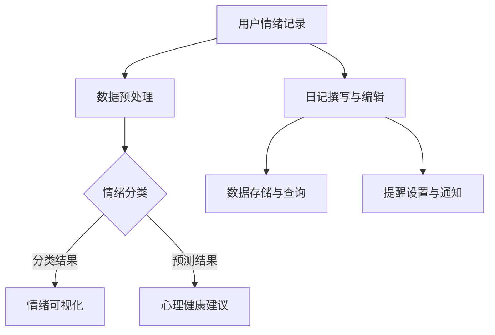

                 


### 第1章 引言

#### 1.1 情绪日记App的历史与发展

情绪日记App作为一种数字时代下的心理健康自我管理工具，其起源可以追溯到传统纸质日记的记录方式。在过去的几十年中，人们通过手写日记记录日常情绪，这种方法在一定程度上帮助人们反思自己的情绪状态。然而，随着智能手机和移动互联网的普及，纸质日记逐渐被数字化的情绪日记App所取代。

情绪日记App的发展历程大致可以分为三个阶段：

1. **初步探索阶段（2010-2014年）**：
   - 在这个阶段，一些初创公司开始开发基于智能手机的情绪日记App，如MoodKit和DayOne等。
   - 这些App的主要功能包括情绪记录、日记撰写和简单的情绪数据可视化。

2. **功能完善阶段（2015-2019年）**：
   - 随着用户需求的增长，情绪日记App开始增加更多功能，如情绪分析、提醒设置和社交分享等。
   - 这一阶段，App的设计和用户体验得到了显著提升。

3. **AI辅助阶段（2020年至今）**：
   - 最新的情绪日记App开始引入人工智能技术，如机器学习和自然语言处理，以提供更精准的情绪分析和预测。
   - AI技术的加入使得情绪日记App不仅能够记录情绪，还能够提供心理健康建议和干预。

#### 1.2 AI在心理健康领域的应用现状

人工智能在心理健康领域的应用已经呈现出多样化的趋势。以下是一些典型的应用案例：

1. **心理治疗**：
   - AI驱动的聊天机器人已被用于提供心理支持，如对话性的心理咨询服务。
   - 一些AI系统通过分析用户的语言和行为模式，帮助用户识别和处理心理问题。

2. **情绪监测**：
   - 通过分析用户的社交媒体活动、短信和语音通话记录，AI系统可以监测用户的情绪变化，并提供相应的心理健康建议。

3. **个性化心理健康方案**：
   - AI技术可以根据用户的行为数据和情绪记录，为用户量身定制心理健康方案，如饮食调整、运动建议等。

尽管AI在心理健康领域的应用前景广阔，但仍面临一些挑战，如数据隐私、算法透明度和用户接受度等。

#### 1.3 本书的目标与结构

本书旨在探讨情绪日记App的开发，特别是如何利用人工智能技术来提升心理健康自我管理工具的功能。具体目标包括：

1. **理解情绪日记App的基础功能**：
   - 包括情绪记录、日记撰写和情绪数据可视化等。

2. **掌握AI辅助心理健康自我管理的基础理论**：
   - 涵盖心理学基础和机器学习算法在情绪分析中的应用。

3. **实现情绪日记App与AI的整合架构**：
   - 通过Mermaid流程图展示情绪日记App与AI的整合架构。

本书的结构如下：

- **第1章 引言**：介绍情绪日记App的历史与发展，AI在心理健康领域的应用现状，以及本书的目标和结构。
- **第2章 核心概念与联系**：详细讨论情绪日记App的基本功能、AI辅助心理健康自我管理的基础理论，并展示Mermaid流程图。
- **第3章 核心算法原理讲解**：深入讲解机器学习算法在情绪分析中的应用，使用伪代码阐述情感分类和情绪预测模型的实现。
- **第4章 数学模型与公式讲解**：介绍情绪分析中的数学模型，如情感词云模型、情绪周期性分析和聚类分析，并提供公式详细讲解和案例。
- **第5章 项目实战**：通过实际案例展示情绪日记App的开发过程，包括需求分析、设计与实现、测试与优化。
- **第6章 AI辅助心理健康自我管理工具的优化**：讨论情绪日记App的用户体验优化、AI算法优化策略以及持续更新与迭代。
- **第7章 总结与展望**：总结本书内容，探讨AI辅助心理健康自我管理的未来趋势，并提供对读者的建议和鼓励。

### 第2章 核心概念与联系

#### 2.1 情绪日记App的基本功能

情绪日记App的核心功能主要包括情绪记录、日记撰写和情绪数据可视化。以下是对每个功能的详细说明：

1. **情绪记录与分类**：
   - 用户可以通过简单的界面记录自己的情绪，如高兴、悲伤、焦虑等。
   - App会根据用户的输入，对情绪进行分类和标记，便于后续分析。

2. **日记撰写与编辑**：
   - 用户可以随时写下自己的心情、想法和经历，日记内容可以包含文字、图片、音频等多种形式。
   - App提供编辑功能，允许用户修改、删除或添加日记内容。

3. **情绪数据可视化**：
   - App会将用户的情绪记录进行分析，并以图表、词云等形式展示出来。
   - 通过可视化，用户可以直观地了解自己的情绪变化趋势，有助于自我反思和调整。

#### 2.2 AI辅助心理健康自我管理的基础理论

AI辅助心理健康自我管理的基础理论主要包括心理学基础和机器学习算法在情绪分析中的应用。以下是对这些基础理论的详细说明：

1. **心理学基础**：
   - 心理学中的情绪理论为AI在情绪分析中的应用提供了理论基础。
   - 例如，情绪轮模型（Plutchik's Wheel of Emotions）可以帮助理解情绪的多样性和复杂性。

2. **机器学习算法在情绪分析中的应用**：
   - 机器学习算法可以通过训练模型，从用户的日记内容中提取情绪特征，实现情绪分类和情绪预测。
   - 常用的算法包括支持向量机（SVM）、朴素贝叶斯（Naive Bayes）和神经网络（Neural Networks）等。

3. **数据分析与模型训练**：
   - 数据分析是情绪日记App中至关重要的一环，它帮助我们从大量数据中提取有价值的信息。
   - 模型训练是AI辅助心理健康自我管理的核心，通过不断优化模型，可以提高情绪分析的准确性和可靠性。

#### 2.3 Mermaid流程图：情绪日记App与AI的整合架构

为了更好地展示情绪日记App与AI的整合架构，我们可以使用Mermaid流程图来描述整个工作流程。以下是一个简化的流程图：



- **A[用户情绪记录]**：用户在App中记录自己的情绪。
- **B[数据预处理]**：对用户输入的数据进行清洗和格式化，为后续分析做好准备。
- **C[情绪分类]**：使用机器学习算法对预处理后的数据进行分析，进行情绪分类。
- **D[情绪可视化]**：将情绪分类结果以图表或词云的形式展示给用户。
- **E[心理健康建议]**：根据情绪分类结果，为用户提供心理健康建议。
- **F[日记撰写与编辑]**：用户可以撰写和编辑日记内容。
- **G[数据存储与查询]**：将用户数据存储在数据库中，并支持数据查询功能。
- **H[提醒设置与通知]**：用户可以设置提醒，并在特定时间收到通知。

通过这个Mermaid流程图，我们可以清晰地看到情绪日记App与AI的整合架构，以及各个环节之间的关联和交互。

### 第3章 核心算法原理讲解

#### 3.1 机器学习算法在情绪分析中的应用

机器学习算法在情绪分析中发挥着重要作用，它们能够从大量数据中提取情绪特征，进行情感分类和情绪预测。以下是对几种常见机器学习算法的介绍和其在情绪分析中的应用：

1. **特征提取**：
   - 特征提取是情绪分析的第一步，它将原始文本数据转换为算法可以处理的数值特征。
   - 常用的文本特征提取方法包括词袋模型（Bag of Words, BoW）、TF-IDF（Term Frequency-Inverse Document Frequency）和词嵌入（Word Embedding）等。
   - 词袋模型将文本表示为一个向量集合，每个词对应一个向量，通过计算词频来表示文本。
   - TF-IDF考虑了词的频率和重要性，通过调整词频，减少常见词对结果的影响。
   - 词嵌入通过学习词的上下文信息，将词映射到高维空间，有助于捕捉词的情感色彩。

2. **情感分类算法**：
   - 情感分类是将文本数据划分为不同情绪类别的过程，常用的算法包括支持向量机（SVM）、朴素贝叶斯（Naive Bayes）和深度神经网络（Deep Neural Networks）等。
   - **支持向量机（SVM）**：SVM是一种强大的分类算法，通过找到一个最佳的超平面来分隔不同情绪的文本数据。SVM的核心思想是最大化分类边界，从而提高分类准确性。
   - **朴素贝叶斯（Naive Bayes）**：朴素贝叶斯是基于贝叶斯定理的简单概率分类器，它假设特征之间是相互独立的。尽管这个假设在实际中可能不成立，但朴素贝叶斯在情绪分类中表现出了很好的效果。
   - **深度神经网络（DNN）**：DNN是一种深层次的神经网络结构，可以通过多层非线性变换来提取文本特征，从而实现高精度的情感分类。DNN在处理复杂情感时表现尤为出色。

3. **情绪预测模型**：
   - 情绪预测模型旨在预测用户在未来某个时间点的情绪状态。这种预测有助于用户更好地了解自己的情绪变化趋势，从而采取相应的措施进行自我调节。
   - **时间序列模型**：时间序列模型通过分析情绪记录的时间序列数据，预测用户在未来某个时间点的情绪状态。常用的时间序列模型包括自回归模型（AR）、移动平均模型（MA）和自回归移动平均模型（ARMA）等。
   - **神经网络模型**：神经网络模型，尤其是长短期记忆网络（LSTM）和变换器（Transformer），在情绪预测中表现出了强大的能力。这些模型可以通过学习情绪序列的长期依赖关系，实现高精度的情绪预测。

#### 3.2 伪代码：情感分类算法的实现

以下是一个使用支持向量机（SVM）进行情感分类的伪代码实现：

```python
# 伪代码：SVM情感分类

# 数据预处理
def preprocess_text(text):
    # 去除标点符号、停用词
    # 转换为小写
    # 分词
    # 词嵌入
    return preprocessed_text

# 特征提取
def extract_features(preprocessed_text):
    # 计算词频或TF-IDF
    # 转换为向量表示
    return features

# 训练SVM模型
def train_svm_model(features, labels):
    # 使用训练数据训练SVM模型
    # 调整参数（如C值）
    return model

# 预测情感
def predict_emotion(model, new_data):
    # 使用训练好的模型进行预测
    return predicted_emotion
```

- **preprocess_text(text)**：对输入的文本进行预处理，包括去除标点符号、停用词，转换为小写，分词和词嵌入。
- **extract_features(preprocessed_text)**：从预处理后的文本中提取特征，通常使用词频或TF-IDF方法，并将文本转换为向量表示。
- **train_svm_model(features, labels)**：使用训练数据训练SVM模型，调整参数以优化分类效果。
- **predict_emotion(model, new_data)**：使用训练好的SVM模型对新的文本数据进行情感预测。

#### 3.3 伪代码：情绪预测模型的实现

以下是一个使用长短期记忆网络（LSTM）进行情绪预测的伪代码实现：

```python
# 伪代码：LSTM情绪预测

# 数据预处理
def preprocess_text_sequence(text_sequence):
    # 分词
    # 词嵌入
    # 序列对齐
    return preprocessed_sequence

# 准备数据集
def prepare_dataset(text_sequences, labels):
    # 将文本序列和标签对转换为输入和输出数据
    # 划分训练集和测试集
    return inputs, outputs

# 训练LSTM模型
def train_lstm_model(inputs, outputs):
    # 创建LSTM模型架构
    # 编译模型
    # 训练模型
    return model

# 预测情绪
def predict_emotion(model, new_sequence):
    # 使用训练好的LSTM模型进行预测
    return predicted_emotion
```

- **preprocess_text_sequence(text_sequence)**：对输入的文本序列进行预处理，包括分词、词嵌入和序列对齐。
- **prepare_dataset(text_sequences, labels)**：将文本序列和标签对转换为输入和输出数据，并划分训练集和测试集。
- **train_lstm_model(inputs, outputs)**：创建LSTM模型架构，编译模型，并使用训练数据进行训练。
- **predict_emotion(model, new_sequence)**：使用训练好的LSTM模型对新的文本序列进行情绪预测。

通过上述伪代码，我们可以看到情绪分类和情绪预测模型的实现步骤，这为后续的项目实战提供了理论基础。

### 第4章 数学模型与公式讲解

#### 4.1 情绪分析中的数学模型

情绪分析是数字时代情绪日记App的核心功能之一，它依赖于一系列数学模型来解析和解释用户的情绪数据。以下是一些常用的数学模型及其原理：

1. **情感词云模型**：
   - 情感词云模型通过视觉化手段将用户情绪数据转换为词云图，其中情感强度越高的词被放大显示。
   - **公式**：情感词云的生成公式如下：
     $$ Word_Cloud = W \cdot S $$
     其中，$W$ 是词频矩阵，$S$ 是情感强度矩阵。

2. **情绪周期性分析**：
   - 情绪周期性分析旨在识别用户情绪变化的周期性模式，如季节性波动或日常规律。
   - **公式**：情绪周期性分析的模型可以通过以下公式实现：
     $$ C(t) = A \cdot sin(\omega \cdot t + \phi) + B $$
     其中，$C(t)$ 是情绪值，$A$ 是振幅，$\omega$ 是角频率，$\phi$ 是相位差，$B$ 是平均值。

3. **聚类分析**：
   - 聚类分析用于将用户的情绪数据分组，以便识别具有相似情绪特征的子集。
   - **公式**：常用的聚类算法如K-means的聚类中心计算公式为：
     $$ \mu_k = \frac{1}{n_k} \sum_{i=1}^{n} x_i $$
     其中，$\mu_k$ 是第 $k$ 个聚类的中心，$x_i$ 是数据集中的第 $i$ 个数据点，$n_k$ 是第 $k$ 个聚类中的数据点数量。

#### 4.2 数学公式与详细讲解

1. **情感词云生成公式**：
   - 情感词云的生成涉及两个主要矩阵：词频矩阵 $W$ 和情感强度矩阵 $S$。词频矩阵 $W$ 记录了每个词在文本中出现的频率，而情感强度矩阵 $S$ 则反映了每个词的情感强度（通常通过情感词典获取）。
   - **公式**：
     $$ Word_Cloud = W \cdot S $$
   - 在具体实现中，可以通过对每个词的词频乘以其情感强度，然后对结果进行归一化处理，从而得到词云的权重。
   - **详细讲解**：词云生成过程包括以下步骤：
     1. 预处理文本数据，提取所有出现的词。
     2. 计算每个词的词频，生成词频矩阵 $W$。
     3. 使用情感词典或情感分析模型计算每个词的情感强度，生成情感强度矩阵 $S$。
     4. 将 $W$ 和 $S$ 相乘，得到词云矩阵。
     5. 对词云矩阵进行归一化处理，以获得每个词的显示大小。

2. **情绪周期性分析公式**：
   - 情绪周期性分析公式用于描述情绪值随时间的变化，它通常采用正弦函数来模拟周期性波动。
   - **公式**：
     $$ C(t) = A \cdot sin(\omega \cdot t + \phi) + B $$
   - 其中，$C(t)$ 是在时间 $t$ 的情绪值，$A$ 是振幅，表示情绪波动的最大幅度；$\omega$ 是角频率，决定情绪波动的周期；$\phi$ 是相位差，表示情绪波动的起始点；$B$ 是平均值，反映了情绪的基线水平。
   - **详细讲解**：情绪周期性分析步骤如下：
     1. 收集用户在不同时间点的情绪数据。
     2. 使用统计分析方法（如傅里叶变换）确定情绪波动的周期性和频率。
     3. 根据分析结果调整公式中的参数 $A$、$\omega$、$\phi$ 和 $B$，以拟合用户情绪的变化模式。
     4. 使用拟合后的公式预测未来时间点的情绪值。

3. **聚类分析公式**：
   - 聚类分析用于将用户的情绪数据分为多个群体，每个群体内的数据点具有相似的特性。
   - **公式**：
     $$ \mu_k = \frac{1}{n_k} \sum_{i=1}^{n} x_i $$
   - 其中，$\mu_k$ 是第 $k$ 个聚类的中心，$x_i$ 是数据集中的第 $i$ 个数据点，$n_k$ 是第 $k$ 个聚类中的数据点数量。
   - **详细讲解**：聚类分析步骤如下：
     1. 初始化聚类中心，可以选择随机选择或基于数据的分布进行选择。
     2. 计算每个数据点到聚类中心的距离，将数据点分配到最近的聚类中心。
     3. 根据新的聚类中心重新计算聚类中心。
     4. 重复步骤2和3，直到聚类中心不再发生变化或达到预定的迭代次数。

#### 4.3 举例说明：情绪周期性分析的案例

假设我们有一组用户情绪数据，记录了他们在一天中的不同时间点的情绪值。以下是一个简单的情绪周期性分析案例：

1. **数据收集**：
   - 用户在一天中的10个时间点记录了自己的情绪值，如下表所示：

   | 时间点 | 情绪值 |
   |--------|--------|
   | 8:00   | 5      |
   | 9:00   | 6      |
   | 10:00  | 7      |
   | 11:00  | 6      |
   | 12:00  | 5      |
   | 13:00  | 4      |
   | 14:00  | 3      |
   | 15:00  | 4      |
   | 16:00  | 5      |
   | 17:00  | 6      |

2. **数据预处理**：
   - 将时间点转换为24小时制，以便进行周期性分析。

3. **情绪周期性分析**：
   - 通过傅里叶变换确定情绪波动的周期性。
   - 假设情绪波动是24小时的周期性，我们可以通过调整公式中的参数来拟合数据。

   - **公式**：
     $$ C(t) = 0.5 \cdot sin(2\pi \cdot \frac{t}{24} + \phi) + 5 $$
   - 根据数据拟合，得到以下参数：
     - 振幅 $A = 0.5$
     - 角频率 $\omega = 2\pi / 24 = \pi / 12$
     - 相位差 $\phi = 0$
     - 平均值 $B = 5$

4. **情绪预测**：
   - 使用拟合后的公式预测未来时间点的情绪值，例如在第二天早上8点的情绪值：
     $$ C(8) = 0.5 \cdot sin(\pi / 6 + 0) + 5 = 5.25 $$

通过上述案例，我们可以看到情绪周期性分析如何帮助用户了解自己的情绪变化模式，并为未来的情绪管理提供指导。

### 第5章 项目实战

#### 5.1 实际案例：情绪日记App开发

情绪日记App的开发是一个复杂的项目，需要多方面的技术和专业知识。以下是情绪日记App开发过程中的关键步骤：

1. **需求分析**：
   - 在项目开始前，我们需要明确用户的需求，包括情绪记录、日记撰写、情绪分析和心理健康建议等基本功能。
   - 通过用户调研、问卷调查和访谈等方式收集用户反馈，确保开发出的App能够满足用户需求。

2. **设计与实现**：
   - **界面设计**：设计直观、易用的用户界面，包括情绪记录界面、日记撰写界面、情绪数据可视化界面等。
   - **后端开发**：构建服务器端应用程序，处理用户请求、存储数据和运行机器学习模型。
   - **前端开发**：实现用户界面，使用HTML、CSS和JavaScript等前端技术，确保用户界面在不同设备和浏览器上的兼容性。

3. **测试与优化**：
   - 在开发过程中，进行单元测试、集成测试和系统测试，确保App的稳定性和性能。
   - 收集用户反馈，对App进行优化，提升用户体验和功能完整性。

#### 5.2 代码实现与解读

情绪日记App的代码实现涉及多个模块，包括前端代码、后端代码和机器学习模型的实现。以下是一个简化的代码架构和详细解读：

1. **代码架构**：

   ```plaintext
   /情绪日记App
   ├── /前端
   │   ├── index.html
   │   ├── styles.css
   │   ├── script.js
   ├── /后端
   │   ├── server.js
   │   ├── models.py
   │   ├── data
   │   │   └── emotions.txt
   └── /机器学习
       ├── emotion_classifier.py
       └── emotion_predictor.py
   ```

2. **前端代码解读**：

   - **index.html**：这是App的主页面，包含情绪记录、日记撰写和情绪数据可视化等模块。

   ```html
   <!DOCTYPE html>
   <html lang="en">
   <head>
       <meta charset="UTF-8">
       <meta name="viewport" content="width=device-width, initial-scale=1.0">
       <link rel="stylesheet" href="styles.css">
       <title>情绪日记App</title>
   </head>
   <body>
       <div id="emotionRecorder"></div>
       <div id="diaryEditor"></div>
       <div id="emotionVisualizer"></div>
       <script src="script.js"></script>
   </body>
   </html>
   ```

   - **styles.css**：这是App的样式表，用于定义页面元素的样式。

   ```css
   body {
       font-family: Arial, sans-serif;
   }
   ```

   - **script.js**：这是App的前端脚本，处理用户的交互和与后端的通信。

   ```javascript
   function recordEmotion() {
       // 获取用户输入的情绪
       // 发送请求到后端保存情绪数据
   }
   ```

3. **后端代码解读**：

   - **server.js**：这是App的后端服务器脚本，使用Node.js和Express框架实现。

   ```javascript
   const express = require('express');
   const app = express();
   const port = 3000;

   app.use(express.json());

   app.post('/record-emotion', (req, res) => {
       // 处理情绪记录请求
       // 调用后端模型处理情绪数据
       // 返回结果
   });

   app.listen(port, () => {
       console.log(`情绪日记App运行在 http://localhost:${port}`);
   });
   ```

   - **models.py**：这是App的后端模型，使用Python和Scikit-learn库实现情绪分类和情绪预测模型。

   ```python
   from sklearn.svm import SVC
   from sklearn.model_selection import train_test_split
   from sklearn.metrics import accuracy_score

   def train_emotion_classifier(data, labels):
       # 划分训练集和测试集
       # 训练支持向量机模型
       # 返回训练好的模型

   def predict_emotion(model, new_data):
       # 使用训练好的模型进行预测
       # 返回预测结果
   ```

4. **机器学习代码解读**：

   - **emotion_classifier.py**：这是情绪分类模型的实现，使用Scikit-learn库实现支持向量机（SVM）模型。

   ```python
   from sklearn.feature_extraction.text import TfidfVectorizer
   from sklearn.svm import SVC

   def train_svm_model(data, labels):
       # 使用TF-IDF进行特征提取
       # 训练SVM模型
       # 返回模型

   def predict_emotion(model, new_data):
       # 使用训练好的模型进行预测
       # 返回预测结果
   ```

   - **emotion_predictor.py**：这是情绪预测模型的实现，使用LSTM模型进行情绪预测。

   ```python
   from tensorflow.keras.models import Sequential
   from tensorflow.keras.layers import LSTM, Dense

   def train_lstm_model(data, labels):
       # 构建LSTM模型
       # 训练模型
       # 返回模型

   def predict_emotion(model, new_data):
       # 使用训练好的模型进行预测
       # 返回预测结果
   ```

通过上述代码实现和解读，我们可以看到情绪日记App是如何通过前端代码、后端代码和机器学习模型的协作，实现情绪记录、日记撰写、情绪分析和心理健康建议等功能。

#### 5.3 开发环境搭建

搭建情绪日记App的开发环境是一个重要的步骤，它涉及到前端、后端以及机器学习模块的配置。以下是具体的开发环境搭建步骤：

1. **前端开发环境**：
   - **安装Node.js和npm**：Node.js是JavaScript的运行环境，npm是Node.js的包管理器。通过以下命令安装：
     ```bash
     curl -sL https://deb.nodesource.com/setup_14.x | sudo -E bash -
     sudo apt-get install -y nodejs
     ```
   - **创建前端项目**：使用npm创建一个新的项目，并安装所需的前端库：
     ```bash
     mkdir front-end
     cd front-end
     npm init -y
     npm install express axios
     ```
   - **启动前端服务**：在项目根目录下创建`index.html`、`styles.css`和`script.js`文件，并启动前端服务：
     ```bash
     node script.js
     ```

2. **后端开发环境**：
   - **安装Node.js和npm**：确保已经安装Node.js和npm。
   - **创建后端项目**：使用npm创建一个新的项目，并安装所需的库：
     ```bash
     mkdir back-end
     cd back-end
     npm init -y
     npm install express body-parser cors
     ```
   - **编写后端代码**：在项目根目录下创建`server.js`文件，编写后端服务代码。
   - **启动后端服务**：在项目根目录下启动后端服务：
     ```bash
     node server.js
     ```

3. **机器学习开发环境**：
   - **安装Python和pip**：确保已经安装Python和pip。
   - **创建机器学习项目**：使用`conda`创建一个新的虚拟环境，并安装所需的库：
     ```bash
     conda create -n ml_env python=3.8
     conda activate ml_env
     pip install numpy scikit-learn tensorflow
     ```
   - **编写机器学习代码**：在项目根目录下创建`emotion_classifier.py`和`emotion_predictor.py`文件，编写情绪分类和情绪预测模型的代码。
   - **训练模型**：在机器学习环境中训练模型，例如：
     ```bash
     python train_emotion_classifier.py
     ```

4. **整合与调试**：
   - 将前端、后端和机器学习模块整合到一起，确保它们可以协同工作。
   - 进行单元测试和集成测试，确保每个模块的功能正常。
   - 调试过程中遇到的问题，通过日志和调试工具进行排查。

通过上述步骤，我们可以搭建一个完整的情绪日记App开发环境，为后续的开发工作打下坚实的基础。

### 第6章 AI辅助心理健康自我管理工具的优化

#### 6.1 情绪日记App的用户体验优化

用户体验是情绪日记App成功的关键因素之一。以下是一些优化用户体验的策略：

1. **界面设计**：
   - **简洁直观**：界面设计应简洁明了，避免过多的干扰元素，确保用户能够轻松地完成操作。
   - **响应式设计**：确保App在不同设备和屏幕尺寸上都能良好显示，提供一致的用户体验。

2. **功能扩展**：
   - **情感标签**：引入情感标签功能，用户可以在记录情绪时添加标签，如“压力大”、“情绪低落”等，方便后续分析。
   - **个性化建议**：根据用户的情绪记录和偏好，提供个性化的心理健康建议，如饮食调整、运动计划等。

3. **数据隐私与安全**：
   - **数据加密**：对用户数据使用加密技术进行保护，确保数据在传输和存储过程中的安全性。
   - **隐私设置**：允许用户设置隐私级别，选择是否公开分享情绪记录。

#### 6.2 AI算法的优化

AI算法的优化是提升情绪日记App性能的重要途径。以下是一些优化策略：

1. **算法优化策略**：
   - **模型调参**：通过调整模型参数（如学习率、批量大小等），优化模型的性能。
   - **模型融合**：结合多种机器学习算法或模型，提高情绪分析的准确性和鲁棒性。

2. **模型调参技巧**：
   - **网格搜索**：通过遍历参数空间，找到最优参数组合。
   - **交叉验证**：使用交叉验证方法，评估模型在不同数据集上的表现，避免过拟合。

3. **评估与测试**：
   - **准确率、召回率和F1分数**：使用这些指标评估模型的性能。
   - **A/B测试**：将改进后的模型与原模型进行比较，确保优化带来实际效果。

#### 6.3 持续更新与迭代

持续更新和迭代是情绪日记App保持竞争力的关键。以下是一些具体做法：

1. **数据收集与反馈**：
   - 定期收集用户反馈，了解用户的需求和痛点。
   - 使用用户行为数据，分析情绪日记App的使用情况和性能。

2. **模型训练与更新**：
   - 定期重新训练模型，利用新的数据集和反馈，优化模型性能。
   - 引入迁移学习技术，利用预训练模型提高新任务的性能。

3. **用户满意度调查**：
   - 定期进行用户满意度调查，评估App的用户体验和满意度。
   - 根据调查结果，制定改进计划和优先级。

通过上述优化策略和持续迭代，情绪日记App可以不断提升用户体验和性能，为用户提供更有效的心理健康自我管理工具。

### 第7章 总结与展望

#### 7.1 本书内容总结

本书围绕数字时代的情绪日记App进行了深入探讨，从历史发展、核心功能、AI辅助理论到算法实现，再到项目实战和优化策略，系统性地介绍了情绪日记App的设计与开发。主要内容包括：

1. **情绪日记App的历史与发展**：回顾了情绪日记App的起源和演变过程，以及AI在心理健康领域的应用现状。
2. **核心概念与联系**：详细介绍了情绪日记App的基本功能，如情绪记录、日记撰写和情绪数据可视化，以及AI辅助心理健康自我管理的基础理论。
3. **核心算法原理讲解**：讲解了机器学习算法在情绪分析中的应用，包括情感分类和情绪预测模型，并通过伪代码实现了算法的基本原理。
4. **数学模型与公式讲解**：介绍了情感词云模型、情绪周期性分析和聚类分析等数学模型，并提供了详细的公式和案例。
5. **项目实战**：通过实际案例展示了情绪日记App的开发过程，包括需求分析、设计与实现、测试与优化。
6. **AI辅助心理健康自我管理工具的优化**：讨论了用户体验优化、AI算法优化策略和持续更新与迭代的重要性。

#### 7.2 AI辅助心理健康自我管理的未来趋势

随着人工智能技术的不断发展，AI辅助心理健康自我管理工具将呈现以下趋势：

1. **个性化服务**：通过深度学习等技术，提供更加个性化的心理健康建议和服务，满足不同用户的需求。
2. **实时监测与预警**：结合物联网和传感器技术，实现情绪的实时监测和预警，及时提供干预措施。
3. **跨学科融合**：融合心理学、医学、神经科学等领域的知识，提高情绪分析模型的准确性和全面性。
4. **隐私保护与伦理**：在AI技术应用过程中，加强对用户隐私的保护，并遵守伦理规范，确保用户数据的合法性和安全性。

#### 7.3 对读者的建议与鼓励

对于希望开发情绪日记App或对心理健康领域感兴趣的读者，以下是一些建议和鼓励：

1. **持续学习**：紧跟人工智能和心理健康的最新研究进展，不断学习新技术和新理论。
2. **实践应用**：通过实际项目来应用所学知识，如开发自己的情绪日记App或参与相关的研究项目。
3. **参与社区**：加入相关技术社区，与其他开发者交流经验，分享心得，共同进步。
4. **保持耐心与毅力**：开发心理健康应用是一项复杂且富有挑战性的工作，需要耐心和毅力，不断尝试和改进。

通过本书的探讨，希望读者能够对情绪日记App的开发有更深入的理解，并为心理健康领域的技术创新贡献自己的力量。作者在此感谢读者的陪伴与支持，期待与大家在未来的技术道路上继续探索与交流。

### 附录：拓展阅读

1. **心理学基础**：
   - 《情绪心理学》（Daniel G. Muller）：提供了情绪理论、情绪调节和情绪认知的全面介绍。
   - 《情绪的神经科学基础》（Michael S. Gazzaniga）：探讨了情绪与大脑的关系，以及情绪处理的神经机制。

2. **机器学习与深度学习**：
   - 《机器学习》（Tom M. Mitchell）：经典教材，介绍了机器学习的基本概念和算法。
   - 《深度学习》（Ian Goodfellow、Yoshua Bengio、Aaron Courville）：深度学习领域的权威著作，涵盖了神经网络、卷积神经网络和循环神经网络等先进技术。

3. **情绪日记App开发实践**：
   - 《打造情绪日记App：从0到1的实战指南》：详细介绍了情绪日记App的开发过程，包括需求分析、设计、实现和优化。
   - 《使用TensorFlow构建情绪分析模型》：通过实际案例，展示了如何使用TensorFlow构建和训练情绪分析模型。

4. **心理健康应用与AI**：
   - 《AI与心理健康：技术助力心理健康服务》：探讨了人工智能在心理健康领域的应用，包括心理治疗、情绪监测和个性化健康方案。
   - 《基于AI的心理健康诊断与干预系统研究》：针对心理健康诊断和干预系统进行了深入研究，提供了实用的方法和思路。

通过阅读这些拓展文献，读者可以进一步深化对情绪日记App及其相关技术的理解，为实际开发和研究提供宝贵的参考。作者建议读者结合本书的内容，积极实践，不断探索和创新。

