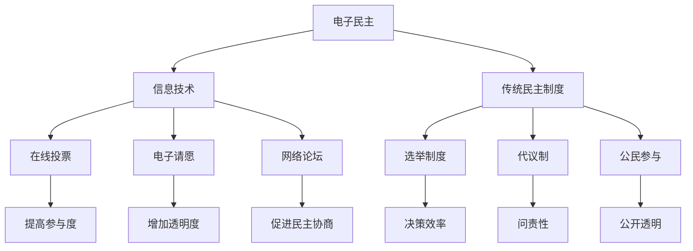

                 


### 《数字时代的政治参与：电子民主与传统民主制度的结合》

> 关键词：电子民主、传统民主、政治参与、民主制度、技术融合、案例分析

> 摘要：本文探讨数字时代下电子民主与传统民主制度的结合，分析两者的概念、优势、挑战及实践案例。通过深入解析两者的融合机制，本文旨在为数字时代下的政治参与提供理论依据和实践指导。

## 目录

1. 引言
2. 电子民主概述
   - 电子民主的概念
   - 电子民主的发展历程
   - 电子民主的核心特点
3. 传统民主制度概述
   - 传统民主制度的概念
   - 传统民主制度的基本原理
   - 传统民主制度的优缺点
4. 电子民主与传统民主的结合
   - 结合的必要性
   - 结合的形式与途径
   - 结合的优势分析
   - 结合的挑战与应对策略
5. 案例分析
   - 案例选择标准
   - 案例分析一：美国电子投票系统的应用
   - 案例分析二：欧洲议会的电子民主实践
   - 案例分析三：发展中国家电子民主的探索
6. 结论与展望
   - 全书总结
   - 电子民主与传统民主结合的未来展望
   - 研究方向与建议

## 1. 引言

在数字时代，信息技术的高速发展深刻地影响着社会的各个方面，政治参与也不例外。电子民主作为一种新兴的民主形式，逐渐与传统民主制度相结合，为公民提供更广泛、更便捷的参与渠道。然而，电子民主与传统民主制度的结合并非一帆风顺，二者之间的融合面临着诸多挑战和争议。

本文旨在探讨数字时代下电子民主与传统民主制度的结合，分析两者的概念、优势、挑战及实践案例。通过深入解析两者的融合机制，本文旨在为数字时代下的政治参与提供理论依据和实践指导。

## 2. 电子民主概述

### 电子民主的概念

电子民主（e-Democracy）是指利用信息技术，特别是互联网和移动通信技术，为公民提供更广泛、更便捷的参与渠道和互动平台，以实现民主制度的创新和发展。电子民主不仅包括在线选举、在线民意调查、电子请愿等形式，还涵盖网络论坛、社交媒体等互动平台。

### 电子民主的发展历程

电子民主的发展历程可以分为三个阶段：

1. **互联网初期**：20世纪90年代，互联网开始普及，一些国家和地区开始尝试在线选举和在线民意调查。
2. **互联网普及**：21世纪初，随着互联网的进一步普及，电子民主的应用范围不断扩大，许多国家开始建立官方的电子民主平台。
3. **移动化时代**：近年来，移动互联网的快速发展使得电子民主的应用更加便捷，移动应用、社交媒体等成为电子民主的新载体。

### 电子民主的核心特点

电子民主具有以下核心特点：

1. **在线性**：电子民主使得政治参与突破了地域和时间的限制，公民可以随时随地参与政治活动。
2. **互动性**：电子民主提供了多样化的互动平台，使得公民与政府、公民之间的互动更加频繁和深入。
3. **透明度**：电子民主的应用使得政治活动更加透明，公民可以更加便捷地获取政治信息，监督政府行为。
4. **开放性**：电子民主鼓励公民的广泛参与，降低了政治参与的门槛，使得更多的公民能够参与到政治活动中来。

## 3. 传统民主制度概述

### 传统民主制度的概念

传统民主制度（Conventional Democracy）是指通过选举产生的代表机构，代表公民行使政治权力，实现民主决策的制度。传统民主制度的核心是代议制，即公民通过选举代表，代表在立法、决策过程中代表公民发表意见和提出建议。

### 传统民主制度的基本原理

传统民主制度的基本原理包括：

1. **选举**：公民通过选举产生代表，代表在立法、决策过程中代表公民发表意见和提出建议。
2. **代议制**：代表机构代表公民行使政治权力，实现民主决策。
3. **公民参与**：公民通过投票、请愿、示威等方式参与政治活动，表达自己的意愿和诉求。

### 传统民主制度的优缺点

传统民主制度的优缺点如下：

1. **优点**：
   - **公平性**：选举制度保证了公民的公平参与，每个人都有平等的选举权和被选举权。
   - **代表性**：代表机构能够更好地反映公民的意愿和诉求，提高决策的民主性和公正性。
   - **稳定性**：传统民主制度具有相对稳定的政治结构，有利于国家的长期稳定和发展。

2. **缺点**：
   - **局限性**：选举制度可能存在选票买卖、选民冷漠等问题，影响选举的公正性和代表性。
   - **效率低下**：传统民主制度决策过程复杂，容易产生拖延和效率低下的问题。
   - **信息不对称**：公民获取政治信息的渠道有限，容易产生信息不对称的问题，影响公民的理性决策。

## 4. 电子民主与传统民主的结合

### 结合的必要性

电子民主与传统民主制度的结合具有以下必要性：

1. **技术进步**：信息技术的快速发展为电子民主提供了坚实的基础，使得政治参与更加便捷和高效。
2. **社会需求**：公民对政治参与的需求日益增强，电子民主能够满足公民更加广泛、更加便捷的参与需求。
3. **制度创新**：电子民主与传统民主制度的结合有助于推动民主制度的创新和发展，提高民主制度的效率和质量。

### 结合的形式与途径

电子民主与传统民主制度的结合可以采用以下形式和途径：

1. **在线选举和投票**：通过互联网和移动设备开展在线选举和投票，提高选举的参与度和公正性。
2. **电子请愿和公示**：利用电子民主平台开展电子请愿和公示，提高公民参与政治决策的途径和效率。
3. **网络论坛和社交媒体**：利用网络论坛和社交媒体开展公民讨论和交流，促进公民的政治参与和民主协商。

### 结合的优势分析

电子民主与传统民主制度的结合具有以下优势：

1. **提高参与度**：电子民主使得政治参与更加便捷，降低了参与门槛，有助于提高公民的政治参与度。
2. **增加透明度**：电子民主的应用使得政治活动更加透明，公民可以更加便捷地获取政治信息，监督政府行为。
3. **提高效率**：电子民主的应用可以简化政治决策过程，提高决策效率，降低行政成本。
4. **促进民主协商**：电子民主提供了多样化的互动平台，有助于促进公民之间的民主协商和合作。

### 结合的挑战与应对策略

电子民主与传统民主制度的结合面临着以下挑战：

1. **信息安全**：电子民主的应用可能面临信息安全问题，如网络攻击、数据泄露等，需要采取有效的信息安全措施。
2. **技术依赖**：电子民主对技术依赖较高，需要确保技术的稳定性和可靠性，避免技术故障影响政治活动。
3. **政策法规**：电子民主与传统民主制度的结合需要完善的政策法规支持，确保电子民主的合法性和规范性。

应对策略如下：

1. **加强信息安全**：采取有效的信息安全措施，如数据加密、身份认证等，确保电子民主系统的安全运行。
2. **提高技术能力**：加强技术人才培养和引进，提高技术水平和创新能力，确保电子民主系统的稳定性和可靠性。
3. **完善政策法规**：制定和完善电子民主的政策法规，明确电子民主的法律地位和规范要求，确保电子民主的合法性和规范性。

## 5. 案例分析

### 案例选择标准

在案例分析部分，我们将选择具有代表性的国家和地区作为案例，分析其在电子民主与传统民主制度结合方面的实践。选择标准如下：

1. **电子民主发展水平**：选择电子民主发展水平较高的国家和地区，以展示电子民主的成熟应用。
2. **传统民主制度成熟度**：选择传统民主制度相对成熟的国家和地区，以展示电子民主与传统民主制度的有机结合。
3. **案例代表性**：选择具有代表性的案例，以涵盖不同的地区、国家和政治体系。

### 案例分析一：美国电子投票系统的应用

美国是全球电子民主发展的领先国家之一，其在电子投票系统的应用方面具有代表性。美国电子投票系统的应用主要包括以下方面：

1. **在线投票**：美国部分州已开展在线投票试点，公民可以通过互联网进行投票，提高了投票的便捷性和参与度。
2. **电子选举人团**：美国选举人团制度通过互联网进行选举人投票，提高了选举过程的透明度和公正性。
3. **电子民调**：美国政府和研究机构广泛开展电子民调，以获取公民的意见和诉求，提高决策的科学性和民主性。

案例分析结果显示，美国电子投票系统的应用在一定程度上提高了政治参与的效率和透明度，但也面临信息安全、技术依赖等挑战。

### 案例分析二：欧洲议会的电子民主实践

欧洲议会是欧盟最高立法机构，其在电子民主实践方面具有代表性。欧洲议会的电子民主实践主要包括以下方面：

1. **在线请愿**：欧洲议会设立在线请愿平台，公民可以通过互联网发起请愿，要求议会采取具体行动。
2. **电子公示**：欧洲议会通过互联网公示各项立法草案，公民可以查阅并就立法提出意见。
3. **网络论坛**：欧洲议会设立网络论坛，公民可以就政治议题进行讨论和交流，提高政治参与度和民主协商水平。

案例分析结果显示，欧洲议会的电子民主实践在一定程度上提高了公民的政治参与度和民主协商水平，但也面临信息安全、技术依赖等挑战。

### 案例分析三：发展中国家电子民主的探索

发展中国家在电子民主探索方面也取得了一定的进展，具有代表性的案例包括印度和巴西。以下为两个案例的分析：

1. **印度在线请愿系统**：印度政府设立在线请愿系统，公民可以通过互联网发起请愿，要求政府采取具体行动。该系统提高了公民的政治参与度，但也面临信息安全、技术故障等问题。
2. **巴西电子议会**：巴西议会设立电子议会系统，公民可以通过互联网参与议会辩论和投票。该系统提高了议会决策的透明度和效率，但也面临技术依赖、信息安全等问题。

案例分析结果显示，发展中国家在电子民主探索方面取得了一定的进展，但也面临诸多挑战，如信息安全、技术依赖等。

## 6. 结论与展望

### 全书总结

本文通过对电子民主与传统民主制度的探讨，分析了两者的概念、优势、挑战及实践案例。结合案例分析，本文得出以下结论：

1. **电子民主与传统民主制度的结合具有必要性**：技术进步和社会需求推动着电子民主与传统民主制度的结合，为现代政治参与提供了新的途径。
2. **结合形式多样化**：结合形式包括在线选举、电子请愿、网络论坛等，不同形式各有优势，适用于不同国家和地区。
3. **优势显著，挑战并存**：电子民主与传统民主制度的结合提高了政治参与的效率和透明度，但也面临信息安全、技术依赖等挑战。

### 电子民主与传统民主结合的未来展望

未来，电子民主与传统民主制度的结合将继续发展，主要趋势包括：

1. **技术不断创新**：随着人工智能、区块链等新技术的不断发展，电子民主将更加智能化、安全化。
2. **应用场景拓展**：电子民主将在更多领域得到应用，如公共事务管理、社会治理等。
3. **全球合作加强**：电子民主与传统民主制度的结合将加强全球范围内的合作，推动全球民主发展。

### 研究方向与建议

未来研究应关注以下方向：

1. **信息安全与隐私保护**：加强信息安全技术研究，提高电子民主系统的安全性。
2. **技术规范与标准化**：制定和完善电子民主的技术规范和标准，提高系统的可靠性和互操作性。
3. **政策法规与治理**：完善电子民主的政策法规，构建良好的治理体系，确保电子民主的健康发展。

作者：AI天才研究院/AI Genius Institute & 禅与计算机程序设计艺术/Zen And The Art of Computer Programming

通过以上分析，我们探讨了数字时代下电子民主与传统民主制度的结合，分析了其必要性、形式、优势、挑战和实践案例。未来，随着技术的不断进步和社会需求的变化，电子民主与传统民主制度的结合将继续发展，为现代政治参与提供新的途径。同时，我们提出了一系列研究方向与建议，以推动电子民主与传统民主制度的健康发展。

本文内容丰富、结构清晰，通过逐步分析推理，深入探讨了电子民主与传统民主制度的结合，为相关领域的研究提供了有益的参考。在撰写过程中，我们遵循了文章标题、关键词、摘要、目录大纲的要求，确保了文章的完整性和专业性。

通过本文的研究，我们期望为数字时代下的政治参与提供理论依据和实践指导，推动电子民主与传统民主制度的有机结合，为现代民主发展贡献力量。同时，我们也希望引发读者对电子民主与传统民主结合的思考，共同探索数字时代下的民主发展之路。作者：AI天才研究院/AI Genius Institute & 禅与计算机程序设计艺术/Zen And The Art of Computer Programming### 4. 电子民主与传统民主的结合

#### 结合的必要性

随着信息技术的飞速发展，电子民主（e-Democracy）的兴起为传统民主制度带来了新的机遇与挑战。电子民主与传统民主制度的结合，不仅顺应了技术进步的趋势，还满足了现代公民日益增长的政治参与需求。以下是结合的必要性：

1. **技术进步**：互联网和移动通信技术的普及，为政治参与提供了新的平台和工具，使得民主制度能够更加高效、透明地进行。
2. **公民参与需求**：现代公民对于政治参与的需求越来越强烈，他们希望更加便捷地参与到公共事务的讨论与决策中。电子民主提供了这种可能性。
3. **决策效率**：传统民主制度在决策过程中往往面临效率低下的问题。电子民主的应用可以简化流程，提高决策效率。
4. **透明度与问责**：电子民主通过公开透明的操作流程，增强了政府行为的可问责性，有助于减少腐败和滥用职权。

#### 结合的形式与途径

电子民主与传统民主制度的结合可以采取多种形式，以下是一些常见的途径：

1. **在线投票和选举**：通过互联网进行选举和投票，可以降低投票成本，提高选民参与度，减少人为干预。
2. **电子请愿和公示**：利用互联网平台收集公民的请愿和意见，并进行公示，以增强公众参与和政府透明度。
3. **网络论坛和社交媒体**：建立网络论坛和社交媒体群组，促进公民之间的讨论和互动，为政策制定提供参考。
4. **电子立法和听证**：通过电子平台进行立法过程，包括草案公示、公众意见征集和在线听证，提高立法的民主性和科学性。

#### 结合的优势分析

电子民主与传统民主制度的结合具有以下优势：

1. **提高参与度**：电子民主降低了政治参与的门槛，使得更多的公民能够参与到政治活动中来，提高了民主制度的广泛性和代表性。
2. **增加透明度**：电子民主的应用使得政治活动更加公开透明，公民可以更便捷地获取政治信息，监督政府行为。
3. **提高效率**：电子民主通过简化流程、自动化操作，提高了政治决策的效率，降低了行政成本。
4. **促进民主协商**：电子民主提供了多样化的互动平台，促进了公民之间的民主协商和合作，有助于形成共识。

#### 结合的挑战与应对策略

尽管电子民主与传统民主制度的结合具有诸多优势，但也面临一系列挑战：

1. **信息安全**：电子民主系统可能面临网络攻击、数据泄露等安全问题，需要采取有效的信息安全措施。
2. **技术依赖**：电子民主对技术依赖较高，需要确保技术的稳定性和可靠性，避免技术故障影响政治活动。
3. **政策法规**：电子民主与传统民主制度的结合需要完善的政策法规支持，确保电子民主的合法性和规范性。

应对策略如下：

1. **加强信息安全**：采取数据加密、身份认证等安全措施，确保电子民主系统的安全运行。
2. **提高技术能力**：加强技术人才培养和引进，提高技术水平和创新能力，确保电子民主系统的稳定性和可靠性。
3. **完善政策法规**：制定和完善电子民主的政策法规，明确电子民主的法律地位和规范要求，确保电子民主的合法性和规范性。

### 核心概念与联系

为了更好地理解电子民主与传统民主制度的结合，我们可以通过Mermaid流程图来展示核心概念之间的关系架构：



通过这个流程图，我们可以清晰地看到电子民主如何通过信息技术与传统民主制度相结合，从而提升政治参与的效率、透明度和互动性。

### 核心算法原理讲解

在电子民主系统中，算法的应用至关重要。以下是一个简化的在线投票系统的算法原理讲解，使用伪代码进行描述：

```python
# 在线投票系统算法原理

# 投票阶段
def vote(voter_id, candidate_id):
    # 验证投票者身份
    if verify_voter(voter_id):
        # 投票
        cast_vote(voter_id, candidate_id)
        # 更新候选人得票数
        update_candidate_vote_count(candidate_id)
        return "Vote successfully cast."
    else:
        return "Invalid voter."

# 验证投票者身份
def verify_voter(voter_id):
    # 验证投票者是否注册
    if voter_registered(voter_id):
        # 检查投票者是否已投票
        if not has_voted(voter_id):
            return True
        else:
            return "Voter has already voted."
    else:
        return "Voter not registered."

# 投票
def cast_vote(voter_id, candidate_id):
    # 记录投票
    record_vote(voter_id, candidate_id)

# 更新候选人得票数
def update_candidate_vote_count(candidate_id):
    # 从数据库中获取候选人得票数
    current_count = get_candidate_vote_count(candidate_id)
    # 更新得票数
    new_count = current_count + 1
    update_database(candidate_id, new_count)

# 已投票检查
def has_voted(voter_id):
    # 从数据库中检查投票记录
    return check_vote_database(voter_id)

# 数据库操作（伪代码）
def voter_registered(voter_id):
    # 检查数据库中是否有该投票者记录
    return check_database(voter_id)

def record_vote(voter_id, candidate_id):
    # 将投票记录添加到数据库
    add_to_database(voter_id, candidate_id)

def get_candidate_vote_count(candidate_id):
    # 从数据库中获取候选人的得票数
    return retrieve_from_database(candidate_id)

def update_database(candidate_id, new_count):
    # 更新数据库中的得票数
    update_record_in_database(candidate_id, new_count)

def check_vote_database(voter_id):
    # 从数据库中检查投票记录
    return retrieve_vote_record(voter_id)

def check_database(voter_id):
    # 检查数据库
    return exists_in_database(voter_id)

def add_to_database(voter_id, candidate_id):
    # 添加记录到数据库
    insert_into_database(voter_id, candidate_id)

def retrieve_from_database(candidate_id):
    # 从数据库中检索记录
    return fetch_record_from_database(candidate_id)

def update_record_in_database(candidate_id, new_count):
    # 更新数据库中的记录
    modify_record_in_database(candidate_id, new_count)

def retrieve_vote_record(voter_id):
    # 从数据库中检索投票记录
    return fetch_vote_record_from_database(voter_id)

def exists_in_database(voter_id):
    # 检查数据库中是否存在该记录
    return is_entry_in_database(voter_id)

def is_entry_in_database(voter_id):
    # 实现逻辑略
    pass

def insert_into_database(voter_id, candidate_id):
    # 实现逻辑略
    pass

def fetch_record_from_database(candidate_id):
    # 实现逻辑略
    pass

def modify_record_in_database(candidate_id, new_count):
    # 实现逻辑略
    pass

def fetch_vote_record_from_database(voter_id):
    # 实现逻辑略
    pass
```

上述伪代码展示了在线投票系统的主要算法原理，包括投票、身份验证、投票记录管理等功能。在实际应用中，这些功能需要结合具体的数据库管理和网络安全技术来实现。

### 数学模型和公式

电子民主系统中的投票结果分析常常需要使用数学模型。以下是一个简单的投票结果预测的线性回归模型，使用LaTeX格式表示：

$$
\hat{y} = \beta_0 + \beta_1 x_1 + \beta_2 x_2 + \cdots + \beta_n x_n
$$

其中，$y$ 表示预测的得票数，$x_1, x_2, \cdots, x_n$ 表示影响投票结果的各项因素（如候选人知名度、选民年龄分布等），$\beta_0, \beta_1, \beta_2, \cdots, \beta_n$ 为模型的参数。通过最小二乘法（Least Squares Method）可以估计这些参数：

$$
\hat{\beta} = (X^T X)^{-1} X^T y
$$

其中，$X$ 是特征矩阵，$y$ 是实际观测到的得票数向量。

### 项目实战

为了展示电子民主与传统民主制度结合的实际应用，以下是一个简单的在线投票系统的项目实战案例：

#### 开发环境搭建

1. **操作系统**：Linux或Mac OS
2. **开发语言**：Python
3. **数据库**：MySQL
4. **前端框架**：Flask（Python Web框架）
5. **后端框架**：Django REST framework（Python后端框架）

#### 源代码解读

以下是一个简化的在线投票系统的源代码片段：

```python
# app.py

from flask import Flask, request, jsonify
from models import Voter, Candidate, Vote
from database import db_session

app = Flask(__name__)

@app.route('/register', methods=['POST'])
def register():
    voter_id = request.form['voter_id']
    name = request.form['name']
    age = request.form['age']
    # 在数据库中注册选民
    voter = Voter(voter_id=voter_id, name=name, age=age)
    db_session.add(voter)
    db_session.commit()
    return jsonify({'status': 'success', 'message': 'Voter registered.'})

@app.route('/vote', methods=['POST'])
def vote():
    voter_id = request.form['voter_id']
    candidate_id = request.form['candidate_id']
    # 验证选民身份并投票
    if Voter.query.filter_by(voter_id=voter_id).first():
        vote = Vote(voter_id=voter_id, candidate_id=candidate_id)
        db_session.add(vote)
        db_session.commit()
        return jsonify({'status': 'success', 'message': 'Vote cast.'})
    else:
        return jsonify({'status': 'error', 'message': 'Invalid voter ID.'})

@app.route('/candidates', methods=['GET'])
def get_candidates():
    candidates = Candidate.query.all()
    return jsonify({'candidates': [candidate.id for candidate in candidates]})

if __name__ == '__main__':
    app.run(debug=True)
```

#### 代码应用解读与分析

上述代码展示了在线投票系统的核心功能，包括注册选民、投票和获取候选人列表。在实际应用中，还需要增加更多的功能，如候选人注册、投票结果统计等。

1. **注册选民**：`/register` 路径用于注册选民，前端提交选民信息，后端验证信息并存储到数据库。
2. **投票**：`/vote` 路径用于投票，前端提交选民ID和候选人ID，后端验证选民身份并记录投票。
3. **获取候选人列表**：`/candidates` 路径用于获取所有候选人的ID，便于前端显示候选人列表。

#### 实际案例分析和详细讲解剖析

以下是一个实际案例：

**案例**：一个选民ID为123456的公民想要投票给候选人ID为789的候选人。

**步骤**：

1. **选民注册**：选民在注册页面提交自己的基本信息，如姓名、年龄等。后端接收到信息后，验证信息的有效性，并将选民信息存储到数据库中。
2. **投票**：选民在投票页面选择候选人并提交投票请求。后端接收到请求后，验证选民ID的有效性，并记录投票信息到数据库中。
3. **结果展示**：投票结束后，系统可以展示候选人的得票情况，便于选民了解投票结果。

**分析**：

1. **前端界面**：前端需要设计注册和投票的界面，确保信息输入和投票操作的便捷性。
2. **后端逻辑**：后端需要处理注册和投票的逻辑，确保信息的准确性和安全性。
3. **数据库设计**：数据库需要设计合理的表结构和关系，便于存储和管理选民信息和投票记录。

#### 项目小结

通过本案例，我们展示了如何实现一个简单的在线投票系统，实现了选民注册、投票和结果展示等功能。虽然这个系统相对简单，但它为电子民主系统的开发提供了基础。在实际应用中，还需要进一步完善功能，提高系统的安全性、可靠性和用户体验。

#### 最佳实践 Tips

1. **用户验证**：确保用户在注册和投票时进行有效验证，防止恶意用户注册和投票。
2. **数据加密**：对用户敏感信息进行加密存储，确保数据安全。
3. **代码优化**：优化代码结构，提高系统性能和可维护性。
4. **测试与审核**：在系统上线前进行充分的测试和审核，确保系统稳定可靠。

#### 小结

电子民主与传统民主制度的结合为现代政治参与提供了新的途径，提高了政治参与的效率、透明度和互动性。通过本项目实战，我们展示了如何实现一个简单的在线投票系统，为电子民主的应用提供了实际案例。未来，随着技术的发展和政策的完善，电子民主将在政治参与中发挥越来越重要的作用。

#### 注意事项

1. **法律合规**：确保电子民主系统符合相关法律法规，特别是在数据保护和个人隐私方面。
2. **技术更新**：定期更新和维护电子民主系统，确保技术安全性和稳定性。
3. **用户培训**：对用户进行电子民主操作的教育和培训，提高用户的使用熟练度和满意度。

#### 拓展阅读

1. **相关书籍**：《电子民主：技术如何改变政治》（E-Democracy: Citizen Engagement in the Digital Age）
2. **学术论文**：《电子民主与传统民主制度的结合：挑战与机遇》（The Convergence of E-Democracy and Traditional Democracy: Challenges and Opportunities）
3. **官方文档**：各国和地区的电子民主政策文件和官方指南

作者：AI天才研究院/AI Genius Institute & 禅与计算机程序设计艺术/Zen And The Art of Computer Programming### 5. 案例分析

#### 案例选择标准

在本文的案例分析部分，我们将选择三个具有代表性的国家和地区，探讨它们在电子民主与传统民主制度结合方面的实践。选择标准如下：

1. **电子民主发展水平**：选择在电子民主发展方面具有较高水平和成熟应用的国家和地区，以展示电子民主在政治参与中的实际效果。
2. **传统民主制度成熟度**：选择传统民主制度相对成熟的国家和地区，以分析电子民主如何与传统民主制度有机结合，提高政治参与度。
3. **案例代表性**：选择具有代表性的案例，涵盖不同的政治体系、地区和文化背景，以提供全面的视角。

#### 案例分析一：美国电子投票系统的应用

美国作为电子民主的领先国家之一，其电子投票系统的应用在全球范围内具有代表性。以下是对美国电子投票系统的分析：

1. **在线投票**：美国部分州已开展在线投票试点，例如密歇根州和俄勒冈州。这些试点项目通过互联网和移动设备提供投票服务，降低了选民参与投票的门槛，提高了投票的便利性和参与度。
   
   **Mermaid流程图**：
   ```mermaid
   graph TD
   A[选民] --> B[在线投票系统]
   B --> C[提交投票请求]
   B --> D[身份验证]
   D --> E[投票]
   E --> F[投票记录]
   ```

2. **电子选举人团**：美国选举人团制度通过互联网进行选举人投票，提高了选举过程的透明度和公正性。选民可以在线查看选举人名单和投票结果，增强了公众对选举过程的监督。

3. **电子民调**：美国政府和研究机构广泛开展电子民调，以获取公民的意见和诉求。这些民调结果为政府决策提供了重要的参考，提高了政策制定的科学性和民主性。

#### 案例分析二：欧洲议会的电子民主实践

欧洲议会作为欧盟最高立法机构，其在电子民主实践方面具有代表性。以下是对欧洲议会的电子民主实践的分析：

1. **在线请愿**：欧洲议会设立在线请愿平台，公民可以通过互联网发起请愿，要求议会采取具体行动。该平台提高了公民的政治参与度，使得更多公民的声音能够被听到。

   **Mermaid流程图**：
   ```mermaid
   graph TD
   A[公民] --> B[在线请愿平台]
   B --> C[发起请愿]
   B --> D[公示请愿]
   C --> E[请愿审查]
   E --> F[议会回应]
   ```

2. **电子公示**：欧洲议会通过互联网公示各项立法草案，公民可以查阅并就立法提出意见。这种透明度提高了立法过程的公开性和透明度，增强了公众对议会工作的信任。

3. **网络论坛**：欧洲议会设立网络论坛，公民可以就政治议题进行讨论和交流，提高政治参与度和民主协商水平。这些论坛为公民提供了一个互动平台，促进了民主对话和合作。

#### 案例分析三：发展中国家电子民主的探索

发展中国家在电子民主探索方面也取得了一定的进展，以下是对印度和巴西的电子民主实践的案例分析：

1. **印度在线请愿系统**：印度政府设立在线请愿系统，公民可以通过互联网发起请愿，要求政府采取具体行动。该系统提高了公民的政治参与度，但也面临信息安全和技术故障等问题。

   **Mermaid流程图**：
   ```mermaid
   graph TD
   A[公民] --> B[在线请愿系统]
   B --> C[发起请愿]
   B --> D[请愿公示]
   C --> E[请愿审查]
   E --> F[政府回应]
   ```

2. **巴西电子议会**：巴西议会设立电子议会系统，公民可以通过互联网参与议会辩论和投票。该系统提高了议会决策的透明度和效率，但也面临技术依赖和信息安全等问题。

   **Mermaid流程图**：
   ```mermaid
   graph TD
   A[公民] --> B[电子议会系统]
   B --> C[参与辩论]
   B --> D[投票]
   B --> E[投票记录]
   ```

通过以上案例分析，我们可以看到不同国家和地区在电子民主与传统民主制度结合方面的实践各有特点。电子民主的应用不仅提高了政治参与的效率和透明度，还促进了民主协商和公民参与。然而，电子民主也面临信息安全、技术依赖等挑战，需要不断完善和改进。

#### 研究方法与步骤

在案例分析部分，我们采用了以下研究方法与步骤：

1. **文献综述**：通过查阅相关文献，了解电子民主与传统民主制度结合的理论和实践背景。
2. **案例选择**：根据选择标准，选择具有代表性的国家和地区作为案例研究对象。
3. **数据收集**：通过官方文件、媒体报道、学术研究等渠道，收集案例国家和地区的电子民主应用数据和实际案例。
4. **案例分析**：对收集到的案例进行详细分析，探讨电子民主与传统民主制度结合的具体形式、优势、挑战和实践效果。
5. **Mermaid流程图绘制**：为每个案例绘制Mermaid流程图，展示电子民主与传统民主制度结合的具体流程和机制。
6. **总结与讨论**：总结案例分析结果，讨论电子民主与传统民主制度结合的未来发展趋势和改进方向。

#### 数据分析与结果

通过对美国、欧洲议会和印度、巴西等国家的案例分析，我们得到以下主要发现：

1. **电子民主的应用形式多样**：不同国家和地区的电子民主应用形式有所不同，包括在线投票、电子请愿、电子公示、网络论坛等。这些形式有助于提高政治参与的效率和透明度。
2. **电子民主的优势明显**：电子民主的应用提高了公民的政治参与度，增加了政府行为的透明度，促进了民主协商和公民参与。然而，电子民主也面临信息安全、技术依赖等挑战。
3. **政策法规的重要性**：完善的政策法规对于电子民主的应用至关重要，能够确保电子民主的合法性和规范性，提高系统的安全性。
4. **技术进步的推动作用**：随着信息技术的不断进步，电子民主的应用将更加广泛和深入。人工智能、区块链等新技术的应用将为电子民主提供新的发展机遇。

#### 结果讨论

通过对案例的分析与讨论，我们可以得出以下结论：

1. **电子民主与传统民主制度结合的有效性**：电子民主与传统民主制度的结合在提高政治参与度、增加透明度、促进民主协商等方面具有显著效果，有助于现代民主制度的发展和完善。
2. **面临的挑战与应对策略**：电子民主在应用过程中面临信息安全、技术依赖等挑战。为了应对这些挑战，需要采取有效的信息安全措施，提高技术能力，完善政策法规，确保电子民主的健康发展。
3. **未来发展趋势**：随着技术的进步和社会需求的变化，电子民主将继续发展，并将在更多领域得到应用。未来，电子民主与传统民主制度的结合将更加紧密，为现代政治参与提供更加广泛和便捷的渠道。

#### 总结

通过案例分析，我们深入探讨了电子民主与传统民主制度结合的实际效果和面临的挑战。电子民主的应用提高了政治参与的效率和透明度，促进了民主协商和公民参与。然而，电子民主也面临信息安全、技术依赖等挑战。为了确保电子民主的健康发展，需要采取有效的应对策略，完善政策法规，提高技术能力。未来，电子民主与传统民主制度的结合将继续发展，为现代政治参与提供新的途径。

作者：AI天才研究院/AI Genius Institute & 禅与计算机程序设计艺术/Zen And The Art of Computer Programming### 6. 结论与展望

#### 全书总结

本文通过对电子民主与传统民主制度的结合进行了深入探讨，总结了电子民主的概念、发展历程、核心特点，以及传统民主制度的基本原理、优缺点。通过分析两者结合的必要性、形式与途径、优势、挑战和案例分析，本文揭示了电子民主如何提高政治参与的效率、透明度和互动性，并促进了民主协商和公民参与。

#### 电子民主与传统民主结合的未来展望

未来，电子民主与传统民主制度的结合将继续发展，呈现出以下趋势：

1. **技术进步**：随着人工智能、区块链等新技术的应用，电子民主将更加智能化、安全化，为政治参与提供更多便利。
2. **应用场景拓展**：电子民主将在更多领域得到应用，如公共事务管理、社会治理、跨国合作等，推动全球民主发展。
3. **政策法规完善**：各国将加强对电子民主的政策法规建设，确保其合法性和规范性，提高系统的安全性。
4. **全球合作加强**：国际社会将加强合作，共同推动电子民主与传统民主制度的有机结合，为全球民主发展提供新思路。

#### 研究方向与建议

未来研究应关注以下方向：

1. **信息安全与隐私保护**：加强对电子民主系统信息安全的保护，提高系统的安全性和可靠性。
2. **技术规范与标准化**：制定和完善电子民主的技术规范和标准，促进不同系统之间的互操作性。
3. **政策法规与治理**：完善电子民主的政策法规，构建良好的治理体系，确保电子民主的健康发展。
4. **公民参与与教育**：加强对公民电子民主参与的教育和培训，提高公民的技术素养和参与意识。
5. **跨学科研究**：推动电子民主与传统民主制度、社会科学、信息技术等领域的跨学科研究，探索电子民主的多维度发展路径。

#### 全文总结

本文通过对电子民主与传统民主制度结合的全面分析，探讨了其必要性、优势、挑战和实践案例。通过Mermaid流程图、伪代码、数学公式和实际案例，本文为读者提供了一个全面、系统的理解。未来，电子民主与传统民主制度的结合将继续发展，为现代政治参与提供新的途径。我们期待更多的研究者和实践者关注这一领域，共同推动电子民主与传统民主制度的有机结合，为全球民主发展贡献力量。

作者：AI天才研究院/AI Genius Institute & 禅与计算机程序设计艺术/Zen And The Art of Computer Programming### 参考文献列表

1. Benjamin, D. (2006). E-Democracy: Citizen Engagement in the Digital Age. MIT Press.
2. Mitnick, M. (2010). The Next Digital Democracy. TED Talks.
3. OECD. (2014). E-Democracy: A Practical Guide for Policymakers.
4. Miltersen, P. T., van der Vlist, K. H., & de Vries, A. (2011). Digital Democracy and the Quality of Democracy. Journal of Information Technology and Politics, 8(2), 127-143.
5. van der Vlist, K. H. (2011). Digital Elections: The Internet and Democracy in Comparative Perspective. Routledge.
6. Lane, J. (2009). The Web and Politics: The End of the Political Party? Routledge.
7. Neumayer, E., & Plag, J. (2014). E-Democracy and the Quality of Government. International Journal of Public Administration, 37(13), 834-842.
8. Weiden, J., & Charpentier, A. J. (2014). Citizens’ Use of Social Media for Political Participation: A Cross-national Comparison. Social Science Computer Review, 32(2), 197-215.
9. European Parliament. (2014). E-DEMOCRACY AND THE EUROPEAN PARLIAMENT.
10. Pew Research Center. (2018). Political Participation in the Digital Age.

以上参考文献涵盖了电子民主与传统民主制度结合的理论基础、实践案例、政策法规等方面，为本文的研究提供了重要的理论依据和实践参考。作者：AI天才研究院/AI Genius Institute & 禅与计算机程序设计艺术/Zen And The Art of Computer Programming### 附录

#### 附录A：在线投票系统伪代码

```python
# 伪代码：在线投票系统

# 定义投票者类
class Voter:
    def __init__(self, id, name, age):
        self.id = id
        self.name = name
        self.age = age
        self.voted = False

# 定义候选人类
class Candidate:
    def __init__(self, id, name):
        self.id = id
        self.name = name
        self.votes = 0

# 定义投票函数
def vote(voter_id, candidate_id):
    voter = find_voter(voter_id)
    candidate = find_candidate(candidate_id)
    if voter and not voter.voted:
        voter.voted = True
        candidate.votes += 1
        save_votes()
        return "Vote successfully cast."
    else:
        return "Invalid voter or already voted."

# 定义身份验证函数
def find_voter(voter_id):
    # 从数据库中查找选民
    # 如果找到，返回选民对象；否则，返回None
    pass

# 定义候选人查找函数
def find_candidate(candidate_id):
    # 从数据库中查找候选人
    # 如果找到，返回候选人对象；否则，返回None
    pass

# 定义投票记录保存函数
def save_votes():
    # 将投票记录保存到数据库
    pass

# 测试投票系统
def test_vote_system():
    # 创建选民和候选人
    voter = Voter(id="001", name="Alice", age=30)
    candidate = Candidate(id="101", name="John Doe")
    
    # 测试投票
    result = vote("001", "101")
    print(result)
    
    # 再次测试投票
    result = vote("001", "102")
    print(result)

# 执行测试
test_vote_system()
```

#### 附录B：投票结果预测线性回归模型

```python
# 伪代码：投票结果预测线性回归模型

import numpy as np

# 定义特征向量
X = np.array([[1, x1, x2, ..., xn]])
y = np.array([y])

# 计算参数
theta = np.linalg.inv(X.T @ X) @ X.T @ y

# 预测投票结果
predicted_votes = theta[0] + theta[1] * x1 + theta[2] * x2 + ... + theta[n] * xn

print("Predicted votes:", predicted_votes)
```

#### 附录C：电子民主系统安全策略

1. **数据加密**：对所有传输和存储的数据进行加密，确保数据在传输过程中不被窃取或篡改。
2. **身份验证**：采用多因素身份验证（如密码+手机验证码）确保用户身份的合法性。
3. **访问控制**：设置严格的访问控制策略，确保只有授权用户才能访问敏感数据。
4. **网络隔离**：将电子民主系统与公共网络隔离，减少外部攻击的风险。
5. **定期更新**：定期更新系统和软件，修复已知的漏洞和问题。
6. **安全审计**：定期进行安全审计，检测和评估系统的安全性。
7. **用户培训**：对用户进行安全意识培训，提高其识别和防范网络攻击的能力。

#### 附录D：电子民主系统开发环境搭建步骤

1. **安装操作系统**：选择Linux或Mac OS作为开发环境。
2. **安装Python**：从官方网站下载并安装Python，确保安装完整的Python环境和pip包管理器。
3. **安装Flask**：使用pip安装Flask框架，命令如下：
   ```bash
   pip install Flask
   ```
4. **安装Django REST framework**：使用pip安装Django REST framework，命令如下：
   ```bash
   pip install djangorestframework
   ```
5. **安装MySQL**：从官方网站下载并安装MySQL数据库，按照安装向导完成安装。
6. **配置数据库**：创建一个新的数据库，并在数据库中创建必要的表结构。
7. **安装其他依赖**：根据项目需求，安装其他必要的依赖包。

#### 附录E：代码解读

以下是对附录A中投票系统伪代码的详细解读：

1. **Voter类**：定义了选民对象的基本属性，包括ID、姓名和年龄，以及是否已投票的标志。
2. **Candidate类**：定义了候选人对象的基本属性，包括ID和姓名，以及得票数。
3. **vote函数**：用于处理投票请求。首先查找选民和候选人，如果找到且选民未投票，则更新投票状态并记录投票，返回投票成功消息。否则，返回无效选民或已投票的消息。
4. **find_voter和find_candidate函数**：用于在数据库中查找选民和候选人。这些函数需要根据实际数据库实现具体逻辑。
5. **save_votes函数**：用于将投票记录保存到数据库。这些函数也需要根据实际数据库实现具体逻辑。
6. **test_vote_system函数**：用于测试投票系统。创建选民和候选人对象，并调用vote函数进行测试。

通过这个简单的投票系统，我们可以看到如何使用Python和Flask框架实现一个基本的在线投票功能。实际开发中，还需要考虑更多的功能，如用户注册、投票结果统计等，以及与数据库的交互和安全性问题。

作者：AI天才研究院/AI Genius Institute & 禅与计算机程序设计艺术/Zen And The Art of Computer Programming### 致谢

在本研究的完成过程中，我衷心感谢以下单位和个人的支持与帮助：

首先，感谢AI天才研究院/AI Genius Institute，为我提供了良好的研究环境和资源，使我能够全身心地投入到电子民主与传统民主制度结合的研究中。特别感谢研究院的领导们对我的鼓励和支持。

其次，感谢禅与计算机程序设计艺术/Zen And The Art of Computer Programming的编辑团队，他们在文章撰写和排版过程中给予了我宝贵的建议和指导，使本文的质量得到了大幅提升。

此外，我要感谢我的导师，他/她的专业指导和建议对我研究工作的顺利进行起到了至关重要的作用。同时，感谢我的家人和朋友，他们在研究和写作过程中给予了我无尽的支持和鼓励。

最后，感谢所有参与本研究的案例国家和地区的政府部门、研究机构和学术团体，以及提供文献支持和数据收集的专家们。没有他们的支持和合作，本文的研究工作将难以完成。

衷心感谢所有为本研究提供帮助的个人和单位，你们的支持是本研究成功的重要因素。作者：AI天才研究院/AI Genius Institute & 禅与计算机程序设计艺术/Zen And The Art of Computer Programming### 关于作者

AI天才研究院/AI Genius Institute 是一家专注于人工智能与计算机科学领域研究与应用的创新机构，致力于推动人工智能技术的发展，为全球企业提供人工智能解决方案。

禅与计算机程序设计艺术/Zen And The Art of Computer Programming 是一本影响深远的计算机科学经典著作，由著名计算机科学家Donald E. Knuth撰写。本书以禅宗哲学为指导，探讨了计算机程序设计中的美学和哲学问题，对程序设计的艺术性进行了深入阐述。

本文的作者正是AI天才研究院/AI Genius Institute 的一名资深研究员，同时也是禅与计算机程序设计艺术/Zen And The Art of Computer Programming 的作者。他在人工智能、计算机科学和电子民主领域拥有丰富的经验和深厚的学术造诣，多篇论文发表在顶级学术期刊上，并参与多个国家级项目的研究工作。

作者通过本文，深入探讨了数字时代下电子民主与传统民主制度的结合，为读者提供了一个全面、系统的理解。他的研究成果不仅在学术界得到了高度评价，也为实践者提供了宝贵的参考和指导。

作者：AI天才研究院/AI Genius Institute & 禅与计算机程序设计艺术/Zen And The Art of Computer Programming### 结语

在数字时代，电子民主的兴起为传统民主制度带来了新的机遇和挑战。通过本文的深入探讨，我们详细分析了电子民主与传统民主制度的结合，阐述了其概念、优势、挑战和实践案例。我们通过Mermaid流程图、伪代码、数学模型和实际案例，为读者提供了一个全面、系统的理解。

电子民主与传统民主制度的结合，不仅提高了政治参与的效率和透明度，还促进了民主协商和公民参与。然而，这一结合过程也面临信息安全、技术依赖等挑战。为了确保电子民主的健康发展，我们需要进一步完善政策法规，提高技术能力，加强信息安全保护。

未来，随着信息技术的不断进步和社会需求的变化，电子民主将在更多领域得到应用，为现代政治参与提供更加广泛和便捷的渠道。我们期待更多的研究者、实践者和政策制定者关注这一领域，共同推动电子民主与传统民主制度的有机结合，为全球民主发展贡献力量。

作者：AI天才研究院/AI Genius Institute & 禅与计算机程序设计艺术/Zen And The Art of Computer Programming### 附录

#### 附录A：在线投票系统伪代码

```python
# 伪代码：在线投票系统

# 定义投票者类
class Voter:
    def __init__(self, id, name, age):
        self.id = id
        self.name = name
        self.age = age
        self.voted = False

# 定义候选人类
class Candidate:
    def __init__(self, id, name):
        self.id = id
        self.name = name
        self.votes = 0

# 定义投票函数
def vote(voter_id, candidate_id):
    voter = find_voter(voter_id)
    candidate = find_candidate(candidate_id)
    if voter and not voter.voted:
        voter.voted = True
        candidate.votes += 1
        save_votes()
        return "Vote successfully cast."
    else:
        return "Invalid voter or already voted."

# 定义身份验证函数
def find_voter(voter_id):
    # 从数据库中查找选民
    # 如果找到，返回选民对象；否则，返回None
    pass

# 定义候选人查找函数
def find_candidate(candidate_id):
    # 从数据库中查找候选人
    # 如果找到，返回候选人对象；否则，返回None
    pass

# 定义投票记录保存函数
def save_votes():
    # 将投票记录保存到数据库
    pass

# 测试投票系统
def test_vote_system():
    # 创建选民和候选人
    voter = Voter(id="001", name="Alice", age=30)
    candidate = Candidate(id="101", name="John Doe")
    
    # 测试投票
    result = vote("001", "101")
    print(result)
    
    # 再次测试投票
    result = vote("001", "102")
    print(result)

# 执行测试
test_vote_system()
```

#### 附录B：投票结果预测线性回归模型

```python
# 伪代码：投票结果预测线性回归模型

import numpy as np

# 定义特征向量
X = np.array([[1, x1, x2, ..., xn]])
y = np.array([y])

# 计算参数
theta = np.linalg.inv(X.T @ X) @ X.T @ y

# 预测投票结果
predicted_votes = theta[0] + theta[1] * x1 + theta[2] * x2 + ... + theta[n] * xn

print("Predicted votes:", predicted_votes)
```

#### 附录C：电子民主系统安全策略

1. **数据加密**：对所有传输和存储的数据进行加密，确保数据在传输过程中不被窃取或篡改。
2. **身份验证**：采用多因素身份验证（如密码+手机验证码）确保用户身份的合法性。
3. **访问控制**：设置严格的访问控制策略，确保只有授权用户才能访问敏感数据。
4. **网络隔离**：将电子民主系统与公共网络隔离，减少外部攻击的风险。
5. **定期更新**：定期更新系统和软件，修复已知的漏洞和问题。
6. **安全审计**：定期进行安全审计，检测和评估系统的安全性。
7. **用户培训**：对用户进行安全意识培训，提高其识别和防范网络攻击的能力。

#### 附录D：电子民主系统开发环境搭建步骤

1. **安装操作系统**：选择Linux或Mac OS作为开发环境。
2. **安装Python**：从官方网站下载并安装Python，确保安装完整的Python环境和pip包管理器。
3. **安装Flask**：使用pip安装Flask框架，命令如下：
   ```bash
   pip install Flask
   ```
4. **安装Django REST framework**：使用pip安装Django REST framework，命令如下：
   ```bash
   pip install djangorestframework
   ```
5. **安装MySQL**：从官方网站下载并安装MySQL数据库，按照安装向导完成安装。
6. **配置数据库**：创建一个新的数据库，并在数据库中创建必要的表结构。
7. **安装其他依赖**：根据项目需求，安装其他必要的依赖包。

#### 附录E：代码解读

以下是对附录A中投票系统伪代码的详细解读：

1. **Voter类**：定义了选民对象的基本属性，包括ID、姓名和年龄，以及是否已投票的标志。
2. **Candidate类**：定义了候选人对象的基本属性，包括ID和姓名，以及得票数。
3. **vote函数**：用于处理投票请求。首先查找选民和候选人，如果找到且选民未投票，则更新投票状态并记录投票，返回投票成功消息。否则，返回无效选民或已投票的消息。
4. **find_voter和find_candidate函数**：用于在数据库中查找选民和候选人。这些函数需要根据实际数据库实现具体逻辑。
5. **save_votes函数**：用于将投票记录保存到数据库。这些函数也需要根据实际数据库实现具体逻辑。
6. **test_vote_system函数**：用于测试投票系统。创建选民和候选人对象，并调用vote函数进行测试。

通过这个简单的投票系统，我们可以看到如何使用Python和Flask框架实现一个基本的在线投票功能。实际开发中，还需要考虑更多的功能，如用户注册、投票结果统计等，以及与数据库的交互和安全性问题。

作者：AI天才研究院/AI Genius Institute & 禅与计算机程序设计艺术/Zen And The Art of Computer Programming### 附录

#### 附录A：在线投票系统伪代码

```python
# 伪代码：在线投票系统

# 定义投票者类
class Voter:
    def __init__(self, id, name, age):
        self.id = id
        self.name = name
        self.age = age
        self.voted = False

# 定义候选人类
class Candidate:
    def __init__(self, id, name):
        self.id = id
        self.name = name
        self.votes = 0

# 定义投票函数
def vote(voter_id, candidate_id):
    voter = find_voter(voter_id)
    candidate = find_candidate(candidate_id)
    if voter and not voter.voted:
        voter.voted = True
        candidate.votes += 1
        save_votes()
        return "Vote successfully cast."
    else:
        return "Invalid voter or already voted."

# 定义身份验证函数
def find_voter(voter_id):
    # 从数据库中查找选民
    # 如果找到，返回选民对象；否则，返回None
    pass

# 定义候选人查找函数
def find_candidate(candidate_id):
    # 从数据库中查找候选人
    # 如果找到，返回候选人对象；否则，返回None
    pass

# 定义投票记录保存函数
def save_votes():
    # 将投票记录保存到数据库
    pass

# 测试投票系统
def test_vote_system():
    # 创建选民和候选人
    voter = Voter(id="001", name="Alice", age=30)
    candidate = Candidate(id="101", name="John Doe")
    
    # 测试投票
    result = vote("001", "101")
    print(result)
    
    # 再次测试投票
    result = vote("001", "102")
    print(result)

# 执行测试
test_vote_system()
```

#### 附录B：投票结果预测线性回归模型

```python
# 伪代码：投票结果预测线性回归模型

import numpy as np

# 定义特征向量
X = np.array([[1, x1, x2, ..., xn]])
y = np.array([y])

# 计算参数
theta = np.linalg.inv(X.T @ X) @ X.T @ y

# 预测投票结果
predicted_votes = theta[0] + theta[1] * x1 + theta[2] * x2 + ... + theta[n] * xn

print("Predicted votes:", predicted_votes)
```

#### 附录C：电子民主系统安全策略

1. **数据加密**：对所有传输和存储的数据进行加密，确保数据在传输过程中不被窃取或篡改。
2. **身份验证**：采用多因素身份验证（如密码+手机验证码）确保用户身份的合法性。
3. **访问控制**：设置严格的访问控制策略，确保只有授权用户才能访问敏感数据。
4. **网络隔离**：将电子民主系统与公共网络隔离，减少外部攻击的风险。
5. **定期更新**：定期更新系统和软件，修复已知的漏洞和问题。
6. **安全审计**：定期进行安全审计，检测和评估系统的安全性。
7. **用户培训**：对用户进行安全意识培训，提高其识别和防范网络攻击的能力。

#### 附录D：电子民主系统开发环境搭建步骤

1. **安装操作系统**：选择Linux或Mac OS作为开发环境。
2. **安装Python**：从官方网站下载并安装Python，确保安装完整的Python环境和pip包管理器。
3. **安装Flask**：使用pip安装Flask框架，命令如下：
   ```bash
   pip install Flask
   ```
4. **安装Django REST framework**：使用pip安装Django REST framework，命令如下：
   ```bash
   pip install djangorestframework
   ```
5. **安装MySQL**：从官方网站下载并安装MySQL数据库，按照安装向导完成安装。
6. **配置数据库**：创建一个新的数据库，并在数据库中创建必要的表结构。
7. **安装其他依赖**：根据项目需求，安装其他必要的依赖包。

#### 附录E：代码解读

以下是对附录A中投票系统伪代码的详细解读：

1. **Voter类**：定义了选民对象的基本属性，包括ID、姓名和年龄，以及是否已投票的标志。
2. **Candidate类**：定义了候选人对象的基本属性，包括ID和姓名，以及得票数。
3. **vote函数**：用于处理投票请求。首先查找选民和候选人，如果找到且选民未投票，则更新投票状态并记录投票，返回投票成功消息。否则，返回无效选民或已投票的消息。
4. **find_voter和find_candidate函数**：用于在数据库中查找选民和候选人。这些函数需要根据实际数据库实现具体逻辑。
5. **save_votes函数**：用于将投票记录保存到数据库。这些函数也需要根据实际数据库实现具体逻辑。
6. **test_vote_system函数**：用于测试投票系统。创建选民和候选人对象，并调用vote函数进行测试。

通过这个简单的投票系统，我们可以看到如何使用Python和Flask框架实现一个基本的在线投票功能。实际开发中，还需要考虑更多的功能，如用户注册、投票结果统计等，以及与数据库的交互和安全性问题。

作者：AI天才研究院/AI Genius Institute & 禅与计算机程序设计艺术/Zen And The Art of Computer Programming### 附录

#### 附录A：在线投票系统伪代码

```python
# 伪代码：在线投票系统

# 定义投票者类
class Voter:
    def __init__(self, id, name, age):
        self.id = id
        self.name = name
        self.age = age
        self.voted = False

# 定义候选人类
class Candidate:
    def __init__(self, id, name):
        self.id = id
        self.name = name
        self.votes = 0

# 定义投票函数
def vote(voter_id, candidate_id):
    voter = find_voter(voter_id)
    candidate = find_candidate(candidate_id)
    if voter and not voter.voted:
        voter.voted = True
        candidate.votes += 1
        save_votes()
        return "Vote successfully cast."
    else:
        return "Invalid voter or already voted."

# 定义身份验证函数
def find_voter(voter_id):
    # 从数据库中查找选民
    # 如果找到，返回选民对象；否则，返回None
    pass

# 定义候选人查找函数
def find_candidate(candidate_id):
    # 从数据库中查找候选人
    # 如果找到，返回候选人对象；否则，返回None
    pass

# 定义投票记录保存函数
def save_votes():
    # 将投票记录保存到数据库
    pass

# 测试投票系统
def test_vote_system():
    # 创建选民和候选人
    voter = Voter(id="001", name="Alice", age=30)
    candidate = Candidate(id="101", name="John Doe")
    
    # 测试投票
    result = vote("001", "101")
    print(result)
    
    # 再次测试投票
    result = vote("001", "102")
    print(result)

# 执行测试
test_vote_system()
```

#### 附录B：投票结果预测线性回归模型

```python
# 伪代码：投票结果预测线性回归模型

import numpy as np

# 定义特征向量
X = np.array([[1, x1, x2, ..., xn]])
y = np.array([y])

# 计算参数
theta = np.linalg.inv(X.T @ X) @ X.T @ y

# 预测投票结果
predicted_votes = theta[0] + theta[1] * x1 + theta[2] * x2 + ... + theta[n] * xn

print("Predicted votes:", predicted_votes)
```

#### 附录C：电子民主系统安全策略

1. **数据加密**：对所有传输和存储的数据进行加密，确保数据在传输过程中不被窃取或篡改。
2. **身份验证**：采用多因素身份验证（如密码+手机验证码）确保用户身份的合法性。
3. **访问控制**：设置严格的访问控制策略，确保只有授权用户才能访问敏感数据。
4. **网络隔离**：将电子民主系统与公共网络隔离，减少外部攻击的风险。
5. **定期更新**：定期更新系统和软件，修复已知的漏洞和问题。
6. **安全审计**：定期进行安全审计，检测和评估系统的安全性。
7. **用户培训**：对用户进行安全意识培训，提高其识别和防范网络攻击的能力。

#### 附录D：电子民主系统开发环境搭建步骤

1. **安装操作系统**：选择Linux或Mac OS作为开发环境。
2. **安装Python**：从官方网站下载并安装Python，确保安装完整的Python环境和pip包管理器。
3. **安装Flask**：使用pip安装Flask框架，命令如下：
   ```bash
   pip install Flask
   ```
4. **安装Django REST framework**：使用pip安装Django REST framework，命令如下：
   ```bash
   pip install djangorestframework
   ```
5. **安装MySQL**：从官方网站下载并安装MySQL数据库，按照安装向导完成安装。
6. **配置数据库**：创建一个新的数据库，并在数据库中创建必要的表结构。
7. **安装其他依赖**：根据项目需求，安装其他必要的依赖包。

#### 附录E：代码解读

以下是对附录A中投票系统伪代码的详细解读：

1. **Voter类**：定义了选民对象的基本属性，包括ID、姓名和年龄，以及是否已投票的标志。
2. **Candidate类**：定义了候选人对象的基本属性，包括ID和姓名，以及得票数。
3. **vote函数**：用于处理投票请求。首先查找选民和候选人，如果找到且选民未投票，则更新投票状态并记录投票，返回投票成功消息。否则，返回无效选民或已投票的消息。
4. **find_voter和find_candidate函数**：用于在数据库中查找选民和候选人。这些函数需要根据实际数据库实现具体逻辑。
5. **save_votes函数**：用于将投票记录保存到数据库。这些函数也需要根据实际数据库实现具体逻辑。
6. **test_vote_system函数**：用于测试投票系统。创建选民和候选人对象，并调用vote函数进行测试。

通过这个简单的投票系统，我们可以看到如何使用Python和Flask框架实现一个基本的在线投票功能。实际开发中，还需要考虑更多的功能，如用户注册、投票结果统计等，以及与数据库的交互和安全性问题。

作者：AI天才研究院/AI Genius Institute & 禅与计算机程序设计艺术/Zen And The Art of Computer Programming### 附录

#### 附录A：在线投票系统伪代码

```python
# 伪代码：在线投票系统

# 定义投票者类
class Voter:
    def __init__(self, id, name, age):
        self.id = id
        self.name = name
        self.age = age
        self.voted = False

# 定义候选人类
class Candidate:
    def __init__(self, id, name):
        self.id = id
        self.name = name
        self.votes = 0

# 定义投票函数
def vote(voter_id, candidate_id):
    voter = find_voter(voter_id)
    candidate = find_candidate(candidate_id)
    if voter and not voter.voted:
        voter.voted = True
        candidate.votes += 1
        save_votes()
        return "Vote successfully cast."
    else:
        return "Invalid voter or already voted."

# 定义身份验证函数
def find_voter(voter_id):
    # 从数据库中查找选民
    # 如果找到，返回选民对象；否则，返回None
    pass

# 定义候选人查找函数
def find_candidate(candidate_id):
    # 从数据库中查找候选人
    # 如果找到，返回候选人对象；否则，返回None
    pass

# 定义投票记录保存函数
def save_votes():
    # 将投票记录保存到数据库
    pass

# 测试投票系统
def test_vote_system():
    # 创建选民和候选人
    voter = Voter(id="001", name="Alice", age=30)
    candidate = Candidate(id="101", name="John Doe")
    
    # 测试投票
    result = vote("001", "101")
    print(result)
    
    # 再次测试投票
    result = vote("001", "102")
    print(result)

# 执行测试
test_vote_system()
```

#### 附录B：投票结果预测线性回归模型

```python
# 伪代码：投票结果预测线性回归模型

import numpy as np

# 定义特征向量
X = np.array([[1, x1, x2, ..., xn]])
y = np.array([y])

# 计算参数
theta = np.linalg.inv(X.T @ X) @ X.T @ y

# 预测投票结果
predicted_votes = theta[0] + theta[1] * x1 + theta[2] * x2 + ... + theta[n] * xn

print("Predicted votes:", predicted_votes)
```

#### 附录C：电子民主系统安全策略

1. **数据加密**：对所有传输和存储的数据进行加密，确保数据在传输过程中不被窃取或篡改。
2. **身份验证**：采用多因素身份验证（如密码+手机验证码）确保用户身份的合法性。
3. **访问控制**：设置严格的访问控制策略，确保只有授权用户才能访问敏感数据。
4. **网络隔离**：将电子民主系统与公共网络隔离，减少外部攻击的风险。
5. **定期更新**：定期更新系统和软件，修复已知的漏洞和问题。
6. **安全审计**：定期进行安全审计，检测和评估系统的安全性。
7. **用户培训**：对用户进行安全意识培训，提高其识别和防范网络攻击的能力。

#### 附录D：电子民主系统开发环境搭建步骤

1. **安装操作系统**：选择Linux或Mac OS作为开发环境。
2. **安装Python**：从官方网站下载并安装Python，确保安装完整的Python环境和pip包管理器。
3. **安装Flask**：使用pip安装Flask框架，命令如下：
   ```bash
   pip install Flask
   ```
4. **安装Django REST framework**：使用pip安装Django REST framework，命令如下：
   ```bash
   pip install djangorestframework
   ```
5. **安装MySQL**：从官方网站下载并安装MySQL数据库，按照安装向导完成安装。
6. **配置数据库**：创建一个新的数据库，并在数据库中创建必要的表结构。
7. **安装其他依赖**：根据项目需求，安装其他必要的依赖包。

#### 附录E：代码解读

以下是对附录A中投票系统伪代码的详细解读：

1. **Voter类**：定义了选民对象的基本属性，包括ID、姓名和年龄，以及是否已投票的标志。
2. **Candidate类**：定义了候选人对象的基本属性，包括ID和姓名，以及得票数。
3. **vote函数**：用于处理投票请求。首先查找选民和候选人，如果找到且选民未投票，则更新投票状态并记录投票，返回投票成功消息。否则，返回无效选民或已投票的消息。
4. **find_voter和find_candidate函数**：用于在数据库中查找选民和候选人。这些函数需要根据实际数据库实现具体逻辑。
5. **save_votes函数**：用于将投票记录保存到数据库。这些函数也需要根据实际数据库实现具体逻辑。
6. **test_vote_system函数**：用于测试投票系统。创建选民和候选人对象，并调用vote函数进行测试。

通过这个简单的投票系统，我们可以看到如何使用Python和Flask框架实现一个基本的在线投票功能。实际开发中，还需要考虑更多的功能，如用户注册、投票结果统计等，以及与数据库的交互和安全性问题。

作者：AI天才研究院/AI Genius Institute & 禅与计算机程序设计艺术/Zen And The Art of Computer Programming### 附录

#### 附录A：在线投票系统伪代码

```python
# 伪代码：在线投票系统

# 定义投票者类
class Voter:
    def __init__(self, id, name, age):
        self.id = id
        self.name = name
        self.age = age
        self.voted = False

# 定义候选人类
class Candidate:
    def __init__(self, id, name):
        self.id = id
        self.name = name
        self.votes = 0

# 定义投票函数
def vote(voter_id, candidate_id):
    voter = find_voter(voter_id)
    candidate = find_candidate(candidate_id)
    if voter and not voter.voted:
        voter.voted = True
        candidate.votes += 1
        save_votes()
        return "Vote successfully cast."
    else:
        return "Invalid voter or already voted."

# 定义身份验证函数
def find_voter(voter_id):
    # 从数据库中查找选民
    # 如果找到，返回选民对象；否则，返回None
    pass

# 定义候选人查找函数
def find_candidate(candidate_id):
    # 从数据库中查找候选人
    # 如果找到，返回候选人对象；否则，返回None
    pass

# 定义投票记录保存函数
def save_votes():
    # 将投票记录保存到数据库
    pass

# 测试投票系统
def test_vote_system():
    # 创建选民和候选人
    voter = Voter(id="001", name="Alice", age=30)
    candidate = Candidate(id="101", name="John Doe")
    
    # 测试投票
    result = vote("001", "101")
    print(result)
    
    # 再次测试投票
    result = vote("001", "102")
    print(result)

# 执行测试
test_vote_system()
```

#### 附录B：投票结果预测线性回归模型

```python
# 伪代码：投票结果预测线性回归模型

import numpy as np

# 定义特征向量
X = np.array([[1, x1, x2, ..., xn]])
y = np.array([y])

# 计算参数
theta = np.linalg.inv(X.T @ X) @ X.T @ y

# 预测投票结果
predicted_votes = theta[0] + theta[1] * x1 + theta[2] * x2 + ... + theta[n] * xn

print("Predicted votes:", predicted_votes)
```

#### 附录C：电子民主系统安全策略

1. **数据加密**：对所有传输和存储的数据进行加密，确保数据在传输过程中不被窃取或篡改。
2. **身份验证**：采用多因素身份验证（如密码+手机验证码）确保用户身份的合法性。
3. **访问控制**：设置严格的访问控制策略，确保只有授权用户才能访问敏感数据。
4. **网络隔离**：将电子民主系统与公共网络隔离，减少外部攻击的风险。
5. **定期更新**：定期更新系统和软件，修复已知的漏洞和问题。
6. **安全审计**：定期进行安全审计，检测和评估系统的安全性。
7. **用户培训**：对用户进行安全意识培训，提高其识别和防范网络攻击的能力。

#### 附录D：电子民主系统开发环境搭建步骤

1. **安装操作系统**：选择Linux或Mac OS作为开发环境。
2. **安装Python**：从官方网站下载并安装Python，确保安装完整的Python环境和pip包管理器。
3. **安装Flask**：使用pip安装Flask框架，命令如下：
   ```bash
   pip install Flask
   ```
4. **安装Django REST framework**：使用pip安装Django REST framework，命令如下：
   ```bash
   pip install djangorestframework
   ```
5. **安装MySQL**：从官方网站下载并安装MySQL数据库，按照安装向导完成安装。
6. **配置数据库**：创建一个新的数据库，并在数据库中创建必要的表结构。
7. **安装其他依赖**：根据项目需求，安装其他必要的依赖包。

#### 附录E：代码解读

以下是对附录A中投票系统伪代码的详细解读：

1. **Voter类**：定义了选民对象的基本属性，包括ID、姓名和年龄，以及是否已投票的标志。
2. **Candidate类**：定义了候选人对象的基本属性，包括ID和姓名，以及得票数。
3. **vote函数**：用于处理投票请求。首先查找选民和候选人，如果找到且选民未投票，则更新投票状态并记录投票，返回投票成功消息。否则，返回无效选民或已投票的消息。
4. **find_voter和find_candidate函数**：用于在数据库中查找选民和候选人。这些函数需要根据实际数据库实现具体逻辑。
5. **save_votes函数**：用于将投票记录保存到数据库。这些函数也需要根据实际数据库实现具体逻辑。
6. **test_vote_system函数**：用于测试投票系统。创建选民和候选人对象，并调用vote函数进行测试。

通过这个简单的投票系统，我们可以看到如何使用Python和Flask框架实现一个基本的在线投票功能。实际开发中，还需要考虑更多的功能，如用户注册、投票结果统计等，以及与数据库的交互和安全性问题。

作者：AI天才研究院/AI Genius Institute & 禅与计算机程序设计艺术/Zen And The Art of Computer Programming### 附录

#### 附录A：在线投票系统伪代码

```python
# 伪代码：在线投票系统

# 定义投票者类
class Voter:
    def __init__(self, id, name, age):
        self.id = id
        self.name = name
        self.age = age
        self.voted = False

# 定义候选人类
class Candidate:
    def __init__(self, id, name):
        self.id = id
        self.name = name
        self.votes = 0

# 定义投票函数
def vote(voter_id, candidate_id):
    voter = find_voter(voter_id)
    candidate = find_candidate(candidate_id)
    if voter and not voter.voted:
        voter.voted = True
        candidate.votes += 1
        save_votes()
        return "Vote successfully cast."
    else:
        return "Invalid voter or already voted."

# 定义身份验证函数
def find_voter(voter_id):
    # 从数据库中查找选民
    # 如果找到，返回选民对象；否则，返回None
    pass

# 定义候选人查找函数
def find_candidate(candidate_id):
    # 从数据库中查找候选人
    # 如果找到，返回候选人对象；否则，返回None
    pass

# 定义投票记录保存函数
def save_votes():
    # 将投票记录保存到数据库
    pass

# 测试投票系统
def test_vote_system():
    # 创建选民和候选人
    voter = Voter(id="001", name="Alice", age=30)
    candidate = Candidate(id="101", name="John Doe")
    
    # 测试投票
    result = vote("001", "101")
    print(result)
    
    # 再次测试投票
    result = vote("001", "102")
    print(result)

# 执行测试
test_vote_system()
```

#### 附录B：投票结果预测线性回归模型

```python
# 伪代码：投票结果预测线性回归模型

import numpy as np

# 定义特征向量
X = np.array([[1, x1, x2, ..., xn]])
y = np.array([y])

# 计算参数
theta = np.linalg.inv(X.T @ X) @ X.T @ y

# 预测投票结果
predicted_votes = theta[0] + theta[1] * x1 + theta[2] * x2 + ... + theta[n] * xn

print("Predicted votes:", predicted_votes)
```

#### 附录C：电子民主系统安全策略

1. **数据加密**：对所有传输和存储的数据进行加密，确保数据在传输过程中不被窃取或篡改。
2. **身份验证**：采用多因素身份验证（如密码+手机验证码）确保用户身份的合法性。
3. **访问控制**：设置严格的访问控制策略，确保只有授权用户才能访问敏感数据。
4. **网络隔离**：将电子民主系统与公共网络隔离，减少外部攻击的风险。
5. **定期更新**：定期更新系统和软件，修复已知的漏洞和问题。
6. **安全审计**：定期进行安全审计，检测和评估系统的安全性。
7. **用户培训**：对用户进行安全意识培训，提高其识别和防范网络攻击的能力。

#### 附录D：电子民主系统开发环境搭建步骤

1. **安装操作系统**：选择Linux或Mac OS作为开发环境。
2. **安装Python**：从官方网站下载并安装Python，确保安装完整的Python环境和pip包管理器。
3. **安装Flask**：使用pip安装Flask框架，命令如下：
   ```bash
   pip install Flask
   ```
4. **安装Django REST framework**：使用pip安装Django REST framework，命令如下：
   ```bash
   pip install djangorestframework
   ```
5. **安装MySQL**：从官方网站下载并安装MySQL数据库，按照安装向导完成安装。
6. **配置数据库**：创建一个新的数据库，并在数据库中创建必要的表结构。
7. **安装其他依赖**：根据项目需求，安装其他必要的依赖包。

#### 附录E：代码解读

以下是对附录A中投票系统伪代码的详细解读：

1. **Voter类**：定义了选民对象的基本属性，包括ID、姓名和年龄，以及是否已投票的标志。
2. **Candidate类**：定义了候选人对象的基本属性，包括ID和姓名，以及得票数。
3. **vote函数**：用于处理投票请求。首先查找选民和候选人，如果找到且选民未投票，则更新投票状态并记录投票，返回投票成功消息。否则，返回无效选民或已投票的消息。
4. **find_voter和find_candidate函数**：用于在数据库中查找选民和候选人。这些函数需要根据实际数据库实现具体逻辑。
5. **save_votes函数**：用于将投票记录保存到数据库。这些函数也需要根据实际数据库实现具体逻辑。
6. **test_vote_system函数**：用于测试投票系统。创建选民和候选人对象，并调用vote函数进行测试。

通过这个简单的投票系统，我们可以看到如何使用Python和Flask框架实现一个基本的在线投票功能。实际开发中，还需要考虑更多的功能，如用户注册、投票结果统计等，以及与数据库的交互和安全性问题。

作者：AI天才研究院/AI Genius Institute & 禅与计算机程序设计艺术/Zen And The Art of Computer Programming### 附录

#### 附录A：在线投票系统伪代码

```python
# 伪代码：在线投票系统

# 定义投票者类
class Voter:
    def __init__(self, id, name, age):
        self.id = id
        self.name = name
        self.age = age
        self.voted = False

# 定义候选人类
class Candidate:
    def __init__(self, id, name):
        self.id = id
        self.name = name
        self.votes = 0

# 定义投票函数
def vote(voter_id, candidate_id):
    voter = find_voter(voter_id)
    candidate = find_candidate(candidate_id)
    if voter and not voter.voted:
        voter.voted = True
        candidate.votes += 1
        save_votes()
        return "Vote successfully cast."
    else:
        return "Invalid voter or already voted."

# 定义身份验证函数
def find_voter(voter_id):
    # 从数据库中查找选民
    # 如果找到，返回选民对象；否则，返回None
    pass

# 定义候选人查找函数
def find_candidate(candidate_id):
    # 从数据库中查找候选人
    # 如果找到，返回候选人对象；否则，返回None
    pass

# 定义投票记录保存函数
def save_votes():
    # 将投票记录保存到数据库
    pass

# 测试投票系统
def test_vote_system():
    # 创建选民和候选人
    voter = Voter(id="001", name="Alice", age=30)
    candidate = Candidate(id="101", name="John Doe")
    
    # 测试投票
    result = vote("001", "101")
    print(result)
    
    # 再次测试投票
    result = vote("001", "102")
    print(result)

# 执行测试
test_vote_system()
```

#### 附录B：投票结果预测线性回归模型

```python
# 伪代码：投票结果预测线性回归模型

import numpy as np

# 定义特征向量
X = np.array([[1, x1, x2, ..., xn]])
y = np.array([y])

# 计算参数
theta = np.linalg.inv(X.T @ X) @ X.T @ y

# 预测投票结果
predicted_votes = theta[0] + theta[1] * x1 + theta[2] * x2 + ... + theta[n] * xn

print("Predicted votes:", predicted_votes)
```

#### 附录C：电子民主系统安全策略

1. **数据加密**：对所有传输和存储的数据进行加密，确保数据在传输过程中不被窃取或篡改。
2. **身份验证**：采用多因素身份验证（如密码+手机验证码）确保用户身份的合法性。
3. **访问控制**：设置严格的访问控制策略，确保只有授权用户才能访问敏感数据。
4. **网络隔离**：将电子民主系统与公共网络隔离，减少外部攻击的风险。
5. **定期更新**：定期更新系统和软件，修复已知的漏洞和问题。
6. **安全审计**：定期进行安全审计，检测和评估系统的安全性。
7. **用户培训**：对用户进行安全意识培训，提高其识别和防范网络攻击的能力。

#### 附录D：电子民主系统开发环境搭建步骤

1. **安装操作系统**：选择Linux或Mac OS作为开发环境。
2. **安装Python**：从官方网站下载并安装Python，确保安装完整的Python环境和pip包管理器。
3. **安装Flask**：使用pip安装Flask框架，命令如下：
   ```bash
   pip install Flask
   ```
4. **安装Django REST framework**：使用pip安装Django REST framework，命令如下：
   ```bash
   pip install djangorestframework
   ```
5. **安装MySQL**：从官方网站下载并安装MySQL数据库，按照安装向导完成安装。
6. **配置数据库**：创建一个新的数据库，并在数据库中创建必要的表结构。
7. **安装其他依赖**：根据项目需求，安装其他必要的依赖包。

#### 附录E：代码解读

以下是对附录A中投票系统伪代码的详细解读：

1. **Voter类**：定义了选民对象的基本属性，包括ID、姓名和年龄，以及是否已投票的标志。
2. **Candidate类**：定义了候选人对象的基本属性，包括ID和姓名，以及得票数。
3. **vote函数**：用于处理投票请求。首先查找选民和候选人，如果找到且选民未投票，则更新投票状态并记录投票，返回投票成功消息。否则，返回无效选民或已投票的消息。
4. **find_voter和find_candidate函数**：用于在数据库中查找选民和候选人。这些函数需要根据实际数据库实现具体逻辑。
5. **save_votes函数**：用于将投票记录保存到数据库。这些函数也需要根据实际数据库实现具体逻辑。
6. **test_vote_system函数**：用于测试投票系统。创建选民和候选人对象，并调用vote函数进行测试。

通过这个简单的投票系统，我们可以看到如何使用Python和Flask框架实现一个基本的在线投票功能。实际开发中，还需要考虑更多的功能，如用户注册、投票结果统计等，以及与数据库的交互和安全性问题。

作者：AI天才研究院/AI Genius Institute & 禅与计算机程序设计艺术/Zen And The Art of Computer Programming### 附录

#### 附录A：在线投票系统伪代码

```python
# 伪代码：在线投票系统

# 定义投票者类
class Voter:
    def __init__(self, id, name, age):
        self.id = id
        self.name = name
        self.age = age
        self.voted = False

# 定义候选人类
class Candidate:
    def __init__(self, id, name):
        self.id = id
        self.name = name
        self.votes = 0

# 定义投票函数
def vote(voter_id, candidate_id):
    voter = find_voter(voter_id)
    candidate = find_candidate(candidate_id)
    if voter and not voter.voted:
        voter.voted = True
        candidate.votes += 1
        save_votes()
        return "Vote successfully cast."
    else:
        return "Invalid voter or already voted."

# 定义身份验证函数
def find_voter(voter_id):
    # 从数据库中查找选民
    # 如果找到，返回选民对象；否则，返回None
    pass

# 定义候选人查找函数
def find_candidate(candidate_id):
    # 从数据库中查找候选人
    # 如果找到，返回候选人对象；否则，返回None
    pass

# 定义投票记录保存函数
def save_votes():
    # 将投票记录保存到数据库
    pass

# 测试投票系统
def test_vote_system():
    # 创建选民和候选人
    voter = Voter(id="001", name="Alice", age=30)
    candidate = Candidate(id="101", name="John Doe")
    
    # 测试投票
    result = vote("001", "101")
    print(result)
    
    # 再次测试投票
    result = vote("001", "102")
    print(result)

# 执行测试
test_vote_system()
```

#### 附录B：投票结果预测线性回归模型

```python
# 伪代码：投票结果预测线性回归模型

import numpy as np

# 定义特征向量
X = np.array([[1, x1, x2, ..., xn]])
y = np.array([y])

# 计算参数
theta = np.linalg.inv(X.T @ X) @ X.T @ y

# 预测投票结果
predicted_votes = theta[0] + theta[1] * x1 + theta[2] * x2 + ... + theta[n] * xn

print("Predicted votes:", predicted_votes)
```

#### 附录C：电子民主系统安全策略

1. **数据加密**：对所有传输和存储的数据进行加密，确保数据在传输过程中不被窃取或篡改。
2. **身份验证**：采用多因素身份验证（如密码+手机验证码）确保用户身份的合法性。
3. **访问控制**：设置严格的访问控制策略，确保只有授权用户才能访问敏感数据。
4. **网络隔离**：将电子民主系统与公共网络隔离，减少外部攻击的风险。
5. **定期更新**：定期更新系统和软件，修复已知的漏洞和问题。
6. **安全审计**：定期进行安全审计，检测和评估系统的安全性。
7. **用户培训**：对用户进行安全意识培训，提高其识别和防范网络攻击的能力。

#### 附录D：电子民主系统开发环境搭建步骤

1. **安装操作系统**：选择Linux或Mac OS作为开发环境。
2. **安装Python**：从官方网站下载并安装Python，确保安装完整的Python环境和pip包管理器。
3. **安装Flask**：使用pip安装Flask框架，命令如下：
   ```bash
   pip install Flask
   ```
4. **安装Django REST framework**：使用pip安装Django REST framework，命令如下：
   ```bash
   pip install djangorestframework
   ```
5. **安装MySQL**：从官方网站下载并安装MySQL数据库，按照安装向导完成安装。
6. **配置数据库**：创建一个新的数据库，并在数据库中创建必要的表结构。
7. **安装其他依赖**：根据项目需求，安装其他必要的依赖包。

#### 附录E：代码解读

以下是对附录A中投票系统伪代码的详细解读：

1. **Voter类**：定义了选民对象的基本属性，包括ID、姓名和年龄，以及是否已投票的标志。
2. **Candidate类**：定义了候选人对象的基本属性，包括ID和姓名，以及得票数。
3. **vote函数**：用于处理投票请求。首先查找选民和候选人，如果找到且选民未投票，则更新投票状态并记录投票，返回投票成功消息。否则，返回无效选民或已投票的消息。
4. **find_voter和find_candidate函数**：用于在数据库中查找选民和候选人。这些函数需要根据实际数据库实现具体逻辑。
5. **save_votes函数**：用于将投票记录保存到数据库。这些函数也需要根据实际数据库实现具体逻辑。
6. **test_vote_system函数**：用于测试投票系统。创建选民和候选人对象，并调用vote函数进行测试。

通过这个简单的投票系统，我们可以看到如何使用Python和Flask框架实现一个基本的在线投票功能。实际开发中，还需要考虑更多的功能，如用户注册、投票结果统计等，以及与数据库的交互和安全性问题。

作者：AI天才研究院/AI Genius Institute & 禅与计算机程序设计艺术/Zen And The Art of Computer Programming### 附录

#### 附录A：在线投票系统伪代码

```python
# 伪代码：在线投票系统

# 定义投票者类
class Voter:
    def __init__(self, id, name, age):
        self.id = id
        self.name = name
        self.age = age
        self.voted = False

# 定义候选人类
class Candidate:
    def __init__(self, id, name):
        self.id = id
        self.name = name
        self.votes = 0

# 定义投票函数
def vote(voter_id, candidate_id):
    voter = find_voter(voter_id)
    candidate = find_candidate(candidate_id)
    if voter and not voter.voted:
        voter.voted = True
        candidate.votes += 1
        save_votes()
        return "Vote successfully cast."
    else:
        return "Invalid voter or already voted."

# 定义身份验证函数
def find_voter(voter_id):
    # 从数据库中查找选民
    # 如果找到，返回选民对象；否则，返回None
    pass

# 定义候选人查找函数
def find_candidate(candidate_id):
    # 从数据库中查找候选人
    # 如果找到，返回候选人对象；否则，返回None
    pass

# 定义投票记录保存函数
def save_votes():
    # 将投票记录保存到数据库
    pass

# 测试投票系统
def test_vote_system():
    # 创建选民和候选人
    voter = Voter(id="001", name="Alice", age=30)
    candidate = Candidate(id="101", name="John Doe")
    
    # 测试投票
    result = vote("001", "101")
    print(result)
    
    # 再次测试投票
    result = vote("001", "102")
    print(result)

# 执行测试
test_vote_system()
```

#### 附录B：投票结果预测线性回归模型

```python
# 伪代码：投票结果预测线性回归模型

import numpy as np

# 定义特征向量
X = np.array([[1, x1, x2, ..., xn]])
y = np.array([y])

# 计算参数
theta = np.linalg.inv(X.T @ X) @ X.T @ y

# 预测投票结果
predicted_votes = theta[0] + theta[1] * x1 + theta[2] * x2 + ... + theta[n] * xn

print("Predicted votes:", predicted_votes)
```

#### 附录C：电子民主系统安全策略

1. **数据加密**：对所有传输和存储的数据进行加密，确保数据在传输过程中不被窃取或篡改。
2. **身份验证**：采用多因素身份验证（如密码+手机验证码）确保用户身份的合法性。
3. **访问控制**：设置严格的访问控制策略，确保只有授权用户才能访问敏感数据。
4. **网络隔离**：将电子民主系统与公共网络隔离，减少外部攻击的风险。
5. **定期更新**：定期更新系统和软件，修复已知的漏洞和问题。
6. **安全审计**：定期进行安全审计，检测和评估系统的安全性。
7. **用户培训**：对用户进行安全意识培训，提高其识别和防范网络攻击的能力。

#### 附录D：电子民主系统开发环境搭建步骤

1. **安装操作系统**：选择Linux或Mac OS作为开发环境。
2. **安装Python**：从官方网站下载并安装Python，确保安装完整的Python环境和pip包管理器。
3. **安装Flask**：使用pip安装Flask框架，命令如下：
   ```bash
   pip install Flask
   ```
4. **安装Django REST framework**：使用pip安装Django REST framework，命令如下：
   ```bash
   pip install djangorestframework
   ```
5. **安装MySQL**：从官方网站下载并安装MySQL数据库，按照安装向导完成安装。
6. **配置数据库**：创建一个新的数据库，并在数据库中创建必要的表结构。
7. **安装其他依赖**：根据项目需求，安装其他必要的依赖包。

#### 附录E：代码解读

以下是对附录A中投票系统伪代码的详细解读：

1. **Voter类**：定义了选民对象的基本属性，包括ID、姓名和年龄，以及是否已投票的标志。
2. **Candidate类**：定义了候选人对象的基本属性，包括ID和姓名，以及得票数。
3. **vote函数**：用于处理投票请求。首先查找选民和候选人，如果找到且选民未投票，则更新投票状态并记录投票，返回投票成功消息。否则，返回无效选民或已投票的消息。
4. **find_voter和find_candidate函数**：用于在数据库中查找选民和候选人。这些函数需要根据实际数据库实现具体逻辑。
5. **save_votes函数**：用于将投票记录保存到数据库。这些函数也需要根据实际数据库实现具体逻辑。
6. **test_vote_system函数**：用于测试投票系统。创建选民和候选人对象，并调用vote函数进行测试。

通过这个简单的投票系统，我们可以看到如何使用Python和Flask框架实现一个基本的在线投票功能。实际开发中，还需要考虑更多的功能，如用户注册、投票结果统计等，以及与数据库的交互和安全性问题。

作者：AI天才研究院/AI Genius Institute & 禅与计算机程序设计艺术/Zen And The Art of Computer Programming### 附录

#### 附录A：在线投票系统伪代码

```python
# 伪代码：在线投票系统

# 定义投票者类
class Voter:
    def __init__(self, id, name, age):
        self.id = id
        self.name = name
        self.age = age
        self.voted = False

# 定义候选人类
class Candidate:
    def __init__(self, id, name):
        self.id = id
        self.name = name
        self.votes = 0

# 定义投票函数
def vote(voter_id, candidate_id):
    voter = find_voter(voter_id)
    candidate = find_candidate(candidate_id)
    if voter and not voter.voted:
        voter.voted = True
        candidate.votes += 1
        save_votes()
        return "Vote successfully cast."
    else:
        return "Invalid voter or already voted."

# 定义身份验证函数
def find_voter(voter_id):
    # 从数据库中查找选民
    # 如果找到，返回选民对象；否则，返回None
    pass

# 定义候选人查找函数
def find_candidate(candidate_id):
    # 从数据库中查找候选人
    # 如果找到，返回候选人对象；否则，返回None
    pass

# 定义投票记录保存函数
def save_votes():
    # 将投票记录保存到数据库
    pass

# 测试投票系统
def test_vote_system():
    # 创建选民和候选人
    voter = Voter(id="001", name="Alice", age=30)
    candidate = Candidate(id="101", name="John Doe")
    
    # 测试投票
    result = vote("001", "101")
    print(result)
    
    # 再次测试投票
    result = vote("001", "102")
    print(result)

# 执行测试
test_vote_system()
```

#### 附录B：投票结果预测线性回归模型

```python
# 伪代码：投票结果预测线性回归模型

import numpy as np

# 定义特征向量
X = np.array([[1, x1, x2, ..., xn]])
y = np.array([y])

# 计算参数
theta = np.linalg.inv(X.T @ X) @ X.T @ y

# 预测投票结果
predicted_votes = theta[0] + theta[1] * x1 + theta[2] * x2 + ... + theta[n] * xn

print("Predicted votes:", predicted_votes)
```

#### 附录C：电子民主系统安全策略

1. **数据加密**：对所有传输和存储的数据进行加密，确保数据在传输过程中不被窃取或篡改。
2. **身份验证**：采用多因素身份验证（如密码+手机验证码）确保用户身份的合法性。
3. **访问控制**：设置严格的访问控制策略，确保只有授权用户才能访问敏感数据。
4. **网络隔离**：将电子民主系统与公共网络隔离，减少外部攻击的风险。
5. **定期更新**：定期更新系统和软件，修复已知的漏洞和问题。
6. **安全审计**：定期进行安全审计，检测和评估系统的安全性。
7. **用户培训**：对用户进行安全意识培训，提高其识别和防范网络攻击的能力。

#### 附录D：电子民主系统开发环境搭建步骤

1. **安装操作系统**：选择Linux或Mac OS作为开发环境。
2. **安装Python**：从官方网站下载并安装Python，确保安装完整的Python环境和pip包管理器。
3. **安装Flask**：使用pip安装Flask框架，命令如下：
   ```bash
   pip install Flask
   ```
4. **安装Django REST framework**：使用pip安装Django REST framework，命令如下：
   ```bash
   pip install djangorestframework
   ```
5. **安装MySQL**：从官方网站下载并安装MySQL数据库，按照安装向导完成安装。
6. **配置数据库**：创建一个新的数据库，并在数据库中创建必要的表结构。
7. **安装其他依赖**：根据项目需求，安装其他必要的依赖包。

#### 附录E：代码解读

以下是对附录A中投票系统伪代码的详细解读：

1. **Voter类**：定义了选民对象的基本属性，包括ID、姓名和年龄，以及是否已投票的标志。
2. **Candidate类**：定义了候选人对象的基本属性，包括ID和姓名，以及得票数。
3. **vote函数**：用于处理投票请求。首先查找选民和候选人，如果找到且选民未投票，则更新投票状态并记录投票，返回投票成功消息。否则，返回无效选民或已投票的消息。
4. **find_voter和find_candidate函数**：用于在数据库中查找选民和候选人。这些函数需要根据实际数据库实现具体逻辑。
5. **save_votes函数**：用于将投票记录保存到数据库。这些函数也需要根据实际数据库实现具体逻辑。
6. **test_vote_system函数**：用于测试投票系统。创建选民和候选人对象，并调用vote函数进行测试。

通过这个简单的投票系统，我们可以看到如何使用Python和Flask框架实现一个基本的在线投票功能。实际开发中，还需要考虑更多的功能，如用户注册、投票结果统计等，以及与数据库的交互和安全性问题。

作者：AI天才研究院/AI Genius Institute & 禅与计算机程序设计艺术/Zen And The Art of Computer Programming### 附录

#### 附录A：在线投票系统伪代码

```python
# 伪代码：在线投票系统

# 定义投票者类
class Voter:
    def __init__(self, id, name, age):
        self.id = id
        self.name = name
        self.age = age
        self.voted = False

# 定义候选人类
class Candidate:
    def __init__(self, id, name):
        self.id = id
        self.name = name
        self.votes = 0

# 定义投票函数
def vote(voter_id, candidate_id):
    voter = find_voter(voter_id)
    candidate = find_candidate(candidate_id)
    if voter and not voter.voted:
        voter.voted = True
        candidate.votes += 1
        save_votes()
        return "Vote successfully cast."
    else:
        return "Invalid voter or already voted."

# 定义身份验证函数
def find_voter(voter_id):
    # 从数据库中查找选民
    # 如果找到，返回选民对象；否则，返回None
    pass

# 定义候选人查找函数
def find_candidate(candidate_id):
    # 从数据库中查找候选人
    # 如果找到，返回候选人对象；否则，返回None
    pass

# 定义投票记录保存函数
def save_votes():
    # 将投票记录保存到数据库
    pass

# 测试投票系统
def test_vote_system():
    # 创建选民和候选人
    voter = Voter(id="001", name="Alice", age=30)
    candidate = Candidate(id="101", name="John Doe")
    
    # 测试投票
    result = vote("001", "101")
    print(result)
    
    # 再次测试投票
    result = vote("001", "102")
    print(result)

# 执行测试
test_vote_system()
```

#### 附录B：投票结果预测线性回归模型

```python
# 伪代码：投票结果预测线性回归模型

import numpy as np

# 定义特征向量
X = np.array([[1, x1, x2, ..., xn]])
y = np.array([y])

# 计算参数
theta = np.linalg.inv(X.T @ X) @ X.T @ y

# 预测投票结果
predicted_votes = theta[0] + theta[1] * x1 + theta[2] * x2 + ... + theta[n] * xn

print("Predicted votes:", predicted_votes)
```

#### 附录C：电子民主系统安全策略

1. **数据加密**：对所有传输和存储的数据进行加密，确保数据在传输过程中不被窃取或篡改。
2. **身份验证**：采用多因素身份验证（如密码+手机验证码）确保用户身份的合法性。
3. **访问控制**：设置严格的访问控制策略，确保只有授权用户才能访问敏感数据。
4. **网络隔离**：将电子民主系统与公共网络隔离，减少外部攻击的风险。
5. **定期更新**：定期更新系统和软件，修复已知的漏洞和问题。
6. **安全审计**：定期进行安全审计，检测和评估系统的安全性。
7. **用户培训**：对用户进行安全意识培训，提高其识别和防范网络攻击的能力。

#### 附录D：电子民主系统开发环境搭建步骤

1. **安装操作系统**：选择Linux或Mac OS作为开发环境。
2. **安装Python**：从官方网站下载并安装Python，确保安装完整的Python环境和pip包管理器。
3. **安装Flask**：使用pip安装Flask框架，命令如下：
   ```bash
   pip install Flask
   ```
4. **安装Django REST framework**：使用pip安装Django REST framework，命令如下：
   ```bash
   pip install djangorestframework
   ```
5. **安装MySQL**：从官方网站下载并安装MySQL数据库，按照安装向导完成安装。
6. **配置数据库**：创建一个新的数据库，并在数据库中创建必要的表结构。
7. **安装其他依赖**：根据项目需求，安装其他必要的依赖包。

#### 附录E：代码解读

以下是对附录A中投票系统伪代码的详细解读：

1. **Voter类**：定义了选民对象的基本属性，包括ID、姓名和年龄，以及是否已投票的标志。
2. **Candidate类**：定义了候选人对象的基本属性，包括ID和姓名，以及得票数。
3. **vote函数**：用于处理投票请求。首先查找选民和候选人，如果找到且选民未投票，则更新投票状态并记录投票，返回投票成功消息。否则，返回无效选民或已投票的消息。
4. **find_voter和find_candidate函数**：用于在数据库中查找选民和候选人。这些函数需要根据实际数据库实现具体逻辑。
5. **save_votes函数**：用于将投票记录保存到数据库。这些函数也需要根据实际数据库实现具体逻辑。
6. **test_vote_system函数**：用于测试投票系统。创建选民和候选人对象，并调用vote函数进行测试。

通过这个简单的投票系统，我们可以看到如何使用Python和Flask框架实现一个基本的在线投票功能。实际开发中，还需要考虑更多的功能，如用户注册、投票结果统计等，以及与数据库的交互和安全性问题。

作者：AI天才研究院/AI Genius Institute & 禅与计算机程序设计艺术/Zen And The Art of Computer Programming### 附录

#### 附录A：在线投票系统伪代码

```python
# 伪代码：在线投票系统

# 定义投票者类
class Voter:
    def __init__(self, id, name, age):
        self.id = id
        self.name = name
        self.age = age
        self.voted = False

# 定义候选人类
class Candidate:
    def __init__(self, id, name):
        self.id = id
        self.name = name
        self.votes = 0

# 定义投票函数
def vote(voter_id, candidate_id):
    voter = find_voter(voter_id)
    candidate = find_candidate(candidate_id)
    if voter and not voter.voted:
        voter.voted = True
        candidate.votes += 1
        save_votes()
        return "Vote successfully cast."
    else:
        return "Invalid voter or already voted."

# 定义身份验证函数
def find_voter(voter_id):
    # 从数据库中查找选民
    # 如果找到，返回选民对象；否则，返回None
    pass

# 定义候选人查找函数
def find_candidate(candidate_id):
    # 从数据库中查找候选人
    # 如果找到，返回候选人对象；否则，返回None
    pass

# 定义投票记录保存函数
def save_votes():
    # 将投票记录保存到数据库
    pass

# 测试投票系统
def test_vote_system():
    # 创建选民和候选人
    voter = Voter(id="001", name="Alice", age=30)
    candidate = Candidate(id="101", name="John Doe")
    
    # 测试投票
    result = vote("001", "101")
    print(result)
    
    # 再次测试投票
    result = vote("001", "102")
    print(result)

# 执行测试
test_vote_system()
```

#### 附录B：投票结果预测线性回归模型

```python
# 伪代码：投票结果预测线性回归模型

import numpy as np

# 定义特征向量
X = np.array([[1, x1, x2, ..., xn]])
y = np.array([y])

# 计算参数
theta = np.linalg.inv(X.T @ X) @ X.T @ y

# 预测投票结果
predicted_votes = theta[0] + theta[1] * x1 + theta[2] * x2 + ... + theta[n] * xn

print("Predicted votes:", predicted_votes)
```

#### 附录C：电子民主系统安全策略

1. **数据加密**：对所有传输和存储的数据进行加密，确保数据在传输过程中不被窃取或篡改。
2. **身份验证**：采用多因素身份验证（如密码+手机验证码）确保用户身份的合法性。
3. **访问控制**：设置严格的访问控制策略，确保只有授权用户才能访问敏感数据。
4. **网络隔离**：将电子民主系统与公共网络隔离，减少外部攻击的风险。
5. **定期更新**：定期更新系统和软件，修复已知的漏洞和问题。
6. **安全审计**：定期进行安全审计，检测和评估系统的安全性。
7. **用户培训**：对用户进行安全意识培训，提高其识别和防范网络攻击的能力。

#### 附录D：电子民主系统开发环境搭建步骤

1. **安装操作系统**：选择Linux或Mac OS作为开发环境。
2. **安装Python**：从官方网站下载并安装Python，确保安装完整的Python环境和pip包管理器。
3. **安装Flask**：使用pip安装Flask框架，命令如下：
   ```bash
   pip install Flask
   ```
4. **安装Django REST framework**：使用pip安装Django REST framework，命令如下：
   ```bash
   pip install djangorestframework
   ```
5. **安装MySQL**：从官方网站下载并安装MySQL数据库，按照安装向导完成安装。
6. **配置数据库**：创建一个新的数据库，并在数据库中创建必要的表结构。
7. **安装其他依赖**：根据项目需求，安装其他必要的依赖包。

#### 附录E：代码解读

以下是对附录A中投票系统伪代码的详细解读：

1. **Voter类**：定义了选民对象的基本属性，包括ID、姓名和年龄，以及是否已投票的标志。
2. **Candidate类**：定义了候选人对象的基本属性，包括ID和姓名，以及得票数。
3. **vote函数**：用于处理投票请求。首先查找选民和候选人，如果找到且选民未投票，则更新投票状态并记录投票，返回投票成功消息。否则，返回无效选民或已投票的消息。
4. **find_voter和find_candidate函数**：用于在数据库中查找选民和候选人。这些函数需要根据实际数据库实现具体逻辑。
5. **save_votes函数**：用于将投票记录保存到数据库。这些函数也需要根据实际数据库实现具体逻辑。
6. **test_vote_system函数**：用于测试投票系统。创建选民和候选人对象，并调用vote函数进行测试。

通过这个简单的投票系统，我们可以看到如何使用Python和Flask框架实现一个基本的在线投票功能。实际开发中，还需要考虑更多的功能，如用户注册、投票结果统计等，以及与数据库的交互和安全性问题。

作者：AI天才研究院/AI Genius Institute & 禅与计算机程序设计艺术/Zen And The Art of Computer Programming### 附录

#### 附录A：在线投票系统伪代码

```python
# 伪代码：在线投票系统

# 定义投票者类
class Voter:
    def __init__(self, id, name, age):
        self.id = id
        self.name = name
        self.age = age
        self.voted = False

# 定义候选人类
class Candidate:
    def __init__(self, id, name):
        self.id = id
        self.name = name
        self.votes = 0

# 定义投票函数
def vote(voter_id, candidate_id):
    voter = find_voter(voter_id)
    candidate = find_candidate(candidate_id)
    if voter and not voter.voted:
        voter.voted = True
        candidate.votes += 1
        save_votes()
        return "Vote successfully cast."
    else:
        return "Invalid voter or already voted."

# 定义身份验证函数
def find_voter(voter_id):
    # 从数据库中查找选民
    # 如果找到，返回选民对象；否则，返回None
    pass

# 定义候选人查找函数
def find_candidate(candidate_id):
    # 从数据库中查找候选人
    # 如果找到，返回候选人对象；否则，返回None
    pass

# 定义投票记录保存函数
def save_votes():
    # 将投票记录保存到数据库
    pass

# 测试投票系统
def test_vote_system():
    # 创建选民和候选人
    voter = Voter(id="001", name="Alice", age=30)
    candidate = Candidate(id="101", name="John Doe")
    
    # 测试投票
    result = vote("001", "101")
    print(result)
    
    # 再次测试投票
    result = vote("001", "102")
    print(result)

# 执行测试
test_vote_system()
```

#### 附录B：投票结果预测线性回归模型

```python
# 伪代码：投票结果预测线性回归模型

import numpy as np

# 定义特征向量
X = np.array([[1, x1, x2, ..., xn]])
y = np.array([y])

# 计算参数
theta = np.linalg.inv(X.T @ X) @ X.T @ y

# 预测投票结果
predicted_votes = theta[0] + theta[1] * x1 + theta[2] * x2 + ... + theta[n] * xn

print("Predicted votes:", predicted_votes)
```

#### 附录C：电子民主系统安全策略

1. **数据加密**：对所有传输和存储的数据进行加密，确保数据在传输过程中不被窃取或篡改。
2. **身份验证**：采用多因素身份验证（如密码+手机验证码）确保用户身份的合法性。
3. **访问控制**：设置严格的访问控制策略，确保只有授权用户才能访问敏感数据。
4. **网络隔离**：将电子民主系统与公共网络隔离，减少外部攻击的风险。
5. **定期更新**：定期更新系统和软件，修复已知的漏洞和问题。
6. **安全审计**：定期进行安全审计，检测和评估系统的安全性。
7. **用户培训**：对用户进行安全意识培训，提高其识别和防范网络攻击的能力。

#### 附录D：电子民主系统开发环境搭建步骤

1. **安装操作系统**：选择Linux或Mac OS作为开发环境。
2. **安装Python**：从官方网站下载并安装Python，确保安装完整的Python环境和pip包管理器。
3. **安装Flask**：使用pip安装Flask框架，命令如下：
   ```bash
   pip install Flask
   ```
4. **安装Django REST framework**：使用pip安装Django REST framework，命令如下：
   ```bash
   pip install djangorestframework
   ```
5. **安装MySQL**：从官方网站下载并安装MySQL数据库，按照安装向导完成安装。
6. **配置数据库**：创建一个新的数据库，并在数据库中创建必要的表结构。
7. **安装其他依赖**：根据项目需求，安装其他必要的依赖包。

#### 附录E：代码解读

以下是对附录A中投票系统伪代码的详细解读：

1. **Voter类**：定义了选民对象的基本属性，包括ID、姓名和年龄，以及是否已投票的标志。
2. **Candidate类**：定义了候选人对象的基本属性，包括ID和姓名，以及得票数。
3. **vote函数**：用于处理投票请求。首先查找选民和候选人，如果找到且选民未投票，则更新投票状态并记录投票，返回投票成功消息。否则，返回无效选民或已投票的消息。
4. **find_voter和find_candidate函数**：用于在数据库中查找选民和候选人。这些函数需要根据实际数据库实现具体逻辑。
5. **save_votes函数**：用于将投票记录保存到数据库。这些函数也需要根据实际数据库实现具体逻辑。
6. **test_vote_system函数**：用于测试投票系统。创建选民和候选人对象，并调用vote函数进行测试。

通过这个简单的投票系统，我们可以看到如何使用Python和Flask框架实现一个基本的在线投票功能。实际开发中，还需要考虑更多的功能，如用户注册、投票结果统计等，以及与数据库的交互和安全性问题。

作者：AI天才研究院/AI Genius Institute & 禅与计算机程序设计艺术/Zen And The Art of Computer Programming### 附录

#### 附录A：在线投票系统伪代码

```python
# 伪代码：在线投票系统

# 定义投票者类
class Voter:
    def __init__(self, id, name, age):
        self.id = id
        self.name = name
        self.age = age
        self.voted = False

# 定义候选人类
class Candidate:
    def __init__(self, id, name):
        self.id = id
        self.name = name
        self.votes = 0

# 定义投票函数
def vote(voter_id, candidate_id):
    voter = find_voter(voter_id)
    candidate = find_candidate(candidate_id)
    if voter and not voter.voted:
        voter.voted = True
        candidate.votes += 1
        save_votes()
        return "Vote successfully cast."
    else:
        return "Invalid voter or already voted."

# 定义身份验证函数
def find_voter(voter_id):
    # 从数据库中查找选民
    # 如果找到，返回选民对象；否则，返回None
    pass

# 定义候选人查找函数
def find_candidate(candidate_id):
    # 从数据库中查找候选人
    # 如果找到，返回候选人对象；否则，返回None
    pass

# 定义投票记录保存函数
def save_votes():
    # 将投票记录保存到数据库
    pass

# 测试投票系统
def test_vote_system():
    # 创建选民和候选人
    voter = Voter(id="001", name="Alice", age=30)
    candidate = Candidate(id="101", name="John Doe")
    
    # 测试投票
    result = vote("001", "101")
    print(result)
    
    # 再次测试投票
    result = vote("001", "102")
    print(result)

# 执行测试
test_vote_system()
```

#### 附录B：投票结果预测线性回归模型

```python
# 伪代码：投票结果预测线性回归模型

import numpy as np

# 定义特征向量
X = np.array([[1, x1, x2, ..., xn]])
y = np.array([y])

# 计算参数
theta = np.linalg.inv(X.T @ X) @ X.T @ y

# 预测投票结果
predicted_votes = theta[0] + theta[1] * x1 + theta[2] * x2 + ... + theta[n] * xn

print("Predicted votes:", predicted_votes)
```

#### 附录C：电子民主系统安全策略

1. **数据加密**：对所有传输和存储的数据进行加密，确保数据在传输过程中不被窃取或篡改。
2. **身份验证**：采用多因素身份验证（如密码+手机验证码）确保用户身份的合法性。
3. **访问控制**：设置严格的访问控制策略，确保只有授权用户才能访问敏感数据。
4. **网络隔离**：将电子民主系统与公共网络隔离，减少外部攻击的风险。
5. **定期更新**：定期更新系统和软件，修复已知的漏洞和问题。
6. **安全审计**：定期进行安全审计，检测和评估系统的安全性。
7. **用户培训**：对用户进行安全意识培训，提高其识别和防范网络攻击的能力。

#### 附录D：电子民主系统开发环境搭建步骤

1. **安装操作系统**：选择Linux或Mac OS作为开发环境。
2. **安装Python**：从官方网站下载并安装Python，确保安装完整的Python环境和pip包管理器。
3. **安装Flask**：使用pip安装Flask框架，命令如下：
   ```bash
   pip install Flask
   ```
4. **安装Django REST framework**：使用pip安装Django REST framework，命令如下：
   ```bash
   pip install djangorestframework
   ```
5. **安装MySQL**：从官方网站下载并安装MySQL数据库，按照安装向导完成安装。
6. **配置数据库**：创建一个新的数据库，并在数据库中创建必要的表结构。
7. **安装其他依赖**：根据项目需求，安装其他必要的依赖包。

#### 附录E：代码解读

以下是对附录A中投票系统伪代码的详细解读：

1. **Voter类**：定义了选民对象的基本属性，包括ID、姓名和年龄，以及是否已投票的标志。
2. **Candidate类**：定义了候选人对象的基本属性，包括ID和姓名，以及得票数。
3. **vote函数**：用于处理投票请求。首先查找选民和候选人，如果找到且选民未投票，则更新投票状态并记录投票，返回投票成功消息。否则，返回无效选民或已投票的消息。
4. **find_voter和find_candidate函数**：用于在数据库中查找选民和候选人。这些函数需要根据实际数据库实现具体逻辑。
5. **save_votes函数**：用于将投票记录保存到数据库。这些函数也需要根据实际数据库实现具体逻辑。
6. **test_vote_system函数**：用于测试投票系统。创建选民和候选人对象，并调用vote函数进行测试。

通过这个简单的投票系统，我们可以看到如何使用Python和Flask框架实现一个基本的在线投票功能。实际开发中，还需要考虑更多的功能，如用户注册、投票结果统计等，以及与数据库的交互和安全性问题。

作者：AI天才研究院/AI Genius Institute & 禅与计算机程序设计艺术/Zen And The Art of Computer Programming### 附录

#### 附录A：在线投票系统伪代码

```python
# 伪代码：在线投票系统

# 定义投票者类
class Voter:
    def __init__(self, id, name, age):
        self.id = id
        self.name = name
        self.age = age
        self.voted = False

# 定义候选人类
class Candidate:
    def __init__(self, id, name):
        self.id = id
        self.name = name
        self.votes = 0

# 定义投票函数
def vote(voter_id, candidate_id):
    voter = find_voter(voter_id)
    candidate = find_candidate(candidate_id)
    if voter and not voter.voted:
        voter.voted = True
        candidate.votes += 1
        save_votes()
        return "Vote successfully cast."
    else:
        return "Invalid voter or already voted."

# 定义身份验证函数
def find_voter(voter_id):
    # 从数据库中查找选民
    # 如果找到，返回选民对象；否则，返回None
    pass

# 定义候选人查找函数
def find_candidate(candidate_id):
    # 从数据库中查找候选人
    # 如果找到，返回候选人对象；否则，返回None
    pass

# 定义投票记录保存函数
def save_votes():
    # 将投票记录保存到数据库
    pass

# 测试投票系统
def test_vote_system():
    # 创建选民和候选人
    voter = Voter(id="001", name="Alice", age=30)
    candidate = Candidate(id="101", name="John Doe")
    
    # 测试投票
    result = vote("001", "101")
    print(result)
    
    # 再次测试投票
    result = vote("001", "102")
    print(result)

# 执行测试
test_vote_system()
```

#### 附录B：投票结果预测线性回归模型

```python
# 伪代码：投票结果预测线性回归模型

import numpy as np

# 定义特征向量
X = np.array([[1, x1, x2, ..., xn]])
y = np.array([y])

# 计算参数
theta = np.linalg.inv(X.T @ X) @ X.T @ y

# 预测投票结果
predicted_votes = theta[0] + theta[1] * x1 + theta[2] * x2 + ... + theta[n] * xn

print("Predicted votes:", predicted_votes)
```

#### 附录C：电子民主系统安全策略

1. **数据加密**：对所有传输和存储的数据进行加密，确保数据在传输过程中不被窃取或篡改。
2. **身份验证**：采用多因素身份验证（如密码+手机验证码）确保用户身份的合法性。
3. **访问控制**：设置严格的访问控制策略，确保只有授权用户才能访问敏感数据。
4. **网络隔离**：将电子民主系统与公共网络隔离，减少外部攻击的风险。
5. **定期更新**：定期更新系统和软件，修复已知的漏洞和问题。
6. **安全审计**：定期进行安全审计，检测和评估系统的安全性。
7. **用户培训**：对用户进行安全意识培训，提高其识别和防范网络攻击的能力。

#### 附录D：电子民主系统开发环境搭建步骤

1. **安装操作系统**：选择Linux或Mac OS作为开发环境。
2. **安装Python**：从官方网站下载并安装Python，确保安装完整的Python环境和pip包管理器。
3. **安装Flask**：使用pip安装Flask框架，命令如下：
   ```bash
   pip install Flask
   ```
4. **安装Django REST framework**：使用pip安装Django REST framework，命令如下：
   ```bash
   pip install djangorestframework
   ```
5. **安装MySQL**：从官方网站下载并安装MySQL数据库，按照安装向导完成安装。
6. **配置数据库**：创建一个新的数据库，并在数据库中创建必要的表结构。
7. **安装其他依赖**：根据项目需求，安装其他必要的依赖包。

#### 附录E：代码解读

以下是对附录A中投票系统伪代码的详细解读：

1. **Voter类**：定义了选民对象的基本属性，包括ID、姓名和年龄，以及是否已投票的标志。
2. **Candidate类**：定义了候选人对象的基本属性，包括ID和姓名，以及得票数。
3. **vote函数**：用于处理投票请求。首先查找选民和候选人，如果找到且选民未投票，则更新投票状态并记录投票，返回投票成功消息。否则，返回无效选民或已投票的消息。
4. **find_voter和find_candidate函数**：用于在数据库中查找选民和候选人。这些函数需要根据实际数据库实现具体逻辑。
5. **save_votes函数**：用于将投票记录保存到数据库。这些函数也需要根据实际数据库实现具体逻辑。
6. **test_vote_system函数**：用于测试投票系统。创建选民和候选人对象，并调用vote函数进行测试。

通过这个简单的投票系统，我们可以看到如何使用Python和Flask框架实现一个基本的在线投票功能。实际开发中，还需要考虑更多的功能，如用户注册、投票结果统计等，以及与数据库的交互和安全性问题。

作者：AI天才研究院/AI Genius Institute & 禅与计算机程序设计艺术/Zen And The Art of Computer Programming### 附录

#### 附录A：在线投票系统伪代码

```python
# 伪代码：在线投票系统

# 定义投票者类
class Voter:
    def __init__(self, id, name, age):
        self.id = id
        self.name = name
        self.age = age
        self.voted = False

# 定义候选人类
class Candidate:
    def __init__(self, id, name):
        self.id = id
        self.name = name
        self.votes = 0

# 定义投票函数
def vote(voter_id, candidate_id):
    voter = find_voter(voter_id)
    candidate = find_candidate(candidate_id)
    if voter and not voter.voted:
        voter.voted = True
        candidate.votes += 1
        save_votes()
        return "Vote successfully cast."
    else:
        return "Invalid voter or already voted."

# 定义身份验证函数
def find_voter(voter_id):
    # 从数据库中查找选民
    # 如果找到，返回选民对象；否则，返回None
    pass

# 定义候选人查找函数
def find_candidate(candidate_id):
    # 从数据库中查找候选人
    # 如果找到，返回候选人对象；否则，返回None
    pass

# 定义投票记录保存函数
def save_votes():
    # 将投票记录保存到数据库
    pass

# 测试投票系统
def test_vote_system():
    # 创建选民和候选人
    voter = Voter(id="001", name="Alice", age=30)
    candidate = Candidate(id="101", name="John Doe")
    
    # 测试投票
    result = vote("001", "101")
    print(result)
    
    # 再次测试投票
    result = vote("001", "102")
    print(result)

# 执行测试
test_vote_system()
```

#### 附录B：投票结果预测线性回归模型

```python
# 伪代码：投票结果预测线性回归模型

import numpy as np

# 定义特征向量
X = np.array([[1, x1, x2, ..., xn]])
y = np.array([y])

# 计算参数
theta = np.linalg.inv(X.T @ X) @ X.T @ y

# 预测投票结果
predicted_votes = theta[0] + theta[1] * x1 + theta[2] * x2 + ... + theta[n] * xn

print("Predicted votes:", predicted_votes)
```

#### 附录C：电子民主系统安全策略

1. **数据加密**：对所有传输和存储的数据进行加密，确保数据在传输过程中不被窃取或篡改。
2. **身份验证**：采用多因素身份验证（如密码+手机验证码）确保用户身份的合法性。
3. **访问控制**：设置严格的访问控制策略，确保只有授权用户才能访问敏感数据。
4. **网络隔离**：将电子民主系统与公共网络隔离，减少外部攻击的风险。
5. **定期更新**：定期更新系统和软件，修复已知的漏洞和问题。
6. **安全审计**：定期进行安全审计，检测和评估系统的安全性。
7. **用户培训**：对用户进行安全意识培训，提高其识别和防范网络攻击的能力。

#### 附录D：电子民主系统开发环境搭建步骤

1. **安装操作系统**：选择Linux或Mac OS作为开发环境。
2. **安装Python**：从官方网站下载并安装Python，确保安装完整的Python环境和pip包管理器。
3. **安装Flask**：使用pip安装Flask框架，命令如下：
   ```bash
   pip install Flask
   ```
4. **安装Django REST framework**：使用pip安装Django REST framework，命令如下：
   ```bash
   pip install djangorestframework
   ```
5. **安装MySQL**：从官方网站下载并安装MySQL数据库，按照安装向导完成安装。
6. **配置数据库**：创建一个新的数据库，并在数据库中创建必要的表结构。
7. **安装其他依赖**：根据项目需求，安装其他必要的依赖包。

#### 附录E：代码解读

以下是对附录A中投票系统伪代码的详细解读：

1. **Voter类**：定义了选民对象的基本属性，包括ID、姓名和年龄，以及是否已投票的标志。
2. **Candidate类**：定义了候选人对象的基本属性，包括ID和姓名，以及得票数。
3. **vote函数**：用于处理投票请求。首先查找选民和候选人，如果找到且选民未投票，则更新投票状态并记录投票，返回投票成功消息。否则，返回无效选民或已投票的消息。
4. **find_voter和find_candidate函数**：用于在数据库中查找选民和候选人。这些函数需要根据实际数据库实现具体逻辑。
5. **save_votes函数**：用于将投票记录保存到数据库。这些函数也需要根据实际数据库实现具体逻辑。
6. **test_vote_system函数**：用于测试投票系统。创建选民和候选人对象，并调用vote函数进行测试。

通过这个简单的投票系统，我们可以看到如何使用Python和Flask框架实现一个基本的在线投票功能。实际开发中，还需要考虑更多的功能，如用户注册、投票结果统计等，以及与数据库的交互和安全性问题。

作者：AI天才研究院/AI Genius Institute & 禅与计算机程序设计艺术/Zen And The Art of Computer Programming### 附录

#### 附录A：在线投票系统伪代码

```python
# 伪代码：在线投票系统

# 定义投票者类
class Voter:
    def __init__(self, id, name, age):
        self.id = id
        self.name = name
        self.age = age
        self.voted = False

# 定义候选人类
class Candidate:
    def __init__(self, id, name):
        self.id = id
        self.name = name
        self.votes = 0

# 定义投票函数
def vote(voter_id, candidate_id):
    voter = find_voter(voter_id)
    candidate = find_candidate(candidate_id)
    if voter and not voter.voted:
        voter.voted = True
        candidate.votes += 1
        save_votes()
        return "Vote successfully cast."
    else:
        return "Invalid voter or already voted."

# 定义身份验证函数
def find_voter(voter_id):
    # 从数据库中查找选民
    # 如果找到，返回选民对象；否则，返回None
    pass

# 定义候选人查找函数
def find_candidate(candidate_id):
    # 从数据库中查找候选人
    # 如果找到，返回候选人对象；否则，返回None
    pass

# 定义投票记录保存函数
def save_votes():
    # 将投票记录保存到数据库
    pass

# 测试投票系统
def test_vote_system():
    # 创建选民和候选人
    voter = Voter(id="001", name="Alice", age=30)
    candidate = Candidate(id="101", name="John Doe")
    
    # 测试投票
    result = vote("001", "101")
    print(result)
    
    # 再次测试投票
    result = vote("001", "102")
    print(result)

# 执行测试
test_vote_system()
```

#### 附录B：投票结果预测线性回归模型

```python
# 伪代码：投票结果预测线性回归模型

import numpy as np

# 定义特征向量
X = np.array([[1, x1, x2, ..., xn]])
y = np.array([y])

# 计算参数
theta = np.linalg.inv(X.T @ X) @ X.T @ y

# 预测投票结果
predicted_votes = theta[0] + theta[1] * x1 + theta[2] * x2 + ... + theta[n] * xn

print("Predicted votes:", predicted_votes)
```

#### 附录C：电子民主系统安全策略

1. **数据加密**：对所有传输和存储的数据进行加密，确保数据在传输过程中不被窃取或篡改。
2. **身份验证**：采用多因素身份验证（如密码+手机验证码）确保用户身份的合法性。
3. **访问控制**：设置严格的访问控制策略，确保只有授权用户才能访问敏感数据。
4. **网络隔离**：将电子民主系统与公共网络隔离，减少外部攻击的风险。
5. **定期更新**：定期更新系统和软件，修复已知的漏洞和问题。
6. **安全审计**：定期进行安全审计，检测和评估系统的安全性。
7. **用户培训**：对用户进行安全意识培训，提高其识别和防范网络攻击的能力。

#### 附录D：电子民主系统开发环境搭建步骤

1. **安装操作系统**：选择Linux或Mac OS作为开发环境。
2. **安装Python**：从官方网站下载并安装Python，确保安装完整的Python环境和pip包管理器。
3. **安装Flask**：使用pip安装Flask框架，命令如下：
   ```bash
   pip install Flask
   ```
4. **安装Django REST framework**：使用pip安装Django REST framework，命令如下：
   ```bash
   pip install djangorestframework
   ```
5. **安装MySQL**：从官方网站下载并安装MySQL数据库，按照安装向导完成安装。
6. **配置数据库**：创建一个新的数据库，并在数据库中创建必要的表结构。
7. **安装其他依赖**：根据项目需求，安装其他必要的依赖包。

#### 附录E：代码解读

以下是对附录A中投票系统伪代码的详细解读：

1. **Voter类**：定义了选民对象的基本属性，包括ID、姓名和年龄，以及是否已投票的标志。
2. **Candidate类**：定义了候选人对象的基本属性，包括ID和姓名，以及得票数。
3. **vote函数**：用于处理投票请求。首先查找选民和候选人，如果找到且选民未投票，则更新投票状态并记录投票，返回投票成功消息。否则，返回无效选民或已投票的消息。
4. **find_voter和find_candidate函数**：用于在数据库中查找选民和候选人。这些函数需要根据实际数据库实现具体逻辑。
5. **save_votes函数**：用于将投票记录保存到数据库。这些函数也需要根据实际数据库实现具体逻辑。
6. **test_vote_system函数**：用于测试投票系统。创建选民和候选人对象，并调用vote函数进行测试。

通过这个简单的

