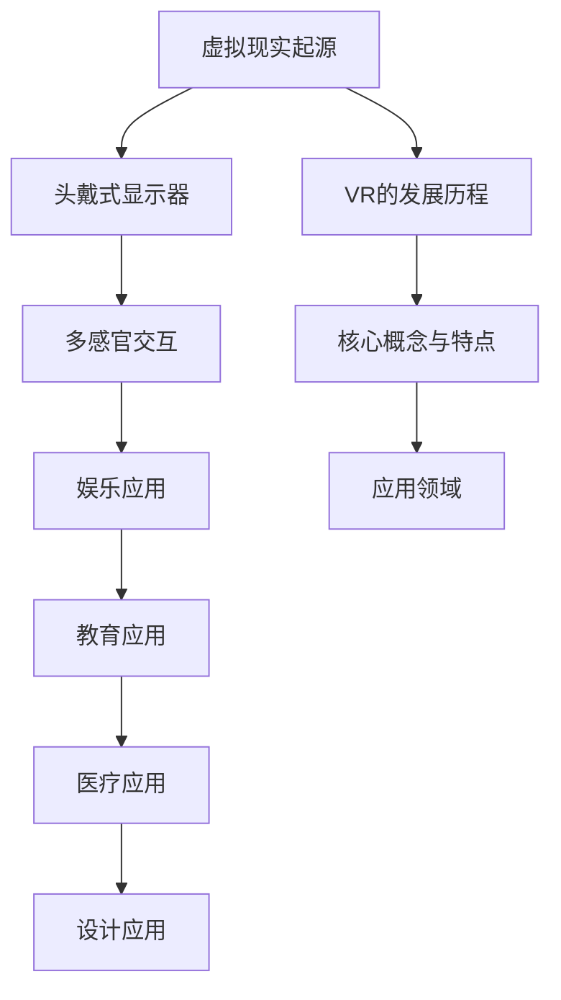
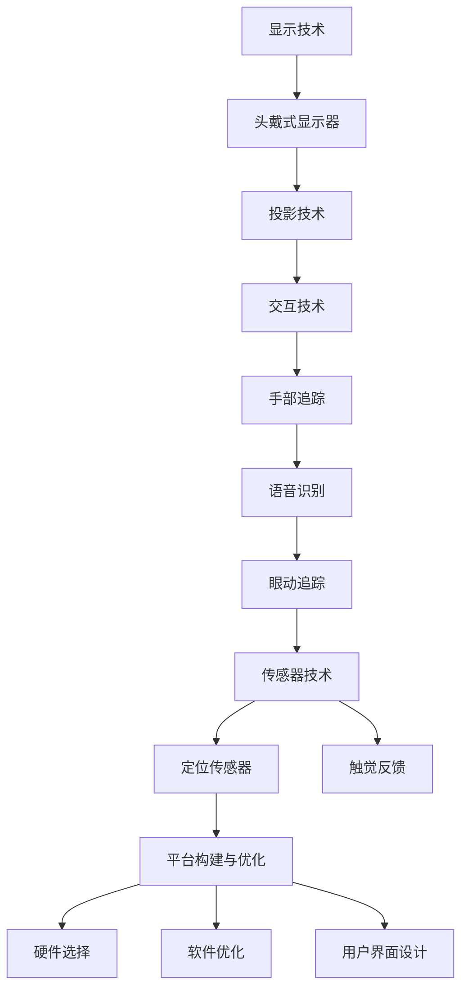
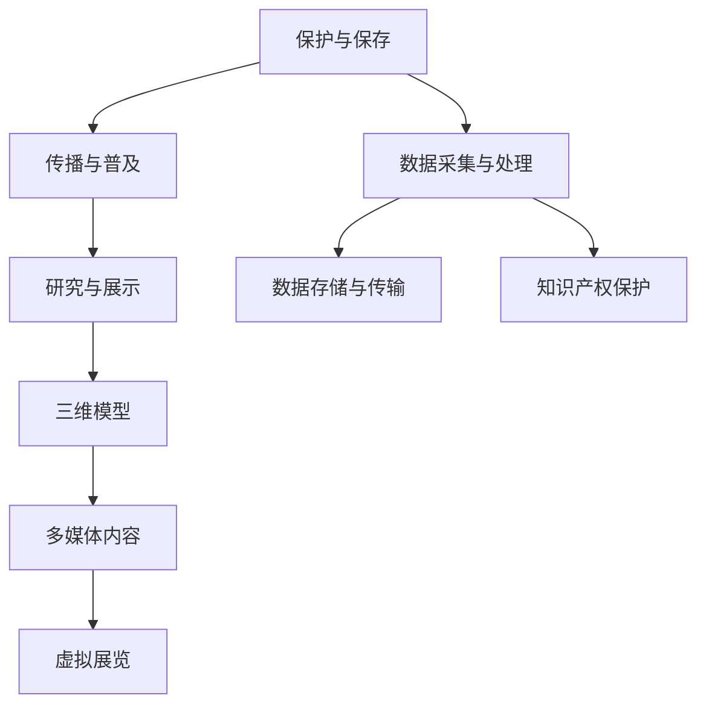
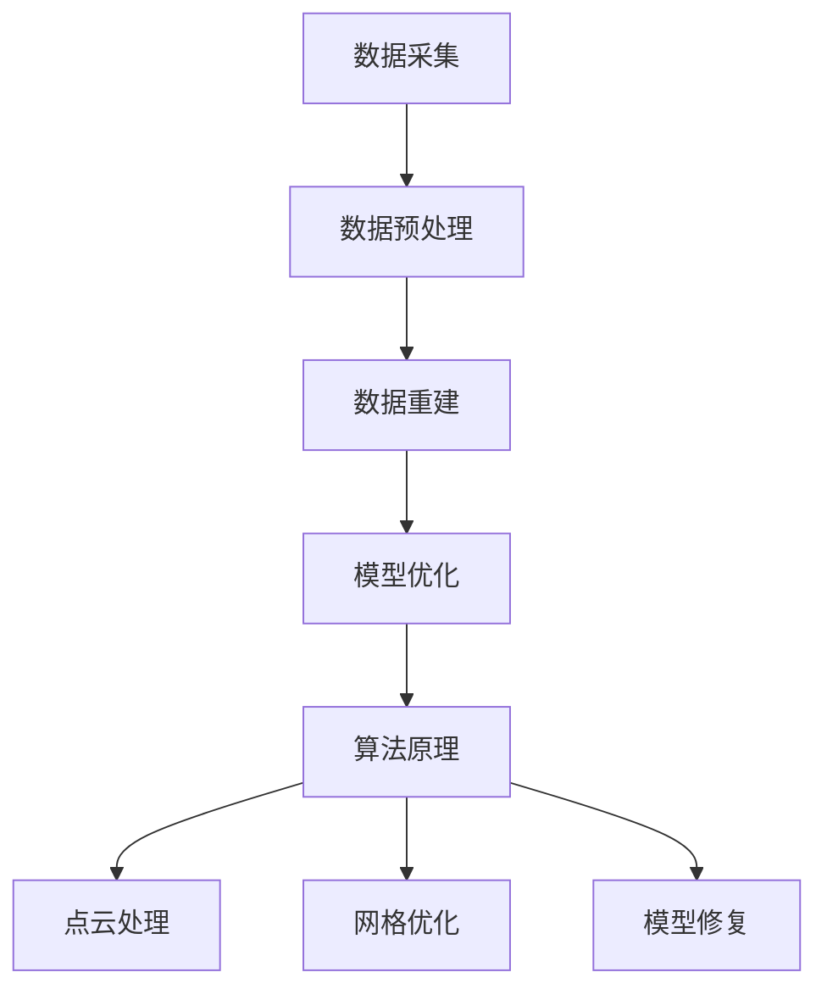
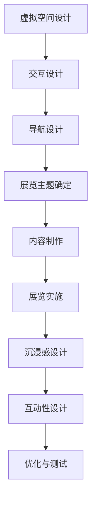
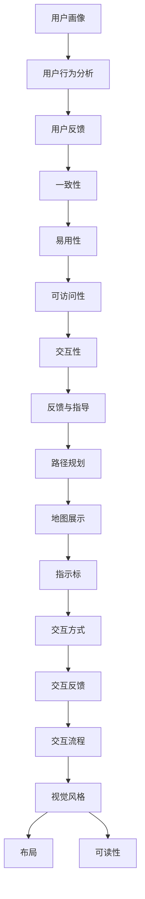
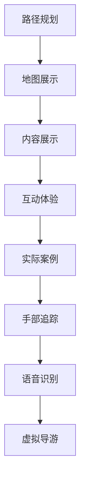
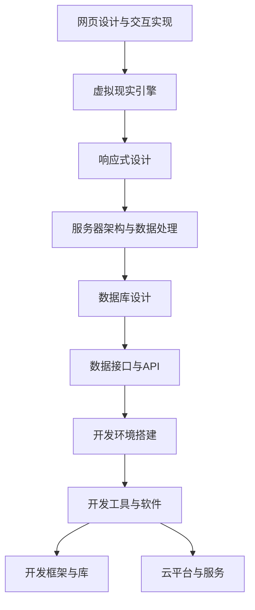
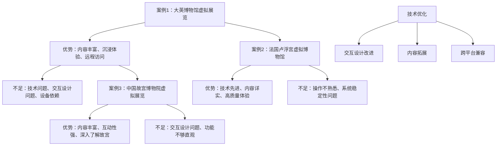
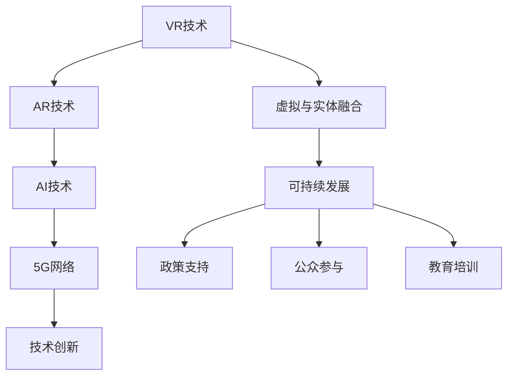

                 

### 引言

随着数字化技术的发展，虚拟现实（Virtual Reality, VR）逐渐成为了一个热门领域。它不仅改变了我们的娱乐方式，还开始对教育、医疗、设计等多个行业产生深远的影响。在数字时代的浪潮下，文化遗产的保存和传播也迎来了新的机遇和挑战。虚拟现实与文化遗产的结合，不仅能够使文化遗产得到更广泛的传播和保存，还能够为观众提供一种全新的沉浸式体验。

本文旨在探讨虚拟现实技术在博物馆领域的应用，特别是如何通过虚拟现实技术展示数字文化遗产。我们将首先介绍虚拟现实的基本原理和核心概念，然后深入探讨文化遗产数字化的过程和挑战，以及虚拟现实在文化遗产展示中的实际应用。接着，我们将分析虚拟现实博物馆用户体验设计的原则和交互设计的关键要素，最后通过实际案例展示虚拟现实博物馆的设计与实现，并对未来发展进行展望。

通过本文的逐步分析，我们将探讨如何利用虚拟现实技术，构建一个既真实又富有互动性的文化遗产展示平台，为观众提供一种全新的文化体验。同时，我们也将探讨虚拟现实在文化遗产保护与传承中的作用和挑战，以及未来可能的发展方向。

### 关键词

- 虚拟现实
- 文化遗产
- 数字化
- 博物馆体验
- 用户交互
- 沉浸式展示
- 用户体验设计

### 摘要

本文将探讨虚拟现实技术在博物馆领域的应用，特别是如何利用虚拟现实技术展示数字文化遗产。文章首先介绍了虚拟现实的基本原理和核心概念，然后深入探讨了文化遗产数字化的过程和挑战，以及虚拟现实在文化遗产展示中的实际应用。接着，文章分析了虚拟现实博物馆用户体验设计的原则和交互设计的关键要素。通过实际案例展示，文章详细介绍了虚拟现实博物馆的设计与实现过程，并对未来发展进行了展望。本文旨在为读者提供关于虚拟现实技术在博物馆领域应用的全面了解，探讨其在文化遗产保护与传承中的作用和挑战。

## 第一部分：虚拟现实的原理与技术

### 第1章：虚拟现实概述

虚拟现实（Virtual Reality, VR）是一种通过计算机模拟出的三维虚拟环境，用户可以通过头戴式显示器（HMD）等设备感受到身临其境的体验。VR技术的发展经历了几个阶段，从最初的简单视觉模拟，到如今的多样化感知模拟，其应用领域也在不断拓展。

### 背景介绍

虚拟现实的概念最早可以追溯到20世纪60年代的美国。1968年，伊凡·苏瑟兰（Ivan Sutherland）发明了第一个头戴式显示器，这标志着VR技术的诞生。随着时间的推移，VR技术逐渐成熟，并在1990年代初期推出了商业头戴显示器。进入21世纪，随着计算机性能的提升和显示技术的进步，VR技术迎来了新的发展机遇。

### 核心概念与特点

虚拟现实的核心概念是创建一个三维的虚拟环境，让用户能够通过视觉、听觉、触觉等多种感官进行交互。与增强现实（Augmented Reality, AR）不同，VR是完全沉浸式的，用户可以完全脱离现实世界，进入虚拟环境。

虚拟现实的主要特点包括：

1. **沉浸感**：用户在VR环境中能够感受到全身心的沉浸，仿佛置身于另一个世界。
2. **交互性**：用户可以通过手势、语音、控制器等多种方式与虚拟环境进行交互。
3. **多感官体验**：除了视觉和听觉外，VR技术还包括触觉、嗅觉等感官的模拟，提供更丰富的体验。

### 应用领域

虚拟现实的应用领域非常广泛，包括但不限于：

1. **娱乐**：VR游戏和VR影视是VR技术的主要应用领域，提供了全新的娱乐体验。
2. **教育**：通过VR技术，学生可以虚拟参观历史遗址、了解生物结构等，增强了学习体验。
3. **医疗**：VR技术在心理治疗、康复训练等领域有广泛应用，如虚拟手术训练、心理疾病治疗等。
4. **设计**：在建筑设计、工业设计等领域，VR技术可以帮助设计师在虚拟环境中进行模型展示和测试。

### 总结

虚拟现实技术通过三维虚拟环境的创建，为用户提供了一种全新的沉浸式体验。其核心概念和特点，以及广泛的应用领域，使得VR技术在多个行业中都具有重要的影响。在接下来的章节中，我们将深入探讨VR技术在文化遗产展示中的具体应用。

### Mermaid 流程图

## 第2章：虚拟现实技术基础

### 核心概念与联系

虚拟现实技术的实现离不开多种核心技术的支持，包括显示技术、交互技术、传感器技术和平台构建与优化。这些技术相互关联，共同构成了VR系统的基本架构。

### 显示技术

显示技术是虚拟现实的核心组成部分，决定了用户的沉浸感和视觉效果。常见的显示技术包括：

1. **头戴式显示器（HMD）**：如Oculus Rift、HTC Vive等，通过显示屏幕和光学元件为用户呈现三维虚拟图像。
2. **投影技术**：通过投影仪将虚拟图像投射到特定的屏幕或空间中，适用于大型VR体验。

### 交互技术

交互技术是用户与虚拟环境之间的桥梁，决定了用户的操作体验。常见的交互技术包括：

1. **手部追踪**：通过摄像头或传感器捕捉用户手部动作，实现手势操作。
2. **语音识别**：通过语音输入与虚拟环境进行交互，如询问信息、操作控制等。
3. **眼动追踪**：捕捉用户眼球的运动，用于提高视觉交互的自然性和准确性。

### 传感器技术

传感器技术用于捕捉用户的位置和动作，确保虚拟环境与现实环境的同步。常见的传感器技术包括：

1. **定位传感器**：如惯性测量单元（IMU）、激光雷达等，用于确定用户在虚拟环境中的位置和动作。
2. **触觉反馈**：通过触觉手套等设备，为用户提供触觉反馈，增强沉浸感。

### 平台构建与优化

平台构建与优化是确保VR系统稳定运行和提供高质量体验的关键。包括：

1. **硬件选择**：选择适合应用场景的硬件设备，如高性能显卡、处理器等。
2. **软件优化**：通过优化渲染算法、图形处理等，提高系统性能和降低延迟。
3. **用户界面设计**：设计直观、易用的用户界面，提高用户体验。

### Mermaid 流程图

### 总结

虚拟现实技术基础是构建一个完整的VR系统的关键。显示技术、交互技术、传感器技术和平台构建与优化相互关联，共同决定了用户的虚拟现实体验。通过深入了解这些技术，我们可以更好地理解和应用虚拟现实，为文化遗产展示和其他领域提供创新解决方案。

## 第二部分：数字文化遗产的数字化处理

### 第3章：文化遗产数字化概述

文化遗产的数字化是一种将传统文化遗产以数字形式保存和传播的方法，使其在数字化环境中得以永久保存，并能够为全球观众提供便捷的访问。随着数字技术的不断进步，文化遗产数字化已成为一种重要的文化保护手段。

### 文化遗产数字化的重要性

1. **保护与保存**：数字化技术可以保护文化遗产免受自然灾害、人为破坏等因素的影响，确保其长期保存。
2. **传播与普及**：数字化文化遗产可以通过互联网等渠道，迅速传播到全球各地，让更多的人了解和欣赏。
3. **研究与展示**：数字化文化遗产为学者和研究人员提供了丰富的数据资源，同时也为博物馆等机构提供了创新的展示方式。

### 数字化文化遗产的类型与内容

1. **三维模型**：通过三维扫描技术，将文化遗产的三维形态以数字形式保存，如建筑物、雕塑等。
2. **多媒体内容**：包括文字、图像、音频、视频等多种形式，提供文化遗产的历史背景和文化内涵。
3. **虚拟展览**：利用虚拟现实技术，创建一个虚拟的展览空间，让观众能够沉浸式体验文化遗产。

### 文化遗产数字化过程中的挑战与解决方案

1. **数据采集与处理**：数字化过程中需要精确采集文化遗产的形态和内容，同时处理大量的数据，这需要先进的扫描技术和高效的算法。
2. **数据存储与传输**：数字化文化遗产的数据量巨大，如何高效存储和传输数据是一个挑战。采用分布式存储和云存储技术可以解决这一问题。
3. **知识产权保护**：数字化文化遗产的传播可能涉及知识产权问题，需要制定相应的知识产权保护政策。

### 总结

文化遗产数字化不仅是一种保护文化遗产的重要手段，也是文化传播和普及的新途径。通过数字化技术，我们可以更好地保存、研究和展示文化遗产，为人类文明的传承和发展做出贡献。在接下来的章节中，我们将深入探讨三维建模与扫描技术，以及虚拟现实在文化遗产展示中的实际应用。

### Mermaid 流程图

## 第4章：三维建模与扫描技术

### 背景介绍

三维建模与扫描技术在文化遗产数字化过程中扮演着至关重要的角色。三维建模通过数学和计算机图形学的方法，将实物对象转化为虚拟的三维模型；而三维扫描技术则是通过激光、摄影测量或其他传感手段，精确捕捉实物的三维形态。

### 三维建模的基本原理

三维建模的基本原理包括以下几个方面：

1. **几何建模**：通过构建几何体的表面或体积来表示物体，如多边形建模、曲面建模等。
2. **网格建模**：将物体表面划分为多边形网格，通过调整网格顶点和边来建模。
3. **参数化建模**：使用参数化的方法来定义物体的形状，通过调整参数来修改模型。

### 三维扫描技术及其应用

三维扫描技术的主要类型包括：

1. **激光扫描**：通过发射激光束并捕捉反射光，获取物体表面的三维坐标。
2. **摄影测量**：利用多张图片通过算法重建物体的三维模型。
3. **结构光扫描**：使用结构光投影并捕捉投影图像，通过图像处理和算法重建物体模型。

三维扫描技术广泛应用于以下领域：

1. **文物保护**：通过高精度的三维扫描，保护文物不受损坏，并制作修复模型。
2. **考古研究**：利用三维扫描技术，重建考古遗址和古物，提供研究的依据。
3. **产品设计**：在产品设计阶段，通过三维扫描技术获取原型，进行修改和优化。

### 三维数据处理的流程与方法

三维数据处理通常包括以下步骤：

1. **数据采集**：通过三维扫描设备获取物体的三维数据。
2. **数据预处理**：对扫描数据进行降噪、去噪、补洞等处理，提高数据质量。
3. **数据重建**：使用算法将点云数据重建为三维模型。
4. **数据优化**：对重建的三维模型进行平滑、简化等优化处理，提高模型的可处理性。

### 三维数据处理的算法原理

三维数据处理的算法原理包括：

1. **点云处理**：对点云数据进行降噪、去噪、补洞等处理，常用的算法有泊松重建、Alpha Shapes等。
2. **网格优化**：对三维模型进行网格简化、平滑处理，常用的算法有Marching Cubes、Loop Subdivision等。
3. **模型修复**：对损坏或缺失的部分进行修复，常用的算法有基于深度学习的模型修复技术。

### 实例说明

假设我们要扫描一个古文物，以下是具体步骤：

1. **数据采集**：使用激光扫描设备对古文物进行扫描，获取点云数据。
2. **数据预处理**：对点云数据进行降噪处理，使用泊松重建算法去除噪点和补洞。
3. **数据重建**：使用Marching Cubes算法将点云数据重建为三维模型。
4. **模型优化**：对重建的三维模型进行平滑处理，使用Loop Subdivision算法简化模型。

### 总结

三维建模与扫描技术在文化遗产数字化过程中至关重要，它们不仅能够精确捕捉实物的三维形态，还能通过数据处理和优化，重建出高质量的虚拟模型。这些技术为文化遗产的保护、研究和展示提供了强大的工具。在接下来的章节中，我们将探讨虚拟现实在文化遗产展示中的应用，以及如何通过虚拟现实技术，为观众提供沉浸式的文化遗产体验。

### Mermaid 流程图

## 第5章：虚拟现实中的文化遗产展示

### 背景介绍

虚拟现实（VR）在文化遗产展示中的应用，为观众提供了一种全新的、沉浸式的体验方式。通过VR技术，观众不仅能够“进入”文化遗产的虚拟空间，还能够与文化遗产进行互动，从而更深入地了解和体验文化遗产的历史与内涵。

### 虚拟博物馆的搭建与设计

1. **虚拟空间设计**：首先，需要根据文化遗产的特点，设计一个适合的虚拟空间。这个空间可以是完全虚拟的，也可以是现实博物馆的虚拟复刻。设计时需要考虑空间的布局、光影效果和视觉感受。
2. **交互设计**：在虚拟博物馆中，观众可以通过虚拟手套、手柄等设备与文物进行互动。例如，可以旋转文物、放大细节、查看历史文献等。交互设计需要考虑用户体验，确保操作简单直观。
3. **导航设计**：虚拟博物馆中的导航设计非常重要，需要为观众提供清晰、直观的导航路径，帮助他们找到感兴趣的展品和展区。

### 虚拟展览的策划与实施

1. **展览主题确定**：虚拟展览的主题应与文化遗产的特点相结合，例如历史、艺术、考古等。确定主题后，需要策划展览内容，包括展品选择、展览布局、展览流程等。
2. **内容制作**：内容制作是虚拟展览的关键，需要高质量的三维模型、图像、音频、视频等多媒体内容。这些内容可以通过三维建模、扫描技术、虚拟现实引擎等手段进行制作。
3. **展览实施**：在虚拟展览实施阶段，需要将策划好的展览内容在虚拟环境中进行布局和呈现，确保展览流程流畅、交互体验良好。

### 虚拟文化遗产体验的设计与优化

1. **沉浸感设计**：虚拟现实的核心在于提供沉浸感，设计时需要考虑如何增强观众的沉浸体验。例如，可以通过模拟自然环境、历史背景音效、精细的纹理和光影效果等手段来增强沉浸感。
2. **互动性设计**：互动性是虚拟文化遗产体验的重要组成部分，可以通过虚拟手套、手柄等设备，让观众与文物进行互动，如旋转、放大、触摸等。互动设计需要充分考虑用户体验，确保操作自然流畅。
3. **优化与测试**：在虚拟文化遗产体验的设计过程中，需要进行不断的优化和测试。通过用户反馈和数据分析，找出体验中的不足，进行改进和优化。

### 实际案例

以某博物馆的虚拟现实展览为例，该博物馆利用VR技术展示了其收藏的一件古代文物。观众通过VR设备进入虚拟博物馆，可以近距离观察文物的细节，通过虚拟手套进行旋转和放大，了解文物的历史背景和制作工艺。展览中还加入了三维动画，展示了文物的修复过程和历史背景。通过这种沉浸式的体验，观众不仅加深了对文物的理解，也激发了对文化遗产的兴趣。

### 总结

虚拟现实技术在文化遗产展示中的应用，为观众提供了一种全新的、沉浸式的体验方式。通过虚拟博物馆的搭建与设计、虚拟展览的策划与实施，以及虚拟文化遗产体验的设计与优化，我们可以为观众带来丰富的文化遗产体验。这不仅有助于文化遗产的保护和传播，也促进了公众对文化遗产的理解和认识。在接下来的章节中，我们将探讨虚拟现实博物馆的用户体验设计原则和交互设计的关键要素。

### Mermaid 流�程图

## 第三部分：虚拟与现实结合的博物馆体验设计

### 第6章：用户体验设计原则

用户体验设计（User Experience Design, UX Design）在虚拟现实博物馆体验设计中占据着核心地位。一个成功的虚拟现实博物馆需要提供引人入胜且易于使用的用户体验，才能吸引并留住观众。以下是用户体验设计的一些核心原则：

### 用户需求的调研与分析

1. **用户画像**：通过调研了解目标观众的特征，包括年龄、性别、文化背景、兴趣等，这有助于设计出符合观众需求的博物馆体验。
2. **用户行为分析**：观察和分析观众在虚拟博物馆中的行为模式，如观看时间、交互方式、关注点等，以便优化设计。
3. **用户反馈**：收集观众的反馈，通过调查问卷、用户访谈等方式获取真实用户的意见和建议，不断改进设计。

### 用户体验设计的核心原则

1. **一致性**：确保整个虚拟博物馆的界面、交互方式、视觉风格等保持一致，帮助观众快速适应并理解。
2. **易用性**：设计应直观易懂，简化操作流程，减少用户的学习成本，使观众能够轻松地使用各种功能。
3. **可访问性**：设计应考虑到不同能力的观众，如视觉障碍、听力障碍等，确保所有人都能无障碍地使用。
4. **交互性**：通过丰富的交互方式，如手势、语音、触摸等，增强观众的参与感和沉浸感。
5. **反馈与指导**：在用户进行操作时，提供清晰的反馈和指导，帮助用户了解下一步操作。

### 导航设计

导航设计是用户体验设计的重要组成部分，决定了观众能否顺利地在虚拟博物馆中浏览和找到感兴趣的展品。

1. **路径规划**：设计简洁、直观的路径规划，使观众能够轻松找到各个展区。
2. **地图展示**：提供虚拟地图，帮助观众了解博物馆的整体布局和当前所在位置。
3. **指示标**：设置清晰的指示标，引导观众前往感兴趣的区域。

### 交互设计

交互设计决定了观众与虚拟博物馆之间的互动方式，直接影响用户体验。

1. **交互方式**：提供多样化的交互方式，如手势、语音、触摸等，以满足不同观众的需求。
2. **交互反馈**：确保每个交互动作都有明显的反馈，如声音、震动、视觉提示等，增强用户体验。
3. **交互流程**：设计简化的交互流程，减少观众的操作步骤，提高效率。

### 用户界面设计

用户界面设计（User Interface Design, UI Design）是用户体验设计的一部分，直接影响到观众对虚拟博物馆的第一印象。

1. **视觉风格**：设计统一的视觉风格，包括颜色、字体、图标等，使虚拟博物馆具有独特的品牌形象。
2. **布局**：确保界面布局清晰、简洁，便于观众查找和操作。
3. **可读性**：保证文字内容清晰可读，避免信息过载，减少观众的学习成本。

### 总结

用户体验设计原则是虚拟现实博物馆成功的关键。通过调研用户需求、遵循核心设计原则、精心设计导航和交互，我们可以为观众提供一个愉悦、沉浸且易于使用的博物馆体验。在下一章中，我们将深入探讨虚拟博物馆的交互设计，进一步优化观众的沉浸体验。

### Mermaid 流程图

## 第7章：虚拟博物馆的交互设计

### 背景介绍

虚拟博物馆的交互设计是用户体验设计的重要组成部分，直接影响观众在虚拟环境中的沉浸体验和操作效率。交互设计的目标是提供自然、直观且响应迅速的互动方式，使用户能够轻松地浏览、探索和互动。

### 导航设计

导航设计是虚拟博物馆交互设计的关键，决定了观众能否顺利地找到感兴趣的展品和区域。

1. **路径规划**：设计简洁直观的路径规划，使用简单的图标和指示来引导观众。路径应尽量避免复杂的交叉和分叉，确保观众能够快速找到目的地。
2. **地图展示**：提供虚拟地图，展示博物馆的整体布局和当前所在位置。地图应具有高清晰度和易读性，帮助观众了解博物馆的各个部分。
3. **热区导航**：在重要展品或区域设置热区，当观众靠近时，热区会高亮显示，提示观众该区域的内容和重要性。

### 内容展示

内容展示是观众体验虚拟博物馆的核心，设计时应注重内容的呈现方式和交互体验。

1. **多媒体内容整合**：整合文字、图像、音频、视频等多媒体内容，使观众能够通过多种感官方式了解展品。例如，展品的详细信息可以通过触摸屏幕或语音提示提供。
2. **交互式内容展示**：设计交互式内容展示，如触摸屏互动、360度全景展示等，让观众能够更深入地探索展品。
3. **细节放大**：提供细节放大功能，让观众能够近距离观察展品的细节，提高沉浸感。

### 互动体验

互动体验是增强虚拟博物馆吸引力和趣味性的关键，设计时应注重互动的多样性和自然性。

1. **手部追踪**：通过手部追踪技术，观众可以使用手势与虚拟展品互动，如旋转、翻转、触摸等，提供直观的互动体验。
2. **语音识别**：集成语音识别技术，允许观众通过语音进行查询、导航、互动等操作，提高操作便捷性。
3. **虚拟导游**：提供虚拟导游功能，通过语音或动画形式，为观众讲解展品的历史背景、文化内涵等，提供专业的导览服务。

### 实际案例

以某虚拟现实博物馆为例，该博物馆采用了以下交互设计：

1. **路径规划**：博物馆采用简洁直观的路径规划，通过图标和指示标引导观众。路径设计避免了复杂的交叉，确保观众能够快速找到展品。
2. **地图展示**：提供高清晰度的虚拟地图，观众可以随时查看博物馆的整体布局和当前所在位置，方便导航。
3. **内容展示**：整合了文字、图像、音频、视频等多媒体内容，观众可以通过触摸屏或语音提示详细了解展品。
4. **互动体验**：通过手部追踪技术，观众可以与展品进行互动，如旋转古文物、放大细节等。此外，还提供了语音识别和虚拟导游功能，为观众提供便捷的导览服务。

### 总结

虚拟博物馆的交互设计是提升用户体验的关键，通过简洁的路径规划、直观的内容展示和多样的互动体验，我们可以为观众提供一个愉悦、沉浸且易于使用的虚拟博物馆体验。在下一章中，我们将探讨虚拟博物馆的技术实现，包括前端和后端技术、数据库设计和开发环境搭建。

### Mermaid 流程图

## 第8章：虚拟博物馆的技术实现

### 背景介绍

虚拟博物馆的实现涉及到多种技术的综合运用，包括前端技术、后端技术、数据库设计和开发环境搭建。这些技术共同构成了一个完整、高效的虚拟博物馆系统，为用户提供沉浸式的文化遗产体验。

### 前端技术

前端技术主要负责用户界面的设计与实现，决定了用户在虚拟博物馆中的交互体验。前端技术主要包括以下几个方面：

1. **网页设计与交互实现**：使用HTML、CSS和JavaScript等前端技术，设计虚拟博物馆的网页界面。HTML负责内容结构，CSS负责样式设计，JavaScript用于实现交互功能。
2. **虚拟现实引擎**：使用如Unity、Unreal Engine等虚拟现实引擎，创建虚拟博物馆的三维场景和交互界面。这些引擎提供了丰富的图形渲染功能和物理模拟功能，能够为用户带来逼真的沉浸体验。
3. **响应式设计**：确保虚拟博物馆在不同的设备上都能良好运行，如桌面电脑、平板电脑和智能手机。响应式设计通过调整网页布局和交互方式，以适应不同屏幕尺寸和操作系统。

### 后端技术

后端技术负责数据的处理、存储和管理，确保虚拟博物馆系统的高效运行。后端技术主要包括以下几个方面：

1. **服务器架构与数据处理**：构建稳定、高效的服务器架构，处理来自前端的数据请求。使用如Node.js、Python等后端语言，搭建服务器应用程序，处理用户交互和数据存储。
2. **数据库设计**：设计数据库模型，存储虚拟博物馆所需的数据，如文化遗产信息、用户数据、交互记录等。常用的数据库系统包括MySQL、MongoDB等。
3. **数据接口与API**：设计数据接口和API，实现前端与后端之间的数据通信。通过RESTful API或GraphQL等接口技术，为前端提供数据访问和操作的能力。

### 数据库设计

数据库设计是虚拟博物馆技术实现的关键环节，决定了数据的存储和管理效率。数据库设计主要包括以下几个方面：

1. **数据模型**：设计合理的数据模型，确保数据的规范化和一致性。常用的数据模型包括关系型数据库模型和文档型数据库模型。
2. **数据存储**：选择合适的存储方案，如关系型数据库（MySQL、PostgreSQL）或非关系型数据库（MongoDB、Cassandra），根据数据特点和需求进行优化。
3. **数据索引**：设计合理的索引策略，提高数据的查询和检索效率。常用的索引技术包括B树索引、哈希索引等。

### 开发环境搭建

开发环境搭建是虚拟博物馆项目启动的第一步，确保开发团队能够高效地进行开发和测试。开发环境搭建主要包括以下几个方面：

1. **开发工具与软件**：选择合适的开发工具和软件，如Visual Studio Code、Sublime Text等文本编辑器，以及Git、Jenkins等版本控制和持续集成工具。
2. **开发框架与库**：使用流行的开发框架和库，如React、Vue.js等前端框架，以及Django、Flask等后端框架，提高开发效率。
3. **云平台与服务**：利用云平台和服务，如AWS、Azure、阿里云等，提供计算资源、存储服务和网络连接，确保系统的可靠性和可扩展性。

### 总结

虚拟博物馆的技术实现是一个复杂而系统性的工程，涉及前端技术、后端技术、数据库设计和开发环境搭建等多个方面。通过合理的技术选型和高效的开发流程，我们可以构建一个功能完善、性能卓越的虚拟博物馆系统，为用户提供卓越的文化遗产体验。

### Mermaid 流程图

## 第四部分：案例分析与未来展望

### 第9章：虚拟现实博物馆案例分析

在本章中，我们将分析国内外一些成功的虚拟现实博物馆案例，探讨其优势与不足，并从中提取出有益的启示。

### 国内外虚拟现实博物馆的成功案例

1. **大英博物馆虚拟展览**：大英博物馆的虚拟展览通过VR技术，为观众提供了沉浸式的参观体验。观众可以在虚拟环境中浏览博物馆的珍贵藏品，如古代文物、艺术品等。该展览的优势在于内容丰富、展示效果逼真，极大地增强了观众的互动体验。然而，不足之处在于系统的稳定性和延迟问题，有时会影响用户体验。

2. **法国卢浮宫虚拟博物馆**：法国卢浮宫的虚拟博物馆利用VR技术，让全球观众能够虚拟参观这座世界著名的博物馆。观众可以近距离观察达芬奇的《蒙娜丽莎》等著名艺术品。该博物馆的优势在于技术先进、内容详实，为观众提供了高质量的虚拟参观体验。不足之处在于，部分观众对于VR设备的操作不熟悉，导致体验过程中遇到困难。

3. **中国故宫博物院虚拟展览**：中国故宫博物院的虚拟展览通过VR技术，再现了故宫的宫殿建筑和历史场景。观众可以虚拟参观故宫的各个展厅，了解宫廷文化。该展览的优势在于内容丰富、互动性强，为观众提供了深入了解故宫的机会。然而，不足之处在于，虚拟展览的交互设计有待改进，部分功能不够直观。

### 案例分析：优势与不足

通过对上述案例的分析，我们可以总结出以下优势与不足：

**优势：**
- **内容丰富**：成功的虚拟现实博物馆通常提供了丰富的文化内容，包括珍贵的文物、艺术品和历史场景，为观众提供了全面的了解。
- **沉浸体验**：虚拟现实技术为观众提供了沉浸式的体验，增强了互动性和参与感。
- **远程访问**：虚拟现实博物馆打破了地域限制，让全球观众都能便捷地参观博物馆，提高了文化传播的效率。

**不足：**
- **技术问题**：部分虚拟现实博物馆存在技术问题，如系统稳定性不足、延迟等，影响了用户体验。
- **交互设计**：部分虚拟博物馆的交互设计不够友好，操作复杂，降低了用户的体验感。
- **设备依赖**：虚拟现实博物馆对设备有较高的要求，部分观众可能无法使用，限制了其受众范围。

### 案例启示：未来发展方向

通过上述案例分析，我们可以得出以下启示，为未来虚拟现实博物馆的发展提供指导：

1. **技术优化**：持续优化虚拟现实技术，提高系统的稳定性和性能，减少延迟，为用户提供更好的体验。
2. **交互设计**：改进交互设计，使操作更加直观、简便，提高用户的互动体验。
3. **内容拓展**：丰富虚拟博物馆的内容，不仅包括文物和艺术品，还可以结合现代科技，如AR、AI等，提供更多元化的文化体验。
4. **跨平台兼容**：确保虚拟现实博物馆在不同设备和操作系统上都能良好运行，提高其受众范围。

### 总结

虚拟现实博物馆作为一种新兴的展示形式，具有巨大的潜力。通过分析国内外成功案例，我们可以总结出其优势与不足，并从中得到有益的启示。未来，虚拟现实博物馆的发展需要不断优化技术、改进设计，以提供更优质的文化遗产体验。

### Mermaid 流程图

## 第10章：数字文化遗产的未来发展趋势

### 背景介绍

随着虚拟现实、人工智能、5G等新兴技术的不断进步，数字文化遗产的发展前景愈发广阔。这些技术的应用不仅能够进一步提升文化遗产的展示效果和互动性，还能够为文化遗产的保护与传承提供新的思路和方法。

### 新技术的应用与挑战

1. **虚拟现实（VR）**：VR技术的不断发展为文化遗产展示提供了更加沉浸式的体验。未来，VR技术将更加成熟，分辨率更高，交互方式更加自然，为观众提供更加真实的虚拟体验。然而，VR设备的成本较高，技术实现复杂，且部分用户可能不习惯使用VR设备。

2. **增强现实（AR）**：AR技术通过将虚拟信息叠加到现实世界中，为观众提供了更为丰富的互动体验。未来，AR技术有望与VR技术结合，提供更为全面的文化遗产展示。然而，AR技术的实现依赖于硬件设备，如智能手机和AR眼镜等，这些设备的普及率还需提高。

3. **人工智能（AI）**：AI技术可以用于文化遗产的识别、分类和修复。例如，通过图像识别技术，可以快速识别文物并提取相关信息；通过深度学习算法，可以自动修复文物上的破损。然而，AI技术的发展也面临数据隐私和算法透明度等挑战。

4. **5G网络**：5G网络的高速率和低延迟为文化遗产的远程访问提供了基础。未来，5G网络的普及将使得观众能够随时随地访问虚拟博物馆，获得高质量的虚拟体验。然而，5G网络的覆盖范围和稳定性仍需进一步提高。

### 虚拟现实与实体博物馆的融合

虚拟现实与实体博物馆的融合是未来文化遗产展示的重要趋势。通过虚拟现实技术，实体博物馆可以提供更加丰富的展览内容，增强观众的互动体验；同时，虚拟博物馆也可以为那些无法到实体博物馆参观的观众提供替代方案。这种融合不仅能够扩大文化遗产的影响范围，还能够提高文化遗产的保护水平。

### 数字文化遗产保护与传承的可持续发展

数字文化遗产的可持续发展需要考虑多个方面：

1. **技术创新**：持续推动虚拟现实、人工智能等新技术在文化遗产中的应用，提高展示效果和互动性。
2. **政策支持**：政府和企业应加大对数字文化遗产项目的支持，提供资金、技术和人才等资源。
3. **公众参与**：鼓励公众参与数字文化遗产的创建和传播，提高文化遗产的社会认知度和参与度。
4. **教育培训**：加强文化遗产保护与传承的培训和教育，提高相关人员的专业素质。

### 总结

数字文化遗产的未来发展趋势充满机遇与挑战。通过新兴技术的应用、虚拟现实与实体博物馆的融合，以及可持续发展的策略，我们可以为文化遗产的保存、传播和传承提供新的路径。在未来，数字文化遗产将成为连接过去与现在、传统与现代的重要桥梁，为人类文明的传承和发展做出重要贡献。

### Mermaid 流程图

### 结论

本文通过逐步分析，探讨了虚拟现实技术在博物馆领域的应用，特别是数字文化遗产的展示。我们从虚拟现实的原理与技术出发，详细介绍了文化遗产数字化的过程与挑战，以及虚拟现实在文化遗产展示中的实际应用。接着，我们探讨了虚拟现实博物馆的用户体验设计和交互设计，并通过实际案例展示了虚拟现实博物馆的设计与实现。最后，我们展望了数字文化遗产的未来发展趋势，包括新技术应用与实体博物馆的融合，以及文化遗产保护与传承的可持续发展。

通过本文的分析，我们认识到虚拟现实技术不仅为文化遗产提供了新的展示方式，还增强了观众的互动体验和沉浸感。未来，随着新技术的不断进步，数字文化遗产将迎来更加广阔的发展空间，为文化遗产的保护、传播和传承做出更大的贡献。

### 作者信息

作者：AI天才研究院/AI Genius Institute & 禅与计算机程序设计艺术 /Zen And The Art of Computer Programming

### 拓展阅读

1. **《虚拟现实技术与应用》**：详细介绍了虚拟现实技术的基本原理、应用领域和发展趋势。
2. **《数字文化遗产保护与传承》**：探讨了数字文化遗产的重要性、保护方法和传承策略。
3. **《用户体验设计：实践与案例》**：介绍了用户体验设计的基本原则、方法和实际案例。
4. **《增强现实与虚拟现实应用开发》**：提供了AR和VR应用开发的详细教程和实践案例。
5. **《人工智能在文化遗产保护中的应用》**：介绍了人工智能技术在文化遗产识别、分类和修复方面的应用。

