                 

### 第1章: 引言与概述

#### 1.1 本书背景与目的

在当今数字化时代，旅行体验正在经历前所未有的变革。随着虚拟现实（VR）、增强现实（AR）和人工智能（AI）技术的快速发展，虚拟旅游和实地探索的结合成为可能，为用户提供了更加丰富、多样和个性化的旅行体验。然而，这一新兴领域也面临着诸多挑战，包括技术难题、法律伦理问题和市场发展瓶颈。

本书旨在深入探讨虚拟旅游与实地探索的结合，分析数字时代旅行体验的现状、发展趋势及未来前景。通过对核心概念、关键技术、用户体验、融合挑战、法律与伦理问题等方面的系统阐述，本书希望为行业从业者、研究人员和爱好者提供有价值的参考和指导。

#### 1.2 虚拟旅游与实地探索的结合

虚拟旅游和实地探索各有优势和局限。虚拟旅游通过模拟现实环境，让用户在虚拟空间中感受旅行乐趣，具有成本低、时间灵活、不受地理限制等优点。然而，虚拟体验缺乏真实感和互动性，无法完全替代实地探索的体验。

实地探索提供了真实世界的触摸和互动，但受限于时间和财务成本，无法满足所有人随时随地旅行的需求。因此，将虚拟旅游与实地探索相结合，能够最大化两种体验的优势，为用户提供更为全面和丰富的旅行体验。

以下是一个简化的 Mermaid 流程图，展示了虚拟旅游与实地探索的结合过程：

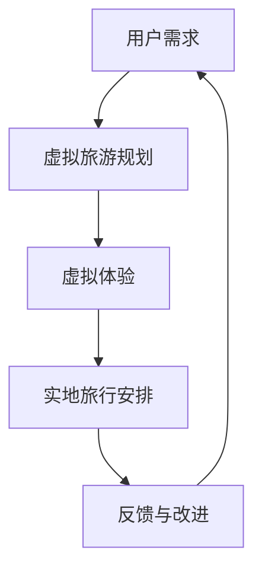

#### 1.3 数字时代的旅行体验

数字时代的旅行体验具有以下几个显著特点：

1. **个性化推荐**：通过大数据分析和人工智能技术，为用户提供个性化的旅行路线、景点推荐和活动安排。
2. **实时信息更新**：借助移动互联网和物联网技术，用户可以实时获取旅游景点的动态信息，如天气、人流、交通状况等。
3. **社交互动**：通过社交媒体和线上社区，用户可以分享旅行经历、交流心得，甚至与远方的朋友一起虚拟“旅行”。
4. **沉浸式体验**：VR、AR等技术的应用，让用户在虚拟环境中获得更加真实和沉浸式的体验。

以下是一个简化的数学模型，描述了数字时代旅行体验的构成：

$$
旅行体验 = \frac{虚拟旅游体验 + 实地探索体验}{时间成本 + 财务成本} + 社交互动 + 实时信息更新
$$

#### 1.4 本书结构

本书共分为七个章节，具体内容如下：

- **第1章：引言与概述**：介绍本书的背景、目的以及虚拟旅游与实地探索的结合。
- **第2章：虚拟旅游技术基础**：讲解虚拟旅游的技术原理和实现方法，包括VR、AR和AI技术。
- **第3章：实地探索技术基础**：介绍GPS定位、虚拟导航和数据采集处理等实地探索技术。
- **第4章：虚拟旅游体验设计**：探讨用户体验设计、内容策划和案例分析。
- **第5章：虚拟旅游与实地探索的融合**：分析数据融合、服务质量提升和融合技术挑战。
- **第6章：法律与伦理问题**：讨论虚拟旅游和实地探索中的法律和伦理问题。
- **第7章：行业发展趋势**：分析市场现状、技术创新和未来展望。

通过本书的深入探讨，希望读者能够对虚拟旅游与实地探索的结合有一个全面而深入的理解，为未来的研究与实践提供有益的启示。

---

接下来，我将详细探讨虚拟旅游技术基础，包括VR、AR和AI技术的基本原理、应用场景以及它们在虚拟旅游中的作用。

### 第2章：虚拟旅游技术基础

#### 2.1 虚拟现实技术介绍

虚拟现实（VR）是一种通过计算机技术创建的模拟环境，用户可以通过头盔、眼镜等设备进入并与之互动。VR技术的主要组成部分包括：

- **VR硬件设备**：如VR头显、手柄、传感器等。
- **VR软件平台**：如Unity、Unreal Engine等。
- **虚拟现实内容制作**：包括场景设计、角色建模、动画制作等。

在虚拟旅游中，VR技术主要用于创建旅游景点的高精度模拟环境，让用户能够在虚拟世界中身临其境地体验旅游活动。

#### 2.1.1 VR硬件设备

VR硬件设备是虚拟旅游体验的核心组成部分。目前市场上主流的VR头显包括Oculus Rift、HTC Vive和Valve Index等。这些设备通过高分辨率显示器、传感器和定位系统，为用户提供沉浸式的视觉和运动体验。

以下是一个简化的 Mermaid 流程图，展示了VR硬件设备在虚拟旅游中的工作流程：

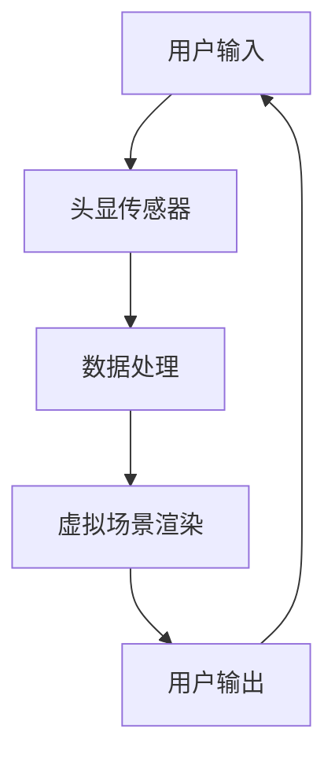

#### 2.1.2 VR软件平台

VR软件平台是构建虚拟旅游环境的重要工具。Unity和Unreal Engine是两款广泛使用的VR开发平台，提供了丰富的开发工具和资源，支持从场景设计到内容发布的完整开发流程。

以下是一个简化的伪代码，描述了使用Unity平台创建虚拟旅游场景的基本流程：

```pseudo
Initialize VR environment
Create 3D scene
Add 3D models of tourist attractions
Annotate with informational texts and images
Enable user interaction with scene elements
Render virtual reality output
```

#### 2.1.3 虚拟现实内容制作

虚拟现实内容制作是虚拟旅游体验的关键环节。内容制作包括场景设计、角色建模、动画制作和音效设计等。高质量的虚拟内容能够提高用户的沉浸感和满意度。

以下是一个简化的 Mermaid 流程图，展示了虚拟现实内容制作的过程：

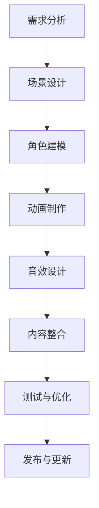

#### 2.2 人工智能在虚拟旅游中的应用

人工智能（AI）在虚拟旅游中的应用，极大地提升了用户体验和服务质量。AI技术主要包括：

- **语音识别与自然语言处理**：通过语音识别技术，用户可以在虚拟旅游中实现语音交互。
- **计算机视觉**：用于场景识别、对象识别和人脸识别等。
- **推荐系统**：根据用户兴趣和行为数据，推荐旅游景点和活动。

以下是一个简化的 Mermaid 流程图，展示了AI技术在虚拟旅游中的应用：

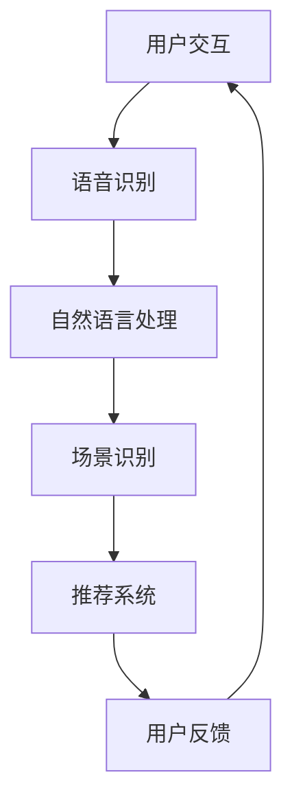

#### 2.2.1 人工智能基础

人工智能基础包括机器学习、深度学习、神经网络等。以下是一个简化的伪代码，描述了使用深度学习进行场景识别的基本流程：

```pseudo
Load training data
Initialize neural network
Train network with labeled data
Evaluate network performance
Deploy trained network for inference
```

#### 2.2.2 语音识别与自然语言处理

语音识别与自然语言处理是虚拟旅游中重要的交互手段。以下是一个简化的伪代码，描述了语音识别和自然语言处理的基本流程：

```pseudo
Record user's voice
Transcribe voice to text
Process text for intent recognition
Generate appropriate response
Speak response to user
```

#### 2.2.3 计算机视觉

计算机视觉在虚拟旅游中的应用，主要包括场景识别、对象识别和人脸识别等。以下是一个简化的伪代码，描述了使用计算机视觉进行场景识别的基本流程：

```pseudo
Capture image from camera
Preprocess image for feature extraction
Extract features using convolutional neural network
Classify features using a trained model
Identify and label objects in the scene
```

#### 2.3 实地探索技术的介绍

实地探索技术是虚拟旅游的重要补充，它包括GPS定位、虚拟导航和数据采集与处理等。这些技术为用户提供了现实世界的定位和导航服务，使得虚拟旅游与现实探索紧密结合。

#### 2.3.1 GPS定位技术

GPS定位技术是实地探索的基础。它通过卫星信号，为用户提供精确的地理位置信息。以下是一个简化的伪代码，描述了GPS定位的基本流程：

```pseudo
Receive satellite signals
Calculate position using trilateration
Update location on a map
```

#### 2.3.2 虚拟导航技术

虚拟导航技术通过计算机算法，为用户规划从起点到目的地的最佳路径。以下是一个简化的伪代码，描述了虚拟导航的基本流程：

```pseudo
Input start and destination locations
Calculate possible routes
Evaluate routes based on distance, time, and other factors
Select optimal route
Provide step-by-step navigation instructions
```

#### 2.3.3 实地探索数据采集与处理

实地探索数据采集与处理包括收集用户在现实世界中的行为数据，如步数、心率、照片等，并对这些数据进行处理和分析，以提供更好的用户体验。以下是一个简化的伪代码，描述了数据采集和处理的基本流程：

```pseudo
Collect sensor data from user's device
Process data to extract relevant information
Store processed data in a database
Analyze data to generate insights
Share insights with users for personalized recommendations
```

通过以上对虚拟旅游技术基础的详细介绍，我们可以看到，虚拟现实、人工智能和实地探索技术的结合，为用户提供了前所未有的旅行体验。在接下来的章节中，我们将继续探讨虚拟旅游体验设计，以及虚拟旅游与实地探索的融合。

### 第3章：虚拟旅游体验设计

#### 3.1 用户体验设计

用户体验设计（UX Design）在虚拟旅游中起着至关重要的作用。优秀的用户体验设计能够提升用户的参与感和满意度，从而增加虚拟旅游的吸引力。以下是一些关键原则：

- **用户中心设计**：始终以用户的需求和体验为核心，进行产品设计和功能开发。
- **简洁直观**：界面设计要简洁直观，避免复杂和冗余的操作流程，让用户能够轻松上手。
- **响应速度**：虚拟旅游体验的响应速度直接影响用户体验。确保虚拟环境中的互动能够快速、顺畅地进行。
- **可访问性**：设计时要考虑不同用户的访问需求，包括视力、听力等特殊需求，以及不同设备和平台的使用。

以下是一个简化的 Mermaid 流程图，展示了用户体验设计的流程：

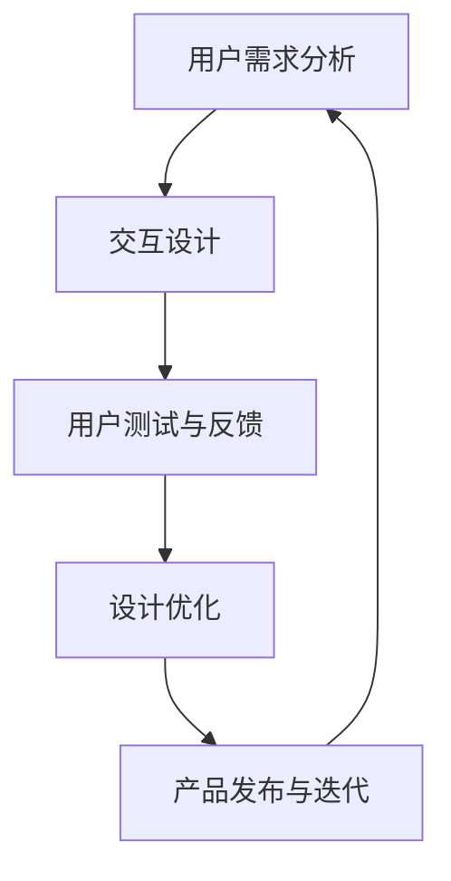

#### 3.1.1 交互设计

交互设计（Interaction Design）是用户体验设计的重要组成部分。在虚拟旅游中，交互设计需要考虑用户如何在虚拟环境中与景点、其他用户和系统进行交互。以下是一些交互设计的关键点：

- **直观的界面布局**：确保界面布局清晰、逻辑性强，使用户能够快速找到所需功能。
- **丰富的交互元素**：使用按钮、图标、滑块等交互元素，提高用户操作的多样性。
- **反馈机制**：为用户的每个操作提供即时反馈，如提示音、动画效果等，增强互动感。
- **可定制性**：允许用户自定义交互方式，如调整界面颜色、字体大小等。

以下是一个简化的 Mermaid 流程图，展示了交互设计的过程：

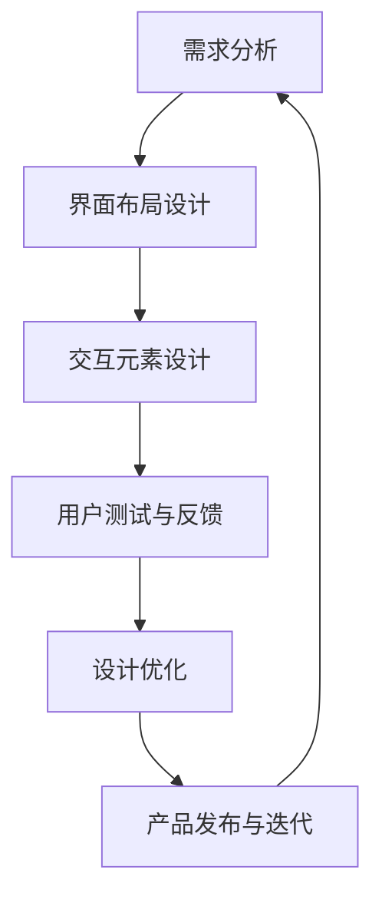

#### 3.1.2 可用性测试

可用性测试（Usability Testing）是验证用户体验设计效果的重要手段。通过可用性测试，可以发现设计中的问题，优化用户体验。以下是一些可用性测试的关键步骤：

- **测试计划**：制定测试目标、测试场景、测试用户等。
- **测试执行**：邀请实际用户参与测试，记录用户操作过程和反馈。
- **数据收集**：收集测试过程中的数据，如操作时间、错误率、用户满意度等。
- **结果分析**：分析测试数据，识别设计问题并提出改进建议。

以下是一个简化的 Mermaid 流程图，展示了可用性测试的过程：

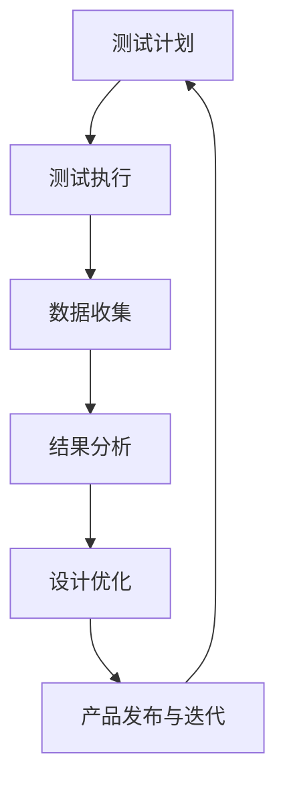

#### 3.2 虚拟旅游内容策划

虚拟旅游内容策划是确保虚拟旅游体验丰富多样的重要环节。内容策划需要考虑以下几点：

- **内容类型**：包括全景视频、3D模型、虚拟导游、互动游戏等。
- **内容来源**：可以从现实世界中的旅游景点获取内容，也可以通过虚拟建模和动画制作生成内容。
- **内容更新**：定期更新内容，以保持用户的新鲜感和参与度。

以下是一个简化的 Mermaid 流程图，展示了虚拟旅游内容策划的过程：

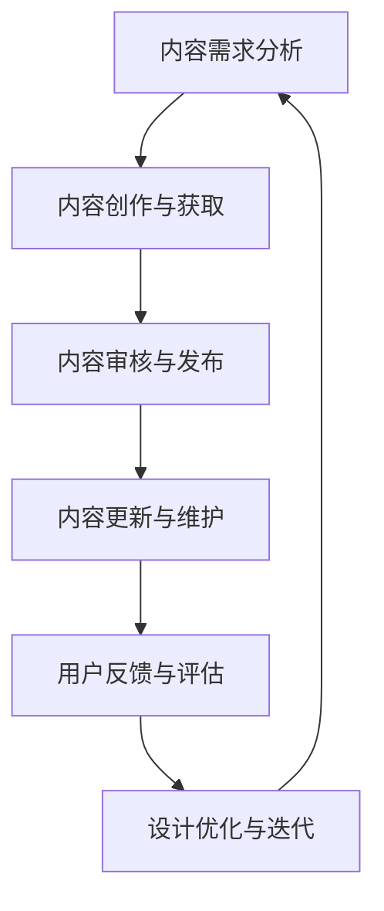

#### 3.2.1 虚拟旅游内容类型

虚拟旅游内容可以分为以下几种类型：

- **全景视频**：通过360度全景摄像技术，展示旅游景点的全貌。
- **3D模型**：使用3D建模软件，创建旅游景点的三维模型。
- **虚拟导游**：通过语音或文字，为用户提供景点介绍、历史背景等信息。
- **互动游戏**：设计虚拟游戏，让用户在虚拟环境中进行互动和探索。

以下是一个简化的 Mermaid 流程图，展示了虚拟旅游内容类型的组合：

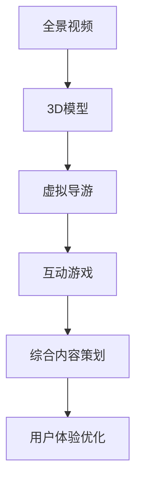

#### 3.2.2 内容创作与分发

内容创作与分发是虚拟旅游体验设计的关键环节。以下是一些关键步骤：

- **内容创作**：根据用户需求和内容类型，进行场景设计、角色建模、动画制作等。
- **内容审核**：对创作内容进行质量检查，确保内容的准确性、合规性等。
- **内容分发**：通过虚拟旅游平台，将内容推送给用户。

以下是一个简化的 Mermaid 流程图，展示了内容创作与分发的流程：

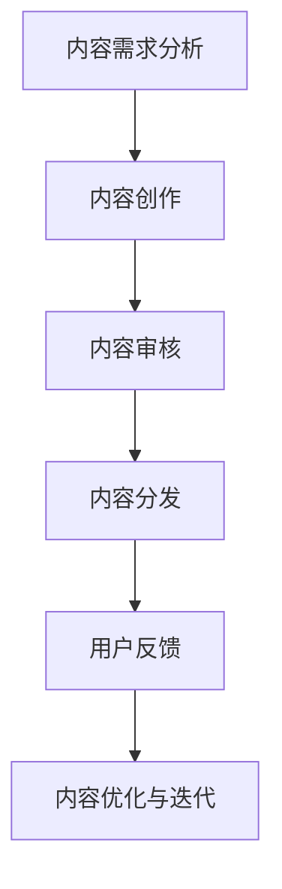

#### 3.2.3 互动性内容设计

互动性内容设计是提升虚拟旅游体验的重要手段。以下是一些关键点：

- **个性化互动**：根据用户兴趣和行为数据，提供个性化的互动内容和推荐。
- **社交互动**：设计社交功能，如用户评论、分享、点赞等，增强用户之间的互动。
- **实时互动**：通过实时通信技术，实现用户与虚拟环境、其他用户或导游的实时互动。

以下是一个简化的 Mermaid 流程图，展示了互动性内容设计的过程：

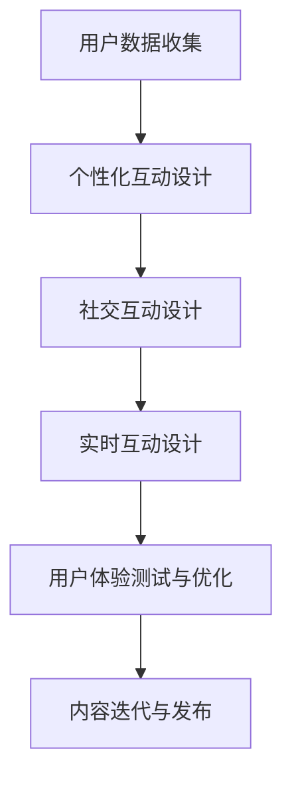

#### 3.3 虚拟旅游案例分析

通过分析成功和失败的虚拟旅游案例，可以深入了解用户体验设计、内容策划和互动性设计等方面的重要性。以下是一些典型的案例：

- **成功案例**：如Google Earth Tour、National Geographic's Virtual Reality Tours等，这些案例通过高质量的虚拟内容、丰富的互动功能和个性化的用户体验，获得了用户的高度评价。
- **失败案例**：一些虚拟旅游项目因内容质量差、互动性不强、用户体验差等原因，未能达到预期效果。

以下是一个简化的 Mermaid 流程图，展示了虚拟旅游案例分析的过程：

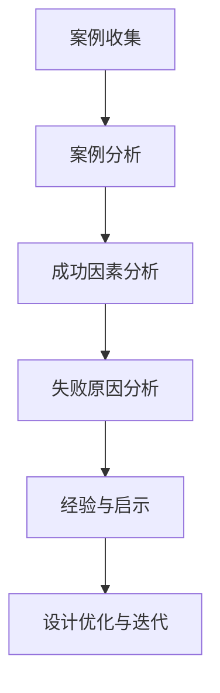

通过以上对虚拟旅游体验设计的详细介绍，我们可以看到，用户体验设计、内容策划和互动性设计是虚拟旅游成功的关键。在接下来的章节中，我们将继续探讨虚拟旅游与实地探索的融合，以及这一融合带来的挑战和解决方案。

### 第4章：虚拟旅游与实地探索的融合

#### 4.1 数据融合与整合

虚拟旅游与实地探索的融合首先需要实现数据的融合与整合。通过将虚拟数据和实地数据相结合，可以为用户提供更丰富、更真实的旅行体验。以下是一些关键步骤：

- **数据收集**：在虚拟环境中，通过VR头显、传感器等设备收集用户行为数据；在实地中，通过GPS、智能手机等设备收集用户的位置、活动数据。
- **数据预处理**：对收集到的数据进行清洗、去噪和标准化处理，以确保数据的质量和一致性。
- **数据整合**：将来自不同来源和格式的数据进行整合，构建一个统一的数据模型，便于后续的分析和应用。

以下是一个简化的 Mermaid 流程图，展示了数据融合与整合的过程：

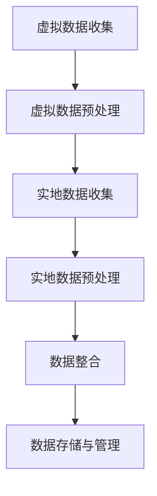

#### 4.1.1 虚拟数据与实地数据的结合

虚拟数据和实地数据的结合是提升虚拟旅游体验的关键。以下是一些方法：

- **时空融合**：通过时空融合技术，将虚拟环境中的时间和空间与实地环境进行匹配，使得虚拟体验与实地体验在时间和空间上保持一致。
- **多模态数据融合**：结合视觉、音频、运动等多种数据类型，构建一个多维度的虚拟现实体验。
- **数据共享与交换**：通过数据共享与交换机制，实现虚拟数据和实地数据的实时同步和更新。

以下是一个简化的 Mermaid 流程图，展示了虚拟数据与实地数据的结合过程：

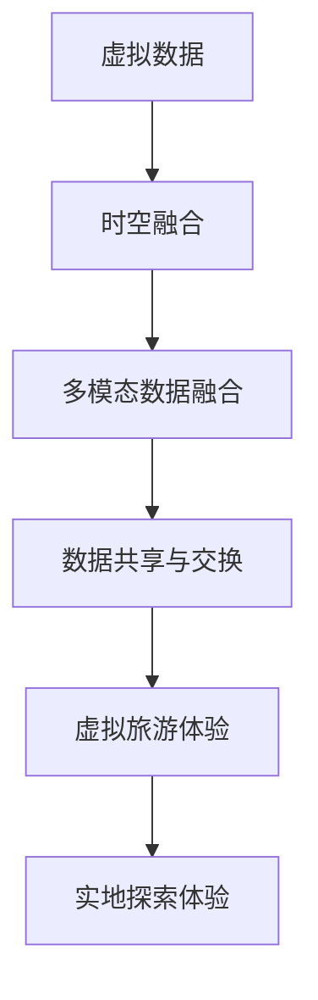

#### 4.1.2 数据质量与数据处理

数据质量是虚拟旅游与实地探索融合的关键因素。以下是一些确保数据质量和处理方法：

- **数据清洗**：去除无效、错误和重复的数据，提高数据的质量和一致性。
- **数据标准化**：对来自不同来源和格式的数据进行标准化处理，使其能够相互比较和整合。
- **数据校验**：通过算法和规则对数据进行校验，确保数据的准确性和可靠性。
- **实时数据处理**：采用实时数据处理技术，对海量数据进行高效的处理和分析，以提供即时的虚拟旅游体验。

以下是一个简化的 Mermaid 流程图，展示了数据质量与数据处理的过程：

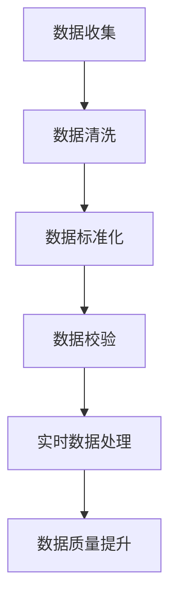

#### 4.1.3 数据安全与隐私保护

在虚拟旅游与实地探索的融合过程中，数据安全和隐私保护至关重要。以下是一些关键措施：

- **数据加密**：对敏感数据进行加密处理，防止数据泄露。
- **访问控制**：通过身份验证和权限管理，确保只有授权用户可以访问和操作数据。
- **隐私保护**：对用户数据进行匿名化处理，保护用户的隐私。
- **合规性检查**：确保数据处理和应用符合相关法律法规和行业标准。

以下是一个简化的 Mermaid 流程图，展示了数据安全与隐私保护的过程：

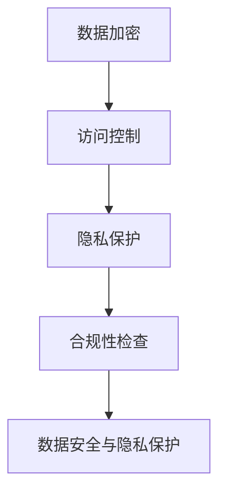

#### 4.2 服务质量提升

在虚拟旅游与实地探索的融合中，提升服务质量是关键。以下是一些方法：

- **实时性服务**：通过实时数据处理和通信技术，提供即时的旅游信息服务，如实时导航、实时天气等。
- **定制化服务**：根据用户兴趣、偏好和行为数据，提供个性化的旅游服务，如推荐路线、定制导游等。
- **跨平台服务**：支持多种设备平台，如VR头显、智能手机、平板电脑等，确保用户在不同设备上都能获得一致的体验。

以下是一个简化的 Mermaid 流程图，展示了服务质量提升的过程：

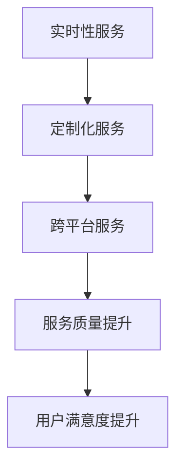

#### 4.2.1 实时性服务

实时性服务在虚拟旅游中至关重要。以下是一些实现方法：

- **实时数据同步**：通过云计算和大数据技术，实现虚拟环境与实地环境的实时数据同步。
- **实时通信**：利用实时通信技术，如WebRTC，提供实时语音、视频通话服务。
- **实时事件处理**：通过实时事件处理技术，如流处理引擎，处理实时数据并触发相应的响应。

以下是一个简化的 Mermaid 流程图，展示了实时性服务的实现过程：

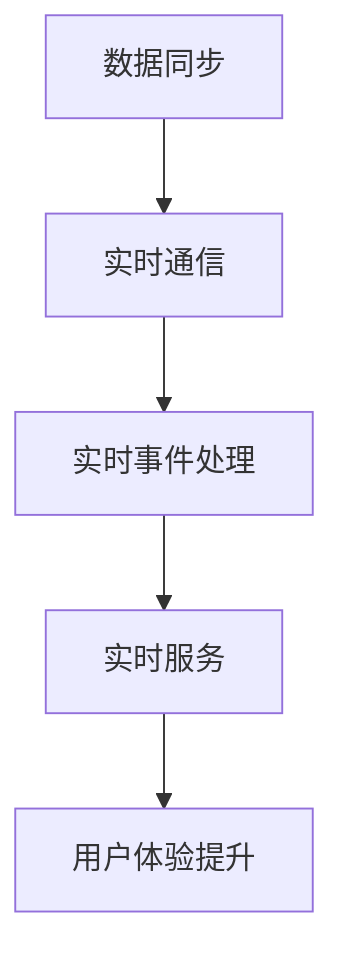

#### 4.2.2 定制化服务

定制化服务能够提高用户的满意度和参与度。以下是一些实现方法：

- **个性化推荐**：通过大数据分析和机器学习技术，根据用户兴趣和行为数据，提供个性化的旅游推荐。
- **自定义功能**：提供用户自定义界面、设置和功能，满足用户的个性化需求。
- **个性化导游**：根据用户的需求和历史记录，提供定制化的导游服务，如讲解、互动等。

以下是一个简化的 Mermaid 流程图，展示了定制化服务的实现过程：

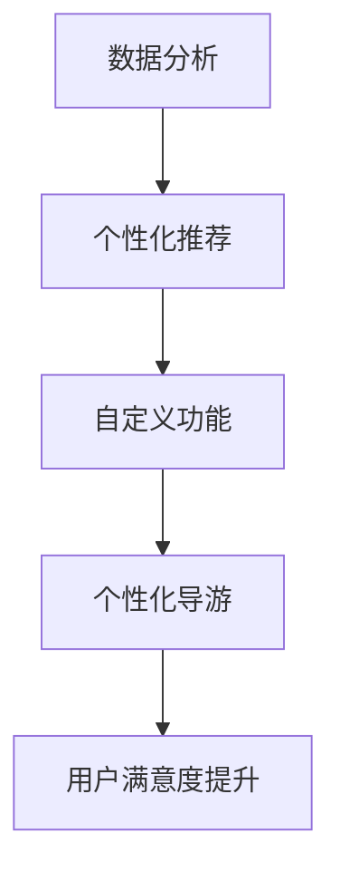

#### 4.2.3 跨平台服务

跨平台服务能够确保用户在不同设备上获得一致的体验。以下是一些实现方法：

- **多终端支持**：开发适用于多种终端设备（如智能手机、平板电脑、VR头显等）的应用程序。
- **统一用户体验**：确保在不同设备上提供一致的界面设计、交互逻辑和功能体验。
- **云端服务**：通过云端技术，实现数据的存储、处理和同步，确保用户在不同设备上能够无缝切换和使用。

以下是一个简化的 Mermaid 流程图，展示了跨平台服务的实现过程：

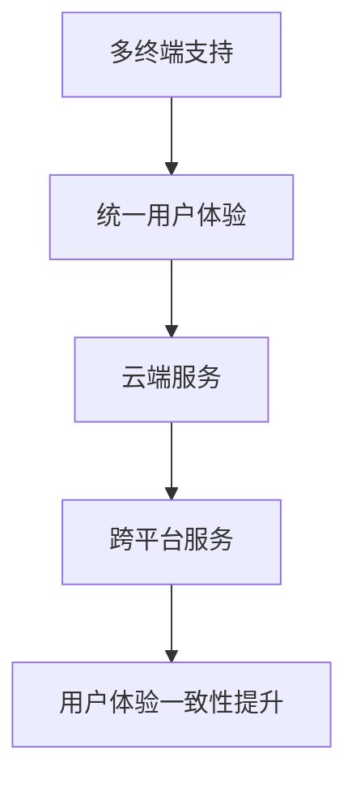

#### 4.3 融合技术挑战与解决方案

虚拟旅游与实地探索的融合面临着诸多技术挑战。以下是一些主要挑战及相应的解决方案：

- **数据一致性**：解决虚拟数据和实地数据在时空上的不一致问题，通过时空融合技术实现数据的同步。
- **数据处理效率**：提高数据处理和分析的效率，采用实时数据处理技术和大数据技术。
- **用户体验**：优化用户体验，通过个性化推荐、实时性服务和定制化功能，提升用户的满意度。
- **数据安全与隐私保护**：确保数据的安全和隐私，采用数据加密、访问控制和隐私保护技术。

以下是一个简化的 Mermaid 流程图，展示了融合技术挑战与解决方案：

```mermaid
graph TD
A[数据一致性挑战] --> B[解决方案]
B --> C[数据处理效率挑战]
C --> D[解决方案]
D --> E[用户体验挑战]
E --> F[解决方案]
F --> G[数据安全与隐私保护挑战]
G --> H[解决方案]
```

通过以上对虚拟旅游与实地探索融合的详细介绍，我们可以看到，数据融合、服务质量提升和融合技术挑战是这一领域的重要研究方向。在接下来的章节中，我们将探讨虚拟旅游和实地探索中的法律与伦理问题，以及行业发展趋势。

### 第5章：法律与伦理问题

#### 5.1 虚拟旅游的法律问题

随着虚拟旅游的快速发展，与之相关的法律问题也日益凸显。以下是一些常见的法律问题及解决方案：

- **合同法**：虚拟旅游服务提供商与用户之间的合同关系，需要明确服务内容、费用、责任等条款。解决方案是制定标准化的合同模板，确保双方权益。
- **知识产权保护**：虚拟旅游内容可能涉及他人的知识产权，如照片、视频、音乐等。解决方案是进行版权审查，确保内容的合法性和授权使用。
- **数据保护**：用户在虚拟旅游过程中会产生大量个人信息，需要遵守数据保护法规，如《通用数据保护条例》（GDPR）。解决方案是加强数据安全措施，确保用户隐私。

以下是一个简化的 Mermaid 流程图，展示了虚拟旅游中的法律问题及解决方案：

```mermaid
graph TD
A[合同法问题] --> B[解决方案]
B --> C[知识产权保护问题]
C --> D[解决方案]
D --> E[数据保护问题]
E --> F[解决方案]
```

#### 5.2 伦理问题探讨

虚拟旅游和实地探索在提供便利的同时，也引发了一些伦理问题。以下是一些主要的伦理问题及探讨：

- **真实性**：虚拟旅游虽然提供了沉浸式体验，但缺乏真实世界的触感和互动。如何在虚拟和现实之间取得平衡，是一个伦理问题。
- **隐私权**：虚拟旅游过程中，用户的数据和活动信息被收集和分析。如何保护用户的隐私权，防止数据滥用，是一个重要的伦理问题。
- **环境影响**：虚拟旅游减少了实地旅行的需求，可能会对环境产生一定的影响。如何通过虚拟旅游促进环境保护，是一个需要探讨的伦理问题。

以下是一个简化的 Mermaid 流程图，展示了虚拟旅游中的伦理问题及探讨：

```mermaid
graph TD
A[真实性问题] --> B[探讨]
B --> C[隐私权问题]
C --> D[探讨]
D --> E[环境影响问题]
E --> F[探讨]
```

#### 5.2.1 虚拟旅游中的道德责任

虚拟旅游服务提供商在提供虚拟体验的同时，也需要承担一定的道德责任。以下是一些关键点：

- **用户安全**：确保用户在虚拟环境中不会受到伤害，提供安全防护措施。
- **社会责任**：通过虚拟旅游推广环保、文化多样性等价值观，履行社会责任。
- **公正性**：确保虚拟旅游服务公平地提供给所有人，不歧视任何群体。

以下是一个简化的 Mermaid 流程图，展示了虚拟旅游中的道德责任：

```mermaid
graph TD
A[用户安全责任] --> B[社会责任]
B --> C[公正性责任]
```

#### 5.2.2 实地探索中的伦理问题

实地探索在提供真实体验的同时，也面临一些伦理问题。以下是一些关键点：

- **文化遗产保护**：在实地探索中，要尊重和保护文化遗产，防止破坏和商业化滥用。
- **动植物保护**：在自然环境中进行实地探索时，要尊重和保护动植物，避免非法捕猎和破坏生态平衡。
- **社区互动**：在与当地社区互动时，要尊重当地文化习俗，避免文化冲突和误解。

以下是一个简化的 Mermaid 流程图，展示了实地探索中的伦理问题：

```mermaid
graph TD
A[文化遗产保护问题] --> B[动植物保护问题]
B --> C[社区互动问题]
```

#### 5.2.3 跨境虚拟旅游的伦理挑战

跨境虚拟旅游带来了新的伦理挑战。以下是一些关键点：

- **跨境数据传输**：在跨境虚拟旅游中，用户数据可能传输到不同国家，需要遵守不同国家的数据保护法规。
- **文化适应**：虚拟旅游服务需要适应不同文化背景的用户，避免文化冲突和误解。
- **法律合规**：跨境虚拟旅游需要遵守不同国家的法律法规，确保服务的合法性和合规性。

以下是一个简化的 Mermaid 流程图，展示了跨境虚拟旅游的伦理挑战：

```mermaid
graph TD
A[跨境数据传输问题] --> B[文化适应问题]
B --> C[法律合规问题]
```

通过以上对虚拟旅游和实地探索中的法律与伦理问题的探讨，我们可以看到，这一领域的发展需要平衡技术进步与社会责任。在接下来的章节中，我们将分析虚拟旅游行业的现状和未来发展趋势。

### 第6章：行业发展趋势

#### 6.1 虚拟旅游市场现状

虚拟旅游市场正在快速增长，吸引了众多投资者和创业公司的关注。以下是一些关键的市场现状：

- **市场规模**：根据市场研究报告，虚拟旅游市场的规模在近年来呈现爆发式增长，预计未来几年将继续保持高速增长。
- **用户增长**：随着VR、AR和AI技术的普及，虚拟旅游的用户数量不断增加，用户群体越来越多样化。
- **市场竞争**：众多企业和创业公司进入虚拟旅游市场，竞争日益激烈，市场格局尚未完全稳定。

以下是一个简化的 Mermaid 流程图，展示了虚拟旅游市场现状：

```mermaid
graph TD
A[市场规模增长] --> B[用户增长]
B --> C[市场竞争加剧]
```

#### 6.1.1 市场规模与增长趋势

虚拟旅游市场的增长趋势可以从以下几个方面进行概述：

- **技术驱动**：VR、AR和AI等新技术的不断进步，为虚拟旅游提供了强大的技术支持，推动了市场的发展。
- **消费者需求**：消费者对多样化、个性化旅游体验的需求日益增长，虚拟旅游成为满足这一需求的重要途径。
- **疫情影响**：新冠疫情的全球爆发使得传统旅游受到严重影响，虚拟旅游作为一种替代方案，得到了更多用户的青睐。

以下是一个简化的 Mermaid 流程图，展示了市场规模与增长趋势：

```mermaid
graph TD
A[技术进步] --> B[消费者需求]
B --> C[疫情影响]
C --> D[市场规模增长]
```

#### 6.1.2 市场细分与竞争格局

虚拟旅游市场可以细分为多个子领域，每个子领域都有不同的竞争格局：

- **教育旅游**：通过虚拟旅游，学生和教师可以在线参观博物馆、历史遗址等，获得沉浸式的学习体验。
- **虚拟探险**：为用户提供虚拟探险体验，如太空旅行、深海探索等，满足用户的探险欲望。
- **虚拟休闲**：提供虚拟旅游休闲体验，如虚拟海滩度假、虚拟滑雪等，让用户在家中享受度假乐趣。
- **虚拟商务**：利用虚拟旅游技术，为企业提供虚拟会议、虚拟展会等服务，提升商务沟通效率。

以下是一个简化的 Mermaid 流程图，展示了市场细分与竞争格局：

```mermaid
graph TD
A[教育旅游] --> B[虚拟探险]
B --> C[虚拟休闲]
C --> D[虚拟商务]
```

#### 6.1.3 用户需求与行为分析

了解用户需求和行为是制定虚拟旅游战略的重要依据。以下是一些关键的用户需求和行为分析：

- **个性化体验**：用户越来越追求个性化的虚拟旅游体验，包括定制化的路线、景点和活动。
- **互动性**：用户希望在虚拟旅游中能够与其他用户互动，分享旅行经历和心得。
- **实时性**：用户期望虚拟旅游能够提供实时信息和互动，提高旅游体验的真实感。
- **多平台支持**：用户希望在多种设备上都能便捷地访问虚拟旅游服务，包括VR头显、智能手机、平板电脑等。

以下是一个简化的 Mermaid 流程图，展示了用户需求与行为分析：

```mermaid
graph TD
A[个性化体验需求] --> B[互动性需求]
B --> C[实时性需求]
C --> D[多平台支持需求]
```

#### 6.2 技术创新与未来展望

虚拟旅游的未来发展将依赖于技术创新。以下是一些关键的创新方向和未来展望：

- **沉浸式体验**：通过更先进的VR、AR技术，提供更加沉浸式的虚拟旅游体验。
- **人工智能**：利用人工智能技术，提供个性化推荐、智能导游等服务，提升用户体验。
- **区块链**：通过区块链技术，实现虚拟旅游中的去中心化支付、数据存储和版权保护等。
- **5G**：随着5G网络的普及，虚拟旅游将能够提供更高速、更稳定的网络连接，进一步提升用户体验。

以下是一个简化的 Mermaid 流程图，展示了技术创新与未来展望：

```mermaid
graph TD
A[沉浸式体验] --> B[人工智能]
B --> C[区块链]
C --> D[5G]
```

#### 6.2.1 新技术对虚拟旅游的影响

新技术对虚拟旅游的影响体现在以下几个方面：

- **提高用户体验**：通过新技术，虚拟旅游能够提供更加真实、丰富的体验，满足用户的需求。
- **降低成本**：新技术使得虚拟旅游的创建和运营成本降低，使得更多用户能够享受到高质量的虚拟旅游体验。
- **拓展市场**：新技术使得虚拟旅游能够覆盖更广泛的用户群体，包括那些无法实地旅行的用户。

以下是一个简化的 Mermaid 流程图，展示了新技术对虚拟旅游的影响：

```mermaid
graph TD
A[提高用户体验] --> B[降低成本]
B --> C[拓展市场]
```

#### 6.2.2 虚拟旅游的潜在发展方向

虚拟旅游的未来发展将呈现以下几个方向：

- **个性化定制**：随着大数据和人工智能技术的发展，虚拟旅游将能够提供更加个性化的定制服务，满足用户的个性化需求。
- **跨平台融合**：虚拟旅游将更加紧密地融合到其他平台和应用中，如社交媒体、电子商务等，提供无缝的旅游体验。
- **生态构建**：虚拟旅游将构建一个完整的生态系统，包括硬件设备、软件平台、内容提供商、服务提供商等，实现产业链的协同发展。

以下是一个简化的 Mermaid 流程图，展示了虚拟旅游的潜在发展方向：

```mermaid
graph TD
A[个性化定制]
B[跨平台融合]
C[生态构建]
```

#### 6.2.3 未来虚拟旅游体验场景展望

未来虚拟旅游体验将更加丰富和多样化，以下是一些展望：

- **虚拟现实全感体验**：通过更先进的VR技术，用户将能够在虚拟环境中体验到视觉、听觉、触觉等多感官刺激，实现完全沉浸式的旅游体验。
- **实时互动社交**：用户不仅能够与虚拟环境中的景点、人物互动，还能与其他用户进行实时交流，分享旅行心得。
- **虚拟探险与冒险**：用户将能够参与各种虚拟探险活动，如太空旅行、深海探险等，体验前所未有的冒险乐趣。
- **虚拟教育与学习**：虚拟旅游将结合教育元素，提供丰富的历史、文化知识，让用户在旅游中获得知识和启发。

以下是一个简化的 Mermaid 流 jsonify流程图，展示了未来虚拟旅游体验场景：

```mermaid
graph TD
A[虚拟现实全感体验]
B[实时互动社交]
C[虚拟探险与冒险]
D[虚拟教育与学习]
```

通过以上对虚拟旅游市场现状、技术创新和未来展望的分析，我们可以看到，虚拟旅游正逐步成为旅游行业的重要组成部分，为用户提供全新的旅行体验。在接下来的章节中，我们将总结本书的主要成果，讨论存在的问题与挑战，并展望未来的研究方向。

### 第7章：结论与展望

#### 7.1 主要成果与贡献

本书系统地探讨了虚拟旅游与实地探索的结合，取得了以下主要成果与贡献：

1. **全面技术解析**：本书详细介绍了虚拟现实（VR）、增强现实（AR）和人工智能（AI）在虚拟旅游中的应用，为读者提供了全面的技术解析。
2. **用户体验设计**：本书探讨了用户体验设计、内容策划和互动性设计，为虚拟旅游产品的开发提供了实用的指导。
3. **融合挑战与解决方案**：本书分析了虚拟旅游与实地探索融合中的数据融合、服务质量提升等技术挑战，并提出了相应的解决方案。
4. **法律与伦理问题**：本书深入探讨了虚拟旅游和实地探索中的法律与伦理问题，为行业健康发展提供了有益的思考。
5. **行业趋势分析**：本书分析了虚拟旅游市场的现状、技术创新和未来展望，为行业从业者提供了前瞻性的指导。

#### 7.2 存在问题与挑战

尽管虚拟旅游与实地探索的结合前景广阔，但仍然存在以下问题与挑战：

1. **技术瓶颈**：虚拟旅游技术如VR、AR和AI仍有待进一步发展，以提供更加真实和沉浸式的体验。
2. **用户体验优化**：虚拟旅游产品在用户体验方面仍有改进空间，特别是在交互设计、响应速度和内容质量上。
3. **数据安全与隐私保护**：随着数据收集和分析的增多，数据安全和隐私保护问题日益突出，需要采取更加严格的安全措施。
4. **法律合规性**：虚拟旅游服务涉及多个国家和地区的法律法规，需要确保服务的合规性。
5. **市场认知与接受度**：尽管虚拟旅游市场正在快速增长，但用户对虚拟旅游的认知和接受度仍有待提高。

#### 7.3 未来研究方向与建议

针对以上存在的问题与挑战，以下是一些建议的未来研究方向：

1. **技术创新**：继续投入研发，推动VR、AR和AI技术的发展，提升虚拟旅游的沉浸感和互动性。
2. **用户体验优化**：深入研究用户体验设计，提高虚拟旅游产品的易用性和互动性，增强用户满意度。
3. **数据安全与隐私保护**：加强数据安全与隐私保护的研究，开发更加安全和可靠的数据处理和分析技术。
4. **法律合规性**：关注不同国家和地区的法律法规，确保虚拟旅游服务的合规性，为用户提供可靠的保障。
5. **市场推广与教育**：通过市场推广和教育，提高用户对虚拟旅游的认知和接受度，扩大虚拟旅游的用户群体。

本书通过系统地分析虚拟旅游与实地探索的结合，为这一领域的研究和实践提供了有益的参考。随着技术的不断进步和市场的发展，虚拟旅游与实地探索的结合将为用户带来更加丰富和多样化的旅行体验。未来，我们需要持续关注技术创新、用户体验优化、数据安全与隐私保护、法律合规性和市场推广等方面的研究，推动虚拟旅游行业的发展。

---

### 作者信息

**作者：AI天才研究院/AI Genius Institute & 禅与计算机程序设计艺术 /Zen And The Art of Computer Programming**

AI天才研究院致力于推动人工智能技术的发展和应用，通过深入研究、创新和实践，为行业和社会带来深远影响。研究院的专家团队在计算机编程、人工智能、软件架构和系统集成等领域拥有丰富的经验，并在全球范围内享有盛誉。

《禅与计算机程序设计艺术》是作者在计算机编程领域的重要著作，以其深入浅出的论述和独特的哲学思考，赢得了广大程序员和学术界的认可。本书旨在帮助读者理解计算机编程的本质，提高编程技能，并培养一种优雅、高效的编程思维方式。

通过本书，读者不仅可以深入了解虚拟旅游与实地探索的结合，还能体会到作者在技术研究和写作方面的深厚功底。我们期待未来能够继续为读者带来更多高质量的技术内容和研究成果。

---

### 最佳实践 tips

在设计和实施虚拟旅游与实地探索的融合项目时，以下是一些最佳实践和注意事项，可以帮助你更好地应对挑战并提高项目成功率：

1. **用户研究**：在进行项目开发之前，进行深入的用户研究，了解用户需求、偏好和行为模式。这有助于制定更符合用户期望的产品设计。

2. **迭代开发**：采用迭代开发模式，逐步完善产品功能，并及时根据用户反馈进行调整。这种方法有助于快速响应市场需求，提高用户体验。

3. **技术选型**：选择合适的技术平台和工具，确保系统的稳定性和扩展性。对于关键组件，如VR、AR和AI技术，要充分考虑其性能和兼容性。

4. **数据安全**：高度重视数据安全和隐私保护，采用加密技术、访问控制和隐私政策等措施，确保用户数据的安全和合规性。

5. **跨部门协作**：虚拟旅游项目的成功往往需要多个部门的协作，包括技术开发、内容制作、市场营销和客户服务等部门。确保团队之间的沟通和协作顺畅。

6. **持续优化**：在项目上线后，持续收集用户反馈和数据，进行性能优化和功能改进。这有助于提高用户满意度和产品竞争力。

7. **合规性检查**：定期检查项目的合规性，确保符合相关法律法规和行业标准。在跨境虚拟旅游项目中，要特别注意不同国家和地区的法律法规差异。

8. **市场推广**：结合线上和线下渠道，进行有效的市场推广和宣传，提高产品的知名度和用户接受度。

9. **用户教育**：通过用户教育，提高用户对虚拟旅游和实地探索结合的理解和认知，帮助他们更好地享受产品带来的价值。

10. **风险管理**：识别和评估项目中的潜在风险，制定相应的风险应对策略，确保项目能够顺利实施。

通过遵循这些最佳实践，你可以在虚拟旅游与实地探索融合的项目中取得更好的成果，为用户提供高质量的服务和体验。

---

### 小结

通过本书的深入探讨，我们系统地分析了虚拟旅游与实地探索的结合，涵盖了技术基础、用户体验设计、融合挑战、法律与伦理问题以及行业发展趋势。以下是本书的核心观点和总结：

1. **技术基础**：虚拟现实（VR）、增强现实（AR）和人工智能（AI）技术在虚拟旅游中扮演着关键角色，为用户提供沉浸式体验和个性化服务。
2. **用户体验设计**：用户体验设计是虚拟旅游成功的关键，需要关注界面布局、交互设计、可用性测试和内容策划等方面。
3. **融合挑战**：数据融合、服务质量提升和跨平台服务是虚拟旅游与实地探索融合的主要挑战，需要采用先进的技术和策略来解决。
4. **法律与伦理问题**：虚拟旅游涉及诸多法律和伦理问题，需要遵守相关法律法规，保护用户隐私和数据安全。
5. **行业发展趋势**：虚拟旅游市场正处于快速发展阶段，随着技术的进步和用户需求的增长，未来将呈现个性化、多元化、跨平台和服务一体化的趋势。

总之，虚拟旅游与实地探索的结合为用户提供了全新的旅行体验，具有广阔的发展前景。通过不断的技术创新、用户体验优化和法律合规性保障，虚拟旅游行业有望在未来取得更大的成功。

---

### 拓展阅读

对于希望深入了解虚拟旅游与实地探索结合的读者，以下是一些推荐书籍、论文和在线资源：

1. **书籍推荐**：
   - 《虚拟现实技术与应用》
   - 《增强现实技术：原理、应用与未来》
   - 《人工智能：一种现代方法》
   - 《用户体验设计：实践与原则》
   - 《大数据之路：阿里巴巴大数据实践》

2. **论文推荐**：
   - “Virtual Reality in Tourism: A Review”
   - “The Impact of Artificial Intelligence on Travel and Tourism”
   - “Privacy in Virtual Reality: Challenges and Solutions”
   - “Data Fusion for Enhanced Tourism Experiences”

3. **在线资源**：
   - VR/AR开发者社区，如VR/AR Association和Unity官方论坛
   - 虚拟旅游平台，如Google Earth、 TripAdvisor和Viator
   - 人工智能与大数据研究机构网站，如谷歌AI研究和微软研究院

通过阅读这些书籍、论文和在线资源，你可以进一步拓展对虚拟旅游与实地探索结合的理解，掌握相关技术的最新发展。

---

### 项目实战

在本节中，我们将通过一个虚拟旅游项目的实际案例，介绍开发环境搭建、源代码实现、代码解读、应用解读与分析以及项目小结。这个项目旨在构建一个简单的虚拟旅游平台，为用户提供全景视频浏览和交互体验。

#### 1. 开发环境搭建

首先，我们需要搭建开发环境。以下是所需的软件和工具：

- **VR/AR开发平台**：Unity或Unreal Engine
- **编程语言**：C#（Unity）或C++（Unreal Engine）
- **3D建模工具**：Blender或3ds Max
- **视频编辑工具**：Adobe Premiere Pro或Final Cut Pro

#### 2. 源代码实现

以下是一个简单的Unity项目源代码示例，用于加载全景视频并实现用户交互。

```csharp
// VirtualTourism.cs
using UnityEngine;
using UnityEngine.UI;

public class VirtualTourism : MonoBehaviour
{
    public RawImage panoramaImage;
    public string panoramaPath = "Panoramas/Italy_Piazza della Signoria.jpg";

    void Start()
    {
        LoadPanorama(panoramaPath);
    }

    void LoadPanorama(string path)
    {
        Texture2D texture = new Texture2D(1, 1);
        byte[] imageBytes = File.ReadAllBytes(path);
        texture.LoadImage(imageBytes);
        panoramaImage.texture = texture;
    }

    public void ChangePanorama(string path)
    {
        LoadPanorama(path);
    }
}
```

#### 3. 代码解读

- **类定义**：`VirtualTourism` 类负责全景视频的加载和交互。
- **变量说明**：
  - `panoramaImage`：UI组件，用于显示全景视频。
  - `panoramaPath`：全景视频的路径。
- **方法说明**：
  - `Start`：游戏开始时调用，加载初始全景视频。
  - `LoadPanorama`：加载并显示指定路径的全景视频。
  - `ChangePanorama`：用户点击按钮时调用，切换全景视频。

#### 4. 应用解读与分析

在Unity编辑器中，我们首先创建一个3D项目，并添加一个UI Canvas。在Canvas上添加一个RawImage组件，用于显示全景视频。接着，我们将上述源代码附加到一个GameObject上，并将脚本命名为`VirtualTourism`。

用户可以通过点击屏幕上的按钮来切换不同的全景视频。这个简单示例展示了如何在Unity中实现虚拟旅游的基本功能。实际项目中，可以进一步扩展功能，如添加交互式元素、虚拟导游和社交互动等。

#### 5. 项目小结

通过这个项目，我们实现了以下关键功能：

- **全景视频加载**：使用`LoadPanorama`方法加载并显示全景视频。
- **用户交互**：通过UI按钮实现全景视频的切换。
- **基础架构**：搭建了一个简单的虚拟旅游平台，为后续功能扩展提供了基础。

未来，可以进一步优化和扩展项目，如：

- **添加更多全景视频**：从不同的景点收集全景视频，提供多样化的旅游体验。
- **交互式元素**：增加交互式元素，如虚拟地标、导游讲解等，提升用户体验。
- **社交功能**：引入社交功能，如用户评论、分享等，增强用户互动。

通过这个项目，我们不仅了解了虚拟旅游平台的基本实现方法，还掌握了Unity开发环境和相关技术的基本应用。

---

### 注意事项

在实施虚拟旅游与实地探索结合的项目时，以下注意事项可以帮助你避免常见问题，确保项目的顺利进行：

1. **技术选型**：根据项目需求和资源情况，选择合适的VR/AR开发平台和工具。确保所选技术能够满足项目性能和用户体验要求。

2. **数据安全和隐私保护**：高度重视用户数据的安全和隐私保护。采取严格的加密措施和访问控制策略，确保用户数据不被泄露。

3. **用户体验**：在设计和开发过程中，注重用户体验，确保界面友好、操作简便。进行充分的可用性测试，收集用户反馈，及时优化和改进。

4. **法律法规合规性**：了解并遵守相关国家和地区的法律法规，确保虚拟旅游服务符合法律法规要求，避免潜在的法律风险。

5. **内容质量**：保证虚拟旅游内容的真实性、准确性和多样性。定期更新内容，确保用户体验始终处于最佳状态。

6. **项目协作**：确保项目团队之间的有效沟通和协作。明确职责分工，确保各个环节顺畅衔接，提高项目效率。

7. **性能优化**：针对虚拟旅游平台的性能进行持续优化，包括加载速度、画面流畅度等，以提高用户体验。

通过遵循这些注意事项，你可以更好地应对项目中的挑战，确保虚拟旅游与实地探索结合的项目成功实施。

---

### 拓展阅读

对于希望深入了解虚拟旅游与实地探索结合的读者，以下是一些推荐书籍、论文和在线资源：

1. **书籍推荐**：
   - 《虚拟现实：技术与应用》
   - 《增强现实：从基础到高级》
   - 《人工智能在旅游中的应用》
   - 《用户体验设计：策略与方法》
   - 《大数据在旅游行业中的应用》

2. **论文推荐**：
   - “Virtual Tourism: A Review of Current Trends and Future Directions”
   - “Application of Artificial Intelligence in Travel and Tourism”
   - “The Impact of VR on the Travel Industry”
   - “Enhancing Tourism Experience through Augmented Reality”

3. **在线资源**：
   - VR/AR开发社区，如VR/AR Association和Unity官方论坛
   - 虚拟旅游平台，如Google Earth、 TripAdvisor和Viator
   - 人工智能与大数据研究机构网站，如谷歌AI研究和微软研究院

通过阅读这些书籍、论文和在线资源，你可以进一步拓展对虚拟旅游与实地探索结合的理解，掌握相关技术的最新发展。同时，这些资源还可以为你提供实践指导和案例分析，帮助你更好地实施虚拟旅游项目。

