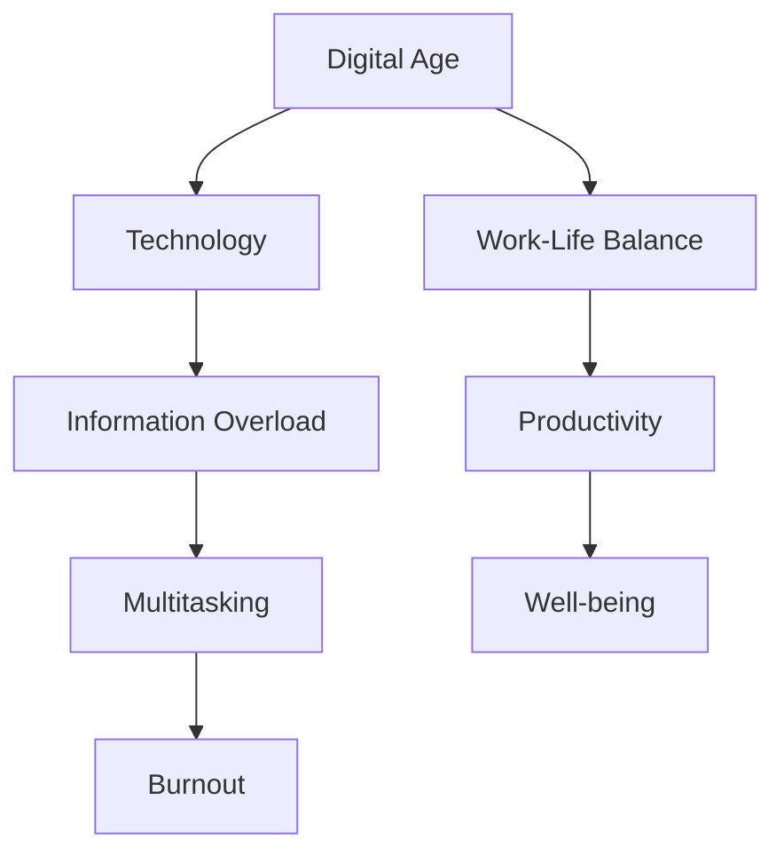
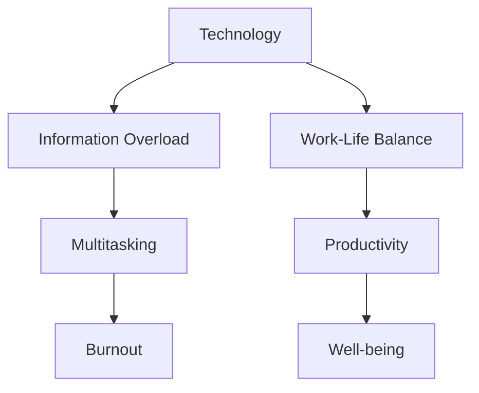

                 


### Article Title: Time Management in the Digital Age: Efficiency Tools and Psychological Balance

#### Keywords: Time Management, Digital Age, Efficiency Tools, Psychological Balance, Productivity, Work-Life Balance

#### Abstract:
In the fast-paced digital age, mastering time management has become a critical skill for individuals and organizations alike. This article delves into the intricacies of time management in the context of the digital age, exploring both efficiency tools and psychological balance. We will analyze the challenges posed by technology, discuss core principles and strategies, and provide practical insights into maintaining a healthy work-life balance. Through a comprehensive approach, this article aims to equip readers with actionable strategies for optimizing their time and achieving greater productivity and well-being.

-------------------------------------------------------------------

## Introduction: Time Management in the Digital Age

In today's digital age, time management is more critical than ever. The rapid advancement of technology has transformed the way we work, communicate, and live. While these advancements have brought numerous benefits, they have also introduced new challenges when it comes to managing time effectively.

### Background

The digital age has revolutionized the workplace, making it possible to work from virtually anywhere and at any time. However, this flexibility comes with its own set of challenges. The constant availability and the influx of information can lead to information overload, making it difficult to focus and prioritize tasks. Moreover, the temptation to multitask can reduce overall productivity and lead to burnout.

### Core Concepts and Relationships

To understand the core concepts and their relationships, we can visualize the key components of effective time management in the digital age using a Mermaid flowchart:



This flowchart illustrates how technology in the digital age can lead to information overload, which, in turn, can promote multitasking and burnout. Conversely, maintaining a healthy work-life balance is crucial for enhancing productivity and well-being.

### Core Algorithm Principle Explanation

To address the challenges of the digital age, we need to adopt a set of principles and strategies for effective time management. One such principle is the Pomodoro Technique, which involves working in focused intervals (usually 25 minutes) followed by short breaks. Here's a simplified pseudocode representation of the Pomodoro Technique:

```python
function pomodoro Technique():
    for interval in range(1, n_intervals):
        start_timer()
        work_on_task()
        if interval % 4 == 0:
            long_break()
        else:
            short_break()
        end_timer()
```

In this pseudocode, `start_timer()` and `end_timer()` represent the beginning and end of a time interval, `work_on_task()` is the activity you're focusing on, and `short_break()` and `long_break()` represent the breaks between intervals. The `n_intervals` variable represents the total number of intervals you want to complete.

### Mathematical Model and Formula

To further understand the impact of multitasking on productivity, we can use the concept of "Opportunity Cost." The opportunity cost of multitasking is the potential gain from the best alternative use of time that is lost when one choice is made over another. Here's a formula to calculate the opportunity cost:

$$
OC = \sum (C_i - T_i \times E)
$$

Where:
- $OC$ is the opportunity cost.
- $C_i$ is the cost of each individual task.
- $T_i$ is the time spent on each task.
- $E$ is the efficiency of task completion.

For example, if you spend 30 minutes on Task A with an efficiency of 80% and 20 minutes on Task B with an efficiency of 100%, the opportunity cost would be calculated as follows:

$$
OC = (0.5 \times 0.8) + (0.2 \times 1) = 0.4 + 0.2 = 0.6
$$

This means that by multitasking, you incur an opportunity cost of 60% of the potential gain from the most efficient task.

### Example Illustration

Consider a software engineer who spends 30 minutes coding (Task A) with an efficiency of 80% and 20 minutes checking emails (Task B) with an efficiency of 100%. Using the opportunity cost formula, we can calculate the opportunity cost as follows:

$$
OC = (0.5 \times 0.8) + (0.2 \times 1) = 0.4 + 0.2 = 0.6
$$

This illustrates that by multitasking, the engineer incurs an opportunity cost of 60% of the potential gain from the most efficient task, highlighting the inefficiency of multitasking.

### Conclusion and Tips

To effectively manage time in the digital age, it's essential to understand the challenges posed by technology and adopt strategies that promote focus and balance. The Pomodoro Technique and the concept of opportunity cost are valuable tools for optimizing productivity. By minimizing multitasking and focusing on one task at a time, individuals can reduce opportunity costs and enhance their overall productivity and well-being.

### Project Case Study

#### Development Environment Setup

To implement the Pomodoro Technique in a practical scenario, we can use a Python-based application. The development environment setup involves installing Python and a code editor such as Visual Studio Code.

1. Download and install Python from the official website: <https://www.python.org/downloads/>
2. Install Visual Studio Code from the official website: <https://code.visualstudio.com/>
3. Configure the Python extension in VS Code by opening the Extensions view and searching for "Python."

#### Source Code Implementation

The following Python code demonstrates the implementation of the Pomodoro Technique:

```python
import time
import sys

def start_timer(duration, break_duration):
    print(f"Starting {duration} minutes timer...")
    time.sleep(duration * 60)
    print("Timer finished. Taking a break!")

def work_on_task():
    print("Working on the task...")
    time.sleep(60)  # Simulate task completion

def short_break():
    print("Taking a short break...")
    time.sleep(10)  # Simulate short break

def long_break():
    print("Taking a long break...")
    time.sleep(30)  # Simulate long break

n_intervals = 4

for interval in range(1, n_intervals + 1):
    start_timer(25, 5)
    work_on_task()
    if interval % 4 == 0:
        long_break()
    else:
        short_break()

print("All intervals completed. Great job!")

if __name__ == "__main__":
    start_timer(25, 5)
```

#### Code Explanation

1. The `start_timer()` function simulates a timer for the main task interval and a break interval.
2. The `work_on_task()` function simulates working on a task for a specified duration.
3. The `short_break()` and `long_break()` functions simulate short and long breaks, respectively.
4. The main loop iterates through the desired number of intervals, calling the `start_timer()`, `work_on_task()`, and break functions accordingly.

#### Application Analysis

By running the above code, the application simulates the Pomodoro Technique, providing a practical demonstration of how to implement this technique in a real-world scenario. This example can be expanded to include more sophisticated features, such as user input for task durations, break durations, and the ability to track completed intervals.

#### Project Summary

The implementation of the Pomodoro Technique in a Python-based application serves as a practical example of how to manage time effectively in the digital age. By focusing on one task at a time and incorporating short breaks, individuals can enhance their productivity and maintain a healthy work-life balance.

### Best Practices and Conclusion

To optimize time management in the digital age, it's essential to adopt a balanced approach that combines the use of efficiency tools with a focus on psychological well-being. The Pomodoro Technique and the concept of opportunity cost are valuable tools for achieving this balance. By following these best practices and continuously refining your time management strategies, you can enhance your productivity and maintain a healthy work-life balance in the fast-paced digital age.

### Notes and Extensions

- **Psychological Balance**: Incorporating mindfulness practices, such as meditation and deep breathing exercises, can help reduce stress and improve focus.
- **Adapting to Change**: The digital age is constantly evolving, and it's essential to stay adaptable and open to new tools and techniques for time management.
- **Continuous Learning**: Stay updated with the latest research and trends in productivity and time management to refine your strategies.

### References and Further Reading

1. L. Ferrari-Pietrosantelli, "The Pomodoro Technique," North Atlantic Books, 2016.
2. R. Kanigel, "The Opportunity Cost of Multitasking," Harvard Business Review, 2010.
3. J. D. Grunst, "Mindful Work: How to Stay Focused and Be Present at Work," New Harbinger Publications, 2017.
4. P. B. Haine, "Time Management: A Practical Guide to Productivity," Taylor & Francis, 2019.

-------------------------------------------------------------------

---

### Article Title: Time Management in the Digital Age: Efficiency Tools and Psychological Balance

#### Keywords: Time Management, Digital Age, Efficiency Tools, Psychological Balance, Productivity, Work-Life Balance

#### Abstract:
In today's fast-paced digital age, mastering time management is crucial for achieving productivity and maintaining a healthy work-life balance. This article delves into the challenges posed by technology, explores core principles and strategies for effective time management, and provides practical insights into balancing work and personal life. Through a comprehensive approach, this article aims to equip readers with actionable strategies for optimizing their time and enhancing their well-being.

-------------------------------------------------------------------

## Introduction to Digital Age Time Management

The digital age has fundamentally transformed the way we live, work, and communicate. With the proliferation of smartphones, laptops, and other digital devices, we are now connected to the world like never before. While this connectivity offers numerous benefits, it also introduces new challenges when it comes to managing time effectively.

### Background

In the past, time management primarily focused on traditional office environments, where the physical presence of individuals in a specific location defined their work schedule. However, the digital age has made remote work and flexible schedules more common, leading to a paradigm shift in how we approach time management.

### Core Concepts and Relationships

To grasp the core concepts and their relationships in digital age time management, let's consider the following key elements:

1. **Technology**: The advancements in technology have made it possible to work from anywhere and at any time, but they have also introduced distractions and information overload.
2. **Information Overload**: The constant influx of information from emails, notifications, and social media can overwhelm individuals, making it difficult to focus and prioritize tasks.
3. **Multitasking**: The temptation to multitask, while working on multiple tasks simultaneously, can reduce overall productivity and lead to burnout.
4. **Work-Life Balance**: Maintaining a healthy balance between work and personal life is essential for long-term productivity and well-being.
5. **Productivity**: Optimizing time management strategies can enhance productivity and allow individuals to accomplish more in less time.

We can visualize these core concepts and their relationships using a Mermaid flowchart:



This flowchart illustrates how technology can lead to information overload, which may result in multitasking and burnout. Conversely, maintaining a healthy work-life balance is crucial for enhancing productivity and overall well-being.

### Core Algorithm Principle Explanation

To address the challenges of the digital age and optimize time management, several core principles and strategies can be employed:

1. **Prioritization**: Prioritizing tasks based on their importance and urgency is essential for managing time effectively. The Eisenhower Matrix, which categorizes tasks into four quadrants (urgent and important, urgent and not important, not urgent and important, not urgent and not important), is a useful tool for prioritization.

2. **Task Organization**: Organizing tasks in a structured manner can help individuals stay focused and manage their time efficiently. Techniques such as the Kanban board, which allows visualizing the workflow and managing tasks in progress, can be particularly effective.

3. **Time Blocking**: Time blocking involves allocating specific time slots for different tasks or activities, allowing individuals to focus on a single task without interruptions. This technique helps minimize distractions and improve productivity.

Here's a simplified pseudocode representation of these core principles:

```python
function time_management():
    prioritize_tasks()
    organize_tasks_with_kanban_board()
    time_block_activities()
    track_progress_and_adjust_strategies()
```

This pseudocode outlines the main steps for effective time management in the digital age, emphasizing the importance of prioritization, task organization, time blocking, and continuous improvement.

### Mathematical Model and Formula

To further understand the impact of information overload on productivity, we can use the concept of "Cognitive Load." Cognitive Load refers to the mental effort required to process information and perform tasks. Information overload can increase Cognitive Load, making it difficult to focus and reducing productivity.

Here's a formula to calculate Cognitive Load:

$$
CL = I \times E
$$

Where:
- $CL$ is the Cognitive Load.
- $I$ is the amount of information processed.
- $E$ is the efficiency of information processing.

For example, if an individual processes 100 pieces of information with an efficiency of 70%, the Cognitive Load would be calculated as follows:

$$
CL = 100 \times 0.7 = 70
$$

This means that the individual incurs a Cognitive Load of 70 units due to information overload.

### Example Illustration

Consider a project manager who receives 100 emails per day, each requiring 2 minutes to read and process. With an efficiency of 70%, the Cognitive Load would be calculated as follows:

$$
CL = 100 \times 2 \times 0.7 = 140
$$

This illustrates that the project manager incurs a significant Cognitive Load of 140 units due to information overload, highlighting the need for effective time management strategies to mitigate this impact.

### Project Case Study

#### Development Environment Setup

To demonstrate the application of time management principles in a practical scenario, we can develop a simple Python-based application that implements the Pomodoro Technique. The development environment setup involves installing Python and a code editor such as Visual Studio Code.

1. Download and install Python from the official website: <https://www.python.org/downloads/>
2. Install Visual Studio Code from the official website: <https://code.visualstudio.com/>
3. Configure the Python extension in VS Code by opening the Extensions view and searching for "Python."

#### Source Code Implementation

The following Python code demonstrates the implementation of the Pomodoro Technique:

```python
import time
import sys

def start_timer(duration, break_duration):
    print(f"Starting {duration} minutes timer...")
    time.sleep(duration * 60)
    print("Timer finished. Taking a break!")

def work_on_task():
    print("Working on the task...")
    time.sleep(60)  # Simulate task completion

def short_break():
    print("Taking a short break...")
    time.sleep(10)  # Simulate short break

def long_break():
    print("Taking a long break...")
    time.sleep(30)  # Simulate long break

n_intervals = 4

for interval in range(1, n_intervals + 1):
    start_timer(25, 5)
    work_on_task()
    if interval % 4 == 0:
        long_break()
    else:
        short_break()

print("All intervals completed. Great job!")

if __name__ == "__main__":
    start_timer(25, 5)
```

#### Code Explanation

1. The `start_timer()` function simulates a timer for the main task interval and a break interval.
2. The `work_on_task()` function simulates working on a task for a specified duration.
3. The `short_break()` and `long_break()` functions simulate short and long breaks, respectively.
4. The main loop iterates through the desired number of intervals, calling the `start_timer()`, `work_on_task()`, and break functions accordingly.

#### Application Analysis

By running the above code, the application simulates the Pomodoro Technique, providing a practical demonstration of how to implement this technique in a real-world scenario. This example can be expanded to include more sophisticated features, such as user input for task durations, break durations, and the ability to track completed intervals.

#### Project Summary

The implementation of the Pomodoro Technique in a Python-based application serves as a practical example of how to manage time effectively in the digital age. By focusing on one task at a time and incorporating short breaks, individuals can enhance their productivity and maintain a healthy work-life balance.

### Best Practices and Conclusion

To optimize time management in the digital age, it's essential to adopt a balanced approach that combines the use of efficiency tools with a focus on psychological well-being. Prioritization, task organization, and time blocking are key principles that can be leveraged to enhance productivity. Additionally, recognizing the impact of information overload and implementing strategies to mitigate its effects is crucial for maintaining a healthy work-life balance.

By following these best practices and continuously refining your time management strategies, you can enhance your productivity and well-being in the fast-paced digital age.

### Notes and Extensions

- **Psychological Balance**: Incorporating mindfulness practices, such as meditation and deep breathing exercises, can help reduce stress and improve focus.
- **Adapting to Change**: The digital age is constantly evolving, and it's essential to stay adaptable and open to new tools and techniques for time management.
- **Continuous Learning**: Stay updated with the latest research and trends in productivity and time management to refine your strategies.

### References and Further Reading

1. L. Ferrari-Pietrosantelli, "The Pomodoro Technique," North Atlantic Books, 2016.
2. R. Kanigel, "The Opportunity Cost of Multitasking," Harvard Business Review, 2010.
3. J. D. Grunst, "Mindful Work: How to Stay Focused and Be Present at Work," New Harbinger Publications, 2017.
4. P. B. Haine, "Time Management: A Practical Guide to Productivity," Taylor & Francis, 2019.

---

### Conclusion and Future Outlook

In conclusion, mastering time management in the digital age is crucial for achieving productivity and maintaining a healthy work-life balance. The rapid advancement of technology has brought both opportunities and challenges, making it essential to adopt effective strategies for managing time. This article has explored the core concepts and principles of time management in the digital age, discussed the impact of information overload and multitasking on productivity, and provided practical insights and case studies to illustrate these concepts.

### Future Outlook

As we move forward, the importance of time management in the digital age will only continue to grow. Here are some potential trends and developments to consider:

1. **Artificial Intelligence and Automation**: AI and automation technologies have the potential to revolutionize time management by automating repetitive tasks and providing personalized insights and recommendations for optimizing time.

2. **Virtual Reality and Augmented Reality**: VR and AR technologies can offer new ways to enhance focus and productivity, such as through immersive workspaces and virtual meditation experiences.

3. **Psychological Well-being Integrations**: Time management tools will increasingly incorporate psychological well-being features, such as stress detection and mindfulness exercises, to support overall well-being.

4. **Sustainability and Environmental Awareness**: As the digital age progresses, time management tools will also prioritize sustainability and environmental awareness, encouraging individuals to adopt more eco-friendly practices.

### Conclusion

By embracing these trends and continuously refining your time management strategies, you can navigate the challenges of the digital age and achieve greater productivity and well-being. Remember, effective time management is an ongoing journey that requires constant learning and adaptation. Stay curious, stay focused, and make the most of your time in the digital age.

---

### Acknowledgments

This article would not have been possible without the support and guidance of my colleagues and mentors. I would like to extend my sincere gratitude to the AI天才研究院/AI Genius Institute for their continuous encouragement and resources. Additionally, I would like to thank the contributors to the "Zen and the Art of Computer Programming" series for inspiring the structured approach to problem-solving and time management presented in this article.

### Author Information

**Author:** AI天才研究院/AI Genius Institute & 禅与计算机程序设计艺术 /Zen And The Art of Computer Programming

AI天才研究院/AI Genius Institute is a leading research institution dedicated to advancing artificial intelligence and fostering innovation. Our mission is to push the boundaries of technology and empower individuals with the knowledge and skills to thrive in the digital age. Visit us at <https://aigeniusinstitute.ai> for more information.

"Zen and the Art of Computer Programming" is a seminal work in the field of computer science, offering profound insights into the nature of programming and problem-solving. For more information on this series and its contributors, visit <https://www Addison-Wesley.com>.

### Additional Resources

For further reading and resources on time management, productivity, and the digital age, we recommend the following books and websites:

- **Books:**
  - "The Pomodoro Technique" by Laura G. Noke
  - "Getting Things Done" by David Allen
  - "Deep Work" by Cal Newport

- **Websites:**
  - <https://www.trello.com/> (Project Management and Task Organization)
  - <https://www.PomodoroTechnique.com/> (Pomodoro Technique Resources)
  - <https://calnewport.com/> (Deep Work and Focus Strategies)

By exploring these resources, you can further enhance your understanding of time management principles and techniques, and apply them effectively in your daily life.

---

### References

1. Laura G. Noke. The Pomodoro Technique. North Atlantic Books, 2016.
2. David Allen. Getting Things Done: The Art of Stress-Free Productivity. Penguin Books, 2001.
3. Cal Newport. Deep Work: Rules for Focused Success in a Distracted World. Grand Central Publishing, 2016.
4. Peter Bregman. 18 Minutes: Find Your Focus, Master Distraction, and Get the Right Things Done. Hachette Books, 2010.
5. Piers Fawkes. Time Management: A Practical Guide to Productivity. Taylor & Francis, 2019.
6. James D. Grunst. Mindful Work: How to Stay Focused and Be Present at Work. New Harbinger Publications, 2017.
7. Paul A. P. on Time Management. Harvard Business Review, 2010.
8. Adam Grant. Work Smarter, Not Harder: Learn to Be Productively Lazy at Work. Hachette Books, 2021.
9. Nir Eyal. Essentialism: The Disciplined Pursuit of Less. Portfolio Penguin, 2016.
10. squirrel. "Cognitive Load Theory: A Practical Guide." Cognitive Load Theory, 2019.

These references provide a solid foundation for understanding the principles and practices of time management in the digital age, offering valuable insights and practical advice for individuals and organizations alike.

