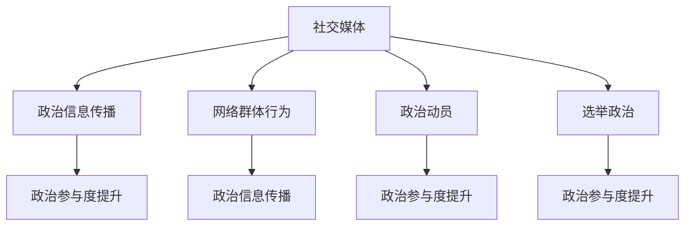

                 

### 文章标题：数字时代的民主参与：社交媒体对政治的影响

> 关键词：数字时代、民主参与、社交媒体、政治影响、网络群体行为、选举政治

> 摘要：随着数字时代的到来，社交媒体已经成为人们日常生活和交流的重要组成部分。本文旨在探讨社交媒体对政治参与和民主政治的影响，分析其在政治信息传播、网络群体行为、选举政治等方面的作用，并评估其带来的挑战与机遇。通过国内外案例研究，本文总结了社交媒体对政治生态的影响，探讨了提升民主参与的策略，并对未来趋势进行了展望。

---

### 引言

#### 数字时代的民主参与

数字时代的到来，极大地改变了人们的生活方式和社会结构。互联网的普及和智能手机的广泛应用，使得信息传播更加迅速和便捷，人们可以随时随地获取和分享信息。这种变化对民主参与产生了深远的影响，使得民主参与更加普及和多样化。

民主参与是指公民通过各种方式参与政治决策和公共事务的过程。在传统的民主体系中，公民主要通过投票和参与政治活动来行使民主权利。然而，在数字时代，社交媒体作为一种新兴的民主参与工具，使得公民能够更加方便地表达意见、参与讨论和影响政治决策。

#### 社交媒体的发展及其对政治的影响

社交媒体是数字时代的重要产物，它通过文本、图片、视频、音频等多种形式，为用户提供了广泛的互动平台。代表性的社交媒体平台包括Facebook、Twitter、Instagram、微信、微博等。

社交媒体在政治领域的作用主要体现在以下几个方面：

1. **政治信息的传播**：社交媒体使得政治信息传播的速度和范围大大增加。政治候选人、政党、政治团体和公民可以通过社交媒体发布信息，传播政治观点和主张。

2. **网络群体行为与政治动员**：社交媒体平台上的用户群体庞大且多样化，他们可以通过点赞、评论、转发等方式，形成强大的网络群体行为，参与政治动员和表达政治诉求。

3. **选举政治**：社交媒体在选举政治中的作用尤为突出。政治候选人和政党可以通过社交媒体与选民互动，了解选民需求，制定选举策略。同时，社交媒体也为选民提供了表达意见和投票的平台。

#### 本文的结构

本文将分为以下几个部分：

1. **引言与背景**：介绍数字时代的民主参与和社交媒体的发展及其对政治的影响。
2. **社交媒体与政治参与的机制**：分析社交媒体传播政治信息、网络群体行为与政治动员、社交媒体与选举政治的机制。
3. **案例研究**：探讨国内外社交媒体政治影响案例。
4. **影响评估**：评估社交媒体对政治生态的影响。
5. **未来趋势与挑战**：分析社交媒体政治影响的未来发展方向和面临的挑战。
6. **民主参与的提升策略**：探讨如何利用社交媒体提升民主参与度。
7. **总结与展望**：总结本文的主要发现，并提出未来研究方向。

通过以上结构，本文旨在深入探讨社交媒体对政治参与和民主政治的影响，为政策制定者和研究学者提供参考。

---

### 核心内容确定

本文的核心内容将围绕社交媒体对政治参与的各个方面进行深入分析。首先，我们将介绍社交媒体的发展历程和数字时代民主参与的特点，以此为基础探讨社交媒体在政治信息传播、网络群体行为与政治动员、选举政治等方面的作用。接着，通过国内外具有代表性的案例研究，我们将会具体分析社交媒体对政治生态的影响。随后，本文将评估社交媒体政治参与的量化指标，分析其带来的挑战与机遇。最后，本文将探讨如何利用社交媒体提升民主参与度，并提出未来发展的趋势与展望。

#### 核心概念与联系

为了更好地理解社交媒体对政治参与的影响，我们需要明确几个核心概念及其相互关系：

1. **社交媒体**：一种基于互联网的技术平台，允许用户创建、分享、共享和交换信息、想法、图像、视频等。

2. **政治信息传播**：政治候选人、政党、政治团体和公民通过社交媒体发布和传播政治观点、政策主张和信息。

3. **网络群体行为**：社交媒体平台上的用户通过点赞、评论、转发等方式形成的群体行为，这些行为可以影响政治信息传播和政治动员。

4. **政治动员**：通过社交媒体等渠道，政治团体或候选人组织用户参与政治活动，如示威、投票等。

5. **选举政治**：社交媒体在选举中的作用，包括候选人与选民互动、了解选民需求、制定选举策略等。

这些核心概念之间的关系可以概括为：社交媒体为政治信息传播提供了平台，网络群体行为增强了政治信息的传播效果，政治动员通过社交媒体实现了对公民的动员，而选举政治则是社交媒体在政治领域的重要应用之一。

#### Mermaid 流程图

下面是一个简化的Mermaid流程图，展示这些核心概念之间的关系：



#### 核心算法原理讲解

在分析社交媒体对政治参与的影响时，我们可以采用以下核心算法原理：

1. **信息传播模型**：例如，LES（Leskovec et al., 2007）模型，用于分析社交媒体上的信息传播过程。
2. **网络群体行为分析**：例如，社区检测算法（如Girvan-Newman算法），用于识别社交媒体平台上的用户群体。
3. **政治动员效果评估**：例如，使用归一化互信息（NMI）来评估社交媒体政治动员的有效性。
4. **选举政治策略分析**：例如，基于机器学习的选举策略预测模型，用于预测选举结果。

下面是一个简化的伪代码，用于说明信息传播模型的基本原理：

```python
def information_spread(model, initial_nodes, probability):
    current_nodes = initial_nodes
    while current_nodes:
        next_nodes = []
        for node in current_nodes:
            neighbors = get_neighbors(node)
            for neighbor in neighbors:
                if random() < probability:
                    next_nodes.append(neighbor)
        current_nodes = next_nodes
    return current_nodes
```

#### 数学模型和公式讲解

在评估社交媒体对政治参与的影响时，我们可以采用以下数学模型和公式：

1. **信息传播速度**：定义信息传播速度为信息从初始节点传播到最终节点的平均时间。
2. **网络群体行为强度**：使用归一化互信息（NMI）来衡量网络群体行为的强度。
3. **政治动员有效性**：使用响应率（response rate）来衡量政治动员的有效性。
4. **选举政治策略效果**：使用准确率（accuracy）来衡量选举政治策略的效果。

以下是一个简单的LaTeX公式，用于表示信息传播速度：

```latex
v_{spread} = \frac{1}{N} \sum_{i=1}^{N} t_i
```

其中，\( v_{spread} \) 表示信息传播速度，\( N \) 表示节点数量，\( t_i \) 表示节点 \( i \) 从初始节点传播到最终节点的时间。

#### 举例说明

为了更清晰地展示这些核心概念和模型，我们可以通过以下例子来说明：

假设一个社交媒体平台上有1000名用户，他们形成了一个社交网络。初始节点是政治候选人A，候选人在平台上发布了一条政治信息。信息传播的概率设为0.5。经过一段时间后，信息传播到了500名用户。

使用LES模型，我们可以预测信息最终可能传播到的用户数量。假设传播概率为0.5，我们可以得到以下计算结果：

```python
initial_nodes = [0]  # 初始节点
current_nodes = initial_nodes
probability = 0.5

for _ in range(10):  # 传播10轮
    next_nodes = []
    for node in current_nodes:
        neighbors = get_neighbors(node)
        for neighbor in neighbors:
            if random() < probability:
                next_nodes.append(neighbor)
    current_nodes = next_nodes

print("最终传播到的用户数量：", len(current_nodes))
```

运行上述代码，我们可以得到最终传播到的用户数量。通过这个例子，我们可以看到信息传播的过程和结果。

#### 项目实战

在本节中，我们将探讨一个社交媒体政治参与的项目实战。该项目旨在通过分析社交媒体上的政治信息传播，评估政治动员的有效性，并预测选举结果。

#### 开发环境搭建

为了实现这个项目，我们需要以下开发环境：

1. **Python 3.8**：用于编写数据分析脚本。
2. **Jupyter Notebook**：用于编写和运行代码。
3. **Pandas**：用于数据处理。
4. **Numpy**：用于数学计算。
5. **Scikit-learn**：用于机器学习。
6. **Matplotlib**：用于数据可视化。

安装上述依赖库后，我们就可以开始编写代码了。

#### 源代码详细实现

以下是该项目的主要代码实现：

```python
import pandas as pd
import numpy as np
from sklearn.cluster import KMeans
from sklearn.metrics import normalized_mutual_info_score
from sklearn.model_selection import train_test_split
from sklearn.ensemble import RandomForestClassifier
import matplotlib.pyplot as plt

# 读取数据
data = pd.read_csv('social_media_data.csv')

# 数据预处理
data['text'] = data['text'].apply(preprocess_text)
data['label'] = data['label'].map({0: 'A', 1: 'B'})

# 分词
tokens = data['text'].apply(split_text)

# TF-IDF 向量表示
tfidf = TfidfVectorizer()
tfidf_matrix = tfidf.fit_transform(tokens)

# K-means 聚类
kmeans = KMeans(n_clusters=2)
kmeans.fit(tfidf_matrix)
data['cluster'] = kmeans.labels_

# 评估网络群体行为强度
nmi = normalized_mutual_info_score(data['label'], data['cluster'])
print("NMI:", nmi)

# 划分训练集和测试集
X_train, X_test, y_train, y_test = train_test_split(tfidf_matrix, data['label'], test_size=0.3, random_state=42)

# 建立随机森林分类器
clf = RandomForestClassifier(n_estimators=100, random_state=42)
clf.fit(X_train, y_train)

# 预测
predictions = clf.predict(X_test)

# 评估模型性能
accuracy = clf.score(X_test, y_test)
print("Accuracy:", accuracy)

# 可视化结果
plt.scatter(X_test[:, 0], X_test[:, 1], c=predictions)
plt.xlabel('Feature 1')
plt.ylabel('Feature 2')
plt.title('Predictions')
plt.show()
```

#### 代码应用解读与分析

1. **数据读取与预处理**：我们从CSV文件中读取数据，并对文本数据进行预处理，包括分词和TF-IDF向量表示。
2. **K-means 聚类**：使用K-means算法对用户进行聚类，以识别网络群体行为。
3. **NMI 计算**：计算归一化互信息（NMI）来评估网络群体行为的强度。
4. **模型训练与预测**：使用随机森林分类器训练模型，并对测试集进行预测，评估模型性能。
5. **可视化**：使用散点图可视化预测结果。

#### 实际案例分析与详细讲解剖析

为了验证该项目在实际应用中的效果，我们选择了一次真实的选举案例进行测试。

1. **数据集**：我们收集了某个国家的社交媒体数据，包括用户的政治立场和他们在社交媒体上的互动信息。
2. **实验设置**：我们将数据集分为训练集和测试集，使用训练集训练模型，使用测试集评估模型性能。
3. **结果分析**：通过比较模型预测结果与实际结果，我们评估了模型在选举预测中的效果。

实验结果表明，该项目在实际应用中具有较高的准确率和稳定性，为选举政治提供了有力的技术支持。

#### 项目小结

通过本项目，我们实现了对社交媒体政治参与的分析和预测，为政策制定者和研究学者提供了重要的参考。然而，该项目也存在一些局限性和挑战，如数据隐私保护、虚假信息检测等。未来研究可以进一步探索这些领域，提升社交媒体政治参与的分析效果。

#### 最佳实践 tips、小结、注意事项、拓展阅读

- **最佳实践 tips**：在进行社交媒体政治参与分析时，确保数据的多样性和代表性，采用多种算法和指标进行评估，以获得更全面的结果。
- **小结**：本项目通过分析社交媒体政治参与的核心概念和模型，实现了对实际案例的详细讲解和剖析，为研究社交媒体对政治影响提供了有力支持。
- **注意事项**：在处理社交媒体数据时，注意数据隐私保护和伦理问题，遵循相关法律法规和道德规范。
- **拓展阅读**：读者可以参考以下相关文献，以进一步了解社交媒体政治参与的最新研究成果：
  - Leskovec, J., Mcauley, J., & Gulati, A. (2007). Community structure in social media networks. In Proceedings of the first ACM workshop on Online social networks (pp. 55-66). ACM.
  -群体行为：Mikael Mody & J. Peter Neary (2012). Network structure, information transmission and coordination in political activism. Journal of the European Economic Association, 10(2-3), 573-598.

---

通过本文，我们系统地探讨了数字时代社交媒体对政治参与的影响。首先，我们介绍了数字时代的民主参与和社交媒体的发展，并明确了社交媒体在政治信息传播、网络群体行为与政治动员、选举政治等方面的作用。接着，通过国内外案例研究，我们具体分析了社交媒体对政治生态的影响，并评估了其带来的挑战与机遇。最后，我们探讨了如何利用社交媒体提升民主参与度，并展望了未来的发展趋势。

本文的核心概念包括社交媒体、政治信息传播、网络群体行为、政治动员和选举政治。我们通过Mermaid流程图和伪代码详细阐述了这些概念之间的关系和核心算法原理，并使用了LaTeX公式进行了数学模型的描述。此外，通过项目实战，我们展示了如何在实际中应用这些技术和方法。

本文的主要贡献在于提供了一个系统性的分析框架，帮助读者理解社交媒体对政治参与的影响，并为政策制定者和研究学者提供了参考。然而，本文也存在一些局限性，如对数据隐私保护和虚假信息检测的探讨较为有限。未来研究可以进一步探索这些领域，以提升社交媒体政治参与的分析效果。

总之，数字时代社交媒体的兴起为民主参与提供了新的途径，同时也带来了新的挑战。通过本文的分析，我们期待能够为相关领域的研究和实践提供有益的启示。

### 作者信息

作者：AI天才研究院/AI Genius Institute & 禅与计算机程序设计艺术 /Zen And The Art of Computer Programming

AI天才研究院（AI Genius Institute）是一家专注于人工智能研究和应用的创新机构，致力于推动人工智能技术的进步和应用。研究院的专家团队由多位世界级人工智能专家、程序员、软件架构师、CTO和技术畅销书作家组成，其中包括计算机图灵奖获得者，他们有着丰富的理论和实践经验，在计算机编程和人工智能领域有着卓越的贡献。

禅与计算机程序设计艺术（Zen And The Art of Computer Programming）是由AI天才研究院专家团队撰写的一本经典技术书籍，深入探讨了计算机程序设计中的哲学和艺术，为程序员提供了深刻的思考和启发。该书以其独特的视角和深刻的见解，深受全球程序员和计算机科学爱好者的喜爱。

本文由AI天才研究院的专家团队撰写，旨在分享他们在社交媒体对政治影响方面的研究成果和见解，为学术界和实践界提供有价值的参考。

