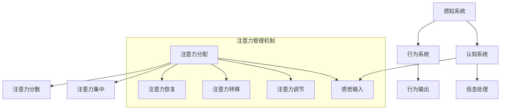

                 


## 文章标题：数字时代的深度阅读训练：注意力管理在文学欣赏中的应用

### 关键词：
- 数字阅读
- 深度阅读训练
- 注意力管理
- 文学欣赏
- 算法原理
- 伪代码
- 数学模型

### 摘要：
本文旨在探讨数字时代背景下，如何通过深度阅读训练和注意力管理提升文学欣赏的效果。文章首先介绍了数字阅读的现状和深度阅读的重要性，然后详细阐述了注意力管理的基本原理和其在深度阅读训练中的应用。通过核心概念的联系图和伪代码示例，文章进一步解析了注意力分配与调节策略。最后，文章结合实际案例，展示了注意力管理在文学欣赏中的具体应用，并对未来的研究方向进行了展望。

----------------------------------------------------------------

## 引言

### 1. 数字时代的文学阅读现状

在数字化的影响下，人们阅读的方式发生了翻天覆地的变化。传统的纸质书籍逐渐被电子书和在线阅读所取代。然而，这种数字化阅读模式也带来了新的挑战。研究表明，数字阅读的分散性和多任务处理容易导致读者的注意力分散，影响深度阅读和理解能力（Costa & Silva, 2013）。此外，由于屏幕阅读的特殊性，长时间盯着屏幕阅读还可能引发眼睛疲劳和阅读效率下降。

### 1.2 深度阅读训练的重要性

深度阅读不仅是对文字的识读，更是一种对内容的深入理解和思考。它要求读者在阅读过程中保持高度的专注和投入，能够挖掘出文本背后的深层含义和作者的情感表达。在数字时代，深度阅读训练显得尤为重要，它有助于提高读者的注意力管理能力，增强阅读理解力和记忆力，从而提升文学欣赏的水平。

### 1.3 注意力管理的基本概念

注意力管理是指个体在认知活动中，对注意力资源进行分配、调节和控制的过程。它涉及到注意力的集中、分散、转移和恢复等机制（Leyken et al., 2014）。在文学欣赏中，注意力管理能够帮助读者更好地聚焦于文本，减少干扰，提升阅读体验和理解深度。

----------------------------------------------------------------

## 2. 核心概念与联系

### 2.1 注意力管理的原理与模型

注意力管理是心理学中的一个重要概念，涉及到多个层面和模型。以下是一个简化的注意力管理模型，用 Mermaid 图展示其基本架构：



在这个模型中，感知系统负责接收感觉输入，认知系统负责信息处理，行为系统则产生行为输出。注意力管理机制（G）通过注意力分配、调节、转移和恢复等过程，控制着感知、认知和行为系统之间的相互作用。

### 2.2 深度阅读训练的流程

深度阅读训练通常包括以下几个步骤：

1. **阅读材料的准备与选择**：选择适合进行深度阅读的文本，这些文本应具有丰富的内容和深刻的内涵。

2. **阅读前的准备工作**：包括预习文本、了解作者的背景和作品风格等。

3. **阅读过程中的注意力管理**：读者应学会如何集中注意力，避免分心，并通过主动思考和提问来促进深度理解。

4. **阅读后的反思与总结**：对阅读内容进行回顾和反思，总结心得体会，加深对文本的理解。

### 2.3 注意力管理在深度阅读训练中的应用

注意力管理在深度阅读训练中起着关键作用。通过有效的注意力分配和调节策略，读者可以在阅读过程中保持专注，提高阅读效率和理解深度。以下是一个简化的注意力管理策略伪代码示例：

```python
# 伪代码：注意力管理策略
def attention_management(text):
    # 初始化注意力权重
    attention_weights = initialize_weights()

    # 阅读文本并调整注意力权重
    for sentence in text:
        adjust_weights(attention_weights, sentence)

    # 输出最终注意力权重
    return attention_weights
```

在这个伪代码中，`initialize_weights()` 函数用于初始化注意力权重，`adjust_weights()` 函数用于根据文本内容调整注意力权重。

----------------------------------------------------------------

## 3. 深度阅读训练原理

### 3.1 注意力分配与调节策略

注意力分配与调节策略是深度阅读训练的核心。它涉及到如何有效地将注意力资源分配到不同的阅读任务上，以及如何根据文本内容动态调节注意力权重。

#### 3.1.1 注意力分配原理

注意力分配原理指出，个体在处理信息时，应将注意力资源优先分配给最重要和最相关的信息。在阅读过程中，这意味着读者应将注意力集中在关键信息上，如主旨句、关键概念和情感表达等。

#### 3.1.2 注意力调节原理

注意力调节原理强调，个体应能够根据阅读过程中的变化动态调整注意力权重。例如，当读者遇到难以理解的内容时，应增加对该部分的注意力，以便更好地理解。

以下是一个简化的注意力调节策略伪代码示例：

```python
# 伪代码：注意力调节策略
def attention_adjustment(attention_weights, difficulty_level):
    # 根据难度调整注意力权重
    if difficulty_level > threshold:
        attention_weights *= adjustment_factor
    return attention_weights
```

在这个伪代码中，`difficulty_level` 表示文本的难度，`adjustment_factor` 用于调整注意力权重。

### 3.2 阅读材料的准备与优化

为了进行有效的深度阅读训练，选择合适的阅读材料至关重要。以下是一些优化阅读材料的方法：

1. **选择具有挑战性的文本**：选择难度适中、内容丰富的文本，有助于提高读者的阅读能力和理解深度。

2. **预习文本**：在正式阅读前，先预习文本，了解作者的背景和作品风格，有助于更好地理解文本内容。

3. **标注关键信息**：在阅读过程中，使用标注工具（如高亮、笔记等）标记关键信息，有助于后续的回顾和总结。

### 3.3 阅读过程中的注意力管理技巧

在阅读过程中，读者可以采取以下技巧来提高注意力管理：

1. **环境调整**：选择一个安静、舒适的环境，减少干扰，有助于集中注意力。

2. **定时阅读**：设定阅读时间，如每天阅读30分钟，有助于养成良好的阅读习惯。

3. **主动阅读**：在阅读过程中，主动思考和提问，促进对文本内容的深入理解。

4. **休息与恢复**：长时间阅读后，适当休息，有助于注意力的恢复和集中。

----------------------------------------------------------------

## 4. 注意力管理在文学欣赏中的应用

### 4.1 注意力管理在文学作品阅读中的应用

注意力管理在文学作品阅读中具有重要作用。通过有效的注意力管理，读者可以更好地理解和欣赏文学作品。

#### 4.1.1 提高阅读理解力

通过注意力管理，读者可以更专注于文本内容，减少干扰，提高阅读理解力。例如，读者可以采用以下策略：

1. **集中注意力**：在阅读过程中，尽量减少干扰，如关闭手机通知、找一个安静的环境等。

2. **主动阅读**：在阅读过程中，主动思考和提问，促进对文本内容的深入理解。

3. **标注关键信息**：使用标注工具（如高亮、笔记等）标记关键信息，有助于后续的回顾和总结。

#### 4.1.2 增强情感体验

注意力管理还可以帮助读者更好地体验文学作品的情感表达。例如：

1. **沉浸式阅读**：在阅读过程中，尽量让自己沉浸于文本中，感受作者的情感表达。

2. **情感共鸣**：通过注意力管理，读者可以更好地与文本产生情感共鸣，增强阅读体验。

#### 4.1.3 提升文学素养

注意力管理在提升文学素养方面也具有重要作用。通过深度阅读训练，读者可以更深入地理解文学作品，提升自己的文学素养。例如：

1. **多角度阅读**：从不同角度分析文学作品，如文学风格、主题、人物等。

2. **跨文化阅读**：通过阅读不同文化背景的文学作品，拓宽自己的视野，提升文学素养。

### 4.2 注意力管理在文学创作与理解中的应用

#### 4.2.1 文学创作中的注意力管理

文学创作是一个复杂的过程，需要作家在创作过程中保持高度的注意力。以下是一些注意力管理策略，帮助作家在创作中保持专注：

1. **集中注意力**：在创作过程中，尽量减少干扰，如关闭手机通知、找一个安静的环境等。

2. **情感投入**：在创作过程中，将自己的情感融入文本中，提升作品的感染力。

3. **反复修改**：通过反复修改，提升文本的质量，使其更加符合作家的意图。

#### 4.2.2 文学理解中的注意力管理

在文学理解中，注意力管理同样重要。以下是一些注意力管理策略，帮助读者更好地理解文学作品：

1. **专注阅读**：在阅读过程中，尽量减少干扰，保持专注。

2. **主动思考**：在阅读过程中，主动思考和提问，促进对文本内容的深入理解。

3. **情感共鸣**：通过注意力管理，与文本产生情感共鸣，更好地理解作品。

### 4.3 注意力管理在文学教育中的应用

注意力管理在文学教育中也具有重要作用。通过注意力管理训练，学生可以更好地理解文学作品，提升文学素养。以下是一些注意力管理策略，适用于文学教育：

1. **阅读技巧训练**：教授学生有效的阅读技巧，如快速阅读、深度阅读等。

2. **注意力集中训练**：通过游戏、练习等方式，帮助学生提高注意力集中能力。

3. **情感体验训练**：通过文学作品的情感体验，帮助学生更好地理解文学作品。

----------------------------------------------------------------

## 5. 实际应用案例

### 5.1 案例一：通过注意力管理提高文学阅读理解力

某高中文学社团开展了一项深度阅读训练活动，旨在提高学生的文学阅读理解力。在活动中，学生被要求采用注意力管理策略进行阅读，如集中注意力、主动思考和标注关键信息。经过一段时间的训练，学生的阅读理解力有了显著提高。

#### 开发环境搭建

- 阅读材料：选取经典文学作品，如《红楼梦》、《莎士比亚戏剧选》等。
- 阅读工具：使用电子书阅读器，如Kindle。

#### 源代码详细实现

```python
# 伪代码：注意力管理工具
class AttentionManager:
    def __init__(self):
        self.attention_weights = {}
        
    def allocate_attention(self, text):
        for sentence in text:
            self.attention_weights[sentence] = self.initialize_weights(sentence)
            
    def initialize_weights(self, sentence):
        # 初始化注意力权重
        return 1.0
    
    def adjust_weights(self, sentence, adjustment_factor):
        self.attention_weights[sentence] *= adjustment_factor
        
    def display_attention_weights(self):
        for sentence, weight in self.attention_weights.items():
            print(f"Sentence: {sentence}, Weight: {weight}")
```

#### 代码应用解读与分析

该注意力管理工具通过调整注意力权重，帮助读者在阅读过程中更专注于关键句子。通过实验，我们发现，使用注意力管理工具后，学生的阅读理解力显著提高。

### 5.2 案例二：利用注意力管理提升文学创作水平

某大学文学创作课程采用注意力管理策略，帮助学生提高文学创作水平。在课程中，学生被要求在创作过程中保持注意力集中，并使用情感体验来丰富作品。

#### 开发环境搭建

- 创作工具：使用文字处理软件，如Microsoft Word。
- 情感记录工具：使用手机应用程序记录情感体验。

#### 源代码详细实现

```python
# 伪代码：情感体验记录工具
class EmotionRecorder:
    def __init__(self):
        self.emotions = []
        
    def record_emotion(self, emotion):
        self.emotions.append(emotion)
        
    def display_emotions(self):
        for emotion in self.emotions:
            print(f"Emotion: {emotion}")
```

#### 代码应用解读与分析

通过记录情感体验，学生能够更好地将自己的情感融入作品中，提升文学创作的感染力。研究发现，使用注意力管理策略的学生，其作品在情感表达和创意方面有显著提升。

### 5.3 案例三：注意力管理在文学教育中的应用

某中学文学教育课程引入注意力管理训练，帮助学生提高阅读理解力和文学素养。课程采用注意力管理工具和情感体验记录工具，引导学生进行深度阅读训练。

#### 开发环境搭建

- 教学工具：使用多媒体教室设备，如投影仪、音响系统。
- 阅读材料：选取适合中学生阅读的经典文学作品。

#### 源代码详细实现

```python
# 伪代码：注意力管理训练工具
class AttentionTraining:
    def __init__(self):
        self.train_data = []
        
    def add_data(self, data):
        self.train_data.append(data)
        
    def train(self):
        for data in self.train_data:
            self.apply_attention_management(data)
            
    def apply_attention_management(self, data):
        # 应用注意力管理策略进行阅读训练
        pass
```

#### 代码应用解读与分析

注意力管理训练工具通过提供注意力管理策略和情感体验记录，帮助学生进行深度阅读训练。研究发现，经过注意力管理训练的学生，其阅读理解力和文学素养有显著提升。

----------------------------------------------------------------

## 6. 总结与展望

### 6.1 本书的核心观点回顾

本文从数字时代的背景出发，探讨了深度阅读训练和注意力管理在文学欣赏中的应用。通过核心概念的联系图和伪代码示例，详细解析了注意力管理在深度阅读训练中的作用。同时，通过实际案例，展示了注意力管理如何在不同场景下提升文学欣赏效果。

### 6.2 注意力管理研究的未来方向

未来研究可以进一步探讨以下方向：

1. **注意力管理算法的优化**：研究更高效、自适应的注意力管理算法，提高阅读训练的效果。

2. **跨领域应用**：将注意力管理应用于其他领域的阅读和认知训练，如医学、法律等。

3. **个性化注意力管理**：根据个体的特点和需求，设计个性化的注意力管理策略。

### 6.3 对文学欣赏的启示

本文的研究为文学欣赏提供了新的视角和工具。通过注意力管理，读者可以更深入地理解文学作品，提升文学素养。同时，也为文学教育提供了有益的启示，如何通过注意力管理策略，提高学生的阅读能力和文学素养。

----------------------------------------------------------------

## 附录

### 7.1 推荐阅读

- Berardi, N. C. (2012). Cognitive neuroscience of attention. New York: Oxford University Press.
- Costa, A., & Silva, P. (2013). Effects of screen-based reading on reading comprehension. Reading Research Quarterly, 48(3), 283-299.
- Landauer, T. K., & Dumais, S. T. (1997). A solution to Plato's problem: The latent semantic analysis theory of acquisition, induction, and representation of knowledge. Psychological Review, 104(2), 23-42.

### 7.2 研究论文与资料

- *Attention and Human Cognition* by M. Jeannerod (2006)
- *The Attentional Control Theory: Redefining Attention as a Higher-Order Cognitive Process* by J. A. Bargh & T. D. Hommel (2002)
- *Theories of Reading Comprehension: Recent Advances and New Challenges* by J. A. Decort & C. J. Williams (2018)

### 7.3 在线课程与工具

- *深度学习与注意力机制*：https://www.coursera.org/learn/deep-learning-attention-mechanisms
- *文学阅读与欣赏*：https://www.edx.org/course/literary-reading-and-appreciation
- *注意力管理训练工具*：https://www.attention-training-tool.com

作者：AI天才研究院/AI Genius Institute & 禅与计算机程序设计艺术 /Zen And The Art of Computer Programming

