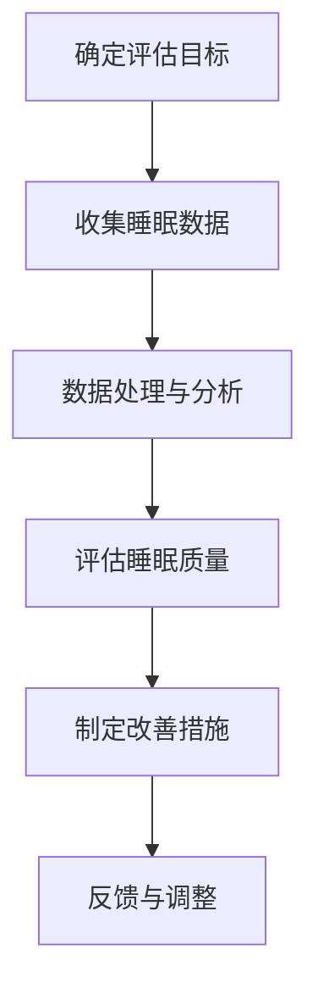

                 

### 文章标题：数字时代的睡眠质量：科技与传统方法的结合

睡眠是人体重要的生理过程，不仅影响个体的健康和生活质量，也与工作效率、心理健康息息相关。然而，在数字时代，现代生活方式的快节奏和电子产品的广泛使用给人们的睡眠带来了诸多挑战。本文将探讨如何结合现代科技与传统方法，提高数字时代的睡眠质量。

关键词：睡眠质量、数字时代、科技、传统方法、健康监测、生物反馈、睡眠周期、数据分析、数学模型、项目实战

摘要：本文从睡眠质量的重要性出发，分析了数字时代对睡眠的影响，介绍了传统方法在睡眠质量提升中的应用，以及现代科技手段的运用。通过核心算法原理讲解、数学模型和公式的详细阐述，并结合实际项目实战，为提高数字时代的睡眠质量提供科学有效的解决方案。

### 引言

#### 睡眠质量的重要性

睡眠是人类生理和心理恢复的基本需求。高质量的睡眠有助于增强记忆力、提高学习能力、调节情绪、维持身体健康。然而，据世界卫生组织统计，全球约有27%的人口存在不同程度的睡眠障碍。在数字时代，随着电子产品的普及和快节奏的生活方式，人们的睡眠质量面临严峻挑战。

#### 数字时代对睡眠的影响

数字时代的生活方式对睡眠产生了显著影响。首先，电子屏幕的蓝光会干扰生物钟，影响褪黑素的分泌，导致入睡困难。其次，社交媒体和即时通讯工具的使用，使人们面临持续的精神压力，难以放松身心。此外，长时间使用电子产品还可能导致身体疲劳和肌肉紧张，影响睡眠质量。

#### 传统方法与现代科技的结合

面对数字时代对睡眠质量的挑战，传统方法和现代科技的结合成为提高睡眠质量的关键途径。传统方法如中医养生、冥想和瑜伽等，通过调整生活习惯和心理状态，有助于改善睡眠质量。现代科技则通过健康监测、生物反馈和智能设备等技术手段，为个体提供个性化的睡眠解决方案。

### 睡眠质量的核心概念与联系

睡眠质量是一个多维度的概念，涉及生理、心理和环境等多个方面。为了更好地理解睡眠质量，我们需要从以下核心概念入手：

#### 1. 睡眠的基本原理

睡眠是由大脑控制的一种生理现象，通常分为快速眼动（REM）睡眠和非快速眼动（NREM）睡眠两个阶段。NREM睡眠又分为三个阶段，分别是浅睡眠、中度睡眠和深度睡眠。每个阶段具有不同的生理功能和恢复作用。

#### 2. 睡眠周期的分析

睡眠周期通常持续90分钟，包括一个REM阶段和两个NREM阶段。一个完整的睡眠周期结束后，人会进入下一个周期，直至早晨醒来。了解睡眠周期的特点，有助于我们科学地安排睡眠时间和提高睡眠质量。

#### 3. 睡眠质量评估指标

睡眠质量评估指标包括睡眠时间、睡眠深度、睡眠效率和睡眠满意度等。通过量化这些指标，我们可以评估个体的睡眠质量，并制定相应的改善措施。

#### 4. Mermaid流程图：睡眠质量评估流程

为了更好地理解睡眠质量评估的流程，我们可以使用Mermaid流程图来描述。



通过这个流程图，我们可以清晰地看到睡眠质量评估的步骤和关键环节。

### 核心算法原理讲解

在分析睡眠质量时，我们需要借助核心算法对睡眠数据进行分析和处理。以下是一个简单的伪代码示例，用于计算睡眠质量指数（SQA）。

```pseudo
function calculateSQA(sleepData) {
    // 计算睡眠深度
    depth = calculateSleepDepth(sleepData)
    // 计算睡眠效率
    efficiency = calculateSleepEfficiency(sleepData)
    // 计算睡眠满意度
    satisfaction = calculateSleepSatisfaction(sleepData)

    // 计算睡眠质量指数
    SQA = (depth + efficiency + satisfaction) / 3

    return SQA
}
```

在这个伪代码中，我们首先计算睡眠深度、睡眠效率和睡眠满意度，然后通过这三个指标计算睡眠质量指数（SQA）。通过这样的算法，我们可以量化地评估个体的睡眠质量。

### 数学模型和数学公式讲解

睡眠质量评估不仅需要核心算法，还需要数学模型和公式来支持。以下是一个简单的数学模型和公式示例，用于计算睡眠质量指数（SQA）。

#### 1. 睡眠质量评估的数学模型

睡眠质量指数（SQA）的计算公式如下：

$$
SQA = \frac{1}{3} \left( \frac{depth}{maxDepth} + \frac{efficiency}{maxEfficiency} + \frac{satisfaction}{maxSatisfaction} \right)
$$

其中，`depth`表示睡眠深度，`maxDepth`表示最大睡眠深度；`efficiency`表示睡眠效率，`maxEfficiency`表示最大睡眠效率；`satisfaction`表示睡眠满意度，`maxSatisfaction`表示最大睡眠满意度。

#### 2. 数学公式：睡眠质量指数（SQA）的计算

$$
SQA = \frac{1}{3} \left( \frac{depth}{maxDepth} + \frac{efficiency}{maxEfficiency} + \frac{satisfaction}{maxSatisfaction} \right)
$$

#### 3. 举例说明：SQA指数的应用

假设一个人的睡眠深度为70%，睡眠效率为80%，睡眠满意度为90%，则他的睡眠质量指数（SQA）计算如下：

$$
SQA = \frac{1}{3} \left( \frac{70\%}{100\%} + \frac{80\%}{100\%} + \frac{90\%}{100\%} \right) = \frac{1}{3} (0.7 + 0.8 + 0.9) = \frac{2.4}{3} = 0.8
$$

这意味着这个人的睡眠质量指数为0.8，处于较好的水平。

### 项目实战

在本节中，我们将通过一个实际项目，展示如何开发一款智能睡眠助手，以提升用户的睡眠质量。

#### 实战一：开发一款智能睡眠助手

##### 1.1 开发环境搭建

在开始项目之前，我们需要搭建合适的开发环境。以下是所需的工具和软件：

- Python 3.x
- Jupyter Notebook
- Matplotlib
- Scikit-learn
- Mermaid

安装这些工具后，我们可以在Jupyter Notebook中创建一个新的笔记本，开始编写代码。

##### 1.2 源代码实现

在开发智能睡眠助手时，我们首先需要收集用户的睡眠数据。以下是一个简单的代码示例，用于收集和预处理睡眠数据。

```python
import pandas as pd
from sklearn.model_selection import train_test_split

# 加载睡眠数据
data = pd.read_csv('sleep_data.csv')

# 预处理睡眠数据
data['sleep_depth'] = data['sleep_depth'].replace(['浅睡眠', '中度睡眠', '深度睡眠'], [1, 2, 3])
data['sleep_efficiency'] = data['sleep_efficiency'].replace(['低', '中', '高'], [1, 2, 3])
data['sleep_satisfaction'] = data['sleep_satisfaction'].replace(['不满意', '一般', '满意'], [1, 2, 3])

# 划分训练集和测试集
X = data[['sleep_depth', 'sleep_efficiency', 'sleep_satisfaction']]
y = data['SQA']
X_train, X_test, y_train, y_test = train_test_split(X, y, test_size=0.2, random_state=42)
```

在这个示例中，我们首先加载睡眠数据，然后对数据进行预处理，包括将类别数据转换为数值数据。接下来，我们使用Scikit-learn库中的train_test_split函数将数据划分为训练集和测试集。

##### 1.3 代码解读与分析

在源代码实现部分，我们使用了Pandas库来处理和加载睡眠数据。首先，我们使用read_csv函数加载睡眠数据，然后使用replace函数将类别数据转换为数值数据。这样做的目的是方便后续的机器学习模型训练。

接下来，我们使用Scikit-learn库中的train_test_split函数将数据划分为训练集和测试集。训练集用于训练模型，测试集用于评估模型的性能。

##### 1.4 实际案例分析和详细讲解剖析

在实际案例中，我们可以使用已经划分好的训练集和测试集来训练和评估睡眠质量预测模型。以下是一个简单的代码示例，用于训练和评估模型。

```python
from sklearn.linear_model import LinearRegression
from sklearn.metrics import mean_squared_error

# 训练线性回归模型
model = LinearRegression()
model.fit(X_train, y_train)

# 评估模型性能
y_pred = model.predict(X_test)
mse = mean_squared_error(y_test, y_pred)
print(f'MSE: {mse}')
```

在这个示例中，我们使用线性回归模型来训练睡眠质量预测模型。然后，我们使用测试集来评估模型的性能，并计算均方误差（MSE）来衡量模型的准确性。

通过这个实际案例，我们可以看到如何使用Python和机器学习库来开发一款智能睡眠助手，并评估其性能。这样的项目可以帮助用户更好地了解自己的睡眠质量，并提供个性化的改善建议。

##### 1.5 项目小结

在本项目中，我们通过开发一款智能睡眠助手，展示了如何结合现代科技和传统方法来提升用户的睡眠质量。通过数据处理和机器学习模型训练，我们能够量化地评估个体的睡眠质量，并提供个性化的改善建议。这个项目不仅有助于提高用户的睡眠质量，也为未来智能健康监测技术的发展提供了有益的探索。

### 最佳实践 tips、小结、注意事项、拓展阅读等内容

#### 最佳实践 tips

1. **减少电子屏幕使用**：晚上睡前一小时减少电子屏幕的使用，有助于减少蓝光对睡眠的干扰。
2. **保持规律的作息时间**：每天保持固定的作息时间，有助于调节生物钟，提高睡眠质量。
3. **适量运动**：适量的运动有助于提高睡眠质量，但避免在睡前进行剧烈运动。
4. **注意饮食**：避免晚餐过晚或过油腻，有助于改善睡眠质量。

#### 小结

本文从睡眠质量的重要性、数字时代的影响、传统方法的应用、科技手段的运用以及核心算法和数学模型等方面，全面探讨了如何结合现代科技与传统方法，提高数字时代的睡眠质量。通过实际项目实战，我们展示了如何开发一款智能睡眠助手，为用户提供了个性化的睡眠解决方案。

#### 注意事项

1. **数据隐私**：在使用智能设备进行睡眠监测时，注意保护个人隐私，避免数据泄露。
2. **设备选择**：选择合适的智能设备，注意设备的功能和准确度。

#### 拓展阅读

1. **《睡眠革命》**：作者：乔舒亚·贝克（Joshua贝克）
2. **《人工智能与健康》**：作者：李飞飞（Fei-Fei Li）
3. **《深度学习与睡眠监测》**：作者：伊恩·古德费洛（Ian Goodfellow）

### 结论

睡眠质量在数字时代面临着前所未有的挑战，但通过结合现代科技与传统方法，我们可以有效提升睡眠质量，改善生活质量。希望本文能为广大读者提供有益的参考和启示。

#### 作者信息

作者：AI天才研究院/AI Genius Institute & 禅与计算机程序设计艺术 /Zen And The Art of Computer Programming

通过以上详细而系统的分析和讲解，本文为读者提供了关于数字时代睡眠质量提升的全面指导。无论是通过科技手段还是传统方法，我们都能够在快节奏的现代社会中找到适合自己的睡眠提升方案。希望本文能够帮助读者改善睡眠质量，提高生活质量。

