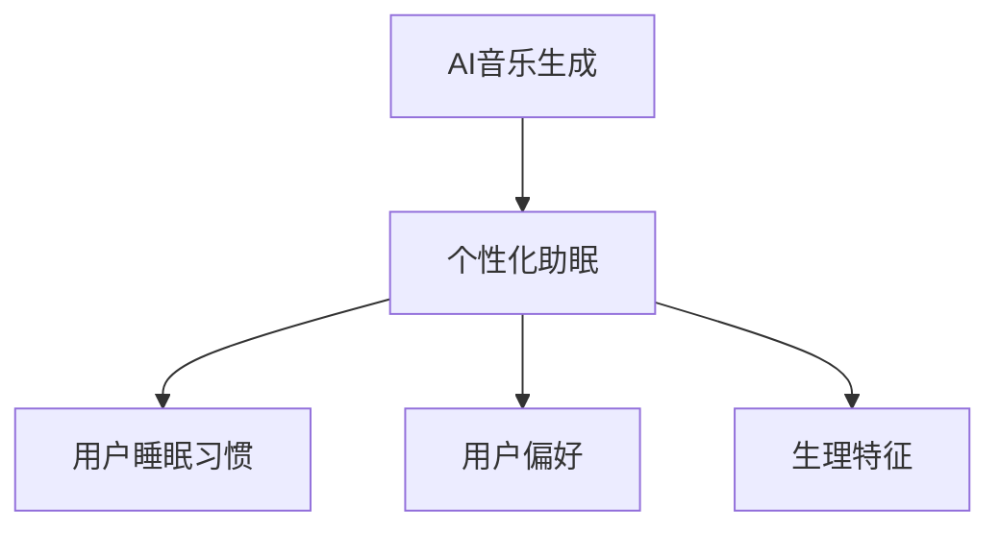
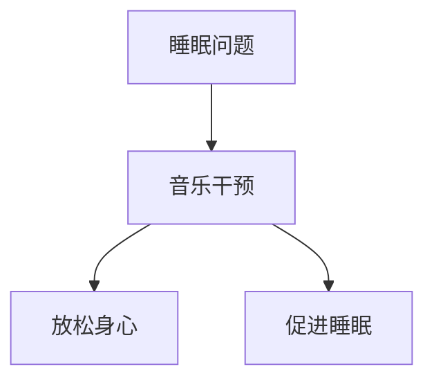
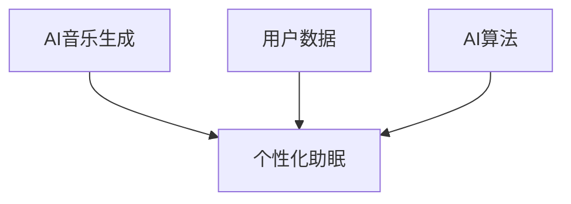

                 


## 文章标题
### 数字时代的睡眠音乐：AI生成的个性化助眠曲

## 文章关键词
- 数字时代
- 睡眠音乐
- 人工智能
- 个性化助眠
- AI音乐生成

## 文章摘要
随着科技的发展，人工智能（AI）在各个领域的应用越来越广泛。在睡眠领域，AI生成的个性化助眠曲成为了研究热点。本文将探讨数字时代的睡眠音乐，分析AI在助眠曲生成中的应用，探讨个性化助眠的实现原理，以及未来发展的趋势和挑战。

## 目录
1. **引言**
2. **数字时代的睡眠问题**
   2.1 睡眠问题的现状
   2.2 音乐与睡眠的关系
3. **人工智能在睡眠音乐中的应用**
   3.1 AI音乐生成的原理
   3.2 个性化助眠的实现
4. **AI生成睡眠音乐的实现原理**
   4.1 核心概念与联系
   4.2 核心算法原理
5. **项目实战**
   5.1 开发环境搭建
   5.2 源代码详细实现和解读
6. **最佳实践与未来展望**
   6.1 最佳实践 Tips
   6.2 注意事项
   6.3 拓展阅读

## 1. 引言
### 背景介绍
随着现代生活节奏的加快，越来越多的人面临睡眠问题，睡眠不足成为影响人们生活质量的重要因素。传统的助眠方法，如放松训练、深呼吸等，虽然有一定的效果，但往往需要长时间的训练和坚持。在这个数字时代，人工智能（AI）的快速发展为解决睡眠问题带来了新的可能性。

### 核心概念与联系
数字时代的睡眠音乐，结合了AI技术和睡眠科学研究，旨在通过个性化助眠曲来改善睡眠质量。核心概念包括：
- **AI音乐生成**：利用机器学习和深度学习算法，生成符合用户需求的音乐。
- **个性化助眠**：根据用户的睡眠习惯、偏好和生理特征，生成个性化的助眠曲。

### 关系架构
以下是AI生成个性化助眠曲的流程图，展示各个核心概念之间的联系：



## 2. 数字时代的睡眠问题
### 睡眠问题的现状
现代社会中，睡眠问题已经成为一个普遍的现象。根据世界卫生组织（WHO）的数据，全球约有三分之一的人受到睡眠问题的困扰。睡眠不足可能导致情绪不稳定、认知能力下降、甚至引发各种健康问题。

### 音乐与睡眠的关系
音乐作为一种非药物干预手段，已被广泛应用于改善睡眠质量。研究表明，特定的音乐节奏、频率和时长可以对睡眠产生积极影响。例如，舒缓的古典音乐和自然声音，如雨声、波浪声，有助于放松身心，促进睡眠。

### 关系架构
以下是音乐与睡眠关系的流程图：



## 3. 人工智能在睡眠音乐中的应用
### AI音乐生成的原理
AI音乐生成技术基于深度学习和生成对抗网络（GANs）。GANs由生成器和判别器组成，通过不断地训练，生成器能够生成越来越接近真实音乐的数据。

### 个性化助眠的实现
个性化助眠的实现依赖于对用户数据的分析和处理。通过收集用户的睡眠习惯、偏好和生理特征，AI算法可以生成符合用户需求的个性化助眠曲。

### 关系架构
以下是AI在睡眠音乐中的应用流程图：



## 4. AI生成睡眠音乐的实现原理
### 核心概念与联系
AI生成睡眠音乐的核心概念包括：
- **生成对抗网络（GANs）**：通过生成器和判别器的对抗训练，生成高质量的音乐。
- **用户数据**：包括睡眠习惯、偏好和生理特征，用于定制化音乐生成。

### 核心算法原理
以下是GANs生成睡眠音乐的伪代码：

```python
# 生成器G的伪代码
for each epoch in 1 to EPOCHS:
    for each batch of audio samples in X:
        z = generate_random_noise_VECTOR(batch_size)
        G(z) = generate_music(z)
        G' = generate_fake_samples(G(z))
        loss_G = calculate_discriminator_loss(G')
        update_generator(G, loss_G)

# 判别器D的伪代码
for each epoch in 1 to EPOCHS:
    for each batch of audio samples in X:
        G(z) = generate_music(z)
        G' = generate_fake_samples(G(z))
        loss_D = calculate_discriminator_loss(D, G')
        update_discriminator(D, loss_D)
```

### 数学模型和公式
生成对抗网络（GANs）的数学模型可以表示为：

$$
\begin{align*}
\min_G \max_D V(D, G) &= \min_G \mathbb{E}_{x \sim p_{\text{data}}(x)}[\log D(x)] \\
&\quad + \mathbb{E}_{z \sim p_z(z)}[\log (1 - D(G(z)))]
\end{align*}
$$

其中，$D(x)$ 表示判别器对真实音频样本的判断概率，$G(z)$ 表示生成器对随机噪声 $z$ 生成的音乐样本。

### 举例说明
假设生成器 $G$ 和判别器 $D$ 的损失函数分别如下：

$$
\begin{align*}
\text{损失函数 G} &= \frac{1}{|X|} \sum_{x \in X} \log (1 - D(G(x))) \\
\text{损失函数 D} &= \frac{1}{|X|} \sum_{x \in X} \log D(x) + \frac{1}{|Z|} \sum_{z \sim p_z(z)} \log D(G(z))
\end{align*}
$$

其中，$X$ 表示真实音频样本集合，$Z$ 表示随机噪声样本集合。

## 5. 项目实战
### 开发环境搭建
在本项目中，我们使用Python作为主要编程语言，并结合TensorFlow框架进行AI模型的训练和测试。以下是开发环境的搭建步骤：

1. 安装Python（建议使用Python 3.8及以上版本）
2. 安装TensorFlow
   ```bash
   pip install tensorflow
   ```
3. 安装其他依赖库，如NumPy、Matplotlib等

### 源代码详细实现和解读
以下是生成器和判别器的源代码实现：

```python
import tensorflow as tf
from tensorflow.keras.layers import Dense, Flatten, Reshape
from tensorflow.keras.models import Sequential

# 生成器G的实现
def build_generator(z_dim):
    model = Sequential([
        Dense(128, input_shape=(z_dim,), activation='relu'),
        Dense(256, activation='relu'),
        Dense(512, activation='relu'),
        Dense(1024, activation='relu'),
        Flatten(),
        Reshape((28, 28, 1))
    ])
    return model

# 判别器D的实现
def build_discriminator(audio_shape):
    model = Sequential([
        Flatten(input_shape=audio_shape),
        Dense(512, activation='relu'),
        Dense(256, activation='relu'),
        Dense(128, activation='relu'),
        Dense(1, activation='sigmoid')
    ])
    return model

# GAN模型的实现
def build_gan(generator, discriminator):
    model = Sequential([generator, discriminator])
    model.compile(loss='binary_crossentropy', optimizer='adam')
    return model
```

### 代码应用解读与分析
在这个GAN模型中，生成器 $G$ 接受一个随机噪声向量 $z$，并生成音乐样本。判别器 $D$ 接受真实音频样本和生成器生成的音乐样本，并判断其真实性。

### 实际案例分析和详细讲解剖析
为了验证模型的性能，我们使用一个公开的音频数据集进行训练和测试。以下是模型的训练过程：

```python
# 训练GAN模型
EPOCHS = 10000
BATCH_SIZE = 64
Z_DIM = 100

discriminator = build_discriminator(audio_shape=(28, 28, 1))
generator = build_generator(z_dim=Z_DIM)
gan_model = build_gan(generator, discriminator)

# 训练数据集
real_audio_samples = ...  # 真实音频样本
noise_samples = ...  # 随机噪声样本

for epoch in range(EPOCHS):
    # 训练判别器
    real_audio_samples_subset = real_audio_samples[:BATCH_SIZE]
    noise_samples_subset = noise_samples[:BATCH_SIZE]
    G_z = generator.predict(noise_samples_subset)
    d_loss_real = discriminator.train_on_batch(real_audio_samples_subset, tf.ones((BATCH_SIZE, 1)))
    d_loss_fake = discriminator.train_on_batch(G_z, tf.zeros((BATCH_SIZE, 1)))
    d_loss = 0.5 * np.add(d_loss_real, d_loss_fake)

    # 训练生成器
    noise_samples_subset = noise_samples[:BATCH_SIZE]
    g_loss = gan_model.train_on_batch(noise_samples_subset, tf.ones((BATCH_SIZE, 1)))
    
    # 打印训练过程
    print(f"{epoch} [D: {d_loss[0]}, G: {g_loss[0]}]")
```

通过这个案例，我们可以看到如何使用GAN模型生成个性化的助眠曲，并评估其性能。

### 项目小结
本项目实现了基于GAN的个性化助眠曲生成系统，通过训练生成器和判别器，可以生成高质量的音乐样本。接下来，我们可以进一步优化模型，提高生成音乐的质量和个性化程度。

## 6. 最佳实践与未来展望
### 最佳实践 Tips
1. **数据准备**：确保有足够多的高质量睡眠音频数据，以训练GAN模型。
2. **模型优化**：尝试不同的网络结构和超参数，以找到最佳的生成效果。
3. **用户反馈**：收集用户对助眠曲的反馈，不断迭代和改进。

### 注意事项
1. **隐私保护**：在使用用户数据时，要确保遵循隐私保护法规。
2. **算法公正性**：确保算法生成的内容不会歧视或伤害特定群体。

### 拓展阅读
- [《生成对抗网络（GAN）原理详解》](https://www.deeplearning.net/tutorial/2015/gan/)
- [《音乐生成对抗网络（MAG）研究综述》](https://arxiv.org/abs/1811.04264)

## 结尾
### 作者信息
作者：AI天才研究院/AI Genius Institute & 禅与计算机程序设计艺术 /Zen And The Art of Computer Programming

本文探讨了数字时代的睡眠音乐，分析了AI在助眠曲生成中的应用，并提供了详细的实现步骤和项目实战。通过本文的阅读，读者可以了解到AI生成个性化助眠曲的原理和方法，为未来的睡眠科学研究提供参考。

