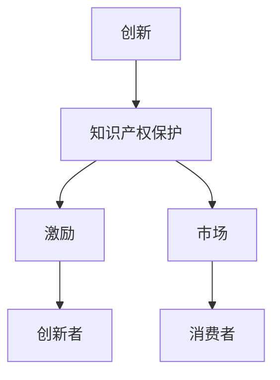
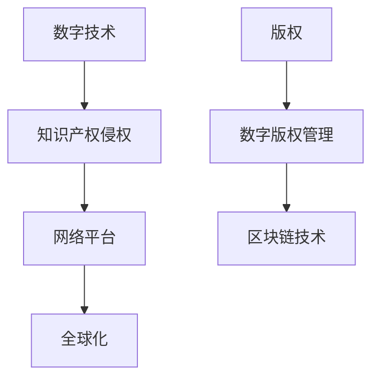
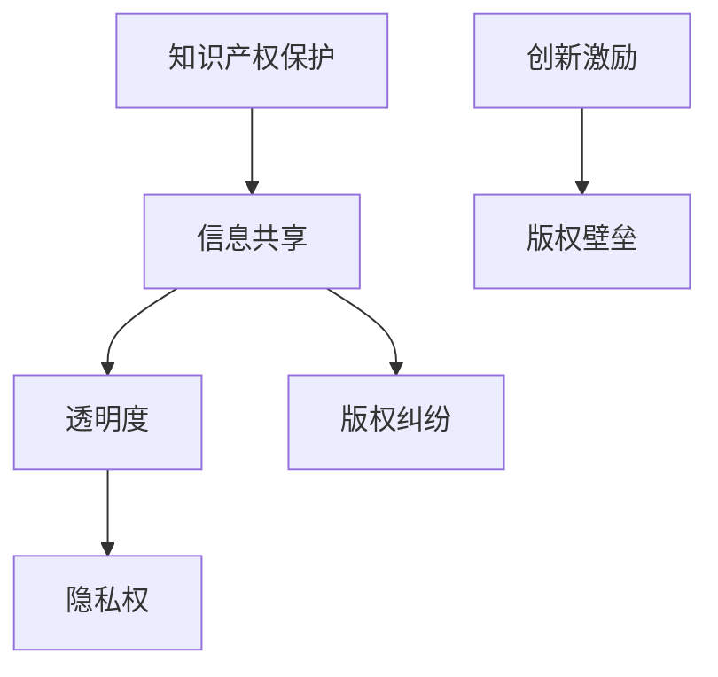

                 

Certainly, we'll structure our book "Digital Age Intellectual Property Protection: Balancing Innovation Incentives and Information Sharing" with a step-by-step reasoning approach, ensuring that each section is well-developed and technically sound. Below is a markdown-formatted outline that includes the title, keywords, abstract, and chapters with detailed sections and subsections. The actual content for each section will be developed in a subsequent step.

# 文章标题：数字时代的知识产权保护：创新激励与信息共享的平衡

> 关键词：知识产权保护，数字时代，创新激励，信息共享，技术手段，法律框架

> 摘要：
本文章深入探讨了数字时代知识产权保护的重要性和挑战。通过分析国际法律框架和主要国家的知识产权法律制度，本文提出了适应数字时代发展的知识产权保护策略和技术手段。同时，本文也探讨了如何平衡知识产权保护与信息共享，为数字时代知识产权保护提供了实践指导和未来展望。

## 引言

### 1.1 知识产权保护的重要性

- **背景介绍**：介绍知识产权保护的定义和其对于创新的重要性。
- **核心概念与联系**：使用Mermaid流程图展示知识产权保护的核心概念和它们之间的关系。

### 1.2 数字时代知识产权保护的特点

- **数字时代的特征**：介绍数字化对知识产权保护带来的变化。
- **核心概念与联系**：使用Mermaid流程图展示数字时代知识产权保护的特点。

### 1.3 知识产权保护与信息共享的挑战

- **挑战分析**：探讨知识产权保护与信息共享之间的矛盾。
- **核心概念与联系**：使用Mermaid流程图展示知识产权保护与信息共享的挑战。

## 数字时代知识产权保护的法律框架

### 2.1 国际知识产权法律体系

- **世界知识产权组织（WIPO）**：介绍WIPO的角色和作用。
- **联合国版权公约（UCP）**：阐述UCP的内容和影响。

### 2.2 主要国家的知识产权法律制度

- **美国的知识产权法律**：分析美国知识产权保护的法律框架。
- **欧盟的知识产权法律**：探讨欧盟知识产权法律的特点。
- **中国的知识产权法律**：介绍中国知识产权保护的现状。

### 2.3 数字时代知识产权法律的发展趋势

- **知识产权法的适应性调整**：讨论知识产权法如何适应数字化发展。
- **数字时代知识产权法的创新**：介绍数字时代知识产权法的创新点。
- **知识产权法与数字经济发展的关系**：分析知识产权法对数字经济的推动作用。

## 数字时代知识产权保护的技术手段

### 5.1 数字版权管理（DRM）

- **DRM的概念与分类**：介绍数字版权管理的定义和分类。
- **DRM的核心技术**：详细讲解数字版权管理的核心技术。
- **DRM的应用场景**：探讨数字版权管理在不同场景中的应用。

### 6.1 区块链技术在知识产权保护中的应用

- **区块链技术基础**：介绍区块链的基本概念和原理。
- **区块链在知识产权保护中的应用**：探讨区块链在知识产权保护中的具体应用。
- **区块链技术对知识产权保护的潜在影响**：分析区块链技术对知识产权保护的影响。

### 7.1 人工智能在知识产权保护中的应用

- **人工智能概述**：介绍人工智能的基本概念和应用。
- **人工智能在知识产权保护中的具体应用**：探讨人工智能在知识产权保护中的具体应用。
- **人工智能在知识产权保护中的挑战与机遇**：分析人工智能在知识产权保护中面临的挑战和机遇。

## 数字时代知识产权保护的策略与实践

### 8.1 企业知识产权战略

- **企业知识产权战略的重要性**：阐述企业知识产权战略的重要性。
- **企业知识产权战略的制定**：介绍企业知识产权战略的制定过程。
- **企业知识产权战略的实施与评估**：讨论企业知识产权战略的实施和评估方法。

### 9.1 知识产权管理与保护的最佳实践

- **知识产权风险管理与防范**：介绍知识产权风险管理和防范的最佳实践。
- **知识产权保护策略的实施**：探讨知识产权保护策略的实施方法。
- **知识产权纠纷的解决**：分析知识产权纠纷的解决策略。

### 10.1 知识产权保护与信息共享的平衡

- **知识产权保护与信息共享的矛盾**：分析知识产权保护与信息共享之间的矛盾。
- **平衡知识产权保护与信息共享的策略**：讨论平衡知识产权保护与信息共享的策略。
- **知识产权保护与信息共享的未来展望**：展望知识产权保护与信息共享的未来发展趋势。

## 结论

### 11.1 数字时代知识产权保护的未来展望

- **数字时代知识产权保护面临的挑战**：讨论数字时代知识产权保护面临的挑战。
- **数字时代知识产权保护的发展趋势**：分析数字时代知识产权保护的发展趋势。
- **数字时代知识产权保护的政策建议**：提出数字时代知识产权保护的政策建议。

---

以上是文章的目录大纲，接下来我们将根据每个章节的内容要求，逐步完善文章的具体内容，包括背景介绍、核心概念与联系、算法原理讲解、数学模型与公式、项目实战、最佳实践 tips 等。文章的撰写将遵循markdown格式要求，并在末尾附上作者信息。

**作者：AI天才研究院/AI Genius Institute & 禅与计算机程序设计艺术 /Zen And The Art of Computer Programming**

---

在接下来的步骤中，我们将详细撰写每个章节的内容，确保文章的完整性、连贯性和专业性。请等待下一步的详细内容撰写。

