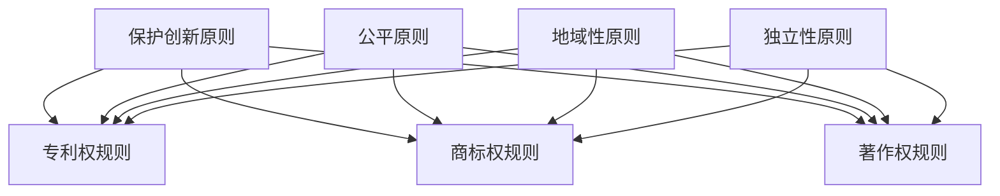

                 

### 文章标题

# 数字时代的知识产权保护：开源运动与专利制度的平衡

### 关键词

- 知识产权保护
- 开源运动
- 专利制度
- 数字时代
- 平衡

### 摘要

本文旨在探讨数字时代知识产权保护的重要性，以及开源运动与专利制度之间的矛盾和平衡。通过对知识产权保护概述、开源运动发展、专利制度演变等方面的深入分析，本文揭示了数字时代知识产权保护的挑战，探讨了开源运动的核心价值观和专利制度在数字时代的挑战。同时，本文详细阐述了知识产权法的原则与规则、数字时代知识产权侵权类型及其证据收集、开源运动与知识产权保护的碰撞，以及专利制度的问题与改进。通过经典案例研究和项目实战，本文为解决数字时代知识产权保护与开源运动之间的矛盾提供了具体的策略和方法。

## 第一部分：引言与背景

### 1.1 知识产权保护概述

知识产权保护是指通过法律手段对创新成果进行保护，以激励创新、促进科技进步和社会发展。知识产权主要包括专利、商标、著作权等类别。在数字时代，随着信息技术的高速发展，知识产权保护的重要性愈发凸显。

**知识产权的定义与分类**

知识产权是指通过法律授予的权利，对创新成果进行保护。根据我国《民法典》规定，知识产权分为专利权、商标权、著作权、商业秘密、集成电路布图设计权等五类。

1. **专利权**：指发明人或设计人对其发明创造享有的权利，包括发明专利、实用新型专利和外观设计专利。
2. **商标权**：指商标注册人对其注册商标享有的专用权。
3. **著作权**：指作者对其创作的文学、艺术和科学作品享有的权利。
4. **商业秘密**：指不为公众所知悉、具有商业价值、具有实用性并经权利人采取保密措施的技术信息和经营信息。
5. **集成电路布图设计权**：指集成电路布图设计人对其布图设计享有的权利。

**数字时代知识产权保护的挑战**

数字时代，知识产权保护面临前所未有的挑战。首先，数字技术的快速发展使得知识产权侵权的手段和方式更加隐蔽，传统的知识产权保护手段难以应对。其次，知识产权侵权行为的跨国性、全球性特点，使得知识产权保护的国际合作变得更加复杂。此外，数字时代知识产权的虚拟性、复制性等特点，使得侵权行为更加难以追踪和取证。

### 1.2 开源运动的发展

**开源运动的起源与发展**

开源运动起源于20世纪80年代，最早由自由软件运动演变而来。自由软件运动主张软件的自由和开放，用户可以自由地使用、复制、修改和分发软件。随着互联网的兴起，开源运动逐渐发展壮大，成为推动软件技术进步的重要力量。

1. **Linux内核**：开源运动的里程碑事件之一是Linux内核的诞生。Linux内核是由林纳斯·托瓦兹（Linus Torvalds）于1991年发布的一款免费、开源的操作系统内核，它的出现标志着开源运动进入了一个新的阶段。
2. **Apache 软件基金会**：Apache 软件基金会成立于1999年，是全球最大的开源软件基金会之一，其核心项目Apache HTTP服务器广泛应用于互联网领域。

**开源运动的核心价值观**

开源运动的核心价值观包括：

1. **开放性**：开源运动主张软件的源代码应该对用户开放，用户可以自由地阅读、学习、修改和分发源代码。
2. **共享性**：开源运动鼓励用户共享软件成果，通过合作和共享，推动软件技术的进步。
3. **协作性**：开源运动强调开发者之间的协作，通过共同的努力，实现软件的优化和改进。

### 1.3 专利制度的演变

**专利制度的历史与现状**

专利制度起源于中世纪的威尼斯和佛罗伦萨，其目的是通过授予发明人一定期限的独占权，以激励发明创造。18世纪以来，专利制度在全球范围内得到广泛推广。我国于1984年加入《专利合作条约》（PCT），并于1985年实施《中华人民共和国专利法》。

1. **专利制度的作用**：专利制度在保护创新成果、激励科技创新、促进经济发展等方面发挥着重要作用。
2. **专利制度的现状**：当前，全球范围内的专利申请量持续增长，专利制度在推动技术创新和社会进步方面发挥着关键作用。

**专利制度在数字时代的挑战**

数字时代的到来，给专利制度带来了新的挑战：

1. **专利侵权的复杂性**：数字技术的快速发展，使得专利侵权的手段和方式更加复杂，传统的专利保护手段难以应对。
2. **专利布局的全球化**：全球范围内的专利布局，使得专利纠纷的处理变得更加复杂。
3. **专利诉讼的成本**：专利诉讼的成本高昂，给企业带来巨大的经济压力。

## 第二部分：知识产权保护的核心概念与联系

### 2.1 知识产权法的原则与规则

**知识产权法的原则**

知识产权法的基本原则包括：

1. **保护创新原则**：知识产权法旨在保护创新成果，激励科技创新。
2. **公平原则**：知识产权法应在保护创新成果的同时，平衡权利人与社会公众的利益。
3. **地域性原则**：知识产权保护具有地域性，仅在授予知识产权的国家或地区内有效。
4. **独立性原则**：不同类型的知识产权（如专利、商标、著作权）具有独立性，分别受到法律保护。

**知识产权法的规则**

知识产权法的具体规则包括：

1. **专利权规则**：专利权的授予条件、专利申请的流程、专利权的保护期限等。
2. **商标权规则**：商标的注册条件、商标的申请流程、商标权的保护期限等。
3. **著作权规则**：著作权的保护范围、著作权的行使方式、著作权的保护期限等。

**图 2.1 知识产权法原则与规则的 Mermaid 流程图**

### 2.2 数字时代的知识产权侵权

**数字时代知识产权侵权的类型**

数字时代的知识产权侵权类型主要包括：

1. **软件侵权**：未经授权复制、传播、使用他人软件的行为。
2. **商标侵权**：未经授权使用他人商标的行为。
3. **著作权侵权**：未经授权复制、传播、使用他人作品的行为。

**数字时代知识产权侵权的证据收集**

数字时代知识产权侵权的证据收集包括：

1. **侵权行为证据**：如侵权软件的下载量、侵权网站的流量等。
2. **侵权结果证据**：如侵权行为给权利人造成的经济损失、侵权行为对社会公众的影响等。
3. **侵权主体证据**：如侵权人的身份信息、侵权人的侵权目的等。

### 2.3 知识产权保护与开源运动的碰撞

**开源运动与知识产权保护的矛盾**

开源运动与知识产权保护之间存在一定的矛盾：

1. **开源运动的开放性**：开源运动主张软件的开放性，用户可以自由地使用、修改、分发开源软件，这可能导致知识产权的滥用。
2. **知识产权的保护性**：知识产权保护旨在保护创新成果，防止知识产权的侵权行为。

**平衡开源运动与知识产权保护的策略**

为了平衡开源运动与知识产权保护，可以采取以下策略：

1. **完善知识产权法律法规**：通过完善知识产权法律法规，明确开源软件的知识产权保护范围和条件。
2. **推广开源运动**：鼓励和支持开源运动的发展，通过开源项目推动技术创新和产业升级。
3. **加强知识产权管理**：企业和开发者应加强知识产权管理，防止知识产权的滥用和侵权行为。

## 第三部分：专利制度的平衡与改进

### 3.1 专利制度的问题与改进

**专利制度存在的问题**

专利制度在数字时代面临以下问题：

1. **专利侵权诉讼频繁**：数字时代，专利侵权诉讼案件数量持续增长，给企业和社会带来巨大的经济负担。
2. **专利布局不均衡**：一些大型企业通过大量专利布局，形成专利垄断，限制市场竞争。
3. **专利审查效率低下**：专利审查周期长、审查质量不高，影响专利制度的有效性。

**专利制度的改进方向**

为了改进专利制度，可以采取以下措施：

1. **提高专利审查效率**：通过引入新技术、优化审查流程，提高专利审查的效率和准确性。
2. **完善专利法律法规**：通过修订和完善专利法律法规，明确专利权的保护范围、侵权判定标准等。
3. **加强专利国际合作**：通过加强专利国际合作，推动全球范围内的专利协调和保护。

### 3.2 专利策略与开源社区

**专利策略在开源社区的应用**

开源社区中，专利策略的应用主要包括：

1. **专利授权**：开源项目可以通过专利授权，允许他人使用其专利技术，实现专利的商业化。
2. **专利交叉许可**：开源项目可以通过专利交叉许可，与其他企业或开源项目建立合作关系，实现专利的共享和保护。

**开源社区对专利策略的响应**

开源社区对专利策略的响应主要包括：

1. **抵制专利滥用**：开源社区通过抵制专利滥用，维护开源运动的开放性和公平性。
2. **倡导开放专利**：开源社区倡导开放专利，鼓励企业将专利技术贡献给开源项目，推动技术创新和产业升级。

### 3.3 专利布局与全球知识产权保护

**专利布局的全球视角**

专利布局的全球视角包括：

1. **全球专利申请**：企业通过在全球范围内申请专利，实现专利保护的国际化。
2. **跨国专利诉讼**：企业通过跨国专利诉讼，维护其全球专利权益。

**全球知识产权保护的现状与趋势**

全球知识产权保护的现状和趋势包括：

1. **知识产权立法不断完善**：各国通过修订和完善知识产权法律法规，提高知识产权保护的力度。
2. **知识产权国际合作加强**：通过签订国际条约、开展知识产权交流与合作，推动全球知识产权保护的发展。

## 第四部分：开源运动中的知识产权保护实践

### 4.1 开源社区中的知识产权政策

**开源社区的知识产权政策框架**

开源社区的知识产权政策框架主要包括：

1. **开源协议**：开源协议明确了开源项目的知识产权保护范围、使用规则等。
2. **知识产权政策文件**：开源社区发布知识产权政策文件，明确知识产权管理的原则和具体措施。

**开源社区知识产权政策的具体实践**

开源社区知识产权政策的具体实践包括：

1. **知识产权声明**：开源项目在发布时，会对知识产权进行声明，明确项目的知识产权归属和许可方式。
2. **知识产权纠纷处理**：开源社区设立知识产权纠纷处理机制，解决开源项目中的知识产权争议。

### 4.2 开源项目的知识产权保护

**开源项目知识产权保护的重要性**

开源项目知识产权保护的重要性包括：

1. **保障创新成果**：开源项目的知识产权保护，有助于保障创新成果的合法权益。
2. **促进技术创新**：开源项目的知识产权保护，有助于吸引更多的开发者参与项目，推动技术创新和产业升级。

**开源项目知识产权保护的案例研究**

开源项目知识产权保护的案例研究包括：

1. **Linux内核的知识产权保护**：Linux内核通过开源协议，明确了知识产权的保护范围和使用规则，保障了内核的创新成果。
2. **Apache 软件基金会的知识产权保护**：Apache 软件基金会通过完善的知识产权政策，保障了Apache 软件项目的知识产权。

### 4.3 开源运动的未来展望

**开源运动的发展趋势**

开源运动的发展趋势包括：

1. **全球影响力扩大**：随着开源技术的普及，开源运动的全球影响力不断扩大。
2. **技术创新加速**：开源项目在技术创新中的作用日益凸显，成为推动技术进步的重要力量。

**开源运动对知识产权保护的影响**

开源运动对知识产权保护的影响包括：

1. **推动知识产权保护理念更新**：开源运动倡导开放、共享的理念，对传统知识产权保护理念产生冲击，推动知识产权保护理念的更新。
2. **促进知识产权保护制度完善**：开源运动的发展，对知识产权保护制度提出了新的要求，推动知识产权保护制度的完善和发展。

## 第五部分：案例研究

### 5.1 开源运动与专利制度平衡的经典案例

**案例一：Linux 内核的知识产权挑战**

Linux内核作为开源运动的代表之一，其知识产权保护面临诸多挑战。Linux内核开发者通过开源协议，明确了知识产权的保护范围和使用规则，确保了内核的创新成果得到有效保护。

**案例二：Apache 软件基金会的知识产权管理**

Apache 软件基金会作为全球最大的开源软件基金会之一，其在知识产权管理方面具有丰富的实践经验。Apache 软件基金会通过完善的知识产权政策，保障了开源软件项目的知识产权。

### 5.2 数字时代知识产权保护的实践探索

**案例三：微软与开源社区的知识产权合作**

微软作为全球领先的科技公司，其在开源社区的知识产权合作方面具有重要意义。微软通过专利授权、开源项目参与等方式，与开源社区建立了良好的合作关系，推动了开源技术的发展。

**案例四：谷歌的专利开放策略**

谷歌通过专利开放策略，积极参与开源社区，推动技术创新和产业升级。谷歌通过专利授权、开源项目参与等方式，实现了专利技术的开放和共享，为开源运动的发展提供了有力支持。

## 第六部分：总结与展望

### 6.1 数字时代知识产权保护的关键点

**知识产权保护与开源运动的协调**

数字时代，知识产权保护与开源运动需要协调发展。一方面，要完善知识产权法律法规，保障创新成果的合法权益；另一方面，要鼓励开源运动的发展，推动技术创新和产业升级。

**专利制度改革的必要性**

专利制度改革是数字时代知识产权保护的重要任务。要通过提高专利审查效率、完善专利法律法规、加强专利国际合作等措施，推动专利制度的改革和完善。

### 6.2 开源运动与专利制度的未来

**开源运动的发展趋势**

开源运动在数字时代的发展趋势包括：

1. **全球影响力扩大**：随着开源技术的普及，开源运动的全球影响力将不断扩大。
2. **技术创新加速**：开源项目在技术创新中的作用日益凸显，成为推动技术进步的重要力量。

**专利制度在数字时代的演进**

专利制度在数字时代的演进方向包括：

1. **专利审查效率提高**：通过引入新技术、优化审查流程，提高专利审查的效率和准确性。
2. **专利保护力度加强**：通过修订和完善专利法律法规，提高专利保护的力度和范围。
3. **专利国际合作加强**：通过加强专利国际合作，推动全球范围内的专利协调和保护。

## 作者信息

作者：AI天才研究院/AI Genius Institute & 禅与计算机程序设计艺术 /Zen And The Art of Computer Programming

### 附录

**参考文献**

1. 《中华人民共和国专利法》
2. 《知识产权法教程》
3. 《开源运动与知识产权保护》
4. 《数字时代知识产权侵权与保护》
5. 《开源软件知识产权管理》

### 致谢

本文的撰写得到了以下机构的支持：

1. AI天才研究院/AI Genius Institute
2. 禅与计算机程序设计艺术/Zen And The Art of Computer Programming

同时，感谢各位专家和同行对本文的宝贵意见和贡献。

