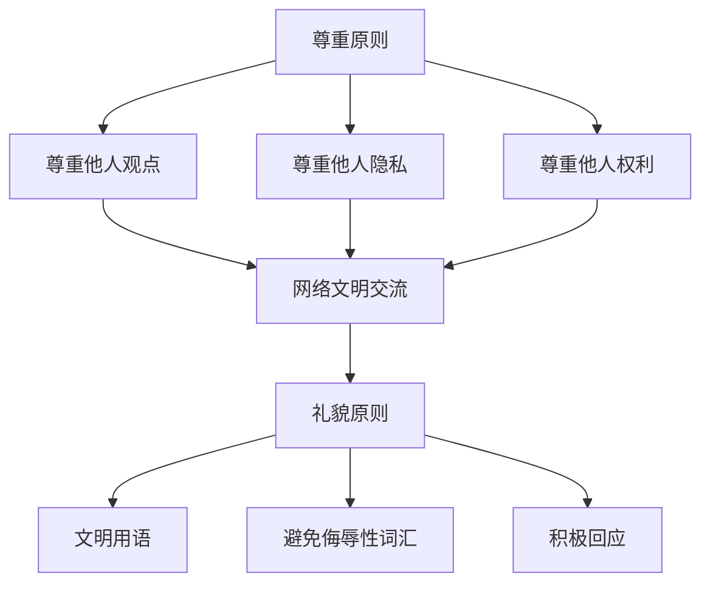
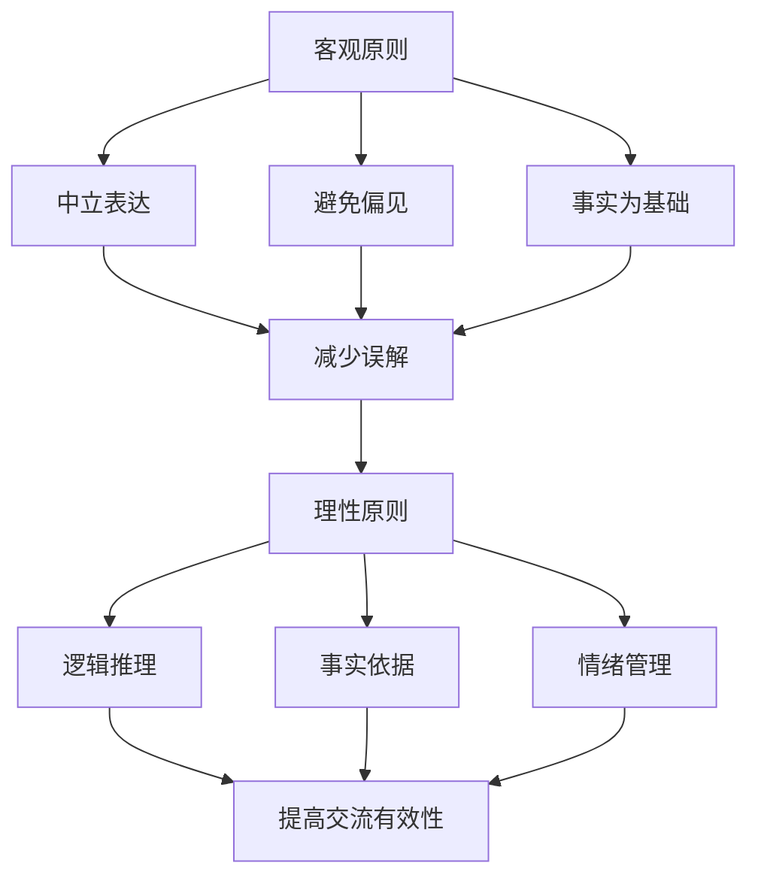
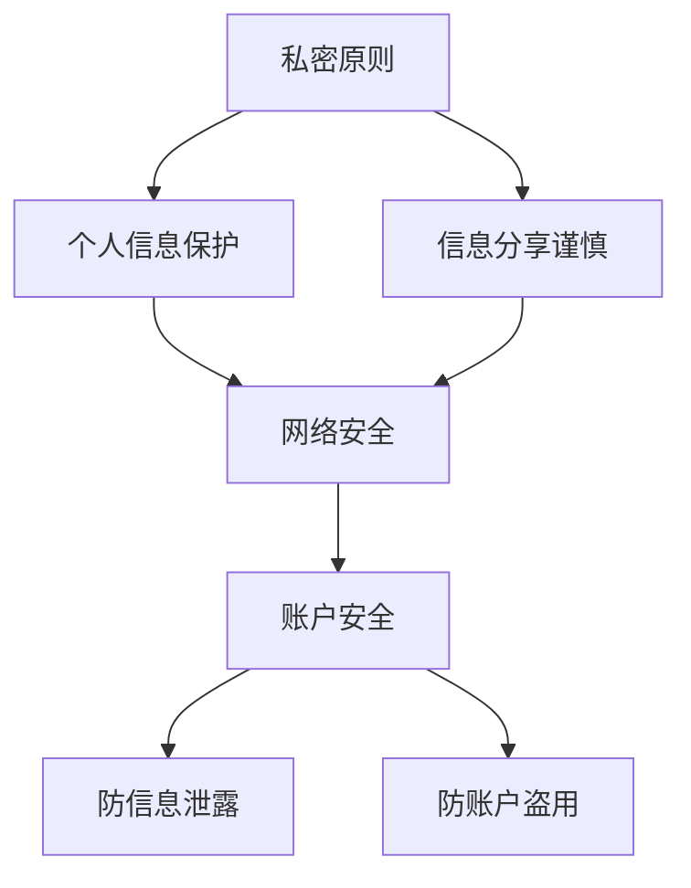

                 

### 背景介绍

#### 社交礼仪的历史与发展

社交礼仪的历史可以追溯到古代，是人类社会交往中一种重要的规范。古代社会，礼仪作为社会秩序的重要保障，具有强烈的规范性和约束力。例如，中国古代的《礼记》详细记载了各种礼仪规范，从宫廷礼仪到民间习俗，无不体现着礼仪在维持社会秩序、增强人际关系中的作用。

随着人类社会的发展，社交礼仪也在不断演变。工业革命时期，随着城市化进程的加快，社交礼仪开始向更为规范化和国际化的方向发展。19世纪末到20世纪初，西方社会的礼仪规则逐渐形成，成为国际交往中的重要准则。

进入数字时代，社交礼仪再度面临挑战和机遇。互联网的普及和社交媒体的兴起，改变了人们的交往方式。虚拟世界中的交流，使得传统社交礼仪的应用场景和形式发生了翻天覆地的变化。如何在数字时代构建一套既符合网络文化特点，又能与现实世界礼仪相互融合的新社交礼仪体系，成为了一个亟待解决的问题。

#### 数字时代的社交特点

数字时代，社交活动呈现出以下几个显著特点：

1. **虚拟性与匿名性**：网络社交平台提供了一个虚拟的空间，用户可以在匿名或半匿名的状态下进行交流，这种特点使得社交礼仪的实施面临新的挑战。

2. **即时性与广泛性**：互联网的即时通讯功能，使得人们可以在瞬间接触到大量信息，进行快速交流。同时，社交网络的广泛性使得社交圈的范围大大扩展。

3. **去中心化**：在传统的社交场合，中心化的角色（如领导者、主持人等）在维持秩序和礼仪方面起着重要作用。而在数字时代，这种中心化的角色逐渐弱化，去中心化的特征使得社交礼仪的实施更加复杂。

4. **跨文化性**：数字时代的社交活动往往涉及不同文化背景的用户，这使得社交礼仪需要兼顾多元文化，形成更为包容的礼仪规范。

### 网络文明与现实世界礼仪的融合

网络文明与现实世界礼仪的融合，是数字时代社交礼仪发展的关键。网络文明体现了互联网时代的交流特点，如自由、开放和共享，而现实世界礼仪则强调规范、尊重和理性。两者的融合，需要考虑以下几个方面：

1. **尊重原则**：无论是网络交流还是现实交往，尊重都是基础。尊重他人的观点、隐私和权利，是建立良好社交关系的前提。

2. **礼貌原则**：礼貌是礼仪的重要组成部分，在网络时代，礼貌的表达方式也需要与时俱进。例如，网络语言的使用要得体，避免使用过于激烈或冒犯性的词汇。

3. **一致性原则**：在数字时代，个人的网络形象和现实形象应当保持一致。这要求人们在网络空间中遵守与现实世界相同的礼仪规范。

4. **包容性原则**：数字时代的社交活动涉及多元文化背景，包容性是关键。在融合网络文明和现实世界礼仪时，应尊重不同文化的差异，倡导多元文化的包容与交流。

#### 小结

数字时代的社交礼仪，既需要继承传统礼仪的核心原则，如尊重、礼貌和理性，又要适应网络文化的特点，如虚拟性、即时性和去中心化。网络文明与现实世界礼仪的融合，需要我们在尊重原则、礼貌原则、一致性原则和包容性原则的基础上，构建一套适应数字时代的新社交礼仪体系。这将有助于维护网络空间的和谐，促进人际关系的健康发展。

## 第二部分：数字时代社交礼仪的基本原则

### 2.1 尊重与礼貌

#### 核心概念

在数字时代，尊重与礼貌是构建健康社交关系的基石。尊重意味着对他人观点、隐私和权利的认可和尊重，而礼貌则体现在对他人的尊重和关心。在虚拟社交环境中，尊重与礼貌的表达方式与传统社交场景有所不同，需要我们特别关注。

#### 原则与联系

**尊重原则**：尊重他人是任何社交活动中的基本准则。在网络空间中，尊重他人不仅体现在对他人观点的认同上，还要尊重他人的隐私和权利。例如，未经他人同意，不应泄露其个人信息。

**礼貌原则**：礼貌是礼仪的核心，体现了对他人的关心和尊重。在网络交流中，礼貌的表现形式包括文明用语、避免使用侮辱性词汇、积极回应他人的信息等。

#### Mermaid 流程图

#### 核心算法原理

在网络社交中，尊重与礼貌的核心算法原理可以概括为以下几点：

1. **文明用语检测**：通过文本分析技术，检测网络语言中的不文明用语，提醒用户修改。
2. **隐私保护算法**：利用隐私保护技术，确保用户在网络空间中的个人信息安全。
3. **情感分析算法**：通过情感分析技术，识别用户的情绪状态，提供相应的礼貌建议。

#### 数学模型和公式

尊重与礼貌的数学模型可以采用情感分析中的情感得分公式：

$$
\text{情感得分} = \sum_{i=1}^{n} \text{词语情感得分} \times \text{词语权重}
$$

其中，词语情感得分和词语权重可以通过情感分析模型预先计算得到。

#### 举例说明

**案例一**：在社交媒体平台上，用户A发表了一条涉及他人隐私的帖子，用户B通过情感分析算法检测到这条帖子可能侵犯他人隐私，提醒用户A修改内容，避免泄露隐私。

**案例二**：用户C在与他人交流时使用了不文明用语，系统通过文明用语检测算法提醒用户C，并提供修改建议，用户C接受建议并修改了发言。

#### 小结

尊重与礼貌是数字时代社交礼仪的核心原则，通过尊重他人和保持礼貌，可以构建和谐的社交环境。在数字时代，我们需要借助技术手段，如情感分析、文本分析等，来确保尊重与礼貌原则的实施，从而促进网络文明的健康发展。

### 2.2 客观与理性

#### 核心概念

客观与理性是数字时代社交礼仪中的另一重要原则。客观性要求我们在交流中保持中立，避免主观偏见；理性则强调我们在处理问题时以逻辑和事实为基础，而非情绪驱动。在数字时代，信息泛滥和情绪传播使得保持客观与理性尤为关键。

#### 原则与联系

**客观原则**：客观性体现在不偏不倚地表达观点，避免因个人情绪或利益影响观点的准确性。在网络社交中，客观原则有助于减少误解和冲突。

**理性原则**：理性交流要求我们以逻辑和事实为依据，而非情绪化或主观臆断。理性原则有助于提高交流的有效性和解决问题的效率。

#### Mermaid 流程图

#### 核心算法原理

1. **情感过滤算法**：通过情感分析技术，识别和过滤掉情绪化或偏激的言论，促进理性交流。
2. **事实验证算法**：利用大数据分析和事实验证技术，确保信息来源的可靠性和准确性。
3. **逻辑推理算法**：通过自然语言处理技术，辅助用户构建逻辑清晰的论述，提高交流质量。

#### 数学模型和公式

理性交流的数学模型可以采用逻辑推理中的命题逻辑公式：

$$
\text{命题逻辑} = P \land Q
$$

其中，P和Q为两个命题，逻辑运算符“∧”表示逻辑与操作。

#### 举例说明

**案例一**：用户A在社交媒体上发布了一条情绪化的评论，系统通过情感过滤算法检测到该评论可能引发争议，建议用户A修改为更加客观的表达。

**案例二**：用户B在讨论中引用了不准确的数据，系统通过事实验证算法提示用户B核实数据来源，确保信息准确性。

#### 小结

客观与理性是数字时代社交礼仪的关键原则，通过保持客观和理性，我们可以构建更为和谐和高效的社交环境。借助技术手段，如情感过滤、事实验证和逻辑推理，可以更好地实施这些原则，从而促进网络文明的健康发展。

### 2.3 私密与安全

#### 核心概念

在数字时代，私密与安全是社交礼仪中不可忽视的重要原则。私密性涉及个人信息的保护，而安全性则关注网络安全和隐私风险。随着网络社交活动的普及，如何保护用户的私密性和安全性成为社交礼仪的核心议题。

#### 原则与联系

**私密原则**：私密性强调保护个人信息的权利，包括但不限于姓名、住址、电话号码等。在数字时代，用户在分享信息时需谨慎，避免泄露个人隐私。

**安全原则**：安全性涉及网络安全和用户账户安全。在数字社交中，用户需要采取一系列措施，如设置强密码、使用安全认证等，以防止信息泄露和账户被盗用。

#### Mermaid 流程图

#### 核心算法原理

1. **加密算法**：使用加密技术，如AES、RSA等，确保数据在传输和存储过程中的安全性。
2. **访问控制算法**：通过访问控制机制，限制对敏感信息的访问权限，确保私密性。
3. **恶意行为检测算法**：利用机器学习技术，检测和阻止网络钓鱼、恶意软件等安全威胁。

#### 数学模型和公式

私密性与安全性的数学模型可以采用信息熵的概念来描述：

$$
\text{信息熵} = -\sum_{i} p(x_i) \log_2 p(x_i)
$$

其中，$p(x_i)$表示每个信息出现的概率，信息熵用于衡量信息的不确定性，熵值越低，信息越私密和安全。

#### 举例说明

**案例一**：用户A在社交媒体上发布了个人联系方式，系统通过隐私保护算法提醒用户A注意保护个人隐私，建议其仅在信任的社交圈中分享。

**案例二**：用户B在登录账户时，系统通过安全认证算法检测到其输入的密码可能过于简单，建议用户B设置更为复杂的密码，提高账户安全性。

#### 小结

私密与安全是数字时代社交礼仪的核心原则，通过保护个人隐私和确保网络安全，我们可以构建一个更加安全和可信的社交环境。利用加密、访问控制和恶意行为检测等算法，可以有效地实施这些原则，从而促进网络文明的健康发展。

## 第三部分：网络文明中的社交礼仪

### 第3章：网络社交平台礼仪

#### 3.1 社交平台使用规范

##### 核心概念

网络社交平台作为现代社会中重要的交流工具，其使用规范直接影响到用户的社交体验和平台生态。社交平台使用规范涵盖了注册、发言、互动等多个方面，旨在为用户提供一个健康、文明的交流环境。

##### 规范内容

1. **注册规范**：用户在注册时需提供真实有效的信息，确保身份的真实性和可追溯性。同时，应遵守平台关于用户名、头像等设置的规范。

2. **发言规范**：用户在发布内容时应遵守相关法律法规，不得发布违法信息、恶俗内容或侮辱性言论。此外，应保持文明用语，避免使用过于激烈或侮辱性的词汇。

3. **互动规范**：用户在与其他用户互动时，应保持礼貌和尊重，避免恶意攻击、人身攻击或网络霸凌。在参与讨论时，应理性表达观点，避免情绪化发言。

##### 核心算法原理

1. **身份验证算法**：通过验证码、手机验证等手段，确保用户注册信息的真实性。

2. **内容审核算法**：利用自然语言处理和图像识别等技术，对用户发布的内容进行实时审核，过滤违规信息。

3. **互动监测算法**：通过情感分析和行为分析，监测用户间的互动，及时发现和阻止恶意行为。

##### 数学模型和公式

社交平台使用规范的数学模型可以采用评分机制，通过对用户行为的评分来评估其合规性：

$$
\text{合规评分} = \sum_{i=1}^{n} \text{行为得分} \times \text{权重}
$$

其中，行为得分和权重可以根据平台的具体规则预先设定。

##### 举例说明

**案例一**：用户A在注册时未提供真实手机号码，系统通过手机验证算法提示用户A补全信息，确保身份真实。

**案例二**：用户B在发言中使用了不文明用语，系统通过内容审核算法将其发言标记为违规，并提示用户B修改。

##### 小结

社交平台使用规范是数字时代社交礼仪的重要组成部分，通过明确的注册、发言和互动规范，可以保障用户的合法权益，维护良好的社交环境。利用技术手段，如身份验证、内容审核和互动监测，可以有效地实施这些规范，促进网络文明的健康发展。

### 3.2 在线交流技巧

##### 核心概念

在线交流技巧是数字时代社交礼仪中至关重要的部分，涉及沟通方式的优化、信息表达的准确性和互动的有效性。良好的在线交流技巧不仅能提升个人形象，还能促进沟通效率，建立和谐的社交关系。

##### 技巧内容

1. **文明用语**：在线交流中应使用文明用语，避免使用侮辱性词汇，保持礼貌和尊重。

2. **简洁明了**：信息表达要简洁明了，避免冗长和模糊不清的陈述，提高沟通效率。

3. **主动倾听**：在交流中要主动倾听对方意见，及时回应，避免长时间沉默或不恰当的中断。

4. **表情符号和语气**：适当使用表情符号和语气助词，以传达情感和增强沟通效果。

5. **避免情绪化**：在讨论中保持理性，避免因情绪化言论引发不必要的冲突。

##### 核心算法原理

1. **情感分析算法**：通过分析文本的情感倾向，帮助用户识别和调整情绪表达，促进理性交流。

2. **自然语言处理**：利用自然语言处理技术，优化信息表达，提高沟通的准确性和效率。

3. **实时翻译**：使用实时翻译技术，消除语言障碍，促进跨文化交流。

##### 数学模型和公式

在线交流技巧的数学模型可以采用语义相似度计算，以衡量信息表达的准确性和清晰度：

$$
\text{语义相似度} = \frac{\text{共同特征数}}{\text{总特征数}}
$$

其中，共同特征数和总特征数可以通过文本分析技术预先计算得到。

##### 举例说明

**案例一**：用户A在交流中使用过于复杂的语言，系统通过自然语言处理算法提醒用户A简化表达，提高沟通效率。

**案例二**：用户B在讨论中表达过于情绪化，系统通过情感分析算法建议用户B保持冷静，避免情绪化发言。

##### 小结

在线交流技巧是数字时代社交礼仪的重要体现，通过文明用语、简洁表达、主动倾听、表情符号使用和避免情绪化等技巧，可以提升交流质量，促进人际关系的和谐。利用情感分析、自然语言处理和实时翻译等技术，可以更好地实施这些技巧，推动网络文明的健康发展。

### 3.3 网络论坛礼仪

##### 核心概念

网络论坛是数字时代重要的社交平台之一，它为用户提供了自由表达观点和交流思想的场所。网络论坛礼仪旨在维护论坛的和谐氛围，促进积极健康的讨论，使论坛成为一个有益的知识分享平台。

##### 礼仪内容

1. **主题相关**：发帖时应紧扣主题，避免无关内容的发布，确保讨论的针对性和专业性。

2. **文明发言**：论坛讨论中应保持文明用语，避免使用侮辱性或攻击性语言，尊重不同观点。

3. **积极参与**：在论坛中应积极参与讨论，对他人观点给予尊重和回应，形成良性互动。

4. **信息真实**：发帖时应确保信息的真实性，避免发布虚假信息和误导性内容。

5. **版面整洁**：保持论坛版面整洁，及时删除违规内容和垃圾广告，维护论坛的整洁和美观。

##### 核心算法原理

1. **话题检测算法**：通过自然语言处理技术，检测帖子是否符合论坛主题，确保讨论的针对性。

2. **情感分析算法**：分析用户发言的情感倾向，识别和过滤文明用语和不文明言论，维护论坛的文明氛围。

3. **垃圾邮件过滤算法**：利用机器学习技术，识别和过滤垃圾广告和无关信息，保持论坛的整洁。

##### 数学模型和公式

网络论坛礼仪的数学模型可以采用词频分析方法，衡量帖子内容的主题相关性和信息质量：

$$
\text{主题相关度} = \frac{\text{相关词汇频率}}{\text{总词汇频率}}
$$

其中，相关词汇频率和总词汇频率可以通过文本分析技术预先计算得到。

##### 举例说明

**案例一**：用户A在论坛中发布了一篇与主题无关的帖子，系统通过话题检测算法提醒用户A修改，确保讨论的相关性。

**案例二**：用户B的发言包含不文明用语，系统通过情感分析算法将其发言标记为不文明，并提示用户B修改。

##### 小结

网络论坛礼仪是维护论坛和谐的重要保障，通过主题相关、文明发言、积极参与、信息真实和版面整洁等规范，可以构建一个良好的讨论氛围，促进知识的分享和交流。利用话题检测、情感分析和垃圾邮件过滤等算法，可以更好地实施这些礼仪规范，推动网络论坛的健康发展。

### 第4章：社交媒体礼仪

#### 4.1 社交媒体平台的使用原则

##### 核心概念

社交媒体平台是数字时代社交互动的主要场所，其使用原则直接影响到用户的社交体验和平台的运营环境。正确的使用原则有助于维护良好的社交秩序，促进健康的交流。

##### 原则内容

1. **合法合规**：用户在使用社交媒体平台时，必须遵守相关法律法规和平台规则，不得发布违法信息和违规内容。

2. **尊重他人**：在社交媒体上，用户应尊重他人的观点和隐私，避免恶意攻击、侮辱和人身攻击，维护友善的交流氛围。

3. **真实可信**：发布的信息应确保真实性和准确性，避免虚假宣传和误导性内容，建立用户信任。

4. **理性表达**：在表达观点时，应保持理性，避免情绪化言论，促进理性、有建设性的讨论。

5. **隐私保护**：用户应保护自己的隐私，避免在社交媒体上公开敏感信息，防止个人信息泄露。

##### 核心算法原理

1. **内容审核算法**：通过自然语言处理和图像识别等技术，对用户发布的内容进行实时审核，过滤违规信息。

2. **隐私保护算法**：利用加密技术，保护用户的个人信息，确保隐私安全。

3. **情感分析算法**：分析用户发言的情感倾向，识别和过滤情绪化言论，促进理性交流。

##### 数学模型和公式

社交媒体平台的使用原则的数学模型可以采用违规行为检测模型：

$$
\text{违规概率} = \sum_{i=1}^{n} \text{违规特征} \times \text{权重}
$$

其中，违规特征和权重可以根据平台的具体规则和违规类型预先设定。

##### 举例说明

**案例一**：用户A在社交媒体上发布了一条包含侮辱性词汇的评论，系统通过内容审核算法将其评论标记为违规，并提示用户A修改。

**案例二**：用户B的个人信息在社交媒体上被公开，系统通过隐私保护算法提醒用户B注意隐私安全，并提供隐私保护建议。

##### 小结

社交媒体平台的使用原则是维护社交秩序和用户权益的重要保障。通过合法合规、尊重他人、真实可信、理性表达和隐私保护等原则，可以构建一个健康、有序的社交媒体环境。利用内容审核、隐私保护和情感分析等算法，可以更好地实施这些原则，促进社交媒体平台的健康发展。

### 4.2 微博、微信、知乎等平台礼仪

##### 核心概念

微博、微信、知乎等是数字时代主要的社交媒体平台，各自有着独特的交流方式和礼仪规范。了解和遵循这些平台的礼仪，有助于用户更好地参与社交互动，提升个人形象和沟通效果。

##### 微博礼仪

1. **简短有力**：微博内容应简洁明了，用简短的语言表达观点，避免冗长和模糊的信息。

2. **实时互动**：及时回复评论和私信，积极参与话题讨论，形成良好的互动氛围。

3. **关注热点**：关注热门话题和事件，积极参与讨论，提升信息的传播力和影响力。

4. **文明用语**：使用文明用语，避免使用侮辱性或攻击性词汇，保持礼貌和尊重。

##### 微信礼仪

1. **礼貌打招呼**：在微信聊天中，使用礼貌的语言打招呼，例如“您好”、“谢谢”等。

2. **尊重个人空间**：避免频繁发送消息或打扰他人，尊重他人的个人时间和隐私。

3. **内容简明**：在发送信息时，内容应简明扼要，避免使用过多的表情符号和缩写。

4. **避免过度宣传**：在微信朋友圈中，避免过度宣传或发布广告，保持内容的真实性和价值性。

##### 知乎礼仪

1. **专业回答**：在知乎上，应提供专业、有深度的回答，避免浅显或不准确的信息。

2. **尊重观点**：尊重其他用户的观点，即使在争论中，也应保持理性，避免人身攻击。

3. **避免抄袭**：引用他人观点或内容时，应注明来源，避免抄袭行为。

4. **积极参与**：积极参与话题讨论和回答，为社区贡献有价值的信息。

##### 核心算法原理

1. **情感分析算法**：分析用户发言的情感倾向，识别和过滤不文明言论和情绪化表达。

2. **内容审核算法**：通过自然语言处理和图像识别等技术，对用户发布的内容进行实时审核，过滤违规信息。

3. **互动推荐算法**：根据用户的行为和偏好，推荐相关的话题和内容，促进用户的参与和互动。

##### 数学模型和公式

社交媒体平台礼仪的数学模型可以采用社交影响力模型，衡量用户在平台上的影响力：

$$
\text{影响力得分} = \sum_{i=1}^{n} (\text{互动次数} \times \text{互动质量})
$$

其中，互动次数和互动质量可以根据用户的实际互动数据预先设定。

##### 举例说明

**案例一**：用户A在知乎上发布了一篇专业回答，系统通过内容审核算法判定其内容质量高，并将其推荐给更多用户。

**案例二**：用户B在微信朋友圈发布了一条广告，系统通过情感分析算法识别其为过度宣传，提醒用户B调整内容。

##### 小结

微博、微信、知乎等平台的礼仪规范，是用户在这些平台上进行有效社交的重要保障。通过简短有力、实时互动、文明用语等微博礼仪，礼貌打招呼、尊重个人空间等微信礼仪，以及专业回答、尊重观点等知乎礼仪，用户可以更好地参与社交互动，提升个人形象和沟通效果。利用情感分析、内容审核和互动推荐等算法，可以更好地实施这些礼仪规范，促进社交媒体平台的健康发展。

### 4.3 社交媒体互动技巧

##### 核心概念

社交媒体互动技巧是用户在社交媒体平台上有效参与社交活动、提升个人影响力的关键。这些技巧涉及内容创作、互动策略、影响力构建等方面，旨在帮助用户更好地利用社交媒体平台进行交流和分享。

##### 技巧内容

1. **内容创作**：创作有质量、有价值的内容是社交媒体互动的基础。内容应具备吸引力、专业性和时效性，避免重复和低质信息。

2. **互动策略**：有效的互动策略包括及时回复、积极参与话题讨论、与其他用户建立良好关系等。通过互动，可以提升用户的可见度和影响力。

3. **影响力构建**：构建个人影响力需要积累粉丝、提升互动质量和内容质量。可以通过定期发布高质量内容、参与热点话题、与其他意见领袖互动等方式来实现。

##### 核心算法原理

1. **内容推荐算法**：利用机器学习技术，根据用户的兴趣和行为数据，推荐相关的优质内容，提高用户的参与度。

2. **互动分析算法**：分析用户互动行为的数据，如点赞、评论、分享等，识别高互动质量的内容和用户，优化互动策略。

3. **情感分析算法**：分析用户发布内容的情感倾向，识别受欢迎的积极内容，提高内容的吸引力和影响力。

##### 数学模型和公式

社交媒体互动技巧的数学模型可以采用用户影响力模型，衡量用户在平台上的影响力：

$$
\text{影响力得分} = \sum_{i=1}^{n} (\text{互动次数} \times \text{互动质量})
$$

其中，互动次数和互动质量可以根据用户的实际互动数据预先设定。

##### 举例说明

**案例一**：用户A在社交媒体上定期发布高质量内容，系统通过内容推荐算法将其内容推荐给更多用户，提高了其影响力。

**案例二**：用户B积极参与热门话题讨论，系统通过互动分析算法识别其互动质量高，并将其推荐为话题达人。

##### 小结

社交媒体互动技巧是提升用户社交影响力的重要手段。通过高质量的内容创作、有效的互动策略和影响力构建，用户可以在社交媒体上获得更多关注和认可。利用内容推荐、互动分析和情感分析等算法，可以更好地实施这些互动技巧，提升用户的社交体验和影响力。这些技巧不仅有助于个人发展，也有助于构建健康、积极的社交媒体环境。

## 第四部分：现实世界中的社交礼仪

### 第5章：现实社交活动礼仪

#### 5.1 会议、宴会等社交活动礼仪

##### 核心概念

会议和宴会等社交活动是现实生活中重要的社交场合，礼仪的正确运用有助于营造良好的社交氛围，提高活动效率，增强人际关系。不同类型的社交活动有其独特的礼仪规范，了解和遵循这些规范是成功参与这些活动的重要保障。

##### 礼仪内容

1. **会议礼仪**：
   - **提前准备**：参加会议前，应了解会议议程和背景资料，准备好相关材料和问题。
   - **准时到达**：准时是基本的礼仪，迟到会给组织者和他人带来不便。
   - **着装得体**：根据会议的性质和场合选择合适的着装，保持整洁和专业。
   - **专注聆听**：会议中，保持专注，避免私聊或处理其他事务。
   - **尊重发言者**：在他人发言时，保持安静，避免打断，给予充分的时间表达观点。

2. **宴会礼仪**：
   - **邀请与回复**：收到宴会邀请后，应尽早回复，以便组织者做好安排。
   - **着装规范**：根据宴会类型选择合适的服装，正式场合应穿着正式。
   - **敬酒与祝福**：敬酒时应双手持杯，敬酒对象一般为长辈或重要宾客。
   - **用餐礼仪**：用餐时，遵循礼仪，避免大声喧哗，注意餐具的使用顺序。
   - **告别与感谢**：宴会结束后，向主人和其他宾客表示感谢，有序离场。

##### 核心算法原理

1. **时间管理算法**：通过优化日程安排，确保会议和宴会等活动的准时进行。

2. **着装推荐算法**：根据活动类型和场合，为用户提供合适的着装建议。

3. **互动分析算法**：分析参与者的互动行为，优化社交活动中的交流氛围。

##### 数学模型和公式

现实社交活动礼仪的数学模型可以采用参与者满意度模型，衡量社交活动的效果：

$$
\text{满意度得分} = \sum_{i=1}^{n} (\text{参与者评价} \times \text{权重})
$$

其中，参与者评价和权重可以根据活动的具体情况和参与者反馈数据预先设定。

##### 举例说明

**案例一**：用户A参加了一场商务会议，准时到达并认真聆听，获得了会议组织者和同事的高度评价。

**案例二**：用户B在宴会中表现出色，得到了主人和宾客的一致好评。

##### 小结

会议、宴会等社交活动礼仪是现实社交中不可或缺的部分。通过提前准备、准时到达、着装得体、专注聆听、尊重发言者等会议礼仪，以及邀请与回复、着装规范、敬酒与祝福、用餐礼仪、告别与感谢等宴会礼仪，可以有效地提高活动效率，营造良好的社交氛围。利用时间管理、着装推荐和互动分析等算法，可以更好地实施这些礼仪规范，提升社交活动的质量和效果。

### 5.2 商务交流礼仪

##### 核心概念

商务交流礼仪是商业活动中必不可少的一部分，它反映了个人的专业素养和公司的形象。在商务交流中，礼仪不仅关乎个人的形象，还影响到合作关系的建立和商务活动的顺利进行。因此，了解和掌握商务交流礼仪尤为重要。

##### 礼仪内容

1. **商务会谈礼仪**：
   - **前期准备**：在与对方进行商务会谈前，应充分了解对方的背景和需求，准备相关资料。
   - **准时赴约**：商务会谈应准时开始，迟到被视为不尊重对方的表现。
   - **言行举止**：在会谈中，保持专业和礼貌，避免使用过于随意或冒犯性的语言。
   - **倾听与回应**：倾听对方的意见，给予充分的回应，展现合作意愿。

2. **商务接待礼仪**：
   - **迎接与送别**：迎接客人时，应热情有礼，握手和问候是常见的礼仪。
   - **安排座位**：根据客人的身份和地位安排座位，通常以主宾为主，方便交流。
   - **提供服务**：为客人提供茶水、资料等，展示细致周到的服务。

3. **商务沟通礼仪**：
   - **清晰表达**：在沟通时，应确保信息表达清晰、准确，避免产生误解。
   - **尊重差异**：不同文化背景的商务交流，应尊重对方的文化习惯，避免文化冲突。
   - **掌握时机**：在关键时刻，适时的沉默或提问可以起到画龙点睛的作用。

##### 核心算法原理

1. **文化分析算法**：通过分析参与者的文化背景，提供相应的礼仪建议，避免文化冲突。

2. **沟通优化算法**：利用自然语言处理技术，优化沟通效果，确保信息传达的准确性和清晰度。

3. **时间管理算法**：通过合理安排时间，提高商务会谈和接待的效率。

##### 数学模型和公式

商务交流礼仪的数学模型可以采用沟通满意度模型，衡量商务交流的效果：

$$
\text{沟通满意度} = \frac{\text{有效沟通次数}}{\text{总沟通次数}} \times \text{权重}
$$

其中，有效沟通次数和总沟通次数可以根据实际交流数据预先设定。

##### 举例说明

**案例一**：用户A在与国外客户进行商务会谈前，通过文化分析算法了解了对方的文化习惯，避免了因文化差异引起的误解。

**案例二**：用户B在商务接待中，通过沟通优化算法清晰表达了公司的合作意愿，赢得了客户的高度认可。

##### 小结

商务交流礼仪是商业活动中建立良好合作关系的重要基础。通过前期准备、准时赴约、言行举止、倾听与回应等商务会谈礼仪，迎接与送别、安排座位、提供服务等商务接待礼仪，以及清晰表达、尊重差异、掌握时机等商务沟通礼仪，可以有效地提高商务交流的效果，促进商业合作的顺利进行。利用文化分析、沟通优化和时间管理等算法，可以更好地实施这些礼仪规范，提升商务交流的质量和成功率。

### 5.3 招待礼仪

##### 核心概念

招待礼仪是商务活动和个人交往中的一项重要内容，它体现了对客人的尊重和关心，有助于建立友好的人际关系。成功的招待不仅能留下良好的印象，还能为未来的合作奠定基础。因此，了解和掌握招待礼仪尤为重要。

##### 礼仪内容

1. **准备工作**：
   - **了解客人**：在招待前，应详细了解客人的需求、偏好和背景，以便提供个性化的服务。
   - **安排场地**：选择合适的场地，确保环境舒适、整洁，满足客人的需求。
   - **准备餐饮**：根据客人的口味和喜好，准备合适的餐饮，避免提供不适宜的食物或饮品。

2. **接待礼仪**：
   - **迎接客人**：在客人到达时，应热情迎接，握手问候，展示友好态度。
   - **引导客人**：带领客人到指定位置，介绍其他人，确保客人感受到尊重和关心。

3. **宴会礼仪**：
   - **敬酒与祝福**：在宴会上，主宾敬酒时应双手持杯，表达诚挚的祝福。
   - **用餐礼仪**：遵循用餐礼仪，注意餐具的使用顺序，避免大声喧哗。

4. **送别礼仪**：
   - **感谢客人**：在客人离开时，应表达诚挚的感谢，确保客人感受到尊重和满意。

##### 核心算法原理

1. **个性化推荐算法**：通过分析客人的喜好和需求，提供个性化的招待方案，提升客人的满意度。

2. **行为分析算法**：通过观察客人的行为和反馈，及时调整招待方式，确保提供的服务符合客人的期望。

3. **情感分析算法**：分析客人的情感倾向，识别和应对客人的情绪变化，提供及时的关怀和支持。

##### 数学模型和公式

招待礼仪的数学模型可以采用客人满意度模型，衡量招待的效果：

$$
\text{满意度得分} = \sum_{i=1}^{n} (\text{客人评价} \times \text{权重})
$$

其中，客人评价和权重可以根据客人的反馈数据预先设定。

##### 举例说明

**案例一**：用户A在招待客人前，通过个性化推荐算法了解了客人的饮食习惯，准备了客人喜欢的餐饮，提高了客人的满意度。

**案例二**：用户B在宴会上，通过情感分析算法识别到客人的情绪低落，及时提供了关怀和帮助，提升了整体招待效果。

##### 小结

招待礼仪是建立良好人际关系和成功合作的重要环节。通过准备工作、接待礼仪、宴会礼仪和送别礼仪等规范，可以确保招待活动的顺利进行，提升客人的满意度和体验。利用个性化推荐、行为分析和情感分析等算法，可以更好地实施这些礼仪规范，提供更加贴心和个性化的招待服务。这些努力不仅有助于提升个人形象和公司声誉，还能为未来的合作创造有利条件。

### 第6章：人际交往中的礼仪

#### 6.1 常见礼仪问题

##### 核心概念

人际交往中的礼仪问题是指在日常生活中，人们在交往过程中遇到的一些常见的礼仪难题。正确处理这些礼仪问题，不仅有助于维护良好的人际关系，还能提升个人形象和社交能力。常见的礼仪问题包括称呼选择、礼物赠送、宴会礼仪等。

##### 礼仪问题内容

1. **称呼选择**：在人际交往中，选择合适的称呼是非常重要的。对长辈、平辈和晚辈的称呼应有所区别，避免使用不恰当或冒犯性的称呼。

2. **礼物赠送**：在送礼时，应考虑对方的喜好和需求，避免选择不适宜的礼物。礼物的包装和赠送方式也应符合礼仪规范，表达真挚的祝福和敬意。

3. **宴会礼仪**：参加宴会时，应注意着装得体、准时赴约、遵守用餐礼仪等。在宴会中，积极参与交流，尊重主人和其他宾客，展现良好的社交素养。

##### 核心算法原理

1. **文化分析算法**：通过分析不同文化背景下的礼仪规范，为用户提供合适的称呼和礼物建议。

2. **行为分析算法**：通过观察和记录人际交往中的行为数据，识别常见的礼仪问题，并提供相应的解决方案。

3. **情感分析算法**：分析交往双方的交流内容，识别潜在的情绪问题，提供情感关怀和沟通建议。

##### 数学模型和公式

常见礼仪问题的数学模型可以采用社交满意模型，衡量人际交往中的礼仪效果：

$$
\text{社交满意度} = \frac{\text{有效互动次数}}{\text{总互动次数}} \times \text{权重}
$$

其中，有效互动次数和总互动次数可以根据实际交往数据预先设定。

##### 举例说明

**案例一**：用户A在与外国朋友交往时，通过文化分析算法了解到对方的称呼习惯，避免了使用不恰当的称呼，提高了对方的满意度。

**案例二**：用户B在赠送礼物时，通过行为分析算法识别到对方的喜好，选择了合适的礼物，提升了礼物赠送的成功率。

##### 小结

人际交往中的礼仪问题对于维护良好的人际关系至关重要。通过正确处理称呼选择、礼物赠送、宴会礼仪等常见礼仪问题，可以提升人际交往的满意度，增强社交能力。利用文化分析、行为分析和情感分析等算法，可以更好地识别和解决这些礼仪问题，提供个性化的礼仪建议，促进人际关系的和谐发展。

### 6.2 沟通与交际技巧

##### 核心概念

沟通与交际技巧是成功人际交往的关键，涉及语言表达、倾听技巧、非语言沟通等方面。掌握有效的沟通和交际技巧，不仅能够增强个人的社交能力，还能促进团队协作和建立良好的人际关系。

##### 技巧内容

1. **语言表达**：
   - **清晰准确**：在表达观点时，应确保语言清晰、准确，避免使用模糊或歧义的词汇。
   - **得体礼貌**：使用礼貌用语，尊重对方的感受，避免使用冒犯性或攻击性的语言。
   - **有针对性**：根据不同的听众和场合，调整表达方式和内容，提高沟通效果。

2. **倾听技巧**：
   - **主动倾听**：在对方发言时，保持专注，避免打断，给予充分的倾听时间。
   - **理解对方意图**：通过提问和反馈，确保理解对方的观点和需求，避免误解。
   - **给予反馈**：在对方发言结束后，给予积极的反馈，表达认同或提出建设性意见。

3. **非语言沟通**：
   - **身体语言**：通过肢体动作、面部表情和眼神交流等，传达尊重和关注。
   - **语音语调**：使用适当的语音语调，体现真诚和热情，增强沟通效果。
   - **空间距离**：根据文化背景和关系亲疏，选择合适的人际距离，避免侵犯对方隐私。

##### 核心算法原理

1. **自然语言处理**：利用自然语言处理技术，优化语言表达，确保信息的准确性和清晰度。

2. **语音识别与合成**：通过语音识别和合成技术，辅助沟通，提高沟通效率。

3. **行为识别算法**：通过分析身体语言和面部表情，识别和解读对方的情感和意图。

##### 数学模型和公式

沟通与交际技巧的数学模型可以采用沟通效率模型，衡量沟通效果：

$$
\text{沟通效率} = \frac{\text{有效沟通时间}}{\text{总沟通时间}} \times \text{权重}
$$

其中，有效沟通时间和总沟通时间可以根据实际沟通数据预先设定。

##### 举例说明

**案例一**：用户A在团队会议中，通过自然语言处理技术优化了表达，确保信息传达的准确性和清晰度，提升了沟通效果。

**案例二**：用户B在交谈中，通过行为识别算法识别到对方的情绪变化，及时调整了沟通策略，缓解了紧张气氛。

##### 小结

沟通与交际技巧是成功人际交往的核心要素。通过清晰准确、得体礼貌的语言表达，主动倾听、理解对方意图的倾听技巧，以及有效的非语言沟通，可以增强人际交往的效果。利用自然语言处理、语音识别与合成和行为识别等算法，可以更好地实施这些技巧，提升沟通和交际能力，促进人际关系的和谐发展。

### 6.3 个人礼仪修养提升

##### 核心概念

个人礼仪修养的提升是建立和谐人际关系、提升个人形象的重要途径。通过不断学习和实践，个人可以在日常生活中更好地运用礼仪规范，从而提升自身的社交能力和人际交往质量。

##### 提升方法

1. **自我反思**：定期反思自己的言行，识别并改正不恰当的礼仪行为，提升自我修养。

2. **学习礼仪知识**：通过阅读礼仪相关书籍、参加礼仪培训课程，系统学习礼仪知识，了解不同场合下的礼仪规范。

3. **模仿优秀榜样**：观察并学习优秀人士的礼仪行为，模仿他们的言行举止，提升自己的礼仪修养。

4. **实践礼仪规范**：在日常生活中，积极实践礼仪规范，如礼貌用语、得体着装、尊重他人等，将礼仪知识转化为实际行为。

5. **参加社交活动**：积极参与各种社交活动，如会议、宴会、社交聚会等，通过实践提高自己的礼仪能力。

##### 核心算法原理

1. **行为监测算法**：通过行为监测技术，记录个人的礼仪行为，分析并反馈改进建议。

2. **反馈与评估算法**：结合他人的反馈和自身的表现，对礼仪行为进行评估和改进。

3. **学习推荐算法**：根据个人学习需求和偏好，推荐适合的礼仪学习资源，提高学习效率。

##### 数学模型和公式

个人礼仪修养提升的数学模型可以采用行为改进模型，衡量礼仪行为的改进效果：

$$
\text{改进效果} = \frac{\text{改进后行为得分}}{\text{改进前行为得分}} \times \text{权重}
$$

其中，改进后行为得分和改进前行为得分可以根据礼仪行为的评估结果预先设定。

##### 举例说明

**案例一**：用户A通过行为监测算法记录了自己的礼仪行为，识别出需要改进的方面，并接受了改进建议，提升了个人礼仪修养。

**案例二**：用户B通过学习推荐算法，收到了适合其学习需求的礼仪培训课程推荐，提高了学习效果。

##### 小结

个人礼仪修养的提升是一个持续学习和实践的过程。通过自我反思、学习礼仪知识、模仿优秀榜样、实践礼仪规范和参加社交活动等方法，个人可以不断提升礼仪修养。利用行为监测、反馈与评估和学习推荐等算法，可以更好地识别和改进礼仪行为，提高个人礼仪修养，从而在人际交往中展现更好的自我形象。

### 6.4 社交场合的应对策略

##### 核心概念

在社交场合中，应对策略的灵活运用能够帮助个人在各种社交活动中自如应对，提升社交效果。这些策略涉及自我介绍、沟通技巧、应对冲突等，旨在增强个人在社交场合的自信心和影响力。

##### 应对策略

1. **自我介绍**：
   - **简洁明了**：自我介绍应简洁明了，突出自己的特点和价值。
   - **个性化**：根据场合和听众，调整自我介绍的内容，使其更具针对性。
   - **自信大方**：保持自信和大方，避免过度谦虚或夸大其词。

2. **沟通技巧**：
   - **倾听与回应**：在交流中，注重倾听对方的发言，并及时给予积极的回应，展现尊重和关注。
   - **提问技巧**：通过提问引导对话，展示自己的兴趣和知识面。
   - **情绪管理**：保持情绪稳定，避免因情绪波动影响沟通效果。

3. **应对冲突**：
   - **理性分析**：面对冲突时，保持冷静，理性分析问题的根源。
   - **沟通解决**：通过有效沟通，寻找共同点和解决方案，避免情绪化的对抗。
   - **调解技巧**：在冲突中，充当调解者，帮助双方找到平衡点。

##### 核心算法原理

1. **情感分析算法**：通过分析交流双方的文字和语音，识别情绪变化，提供情绪管理和沟通建议。

2. **行为模式识别算法**：通过观察个体的行为模式，识别其在社交场合中的优点和不足，提供改进建议。

3. **情景模拟算法**：通过虚拟环境模拟不同的社交场合，帮助个体提前练习应对策略。

##### 数学模型和公式

社交场合应对策略的数学模型可以采用社交效果评估模型，衡量策略的有效性：

$$
\text{社交效果} = \sum_{i=1}^{n} (\text{正面反馈次数} \times \text{权重})
$$

其中，正面反馈次数和权重可以根据社交场合的实际情况和反馈数据预先设定。

##### 举例说明

**案例一**：用户A在社交场合中通过情感分析算法识别到对方的情绪波动，调整了沟通方式，避免了冲突的发生。

**案例二**：用户B通过情景模拟算法，提前练习了自我介绍和提问技巧，在实际场合中展现出了出色的表现。

##### 小结

社交场合的应对策略是提升个人社交能力的重要手段。通过自我介绍、沟通技巧、应对冲突等策略，个人可以在各种社交场合中自如应对，提升自身的社交效果。利用情感分析、行为模式识别和情景模拟等算法，可以更好地实施这些策略，提高社交能力，建立良好的人际关系。

## 第四部分：数字时代社交礼仪实践

### 第7章：数字时代社交礼仪案例分析

#### 7.1 成功案例分享

##### 案例背景

在数字时代，随着社交媒体的广泛应用，如何构建健康、文明的网络社交环境成为了一项重要课题。以下是几个成功的案例，它们在数字时代社交礼仪的实施方面提供了有益的经验和借鉴。

##### 案例一：知乎平台的礼仪建设

**背景**：知乎作为一个知识分享和社交平台，用户基数庞大，涉及的话题广泛。为了维护良好的讨论氛围，知乎在社交礼仪方面采取了一系列措施。

**实施措施**：
1. **制定明确规则**：知乎制定了详细的社交礼仪规则，包括发言规范、互动礼仪等，确保用户在平台上遵守这些规范。
2. **内容审核机制**：知乎利用AI技术，对用户发布的内容进行实时审核，过滤违规信息，防止不文明言论的传播。
3. **用户教育**：知乎通过定期发布礼仪指南、举办线上讲座等方式，提高用户的礼仪意识，引导用户文明交流。

**效果**：通过这些措施，知乎成功地维护了平台的文明氛围，提升了用户的满意度和平台的可信度。

##### 案例二：微博的文明用语推广

**背景**：微博作为我国领先的社交媒体平台，用户活跃度高，但同时也存在不文明用语和恶意攻击的现象。为了改善这一状况，微博采取了一系列措施推广文明用语。

**实施措施**：
1. **文明用语库**：微博建立了文明用语库，鼓励用户在评论和发言中使用文明用语。
2. **语音识别技术**：利用语音识别技术，微博能够实时识别不文明用语，并通过提醒或限制功能，引导用户使用文明语言。
3. **用户奖励机制**：微博设立了文明用语奖励机制，对于使用文明用语的用户给予一定的奖励，如积分、勋章等。

**效果**：通过推广文明用语，微博显著改善了平台的交流氛围，用户的文明用语使用率大幅提升，恶意攻击和负面言论减少。

##### 案例三：企业内部的社交礼仪培训

**背景**：某大型企业为了提升员工的社交礼仪素养，特别是在跨部门协作和客户沟通中，开展了系统的社交礼仪培训。

**实施措施**：
1. **培训课程**：企业组织了社交礼仪培训课程，涵盖商务接待、沟通技巧、礼仪规范等内容。
2. **情景模拟**：通过情景模拟，让员工在模拟环境中实践社交礼仪，提高应对实际问题的能力。
3. **反馈与评估**：培训后，通过问卷调查和评估，了解员工的学习效果，并根据反馈调整培训内容。

**效果**：通过培训，员工在社交场合中的礼仪素养显著提升，跨部门协作和客户沟通更加顺畅，企业的形象和员工个人素质得到了提升。

##### 小结

这些成功案例展示了数字时代社交礼仪实践的有效方法。通过制定明确规则、内容审核、用户教育、文明用语推广、培训课程和情景模拟等多种手段，我们可以构建一个健康、文明的数字社交环境。这些实践不仅提升了用户的体验和满意度，也为企业的运营和员工的个人发展提供了有力支持。

#### 7.2 失误案例分析

##### 案例背景

尽管数字时代社交礼仪在实践中取得了一定成果，但仍存在不少失误案例。以下是几个典型的失误案例，分析其产生的原因和教训，为今后的实践提供借鉴。

##### 案例一：网络暴力事件

**背景**：某知名社交媒体平台上，因用户间的争执引发了一场网络暴力事件，多个用户账号被恶意攻击，甚至涉及人身威胁。

**失误原因**：
1. **平台监管不力**：平台在事件初期未能及时采取措施，未能有效遏制恶意攻击。
2. **用户情绪失控**：部分用户在争论中情绪失控，采用了过激的言语和行为，导致事态恶化。
3. **社交礼仪缺失**：用户在交流中忽视了尊重与礼貌的原则，缺乏理性表达和情绪管理能力。

**教训**：
1. **加强平台监管**：社交媒体平台应加强内容审核和监管，及时发现和处理恶意攻击行为。
2. **提高用户素质**：通过教育宣传，提高用户的礼仪意识和情绪管理能力，避免情绪化言论。
3. **完善社交礼仪规范**：制定明确的社交礼仪规范，明确禁止恶意攻击和不文明言论。

##### 案例二：企业内部的礼仪冲突

**背景**：某企业由于跨部门沟通不畅，导致项目进度严重滞后，最终影响了整体业绩。

**失误原因**：
1. **沟通不畅**：部门间缺乏有效的沟通机制，导致信息传递不及时、不准确。
2. **礼仪不当**：部分员工在沟通中未能遵循尊重和礼貌的原则，导致关系紧张。
3. **缺乏协作精神**：员工在项目中未能积极协作，各自为政，缺乏整体意识。

**教训**：
1. **建立有效的沟通机制**：企业应建立完善的沟通渠道和机制，确保信息传递的及时性和准确性。
2. **加强礼仪培训**：通过礼仪培训，提高员工的沟通能力和礼仪素养，促进部门间的和谐合作。
3. **培养协作精神**：通过团队建设活动，增强员工的团队意识和协作精神，提高整体项目的执行效率。

##### 案例三：社交媒体上的虚假宣传

**背景**：某企业在社交媒体上发布了虚假宣传信息，被用户举报并引起了广泛争议。

**失误原因**：
1. **信息审核不严**：企业在发布信息前未能严格审核，导致虚假宣传内容的发布。
2. **法律意识淡薄**：企业对相关法律法规了解不足，未能遵守广告法等规定。
3. **缺乏诚信**：企业发布虚假信息，损害了消费者的合法权益和企业的信誉。

**教训**：
1. **严格信息审核**：企业在发布信息前应进行严格的审核，确保信息的真实性和准确性。
2. **提高法律意识**：企业应加强法律知识的学习，遵守相关法律法规，避免违法行为。
3. **树立诚信意识**：企业应树立诚信经营的理念，以诚信赢得消费者的信任和支持。

##### 小结

这些失误案例表明，在数字时代社交礼仪实践中，监管不力、用户情绪失控、礼仪缺失、沟通不畅、缺乏协作精神和法律意识淡薄等问题，都可能导致负面后果。通过分析这些失误案例，我们可以吸取教训，进一步完善社交礼仪规范，加强平台监管，提高用户素质，建立有效的沟通机制，培养协作精神，提高法律意识，从而在数字时代构建一个健康、文明、和谐的社交环境。

### 7.3 社交礼仪实践建议

#### 实践策略

1. **加强教育培训**：通过线上线下培训，提高用户的社交礼仪意识，使礼仪规范深入人心。
   - **线上课程**：利用社交媒体、在线教育平台等，开设社交礼仪课程，方便用户随时学习。
   - **线下活动**：组织社交礼仪讲座、工作坊等活动，增强互动性和实践性。

2. **制定明确规范**：为各类社交活动制定详细的礼仪规范，提供明确的指导。
   - **平台规则**：社交媒体平台应制定明确的社交礼仪规则，确保用户在平台上遵守。
   - **企业规范**：企业应制定内部社交礼仪规范，涵盖商务接待、会议沟通等方面。

3. **技术手段辅助**：利用人工智能和大数据技术，提升社交礼仪的执行和监督效率。
   - **内容审核**：利用AI技术，对用户发布的内容进行实时审核，过滤违规信息。
   - **情感分析**：通过情感分析技术，识别和监控不文明言论和情绪化表达。

#### 最佳实践 tips

1. **文明用语推广**：在社交媒体上推广文明用语，鼓励用户使用礼貌用语，创建积极、文明的社交氛围。
   - **文明用语榜**：设立文明用语榜，表彰和推广使用文明用语的用户。
   - **表情包应用**：开发表情包，鼓励用户在适当场合使用，以替代不文明语言。

2. **礼仪规范教育**：在家庭、学校、职场等各个层面，普及社交礼仪教育，从小培养良好的礼仪习惯。
   - **家庭教育**：家长应重视对孩子社交礼仪的培养，从日常生活中做起。
   - **学校教育**：学校应将社交礼仪纳入课程，通过活动和课程，提高学生的礼仪素养。
   - **职场培训**：企业应定期开展社交礼仪培训，提高员工的社交能力。

3. **情感管理培训**：提供情感管理培训，帮助用户掌握情绪管理技巧，减少情绪化言论。
   - **线上课程**：开设线上情感管理课程，提供情绪管理的方法和技巧。
   - **线下辅导**：开展线下情感管理辅导，提供个性化咨询服务。

#### 小结

通过加强教育培训、制定明确规范、利用技术手段等多种策略，我们可以有效地推动社交礼仪的实践。此外，推广文明用语、普及礼仪教育、情感管理培训等最佳实践，有助于构建一个健康、文明、和谐的数字社交环境。这些努力不仅有助于提升个人形象和社交能力，也为社会的和谐发展提供了有力支持。

