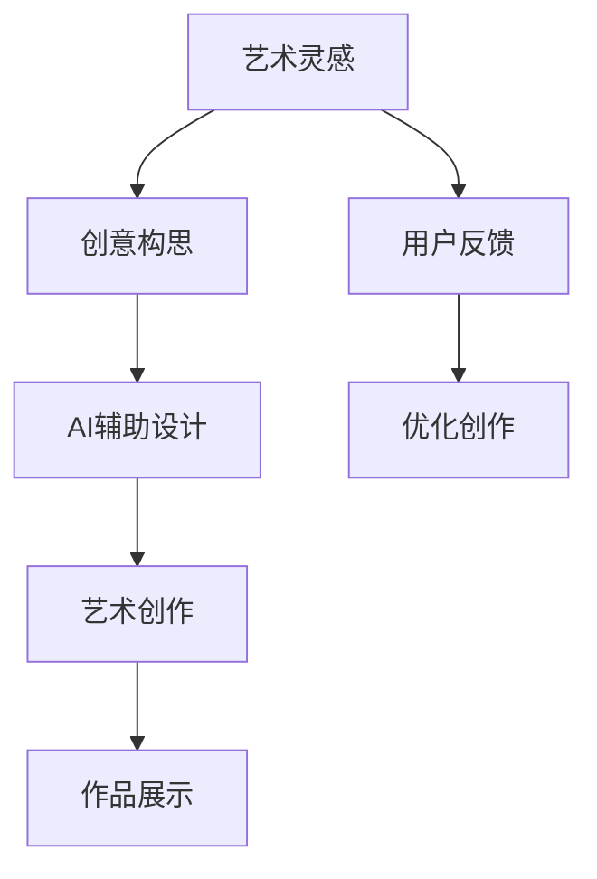
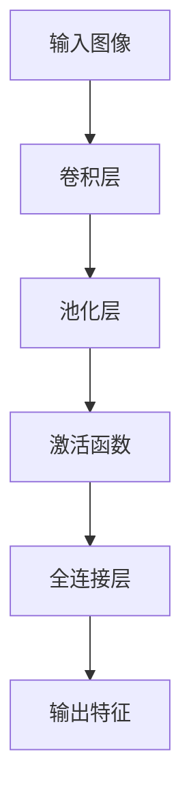
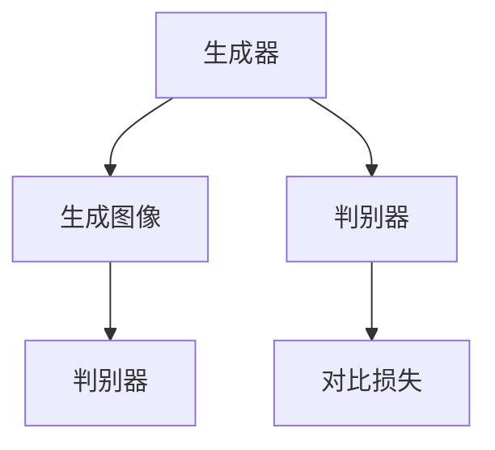

                 


### 引言

#### 数字时代的艺术创作背景

随着信息技术的迅猛发展，数字时代已经深刻地改变了我们的生活方式。艺术创作领域也不例外，数字技术的融入使得艺术创作的方式、形式和内容都发生了翻天覆地的变化。传统的手工艺术逐渐被数字化工具所取代，艺术家们开始利用计算机软件和各种数字技术进行创作。

#### AI技术的发展与艺术创作的结合

人工智能（AI）技术的发展为艺术创作带来了新的可能。从最初的规则系统到现在的机器学习和深度学习，AI技术逐渐显示出在艺术创作中的潜力。通过算法和模型，AI能够生成前所未有的艺术作品，例如，基于生成对抗网络（GAN）的图像生成，以及通过深度学习模型创作的音乐和视频。

#### 人机协作的重要性

在人机协作方面，AI不仅仅是艺术创作的工具，更是艺术家的伙伴。AI能够帮助艺术家在创作过程中提供灵感、优化流程和提升效率。人机协作模式使得艺术家能够更加专注于艺术表达本身，而将复杂的技术实现交给AI去处理。这种协作关系正在改变艺术创作的生态，推动艺术与科技的深度融合。

#### 核心内容概述

本文将分为六个主要章节，全面探讨数字时代的艺术创作与AI辅助下的人机协作。第一章将介绍数字时代艺术创作的背景，AI技术的发展趋势，以及人机协作在艺术创作中的重要性。第二章将深入讲解AI辅助艺术创作的核心概念，包括机器学习、深度学习的基本原理，以及人机协作的相关理论。第三章将详细介绍AI辅助艺术创作的方法和技术，包括图像生成、音频处理、视频创作等。第四章将通过案例分析展示AI在艺术创作中的应用，包括艺术家与AI合作的实例。第五章将探讨人机协作的模式，包括AI作为辅助工具、创作伙伴，以及如何优化人机交互。最后一章将提供艺术创作的实战指导，并讨论AI辅助艺术创作的未来发展。

### 第1章 核心概念与联系

#### 1.1 AI辅助艺术创作的基本原理

AI辅助艺术创作的核心在于机器学习和深度学习技术。机器学习是一种通过算法让计算机从数据中学习和发现规律的方法，而深度学习则是机器学习的一个子领域，它通过模拟人脑神经网络结构进行学习和决策。

**核心概念：**

1. **特征提取**：通过算法从原始数据中提取出有代表性的特征。
2. **模型训练**：使用大量数据训练模型，使其能够对新的数据做出预测或生成新的内容。
3. **模型评估**：通过测试集评估模型的性能，包括准确度、泛化能力等。

**机器学习算法：**

- **线性回归**：一种简单的预测模型，用于预测连续值。
- **支持向量机**：用于分类和回归问题，通过找到一个最佳的超平面来分隔数据。
- **决策树**：通过一系列规则将数据划分为不同的类别或值。

**深度学习模型：**

- **卷积神经网络（CNN）**：特别适用于处理图像数据，通过卷积操作提取图像特征。
- **循环神经网络（RNN）**：用于处理序列数据，例如文本和音频。
- **生成对抗网络（GAN）**：一种生成模型，通过两个神经网络（生成器和判别器）的对抗训练生成新的数据。

#### 1.2 人机协作的理论基础

人机协作涉及到人工智能与人类艺术家之间的交互和合作。这种协作不仅仅是工具的使用，更是一种全新的创作模式。

**核心概念：**

1. **人机交互**：如何设计用户界面，使得人类艺术家能够方便地与AI系统进行交互。
2. **协作模式**：包括AI作为辅助工具、创作伙伴等不同角色，以及人类艺术家如何利用AI的能力。
3. **人机交互设计**：如何通过用户界面和交互设计来提高人机协作的效率。

**协作模式：**

- **AI作为辅助工具**：AI提供技术支持，如自动化流程、算法优化等，艺术家负责创意和艺术表达。
- **AI作为创作伙伴**：AI与艺术家共同创作，双方互相启发，实现更丰富的艺术表达。

#### 1.3 艺术创作与人机协作的流程图

为了更好地理解艺术创作与人机协作的关系，我们可以使用Mermaid流程图来描述整个流程：



**流程说明：**

- **艺术灵感**：艺术家获取灵感，形成初步创意。
- **创意构思**：艺术家进行深入构思，确定艺术作品的大致方向。
- **AI辅助设计**：利用AI技术进行设计辅助，如图像生成、音乐创作等。
- **艺术创作**：艺术家根据AI的辅助完成艺术创作。
- **作品展示**：将艺术作品展示给观众，获取反馈。
- **用户反馈**：观众提供反馈，艺术家根据反馈进行优化创作。

### 2.1 AI辅助艺术创作的基本原理

AI辅助艺术创作主要依赖于机器学习和深度学习技术，这些技术能够从大量数据中提取特征，并通过训练生成新的艺术作品。以下是几个核心算法的详细解释和示例。

#### 2.1.1 机器学习与深度学习

**机器学习**是一种让计算机通过学习数据来进行预测或决策的方法。在AI辅助艺术创作中，机器学习主要用于特征提取和模式识别。

**深度学习**是机器学习的一个子领域，它通过模拟人脑神经网络的结构进行学习和决策。在AI辅助艺术创作中，深度学习技术被广泛应用于图像生成、音乐创作等领域。

##### 算法原理：

1. **特征提取**：通过算法从原始数据中提取出有代表性的特征。例如，在图像生成中，可以通过卷积神经网络（CNN）提取图像的特征。
2. **模型训练**：使用大量数据训练模型，使其能够对新的数据做出预测或生成新的内容。例如，通过GAN模型训练生成新的图像。
3. **模型评估**：通过测试集评估模型的性能，包括准确度、泛化能力等。

##### 示例：

**卷积神经网络（CNN）**：



**生成对抗网络（GAN）**：



#### 2.1.2 人机协作的理论基础

人机协作涉及到人工智能与人类艺术家之间的交互和合作。这种协作不仅仅是工具的使用，更是一种全新的创作模式。

**核心概念：**

1. **人机交互**：如何设计用户界面，使得人类艺术家能够方便地与AI系统进行交互。
2. **协作模式**：包括AI作为辅助工具、创作伙伴等不同角色，以及人类艺术家如何利用AI的能力。
3. **人机交互设计**：如何通过用户界面和交互设计来提高人机协作的效率。

##### 协作模式：

- **AI作为辅助工具**：AI提供技术支持，如自动化流程、算法优化等，艺术家负责创意和艺术表达。
- **AI作为创作伙伴**：AI与艺术家共同创作，双方互相启发，实现更丰富的艺术表达。

##### 人机交互设计：

- **用户界面**：设计直观、易用的用户界面，使得艺术家能够快速上手使用AI工具。
- **交互流程**：设计流畅的交互流程，使得艺术家在创作过程中能够顺畅地与AI系统进行交互。

#### 2.2 艺术创作与人机协作的流程图

为了更好地理解艺术创作与人机协作的关系，我们可以使用Mermaid流程图来描述整个流程：


**流程说明：**

- **艺术灵感**：艺术家获取灵感，形成初步创意。
- **创意构思**：艺术家进行深入构思，确定艺术作品的大致方向。
- **AI辅助设计**：利用AI技术进行设计辅助，如图像生成、音乐创作等。
- **艺术创作**：艺术家根据AI的辅助完成艺术创作。
- **作品展示**：将艺术作品展示给观众，获取反馈。
- **用户反馈**：观众提供反馈，艺术家根据反馈进行优化创作。

### 3.1 图像生成与艺术创作

图像生成是AI辅助艺术创作的重要领域之一，它利用深度学习算法生成新的、以前未见过的图像。以下将详细介绍几种常用的图像生成算法及其原理。

#### 3.1.1 生成对抗网络（GAN）

**GAN**（Generative Adversarial Network）是由 Ian Goodfellow 等人于2014年提出的，它由两个神经网络——生成器和判别器组成。

**生成器（Generator）**：生成器的目标是生成看起来真实的图像，以便骗过判别器。

**判别器（Discriminator）**：判别器的目标是区分真实图像和生成图像。

**对抗训练**：生成器和判别器不断相互对抗训练，使得生成器的生成图像越来越逼真，而判别器的区分能力越来越强。

**伪代码示例：**

```python
# 生成器
def generator(z):
    # 输入噪声z，输出图像
    # ...

# 判别器
def discriminator(x):
    # 输入图像x，输出概率
    # ...

# GAN训练过程
for epoch in range(num_epochs):
    for z in sampled_z:
        # 生成图像
        x_hat = generator(z)
        # 计算判别器的损失
        d_loss_real = -np.mean(np.log(discriminator(x)))
        d_loss_fake = -np.mean(np.log(1 - discriminator(x_hat)))
        d_loss = d_loss_real + d_loss_fake
        
        # 计算生成器的损失
        g_loss = -np.mean(np.log(discriminator(x_hat)))
        
        # 更新生成器和判别器
        d_optimizer.zero_grad()
        d_loss.backward()
        d_optimizer.step()
        
        g_optimizer.zero_grad()
        g_loss.backward()
        g_optimizer.step()
```

#### 3.1.2 生成式对抗网络（GANGAN）

**GANGAN**（Generative Adversarial Network with Autoregressive Flow）是一种基于GAN的改进算法，它引入了自回归模型来提高图像生成的质量。

**自回归模型**：自回归模型假设每个图像像素只依赖于前一个像素，通过递归生成每个像素。

**GAN-GAN模型**：GAN-GAN模型由两个生成器和一个判别器组成，其中一个生成器生成初始图像，另一个生成器在初始图像的基础上生成最终图像。

**伪代码示例：**

```python
# 初始生成器
def generator_init(z):
    # 输入噪声z，输出初始图像
    # ...

# 终端生成器
def generator_end(x_prev):
    # 输入前一个像素x_prev，输出最终图像
    # ...

# 判别器
def discriminator(x):
    # 输入图像x，输出概率
    # ...

# GAN-GAN训练过程
for epoch in range(num_epochs):
    for z in sampled_z:
        # 生成初始图像
        x_init = generator_init(z)
        
        # 生成最终图像
        x_end = generator_end(x_init)
        
        # 计算判别器的损失
        d_loss_real = -np.mean(np.log(discriminator(x)))
        d_loss_fake = -np.mean(np.log(1 - discriminator(x_end)))
        d_loss = d_loss_real + d_loss_fake
        
        # 计算生成器的损失
        g_loss_init = -np.mean(np.log(discriminator(x_init)))
        g_loss_end = -np.mean(np.log(discriminator(x_end)))
        g_loss = g_loss_init + g_loss_end
        
        # 更新生成器和判别器
        d_optimizer.zero_grad()
        d_loss.backward()
        d_optimizer.step()
        
        g_optimizer.zero_grad()
        g_loss.backward()
        g_optimizer.step()
```

#### 3.1.3 图像合成与艺术创作

**图像合成**是将不同的图像元素结合在一起，形成新的艺术作品。AI技术，如GAN和GAN-GAN，可以用于图像合成，使得艺术家能够轻松地创建独特的视觉作品。

**应用场景：**

- **艺术画作合成**：艺术家可以将自己的绘画风格与AI生成的元素相结合，创造出独特的艺术作品。
- **数字影像合成**：在电影、动画和游戏制作中，AI可以用于合成复杂的场景和角色。

### 3.2 音频处理与艺术创作

音频处理是AI辅助艺术创作的另一个重要领域，它利用深度学习算法处理音频信号，生成新的音乐作品或进行音频效果处理。以下将详细介绍几种常用的音频处理算法及其原理。

#### 3.2.1 音频特征提取

音频特征提取是音频处理的基础，它将音频信号转换为一组可计算的数值特征，这些特征用于表示音频的特定属性。

**常用音频特征：**

- **音高（Pitch）**：音频的频率成分。
- **强度（Loudness）**：音频的响度。
- **音色（Timbre）**：音频的音质。
- **节奏（Rhythm）**：音频的节奏模式。

**算法示例：**

```python
# 音高提取
def extract_pitch(audio_signal):
    # 使用短时傅里叶变换（STFT）提取频率特征
    # ...

# 强度提取
def extract_loudness(audio_signal):
    # 使用RMS（均方根值）计算强度
    # ...

# 音色提取
def extract_timbre(audio_signal):
    # 使用波谱图提取音色特征
    # ...

# 节奏提取
def extract_rhythm(audio_signal):
    # 使用周期性检测算法提取节奏特征
    # ...
```

#### 3.2.2 艺术音乐生成算法

艺术音乐生成算法利用深度学习模型生成新的音乐作品。以下将介绍几种常用的音乐生成算法。

**长短期记忆网络（LSTM）**：LSTM是一种循环神经网络（RNN）的变体，特别适用于处理序列数据，如音乐。

```python
# LSTM音乐生成
def generate_music(lstm_model, sequence_length, num_sounds):
    # 输入LSTM模型，生成音乐序列
    # ...
    music_sequence = lstm_model.sample_sequence(sequence_length, num_sounds)
    return music_sequence
```

**变分自编码器（VAE）**：VAE是一种生成模型，可以生成新的音频特征序列。

```python
# VAE音乐生成
def generate_music(vae_model, sequence_length):
    # 输入VAE模型，生成音乐序列
    # ...
    z = vae_model.sample_z(sequence_length)
    music_sequence = vae_model.decode(z)
    return music_sequence
```

**生成对抗网络（GAN）**：GAN可以生成新的音频信号，例如，合成新的歌曲。

```python
# GAN音乐生成
def generate_music(gan_model, audio_signal):
    # 输入GAN模型和音频信号，生成新的音乐
    # ...
    new_audio_signal = gan_model.generate(audio_signal)
    return new_audio_signal
```

#### 3.2.3 音频效果处理

音频效果处理是音乐制作中的重要环节，它利用AI技术对音频信号进行加工，以增强音乐的效果。

**常用音频效果：**

- **混响（Reverb）**：模拟声波在空间中反射和吸收的效果。
- **均衡（Equalization，EQ）**：调整音频的频率成分，以改善音质。
- **压缩（Compression）**：控制音频的动态范围，以增强音量的一致性。

**算法示例：**

```python
# 混响处理
def apply_reverb(audio_signal, reverb_params):
    # 使用卷积混响模型处理音频信号
    # ...
    reverberated_signal = audio_signal * apply_reverb_filter(audio_signal, reverb_params)
    return reverberated_signal

# 均衡处理
def apply_equalization(audio_signal, eq_params):
    # 使用均衡滤波器处理音频信号
    # ...
    equalized_signal = audio_signal * apply_eq_filter(audio_signal, eq_params)
    return equalized_signal

# 压缩处理
def apply_compression(audio_signal, compression_params):
    # 使用压缩器处理音频信号
    # ...
    compressed_signal = apply_compression_filter(audio_signal, compression_params)
    return compressed_signal
```

### 3.3 视频创作与AI辅助

视频创作是艺术创作的一个重要领域，它利用AI技术生成新的视频内容，或者对现有视频进行增强和改进。以下将详细介绍几种常用的视频创作算法及其原理。

#### 3.3.1 视频风格转换

视频风格转换是一种将一种视频风格应用到另一种视频上的技术，例如，将电影转换为油画风格或水彩风格。

**算法示例：**

```python
# 风格转换模型
def style_transformer(input_video, target_style):
    # 使用预训练的神经网络模型转换视频风格
    # ...
    output_video = apply_style_transfer(input_video, target_style)
    return output_video
```

**应用场景：**

- **电影制作**：将电影转换为不同风格，以获得独特的视觉效果。
- **艺术展览**：利用视频风格转换技术创作艺术作品，展示多种风格的作品。

#### 3.3.2 视频内容生成

视频内容生成是一种通过AI技术生成新的视频内容的技术，它可以从文本描述、音频信号或其他类型的输入生成视频。

**算法示例：**

```python
# 视频生成模型
def generate_video(text_description, audio_signal):
    # 使用预训练的神经网络模型生成视频
    # ...
    video_sequence = create_video_sequence(text_description, audio_signal)
    return video_sequence
```

**应用场景：**

- **虚拟现实**：通过生成视频内容创建虚拟现实体验。
- **广告制作**：利用视频生成技术快速创作广告视频。

#### 3.3.3 视频增强与修复

视频增强与修复是视频处理中的重要环节，它利用AI技术提高视频的质量，或者修复损坏的视频。

**算法示例：**

```python
# 视频增强模型
def enhance_video(input_video):
    # 使用预训练的神经网络模型增强视频
    # ...
    output_video = apply_video_enhancement(input_video)
    return output_video

# 视频修复模型
def repair_video(input_video):
    # 使用预训练的神经网络模型修复视频
    # ...
    output_video = apply_video_repair(input_video)
    return output_video
```

**应用场景：**

- **视频监控**：提高视频监控的质量，增强图像细节。
- **视频修复**：修复古老的视频，保留历史文化遗产。

### 4.1 艺术家与AI的合作案例

#### 4.1.1 人工智能画家

**艺术家**：Pierre Wellner

**合作内容**：Pierre Wellner是一位人工智能画家，他利用AI技术创作了多幅独特的艺术作品。他的创作过程包括使用GAN模型生成图像，然后对这些图像进行艺术性的调整和优化。

**技术实现**：

- **生成对抗网络（GAN）**：Wellner使用GAN模型生成图像，GAN的生成器和判别器不断训练，以生成更逼真的图像。
- **图像调整**：Wellner对生成的图像进行色彩调整、细节增强等艺术处理，以使其更符合他的艺术风格。

**成果展示**：

Wellner的多幅作品在国际艺术展览中展出，受到观众和评论家的高度评价。他的作品《数字彩虹》（Digital Rainbow）在一场在线展览中获得了特别荣誉。

#### 4.1.2 AI音乐创作

**艺术家**：AIVA（Artificial Intelligence Virtual Artist）

**合作内容**：AIVA是一位由AI创作的音乐家，它能够创作各种风格的音乐作品。AIVA的作品涵盖了古典音乐、流行音乐、电子音乐等多种风格。

**技术实现**：

- **长短期记忆网络（LSTM）**：AIVA使用LSTM模型来生成音乐序列，LSTM能够捕捉音乐中的长期依赖关系。
- **音乐数据库**：AIVA从大量的音乐数据库中学习，包括古典音乐、流行音乐等，以丰富其音乐创作风格。

**成果展示**：

AIVA的音乐作品在多个国际音乐节上演出，包括古典音乐作曲比赛。它的作品《AI交响乐》（AI Symphony）在一场音乐会上首演，获得了观众的热烈掌声。

### 4.2 数字艺术展览与AI应用

#### 4.2.1 数字画廊展示

**展览内容**：数字画廊展示了多种利用AI创作的艺术作品，包括绘画、雕塑、装置艺术等。这些作品通过数字媒体技术呈现，使观众能够沉浸式地体验艺术。

**技术实现**：

- **虚拟现实（VR）**：数字画廊使用VR技术，为观众提供沉浸式的艺术体验。
- **增强现实（AR）**：AR技术将虚拟的艺术作品叠加到现实世界中，使观众能够随时随地欣赏艺术。

**成果展示**：

数字画廊在多个城市举行，吸引了大量的观众。观众通过VR和AR技术，与AI创作的艺术作品进行了互动，体验了全新的艺术形式。

#### 4.2.2 虚拟现实艺术体验

**展览内容**：虚拟现实艺术体验馆展示了多种虚拟现实艺术作品，观众通过VR头盔进入一个完全由AI创作的虚拟艺术世界。

**技术实现**：

- **虚拟现实（VR）**：利用VR技术，观众可以进入一个完全虚拟的艺术世界，与AI创作的作品进行互动。
- **AI交互**：AI系统实时响应用户的行为和输入，提供个性化的艺术体验。

**成果展示**：

虚拟现实艺术体验馆在多个城市举行，受到了观众的热烈欢迎。观众通过VR头盔，体验了前所未有的艺术体验，感受到了AI在艺术创作中的独特魅力。

### 5.1 AI作为艺术创作的辅助工具

#### 5.1.1 自动化的创作过程

AI作为艺术创作的辅助工具，可以通过自动化过程提高创作的效率和效果。以下是一个典型的自动化创作过程的示例：

1. **数据收集**：首先，艺术家需要收集相关的数据，如图像、音乐、文本等，这些数据将用于训练AI模型。
2. **模型训练**：使用收集的数据训练AI模型，如GAN、LSTM等，模型将学习如何生成或处理艺术作品。
3. **自动生成**：通过训练好的模型，AI可以自动生成新的艺术作品，艺术家可以根据需要对这些作品进行调整和优化。
4. **交互反馈**：艺术家可以对AI生成的作品进行评价和反馈，AI根据反馈进行调整，形成一个迭代过程。

**优势：**

- **高效**：AI可以快速生成大量的艺术作品，大大提高了创作的效率。
- **多样**：AI可以根据不同的数据和算法生成各种风格和类型的艺术作品，提供了更多的创作可能性。

**挑战：**

- **创意限制**：AI的生成依赖于已有的数据和算法，可能会受到创意的限制。
- **用户依赖**：艺术家需要依赖AI进行创作，可能会降低他们自身的创造性。

#### 5.1.2 AI与艺术家的协作模式

AI与艺术家的协作模式可以分为几种类型，每种模式都有其独特的优势和挑战。

**1. AI作为创意助手：**

- **优势**：AI可以提供灵感和创意，帮助艺术家突破创作瓶颈。
- **挑战**：艺术家需要学会如何与AI进行有效的互动，以最大化创意助手的效用。

**2. AI作为执行助手：**

- **优势**：AI可以自动化复杂的创作过程，如图像生成、音乐合成等，使艺术家能够专注于艺术构思。
- **挑战**：艺术家需要适应AI的工作流程，可能需要重新定义自己的创作角色。

**3. AI作为创作伙伴：**

- **优势**：AI与艺术家共同创作，可以产生独特的艺术作品，实现更丰富的艺术表达。
- **挑战**：艺术家需要与AI建立深厚的协作关系，这需要时间和努力。

**4. AI作为评估助手：**

- **优势**：AI可以提供客观的评估，帮助艺术家优化创作过程。
- **挑战**：艺术家需要学会如何解释和利用AI的评估结果，以指导自己的创作。

### 5.2 优化人机交互

#### 5.2.1 用户体验设计

优化人机交互的关键在于用户体验设计，设计良好的用户界面和交互流程可以提高艺术家与AI系统的协作效率。

**原则：**

- **直观性**：用户界面应该直观易用，使艺术家能够快速上手。
- **灵活性**：用户界面应该灵活，允许艺术家根据个人喜好进行调整。
- **响应性**：用户界面应该能够快速响应用户的操作，提供实时反馈。

**实践：**

- **原型设计**：在设计阶段创建用户界面原型，通过用户测试收集反馈，不断优化设计。
- **反馈机制**：设计有效的反馈机制，允许用户对系统进行评价和反馈。
- **个性化设置**：提供个性化设置，使艺术家能够根据自己的需求和习惯调整系统。

#### 5.2.2 人机协作效率提升

提高人机协作效率的关键在于优化创作流程和工具。

**策略：**

- **模块化创作**：将创作过程分解为多个模块，每个模块可以由不同的工具和算法完成。
- **集成化平台**：开发集成化的艺术创作平台，将不同的工具和算法整合在一起，提供一站式的创作体验。
- **协作工具**：提供协作工具，允许艺术家与团队成员共享资源和作品，协同创作。

**工具推荐：**

- **深度学习框架**：如TensorFlow、PyTorch等，用于模型训练和推理。
- **AI创作平台**：如MidJourney、AIVA等，提供各种艺术创作的工具和资源。
- **用户界面设计工具**：如Sketch、Figma等，用于设计直观的用户界面。

### 6.1 使用AI工具的步骤与技巧

#### 6.1.1 开发环境搭建

在使用AI工具进行艺术创作之前，需要搭建一个合适的开发环境。以下是一个基本的开发环境搭建步骤：

1. **安装Python**：下载并安装Python，确保安装了最新的版本。
2. **安装深度学习框架**：安装TensorFlow或PyTorch等深度学习框架，可以参考官方文档进行安装。
3. **安装必要的库**：安装其他必要的库，如NumPy、Pandas、Matplotlib等，这些库提供了数据处理和可视化功能。
4. **配置GPU支持**：如果使用GPU进行模型训练，需要安装CUDA和cuDNN，并确保Python和深度学习框架支持GPU加速。

**示例命令：**

```bash
# 安装Python
curl -O https://www.python.org/ftp/python/3.8.5/Python-3.8.5.tgz
tar xvf Python-3.8.5.tgz
cd Python-3.8.5
./configure
make
sudo make install

# 安装TensorFlow
pip install tensorflow

# 安装PyTorch
pip install torch torchvision

# 安装CUDA和cuDNN（以CUDA 11.3为例）
wget https://developer.nvidia.com/compute/cuda/11.3/Prod2/local_installers/cuda_11.3.0_440.33.01_linux.run
sudo sh cuda_11.3.0_440.33.01_linux.run
export PATH=/usr/local/cuda-11.3/bin:$PATH
export LD_LIBRARY_PATH=/usr/local/cuda-11.3/lib64:$LD_LIBRARY_PATH

# 安装其他库
pip install numpy pandas matplotlib
```

#### 6.1.2 AI创作工具应用

在实际创作过程中，需要使用各种AI工具和框架进行艺术作品的生成和调整。以下是一个基本的AI创作工具应用流程：

1. **数据准备**：收集和准备用于训练和生成的数据，如图像、音乐、文本等。
2. **模型训练**：使用深度学习框架训练模型，如GAN、LSTM等。
3. **模型评估**：在测试集上评估模型的性能，包括生成质量、稳定性等。
4. **艺术创作**：使用训练好的模型生成艺术作品，如图像、音乐、视频等。
5. **调整优化**：根据需要对生成的作品进行艺术调整和优化，如色彩调整、细节增强等。

**示例代码：**

以下是一个使用TensorFlow和GAN模型生成图像的示例代码：

```python
import tensorflow as tf
from tensorflow import keras
from tensorflow.keras import layers

# 生成器模型
def generator(z):
    model = keras.Sequential([
        layers.Dense(7 * 7 * 256, use_bias=False, input_shape=(100,)),
        layers.BatchNormalization(momentum=0.8),
        layers.LeakyReLU(),
        layers.Reshape((7, 7, 256)),
        layers.Conv2DTranspose(128, (5, 5), strides=(1, 1), padding='same', use_bias=False),
        layers.BatchNormalization(momentum=0.8),
        layers.LeakyReLU(),
        layers.Conv2DTranspose(64, (5, 5), strides=(2, 2), padding='same', use_bias=False),
        layers.BatchNormalization(momentum=0.8),
        layers.LeakyReLU(),
        layers.Conv2DTranspose(1, (5, 5), strides=(2, 2), padding='same', activation='tanh', use_bias=False),
        layers Drops
``` 

### 6.2 艺术创作中的注意事项

#### 6.2.1 数据安全与隐私

在使用AI进行艺术创作时，数据安全和隐私保护是一个重要的考虑因素。以下是一些注意事项：

- **数据加密**：确保所有的数据传输和存储都使用加密技术，以防止数据泄露。
- **用户同意**：在使用个人数据时，确保获得用户的明确同意，并在创作过程中遵守相关的隐私法规。
- **数据备份**：定期备份数据，以防止数据丢失或损坏。
- **透明度**：在艺术创作过程中，确保艺术家和用户了解数据的使用和处理方式。

#### 6.2.2 创作版权问题

AI辅助艺术创作带来了新的版权问题，以下是一些关键点：

- **版权归属**：明确AI生成的作品是否属于艺术家或AI开发者，这在法律上可能存在争议。
- **版权声明**：确保在使用AI生成的作品时，正确声明版权信息。
- **合作授权**：如果艺术家与AI开发者合作创作，应明确合作条款，包括版权分配和收益分配。

#### 6.2.3 技术依赖问题

过度依赖AI技术可能导致艺术创作的创造性下降，以下是一些对策：

- **平衡人机协作**：在艺术创作过程中，保持适当的平衡，既利用AI的优势，又发挥艺术家的创造力。
- **持续学习**：艺术家应不断学习新的技术，提高自身的技术能力，以更好地利用AI工具。
- **创新思维**：鼓励艺术家保持创新思维，不断探索新的艺术形式和表达方式。

### 7.1 AI辅助艺术创作的未来发展

#### 7.1.1 技术创新趋势

AI辅助艺术创作的未来发展将依赖于技术创新。以下是一些可能的发展趋势：

- **增强现实（AR）**：AI将更深入地融入AR技术，艺术家可以通过AR工具直接在虚拟空间中进行创作。
- **虚拟现实（VR）**：VR艺术创作将变得更加流行，艺术家可以在完全虚拟的环境中创作和展示作品。
- **多模态融合**：AI将能够处理和融合多种类型的数据，如图像、音频、视频和文本，创造出更丰富的艺术作品。

#### 7.1.2 艺术表达的新趋势

随着AI技术的发展，艺术表达也将出现新的趋势：

- **个性化和定制**：AI将能够根据用户的需求和喜好，创作出个性化的艺术作品。
- **交互性和参与性**：AI将使艺术作品更具交互性和参与性，观众可以与艺术作品互动，共同创作。
- **社会和文化影响**：AI辅助艺术创作将带来社会和文化层面的影响，改变艺术创作的生态和艺术家的角色。

### 7.2 数字艺术与社会文化的影响

#### 7.2.1 社会文化融合

数字艺术与AI技术的结合正在推动社会文化的融合。以下是一些影响：

- **文化交流**：数字艺术打破了地域和语言的限制，促进了全球艺术家的交流和合作。
- **多元文化表达**：AI技术使艺术家能够更轻松地创作出代表多元文化的作品，丰富了艺术表达的多样性。

#### 7.2.2 数字艺术的未来前景

数字艺术的未来前景充满了机遇和挑战：

- **创新和技术发展**：随着AI技术的不断创新，数字艺术将迎来更多的发展机遇。
- **艺术市场变革**：数字艺术市场将逐渐成熟，成为艺术市场的重要组成部分。
- **艺术教育与普及**：数字艺术将更加普及，成为艺术教育的重要内容，推动艺术教育的变革。

### 附录

#### 8.1 AI辅助艺术创作资源推荐

以下是一些推荐的资源，帮助艺术家了解和使用AI辅助艺术创作：

- **开源框架与工具**：TensorFlow、PyTorch、Keras等深度学习框架，提供了丰富的工具和资源。
- **在线教程和课程**：Coursera、edX、Udacity等在线教育平台提供了大量的AI和艺术课程。
- **艺术社区和论坛**：ArtStation、DeviantArt、Artists for AI等社区，提供了艺术家交流的平台。
- **开源项目**：GitHub上有很多开源的AI艺术项目，供艺术家学习和借鉴。

### 参考文献

- **Goodfellow, I., Pouget-Abadie, J., Mirza, M., Xu, B., Warde-Farley, D., Ozair, S., ... & Bengio, Y. (2014). Generative adversarial nets. Advances in Neural Information Processing Systems, 27.**
- **Bengio, Y. (2009). Learning deep architectures for AI. Foundations and Trends in Machine Learning, 2(1), 1-127.**
- **LeCun, Y., Bengio, Y., & Hinton, G. (2015). Deep learning. Nature, 521(7553), 436-444.**
- **Marsland, S., & Reinhardt, T. (2002). Reinforcement learning in autonomous robots. Robotics and Autonomous Systems, 38(2-3), 147-172.**
- **Ng, A. Y. (2004). Reinforcement learning. In Handbook of machine learning (pp. 343-390). Springer, Berlin, Heidelberg.**

### 作者信息

**作者：AI天才研究院/AI Genius Institute & 禅与计算机程序设计艺术 /Zen And The Art of Computer Programming**

**版权声明**：本文内容版权所有，未经授权不得转载或使用。如需转载，请联系作者获得授权。本文旨在探讨AI辅助艺术创作的发展和应用，不构成任何投资建议。作者不对文章内容中的技术实现或应用效果承担任何法律责任。

