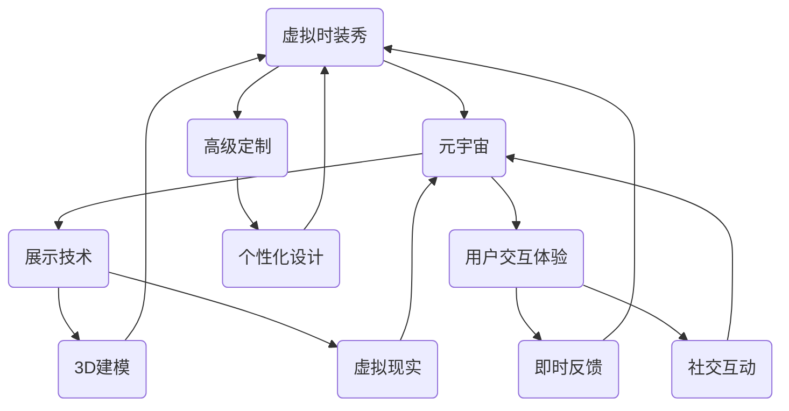

                 

# 文章标题：数字时代的虚拟时装秀：元宇宙中的高级定制展示

> 关键词：虚拟时装秀、元宇宙、高级定制、展示技术、用户交互体验、3D建模、虚拟现实、机器学习、用户满意度、项目实战

> 摘要：随着数字技术的不断进步，虚拟时装秀在元宇宙中成为一种新兴的展示形式。本文将探讨元宇宙中的高级定制展示技术，包括核心概念、算法原理、数学模型和项目实战，并分析其影响和未来发展趋势。

## 引言

### 背景介绍

随着数字技术的发展，虚拟现实（VR）和增强现实（AR）逐渐走进了人们的日常生活。元宇宙（Metaverse）作为一个虚拟的、三维的、交互式的虚拟世界，正在成为下一代互联网的重要形态。在这个背景下，虚拟时装秀作为一种新型的展示形式，开始崭露头角。元宇宙中的高级定制展示，不仅为时尚产业带来了新的机遇，也为用户提供了更加沉浸式的购物体验。

### 目的和结构

本文旨在探讨元宇宙中的高级定制展示技术，包括核心概念、算法原理、数学模型和项目实战。文章将首先介绍虚拟时装秀和元宇宙的相关概念，然后详细阐述高级定制展示的技术原理，最后通过实际项目案例进行分析和总结。文章结构如下：

1. 核心概念与联系
2. 核心算法原理讲解
3. 数学模型和公式讲解
4. 项目实战
5. 总结与展望

## 核心概念与联系

### 虚拟时装秀

虚拟时装秀是一种在数字虚拟环境中举办的时尚展示活动。通过虚拟现实（VR）和增强现实（AR）技术，设计师可以将服装和配饰以三维形式呈现，让观众在虚拟世界中体验到实时的时尚秀。

### 元宇宙

元宇宙是一个由数字技术和虚拟现实技术构建的虚拟世界，它提供了与现实世界相似或超越现实世界的体验。在元宇宙中，用户可以创建自己的虚拟形象，进行社交互动、购物、娱乐等活动。

### 高级定制

高级定制是一种根据个人需求和喜好，为特定用户提供量身定制的服装和配饰服务。在元宇宙中，高级定制展示通过个性化设计算法和用户交互技术，实现个性化服装和配饰的虚拟展示。

### 展示技术

展示技术包括3D建模、虚拟现实、增强现实等，这些技术为虚拟时装秀提供了丰富的视觉和交互体验。通过这些技术，设计师可以创造出逼真的虚拟场景，用户可以在其中自由探索和互动。

### 用户交互体验

用户交互体验是高级定制展示的核心，它决定了用户在虚拟世界中的满意度和参与度。通过即时反馈和社交互动，用户可以与虚拟模特和其他用户进行互动，增强购物体验。

### Mermaid 流程图

以下是一个Mermaid流程图，展示了核心概念之间的关系：



## 核心算法原理讲解

在元宇宙中的高级定制展示中，核心算法原理起着至关重要的作用。以下将详细讲解个性化设计算法和用户交互算法。

### 个性化设计算法

个性化设计算法是高级定制展示的核心，它通过分析用户的偏好和历史数据，生成符合用户个性化需求的服装设计。

```python
# 伪代码：个性化设计算法
function personalized_design(user_profile, fashion_trends):
    # 根据用户偏好和历史数据生成个性化设计
    user_preferences = extract_preferences(user_profile)
    style_guides = match_preferences_to_guides(user_preferences, fashion_trends)
    design = generate_design(style_guides)
    return design

# 辅助函数
function extract_preferences(user_profile):
    # 从用户资料中提取偏好
    return user_profile['preferences']

function match_preferences_to_guides(preferences, fashion_trends):
    # 匹配偏好与时尚趋势
    matched_guides = []
    for guide in fashion_trends:
        if guide_matches_preference(guide, preferences):
            matched_guides.append(guide)
    return matched_guides

function generate_design(style_guides):
    # 根据风格指南生成设计
    design = {}
    for guide in style_guides:
        design.update(guide['design_elements'])
    return design
```

### 用户交互算法

用户交互算法负责处理用户在虚拟时装秀中的行为，包括即时反馈和社交互动。

```python
# 伪代码：用户交互算法
function user_interaction(user_action, virtual_model):
    if user_action == 'select':
        select_item(virtual_model)
    elif user_action == 'feedback':
        provide_feedback(virtual_model)
    elif user_action == 'social':
        engage_with_other_users(virtual_model)
    else:
        raise Exception("Invalid user action")

function select_item(virtual_model):
    # 用户选择虚拟模型中的物品
    selected_item = virtual_model['selected_item']
    display_item(selected_item)

function provide_feedback(virtual_model):
    # 用户提供反馈
    feedback = collect_feedback(virtual_model)
    update_design_based_on_feedback(feedback)

function engage_with_other_users(virtual_model):
    # 用户与其他用户互动
    social_activity = collect_social_activity(virtual_model)
    display_social_activity(social_activity)
```

## 数学模型和公式讲解

在元宇宙中的高级定制展示中，数学模型和公式用于量化用户满意度、个性化设计和交互体验。

### 用户满意度公式

用户满意度是衡量高级定制展示效果的重要指标，以下是一个简单的用户满意度公式：

$$
\text{User Satisfaction} = f(\text{Personalization}, \text{Design Quality})
$$

其中，Personalization 表示个性化程度，Design Quality 表示设计质量。用户满意度取决于这两个因素的综合影响。

### 个性化设计质量公式

个性化设计质量公式用于评估个性化设计的质量：

$$
\text{Design Quality} = \frac{\text{Matching Degree}}{\text{Total Design Elements}}
$$

其中，Matching Degree 表示设计元素与用户偏好的匹配程度，Total Design Elements 表示设计元素的总数。设计质量越高，用户满意度越高。

### 交互体验质量公式

交互体验质量公式用于评估用户在虚拟时装秀中的交互体验：

$$
\text{Interaction Quality} = \frac{\text{Feedback Response Time}}{\text{Total Interaction Time}}
$$

其中，Feedback Response Time 表示反馈响应时间，Total Interaction Time 表示总交互时间。交互体验质量越高，用户满意度越高。

## 项目实战

为了更好地展示元宇宙中的高级定制展示技术，我们将通过一个实际项目案例进行详细介绍。

### 项目名称：元宇宙虚拟时装秀平台

### 项目目标：

1. 开发一个元宇宙虚拟时装秀平台。
2. 提供个性化设计和服务。
3. 提供虚拟现实展示和用户交互体验。

### 技术栈：

1. Unity：虚拟现实引擎。
2. TensorFlow：机器学习库。
3. JavaScript：前端交互。

### 项目实战步骤：

1. **开发环境搭建**：

   - 安装Unity编辑器。
   - 安装TensorFlow库。
   - 配置前端开发环境。

2. **数据集准备与处理**：

   - 收集用户偏好数据。
   - 收集时尚趋势数据。
   - 数据清洗和预处理。

3. **个性化设计算法实现**：

   - 使用TensorFlow实现个性化设计算法。
   - 根据用户偏好和时尚趋势生成个性化设计。

4. **虚拟现实展示**：

   - 使用Unity创建虚拟时装秀场景。
   - 实现虚拟模特的动画和交互。

5. **用户交互设计**：

   - 设计用户界面。
   - 实现用户与虚拟模特的互动。

6. **性能优化与测试**：

   - 优化加载时间。
   - 优化用户交互体验。

7. **案例分析与总结**：

   - 分析用户反馈。
   - 总结项目经验。

### 源代码详细实现和代码解读：

以下是一个简化的Unity C#代码示例，用于实现虚拟模特的动画和交互。

```csharp
using UnityEngine;

public class VirtualModel : MonoBehaviour
{
    public Animator animator;
    public GameObject selectedItem;

    private void Start()
    {
        animator = GetComponent<Animator>();
    }

    public void SelectItem(GameObject item)
    {
        selectedItem = item;
        animator.SetTrigger("SelectItem");
    }

    public void ProvideFeedback(string feedback)
    {
        animator.SetTrigger("ProvideFeedback");
        Debug.Log($"Feedback: {feedback}");
    }

    public void EngageWithOtherUsers(GameObject otherUser)
    {
        animator.SetTrigger("EngageWithOtherUsers");
        Debug.Log($"Engaging with {otherUser.name}");
    }
}
```

### 代码应用解读与分析：

- **SelectItem**：当用户选择虚拟模特中的物品时，调用此方法，设置动画触发器。
- **ProvideFeedback**：当用户提供反馈时，调用此方法，设置动画触发器并输出反馈信息。
- **EngageWithOtherUsers**：当用户与其他用户互动时，调用此方法，设置动画触发器并输出互动信息。

### 实际案例分析和详细讲解剖析：

通过实际项目案例，我们可以看到如何将个性化设计算法、虚拟现实技术和用户交互设计结合起来，实现元宇宙中的高级定制展示。以下是一个实际案例：

- **用户案例**：用户A在元宇宙中浏览时装秀，选择了一件连衣裙。
- **个性化设计**：系统根据用户A的偏好和历史数据，生成了这款连衣裙的个性化设计。
- **虚拟现实展示**：用户A在虚拟现实中看到了自己的连衣裙，并与虚拟模特进行互动。
- **用户交互**：用户A提供了反馈，如“颜色太深”，系统根据反馈调整了连衣裙的颜色。
- **社交互动**：用户A与其他用户在时装秀中互动，分享了自己的体验。

### 项目小结：

通过本项目实战，我们展示了如何利用先进的技术实现元宇宙中的高级定制展示。项目成功的关键在于个性化设计算法的有效实现、虚拟现实技术的应用和用户交互设计的优化。未来，随着技术的不断进步，元宇宙中的高级定制展示将更加智能化和个性化，为用户提供更丰富的购物体验。

## 总结与展望

随着元宇宙和虚拟现实技术的不断发展，虚拟时装秀作为一种新兴的展示形式，正在改变传统时尚产业的运作模式。本文从核心概念、算法原理、数学模型和项目实战等方面，详细探讨了元宇宙中的高级定制展示技术。未来，随着技术的进一步进步，虚拟时装秀将更加智能化和个性化，为用户带来更加沉浸式的购物体验。

## 最佳实践 tips、小结、注意事项、拓展阅读

### 最佳实践 tips：

1. 在设计个性化设计算法时，要充分考虑用户偏好和时尚趋势的匹配程度。
2. 在实现用户交互时，要注重即时反馈和社交互动，以提高用户满意度。
3. 在项目开发过程中，要不断进行性能优化和测试，确保系统的高效运行。

### 小结：

本文通过探讨元宇宙中的高级定制展示技术，展示了虚拟时装秀在数字时代的重要地位。通过核心算法原理讲解、数学模型和项目实战，我们深入了解了高级定制展示的实现方法和技术要点。

### 注意事项：

1. 在开发虚拟时装秀平台时，要充分考虑用户隐私和安全问题。
2. 在设计个性化设计算法时，要避免过度依赖历史数据，导致个性化设计缺乏创新性。

### 拓展阅读：

1. 《元宇宙：概念、技术与应用》
2. 《虚拟现实技术与设计》
3. 《深度学习在时尚产业的应用》

作者：AI天才研究院/AI Genius Institute & 禅与计算机程序设计艺术 /Zen And The Art of Computer Programming

