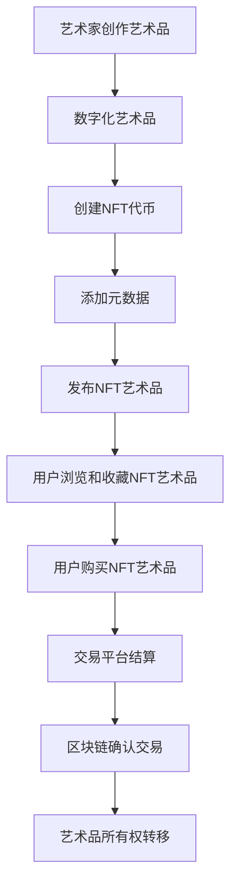

                 


### 文章标题: 数字时代的虚拟美术馆：NFT艺术品的全球展示平台

### 关键词：NFT艺术品，虚拟美术馆，区块链，人工智能，全球展示平台

### 摘要：
在数字时代，NFT（非同质化代币）艺术品的兴起为艺术品市场带来了革命性的变革。本文将探讨NFT艺术品在虚拟美术馆中的应用，以及如何构建一个全球展示平台。通过逐步分析NFT的核心概念、虚拟美术馆的技术基础，以及NFT艺术品展示平台的商业模式和挑战，本文旨在为读者提供一个全面、系统的理解。

---

### 1.1 引言

在过去的几年中，区块链技术和加密货币的快速发展，为数字时代带来了前所未有的变革。特别是在艺术领域，NFT（Non-Fungible Token，非同质化代币）的兴起，使得艺术家和收藏家能够以一种全新的方式展示和交易艺术品。NFT不仅代表了数字艺术品的唯一所有权证明，还提供了一种去中心化的交易平台，为全球艺术市场的扩展提供了无限可能。

虚拟美术馆作为数字时代的产物，其发展也在不断加速。通过虚拟现实（VR）和增强现实（AR）技术，虚拟美术馆能够为用户提供沉浸式的艺术体验。而人工智能（AI）的加入，使得虚拟美术馆能够更好地理解用户需求，提供个性化的艺术推荐。NFT艺术品的引入，进一步丰富了虚拟美术馆的内容和形式。

本文将围绕NFT艺术品和虚拟美术馆的融合，探讨NFT艺术品在全球展示平台中的应用。通过逐步分析NFT艺术品的定义、特性，以及虚拟美术馆的技术基础，本文旨在为读者提供一个全面、系统的理解，并探讨NFT艺术品展示平台的发展趋势和未来展望。

---

### 1.1.1 NFT艺术品的兴起与背景

NFT艺术品的兴起，可以追溯到2017年区块链技术和加密货币的快速发展。当时，以太坊（Ethereum）区块链上的ERC-721和ERC-1155标准被推出，为创建和交易数字资产提供了基础设施。这使得艺术家和创作者能够将他们的作品数字化，并以NFT的形式发行。

NFT艺术品的特点在于其唯一性和不可替代性。每个NFT都是独一无二的，无法与其他NFT互换，这与传统的同质化代币（如比特币）形成了鲜明对比。这种特性使得NFT成为了一种独特的数字资产，不仅代表了对艺术品的所有权，还代表了艺术品的稀缺性和独特性。

NFT艺术品的交易也呈现出高速增长的趋势。以OpenSea为例，作为全球最大的NFT市场，其交易量在2020年底至2021年初急剧上升。一些NFT艺术品甚至以数百万美元的价格成交，这引起了全球艺术界和投资界的广泛关注。

NFT艺术品之所以能够得到如此广泛的认可，一方面是由于区块链技术本身的可信度和透明性，另一方面则是由于数字时代的艺术需求。随着数字艺术品的创作和传播变得更加容易，越来越多的艺术家选择将自己的作品以NFT的形式发布，而收藏家也热衷于投资这些具有独特价值和稀缺性的数字艺术品。

总的来说，NFT艺术品的兴起，不仅改变了艺术品的交易方式，也为数字时代艺术市场带来了新的机遇和挑战。

### 1.1.2 虚拟美术馆的发展趋势

虚拟美术馆作为数字时代的一个重要产物，其发展趋势呈现出多样化和快速化的特点。随着虚拟现实（VR）和增强现实（AR）技术的不断进步，虚拟美术馆为用户提供了全新的艺术体验。用户不仅可以通过VR设备沉浸式地参观展览，还可以通过AR技术将虚拟艺术品叠加到现实世界中，实现虚实结合的艺术体验。

人工智能（AI）技术的应用也为虚拟美术馆带来了新的可能性。通过机器学习和数据挖掘，虚拟美术馆能够分析用户行为，了解他们的兴趣和偏好，从而提供个性化的艺术推荐。例如，AI系统可以根据用户的浏览记录和互动行为，推荐他们可能感兴趣的艺术家和作品，提升用户体验。

此外，区块链技术的引入，使得虚拟美术馆在艺术品所有权和交易方面更加透明和可信。NFT技术的应用，使得艺术品的所有权可以被数字化记录和验证，确保了艺术品的真实性和唯一性。这不仅为艺术品交易提供了便利，也为艺术家和收藏家提供了更多的交易机会。

未来的虚拟美术馆将更加智能化和互动化。随着5G网络的普及，虚拟美术馆的访问速度和互动体验将进一步提升。同时，区块链和AI技术的深度融合，将为虚拟美术馆带来更多的创新应用，例如智能合约用于艺术品的自动交易，AI助手用于解答用户疑问和提供个性化服务。

总的来说，虚拟美术馆的发展趋势是朝着更加互动、智能化和可信的方向前进，NFT艺术品的引入更是为其增添了新的活力和可能性。

### 1.1.3 NFT艺术品与虚拟美术馆的融合

NFT艺术品与虚拟美术馆的融合，为艺术界带来了全新的可能性。NFT技术的独特特性，如唯一性和不可替代性，使得虚拟美术馆能够以更高效、更透明的方式展示和交易艺术品。以下从NFT艺术品在虚拟美术馆中的应用、用户体验的提升、以及艺术市场的影响三个方面进行详细分析。

**NFT艺术品在虚拟美术馆中的应用**

1. **艺术品的数字化展示**：虚拟美术馆通过NFT技术，将传统艺术品数字化，用户可以在虚拟空间中浏览和欣赏这些艺术品。与传统美术馆相比，虚拟美术馆不受物理空间的限制，用户可以随时随地访问和体验艺术品。

2. **艺术品的唯一性展示**：NFT技术的应用，使得虚拟美术馆能够更好地展示艺术品的价值和稀缺性。每个NFT艺术品都是独一无二的，用户在虚拟美术馆中可以看到每个艺术品的详细信息，如创作过程、艺术家签名等，这增加了艺术品的可信度和吸引力。

3. **互动和参与性**：通过NFT技术，虚拟美术馆可以为用户提供更多的互动和参与机会。例如，用户可以购买NFT艺术品，成为艺术品的合法拥有者，并获得相关的数字权益，如艺术家签名证书、限量版数字艺术作品等。

**用户体验的提升**

1. **个性化的艺术推荐**：虚拟美术馆利用人工智能技术，分析用户的历史行为和偏好，提供个性化的艺术推荐。用户在浏览艺术品时，系统能够根据其兴趣自动推荐相关艺术品，提高用户体验。

2. **沉浸式的艺术体验**：虚拟现实（VR）和增强现实（AR）技术的应用，使得用户可以在虚拟美术馆中获得沉浸式的艺术体验。用户可以“走进”虚拟美术馆，感受艺术品的氛围和艺术家的创作灵感。

3. **社交互动**：虚拟美术馆提供了社交互动的平台，用户可以在虚拟空间中与艺术家和其他用户交流，分享艺术心得和体验，增加了互动性和社区感。

**艺术市场的影响**

1. **扩展艺术市场**：NFT艺术品和虚拟美术馆的融合，使得艺术市场不再受地域和物理空间的限制。艺术家和收藏家可以全球范围内展示和交易艺术品，扩大了市场的规模。

2. **降低艺术品交易门槛**：传统艺术品交易需要较高的门槛，如鉴定、运输、存储等。NFT技术简化了这些流程，使得艺术品交易更加便捷和低成本。

3. **推动艺术创新**：NFT艺术品和虚拟美术馆的融合，为艺术家提供了更多的创作和展示机会。艺术家可以通过NFT技术，以全新的形式创作和展示艺术品，推动艺术的创新和发展。

总之，NFT艺术品与虚拟美术馆的融合，不仅为艺术界带来了新的机遇和挑战，也为用户提供了更加丰富和多样化的艺术体验。随着技术的不断进步，NFT艺术品在虚拟美术馆中的应用将更加广泛和深入，为艺术市场带来更多可能性。

### 1.2 NFT艺术品的核心概念与特性

NFT（Non-Fungible Token，非同质化代币）艺术品是数字时代的一个重要创新，它不仅改变了传统艺术品交易的方式，还带来了对艺术品所有权、价值和稀缺性新的理解。以下将从NFT的概念、与区块链技术的关系、主要特性以及与传统艺术品的区别四个方面进行详细探讨。

**NFT的概念与定义**

NFT是一种基于区块链技术的数字资产，代表了对特定物品的所有权或独特性。与传统的同质化代币（如比特币和以太币）不同，NFT是独一无二的，无法与其他NFT互换。每个NFT都有其唯一的标识符，确保了其唯一性和不可替代性。NFT通常包含有关数字资产的详细信息，如创建者、所有者、创作日期、元数据等。

**NFT与区块链技术的关系**

区块链技术是NFT的基础设施，它提供了去中心化的账本，确保了NFT的所有权和交易记录的透明性和不可篡改性。在区块链上，每个NFT都被赋予一个唯一的哈希值，这个哈希值与NFT的元数据相关联，形成了一个不可分割的整体。区块链上的智能合约则负责执行NFT的交易条款，确保交易过程的自动化和可信度。

**NFT艺术品的主要特性**

1. **唯一性**：每个NFT艺术品都是独一无二的，无法与其他NFT互换。这种唯一性确保了每个艺术品的独特性和价值。

2. **不可篡改性**：区块链技术确保了NFT艺术品的交易记录和所有权信息的不可篡改。一旦NFT艺术品被记录在区块链上，其交易历史和所有权信息将永久保存，无法被篡改。

3. **可追溯性**：NFT艺术品的所有权和交易记录都记录在区块链上，用户可以方便地查看艺术品的来源和历史。这种可追溯性增加了艺术品的可信度和透明度。

4. **数字权益**：NFT艺术品通常附带数字权益，如艺术家签名证书、限量版数字艺术作品等。这些数字权益可以作为艺术品的补充，增加其价值。

**NFT艺术品与传统艺术品的区别**

1. **形式和介质**：传统艺术品通常是物理实体，如油画、雕塑等，而NFT艺术品是数字化的，存在于区块链上。

2. **所有权和验证**：传统艺术品的所有权需要通过物理手段进行验证，如签名、盖章等，而NFT艺术品的所有权通过区块链技术进行数字验证。

3. **交易和流通**：传统艺术品交易需要复杂的流程，如鉴定、评估、运输等，而NFT艺术品交易通过区块链技术实现自动化，更加便捷和低成本。

4. **价值和稀缺性**：传统艺术品的价值和稀缺性通常依赖于专家的评估和市场供需，而NFT艺术品的价值和稀缺性通过其唯一性和不可替代性来体现。

总的来说，NFT艺术品作为数字时代的一种新兴艺术形式，具有独特的概念和特性，为传统艺术品市场带来了新的机遇和挑战。通过理解NFT艺术品的本质和特性，艺术家和收藏家可以更好地利用这一新兴技术，创造和交易独特而有价值的艺术品。

### 1.2.4 NFT艺术品与传统艺术品的区别

NFT艺术品与传统艺术品在形式、所有权验证、交易流程和价值稀缺性等方面存在显著区别，这些差异不仅影响了艺术市场，也为艺术收藏和创作带来了新的挑战和机遇。

**形式和介质**

NFT艺术品是数字化的，存在于区块链上，通过加密算法和智能合约确保其唯一性和不可篡改性。这些艺术品可以是图片、音频、视频、动画等多种形式，通过数字技术创作和存储。相比之下，传统艺术品通常是物理实体，如油画、雕塑、手工艺品等，它们依赖于物理空间进行展示和保存。

**所有权和验证**

在NFT艺术品中，所有权是通过区块链上的数字证书来验证的。每次交易都会记录在区块链上，确保所有权转移的透明性和不可篡改性。相比之下，传统艺术品的所有权验证通常依赖于物理手段，如签名、印章、鉴定证书等，这些手段容易受到伪造和篡改的风险。

**交易和流通**

NFT艺术品的交易通过去中心化的平台进行，交易流程自动化且成本较低。用户可以在全球范围内轻松购买和出售NFT艺术品，无需复杂的中间环节。传统艺术品的交易流程通常较为复杂，涉及鉴定、评估、运输和存储等多个环节，交易成本较高且时间较长。

**价值和稀缺性**

NFT艺术品的价值和稀缺性依赖于其唯一性和不可替代性。每个NFT艺术品都是独一无二的，无法与其他NFT互换，这使得它们具有独特的价值和稀缺性。传统艺术品的价值和稀缺性通常依赖于专家的评估、历史、市场需求等因素。虽然传统艺术品也有其独特的价值和稀缺性，但NFT艺术品通过数字技术的确保，使得其价值和稀缺性更加透明和可验证。

**影响**

1. **市场扩展**：NFT艺术品打破了地域和物理空间的限制，使得艺术品市场更加开放和全球化。传统艺术品市场往往受到地域和物理空间的限制，而NFT艺术品可以轻松地在全球范围内交易和展示。

2. **降低门槛**：NFT艺术品降低了艺术收藏的门槛，使得更多人能够参与艺术市场。传统艺术品市场的高门槛使得普通投资者难以参与，而NFT艺术品的低成本和便捷性使得这一市场更加大众化。

3. **创新驱动**：NFT艺术品为艺术家提供了新的创作和展示平台，推动了艺术形式的创新。艺术家可以更自由地探索数字艺术，而无需受制于传统的物理创作和展示方式。

4. **挑战和风险**：NFT艺术品市场的发展也带来了一些挑战和风险，如艺术品真伪的验证、交易安全的保障等。艺术家和收藏家需要具备一定的技术知识和风险意识，以确保自身的利益。

总的来说，NFT艺术品与传统艺术品在形式、所有权验证、交易流程和价值稀缺性等方面存在显著区别，这些差异不仅改变了艺术市场的格局，也为艺术收藏和创作带来了新的机遇和挑战。

### 1.3 虚拟美术馆的技术基础

虚拟美术馆的实现依赖于一系列先进技术的支持，其中最为关键的是虚拟现实（VR）技术、增强现实（AR）技术和人工智能（AI）。这些技术的融合，不仅为用户提供了沉浸式的艺术体验，还大大提升了虚拟美术馆的功能性和互动性。

**虚拟现实技术（VR）**

虚拟现实技术通过创建一个三维的虚拟环境，使用户能够“走进”虚拟空间，体验到身临其境的感觉。在虚拟美术馆中，VR技术可以模拟真实艺术馆的空间布局，用户可以在虚拟空间中自由行走，近距离欣赏艺术品。此外，VR技术还可以结合3D扫描和建模技术，将现实中的艺术品数字化，以更高的精度和细节呈现给用户。

**增强现实技术（AR）**

增强现实技术通过将虚拟图像叠加到现实世界中，使用户可以在现实环境中看到数字化的艺术作品。在虚拟美术馆中，AR技术可以为用户提供更多样化的艺术体验，例如，用户可以使用智能手机或AR眼镜，将虚拟艺术作品叠加到现实环境中的任何位置，如墙面、桌面等。这种方式不仅增加了互动性，还可以让用户更好地融入艺术作品。

**人工智能技术（AI）**

人工智能技术在虚拟美术馆中发挥着重要作用，主要体现在个性化推荐和用户体验优化方面。通过分析用户的历史行为和偏好，AI算法可以推荐用户可能感兴趣的艺术品和艺术家。此外，AI还可以用于艺术品的分类和标签化，提高搜索和浏览的效率。同时，AI技术还可以用于虚拟美术馆的运营和管理，如智能导览、实时监控和故障诊断等。

**技术融合与应用**

虚拟现实、增强现实和人工智能技术的融合，为虚拟美术馆提供了丰富的应用场景。以下是一些具体的应用实例：

1. **沉浸式展览**：利用VR技术，虚拟美术馆可以创建一个沉浸式的艺术展览空间，用户可以在这个空间中自由探索和互动。

2. **虚拟艺术家工作室**：通过AR技术，用户可以在家中创建一个虚拟艺术家工作室，与艺术家进行实时互动，学习艺术创作技巧。

3. **个性化推荐**：基于AI技术，虚拟美术馆可以为用户提供个性化的艺术推荐，根据用户的兴趣和偏好，推荐相关艺术品和艺术家。

4. **智能导览系统**：通过AI技术，虚拟美术馆可以开发智能导览系统，为用户提供详细的展览信息和艺术作品介绍，提高用户的参观体验。

总之，虚拟美术馆的技术基础是VR、AR和AI的融合，这些技术的应用不仅为用户提供了丰富的艺术体验，也为艺术馆的管理和运营提供了新的工具和平台。随着技术的不断进步，虚拟美术馆将继续创新和发展，为艺术界带来更多可能性。

### 1.3.1 虚拟现实技术（VR）

虚拟现实技术（VR）在虚拟美术馆中扮演着至关重要的角色，它为用户提供了沉浸式的艺术体验，让用户能够“走进”艺术空间，与艺术品进行深度的互动。以下是VR技术在虚拟美术馆中的应用及其影响。

**应用场景**

1. **沉浸式展览**：VR技术可以创建一个逼真的三维虚拟展览空间，用户可以在这个空间中自由漫步，近距离观察艺术品。通过佩戴VR头戴设备，用户可以感受到与真实世界相似的视觉和听觉效果，增强参观体验。

2. **虚拟互动**：VR技术不仅能够提供视觉上的沉浸感，还可以实现虚拟互动。例如，用户可以通过VR设备与虚拟艺术家进行互动，了解艺术创作的灵感来源和技术细节。

3. **艺术教育**：VR技术可以用于艺术教育，通过虚拟展览和互动体验，学生可以更直观地了解艺术史和艺术作品。这种教育方式不仅提高了学习兴趣，还有助于培养学生的审美能力和创造力。

**技术实现**

1. **三维建模与渲染**：虚拟美术馆中的艺术品首先需要进行三维建模和渲染，确保其外观和细节与实物一致。这个过程通常需要高精度的三维扫描和图像处理技术。

2. **VR头戴设备**：用户通过佩戴VR头戴设备，如Oculus Rift、HTC Vive等，进入虚拟展览空间。头戴设备通过图像传感器和陀螺仪等硬件，捕捉用户的头部运动和视角变化，实现沉浸式的视觉体验。

3. **交互设计**：VR技术需要结合交互设计，确保用户在虚拟美术馆中的操作便捷和直观。例如，用户可以通过手势、声音或其他交互方式与虚拟艺术品进行互动。

**影响**

1. **用户体验**：VR技术为用户提供了前所未有的沉浸式体验，用户可以更加自由地探索艺术空间，深入理解艺术作品。这种体验不仅提高了用户对艺术品的兴趣，也增强了他们的参与感和互动性。

2. **艺术传播**：虚拟现实技术使得艺术品的传播范围不再受限于物理空间。通过虚拟展览，艺术家和艺术馆可以将作品推广到全球范围内，吸引更多观众。

3. **艺术创新**：VR技术为艺术创作和展示带来了新的可能性。艺术家可以通过VR技术创造出全新的艺术形式和作品，拓展艺术的表现力和维度。

总之，虚拟现实技术在虚拟美术馆中的应用，不仅为用户提供了丰富的艺术体验，也为艺术馆的管理和运营带来了新的工具和平台。随着VR技术的不断进步，虚拟美术馆将继续创新和发展，为艺术界带来更多可能性。

### 1.3.2 增强现实技术（AR）

增强现实技术（AR）在虚拟美术馆中的应用，为用户带来了前所未有的互动体验，使得艺术品从静态展示走向动态交互。以下是AR技术在虚拟美术馆中的应用及其影响。

**应用场景**

1. **虚拟导览**：AR技术可以开发虚拟导览应用，用户通过智能手机或AR眼镜，可以在现实环境中实时获取艺术品的详细信息、历史背景和艺术家简介。这种互动方式不仅提高了展览的趣味性，还增强了用户对艺术品的理解。

2. **互动创作**：AR技术允许用户在现实环境中与虚拟艺术品互动，例如，用户可以通过AR应用将自己的创意叠加到艺术作品上，或者与虚拟艺术家进行实时互动，创作新的艺术作品。

3. **互动教育**：AR技术可以应用于艺术教育，通过虚拟互动体验，学生可以更加直观地了解艺术史和艺术作品，培养艺术兴趣和审美能力。

**技术实现**

1. **图像识别与定位**：AR技术需要使用图像识别和定位技术，将虚拟内容与现实环境精准对齐。例如，通过使用相机捕捉现实场景中的特定标识物，如二维码或特殊标记，然后叠加虚拟内容。

2. **实时渲染**：AR技术需要实时渲染虚拟内容，确保其与现实环境的互动和融合。高质量的图像处理和实时渲染技术，是实现逼真AR体验的关键。

3. **用户交互设计**：AR应用需要结合用户交互设计，确保用户操作的便捷性和直观性。例如，用户可以通过手势、声音或其他交互方式与虚拟内容进行互动。

**影响**

1. **用户体验**：AR技术为用户提供了更加互动和丰富的艺术体验，用户不仅可以欣赏艺术品，还可以与艺术品互动，创作属于自己的艺术作品。这种互动性增强了用户对艺术品的兴趣和参与感。

2. **艺术传播**：AR技术打破了物理空间的限制，使得艺术品能够以数字化的形式传播到更广泛的受众。通过AR应用，艺术馆可以将展览内容推广到全球，吸引更多观众。

3. **艺术创新**：AR技术为艺术创作和展示提供了新的可能性。艺术家可以探索虚拟与现实融合的新形式，创造出更加丰富和多维的艺术作品。

总之，增强现实技术在虚拟美术馆中的应用，不仅为用户带来了全新的互动体验，也为艺术馆的运营和艺术创作提供了新的工具和平台。随着AR技术的不断进步，虚拟美术馆将继续创新和发展，为艺术界带来更多可能性。

### 1.3.3 人工智能（AI）在虚拟美术馆中的应用

人工智能（AI）技术在虚拟美术馆中的应用，不仅提升了用户体验，还为艺术馆的运营和管理提供了智能化解决方案。以下是AI技术在虚拟美术馆中的几个关键应用及其影响。

**个性化推荐**

AI技术通过分析用户的历史行为和偏好，能够提供个性化的艺术推荐。例如，用户在浏览艺术品时，系统可以记录其浏览记录、点赞和收藏行为，然后根据这些数据为用户推荐相关艺术品和艺术家。这种个性化推荐不仅提高了用户体验，也增加了用户对艺术品的兴趣和参与度。

**艺术分析**

AI技术能够对艺术作品进行深入分析，提取其视觉特征和艺术风格。通过这些分析，艺术馆可以更好地了解艺术品的特点，为展览策划提供数据支持。此外，AI技术还可以用于艺术品的分类和标签化，提高搜索和浏览的效率。

**智能导览**

AI技术可以开发智能导览系统，为用户提供详细的展览信息和艺术作品介绍。例如，用户可以通过语音助手或手机应用，获取艺术品的历史背景、创作灵感和技术细节。这种智能导览系统不仅提高了用户的参观体验，也增强了他们对艺术品的理解。

**安全性监控**

AI技术还可以用于虚拟美术馆的安全性监控。通过图像识别和智能分析，系统可以实时监控展览环境，识别异常行为，并提供实时警报。这种监控机制不仅提高了展览的安全性，也为管理者提供了有效的管理工具。

**艺术创作辅助**

AI技术还可以辅助艺术创作，例如，通过生成对抗网络（GAN）等技术，AI可以生成新的艺术作品，为艺术家提供灵感。此外，AI还可以用于艺术作品的修复和保存，通过图像处理技术，恢复艺术品的历史面貌。

**影响**

1. **用户体验**：AI技术的应用使得虚拟美术馆更加智能化和个性化，用户可以获得更加定制化的艺术体验，提高参观的乐趣和满意度。

2. **艺术馆运营**：AI技术为艺术馆的运营提供了高效和智能化的解决方案，例如，通过智能导览和个性化推荐，艺术馆可以更好地管理展览内容和用户需求。

3. **艺术创新**：AI技术为艺术创作和展示提供了新的工具和平台，艺术家可以通过AI技术探索新的创作形式和表现手法，推动艺术的创新和发展。

总之，人工智能技术在虚拟美术馆中的应用，不仅提升了用户体验，也为艺术馆的运营和管理带来了新的机遇和挑战。随着AI技术的不断进步，虚拟美术馆将继续创新和发展，为艺术界带来更多可能性。

### 1.4 NFT艺术品的全球展示平台

随着NFT（Non-Fungible Token，非同质化代币）艺术品的兴起，全球展示平台的需求日益增长。NFT艺术品的独特性和不可替代性，使得艺术家和收藏家需要更高效、更透明的交易平台。以下将介绍NFT市场的概述、NFT艺术品展示平台的选择与构建、商业模式以及跨境交易的挑战与解决方案。

#### 1.4.1 NFT市场的概述

NFT市场是指基于区块链技术，用于创建、展示和交易非同质化代币的艺术品和其他数字资产的市场。NFT市场的兴起，主要得益于区块链技术的透明性、安全性和去中心化特性。NFT艺术品市场的发展，不仅改变了传统艺术品市场的交易模式，还为数字艺术、虚拟物品等新兴领域提供了新的商业机会。

NFT市场的参与者包括艺术家、收藏家、平台运营者、投资者和区块链技术开发者。艺术家通过NFT技术，可以将数字艺术作品转化为唯一且不可替代的资产，并在全球范围内进行展示和交易。收藏家则可以通过购买NFT艺术品，获得艺术品的数字所有权证明，并享受相应的数字权益。

#### 1.4.2 NFT艺术品展示平台的选择与构建

构建一个NFT艺术品展示平台，需要考虑多个因素，包括技术实现、用户界面设计、安全性和合规性等。以下是选择和构建NFT艺术品展示平台的关键步骤：

1. **技术实现**：选择合适的区块链平台，如以太坊（Ethereum）、波卡（Polkadot）等，开发NFT创建、展示和交易的功能。NFT创建通常涉及智能合约的开发，确保NFT的唯一性和不可篡改性。

2. **用户界面设计**：设计简洁、直观的用户界面，确保用户能够轻松创建、浏览和交易NFT艺术品。用户界面应包含艺术品展示、交易记录、用户账户管理等模块。

3. **安全性**：确保平台的安全性，防止黑客攻击和数据泄露。采用多重签名、加密存储和防恶意代码等技术，保障用户数据的安全。

4. **合规性**：遵循当地法律法规，确保平台运营合规。例如，了解和遵守关于数字资产交易、版权和知识产权的法规。

5. **营销推广**：通过社交媒体、在线广告和其他渠道，推广平台和NFT艺术品，吸引更多用户和投资者。

#### 1.4.3 NFT艺术品展示平台的商业模式

NFT艺术品展示平台的主要商业模式包括以下几个方面：

1. **交易费用**：平台收取每笔交易一定比例的费用，通常为交易金额的百分比。例如，OpenSea平台收取交易金额的2.5%作为费用。

2. **会员订阅**：平台可以提供会员订阅服务，会员享受更多的交易优惠、艺术品优先展示和访问特权。

3. **增值服务**：提供增值服务，如艺术品鉴定、版权登记、数字权益管理等，为用户提供专业化的服务。

4. **广告与营销**：通过广告收入和营销合作，为平台带来额外的收入来源。

5. **艺术品拍卖**：举办NFT艺术品拍卖会，为艺术家和收藏家提供高价交易的机会，平台从中获取佣金。

#### 1.4.4 跨境交易的挑战与解决方案

NFT艺术品展示平台面临的跨境交易挑战主要包括以下几个方面：

1. **法律和监管**：不同国家和地区的法律法规和监管政策可能存在差异，平台需要了解和遵守各地的法律法规。

2. **货币兑换**：跨境交易通常涉及不同货币的兑换，需要解决汇率波动和货币兑换手续费等问题。

3. **支付方式**：不同国家和地区的支付方式可能不同，平台需要支持多种支付方式和跨境支付解决方案。

解决方案包括：

1. **法律合规性**：平台应了解各地的法律法规，确保交易过程合法合规。例如，通过咨询法律专家和律师事务所，确保平台符合相关法律法规的要求。

2. **多货币支持**：平台应支持多种货币的兑换和支付，例如，通过集成加密货币交易所，提供多种货币的支付选项。

3. **跨境支付解决方案**：平台可以与第三方支付服务提供商合作，提供跨境支付解决方案。例如，通过使用跨境支付API，实现不同货币之间的快速、安全支付。

4. **国际化运营**：平台应考虑国际化运营，了解不同地区的市场需求和文化差异，提供本地化的服务。

总之，NFT艺术品的全球展示平台为艺术界带来了新的机遇和挑战。通过选择合适的技术、构建完善的商业模式和解决跨境交易挑战，平台可以提供高效、透明和安全的NFT艺术品交易服务，推动数字艺术市场的进一步发展。

### 1.5 案例分析：成功的NFT艺术品展示平台

在NFT艺术品展示平台的发展过程中，一些平台因其创新性和成功的运营模式而脱颖而出。以下将分析三个成功的案例：佳士得（Christie's）的NFT艺术品拍卖、OpenSea——全球最大的NFT艺术品市场以及Nifty Gateway——加密艺术领域的领导者。

**1.5.1 佳士得（Christie's）的NFT艺术品拍卖**

佳士得（Christie's）作为全球知名的拍卖行，其在2021年首次推出NFT艺术品拍卖会，引起了广泛关注。佳士得通过其在线拍卖平台，将NFT艺术品与传统的艺术品拍卖相结合，成功吸引了大量收藏家和投资者的参与。

**创新点**：
- **品牌影响力**：佳士得利用其品牌影响力和市场资源，为NFT艺术品拍卖会吸引了大量关注。
- **艺术与科技的结合**：佳士得将NFT艺术品的数字特性和传统拍卖形式相结合，为用户提供了全新的艺术体验。
- **高端市场定位**：佳士得的NFT艺术品拍卖会定位高端市场，吸引了大量高净值收藏家和机构投资者。

**成功因素**：
- **品牌信誉**：佳士得的长期品牌信誉为其NFT艺术品拍卖会提供了信任基础。
- **市场定位**：佳士得准确把握了市场趋势，将NFT艺术品与高端市场相结合，满足了高端收藏家的需求。
- **技术创新**：佳士得利用其技术优势，提供了高效、安全的NFT艺术品交易和拍卖服务。

**1.5.2 OpenSea——全球最大的NFT艺术品市场**

OpenSea成立于2017年，是全球最大的NFT艺术品市场，其用户数量和交易量持续增长。OpenSea提供了一个开放的去中心化平台，用户可以轻松创建、展示和交易NFT艺术品。

**创新点**：
- **去中心化平台**：OpenSea是一个完全去中心化的平台，所有交易都记录在区块链上，确保透明性和安全性。
- **多样化资产类型**：OpenSea支持多种类型的数字资产，包括艺术品、游戏道具、虚拟土地等，提供了丰富的选择。
- **用户友好界面**：OpenSea提供了一个简单直观的用户界面，用户可以轻松地浏览、购买和销售NFT艺术品。

**成功因素**：
- **社区驱动**：OpenSea建立了强大的社区，通过用户互动和反馈，不断改进平台功能和用户体验。
- **技术优势**：OpenSea利用区块链技术和智能合约，确保了交易的安全性和透明性。
- **市场推广**：OpenSea通过社交媒体和营销活动，吸引了大量用户和投资者，推动了市场的增长。

**1.5.3 Nifty Gateway——加密艺术领域的领导者**

Nifty Gateway成立于2017年，是加密艺术领域的领先平台，以其独特的艺术项目和社区参与而闻名。Nifty Gateway与众多知名艺术家合作，推出了一系列独特的NFT艺术品。

**创新点**：
- **独家艺术项目**：Nifty Gateway与知名艺术家合作，推出独家艺术项目，吸引了大量收藏家和投资者的关注。
- **社区参与**：Nifty Gateway鼓励用户参与艺术项目的设计和开发，增加了社区的互动性和参与感。
- **多样化艺术品**：Nifty Gateway提供了多种类型的艺术品，包括数字艺术、虚拟时尚和游戏艺术等，满足了不同用户的需求。

**成功因素**：
- **艺术家资源**：Nifty Gateway拥有丰富的艺术家资源，与众多知名艺术家合作，确保了平台的艺术价值和吸引力。
- **社区文化**：Nifty Gateway建立了独特的社区文化，用户之间互相交流、分享和合作，增强了平台的凝聚力。
- **技术创新**：Nifty Gateway利用区块链技术和智能合约，提供了安全、高效的NFT艺术品交易服务。

综上所述，佳士得、OpenSea和Nifty Gateway的成功案例展示了NFT艺术品展示平台的多样性和潜力。通过结合品牌影响力、技术创新和用户社区，这些平台不仅为艺术家和收藏家提供了全新的艺术体验和交易机会，也为数字艺术市场的发展做出了重要贡献。

### 1.6 NFT艺术品展示平台的发展趋势与未来展望

随着NFT（非同质化代币）技术的不断成熟，NFT艺术品展示平台正迎来前所未有的发展机遇。以下是NFT艺术品展示平台的发展趋势、艺术界对NFT的接受与反馈、面临的挑战与机遇，以及未来NFT艺术品展示平台的趋势与展望。

#### 1.6.1 NFT艺术品展示平台的发展趋势

1. **平台多样化和全球化**：随着NFT技术的普及，越来越多的平台开始涌现，涵盖了从大型拍卖行到小型社区平台，形成了一个多样化的生态系统。同时，这些平台正逐步走向全球化，为全球艺术家和收藏家提供交易和服务。

2. **技术融合与创新**：NFT艺术品展示平台正不断融合新兴技术，如虚拟现实（VR）、增强现实（AR）和人工智能（AI）。这些技术的应用，不仅提升了用户的互动体验，也为艺术展示和交易提供了新的可能性。

3. **艺术品数字化**：越来越多的艺术家开始将传统艺术品数字化，并以NFT的形式发行。这推动了数字艺术市场的增长，也为艺术品的数字所有权和交易提供了新的途径。

4. **社区参与和粉丝经济**：NFT艺术品展示平台鼓励社区参与，用户不仅是买家和卖家，还可以参与到艺术项目的创作和推广中。这种模式不仅增强了平台的用户粘性，也为艺术家提供了更多的创作和收入来源。

5. **合规与监管**：随着NFT市场的快速增长，平台开始重视合规与监管，以确保交易的合法性和用户的权益。许多平台正在与监管机构合作，制定相应的合规政策和标准。

#### 1.6.2 艺术界对NFT的接受与反馈

艺术界对NFT的接受程度正在逐步提高。一方面，NFT技术为艺术家提供了一个全新的创作和展示平台，使得艺术品的传播和交易更加便捷和全球化。另一方面，NFT的不可篡改性和唯一性，为艺术品的所有权和价值提供了新的保障。

然而，艺术界对NFT也存在一些担忧和质疑。一些艺术家担心NFT可能会削弱艺术创作的原创性和艺术性，而投资者则担心市场的泡沫和风险。此外，关于NFT的版权和知识产权问题，也引发了一定的争议。

总的来说，艺术界对NFT的态度是复杂的，既有积极的接受，也有谨慎的质疑。随着NFT市场的进一步发展和成熟，这些问题有望得到解决，NFT在艺术界的影响也将逐渐加深。

#### 1.6.3 NFT艺术品展示平台面临的挑战与机遇

**挑战**：

1. **技术瓶颈**：尽管NFT技术正在快速发展，但仍然存在一些技术瓶颈，如交易速度、网络拥堵和费用等。这些问题可能会影响用户体验和交易效率。

2. **市场波动**：NFT市场的波动性较大，价格波动和泡沫现象时有发生。这可能会影响投资者和收藏家的信心，也增加了市场的风险。

3. **合规与监管**：NFT市场的监管环境仍在不断发展，平台需要不断适应和遵守各地的法律法规，确保交易合法合规。

4. **版权与知识产权**：NFT的版权和知识产权问题尚未完全解决，这可能会影响艺术品的交易和创作。

**机遇**：

1. **市场增长**：随着数字艺术市场的不断增长，NFT艺术品展示平台面临着巨大的市场机遇。通过提供创新的产品和服务，平台可以吸引更多的用户和投资者。

2. **技术创新**：NFT技术的不断发展，为平台提供了丰富的创新机会。例如，通过引入新的区块链技术和智能合约，平台可以提供更安全、更高效的交易服务。

3. **全球化**：随着全球化的推进，NFT艺术品展示平台可以拓展国际市场，吸引来自不同国家和地区的用户和艺术家。

4. **社区参与**：通过鼓励社区参与和粉丝经济，平台可以建立强大的用户基础和品牌忠诚度。

#### 1.6.4 未来NFT艺术品展示平台的趋势与展望

未来，NFT艺术品展示平台将继续朝着以下几个方向发展：

1. **技术升级与优化**：平台将不断引入新技术，提高交易速度、网络效率和用户体验。例如，通过引入层2解决方案和跨链技术，解决当前的技术瓶颈。

2. **合规与监管**：平台将更加重视合规与监管，确保交易过程的合法性和用户的权益。与监管机构的合作将变得更加紧密，以制定适应市场的合规政策和标准。

3. **多元化发展**：平台将不再局限于数字艺术品的交易，还将拓展到其他数字资产，如虚拟土地、虚拟商品等，提供更多样化的服务。

4. **社区驱动**：平台将更加注重社区建设，通过用户互动和参与，增强平台的用户粘性和品牌忠诚度。

5. **全球化扩张**：平台将继续拓展国际市场，吸引来自不同国家和地区的用户和艺术家，推动NFT艺术的全球传播。

总之，NFT艺术品展示平台在未来的发展中，将面临诸多挑战和机遇。通过技术创新、合规经营和用户社区的建设，平台将能够提供更加安全、高效和多元化的艺术交易服务，推动数字艺术市场的进一步发展。

### 结论

NFT艺术品展示平台在数字时代的虚拟美术馆中发挥着重要作用。通过NFT技术，艺术品不仅能够数字化、唯一化和不可篡改性，还打破了地域和物理空间的限制，为全球艺术家和收藏家提供了一个透明、高效和互动的展示和交易平台。未来，随着技术的不断进步和市场的成熟，NFT艺术品展示平台将继续创新和发展，为艺术界带来更多可能性。

作者：AI天才研究院/AI Genius Institute & 禅与计算机程序设计艺术 /Zen And The Art of Computer Programming

---

本文通过对NFT艺术品的核心概念、虚拟美术馆的技术基础、NFT艺术品展示平台的构建与发展趋势的详细分析，为读者提供了一个全面而系统的理解。从NFT技术的本质和应用，到虚拟美术馆的互动体验，再到展示平台的商业模式与未来展望，每个环节都进行了深入剖析。希望本文能为读者在理解NFT艺术品的全球展示平台提供有益的参考和启示。

**核心概念与联系**

在本文中，NFT（非同质化代币）艺术品是核心概念之一，其与区块链技术、虚拟现实（VR）、增强现实（AR）和人工智能（AI）等技术紧密相连。以下是一个简化的Mermaid流程图，展示了NFT艺术品交易的主要流程：



**核心算法原理讲解**

NFT艺术品的交易流程主要依赖于区块链技术和智能合约。以下是一个简化的伪代码示例，展示了NFT艺术品交易的算法原理：

```python
# 伪代码：NFT艺术品交易流程

# 创建NFT艺术品
def create_nft_artifact(artwork, artist, metadata):
    artwork_hash = sha256_hash(artwork)
    nft = generate_nft_token(artwork_hash, artist, metadata)
    upload_nft_to_blockchain(nft)
    add_smart_contract_to_nft(nft, contract_terms)
    mint_nft(nft)
    publish_nft_artifact(nft)

# 用户购买NFT艺术品
def buy_nft_artifact(nft, buyer):
    if check_nft_ownership(nft, buyer):
        transfer_ownership(nft, buyer)
        record_transaction(nft, buyer)
        return "交易成功"
    else:
        return "交易失败：所有权验证失败"

# 区块链确认交易
def confirm_transaction(nft, transaction):
    if validate_transaction(transaction):
        update_nft_ownership(nft, transaction.buyer)
        record_transaction(nft, transaction.buyer)
        return "交易确认成功"
    else:
        return "交易确认失败：验证失败"
```

通过上述伪代码，我们可以看到NFT艺术品的创建和交易流程是如何基于区块链技术和智能合约来实现的。这些核心算法原理为NFT艺术品的交易提供了透明性和安全性。

**最佳实践 tips**

1. **保护隐私**：在进行NFT艺术品交易时，用户应确保使用安全的数字钱包和身份验证机制，以保护个人信息不被泄露。

2. **了解平台规则**：在选择NFT艺术品展示平台时，用户应详细了解平台的交易规则、费用结构和服务条款，确保自身权益。

3. **合规性检查**：艺术家和平台运营者应严格遵守相关法律法规，确保艺术品的交易合法合规。

4. **技术更新**：用户应关注NFT技术的最新发展，了解新的区块链平台和技术，以提升交易效率和安全。

**注意事项**

1. **市场波动性**：NFT市场的波动性较大，投资者应谨慎评估市场风险，避免盲目跟风。

2. **网络安全**：用户在进行NFT交易时，应使用可靠的网络环境和安全的设备，防止黑客攻击和数据泄露。

**拓展阅读**

- **《区块链：从数字货币到智能合约》**：详细介绍了区块链技术的基本原理和应用场景。
- **《虚拟现实：从概念到实践》**：探讨了虚拟现实技术的应用和发展趋势。
- **《人工智能：理论与实践》**：介绍了人工智能的核心算法和应用领域。

通过本文，我们希望读者能够更好地理解NFT艺术品展示平台的工作原理和未来发展方向，为参与数字艺术市场提供有价值的参考。

