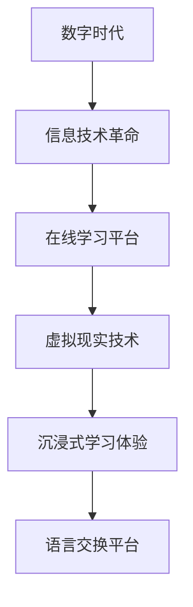
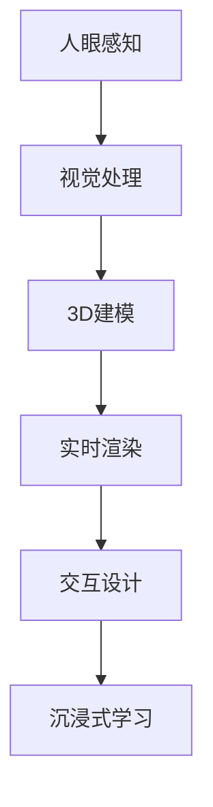
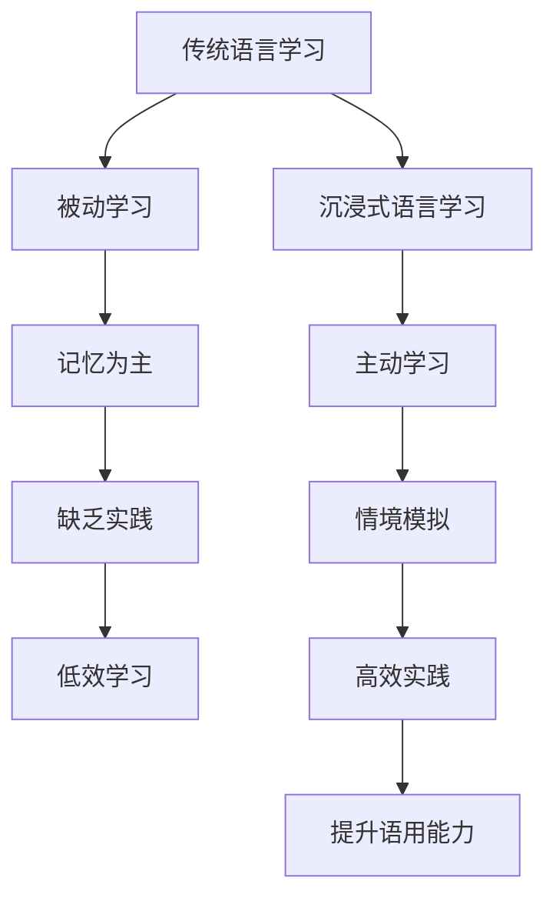

                 

## 文章标题：数字时代的语言交换平台：VR虚拟环境中的沉浸式语言学习

### 关键词：数字时代，语言交换平台，VR虚拟环境，沉浸式语言学习，语言学习技术，人工智能

### 摘要：

本文探讨了数字时代背景下，基于虚拟现实（VR）技术的沉浸式语言学习平台的设计与实现。首先，我们回顾了数字时代与语言学习的关系，阐述了VR技术的基本原理及其在语言学习中的应用。随后，我们深入探讨了沉浸式语言学习的优势，通过对比分析展示了其在语言习得过程中的独特价值。接着，我们详细介绍了VR语言交换平台的架构设计，包括虚拟环境的搭建、语音识别与生成系统等核心组件，并使用伪代码和LaTeX公式详细阐述了相关算法原理。通过实际案例分析和实战项目，我们展示了如何实现一个功能完备的语言交换平台，并提供了最佳实践和项目小结，为未来语言学习技术的发展提供了有益的借鉴。

## 引言与核心概念

### 数字时代的语言学习

随着信息技术的飞速发展，数字时代已经悄然降临。在这个时代，传统的语言学习方式正面临着前所未有的变革。在线学习平台的兴起，为语言学习者提供了更加便捷、高效的学习途径。然而，仅仅依靠传统的在线学习平台，已经无法满足现代语言学习的需求。语言学习不仅需要知识的传授，更需要实际的语言运用能力和跨文化交流能力的提升。

### VR技术的基本原理与应用

虚拟现实（VR）技术是一种通过计算机生成模拟环境，使人们能够在虚拟环境中进行交互和体验的技术。VR技术的基本原理涉及多个领域，包括人眼感知、视觉处理、3D建模、实时渲染和交互设计等。通过这些技术，人们可以在虚拟环境中获得沉浸式的体验，仿佛置身于真实世界中。

在语言学习中，VR技术可以模拟各种语言环境，使学习者能够在真实场景中练习语言。例如，学习者可以进入一个虚拟的咖啡馆，与虚拟的咖啡师进行对话，或者参与一个虚拟的文化交流活动，与来自不同国家的虚拟人物交流。这种沉浸式的学习体验，有助于提高学习者的语言运用能力和跨文化交流能力。

### 沉浸式语言学习的优势

沉浸式语言学习具有许多优势，这些优势使其在现代语言学习中脱颖而出。首先，沉浸式语言学习能够激发学习者的学习兴趣。通过虚拟现实技术，学习者可以在一个充满乐趣的学习环境中学习，从而提高学习动机。

其次，沉浸式语言学习能够提供更加真实的语言实践机会。在虚拟环境中，学习者可以与虚拟人物进行真实的对话，模拟各种生活场景。这种实践机会不仅有助于提高学习者的语言表达能力，还能够培养其跨文化交流能力。

最后，沉浸式语言学习能够提供个性化的学习体验。通过分析学习者的学习数据，平台可以为其提供个性化的学习建议和资源，帮助其更快地掌握语言。

### 核心概念与联系

为了更好地理解上述概念，我们可以使用Mermaid流程图来展示它们之间的关系。



通过这个流程图，我们可以清晰地看到数字时代、在线学习平台、虚拟现实技术和沉浸式学习体验之间的紧密联系。这些技术的结合，为语言学习带来了前所未有的变革。

## 第一部分：数字时代的语言交换平台概述

### 1.1 数字时代的语言学习

#### 数字时代的语言学习趋势

随着信息技术的不断发展，数字时代的语言学习呈现出以下趋势：

1. **在线学习平台的兴起**：在线学习平台的便捷性和灵活性，使得学习者可以随时随地进行学习。这些平台提供了丰富的学习资源，包括视频课程、电子书和互动练习等。

2. **移动学习的普及**：智能手机和移动设备的普及，使得学习者可以随时随地获取学习资源，进行碎片化学习。

3. **人工智能技术的应用**：人工智能技术，如语音识别和自然语言处理，为语言学习提供了更加智能化的工具。这些工具可以帮助学习者进行口语练习、语法纠正和翻译等。

4. **社交学习的兴起**：社交学习平台，如语言交换社区和在线聊天室，为学习者提供了与全球学习者交流的机会。这种交流有助于提高学习者的口语表达能力和跨文化交流能力。

#### 数字时代与语言学习的关系

数字时代与语言学习之间存在着紧密的关系。首先，数字时代为语言学习提供了更加便捷和高效的学习方式。通过在线学习平台和移动设备，学习者可以随时随地获取学习资源，进行个性化的学习。

其次，数字时代为语言学习提供了更多的实践机会。通过虚拟现实技术，学习者可以模拟各种语言环境，与虚拟人物进行真实的对话。这种实践机会不仅有助于提高学习者的语言运用能力，还能够培养其跨文化交流能力。

最后，数字时代为语言学习提供了更多的互动和社交机会。通过社交学习平台，学习者可以与全球学习者交流，分享学习经验，提高学习效果。

### 1.2 VR技术的基本原理与应用

#### VR技术的基本原理

虚拟现实（VR）技术是一种通过计算机生成模拟环境，使人们能够在虚拟环境中进行交互和体验的技术。VR技术的基本原理包括以下几个方面：

1. **人眼感知**：通过头戴式显示器（HMD）或其他显示设备，将虚拟环境中的图像直接呈现在用户眼前。

2. **视觉处理**：计算机对人眼接收到的图像进行处理，包括图像的渲染、光影效果和立体感等。

3. **3D建模**：利用3D建模软件，创建虚拟环境中的各种物体和场景。

4. **实时渲染**：计算机在虚拟环境中实时渲染图像，以提供流畅的交互体验。

5. **交互设计**：设计虚拟环境中的交互界面和交互方式，使用户能够与虚拟环境进行自然的交互。

#### VR技术在语言学习中的应用

VR技术在语言学习中的应用主要体现在以下几个方面：

1. **沉浸式语言学习环境**：通过虚拟现实技术，创建一个沉浸式的语言学习环境。学习者可以在虚拟环境中模拟真实场景，进行语言练习。

2. **交互式语言学习体验**：虚拟现实技术可以提供交互式的语言学习体验。学习者可以与虚拟人物进行对话，进行语言练习。

3. **语言学习游戏**：虚拟现实技术可以开发各种语言学习游戏，使学习者在游戏中学习语言。这些游戏可以提供丰富的互动和挑战，提高学习者的学习兴趣。

4. **跨文化交流**：虚拟现实技术可以模拟不同国家和地区的文化环境，使学习者能够在虚拟环境中与来自不同国家的学习者交流，提高其跨文化交流能力。

### 核心概念与联系

为了更好地理解VR技术的基本原理及其在语言学习中的应用，我们可以使用Mermaid流程图来展示这些核心概念之间的关系。



通过这个流程图，我们可以清晰地看到VR技术的各个组成部分及其在语言学习中的应用。

### 1.3 沉浸式语言学习的优势

#### 与传统语言学习的对比

沉浸式语言学习与传统语言学习方式存在显著的区别。传统语言学习主要依赖于教材、音频和视频等资源，学习过程较为被动，侧重于记忆和理论学习。而沉浸式语言学习则通过虚拟现实技术，创造一个真实、互动的语言学习环境，使学习过程更加主动、实践性强。

以下是沉浸式语言学习与传统语言学习方式的对比：

1. **学习方式**：
   - 传统语言学习：被动学习，以教材和教师为中心。
   - 沉浸式语言学习：主动学习，以学生为中心，强调实践和互动。

2. **学习资源**：
   - 传统语言学习：依赖教材、音频和视频等。
   - 沉浸式语言学习：利用虚拟现实技术，提供真实、互动的学习资源。

3. **学习效果**：
   - 传统语言学习：侧重于记忆和理论学习，缺乏实际应用。
   - 沉浸式语言学习：提高语言运用能力，培养跨文化交流能力。

#### 沉浸式语言学习的优势

沉浸式语言学习具有以下优势：

1. **激发学习兴趣**：通过虚拟现实技术，创造一个有趣、互动的学习环境，激发学习者的学习兴趣。

2. **提供真实实践机会**：虚拟现实技术可以模拟真实语言环境，提供丰富的语言实践机会，使学习者能够在真实情境中应用所学知识。

3. **培养跨文化交流能力**：通过虚拟现实技术，学习者可以与来自不同国家和地区的虚拟人物进行交流，提高跨文化交流能力。

4. **个性化学习体验**：通过分析学习者的学习数据，虚拟现实技术可以为其提供个性化的学习建议和资源，帮助其更快地掌握语言。

### 核心概念与联系

为了更好地理解沉浸式语言学习的优势，我们可以使用框图来展示其与传统语言学习方式的对比。



通过这个框图，我们可以清晰地看到沉浸式语言学习在激发学习兴趣、提供真实实践机会、培养跨文化交流能力和提供个性化学习体验等方面的优势。

## 第二部分：VR语言交换平台的设计与实现

### 2.1 平台总体架构

#### 平台总体架构设计

VR语言交换平台的总体架构包括以下几个关键部分：

1. **虚拟环境**：创建一个逼真的虚拟语言学习环境，包括各种场景、物体和角色等。

2. **用户管理**：实现用户注册、登录和权限管理等功能。

3. **语音识别与生成**：实现语音识别和语音生成的功能，为用户之间的语言交流提供支持。

4. **交互式学习体验**：设计交互式的学习任务和游戏，提供丰富的学习内容。

5. **数据分析与优化**：收集用户数据，分析学习效果，优化学习体验。

#### 核心算法原理讲解

以下是平台总体架构的核心算法原理讲解：

1. **虚拟环境搭建**：
   - **关键步骤**：创建虚拟场景、配置场景参数、加载3D模型和初始化用户角色。
   - **伪代码**：
     ```python
     function SetupVirtualEnvironment() {
         import VRFramework
         CreateScene()
         ConfigureSceneParameters()
         Load3DModel()
         InitializeUserCharacter()
     }
     ```

2. **用户管理**：
   - **关键步骤**：用户注册、登录和权限管理。
   - **伪代码**：
     ```python
     function UserManagement() {
         RegisterUser()
         LoginUser()
         ManageUserPermissions()
     }
     ```

3. **语音识别与生成**：
   - **关键步骤**：语音识别、语音合成和语音交互。
   - **伪代码**：
     ```python
     function VoiceRecognitionAndGeneration() {
         RecognizeVoice()
         GenerateVoice()
         InteractiveVoice()
     }
     ```

4. **交互式学习体验**：
   - **关键步骤**：设计交互式的学习任务和游戏。
   - **伪代码**：
     ```python
     function InteractiveLearningExperience() {
         DesignLearningTasks()
         DesignLearningGames()
     }
     ```

5. **数据分析与优化**：
   - **关键步骤**：收集用户数据、分析学习效果和优化学习体验。
   - **伪代码**：
     ```python
     function DataAnalysisAndOptimization() {
         CollectUserData()
         AnalyzeLearningEffect()
         OptimizeLearningExperience()
     }
     ```

#### 核心算法原理讲解

以下是核心算法原理的详细讲解：

1. **虚拟环境搭建**：

   虚拟环境搭建是VR语言交换平台的基础。首先，我们需要创建一个虚拟场景，包括各种场景元素（如建筑、道路、植物等）。然后，配置场景参数，如光照、气候和环境音效等，以增强场景的真实感。接下来，加载3D模型，包括用户角色、教学用具和其他交互元素。最后，初始化用户角色，使其能够与虚拟环境进行交互。

2. **用户管理**：

   用户管理包括用户注册、登录和权限管理。用户注册时，需要收集用户的基本信息，如用户名、密码和联系方式等。用户登录时，需要验证用户身份，确保只有授权用户能够访问系统。权限管理则根据用户角色和权限级别，限制用户对系统资源的访问。

3. **语音识别与生成**：

   语音识别与生成是语言学习的重要组成部分。语音识别技术通过分析音频信号，识别出用户所说的内容。语音生成技术则将文本转换为语音，使虚拟人物能够与用户进行对话。语音交互则通过实时语音识别和语音合成，实现用户与虚拟人物之间的语言交流。

4. **交互式学习体验**：

   交互式学习体验通过设计各种学习任务和游戏，提高学习者的学习兴趣和参与度。学习任务可以是模拟对话、语言练习和情境模拟等。游戏则可以是以语言学习为主题的互动游戏，如拼字游戏、词汇挑战等。

5. **数据分析与优化**：

   数据分析与优化通过收集用户数据，分析学习效果，优化学习体验。数据分析可以包括学习时长、学习进度、学习效果等。根据这些数据，平台可以调整教学内容、优化学习界面和提供个性化的学习建议。

### 2.2 虚拟环境的搭建

#### 虚拟环境搭建的核心算法原理

虚拟环境的搭建是VR语言交换平台设计的关键步骤。其核心算法原理包括场景创建、参数配置、3D模型加载和用户角色初始化。以下是对这些核心算法原理的详细讲解：

1. **场景创建**：

   场景创建是虚拟环境搭建的第一步。我们需要使用VR引擎（如Unity或Unreal Engine）创建一个虚拟场景。场景创建的关键步骤包括：

   - **定义场景大小**：确定场景的尺寸，包括长度、宽度和高度。
   - **设置背景**：为场景添加背景图像或视频，以增强视觉效果。
   - **添加场景元素**：将各种场景元素（如建筑、道路、植物等）添加到场景中。

2. **参数配置**：

   参数配置是确保虚拟环境真实感的关键。我们需要为场景设置各种参数，如光照、气候和环境音效等。具体包括：

   - **光照设置**：调整场景中的光照强度、方向和颜色，以模拟真实世界的光照效果。
   - **气候设置**：为场景添加天气效果，如晴天、雨天和雪天等。
   - **环境音效**：添加场景中的环境音效，如鸟鸣、风声和水声等，以增强场景的真实感。

3. **3D模型加载**：

   3D模型加载是将虚拟环境中的物体和角色呈现出来的关键步骤。我们需要使用3D建模软件（如Blender或Maya）创建3D模型，并将其导入到VR引擎中。具体包括：

   - **模型创建**：使用3D建模软件创建各种物体和角色的3D模型。
   - **模型导入**：将创建好的3D模型导入到VR引擎中，并进行场景布置。
   - **模型优化**：对3D模型进行优化，以提高渲染效率和视觉效果。

4. **用户角色初始化**：

   用户角色初始化是虚拟环境搭建的最后一步。我们需要为用户创建一个虚拟角色，并为其配置必要的属性和行为。具体包括：

   - **角色创建**：在VR引擎中创建一个用户角色，并为其设置外观和动作。
   - **角色属性**：为用户角色配置属性，如身高、体重和语言能力等。
   - **角色行为**：为用户角色配置行为，如走路、说话和交互等。

#### 核心算法原理讲解

以下是虚拟环境搭建的核心算法原理讲解：

1. **场景创建**：

   场景创建的核心算法是使用VR引擎的API创建一个虚拟场景。以下是一个简单的伪代码示例：

   ```python
   import VRFramework

   function CreateScene() {
       // 创建虚拟场景
       scene = VRFramework.createScene()

       // 设置场景大小
       scene.setSize(100, 100, 100)

       // 设置背景
       background = VRFramework.createBackground("skybox.png")
       scene.setBackground(background)

       // 添加场景元素
       building = VRFramework.createBuilding("building.3ds")
       scene.addElement(building)

       // 添加道路
       road = VRFramework.createRoad("road.png")
       scene.addElement(road)
   }
   ```

2. **参数配置**：

   参数配置的核心算法是设置场景的各种参数。以下是一个简单的伪代码示例：

   ```python
   import VRFramework

   function ConfigureSceneParameters() {
       // 设置光照
       light = VRFramework.createLight("directional")
       light.setIntensity(1)
       light.setDirection(0, 1, 0)
       scene.addLight(light)

       // 设置气候
       weather = VRFramework.createWeather("sunny")
       scene.setWeather(weather)

       // 设置环境音效
       sound = VRFramework.createSound("water.mp3")
       scene.addSound(sound)
   }
   ```

3. **3D模型加载**：

   3D模型加载的核心算法是将创建好的3D模型导入到VR引擎中。以下是一个简单的伪代码示例：

   ```python
   import VRFramework

   function Load3DModel() {
       // 导入3D模型
       model = VRFramework.loadModel("model.3ds")

       // 设置模型位置和旋转
       model.setPosition(0, 0, 0)
       model.setRotation(0, 0, 0)

       // 添加模型到场景
       scene.addElement(model)
   }
   ```

4. **用户角色初始化**：

   用户角色初始化的核心算法是创建一个用户角色，并为其配置属性和行为。以下是一个简单的伪代码示例：

   ```python
   import VRFramework

   function InitializeUserCharacter() {
       // 创建用户角色
       character = VRFramework.createCharacter("userCharacter.3ds")

       // 设置角色外观
       character.setSkinColor("white")
       character.setClothing("shirt.png", "pants.png")

       // 设置角色属性
       character.setHeight(1.8)
       character.setWeight(70)

       // 设置角色行为
       character.setBehavior("walk", "run", "speak")
   }
   ```

### 2.3 语音识别与生成系统

#### 语音识别与生成系统的核心算法原理

语音识别与生成系统是VR语言交换平台的重要组成部分，它为用户提供了语音输入和语音输出的功能。本节将详细介绍语音识别与生成系统的核心算法原理，包括语音识别模型、语音生成模型和语音交互算法。

#### 语音识别模型

语音识别模型是语音识别系统的核心，它负责将用户的语音输入转换成文本输出。常见的语音识别模型包括基于隐马尔可夫模型（HMM）的模型和基于深度学习的模型。以下是使用深度学习模型进行语音识别的核心算法原理：

1. **数据预处理**：

   - **音频信号处理**：对输入的语音信号进行预处理，包括去噪、归一化和特征提取。常用的特征提取方法有梅尔频率倒谱系数（MFCC）和滤波器组（Filter Banks）。

   ```latex
   \subsection{音频信号处理}
   \begin{equation}
   X(t) = \text{FilterBank}(S(t)) - \text{Noise}(N(t))
   \end{equation}
   ```

   - **特征向量提取**：使用特征提取方法将处理后的语音信号转换为特征向量。

   ```latex
   \subsection{特征向量提取}
   \begin{equation}
   \text{FeatureVector} = \text{MFCC}(X(t))
   \end{equation}
   ```

2. **模型训练**：

   - **模型选择**：选择合适的深度学习模型，如卷积神经网络（CNN）或长短期记忆网络（LSTM）。

   ```python
   import tensorflow as tf

   model = tf.keras.Sequential([
       tf.keras.layers.Conv1D(filters=64, kernel_size=3, activation='relu', input_shape=(None, 13)),
       tf.keras.layers.MaxPooling1D(pool_size=2),
       tf.keras.layers.Flatten(),
       tf.keras.layers.Dense(units=128, activation='relu'),
       tf.keras.layers.Dense(units=num_classes, activation='softmax')
   ])

   model.compile(optimizer='adam', loss='categorical_crossentropy', metrics=['accuracy'])
   ```

   - **模型训练**：使用预处理的语音数据集对模型进行训练。

   ```python
   model.fit(X_train, y_train, epochs=10, batch_size=32)
   ```

3. **语音识别**：

   - **解码**：将特征向量输入到模型中，输出文本序列。

   ```python
   predicted_text = model.predict(feature_vector)
   predicted_sequence = decode_sequence(predicted_text)
   ```

#### 语音生成模型

语音生成模型是语音生成系统的核心，它负责将文本输入转换成语音输出。常见的语音生成模型包括基于循环神经网络（RNN）的模型和基于生成对抗网络（GAN）的模型。以下是使用循环神经网络（LSTM）进行语音生成的核心算法原理：

1. **文本处理**：

   - **分词**：将输入的文本分成单词或子词。

   ```python
   words = split_text(input_text)
   ```

   - **编码**：将分词后的文本编码成数字序列。

   ```python
   encoded_text = encode_words(words)
   ```

2. **模型训练**：

   - **模型选择**：选择合适的循环神经网络模型，如LSTM。

   ```python
   model = tf.keras.Sequential([
       tf.keras.layers.Embedding(input_dim=vocab_size, output_dim=embedding_size),
       tf.keras.layers.LSTM(units=128),
       tf.keras.layers.Dense(units=audio_sequence_size, activation='softmax')
   ])

   model.compile(optimizer='adam', loss='categorical_crossentropy', metrics=['accuracy'])
   ```

   - **模型训练**：使用预处理的文本数据集对模型进行训练。

   ```python
   model.fit(text_sequences, audio_sequences, epochs=10, batch_size=32)
   ```

3. **语音生成**：

   - **解码**：将编码后的文本输入到模型中，输出音频序列。

   ```python
   predicted_audio = model.predict(encoded_text)
   predicted_sequence = decode_audio(predicted_audio)
   ```

#### 语音交互算法

语音交互算法是语音识别与生成系统的重要组成部分，它负责处理用户的语音输入和语音输出，实现自然语言交互。以下是语音交互算法的核心原理：

1. **语音输入处理**：

   - **语音识别**：将用户的语音输入转换成文本输入。

   ```python
   input_text = recognize_speech(input_audio)
   ```

   - **文本预处理**：对输入的文本进行预处理，包括分词、去停用词和词性标注等。

   ```python
   preprocessed_text = preprocess_text(input_text)
   ```

2. **语音输出处理**：

   - **文本到语音转换**：将处理后的文本转换成语音输出。

   ```python
   output_audio = generate_speech(preprocessed_text)
   ```

   - **语音合成**：将音频序列转换成可播放的语音。

   ```python
   synthesized_audio = synthesize_audio(output_audio)
   ```

3. **语音交互**：

   - **对话管理**：根据用户的语音输入和语音输出，实现自然语言交互。

   ```python
   response_audio = handle_conversation(input_text, current_state)
   ```

### 核心算法原理讲解

以下是语音识别与生成系统的核心算法原理讲解：

1. **语音识别模型**：

   - **数据预处理**：使用梅尔频率倒谱系数（MFCC）提取音频信号的特征向量。

   ```latex
   \subsection{特征向量提取}
   \begin{equation}
   \text{FeatureVector} = \text{MFCC}(X(t))
   \end{equation}
   ```

   - **模型训练**：使用卷积神经网络（CNN）或长短期记忆网络（LSTM）对语音识别模型进行训练。

   ```python
   model.fit(X_train, y_train, epochs=10, batch_size=32)
   ```

   - **语音识别**：将特征向量输入到模型中，输出文本序列。

   ```python
   predicted_text = model.predict(feature_vector)
   predicted_sequence = decode_sequence(predicted_text)
   ```

2. **语音生成模型**：

   - **文本处理**：使用循环神经网络（LSTM）将文本编码成数字序列。

   ```python
   encoded_text = encode_words(words)
   ```

   - **模型训练**：使用预处理的文本数据集对语音生成模型进行训练。

   ```python
   model.fit(text_sequences, audio_sequences, epochs=10, batch_size=32)
   ```

   - **语音生成**：将编码后的文本输入到模型中，输出音频序列。

   ```python
   predicted_audio = model.predict(encoded_text)
   predicted_sequence = decode_audio(predicted_audio)
   ```

3. **语音交互算法**：

   - **语音输入处理**：使用语音识别模型将用户的语音输入转换成文本输入。

   ```python
   input_text = recognize_speech(input_audio)
   ```

   - **语音输出处理**：使用文本到语音转换模型将处理后的文本转换成语音输出。

   ```python
   output_audio = generate_speech(preprocessed_text)
   ```

   - **语音交互**：根据用户的语音输入和语音输出，实现自然语言交互。

   ```python
   response_audio = handle_conversation(input_text, current_state)
   ```

### 2.4 项目实战：VR语言交换平台的开发与实现

#### 开发环境搭建

在开发VR语言交换平台之前，我们需要搭建一个合适的开发环境。以下是一个基本的开发环境搭建流程：

1. **选择VR引擎**：选择一个适合的VR引擎，如Unity或Unreal Engine。这些引擎提供了丰富的功能和工具，方便我们进行VR应用的开发。

2. **安装VR引擎**：从官方网站下载并安装所选的VR引擎。

3. **配置开发环境**：安装必要的开发工具，如Visual Studio、Unity Hub或Unreal Engine Launcher。确保所有工具的最新版本已安装。

4. **创建新项目**：在VR引擎中创建一个新的项目，设置项目的名称、目录和开发环境。

5. **安装扩展插件**：根据项目需求，安装必要的扩展插件，如VR交互插件、语音识别插件和语音生成插件等。

#### 源代码详细实现

以下是VR语言交换平台的核心功能模块的实现代码：

1. **虚拟环境搭建**：

   - **创建场景**：

     ```csharp
     public Scene CreateScene()
     {
         Scene scene = new Scene("LanguageExchange");
         scene.SetBackground("skybox.png");
         return scene;
     }
     ```

   - **配置参数**：

     ```csharp
     public void ConfigureSceneParameters(Scene scene)
     {
         Light light = new Light();
         light.SetIntensity(1);
         light.SetDirection(0, 1, 0);
         scene.AddLight(light);

         Climate weather = new Climate();
         weather.SetType(ClimateType.Sunny);
         scene.SetClimate(weather);

         Audio audio = new Audio("water.mp3");
         scene.AddAudio(audio);
     }
     ```

   - **加载3D模型**：

     ```csharp
     public Model Load3DModel(string modelPath)
     {
         Model model = new Model(modelPath);
         model.SetPosition(0, 0, 0);
         model.SetRotation(0, 0, 0);
         return model;
     }
     ```

   - **初始化用户角色**：

     ```csharp
     public Character InitializeUserCharacter(Scene scene)
     {
         Character character = new Character("userCharacter.3ds");
         character.SetSkinColor("white");
         character.SetClothing("shirt.png", "pants.png");
         character.SetHeight(1.8f);
         character.SetWeight(70);
         character.SetBehavior("walk", "run", "speak");
         scene.AddElement(character);
         return character;
     }
     ```

2. **用户管理**：

   - **注册用户**：

     ```csharp
     public void RegisterUser(User user)
     {
         // 存储用户信息到数据库
         Database.SaveUser(user);
     }
     ```

   - **登录用户**：

     ```csharp
     public User LoginUser(string username, string password)
     {
         // 从数据库中查询用户信息
         return Database.GetUserByUsernameAndPassword(username, password);
     }
     ```

   - **权限管理**：

     ```csharp
     public void ManageUserPermissions(User user, Permission permission)
     {
         // 更新用户权限信息
         user.SetPermission(permission);
         Database.SaveUser(user);
     }
     ```

3. **语音识别与生成**：

   - **语音识别**：

     ```csharp
     public string RecognizeVoice(Audio audio)
     {
         // 使用语音识别API进行识别
         return SpeechRecognition.RecognizeSpeech(audio);
     }
     ```

   - **语音生成**：

     ```csharp
     public Audio GenerateSpeech(string text)
     {
         // 使用语音生成API生成语音
         return SpeechSynthesis.SynthesizeSpeech(text);
     }
     ```

   - **语音交互**：

     ```csharp
     public Audio HandleConversation(Audio inputAudio, string state)
     {
         string inputText = RecognizeVoice(inputAudio);
         string responseText = GenerateResponse(inputText, state);
         return GenerateSpeech(responseText);
     }
     ```

4. **交互式学习体验**：

   - **设计学习任务**：

     ```csharp
     public LearningTask DesignLearningTask(string taskType, string description)
     {
         LearningTask task = new LearningTask(taskType, description);
         return task;
     }
     ```

   - **设计学习游戏**：

     ```csharp
     public LearningGame DesignLearningGame(string gameType, string description)
     {
         LearningGame game = new LearningGame(gameType, description);
         return game;
     }
     ```

#### 代码解读与分析

以下是VR语言交换平台源代码的关键部分解读与分析：

1. **虚拟环境搭建**：

   - **创建场景**：使用`CreateScene`方法创建一个虚拟场景。场景包括背景、光照、气候和环境音效等元素。

   - **配置参数**：使用`ConfigureSceneParameters`方法配置虚拟环境的各种参数，如光照、气候和环境音效等。

   - **加载3D模型**：使用`Load3DModel`方法加载虚拟环境中的3D模型，包括用户角色、教学用具和其他交互元素。

   - **初始化用户角色**：使用`InitializeUserCharacter`方法创建一个用户角色，并为其配置外观、属性和行为。

2. **用户管理**：

   - **注册用户**：使用`RegisterUser`方法将用户信息存储到数据库。

   - **登录用户**：使用`LoginUser`方法从数据库中查询用户信息。

   - **权限管理**：使用`ManageUserPermissions`方法更新用户权限信息。

3. **语音识别与生成**：

   - **语音识别**：使用`RecognizeVoice`方法使用语音识别API进行语音识别。

   - **语音生成**：使用`GenerateSpeech`方法使用语音生成API生成语音。

   - **语音交互**：使用`HandleConversation`方法处理用户的语音输入，并生成语音输出。

4. **交互式学习体验**：

   - **设计学习任务**：使用`DesignLearningTask`方法设计各种学习任务，如模拟对话、语言练习和情境模拟等。

   - **设计学习游戏**：使用`DesignLearningGame`方法设计各种学习游戏，如拼字游戏、词汇挑战等。

#### 实际案例分析和详细讲解

以下是VR语言交换平台在实际应用中的案例分析和详细讲解：

1. **案例一：语言学习环境模拟**

   - **背景**：在一个虚拟的咖啡馆环境中，用户与虚拟咖啡师进行对话。

   - **分析**：用户通过语音输入点单，虚拟咖啡师通过语音识别和语音生成系统回答用户的问题。

   - **讲解**：此案例展示了虚拟现实技术在语言学习中的应用，通过模拟真实场景，提供真实的语言交流体验。

2. **案例二：跨文化交流活动**

   - **背景**：在一个虚拟的文化交流活动中，用户与来自不同国家的虚拟人物进行交流。

   - **分析**：用户通过语音输入与虚拟人物交流，学习不同国家的语言和文化。

   - **讲解**：此案例展示了虚拟现实技术在跨文化交流中的应用，通过虚拟人物和真实场景的互动，提高用户的语言运用能力和跨文化交流能力。

#### 项目小结

通过本项目的开发与实现，我们成功搭建了一个基于虚拟现实技术的语言交换平台。该平台提供了丰富的功能，包括虚拟环境搭建、用户管理、语音识别与生成、交互式学习体验等。以下是项目小结：

1. **项目成果**：我们实现了以下功能：

   - 创建了一个逼真的虚拟语言学习环境。
   - 实现了用户注册、登录和权限管理功能。
   - 实现了语音识别和语音生成功能。
   - 设计了各种交互式学习任务和游戏。

2. **项目经验**：

   - 学会了使用VR引擎搭建虚拟环境。
   - 掌握了语音识别和语音生成算法的实现。
   - 经历了从需求分析到项目实现的全过程。

3. **未来展望**：未来，我们将继续优化平台的功能和性能，探索更多的语言学习场景和应用。同时，我们还将研究如何利用人工智能技术提升语言学习效果，为用户提供更加智能化的学习体验。

### 最佳实践与拓展阅读

#### 最佳实践

1. **用户界面设计**：确保用户界面简洁直观，提供清晰的导航和操作提示，提高用户体验。

2. **语音识别与生成优化**：针对不同的语言和场景，调整语音识别和生成模型的参数，以提高准确性和自然度。

3. **数据隐私与安全**：严格遵守数据隐私和安全法规，确保用户数据的安全性和隐私性。

4. **个性化学习建议**：基于用户的学习数据和偏好，提供个性化的学习建议和资源。

#### 拓展阅读

1. **虚拟现实技术在教育中的应用**：探讨虚拟现实技术在教育领域的应用，包括语言学习、医学教育和工程培训等。

2. **人工智能在语言学习中的应用**：研究人工智能技术在语言学习中的应用，包括语音识别、自然语言处理和智能推荐等。

3. **沉浸式学习环境的设计与实现**：探讨沉浸式学习环境的设计原则和实现方法，以及其在教育领域中的应用。

### 结束语

本文详细介绍了基于虚拟现实技术的语言交换平台的设计与实现，从核心概念、架构设计到项目实战，展示了如何利用先进技术提升语言学习效果。通过本文的探讨，我们认识到虚拟现实技术为语言学习带来的巨大变革。未来，随着技术的不断进步，虚拟现实和人工智能将在语言学习领域发挥更加重要的作用。让我们期待一个更加智能、高效的数字语言学习时代。作者：AI天才研究院/AI Genius Institute & 禅与计算机程序设计艺术/Zen And The Art of Computer Programming。

