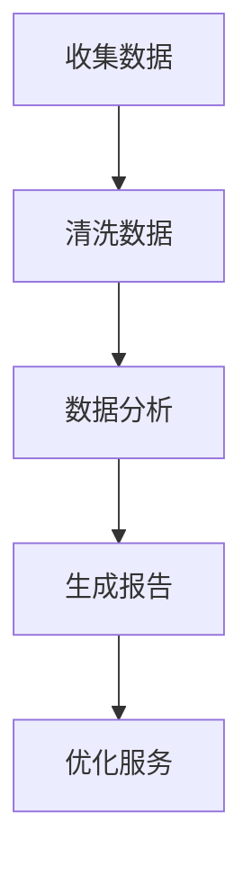
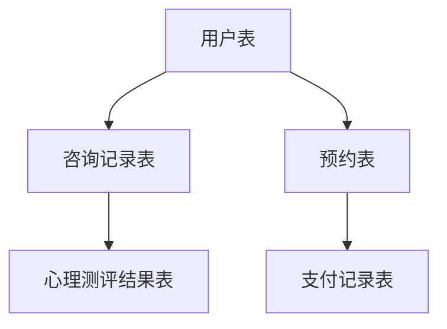

                 

### 文章标题：数字时代的远程情感支持网络：科技辅助下的全球心理互助平台

#### 关键词：
- 数字时代
- 远程情感支持
- 科技辅助
- 全球心理互助平台
- 心理健康

#### 摘要：
本文深入探讨了数字时代背景下，远程情感支持网络的构建与发展。随着科技的进步和心理健康问题的日益凸显，远程情感支持网络作为一种新型的心理健康服务体系，正逐渐成为全球关注的热点。本文从心理健康与数字技术的融合入手，分析了远程情感支持网络的定义、特点、架构以及科技辅助在其中的应用。通过案例分析和未来展望，本文旨在为远程情感支持网络的发展提供理论和实践指导。

### 引言与背景

#### 1.1 引言
在数字化的今天，人们的生活方式和工作模式发生了翻天覆地的变化。远程工作、在线学习、社交媒体等数字化工具的普及，使得人们越来越依赖于虚拟环境进行沟通和互动。然而，这种变化不仅带来了便利，也带来了一系列心理健康问题。焦虑、抑郁、孤独感等心理问题在数字化环境中变得更为普遍。因此，如何通过科技手段提供有效的远程情感支持，成为了一个亟待解决的问题。

#### 1.2 心理健康与数字技术的融合趋势
近年来，心理健康与数字技术的融合呈现出快速增长的趋势。人工智能（AI）、大数据、虚拟现实（VR）等新兴技术为心理健康的监测、诊断和干预提供了新的手段。例如，AI可以通过分析大量数据，发现心理健康问题的早期迹象；大数据可以帮助研究人员更好地理解心理健康的普遍性和特异性；VR可以提供一个安全的环境，让患者能够在虚拟世界中体验放松和疗愈。

#### 1.3 远程情感支持网络的发展背景
全球范围内，心理健康问题的挑战愈发严峻。根据世界卫生组织（WHO）的数据，抑郁症已成为全球第二大疾病负担，预计到2020年将成为全球最大的疾病负担。在这种情况下，传统的面对面心理咨询服务已无法满足所有人的需求。远程情感支持网络的兴起，为那些地理位置偏远、经济条件有限或时间安排紧张的人们提供了一种新的选择。此外，远程支持还可以通过降低沟通障碍，帮助人们更好地处理跨文化心理问题。

#### 1.4 全球心理互助平台的崛起
随着远程情感支持网络的发展，全球心理互助平台也应运而生。这些平台通过整合线上资源，提供一系列心理健康服务，包括心理咨询、心理测评、心理健康教育等。一些知名的全球心理互助平台如BetterHelp、Talkspace等，已经在全球范围内积累了大量用户。这些平台不仅为用户提供了便利，也为心理健康领域的创新提供了广阔的空间。

### 核心概念与架构

#### 2.1 心理健康与数字技术的关系
心理健康是指个体在情感、认知和行为上的整体健康状态。随着科技的进步，数字技术在心理健康中的应用越来越广泛。例如，AI可以通过机器学习算法分析用户的数据，预测心理健康问题的风险；大数据可以帮助研究人员更好地理解心理健康的趋势；VR可以提供一个沉浸式的体验，帮助用户缓解焦虑和抑郁。

#### 2.2 远程情感支持网络的定义与特点
远程情感支持网络是一种利用互联网和数字技术提供的心理健康服务。它通过线上平台连接用户和心理健康专家，提供心理咨询、心理测评、心理健康教育等服务。远程情感支持网络的特点包括：

- **便捷性**：用户可以在任何时间、任何地点获得心理支持。
- **灵活性**：用户可以根据自己的需求选择不同的服务形式，如视频咨询、文本交流、在线课程等。
- **隐私性**：远程支持可以保护用户的隐私，避免面对面咨询可能带来的尴尬。
- **可扩展性**：远程支持网络可以轻松扩展到全球范围，为更多人提供服务。

#### 2.3 全球心理互助平台的架构
全球心理互助平台通常包括以下几个关键组成部分：

- **用户界面**：用户通过浏览器或移动应用访问平台，提交咨询请求或参与活动。
- **后台管理系统**：管理系统负责用户管理、预约管理、咨询记录管理等。
- **数据平台**：数据平台用于存储用户数据、咨询记录、分析报告等。
- **AI算法**：AI算法用于用户数据分析、心理问题预测、推荐服务等。
- **心理专家团队**：心理专家团队为用户提供专业的心理健康服务。

### 科技辅助与平台实现

#### 3.1 人工智能在情感支持中的应用
人工智能在远程情感支持网络中扮演着关键角色。AI可以通过自然语言处理（NLP）技术，理解用户的语言表达，识别情感状态。以下是一个简单的伪代码示例，用于情感识别：

```python
def emotional_recognition(text):
    # 使用预训练的AI模型进行情感分析
    sentiment = ai_model.predict(text)
    return sentiment
```

#### 3.2 数据分析在情感支持中的作用
数据分析是远程情感支持网络的重要组成部分。通过收集和分析用户数据，平台可以更好地理解用户需求，提供个性化的服务。以下是一个简单的数据分析流程：



#### 3.3 远程情感支持平台的技术实现
远程情感支持平台的技术实现包括以下几个方面：

- **前端开发**：使用HTML、CSS、JavaScript等技术构建用户界面。
- **后端开发**：使用Python、Java、Node.js等技术实现服务器端逻辑。
- **数据库设计**：使用MySQL、MongoDB等技术存储用户数据。
- **API开发**：使用RESTful API或GraphQL等技术实现前后端数据交互。

以下是一个简单的数据库设计示例：



### 案例分析与应用实践

#### 4.1 典型全球心理互助平台案例
以下为两个典型的全球心理互助平台案例：

- **BetterHelp**：BetterHelp是一家在线心理健康服务平台，提供包括一对一咨询、小组咨询、文字咨询、视频咨询等多种服务形式。用户可以通过平台与专业心理咨询师进行实时沟通，获得个性化的心理健康服务。
- **Talkspace**：Talkspace与BetterHelp类似，也提供在线心理咨询和心理健康服务。此外，Talkspace还提供特定领域的心理咨询，如婚姻咨询、亲子咨询等。

#### 4.2 平台运营与管理
平台运营与管理是远程情感支持网络成功的关键。以下是一些运营与管理策略：

- **用户参与**：通过推出活动、奖励机制等方式，提高用户参与度。
- **激励机制**：对心理咨询师进行激励，提高服务质量。
- **用户反馈**：定期收集用户反馈，优化服务。
- **可持续发展**：通过多元化收入模式，确保平台可持续发展。

#### 4.3 实际应用案例分析
以下为一个实际应用案例分析：

- **抑郁症在线支持小组**：某平台创建了一个抑郁症在线支持小组，用户可以在小组内分享自己的经历、寻求帮助、互相支持。通过数据分析，平台发现小组内成员的抑郁症状有所缓解，且用户满意度较高。

### 未来展望与挑战

#### 5.1 远程情感支持网络的发展趋势
随着科技的不断进步，远程情感支持网络将朝着更加智能化、个性化和普及化的方向发展。未来，AI、大数据、VR等技术的深度融合，将为远程情感支持网络带来更多的创新机会。

#### 5.2 挑战与伦理问题
尽管远程情感支持网络具有诸多优势，但同时也面临一些挑战。以下为几个主要挑战：

- **隐私保护**：在远程支持过程中，如何确保用户隐私和安全是一个重要问题。
- **数据安全**：平台需要采取有效的数据加密和安全措施，防止数据泄露。
- **跨文化交流**：不同文化背景的用户可能对心理支持有不同的需求和期望，如何提供多样化和文化敏感的服务是一个挑战。

#### 5.3 发展建议与政策建议
为促进远程情感支持网络的发展，以下为几条建议：

- **政策支持**：政府应出台相关政策，支持远程情感支持网络的发展。
- **技术研发**：加大对AI、大数据、VR等关键技术的研发投入。
- **教育培训**：加强心理咨询师的培训，提高其在线咨询能力。
- **行业规范**：建立健全行业规范，确保远程情感支持服务的质量和安全。

### 附录：参考资料与拓展阅读

#### A.1 相关书籍推荐
- 《人工智能：一种现代方法》
- 《大数据时代：生活、工作与思维的大变革》
- 《虚拟现实：技术与未来》

#### A.2 学术文章与报告
- “远程心理健康服务的现状与挑战”
- “人工智能在心理健康领域的应用研究”
- “心理健康与数字技术的融合：趋势与展望”

#### A.3 网络资源与工具
- “BetterHelp官方网站”
- “Talkspace官方网站”
- “Python机器学习库：scikit-learn”

### 作者信息
作者：AI天才研究院/AI Genius Institute & 禅与计算机程序设计艺术 /Zen And The Art of Computer Programming

