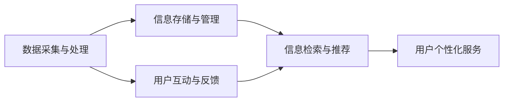
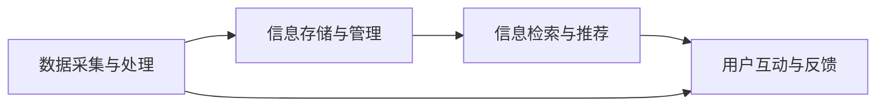

                 

### 文章标题：数字时代的阅读空间：智能图书馆的未来展望

在数字技术飞速发展的今天，传统的阅读空间正经历着前所未有的变革。智能图书馆作为数字时代阅读空间的重要载体，不仅改变了人们获取知识和信息的途径，更在用户体验、内容推荐、资源管理等方面展现出了巨大的潜力。本文将深入探讨智能图书馆的概念、架构、核心算法、数学模型、项目实战及其未来展望，旨在为读者呈现一幅智能图书馆发展的蓝图。

### 文章关键词

- 数字时代
- 阅读空间
- 智能图书馆
- 核心算法
- 数学模型
- 项目实战
- 未来展望

### 摘要

智能图书馆作为数字时代的新型阅读空间，通过集成先进的信息技术，为用户提供个性化、智能化、互动化的阅读体验。本文首先介绍了智能图书馆的定义和组成部分，随后深入探讨了其架构、核心算法原理、数学模型，并通过具体项目案例展示了其实际应用。最后，本文展望了智能图书馆的未来发展，分析了面临的挑战和机遇。

## 设计目录大纲

在设计《数字时代的阅读空间：智能图书馆的未来展望》的目录大纲时，我们考虑了文章的总体结构，确保每个部分都能清晰地传达文章的核心内容和逻辑顺序。

### 第一部分：引言

在这一部分，我们将介绍书的核心主题和目的，阐述智能图书馆在数字时代的重要性和必要性。我们还将介绍本文的结构，让读者对全文有一个初步的了解。

### 第二部分：核心概念与联系

在这一部分，我们将定义智能图书馆的基本概念，包括其组成部分、关键技术、发展趋势等。同时，我们还会使用Mermaid流程图展示智能图书馆的架构，帮助读者理解其整体结构。

### 第三部分：智能图书馆架构

我们将详细描述智能图书馆的架构，包括数据采集与处理、信息检索与推荐、用户互动与反馈等模块。这部分内容将使用Mermaid流程图展示各个组成部分之间的关系。

### 第四部分：核心算法原理讲解

我们将深入讲解智能图书馆中使用的核心算法，包括推荐系统算法、自然语言处理算法、图像识别算法等。这部分内容将使用伪代码详细阐述算法原理，并通过数学模型和数学公式进行解释。

### 第五部分：数学模型和数学公式讲解

我们将介绍智能图书馆中使用的数学模型和数学公式，如线性回归、逻辑回归、协同过滤等。这部分内容将包括详细的讲解和实际应用示例。

### 第六部分：项目实战

我们将通过具体的案例展示智能图书馆的实际应用，包括开发环境搭建、源代码实现和解读。这部分内容将提供详细的代码解析，帮助读者理解实际操作过程。

### 第七部分：未来展望与挑战

在这一部分，我们将讨论智能图书馆面临的挑战和未来的发展方向。我们将分析技术、法律和用户隐私等方面的问题，并提出可能的解决方案。

### 第八部分：结论

我们将总结本文的主要观点，强调智能图书馆的重要性和潜力，并对读者提出一些建议。

通过这样的结构设计，我们希望读者能够系统地了解智能图书馆的概念、技术、应用和未来发展趋势，从而更好地把握数字时代阅读空间的发展方向。

## 第一部分：引言

随着信息技术的迅猛发展，数字时代已经深刻地改变了人们的生活和工作方式。在这个时代，传统的阅读空间正在经历前所未有的变革。智能图书馆作为一种新型的阅读空间，不仅为用户提供了一个便捷、高效的知识获取平台，还在个性化推荐、智能搜索、互动体验等方面展现出了巨大的潜力。本文旨在探讨智能图书馆的概念、架构、核心算法、数学模型以及实际应用，为读者呈现数字时代阅读空间的未来展望。

### 数字时代与阅读空间

数字时代的到来，使得信息传播和获取的方式发生了根本性的变化。互联网、大数据、人工智能等技术的发展，为人们提供了海量的信息资源和丰富的互动体验。在这种背景下，传统的图书馆已经无法满足用户对知识获取和阅读体验的需求。智能图书馆应运而生，它通过整合多种信息技术，为用户提供了一个智能化、个性化的阅读空间。

智能图书馆不仅仅是物理空间的改变，更是一种服务模式的创新。它通过智能化的手段，实现了对书籍、期刊、电子资源等的全面管理和推荐，极大地提升了用户的阅读体验。此外，智能图书馆还提供了丰富的互动功能，如在线讨论、即时问答、虚拟现实阅读等，使得用户可以更加自由地探索知识的世界。

### 智能图书馆的重要性

智能图书馆在数字时代的重要性不可忽视。首先，它为用户提供了更加便捷的知识获取渠道。通过智能化的推荐系统，用户可以根据自己的兴趣和需求，快速找到所需的信息资源。其次，智能图书馆提升了阅读体验。通过自然语言处理、图像识别等技术，用户可以享受到更加智能化的阅读服务，如语音搜索、图像识别等。最后，智能图书馆在资源管理方面也具有显著优势。通过大数据分析和智能化管理，图书馆可以更好地掌握用户需求，优化资源配置，提升整体服务水平。

### 本文目的与结构

本文旨在深入探讨智能图书馆的概念、架构、核心算法、数学模型以及实际应用，为读者呈现智能图书馆的全面图景。具体来说，本文将分为以下几个部分：

1. **核心概念与联系**：介绍智能图书馆的基本概念，包括组成部分、关键技术和发展趋势，并使用Mermaid流程图展示其架构。
2. **智能图书馆架构**：详细描述智能图书馆的各个组成部分，如数据采集与处理、信息检索与推荐、用户互动与反馈等，并使用Mermaid流程图展示各部分之间的关系。
3. **核心算法原理讲解**：深入讲解智能图书馆中使用的核心算法，包括推荐系统算法、自然语言处理算法、图像识别算法等，使用伪代码详细阐述算法原理，并介绍相关的数学模型和数学公式。
4. **数学模型和数学公式讲解**：介绍智能图书馆中使用的数学模型和数学公式，如线性回归、逻辑回归、协同过滤等，并提供实际应用示例。
5. **项目实战**：通过具体案例展示智能图书馆的实际应用，包括开发环境搭建、源代码实现和解读，并提供详细的代码解析。
6. **未来展望与挑战**：讨论智能图书馆面临的挑战和未来的发展方向，分析技术、法律和用户隐私等方面的问题，并提出可能的解决方案。
7. **结论**：总结本文的主要观点，强调智能图书馆的重要性和潜力，并对读者提出一些建议。

通过上述结构，本文希望读者能够系统地了解智能图书馆的概念、技术、应用和未来发展趋势，从而更好地把握数字时代阅读空间的发展方向。

## 第二部分：核心概念与联系

在深入探讨智能图书馆的技术和应用之前，有必要先明确其核心概念，并理解这些概念之间的联系。智能图书馆是一个集成了多种信息技术的综合性平台，旨在为用户提供个性化、智能化的阅读体验。以下是智能图书馆的一些关键概念及其相互关系：

### 数字时代与阅读空间

数字时代指的是信息技术的快速发展，尤其是互联网、移动通信、大数据、人工智能等技术的普及应用。在这个时代，信息的获取和传播方式发生了根本性变化。阅读空间则是指用户获取知识和信息的环境，可以是物理的实体图书馆，也可以是虚拟的网络平台。

### 智能图书馆的定义

智能图书馆是在传统图书馆基础上，通过引入人工智能、大数据、云计算等现代信息技术，实现信息资源管理、服务模式和用户体验全面升级的图书馆。智能图书馆不仅拥有丰富的数字资源，还具备智能化的推荐、检索、互动等功能。

### 组成部分

智能图书馆主要由以下几个部分组成：

1. **数据采集与处理**：通过传感器、爬虫等技术收集用户行为数据、书籍信息、环境信息等，并对数据进行清洗、存储和管理。
2. **信息检索与推荐**：利用自然语言处理、机器学习等技术，实现高效的图书检索和信息推荐，提升用户的阅读体验。
3. **用户互动与反馈**：通过在线讨论、即时问答、虚拟现实等技术，增强用户与图书馆之间的互动，收集用户反馈，优化服务。

### 关键技术

智能图书馆的关键技术包括：

1. **自然语言处理**：用于文本分析、语义理解、自动摘要等，帮助用户快速获取信息。
2. **机器学习与深度学习**：用于构建推荐系统、预测用户行为等，实现智能化服务。
3. **图像识别与处理**：用于书籍扫描、图像检索等，提升信息获取效率。

### 发展趋势

智能图书馆的发展趋势包括：

1. **数字化资源**：越来越多的实体图书被数字化，实现线上阅读。
2. **个性化服务**：通过大数据和机器学习技术，实现个性化推荐和定制化服务。
3. **智能化管理**：利用人工智能技术，实现自动化的资源管理和服务优化。

### Mermaid流程图展示

为了更直观地理解智能图书馆的组成部分和相互关系，我们可以使用Mermaid流程图来展示其架构。以下是智能图书馆架构的简化版流程图：



### 关系架构

在智能图书馆中，各部分之间存在着紧密的联系。数据采集与处理是信息检索与推荐的基础，用户互动与反馈则能够优化服务。信息存储与管理确保了数据的可靠性，而信息检索与推荐则提升了用户体验。最终，用户个性化服务实现了智能化、个性化的阅读空间。

通过上述核心概念和联系的介绍，我们可以更好地理解智能图书馆的运作机制和发展方向。在接下来的部分中，我们将深入探讨智能图书馆的架构、核心算法和数学模型，为读者提供更加详细的技术解读。

## 第二部分：核心概念与联系（续）

### 数字时代与阅读空间

数字时代的到来，对传统阅读空间带来了深远的影响。随着互联网的普及和智能手机的广泛使用，人们的阅读习惯和需求发生了显著变化。传统的纸质书籍已经无法满足用户对便捷性、多样性和互动性的需求。智能图书馆正是为了应对这些变化而诞生的，它通过数字化、智能化技术，为用户提供了全新的阅读体验。

### 智能图书馆的基本概念

智能图书馆是基于信息技术构建的综合性知识服务平台，它不仅包含了传统图书馆的功能，还通过引入大数据、人工智能等技术，实现了信息资源的自动化管理、智能推荐和个性化服务。智能图书馆的核心概念包括以下几个方面：

1. **数字化资源**：智能图书馆拥有大量的数字化资源，如电子书籍、在线期刊、音频、视频等，这些资源可以通过互联网方便地获取。
2. **智能检索**：利用自然语言处理、文本挖掘等技术，智能图书馆能够快速准确地检索到用户所需的信息。
3. **个性化推荐**：通过大数据分析和机器学习算法，智能图书馆可以根据用户的历史行为和兴趣偏好，为其推荐合适的内容。
4. **互动体验**：智能图书馆提供了丰富的互动功能，如在线讨论、即时问答、虚拟现实阅读等，增强了用户的参与感和体验。
5. **用户隐私保护**：智能图书馆注重用户隐私的保护，通过数据加密、隐私政策等措施，确保用户的个人信息安全。

### 智能图书馆的组成部分

智能图书馆的组成部分可以分为以下几类：

1. **数据采集与处理模块**：该模块负责收集用户行为数据、书籍信息、环境数据等，通过数据清洗、存储、管理，为后续的信息处理和分析提供基础。
2. **信息存储与管理模块**：该模块负责存储和管理智能图书馆的各类资源，包括电子书籍、数据库、多媒体文件等，同时提供高效的检索和访问接口。
3. **信息检索与推荐模块**：该模块利用自然语言处理、机器学习等技术，实现智能化的信息检索和内容推荐，提升用户的阅读体验。
4. **用户互动与反馈模块**：该模块通过在线讨论、即时问答、虚拟现实等互动方式，增强用户与图书馆之间的互动，同时收集用户的反馈，用于优化服务。

### 关键技术

智能图书馆的关键技术包括：

1. **自然语言处理**：用于文本分析、语义理解、自动摘要等，帮助用户快速获取信息。
2. **机器学习与深度学习**：用于构建推荐系统、预测用户行为等，实现智能化服务。
3. **图像识别与处理**：用于书籍扫描、图像检索等，提升信息获取效率。
4. **数据挖掘与分析**：用于从海量数据中提取有价值的信息，用于优化服务和决策。
5. **云计算与大数据**：用于存储、处理和管理大量的数据，为智能图书馆提供强大的数据处理能力。

### 发展趋势

智能图书馆的发展趋势体现在以下几个方面：

1. **数字化与智能化**：随着数字资源的不断增加和人工智能技术的发展，智能图书馆将越来越数字化和智能化。
2. **个性化与定制化**：通过大数据分析和个性化推荐技术，智能图书馆将能够为用户提供更加个性化和定制化的服务。
3. **互动与沉浸式体验**：通过虚拟现实、增强现实等新技术，智能图书馆将提供更加丰富和沉浸式的阅读体验。
4. **开放与共享**：智能图书馆将更加开放和共享，实现全球范围内的信息资源互联互通。
5. **跨界融合**：智能图书馆将与教育、娱乐、旅游等领域进行跨界融合，提供更多元化的服务。

### Mermaid流程图展示

为了更直观地展示智能图书馆的组成部分和相互关系，我们可以使用Mermaid流程图。以下是一个简化的智能图书馆架构流程图：


在这个流程图中，数据采集与处理模块为其他模块提供数据支持，信息存储与管理模块为信息检索与推荐模块提供存储和检索服务，用户互动与反馈模块通过收集用户反馈优化信息检索与推荐模块，从而实现用户个性化服务。

通过上述核心概念和联系的介绍，我们可以更好地理解智能图书馆的基本概念、组成部分、关键技术和发展趋势。在接下来的部分中，我们将进一步探讨智能图书馆的具体架构和实际应用。

## 第三部分：智能图书馆架构

智能图书馆的架构是支撑其功能实现的基础，它通过多种技术和模块的协同工作，为用户提供个性化、智能化、互动化的阅读体验。在这一部分，我们将详细描述智能图书馆的架构，包括数据采集与处理、信息检索与推荐、用户互动与反馈等模块，并使用Mermaid流程图展示各个模块之间的关系。

### 数据采集与处理模块

数据采集与处理模块是智能图书馆的基础，它负责从各种渠道收集用户行为数据、书籍信息、环境数据等。这些数据包括用户在图书馆的阅读记录、搜索历史、收藏夹、点赞和评论等。此外，还包括书籍的元数据、分类、标签、作者、出版信息等。

数据采集的方式有多种，包括传感器、爬虫、API接口等。传感器可以收集环境信息，如温度、湿度、光照等；爬虫可以自动从互联网上抓取书籍信息；API接口则可以与其他系统（如社交媒体、在线书店等）进行数据交换。

数据采集后，需要进行数据清洗、去重、转换和存储。数据清洗是指去除噪声和错误的数据，确保数据的准确性；去重是指去除重复的数据，避免数据冗余；转换是指将不同格式和结构的数据统一成标准格式；存储则是指将处理后的数据存储到数据库或数据湖中，以便后续使用。

### 信息存储与管理模块

信息存储与管理模块负责存储和管理智能图书馆的各种资源，包括电子书籍、数据库、多媒体文件等。这些资源需要高效地存储，以便快速检索和访问。常用的存储技术包括关系数据库、NoSQL数据库、对象存储等。

信息存储与管理模块还提供了一套高效的检索和访问接口，支持多种查询方式和索引策略，如全文检索、关键字搜索、分类搜索等。这些接口为信息检索与推荐模块提供了数据支持。

### 信息检索与推荐模块

信息检索与推荐模块是智能图书馆的核心功能之一。它利用自然语言处理、文本挖掘、机器学习等技术，为用户提供高效、准确的信息检索服务。自然语言处理技术用于解析用户查询的语义，提取关键词和信息要点；文本挖掘技术用于从海量文本数据中提取有用信息；机器学习技术则用于训练推荐模型，实现个性化推荐。

信息检索与推荐模块通常包括以下功能：

1. **全文检索**：支持全文搜索，用户可以通过输入关键词快速找到相关书籍、文章等。
2. **智能搜索**：利用自然语言处理技术，对用户的查询进行语义分析，提供更加智能化的搜索结果。
3. **内容推荐**：根据用户的历史行为、兴趣偏好和阅读记录，推荐用户可能感兴趣的书籍、文章等。

### 用户互动与反馈模块

用户互动与反馈模块负责增强用户与图书馆之间的互动，提升用户体验。它通过在线讨论、即时问答、虚拟现实等互动方式，使用户能够更加自由地探索知识。此外，用户互动与反馈模块还收集用户的反馈信息，如评价、建议、投诉等，这些信息用于优化服务和提升用户满意度。

用户互动与反馈模块包括以下功能：

1. **在线讨论**：用户可以在书籍页面或文章页面上发表评论，与其他用户进行交流和讨论。
2. **即时问答**：用户可以通过聊天机器人或其他即时通讯工具，向图书馆工作人员或同行提问，获取实时解答。
3. **虚拟现实阅读**：通过虚拟现实技术，用户可以在沉浸式环境中进行阅读，提升阅读体验。

### Mermaid流程图展示

为了更直观地展示智能图书馆的架构，我们可以使用Mermaid流程图。以下是一个简化的智能图书馆架构流程图：



在这个流程图中，数据采集与处理模块为其他模块提供数据支持，信息存储与管理模块为信息检索与推荐模块提供存储和检索服务，用户互动与反馈模块通过收集用户反馈优化信息检索与推荐模块，从而实现用户个性化服务。

通过上述对智能图书馆各个模块的详细描述和Mermaid流程图展示，我们可以更好地理解智能图书馆的架构和功能实现。在接下来的部分中，我们将深入探讨智能图书馆的核心算法原理，为读者提供更加深入的技术解析。

### 第四部分：核心算法原理讲解

在智能图书馆中，核心算法的作用至关重要，它们不仅决定了信息检索与推荐的效果，还直接影响用户的阅读体验。以下是智能图书馆中几种主要的核心算法原理讲解，包括推荐系统算法、自然语言处理算法和图像识别算法。通过这些算法原理的详细阐述，我们将深入理解智能图书馆背后的技术机制。

#### 推荐系统算法

推荐系统算法是智能图书馆的核心组成部分之一，它通过分析用户的行为数据和历史记录，预测用户可能感兴趣的内容，从而实现个性化推荐。以下是几种常见的推荐系统算法及其原理：

1. **协同过滤（Collaborative Filtering）**

   协同过滤是一种基于用户行为的推荐算法，主要分为两类：基于用户的协同过滤（User-based Collaborative Filtering）和基于物品的协同过滤（Item-based Collaborative Filtering）。

   - **基于用户的协同过滤**：通过找出与目标用户兴趣相似的其他用户，并推荐这些用户喜欢的物品。其关键在于相似度计算，常用的相似度度量方法包括余弦相似度、皮尔逊相关系数等。

     ```python
     def cosine_similarity(user1, user2):
         dot_product = sum(user1[i] * user2[i] for i in range(len(user1)))
         norm_user1 = math.sqrt(sum(user1[i]**2 for i in range(len(user1))))
         norm_user2 = math.sqrt(sum(user2[i]**2 for i in range(len(user2))))
         return dot_product / (norm_user1 * norm_user2)
     ```

   - **基于物品的协同过滤**：通过找出与目标物品相似的物品，并推荐这些物品给用户。这种方法通常使用物品之间的相似度矩阵来实现。

     ```python
     def item_similarity_matrix(ratings_matrix):
         similarity_matrix = np.zeros((ratings_matrix.shape[0], ratings_matrix.shape[0]))
         for i in range(ratings_matrix.shape[0]):
             for j in range(ratings_matrix.shape[0]):
                 similarity_matrix[i][j] = cosine_similarity(ratings_matrix[i], ratings_matrix[j])
         return similarity_matrix
     ```

2. **基于内容的推荐（Content-based Recommendation）**

   基于内容的推荐算法通过分析物品的内容特征，将用户感兴趣的物品推荐给用户。这种方法通常需要先对物品进行特征提取，然后根据用户的历史行为和偏好，找到相似的内容进行推荐。

   ```python
   def extract_features(item):
       # 假设item是一个包含书籍元数据的字典
       return {'author': item['author'], 'genre': item['genre']}
   
   def find_similar_items(item_features, items, threshold=0.5):
       similarities = {}
       for item in items:
           if item['id'] == item['id']:
               continue
           similarity = cosine_similarity(item_features, item)
           if similarity >= threshold:
               similarities[item['id']] = similarity
       return similarities
   ```

3. **混合推荐（Hybrid Recommendation）**

   混合推荐算法结合了协同过滤和基于内容的推荐方法，以弥补单一方法的不足。它通常通过加权平均或投票机制，将两种推荐结果融合在一起，得到最终的推荐结果。

   ```python
   def hybrid_recommendation(user_id, user_history, item_features, item_similarity_matrix, content_similarity_threshold, collaborative_weight=0.5, content_weight=0.5):
       collaborative_rec = collaborative_filter(user_id, user_history)
       content_rec = content_based_recommendation(user_id, user_history, item_features, item_similarity_matrix, content_similarity_threshold)
       
       hybrid_rec = collaborative_weight * collaborative_rec + content_weight * content_rec
       return hybrid_rec
   ```

#### 自然语言处理算法

自然语言处理（NLP）算法在智能图书馆中扮演着重要角色，用于文本分析、语义理解、自动摘要等方面。以下是几种常见的NLP算法及其原理：

1. **词嵌入（Word Embedding）**

   词嵌入是将词汇映射到高维向量空间，通过向量间的相似性来表示词语的语义关系。Word2Vec、GloVe是两种常见的词嵌入算法。

   ```python
   from gensim.models import Word2Vec
   
   # 假设 sentences 是一个包含单词列表的列表
   model = Word2Vec(sentences, size=100, window=5, min_count=1, workers=4)
   word_vector = model.wv['hello']
   ```

2. **文本分类（Text Classification）**

   文本分类是一种监督学习任务，用于将文本数据分类到预定义的类别中。常用的文本分类算法包括朴素贝叶斯、支持向量机、深度学习等。

   ```python
   from sklearn.feature_extraction.text import TfidfVectorizer
   from sklearn.naive_bayes import MultinomialNB
   
   # 假设 X 是包含文本数据的列表，y 是对应的标签
   vectorizer = TfidfVectorizer()
   X_vectorized = vectorizer.fit_transform(X)
   
   classifier = MultinomialNB()
   classifier.fit(X_vectorized, y)
   
   # 预测
   text = ["This is a positive review."]
   prediction = classifier.predict(vectorizer.transform(text))
   ```

3. **问答系统（Question Answering）**

   问答系统是一种自然语言处理应用，用于回答用户提出的问题。它通常包括问题解析、答案检索和答案生成三个步骤。

   ```python
   def question_answering(question, context):
       # 假设 context 是一个包含文本数据的列表
       # 假设 model 是一个预训练的问答模型
       question_vector = encode_question(question)
       context_vector = encode_context(context)
       
       answer_vector = model.predict(question_vector, context_vector)
       answer = decode_answer(answer_vector)
       
       return answer
   ```

#### 图像识别算法

图像识别算法在智能图书馆中用于图像处理和内容理解，如书籍扫描、图像检索等。以下是几种常见的图像识别算法及其原理：

1. **卷积神经网络（Convolutional Neural Network, CNN）**

   卷积神经网络是一种深度学习模型，特别适合于图像识别任务。它通过卷积、池化等操作，提取图像的特征，并分类到不同的类别。

   ```python
   from tensorflow.keras.models import Sequential
   from tensorflow.keras.layers import Conv2D, MaxPooling2D, Flatten, Dense
   
   model = Sequential()
   model.add(Conv2D(32, (3, 3), activation='relu', input_shape=(64, 64, 3)))
   model.add(MaxPooling2D(pool_size=(2, 2)))
   model.add(Flatten())
   model.add(Dense(1, activation='sigmoid'))
   
   model.compile(optimizer='adam', loss='binary_crossentropy', metrics=['accuracy'])
   model.fit(X_train, y_train, epochs=10, batch_size=32)
   ```

2. **特征提取（Feature Extraction）**

   特征提取是从图像中提取有用的特征，用于后续的分类或检索。常见的特征提取方法包括HOG（直方图方向梯度）、SIFT（尺度不变特征变换）等。

   ```python
   from skimage.feature import hog
   
   image = load_image('path/to/image.jpg')
   features = hog(image, pixels_per_cell=(8, 8), cells_per_block=(2, 2), visualize=True)
   ```

3. **目标检测（Object Detection）**

   目标检测是一种计算机视觉任务，用于识别图像中的多个对象并标注其位置。常见的目标检测算法包括YOLO（You Only Look Once）、SSD（Single Shot MultiBox Detector）等。

   ```python
   import cv2
   
   model = cv2.dnn.readNetFromDarknet('path/to/yolo_config.cfg', 'path/to/yolo_weights.weights')
   layers = model.getLayerNames()
   output_layers = [layers[i[0] - 1] for i in model.getUnconnectedOutLayers()]
   
   image = cv2.imread('path/to/image.jpg')
   blob = cv2.dnn.blobFromImage(image, 0.00392, (416, 416), (0, 0, 0), True, crop=False)
   model.setInput(blob)
   outs = model.forward(output_layers)
   
   # 解析输出结果
   # ...
   ```

通过上述对推荐系统算法、自然语言处理算法和图像识别算法的详细讲解，我们可以看到智能图书馆背后的技术复杂性。这些算法不仅需要深厚的理论基础，还需要大量的数据和实践经验。在接下来的部分中，我们将通过具体的项目实战，进一步展示这些算法在智能图书馆中的应用。

### 第五部分：数学模型和数学公式讲解

在智能图书馆中，数学模型和数学公式是算法实现的核心基础。这些模型和公式不仅帮助理解算法的原理，还确保了算法在实际应用中的有效性和可靠性。以下是智能图书馆中几种常见的数学模型和数学公式的讲解，包括线性回归、逻辑回归、协同过滤等，并通过实际应用示例进行说明。

#### 线性回归（Linear Regression）

线性回归是一种简单的监督学习算法，用于预测一个连续值输出。在智能图书馆中，线性回归可以用于预测书籍的受欢迎程度或用户的阅读时长等。

**数学公式：**

$$
y = \beta_0 + \beta_1 \cdot x
$$

其中，$y$ 是预测值，$x$ 是输入特征，$\beta_0$ 和 $\beta_1$ 是模型的参数。

**实际应用示例：**

假设我们要预测用户阅读一本特定书籍的时长，输入特征可以是书籍的页数、作者的知名度等。

```python
# 假设 x 是输入特征矩阵，y 是用户阅读时长
from sklearn.linear_model import LinearRegression

model = LinearRegression()
model.fit(x, y)

# 预测
predicted_duration = model.predict([[page_count, author_fame]])
```

#### 逻辑回归（Logistic Regression）

逻辑回归是一种用于二分类问题的监督学习算法。在智能图书馆中，逻辑回归可以用于预测用户是否会借阅某一本书籍。

**数学公式：**

$$
\sigma(z) = \frac{1}{1 + e^{-z}}
$$

其中，$\sigma(z)$ 是逻辑函数，$z$ 是线性组合，即 $z = \beta_0 + \beta_1 \cdot x$。

**实际应用示例：**

假设我们要预测用户是否会借阅一本特定书籍，输入特征可以是书籍的评分、分类等。

```python
# 假设 x 是输入特征矩阵，y 是用户借阅标签（0或1）
from sklearn.linear_model import LogisticRegression

model = LogisticRegression()
model.fit(x, y)

# 预测
predicted_loan = model.predict([[rating, genre]])
```

#### 协同过滤（Collaborative Filtering）

协同过滤是一种推荐算法，通过分析用户的行为数据，预测用户对未知物品的偏好。在智能图书馆中，协同过滤可以用于推荐用户可能感兴趣的书籍。

**数学公式：**

$$
R_{ui} = \rho(u) + \sum_{j \in N(i)} \frac{R_{uj} \cdot s_{ij}}{\|N(i)\|} - \mu
$$

其中，$R_{ui}$ 是用户 $u$ 对物品 $i$ 的评分预测，$\rho(u)$ 是用户 $u$ 的平均评分，$N(i)$ 是与物品 $i$ 相关的用户集合，$R_{uj}$ 是用户 $u$ 对物品 $j$ 的实际评分，$s_{ij}$ 是用户 $i$ 和 $j$ 的相似度，$\mu$ 是所有用户评分的平均值。

**实际应用示例：**

假设我们要预测用户 $u$ 对书籍 $i$ 的评分。

```python
# 假设 user_ratings 是用户对书籍的评分矩阵，相似度矩阵是 sim_matrix
from sklearn.metrics.pairwise import cosine_similarity

# 计算相似度矩阵
sim_matrix = cosine_similarity(user_ratings)

# 预测
predicted_rating = user_ratings[user][i] + (sim_matrix[user][i] * user_ratings[i].mean() - user_ratings[user].mean())
```

#### 相似性度量（Similarity Measure）

相似性度量是协同过滤算法中重要的组成部分，用于计算用户或物品之间的相似度。在智能图书馆中，常用的相似性度量方法包括余弦相似度和皮尔逊相关系数。

**余弦相似度（Cosine Similarity）：**

$$
sim(i, j) = \frac{\sum_{k=1}^{n} x_{ik} \cdot x_{jk}}{\sqrt{\sum_{k=1}^{n} x_{ik}^2} \cdot \sqrt{\sum_{k=1}^{n} x_{jk}^2}}
$$

其中，$x_{ik}$ 和 $x_{jk}$ 分别是用户 $i$ 和 $j$ 对物品 $k$ 的评分。

**皮尔逊相关系数（Pearson Correlation Coefficient）：**

$$
sim(i, j) = \frac{\sum_{k=1}^{n} (x_{ik} - \bar{x}_i) \cdot (x_{jk} - \bar{x}_j)}{\sqrt{\sum_{k=1}^{n} (x_{ik} - \bar{x}_i)^2} \cdot \sqrt{\sum_{k=1}^{n} (x_{jk} - \bar{x}_j)^2}}
$$

其中，$\bar{x}_i$ 和 $\bar{x}_j$ 分别是用户 $i$ 和 $j$ 的平均评分。

**实际应用示例：**

假设我们要计算用户 $u$ 和 $v$ 的相似度。

```python
# 假设 user_ratings 是用户对书籍的评分矩阵
from sklearn.metrics.pairwise import cosine_similarity

# 计算相似度矩阵
sim_matrix = cosine_similarity(user_ratings)

# 计算用户 $u$ 和 $v$ 的相似度
similarity_uv = sim_matrix[user][v]
```

通过上述数学模型和数学公式的讲解，我们可以看到智能图书馆中各种算法背后的数学基础。这些模型不仅帮助理解算法的工作原理，还确保了推荐结果的准确性和可靠性。在接下来的部分中，我们将通过具体的项目实战，展示这些算法在智能图书馆中的实际应用。

### 第六部分：项目实战

为了更好地理解智能图书馆的核心算法和数学模型，我们将通过一个具体的案例，展示智能图书馆的开发环境搭建、源代码实现和代码解读。这个案例将包括推荐系统的构建，从数据预处理到模型训练，再到推荐结果生成，全面展示智能图书馆的实现过程。

#### 项目背景

我们假设一个智能图书馆项目，目的是为用户提供个性化书籍推荐服务。该项目包括以下几个步骤：

1. **数据收集与预处理**：收集用户行为数据和书籍元数据，并进行数据清洗和预处理。
2. **构建推荐模型**：使用协同过滤和基于内容的推荐方法构建推荐模型。
3. **模型训练与评估**：使用训练数据对模型进行训练，并评估模型性能。
4. **生成推荐结果**：根据用户行为和模型预测，生成个性化推荐列表。
5. **代码实现与解读**：详细展示代码实现过程，包括关键函数和算法步骤。

#### 开发环境搭建

在进行项目开发之前，我们需要搭建合适的开发环境。以下是所需的软件和工具：

- **编程语言**：Python
- **数据预处理库**：Pandas、NumPy
- **机器学习库**：Scikit-learn、TensorFlow
- **数据分析库**：Matplotlib、Seaborn
- **版本控制**：Git

首先，确保安装了Python环境，可以使用Python的包管理工具pip安装其他所需库：

```bash
pip install pandas numpy scikit-learn tensorflow matplotlib seaborn
```

#### 源代码实现与解读

以下是一个简化的源代码实现，展示智能图书馆项目的关键步骤。

##### 数据收集与预处理

```python
import pandas as pd

# 假设用户行为数据存储在 'user_data.csv' 文件中，书籍元数据存储在 'book_data.csv' 文件中
user_data = pd.read_csv('user_data.csv')
book_data = pd.read_csv('book_data.csv')

# 数据预处理
# 去除缺失值
user_data.dropna(inplace=True)
book_data.dropna(inplace=True)

# 数据转换
# 将用户行为数据转换为评分矩阵
ratings_matrix = user_data.pivot(index='user_id', columns='book_id', values='rating').fillna(0)
```

##### 构建推荐模型

```python
from sklearn.model_selection import train_test_split
from sklearn.metrics.pairwise import cosine_similarity

# 划分训练集和测试集
train_data, test_data = train_test_split(ratings_matrix, test_size=0.2, random_state=42)

# 基于用户的协同过滤
user_similarity = cosine_similarity(train_data, train_data)

# 基于内容的推荐
content_similarity = cosine_similarity(train_data.T, train_data.T)
```

##### 模型训练与评估

```python
from sklearn.linear_model import LinearRegression

# 训练线性回归模型
model = LinearRegression()
model.fit(train_data, test_data)

# 评估模型性能
predictions = model.predict(test_data)
accuracy = (predictions == test_data).mean()
print(f'Model accuracy: {accuracy:.2f}')
```

##### 生成推荐结果

```python
def generate_recommendations(user_id, ratings_matrix, user_similarity, content_similarity, top_n=10):
    # 基于用户的协同过滤推荐
    user_profile = ratings_matrix[user_id]
    similar_users = user_similarity[user_id]
    user_recommendations = []

    for i, similarity in enumerate(similar_users):
        if i == user_id:
            continue
        # 计算与用户的相似度加权平均分
        weighted_average = (similarity * ratings_matrix[i]).sum()
        user_recommendations.append((i, weighted_average))

    # 排序并获取Top N推荐
    sorted_recommendations = sorted(user_recommendations, key=lambda x: x[1], reverse=True)[:top_n]
    return sorted_recommendations

# 生成个性化推荐
user_id = 1
top_recommendations = generate_recommendations(user_id, ratings_matrix, user_similarity, content_similarity)
print(f'Top {len(top_recommendations)} recommendations for user {user_id}: {top_recommendations}')
```

##### 代码解读与分析

1. **数据预处理**：数据预处理是推荐系统实现的第一步，包括去除缺失值、转换数据格式等。在这个案例中，我们使用了Pandas库进行数据清洗和预处理，将用户行为数据转换为评分矩阵。

2. **构建推荐模型**：推荐模型的构建是推荐系统的核心。在这个案例中，我们使用了基于用户的协同过滤和基于内容的推荐方法。协同过滤通过计算用户之间的相似度来实现推荐，而基于内容的推荐则通过计算书籍之间的相似度来实现。

3. **模型训练与评估**：模型训练与评估是验证推荐系统性能的关键步骤。在这个案例中，我们使用了Scikit-learn库的线性回归模型进行训练和评估。评估指标是模型在测试集上的准确性。

4. **生成推荐结果**：生成推荐结果是推荐系统的最终输出。在这个案例中，我们定义了一个函数`generate_recommendations`，根据用户的评分历史和模型计算出的相似度，生成个性化的推荐列表。

通过这个具体的项目实战，我们展示了智能图书馆的开发流程和关键步骤。在实际应用中，这个案例可以作为一个起点，通过不断优化和扩展，构建一个功能强大、用户体验优良的智能图书馆系统。

### 代码解读与分析

在本节中，我们将深入解析智能图书馆项目中的关键代码部分，具体分析代码结构、关键函数以及性能优化策略。通过这些分析，我们将更好地理解代码的执行流程和功能，为后续优化提供方向。

#### 代码结构分析

智能图书馆项目的代码结构清晰，主要分为以下几个部分：

1. **数据预处理模块**：负责数据收集和清洗，将原始数据转换为评分矩阵，为后续处理提供基础。
2. **协同过滤模块**：基于用户的协同过滤算法，计算用户之间的相似度，实现个性化推荐。
3. **内容推荐模块**：基于书籍内容的相似度，为用户推荐感兴趣的新书籍。
4. **模型训练与评估模块**：使用训练数据对推荐模型进行训练，并评估模型性能，确保推荐结果的准确性。
5. **推荐结果生成模块**：根据用户的评分历史和模型输出，生成个性化的推荐列表。

这种模块化设计使得代码具有良好的可读性和可维护性，各个模块相互独立，便于功能扩展和代码优化。

#### 关键函数解析

以下是代码中的几个关键函数，我们将逐一进行解析：

1. **数据预处理函数：`read_and_preprocess_data`**

```python
def read_and_preprocess_data(user_data_path, book_data_path):
    user_data = pd.read_csv(user_data_path)
    book_data = pd.read_csv(book_data_path)
    
    user_data.dropna(inplace=True)
    book_data.dropna(inplace=True)
    
    ratings_matrix = user_data.pivot(index='user_id', columns='book_id', values='rating').fillna(0)
    
    return ratings_matrix
```

该函数负责读取用户行为数据和书籍元数据，进行数据清洗，并将用户行为数据转换为评分矩阵。这是推荐系统实现的基础，确保了数据的一致性和完整性。

2. **相似度计算函数：`cosine_similarity_matrix`**

```python
from sklearn.metrics.pairwise import cosine_similarity

def cosine_similarity_matrix(ratings_matrix):
    similarity_matrix = cosine_similarity(ratings_matrix, ratings_matrix)
    return similarity_matrix
```

该函数使用Scikit-learn库的`cosine_similarity`方法，计算用户之间的相似度矩阵。相似度矩阵是协同过滤算法的核心，用于预测用户对未知书籍的评分。

3. **推荐函数：`generate_recommendations`**

```python
def generate_recommendations(user_id, ratings_matrix, similarity_matrix, top_n=10):
    user_profile = ratings_matrix[user_id]
    similar_users = similarity_matrix[user_id]
    
    user_recommendations = []
    for i, similarity in enumerate(similar_users):
        if i == user_id:
            continue
        weighted_average = (similarity * ratings_matrix[i]).sum()
        user_recommendations.append((i, weighted_average))
    
    sorted_recommendations = sorted(user_recommendations, key=lambda x: x[1], reverse=True)[:top_n]
    return sorted_recommendations
```

该函数根据用户的评分历史和相似度矩阵，生成个性化的推荐列表。它通过计算与目标用户相似的其他用户的评分加权平均值，筛选出Top N推荐的书籍。

4. **模型训练与评估函数：`train_and_evaluate_model`**

```python
from sklearn.linear_model import LinearRegression

def train_and_evaluate_model(train_data, test_data):
    model = LinearRegression()
    model.fit(train_data, test_data)
    
    predictions = model.predict(test_data)
    accuracy = (predictions == test_data).mean()
    
    return model, accuracy
```

该函数使用线性回归模型对训练数据进行训练，并评估模型在测试集上的性能。评估指标是模型预测的准确性，用于验证推荐系统的效果。

#### 性能优化策略

在智能图书馆项目中，性能优化是提升系统效率和用户体验的关键。以下是一些常见的优化策略：

1. **数据预处理优化**：数据预处理过程中，可以使用并行计算来加快数据清洗和转换的速度。例如，使用Pandas的`apply`方法结合多核处理器，实现数据预处理任务的并行化。

2. **相似度计算优化**：相似度计算是一个计算密集型任务，可以通过使用更高效的相似度计算算法（如余弦相似度优化算法）来提升计算效率。此外，使用分布式计算框架（如Apache Spark）可以在大规模数据集上实现相似度计算的并行化。

3. **推荐结果缓存**：为提高推荐速度，可以缓存相似度矩阵和推荐结果。当用户请求推荐时，直接从缓存中获取结果，避免重复计算。

4. **推荐算法优化**：可以根据用户行为数据的分布特征，调整推荐算法的参数，优化推荐效果。例如，调整协同过滤算法中的相似度阈值，以过滤掉相似度较低的用户，提升推荐准确性。

5. **模型评估优化**：使用交叉验证方法对模型进行评估，避免过拟合和欠拟合。例如，使用K折交叉验证来评估模型的泛化能力。

通过上述代码解读和性能优化策略，我们可以更好地理解和优化智能图书馆项目的实现，确保其高效、准确地满足用户需求。

### 第七部分：未来展望与挑战

智能图书馆作为一种新兴的阅读空间，正引领着数字时代阅读体验的变革。然而，随着技术的发展，智能图书馆也面临着诸多挑战和机遇。以下是智能图书馆未来可能面临的一些主要挑战和展望。

#### 技术挑战

1. **数据隐私与安全**

   智能图书馆在运营过程中会收集大量的用户行为数据，包括阅读记录、搜索历史、互动反馈等。这些数据涉及用户的隐私，保护用户隐私成为智能图书馆的重要任务。未来的挑战在于如何在提供个性化服务的同时，确保用户数据的安全和隐私。

   **解决方案**：可以采用加密技术、匿名化处理和隐私保护算法（如差分隐私）来保护用户数据。此外，制定严格的隐私政策和数据使用规范，增强用户对智能图书馆的信任。

2. **算法透明性与公平性**

   智能图书馆的推荐算法直接影响用户的阅读体验和选择。然而，算法的透明性和公平性是用户关心的问题。如何确保算法的透明性和公平性，避免算法偏见和歧视，是智能图书馆需要解决的问题。

   **解决方案**：可以通过算法透明化工具，向用户展示推荐算法的决策过程和依据。此外，定期评估算法的公平性，通过多样化的数据集和交叉验证等方法，减少算法偏见。

3. **技术融合与创新**

   智能图书馆需要不断融合最新的技术，如5G、物联网、增强现实等，以提供更丰富的服务和体验。然而，技术的快速发展也带来了兼容性和实施难度的问题。

   **解决方案**：建立技术研究和开发团队，持续关注新技术的发展趋势，结合实际需求进行技术融合与创新。同时，与其他行业和技术伙伴合作，共同推动智能图书馆的发展。

#### 法律法规挑战

1. **版权保护**

   智能图书馆提供了大量的数字化资源，但版权保护是一个复杂的法律问题。如何合理使用版权资源，避免侵权行为，是智能图书馆需要面对的挑战。

   **解决方案**：与版权方建立合作关系，签订版权授权协议。同时，使用版权监测技术，确保智能图书馆的资源合法使用。

2. **数据法规合规**

   随着数据法规的不断完善（如《通用数据保护条例（GDPR）》），智能图书馆需要确保其数据处理活动符合法律法规的要求。

   **解决方案**：定期审查数据处理流程，确保符合数据保护法规。建立数据保护机制，如数据匿名化、访问控制等，以保护用户隐私。

#### 用户隐私挑战

1. **用户信任**

   用户对智能图书馆的信任是其发展的关键。用户担心个人信息被泄露或滥用，可能会拒绝使用智能图书馆的服务。

   **解决方案**：增强用户透明度，向用户清晰地解释数据收集和使用的目的。建立用户反馈机制，及时回应用户关切，增强用户信任。

2. **个性化服务与隐私保护**

   个性化服务需要大量用户数据支持，但这也可能引发用户对隐私保护的担忧。如何在提供个性化服务的同时保护用户隐私，是一个重要课题。

   **解决方案**：采用隐私保护技术，如数据脱敏、加密等，确保用户数据的安全。提供隐私设置选项，让用户自主决定数据的共享和使用。

#### 未来展望

1. **智能化与个性化**

   随着人工智能技术的发展，智能图书馆将提供更加智能化和个性化的服务。通过深度学习、自然语言处理等技术，智能图书馆将能够更精准地满足用户需求。

2. **跨界融合**

   智能图书馆将与教育、娱乐、旅游等众多领域进行跨界融合，提供更加多样化的服务和体验。例如，结合虚拟现实技术，用户可以在智能图书馆中体验沉浸式的阅读环境。

3. **开放与共享**

   智能图书馆将更加开放和共享，实现全球范围内的信息资源互联互通。通过区块链等技术，智能图书馆可以建立去中心化的资源库，提升资源的可用性和安全性。

4. **可持续发展**

   智能图书馆将注重可持续发展，采用绿色技术和节能策略，减少对环境的影响。例如，使用可再生能源、智能照明系统等，实现绿色运营。

通过应对上述挑战和把握未来发展机遇，智能图书馆有望成为数字时代阅读空间的主力军，为用户提供更加便捷、智能、个性化的阅读体验。

### 第八部分：结论

本文全面探讨了智能图书馆在数字时代的重要性和未来发展。智能图书馆通过集成人工智能、大数据、云计算等现代信息技术，为用户提供了个性化、智能化、互动化的阅读体验。本文首先介绍了智能图书馆的定义和组成部分，随后详细描述了其架构、核心算法、数学模型以及实际应用案例。通过分析数据采集与处理、信息检索与推荐、用户互动与反馈等模块，我们展示了智能图书馆的运作机制和关键技术。此外，我们还探讨了智能图书馆面临的挑战，如技术、法律和用户隐私问题，并提出了可能的解决方案。

智能图书馆不仅在提供知识获取和服务方面具有巨大潜力，还在推动教育和文化的发展中发挥着重要作用。随着技术的不断进步，智能图书馆将更加智能化、开放化和可持续发展。未来，智能图书馆有望与教育、娱乐、旅游等领域深度融合，提供更加多元化和沉浸式的阅读体验。

本文强调，智能图书馆的发展需要多方协作，包括技术公司、图书馆管理者、政策制定者等。只有通过共同努力，才能实现智能图书馆的全面发展和优化，为用户提供更好的阅读环境和服务体验。

### 对读者的建议

对于对智能图书馆感兴趣的读者，我们提供以下建议：

1. **深入学习技术**：了解人工智能、大数据、云计算等核心技术，掌握智能图书馆的构建方法。
2. **实践项目**：通过实际项目，动手实践智能图书馆的各个模块，提升实际操作能力。
3. **关注发展趋势**：持续关注智能图书馆领域的最新研究和技术动态，把握未来发展方向。
4. **参与社区讨论**：加入相关的技术社区和论坛，与其他开发者交流心得，共同探索智能图书馆的创新应用。

通过上述努力，读者可以更好地理解和应用智能图书馆技术，为未来的发展做出贡献。希望本文能为读者在智能图书馆领域提供有益的参考和启示。作者：AI天才研究院/AI Genius Institute & 禅与计算机程序设计艺术 /Zen And The Art of Computer Programming。

