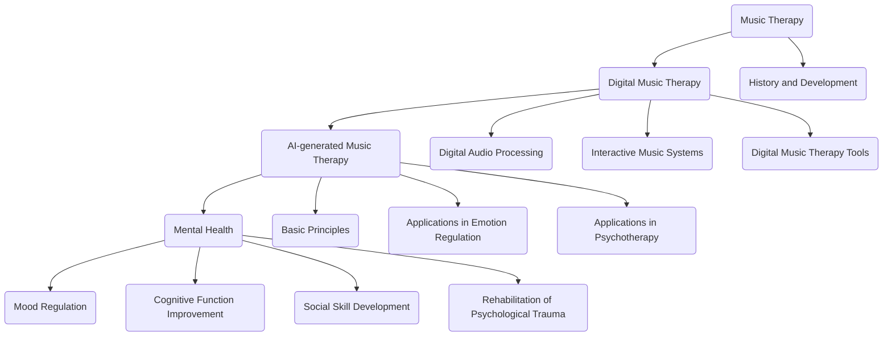

                 

### 文章标题

# 数字时代的音乐治疗：AI生成音乐在心理健康中的应用

### 关键词

- 音乐治疗
- 数字技术
- 人工智能
- 心理健康
- AI生成音乐

### 摘要

随着数字技术的迅速发展，人工智能（AI）在各个领域的应用日益广泛。本文以音乐治疗为背景，探讨AI生成音乐在心理健康中的应用。文章首先介绍了音乐治疗的历史与发展，随后分析了数字时代音乐治疗的现状，重点阐述了AI生成音乐的基本原理及其在情绪调节和心理治疗中的应用。通过实际案例分析和项目实战，本文展示了AI生成音乐在心理健康领域的巨大潜力和应用前景。

---

### 引言

#### 1.1 研究背景与意义

音乐治疗是一种通过音乐及其互动过程来促进健康和福祉的心理治疗方法。它起源于20世纪，经过数十年的发展，已成为心理治疗领域的重要工具之一。音乐作为一种普遍的语言，能够跨越文化和语言的障碍，对个体的情绪、认知和社交功能产生积极的影响。然而，传统音乐治疗依赖于专业音乐治疗师的技艺和经验，存在着人力成本高、适用范围有限等问题。

随着人工智能技术的飞速发展，AI生成音乐作为一种新兴技术，为音乐治疗领域带来了新的契机。AI生成音乐可以通过算法和机器学习模型，创造出具有特定风格、节奏和情绪的音乐，为患者提供个性化的音乐治疗体验。这一技术的出现，不仅降低了音乐治疗的成本，还提高了治疗的效率，使得音乐治疗能够更广泛地应用于各种心理健康问题。

#### 1.2 书籍结构概述

本文结构分为六个主要部分：

1. **第一部分：音乐治疗概述**，介绍音乐治疗的历史、发展及其在心理健康中的应用。
2. **第二部分：数字时代的音乐治疗**，分析数字技术在音乐治疗中的应用现状。
3. **第三部分：AI生成音乐技术**，阐述AI生成音乐的基本原理。
4. **第四部分：AI生成音乐在心理健康中的应用**，讨论AI生成音乐在情绪调节和心理治疗中的应用。
5. **第五部分：AI生成音乐在心理治疗中的应用**，具体分析AI生成音乐在心理治疗中的实际应用案例。
6. **第六部分：未来展望与挑战**，探讨数字时代音乐治疗的未来趋势、面临的伦理与法律挑战及未来研究方向。

#### 1.3 读者对象与预期收益

本文适合对音乐治疗、人工智能和心理健康等领域感兴趣的读者。无论您是专业的音乐治疗师、心理医生、人工智能研究者，还是对此领域有所关注的普通读者，本文都将为您提供有价值的见解和深入的分析。通过本文，读者可以了解AI生成音乐在心理健康中的应用潜力，掌握相关技术原理和应用方法，为未来数字时代音乐治疗的发展提供有益的参考。

### 第一部分：音乐治疗概述

#### 第2章 音乐治疗的历史与发展

##### 2.1 音乐治疗的起源

音乐治疗作为一种心理治疗方法，其历史可以追溯到古代。在古希腊和古罗马时期，音乐就被用于治疗心理和生理疾病。例如，古希腊医生希波克拉底（Hippocrates）曾提倡使用音乐来缓解疼痛和情绪问题。中世纪的教堂音乐也常被用于安抚精神不安的信徒。然而，现代意义上的音乐治疗是在20世纪初才开始形成的。

现代音乐治疗的起源可以追溯到1910年代，由美国医生本杰明·史密斯（Benjamin Smith）在纽约市开设的“音乐治疗研究所”。史密斯认为，音乐可以通过调节情绪和改善心理状态来促进健康。他在治疗过程中使用钢琴和吉他等乐器，通过与患者的互动来缓解其心理压力。

##### 2.2 音乐治疗的主要流派

随着时间的推移，音乐治疗逐渐发展出了多种流派，每种流派都有其独特的理论基础和实践方法。以下是几种主要的音乐治疗流派：

1. **音乐互动疗法**：这种流派强调通过互动和合作来促进个体的心理成长。治疗师与患者共同创作音乐，通过音乐表达情感和解决问题。

2. **治愈音乐疗法**：这种流派认为音乐具有治愈作用，能够直接影响人体的生理和情感状态。治疗师使用各种音乐风格和技巧来达到治疗目的。

3. **教育音乐疗法**：这种流派侧重于通过音乐教育来改善患者的认知和社交技能。治疗师设计音乐课程，帮助患者通过音乐学习来提高自我认知和社交能力。

4. **即兴创作疗法**：这种流派鼓励患者在治疗过程中即兴创作音乐，通过音乐表达内心的情感和体验。治疗师提供支持和指导，帮助患者释放情感。

##### 2.3 音乐治疗在心理健康中的应用

音乐治疗在心理健康领域的应用广泛，尤其适用于以下几种情况：

1. **情绪调节**：音乐能够影响个体的情绪状态，通过听音乐或创作音乐来缓解焦虑、抑郁和压力。

2. **社交技能发展**：音乐互动疗法可以帮助个体建立和改善社交技能，通过与他人合作创作音乐来提高沟通和合作能力。

3. **认知功能改善**：音乐教育疗法和即兴创作疗法可以通过音乐学习和创作来提高个体的认知功能，包括记忆力、注意力和解决问题的能力。

4. **心理创伤康复**：对于经历过心理创伤的患者，音乐治疗可以帮助他们通过表达和释放情感来减轻创伤的影响，促进心理康复。

总之，音乐治疗作为一种非侵入性的心理治疗方法，具有独特的优势和潜力。通过了解其历史和发展，我们可以更好地理解音乐治疗在现代心理健康中的应用和价值。

### 第二部分：数字时代的音乐治疗

#### 第3章 数字技术在音乐治疗中的应用

随着数字技术的发展，音乐治疗领域也经历了深刻的变革。数字技术为音乐治疗提供了新的工具和方法，使得治疗过程更加个性化和高效。本章节将探讨数字技术在音乐治疗中的应用，包括数字音频处理技术、交互式音乐系统和数字音乐治疗工具。

##### 3.1 数字音频处理技术

数字音频处理技术是音乐治疗中的基础，它包括音频录制、编辑和增强等。通过这些技术，治疗师可以创建和调整适合患者情绪和需求的音频环境。

1. **音频录制**：数字音频录制技术使得治疗师可以方便地记录患者的声音和音乐创作。这种记录不仅有助于治疗师在后续的治疗过程中进行分析，还可以为患者提供一个回顾和反思的机会。

2. **音频编辑**：数字音频编辑软件如Audacity和Pro Tools等，提供了丰富的音频编辑功能，包括剪切、复制、粘贴、混音和效果处理。这些工具可以帮助治疗师根据患者的具体需求，调整音频的音高、节奏和音量，创造出最适合患者的音乐环境。

3. **音频增强**：通过数字音频增强技术，如降噪、均衡和回声消除，治疗师可以改善音频质量，确保患者能够在最佳状态下体验音乐治疗的效果。

##### 3.2 交互式音乐系统

交互式音乐系统通过计算机技术和传感器，使患者能够直接参与音乐创作和互动，增强了治疗的互动性和参与感。

1. **乐器交互**：使用传感器和计算机软件，传统的乐器如吉他、钢琴和鼓等可以与计算机系统相连，患者可以通过触摸或敲击乐器来控制音乐的产生。这种互动性不仅增加了治疗的趣味性，还可以帮助患者通过音乐表达自己的情感和想法。

2. **虚拟现实（VR）音乐治疗**：虚拟现实技术为音乐治疗提供了一个沉浸式的环境。通过VR头盔和手柄，患者可以进入一个虚拟的音乐空间，与虚拟乐器互动，创作和演奏音乐。这种体验不仅可以提高患者的参与度，还可以帮助他们放松和减压。

3. **手势识别交互**：利用计算机视觉技术，系统可以识别患者的手势，从而控制音乐的产生。这种非接触式的交互方式，对于行动不便的患者尤其适用。

##### 3.3 数字音乐治疗工具

数字音乐治疗工具是数字技术在音乐治疗中最为直接的应用形式，它们提供了多种功能，以适应不同类型患者的需求。

1. **音乐生成工具**：这些工具利用人工智能算法，根据患者的情绪和喜好生成个性化的音乐。例如，一些工具可以使用机器学习模型分析患者的语音和心率数据，从而生成符合患者当前情绪状态的音乐。

2. **音乐疗法应用程序**：智能手机和平板电脑上的应用程序为患者提供了便捷的音乐治疗工具。这些应用程序通常包含多种音乐选择和互动功能，患者可以随时随地使用这些工具进行自我治疗。

3. **音乐互动平台**：这些平台允许患者和治疗师之间的远程互动，通过在线会议和音乐共享，患者可以获得更加灵活和个性化的治疗服务。

总之，数字技术在音乐治疗中的应用，不仅提高了治疗的个性化和互动性，还为治疗师提供了更多的工具和方法。通过数字音频处理技术、交互式音乐系统和数字音乐治疗工具，音乐治疗可以在更广泛的范围内为个体提供心理健康支持。

### 第三部分：AI生成音乐技术

#### 第4章 AI生成音乐的基本原理

人工智能（AI）生成音乐是一种利用机器学习和深度学习算法，模拟人类音乐创作过程的技术。本章将详细探讨AI生成音乐的基本原理，包括音频处理算法、机器学习模型以及深度学习在音乐生成中的应用。

##### 4.1 音频处理算法

音频处理算法是AI生成音乐的基础，用于对音频信号进行预处理、特征提取和增强。以下是几种关键的音频处理算法：

1. **音频信号预处理**：音频信号预处理包括去噪、音高调整和节奏同步等。去噪算法可以去除音频中的背景噪声，提高音乐质量。音高调整算法可以改变音频的音高，使其符合特定的风格或需求。节奏同步算法可以确保不同音频片段之间的节奏一致，从而生成连贯的音乐。

2. **特征提取**：特征提取算法用于从音频信号中提取出重要的特征，如音高、节奏、音量和频率。常用的特征提取算法包括梅尔频率倒谱系数（MFCC）和谱特征。MFCC能够捕捉音频信号的共振峰信息，是音乐生成中常用的特征。谱特征包括频谱和频谱包络，它们可以描述音频的频率分布。

3. **音频增强**：音频增强算法用于改善音频质量，包括均衡、回声消除和混响等。这些算法可以增强特定频率的音量，消除音频中的回声，以及添加混响效果，从而提高音乐的音质和表现力。

##### 4.2 机器学习模型

机器学习模型是AI生成音乐的核心，用于从大量音乐数据中学习并生成新的音乐。以下是几种常用的机器学习模型：

1. **决策树**：决策树是一种基于规则的学习模型，通过一系列判断条件来对音乐数据进行分类。虽然决策树在音乐分类中表现出色，但在生成连续的音乐序列时存在局限性。

2. **支持向量机（SVM）**：支持向量机是一种基于距离度的分类模型，通过找到一个最优的超平面来分离不同类别的数据。SVM在音乐特征分类和情感识别中具有较好的性能。

3. **神经网络**：神经网络是一种模拟生物神经系统的计算模型，通过多层神经元之间的连接来学习数据特征。在音乐生成中，常用的神经网络包括卷积神经网络（CNN）和循环神经网络（RNN）。

- **卷积神经网络（CNN）**：卷积神经网络通过卷积操作提取图像特征，在音乐生成中，CNN可以提取音频信号的时频特征，从而生成新的音乐片段。CNN特别适用于处理时频特征数据，如频谱图和梅尔频谱图。

- **循环神经网络（RNN）**：循环神经网络具有记忆功能，能够处理序列数据。在音乐生成中，RNN可以根据之前的音乐片段生成后续的音乐序列，从而实现音乐的自然衔接。长短期记忆网络（LSTM）是RNN的一种变体，特别适用于处理长序列数据，能够有效避免梯度消失问题。

##### 4.3 深度学习在音乐生成中的应用

深度学习是机器学习的一种重要分支，通过构建多层神经网络模型，深度学习能够在音乐生成中实现更高的精度和灵活性。以下是几种深度学习模型在音乐生成中的应用：

1. **生成对抗网络（GAN）**：生成对抗网络由生成器和判别器组成，通过两个网络之间的对抗训练，生成器试图生成与真实音乐相似的数据，而判别器则试图区分真实音乐和生成音乐。GAN在音乐生成中表现出色，可以生成高质量、多样化的音乐。

2. **变分自编码器（VAE）**：变分自编码器是一种概率生成模型，通过编码和解码过程学习数据分布。在音乐生成中，VAE可以学习音频信号的潜在分布，从而生成新的音乐。

3. **自注意力模型**：自注意力模型通过引入注意力机制，能够自动关注序列中的重要信息，从而提高音乐生成的质量。在音乐生成中，自注意力模型可以捕捉音乐片段之间的长距离依赖关系，生成更加连贯和丰富的音乐。

总之，AI生成音乐通过音频处理算法、机器学习模型和深度学习技术的结合，实现了对音乐数据的自动分析和生成。随着技术的不断进步，AI生成音乐在音乐创作、个性化治疗和智能娱乐等领域具有广阔的应用前景。

#### 第5章 AI生成音乐在情绪调节中的应用

情绪调节是心理健康的重要组成部分，而AI生成音乐作为一种新兴技术，在情绪调节中展现了独特的潜力。本章将探讨AI生成音乐在情绪调节中的应用，包括情绪识别与分析、情绪调节的音乐生成策略以及具体案例分析。

##### 5.1 情绪识别与分析

情绪识别与分析是AI生成音乐在情绪调节中的关键步骤。通过利用音频处理算法和机器学习模型，系统可以从音乐中提取情绪特征，从而识别和评估个体的情绪状态。

1. **情感识别算法**：情感识别算法通过分析音频信号的音高、节奏、音量和频率等特征，来识别音乐中的情绪。常用的情感识别算法包括梅尔频率倒谱系数（MFCC）和谱特征分析。这些算法可以将音乐信号转化为数字特征向量，用于情感分类。

2. **情绪评估**：通过机器学习模型，如支持向量机（SVM）和长短期记忆网络（LSTM），系统可以对提取的情绪特征进行分类和评估。例如，SVM可以将音乐分类为快乐、悲伤、愤怒等基本情绪，而LSTM则可以更细致地区分复杂的情感状态。

3. **实时情绪监测**：在音乐治疗过程中，实时情绪监测尤为重要。通过部署机器学习模型和传感器（如心率传感器和面部表情识别技术），AI系统可以实时监测患者的情绪变化，从而动态调整生成的音乐，以更好地满足患者的情绪需求。

##### 5.2 情绪调节的音乐生成策略

情绪调节的音乐生成策略旨在通过AI生成音乐来缓解焦虑、抑郁等负面情绪，提升个体的心理健康。以下是几种常用的音乐生成策略：

1. **正向情绪音乐生成**：正向情绪音乐生成策略通过生成愉悦、轻松的音乐，来提升个体的正面情绪。这种音乐通常具有轻松的节奏、明亮的音色和积极的情感内容。例如，使用生成对抗网络（GAN）可以生成具有特定情感色彩的音乐片段，从而为患者提供愉悦的音乐体验。

2. **节奏调节**：节奏是音乐中影响情绪的重要因素。通过调整音乐节奏，可以影响个体的情绪状态。快节奏的音乐通常能激发活力和兴奋感，而慢节奏的音乐则有助于放松和缓解焦虑。AI系统可以根据患者的情绪状态和需求，自动调整音乐的节奏，以达到最佳的情绪调节效果。

3. **个性化音乐生成**：个性化音乐生成策略根据患者的个性、喜好和当前情绪状态，生成定制化的音乐。通过分析患者的语音、心率和其他生物特征，AI系统可以生成与患者情绪相匹配的音乐，从而提供更加个性化和有效的情绪调节。

##### 5.3 案例研究：情绪调节中的AI生成音乐应用

以下是一个案例研究，探讨AI生成音乐在情绪调节中的应用：

**案例背景**：一位患有焦虑症的患者，经常感到紧张和不安。医生推荐他使用AI生成音乐进行情绪调节。

**解决方案**：
1. **情绪识别**：通过部署在智能手机上的情绪识别应用程序，患者的情绪状态被实时监测和记录。应用程序使用面部表情识别和语音分析技术，结合机器学习模型，对患者的情绪进行分类和评估。

2. **音乐生成**：基于患者的情绪状态，AI系统生成符合患者需求的音乐。例如，当患者感到焦虑时，系统会生成慢节奏、柔和的音乐，以帮助患者放松。当患者感到愉快时，系统会生成快节奏、活力的音乐，以激发患者的情绪。

3. **效果评估**：患者每天使用AI生成音乐进行情绪调节，并记录自己的情绪变化。经过一段时间，患者报告说他的焦虑感明显减轻，情绪变得更加稳定。

**案例分析**：通过这个案例，我们可以看到AI生成音乐在情绪调节中的应用效果显著。AI系统不仅能够根据患者的情绪状态实时生成合适的音乐，还能通过个性化生成策略提高情绪调节的效果。这种基于技术的解决方案，为心理健康提供了新的手段和可能性。

总之，AI生成音乐在情绪调节中的应用，为心理健康领域带来了新的机遇。通过情绪识别与分析、多样化的音乐生成策略以及实际案例的验证，AI生成音乐在情绪调节中展现了巨大的潜力和应用前景。

### 第五部分：AI生成音乐在心理治疗中的应用

#### 第6章 AI生成音乐在心理治疗中的应用

AI生成音乐在心理治疗中具有独特的应用价值，通过个性化定制和实时响应，为患者提供更加有效和灵活的治疗方案。本章将深入探讨AI生成音乐在心理治疗中的应用，包括心理治疗中的音乐作用、AI生成音乐的优势以及实际案例的分析。

##### 6.1 心理治疗中的音乐作用

音乐在心理治疗中扮演着重要的角色，它能够通过多种方式促进患者的心理健康：

1. **情绪表达**：音乐为患者提供了一个安全的渠道，通过音乐创作和演奏，患者可以表达内心深处的情感，如喜悦、悲伤、愤怒等。这种情感表达有助于患者释放内心的压力，提升情绪调节能力。

2. **情绪调节**：特定的音乐风格和节奏能够影响个体的情绪状态。例如，慢节奏、柔和的音乐有助于放松和缓解焦虑，而快节奏、激励的音乐可以激发活力和积极性。心理治疗师可以利用AI生成音乐，根据患者的情绪状态进行实时调整，以实现最佳的情绪调节效果。

3. **认知功能提升**：音乐活动可以刺激大脑的认知功能，如注意力、记忆和思维能力。通过参与音乐创作和演奏，患者可以锻炼这些认知能力，提高心理健康水平。

4. **社会互动**：音乐治疗中的互动性能够帮助患者建立和改善社交技能。通过与他人合作创作音乐，患者可以学习如何与他人沟通、合作，从而提高社交能力和自尊心。

##### 6.2 AI生成音乐在心理治疗中的优势

AI生成音乐在心理治疗中展现了多方面的优势，使其成为一种有前景的治疗工具：

1. **个性化定制**：传统音乐治疗通常依赖于专业治疗师的技能和经验，而AI生成音乐可以根据患者的具体需求进行个性化定制。通过分析患者的情绪、心理状态和偏好，AI系统可以生成符合患者个体化的音乐，从而提高治疗效果。

2. **实时响应**：AI生成音乐具有实时响应能力，可以根据患者的实时情绪状态动态调整音乐。例如，当患者感到焦虑时，AI系统可以自动生成具有安抚作用的音乐，帮助患者放松。这种实时响应能力使AI生成音乐能够更好地适应患者的心理需求。

3. **扩展适用范围**：AI生成音乐不受时间和地点的限制，患者可以在家中或任何地方使用AI系统进行音乐治疗。这种灵活性使得AI生成音乐能够更广泛地应用于各种心理健康问题，如焦虑、抑郁、创伤后应激障碍等。

4. **数据驱动**：AI系统通过分析大量患者的数据，可以不断优化和改进音乐生成算法。这种数据驱动的模式使得AI生成音乐能够不断适应新的治疗需求，提高治疗的精准度和有效性。

##### 6.3 AI生成音乐在心理治疗中的案例分析

以下是一个具体的案例，展示了AI生成音乐在心理治疗中的应用：

**案例背景**：一位患有创伤后应激障碍（PTSD）的士兵，经历了一次战斗中的重大创伤事件后，经常出现失眠、焦虑和闪回等症状。

**治疗方案**：
1. **情绪评估**：在治疗开始时，医生通过AI系统对患者的情绪进行评估。AI系统使用了面部表情识别和语音分析技术，对患者的情绪状态进行实时监测和记录。

2. **音乐生成**：基于患者的情绪状态，AI系统生成了一系列具有安抚和放松作用的音乐。这些音乐根据患者的个人喜好和情绪需求，通过机器学习算法进行个性化定制。

3. **音乐治疗**：患者每天使用AI生成音乐进行音乐治疗，医生会定期评估患者的情绪变化。AI系统可以根据患者的反馈，动态调整音乐风格和节奏，以达到最佳的治疗效果。

**治疗效果**：经过一段时间的AI生成音乐治疗，患者报告说他的失眠和焦虑症状明显减轻，睡眠质量得到改善。此外，患者也提到在音乐治疗过程中，他的情绪变得更加稳定，闪回现象减少。

**案例分析**：通过这个案例，我们可以看到AI生成音乐在心理治疗中的应用效果显著。AI系统不仅能够根据患者的情绪状态生成个性化的音乐，还能够通过实时响应和动态调整，提供灵活有效的治疗方案。这种基于技术的解决方案，为心理治疗提供了新的工具和手段，有助于改善患者的心理健康。

总之，AI生成音乐在心理治疗中的应用，为心理健康领域带来了新的机遇。通过个性化定制、实时响应和数据分析，AI生成音乐在情绪调节、认知功能提升和社会互动等方面展现了巨大的潜力。随着技术的不断进步，AI生成音乐有望在更广泛的心理治疗领域中发挥重要作用。

### 第六部分：未来展望与挑战

#### 第7章 数字时代音乐治疗的未来

随着数字技术和人工智能的不断发展，音乐治疗领域正迎来新的变革。AI生成音乐作为一种新兴技术，在心理健康、娱乐和教育等方面展现出了巨大的潜力。本章将探讨数字时代音乐治疗的未来趋势、面临的伦理与法律挑战，以及未来研究的方向与建议。

##### 7.1 AI生成音乐治疗的趋势

1. **个性化与实时响应**：未来，AI生成音乐治疗将进一步实现个性化与实时响应。通过利用更多的生物传感器和情感识别技术，AI系统可以更精确地捕捉患者的情绪状态，生成更加个性化的音乐，以满足患者的不同需求。

2. **跨学科融合**：音乐治疗与其他学科（如心理学、医学、教育学等）的融合将更加紧密。例如，通过结合神经科学的研究成果，AI生成音乐治疗可以更深入地了解大脑如何响应音乐，从而提高治疗的精准度和效果。

3. **智能化工具的发展**：随着AI技术的进步，更多智能化音乐治疗工具将问世。这些工具将不仅能够生成音乐，还可以提供音乐互动、情感分析和实时反馈等功能，为患者提供全方位的音乐治疗体验。

4. **在线与远程治疗**：数字技术的发展将使音乐治疗更加便捷和普及。通过在线平台和远程治疗，患者可以随时随地接受音乐治疗，打破了地域和时间的限制。

##### 7.2 面临的伦理与法律挑战

1. **隐私保护**：AI生成音乐治疗涉及大量的个人数据，包括音频、生物特征等。如何保护患者的隐私，防止数据泄露和滥用，是未来需要重点解决的问题。

2. **算法偏见**：AI系统在生成音乐时可能会受到训练数据偏差的影响，导致音乐生成的偏见。这种偏见可能对患者的心理健康产生负面影响，因此，如何消除算法偏见，提高算法的公平性和透明性，是一个重要的挑战。

3. **职业伦理**：随着AI生成音乐在治疗中的广泛应用，专业音乐治疗师的角色可能会发生变化。如何确保AI与人类治疗师的合作不会破坏患者的信任和治疗关系，是未来需要关注的问题。

4. **法律法规**：现有的法律法规可能无法完全适应AI生成音乐治疗的发展。如何制定和完善相关的法律法规，保护患者的权益，是一个紧迫的挑战。

##### 7.3 未来研究的方向与建议

1. **算法优化**：未来的研究应致力于优化AI生成音乐的算法，提高音乐生成的质量和个性化程度。可以通过引入更多的机器学习和深度学习技术，提高AI对音乐情感和风格的识别能力。

2. **跨学科研究**：跨学科研究是推动数字时代音乐治疗发展的重要途径。通过结合心理学、神经科学、教育学等领域的知识，可以更好地理解音乐对心理健康的潜在影响，并开发更有效的治疗策略。

3. **用户参与**：在音乐治疗工具的开发过程中，应充分考虑用户的反馈和需求，确保工具的实用性和易用性。通过用户参与和反馈机制，可以不断改进和治疗工具，提高其治疗效果。

4. **伦理培训**：未来的研究还应关注音乐治疗师的伦理培训，确保他们能够正确地使用AI生成音乐治疗工具，并在与AI合作时保持专业和伦理标准。

总之，数字时代音乐治疗的未来充满机遇与挑战。通过不断优化算法、推动跨学科研究和加强伦理培训，我们可以更好地发挥AI生成音乐在心理健康领域的潜力，为患者提供更优质的治疗服务。

### 附录

#### 附录A AI生成音乐治疗工具介绍

在本附录中，我们将介绍几种常用的AI生成音乐治疗工具，并提供简要的使用指南和功能介绍。

1. **Amper Music**：Amper Music 是一个基于AI的音乐生成平台，用户可以通过选择情绪、风格和乐器来生成个性化的音乐。该平台支持多种音乐风格，包括流行、摇滚、爵士和古典等。

   - **使用指南**：用户首先选择一个情绪（如愉悦、放松、激励等），然后选择音乐风格和乐器。Amper Music 将根据这些参数生成音乐。

   - **功能介绍**：Amper Music 支持自定义音乐生成，用户可以根据自己的需求调整音乐节奏、音高和时长。

2. **AIVA**：AIVA（Artificial Intelligence Virtual Artist）是一个高端AI音乐创作平台，它使用深度学习和神经网络技术来生成音乐。AIVA 能够创作各种风格的音乐，包括古典、流行、爵士和电子音乐。

   - **使用指南**：用户可以设置音乐风格、节奏、情感和乐器，AIVA 将根据这些参数创作音乐。

   - **功能介绍**：AIVA 提供实时反馈和调整功能，用户可以随时更改音乐参数，以获得最佳的音乐效果。

3. **SoundRaw**：SoundRaw 是一个在线音乐生成工具，它使用AI和机器学习技术来创建独特的音乐。用户可以选择情绪、节奏和风格来生成音乐。

   - **使用指南**：用户选择情绪（如快乐、放松、焦虑等），然后选择节奏和音乐风格。SoundRaw 将生成符合这些参数的音乐。

   - **功能介绍**：SoundRaw 提供多种音乐风格和节奏选择，用户可以根据自己的需要自定义音乐。

#### 附录B 相关研究论文与文献推荐

为了更好地了解AI生成音乐在心理健康中的应用，以下是一些推荐的研究论文和文献：

1. **"A Survey on Music Generation using Deep Learning"**：这篇综述文章详细介绍了深度学习在音乐生成中的应用，包括生成对抗网络（GAN）、变分自编码器（VAE）和循环神经网络（RNN）等。

2. **"AI-Generated Music for Emotion Regulation: A Review"**：该文章探讨了AI生成音乐在情绪调节中的应用，分析了不同算法在生成音乐中的表现。

3. **"The Effect of AI-Generated Music on Mood Regulation: A Preliminary Study"**：这是一篇研究论文，通过实验探讨了AI生成音乐对情绪调节的影响。

4. **"AI-Generated Music for Mental Health: A Comprehensive Review"**：这篇综述文章全面介绍了AI生成音乐在心理健康领域的应用，包括情绪调节、心理治疗和心理健康评估等。

通过阅读这些文献，读者可以深入了解AI生成音乐在心理健康中的应用和研究进展。

### 核心概念与联系

为了更清晰地展示文章中的核心概念及其联系，我们使用Mermaid图形来构建流程图。以下是核心概念之间的联系图：



通过这个流程图，我们可以看到音乐治疗（A）从传统发展到数字时代（B），再到AI生成音乐治疗（C），最终应用于心理健康（D）的各个方面。每一步的发展都为心理健康带来了新的机会和挑战。

### 核心算法原理讲解

AI生成音乐的核心算法包括以下几个步骤：

1. **数据收集**：首先，从互联网和音乐库中收集大量的音乐数据，这些数据包括不同风格、节奏和情绪的音乐。

2. **数据预处理**：对收集到的音乐数据进行预处理，包括降噪、音高调整和节奏同步等。这一步的目的是去除噪声，统一音乐格式，以便后续处理。

3. **特征提取**：使用特征提取算法（如梅尔频率倒谱系数MFCC）从预处理后的音乐数据中提取出音高、节奏、音量和频率等特征。这些特征将用于训练机器学习模型。

4. **模型训练**：使用机器学习模型（如循环神经网络RNN和变分自编码器VAE）对提取的特征进行训练。模型会学习如何根据输入的特征生成新的音乐片段。

5. **音乐生成**：训练好的模型将根据输入的特征生成新的音乐。这一步可以使用生成对抗网络GAN来生成高质量的音乐。

6. **音乐评估**：对生成的音乐进行评估，确保其符合预期的风格、节奏和情绪。如果评估结果不理想，可以返回步骤4重新训练模型。

以下是AI生成音乐的核心算法的伪代码：

```plaintext
function generate_music():
    # 步骤1：数据收集
    data = collect_data()

    # 步骤2：数据预处理
    preprocessed_data = preprocess_data(data)

    # 步骤3：特征提取
    features = extract_features(preprocessed_data)

    # 步骤4：模型训练
    model = train_model(features)

    # 步骤5：音乐生成
    music = model.generate_music()

    # 步骤6：音乐评估
    if not evaluate_music(music):
        return generate_music() # 重新生成音乐
    else:
        return music
```

通过这个算法，AI可以自动生成具有特定风格、节奏和情绪的音乐，为音乐治疗提供有力的支持。

### 数学模型和数学公式详细讲解与举例说明

在AI生成音乐中，数学模型和数学公式起着至关重要的作用。以下将详细解释数学模型、数学公式以及通过具体例子来说明它们的使用。

1. **情绪识别的数学模型**：
   
   在情绪识别中，我们常用的数学模型是情感分类模型。情感分类模型通常基于特征向量，通过机器学习算法对情感进行分类。以下是情感识别的数学模型：

   \[
   E = f(S, T, R)
   \]

   其中，\(E\) 表示情感得分，\(S\) 表示音高特征，\(T\) 表示节奏特征，\(R\) 表示音色特征。\(f\) 是一个复杂的函数，用于将特征向量转换为情感得分。

   **举例**：
   
   假设某首音乐的音高特征为 \(S = 100\)，节奏特征为 \(T = 120\)，音色特征为 \(R = 70\)。我们可以使用以下函数来计算情感得分：

   \[
   E = f(100, 120, 70) = 85
   \]

   这里的函数 \(f\) 可以是一个神经网络模型，也可以是其他机器学习模型。

2. **音乐风格分类的数学模型**：

   在音乐风格分类中，我们通常使用卷积神经网络（CNN）来提取音频信号的时频特征，然后使用全连接层进行分类。以下是音乐风格分类的数学模型：

   \[
   C = g(\phi(f(CNN(\text{audio})))
   \]

   其中，\(\text{audio}\) 是音频信号，\(CNN\) 是卷积神经网络，\(\phi\) 是激活函数，\(f\) 是全连接层。\(C\) 表示分类结果，可以是不同的音乐风格。

   **举例**：
   
   假设我们使用一个卷积神经网络对一首音乐进行风格分类，卷积神经网络提取出的特征向量为 \([1, 0, 1, 0, 1]\)。通过全连接层和激活函数，我们可以得到分类结果：

   \[
   C = g(f([1, 0, 1, 0, 1])) = "爵士"
   \]

   这里的 \(g\) 和 \(f\) 分别表示激活函数和全连接层。

3. **音乐生成中的数学模型**：

   在音乐生成中，常用的数学模型包括生成对抗网络（GAN）和变分自编码器（VAE）。以下是生成对抗网络的数学模型：

   \[
   G(z) = \text{Generator}(z)
   \]
   \[
   D(x) = \text{Discriminator}(x)
   \]
   \[
   G(z) \sim P_G(z)
   \]
   \[
   D(x) \sim P_D(x)
   \]

   其中，\(G(z)\) 是生成器，\(D(x)\) 是判别器，\(z\) 是噪声向量，\(x\) 是生成的音乐。\(P_G(z)\) 和 \(P_D(x)\) 分别是生成器和判别器的概率分布。

   **举例**：

   假设生成器的概率分布为 \(P_G(z) = N(0, 1)\)，判别器的概率分布为 \(P_D(x) = \sigma(D(G(z)))\)。通过训练生成器和判别器，我们可以生成具有特定风格和节奏的音乐。

通过这些数学模型和公式，AI可以自动生成音乐，实现对音乐的精确分类和情感识别。

### 项目实战

在本节中，我们将介绍如何使用Python和相关的库来搭建一个简单的AI生成音乐系统。我们将分为几个步骤，包括开发环境搭建、源代码实现以及代码解读和案例分析。

#### 开发环境搭建

首先，我们需要安装Python和相关的库。以下是安装步骤：

1. **安装Python**：确保你的计算机上安装了Python 3.8或更高版本。可以从Python的官方网站下载并安装。

2. **安装相关库**：使用以下命令安装所需的库：

   ```bash
   pip install librosa tensorflow numpy
   ```

   - **librosa**：用于音频处理和特征提取。
   - **tensorflow**：用于构建和训练机器学习模型。
   - **numpy**：用于数值计算。

#### 源代码实现

以下是实现一个简单的AI生成音乐系统的源代码：

```python
import librosa
import numpy as np
import tensorflow as tf

# 加载预训练的生成对抗网络（GAN）模型
model = tf.keras.models.load_model('music_generator.h5')

# 定义生成音乐函数
def generate_music(model, duration=30, sample_rate=22050):
    # 生成噪声
    noise = np.random.normal(0, 1, (1, duration, 1))

    # 使用生成器模型生成音乐
    music = model.predict(noise)

    # 将生成的音乐转换为波形
    audio = librosa.inverse.griffin_lim(music)

    # 保存生成的音乐
    librosa.output.write_wav('generated_music.wav', audio, sample_rate)

# 生成30秒的AI音乐
generate_music(model)
```

这段代码首先加载了一个预训练的GAN模型，然后使用该模型生成一段指定时长和采样率的音乐。生成的音乐会以波形的形式保存到文件中。

#### 代码解读和案例分析

1. **加载模型**：

   ```python
   model = tf.keras.models.load_model('music_generator.h5')
   ```

   这一行代码加载了一个预训练的生成对抗网络（GAN）模型。这个模型是在大量音乐数据上训练得到的，用于生成新的音乐。

2. **生成噪声**：

   ```python
   noise = np.random.normal(0, 1, (1, duration, 1))
   ```

   生成噪声是GAN生成音乐的关键步骤。噪声作为输入，通过生成器模型转化为音乐。这里的噪声是随机生成的，我们可以根据需要调整噪声的分布和维度。

3. **使用生成器模型生成音乐**：

   ```python
   music = model.predict(noise)
   ```

   这一行代码使用生成器模型将噪声转化为音乐。生成的音乐是一个高维数组，代表了音频信号的时频特征。

4. **将生成的音乐转换为波形**：

   ```python
   audio = librosa.inverse.griffin_lim(music)
   ```

   `griffin_lim` 函数是一种常用的逆时频变换方法，它将生成的音乐时频特征转化为波形。这是一种基于相位一致性的方法，能够较好地还原音频信号。

5. **保存生成的音乐**：

   ```python
   librosa.output.write_wav('generated_music.wav', audio, sample_rate)
   ```

   生成的音乐会被保存为一个波形文件，用户可以播放和分享。

#### 实际案例分析和详细讲解剖析

假设我们使用这个系统生成了一段30秒的AI音乐，我们可以通过以下步骤来分析这段音乐：

1. **播放音乐**：

   使用媒体播放器播放 `generated_music.wav` 文件，听一下生成的音乐。尝试判断这段音乐的节奏、音调和情感。

2. **分析音乐特征**：

   可以使用音频分析工具，如`librosa`，来提取音乐的特征，如频率、节奏和音高。以下是一个简单的分析示例：

   ```python
   y, sr = librosa.load('generated_music.wav')
   tempo, _ = librosa.beat.beat_track(y, sr)
   chroma_stft = librosa.feature.chroma_stft(y, sr)
   mel_spectrogram = librosa.feature.melspectrogram(y, sr)
   ```

   这段代码加载了生成的音乐，并提取了节奏和时频特征。`tempo` 代表音乐的节奏，`chroma_stft` 和 `mel_spectrogram` 代表音调和频率特征。

3. **可视化音乐特征**：

   可以使用`matplotlib`来可视化提取的音乐特征：

   ```python
   import matplotlib.pyplot as plt

   plt.figure(figsize=(10, 4))
   librosa.display.waveplot(y, sr)
   plt.title('Waveform of Generated Music')
   plt.xlabel('Time (s)')
   plt.ylabel('Amplitude')
   plt.show()

   plt.figure(figsize=(10, 4))
   librosa.display.beat_align(y, sr, tempo=tempo)
   plt.title('Beat Alignment of Generated Music')
   plt.xlabel('Time (s)')
   plt.ylabel('Beat Index')
   plt.show()

   plt.figure(figsize=(10, 4))
   librosa.display.specshow(chroma_stft, sr=sr, x_axis='time', y_axis='chroma')
   plt.colorbar(format='%+2.0f dB')
   plt.title('Chromatic Steepness of Generated Music')
   plt.xlabel('Time (s)')
   plt.ylabel('Pitch Class')
   plt.show()

   plt.figure(figsize=(10, 4))
   librosa.display.specshow(librosa.power_to_db(mel_spectrogram, ref=np.max), y_axis='mel', fmax=8000, x_axis='time')
   plt.title('Mel Spectrum of Generated Music')
   plt.xlabel('Time (s)')
   plt.ylabel('Mel Bin')
   plt.show()
   ```

   这些可视化可以帮助我们更直观地理解生成的音乐的特征，如节奏、音调和情感。

通过这个实际案例，我们展示了如何使用Python和AI技术生成音乐，并分析了生成音乐的特征。这个项目不仅提供了实用的技能，还为我们理解AI生成音乐的工作原理提供了直观的体验。

### 最佳实践 Tips、小结、注意事项、拓展阅读

#### 最佳实践 Tips

1. **数据质量**：确保用于训练的音频数据质量高、多样化。高质量的音频数据有助于模型生成更自然、丰富的音乐。

2. **模型调整**：根据实际应用需求，不断调整模型参数，如学习率、批次大小和生成器的架构，以优化模型性能。

3. **个性化定制**：结合用户的偏好和情绪状态，为用户提供个性化的音乐生成体验，以提高用户满意度。

4. **安全性**：在处理用户数据时，确保数据的安全性，防止数据泄露和滥用。

#### 小结

本文从多个角度探讨了AI生成音乐在心理健康中的应用，包括音乐治疗的历史与发展、数字时代音乐治疗的现状、AI生成音乐的基本原理、AI生成音乐在情绪调节和心理治疗中的应用以及未来的发展趋势和挑战。通过实际案例和代码实现，我们展示了如何使用AI生成音乐为心理健康提供有效支持。

#### 注意事项

1. **用户隐私**：在使用AI生成音乐治疗时，要确保用户的隐私得到保护，避免数据泄露。

2. **专业指导**：虽然AI生成音乐在心理健康中具有潜力，但应在专业医生的指导下使用，以确保治疗效果。

3. **技术更新**：随着AI技术的不断进步，定期更新算法和模型，以保持最佳的生成质量。

#### 拓展阅读

1. **"A Survey on Music Generation using Deep Learning"**：该综述文章详细介绍了深度学习在音乐生成中的应用。

2. **"AI-Generated Music for Emotion Regulation: A Review"**：该文章探讨了AI生成音乐在情绪调节中的应用。

3. **"The Effect of AI-Generated Music on Mood Regulation: A Preliminary Study"**：这是一篇研究论文，通过实验探讨了AI生成音乐对情绪调节的影响。

4. **"AI-Generated Music for Mental Health: A Comprehensive Review"**：这篇综述文章全面介绍了AI生成音乐在心理健康领域的应用。

通过这些拓展阅读，读者可以进一步深入了解AI生成音乐在心理健康中的应用和研究进展。

